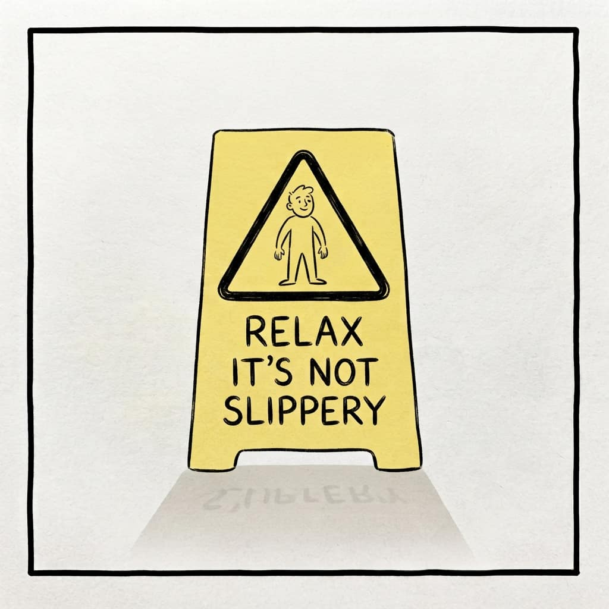
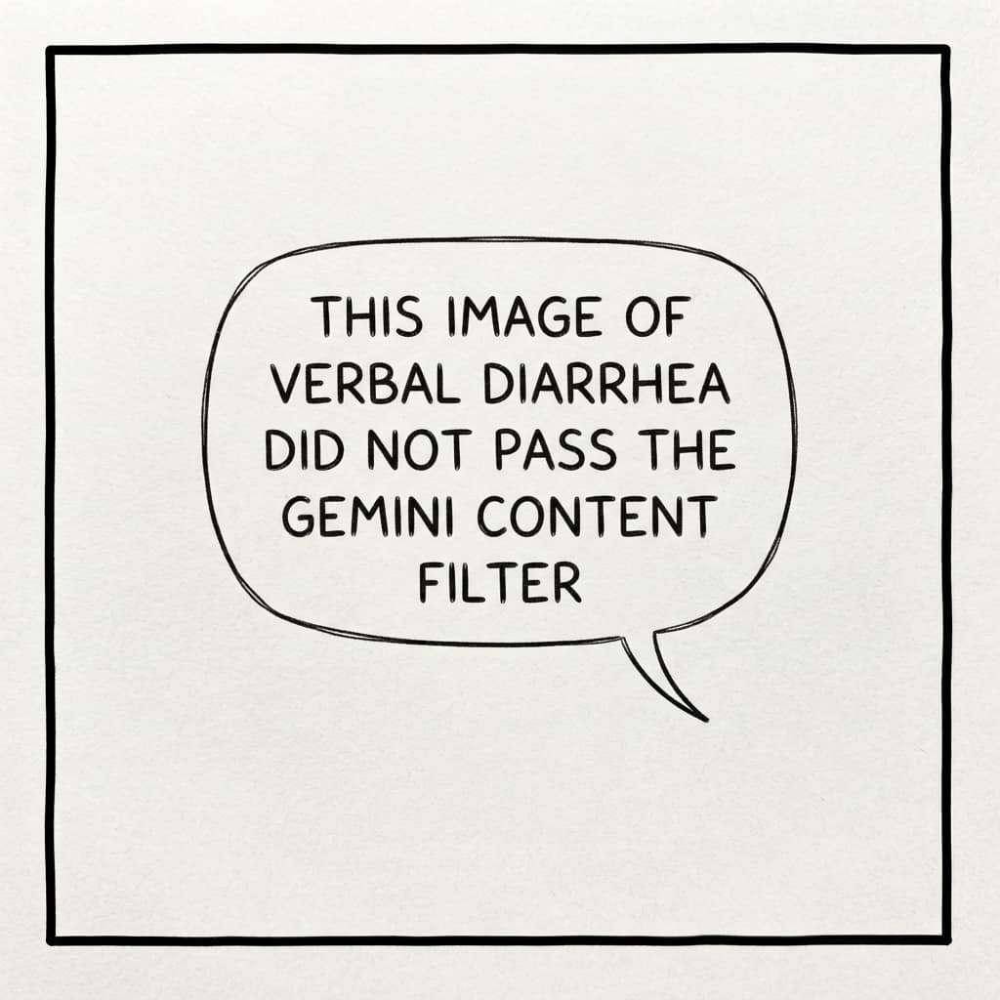

# TEND: four lenses for the prose your agents write

Call everything in your repository that is text but not code **prose**: the documentation files, the docstrings above your function definitions, the comments scattered through the bodies. Somebody has to tend it, and after a few months of agentic work that somebody is you, because your agents have been writing it at a rate no human ever managed.

Run four lenses over every piece of prose an agent produces, every time it produces any. **T**ightness, **E**xistence, **N**egation, **D**urability. They spell TEND, which is a marketing habit I have never fully shaken, and in this case it earns its keep, because four things you can name are four things you will actually check. Mine run as [a skill](https://github.com/vzakharov/muthur/blob/main/.claude/skills/tend-prose/SKILL.md), so that "every time" is one word rather than a resolution.

## Why there is so much of it

Agents write a lot. That on its own would be manageable. What makes it compound is that an agent which opens a repository and finds a great deal of prose already there concludes that this is a place where one writes a great deal of prose, and obliges — something we call [the precedent fallacy](./precedent-fallacy.md).

:::pull-quote
An agent that finds a great deal of prose concludes that this is a place where one writes a great deal of prose, and obliges.
:::

The comments are there, so comments must be what one writes here. Nobody decided that. It simply accumulated, and every new agent reads the accumulation as policy.

## T — tightness

The easy one. Agents write long, and what they have written can usually be cut by thirty per cent, quite often by half, with nothing lost but the reading time.

There is no craft to this lens. It is worth its place because the cut is real and nobody performs it spontaneously.

## E — existence

The second lens asks whether the text needed writing at all.

Take an ordinary branch in a function: if this, do that; otherwise, the other. The code describing it is self-sufficient. We are not writing in Brainfuck; we are writing in TypeScript or Python or Go, and any reader — agent or human — can see what a ten-line branch does without being told first. But agents love to precede each of their decisions with a short account of what they are about to do.

My best guess about why is that the comment is not addressed to the codebase. It is addressed to you: to the person who just handed over the task and is going to read the result. Instead of answering in one message in the chat, the agent answers in the margins of the file, because an agent has exactly as many channels as you have given it, and if the only one open while it works is the file in front of it, then the file in front of it is where the reply goes. This is not chattiness. It is a misrouted message.

## N — negation, or the polar bear

My favourite, and the one I have named after a bear.

Dostoevsky, roughly: set yourself the task of not thinking of a polar bear, and the cursed thing will be in your head every minute.

Here is how it happens. You make a decision about your code, and the decision is unusual, so you write it down. Say you serve images through a resizer of your own instead of your CDN's, and next to that code sits an honest comment: we do it this way because the CDN's resizer ruins transparency. Good comment. Correct comment.

Then the CDN gets better, transparency survives, and you decide to stop being special and do it like everybody else. You hand the task to an agent and it removes the code. But instead of also removing the comment — which was right up until exactly this moment, and is now about nothing — it turns the comment inside out. It writes: we do not route images through our own resizer, because the CDN handles it.

You now have a line describing a situation nobody would ever have imagined, followed by the news that you are not in it. And once you let one of those stand, they breed: the next agent sees this strange, unused thing being discussed, and writes about it too, and eventually a good part of your prose is devoted to hypothetical arrangements about CDNs and transparencies that have never existed and would never have occurred to anyone if not for the bear.

So the rule: if you have flipped a yes to a no, and the no is simply what everyone does by default, delete the line rather than negating it.

Why agents reach for negation over deletion is not mysterious, and it is also why _you_ will hesitate the first few times. Deleting looks like losing information; negating looks like keeping it. What is being kept is a wet-floor sign on a floor that dried an hour ago — and the agent's instinct is not to take it away but to put up a second sign instead, reading "this floor is not slippery".

:::pull-quote
What is being kept is a wet-floor sign on a floor that dried an hour ago.
:::

## D — durability

The last one. My philosophy is that all prose in a repository should describe the situation as it now stands, not the history of how it got there. No comment should be saying "we used to do this, and now we do that".

Sometimes the change was genuinely important. Important changes belong to the commit history and to artifacts like pull requests, which sit in GitHub and can be pulled up whenever anyone wants them. So the comment states what holds and points at the argument — `// Mantine is imported layered, so nothing here needs !important (#412)` — and any reader curious about how it used to be, agent or human, follows the number and reads the whole thing.

Do not plant the entire archaeology of the project in your prose.

## Why it never stops

You might expect the lenses to work themselves out of a job as the repository gets clean. They do not, and there is a structural reason.

Text is the only way an agent can show its work. An empty diff looks like nothing happened. That pressure is there in addition to the imitation problem at the top of this article, and it does not go away when the repository is tidy — it is a property of the position the agent is in, not of the state of your files.

So run all four, every time, after every piece of work. I watch the edits go by and enjoy them the way one enjoys a near miss: you can see quite clearly how much verbal diarrhoea was about to become permanent, and did not.

