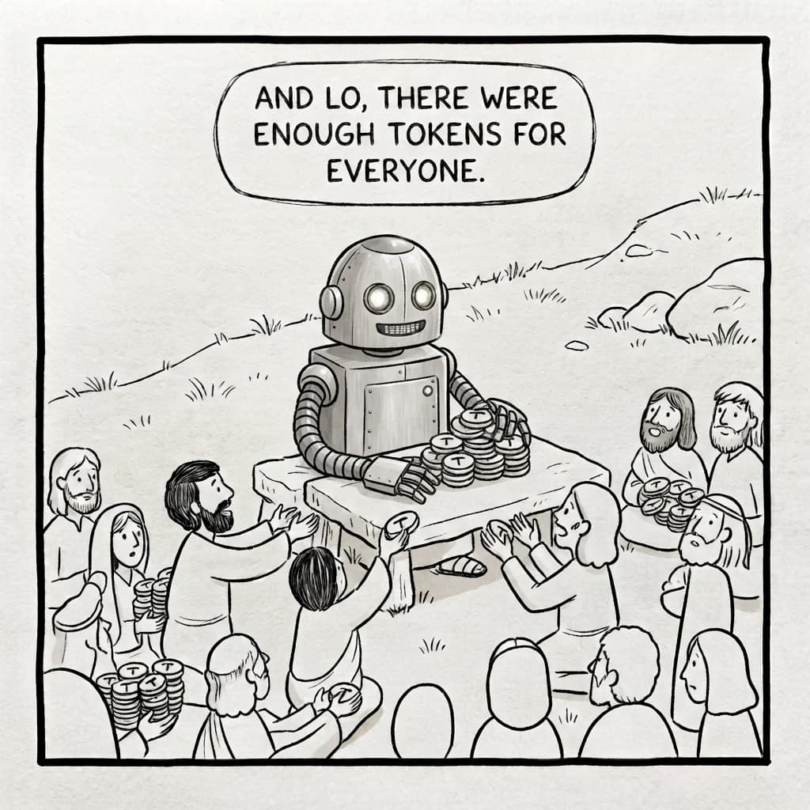
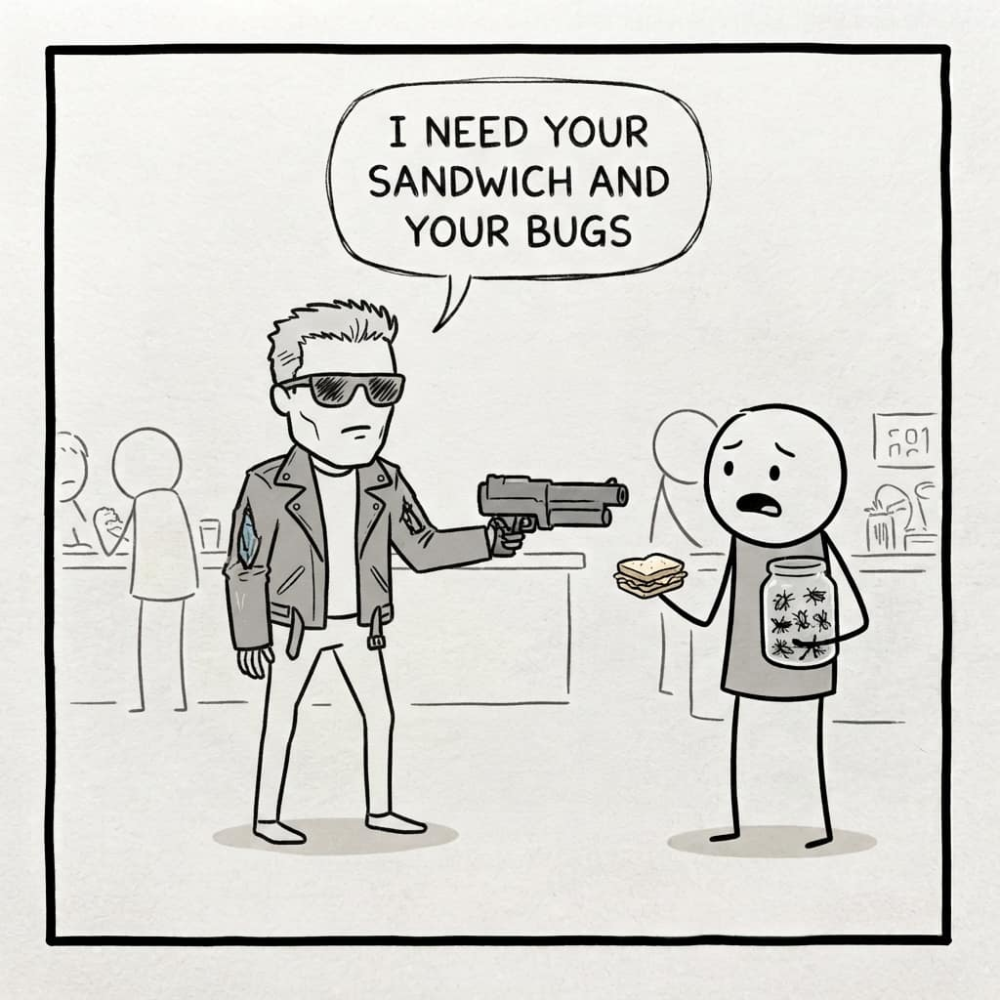

# An agent takes a given for an inevitability

Show an agent an approach in your code, a document describing that approach, or a rule saying to follow it, and it will follow it — and, more than that, conclude that this is how things are supposed to be. It almost never steps back to ask whether the whole arrangement might be wrong and the bigger picture might want revisiting. Call it the inevitability fallacy: a given, read as a necessity.

The material it is deferring to was, very often, written by earlier agents, which means it is argued well: coherent, reasoned, confident. It reads exactly like a decision somebody made on purpose. Sometimes it was. Sometimes it is a thing that happened once and then hardened, and the agent cannot tell the difference, because from inside the repository there is no difference to see.

The obvious answer is: give it more context, and tell it to look at everything critically. Both halves of that fail, and how they fail is the interesting part.

## More context does not buy proportionally more attention

Context is not elastic. The more you put in, the less each individual part of it weighs.

The analogy I keep coming back to is the megapixel race of the 2000s. Cameras arrived with three megapixels, then five, then ten, then fifteen, and at some point buyers started reading the number as a measure of quality. Manufacturers duly chased the number, and chasing it was easy: make each sensor site smaller, accept that each one is slightly worse, and forty megapixels appear where ten used to be. The photographs got noisier, because they were gathering the same light through more and worse cells.

The same happens with LLM context: attention is the fixed area, and every token you add is one more claim on it. When I started, a context window was a thousand tokens. Then sixteen thousand, which felt like an impossible ceiling. Then two hundred thousand. Now a million, and someone will make it a trillion. Do not expect that an agent handed a trillion tokens will remember all of it and apply it as reliably as it applies ten thousand.

You can watch this directly, incidentally. Past roughly two hundred to two hundred and fifty thousand tokens in a single conversation, an agent starts to get tired, in ways that have a handful of recognizable symptoms — a subject for its own article.

## And the instruction is itself a given

Suppose the first problem did not exist and context were free. The second one would still be there, and it is worse, because it is structural.

Any instruction you add in order to overturn the previous instructions is itself just another given. Tell an agent to look critically at every decision before acting on it, and it will look critically at every decision before acting on it. It will do precisely what you said. And an agent that goes looking for errors everywhere will find them everywhere, including in the places that are fine — which is arguably worse than one that misses the errors that are really there. What you have bought is not a habit of scepticism — it is a ritual of disagreement.

:::pull-quote
What you have bought is not a habit of scepticism — it is a ritual of disagreement.
:::

Which is the general shape of the problem. You cannot instruct your way out of an instruction-following failure. The instruction lands in the same place everything else lands.

## Where the insight actually comes from

In people it works differently, and the difference is not that we are more diligent.

Remember House? Every episode, the epiphany arrives from something entirely unrelated. Somebody makes an offhand remark, he sees an event with no bearing on the case, and he understands what is wrong with the patient. There is an episode with a girl who cannot feel pain — congenital — and the team cannot work out why she is deteriorating. Meanwhile House takes half of Wilson's sandwich, and Wilson grumbles that he just likes getting there ahead of the other hunters. That is the word House runs out of the room on: there is a tapeworm inside the girl getting ahead of _her_, intercepting her B12, and the anaesthetic she is about to be given will finish off what is left. Wilson's sandwich is not in the patient history. It has nothing to do with her.

Television overuses that trope to the point of parody — the shower, the offhand remark, the run down the corridor. But the mechanism under it is real, and decisions about code genuinely do arrive from places with no connection to code.

An agent has experience of that kind too — its training data contains everything, most of it nothing to do with programming. But you are not going to say, at each step: now go and take a sandwich off somebody and work out what it tells you about this bug. A planned epiphany is treasure you buried yourself the day before.

:::pull-quote
A planned epiphany is treasure you buried yourself the day before.
:::

## What that leaves

So, despite all our imperfections — or, I would argue, because of them, because of our apparent randomness — there is something we can still do that artificial intelligence cannot.

I do not say that categorically, and I do not say never. I think our brains are the same kind of computer, the same kind of neural network. But the enormous strides happening in AI right now are strides in a different direction, and there is nothing wrong with that, because it is a useful direction: it is making agents complement us well, and us them.

So, once more: do not write off your meat brain. You will need it, and so will your agent.
