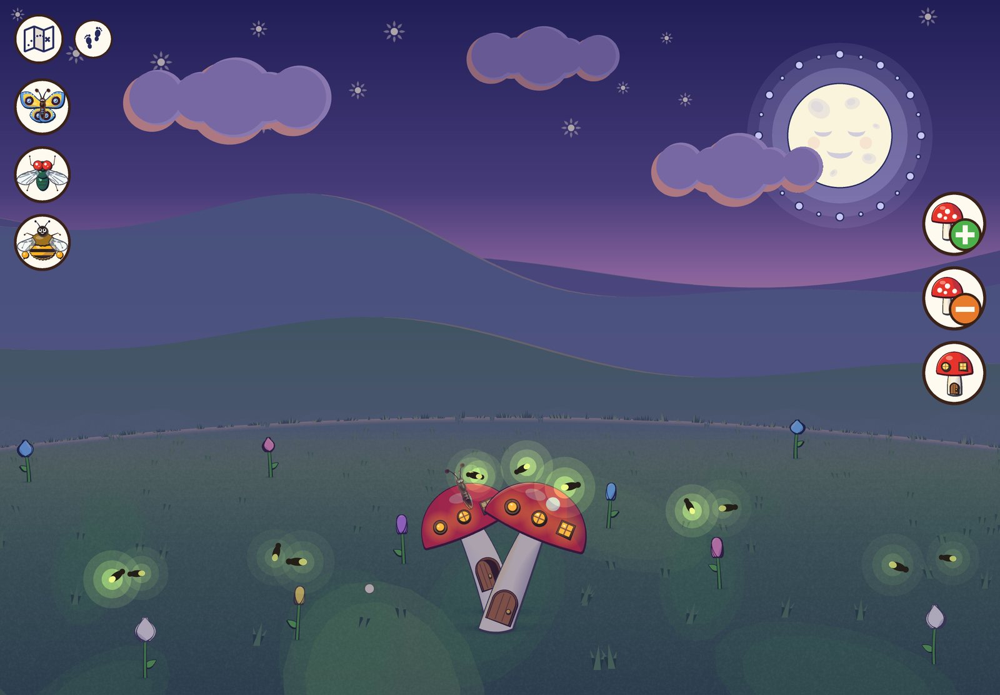
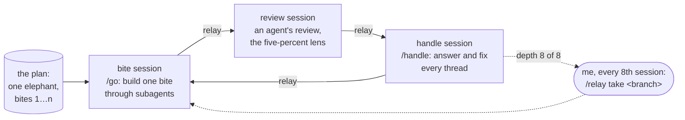
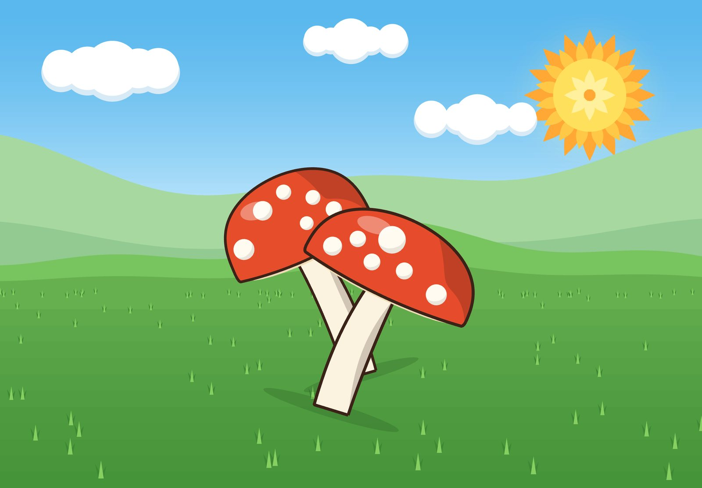
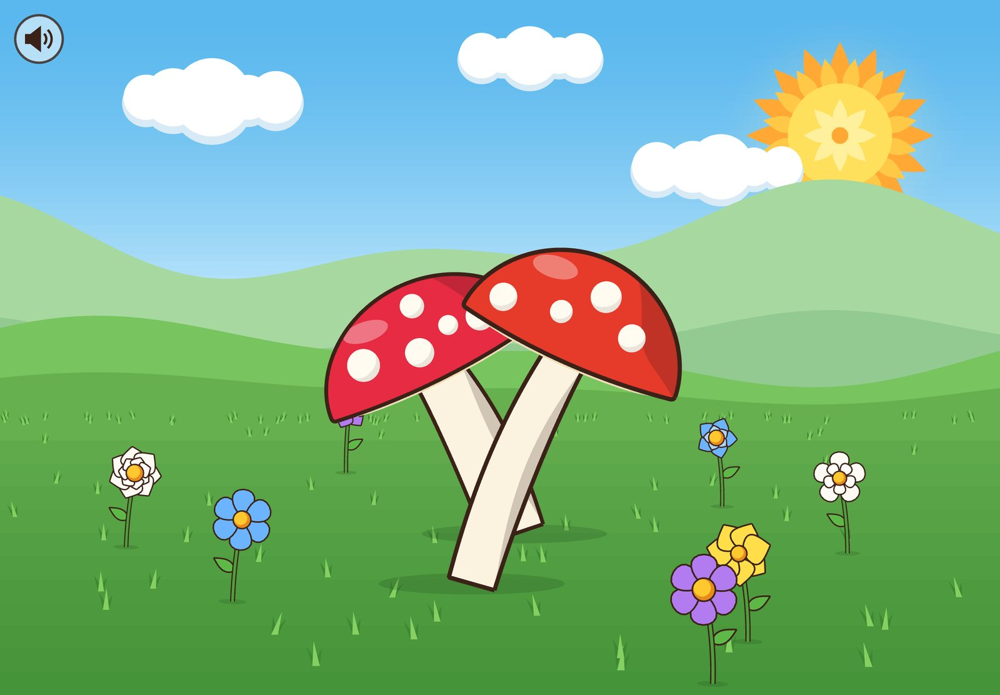
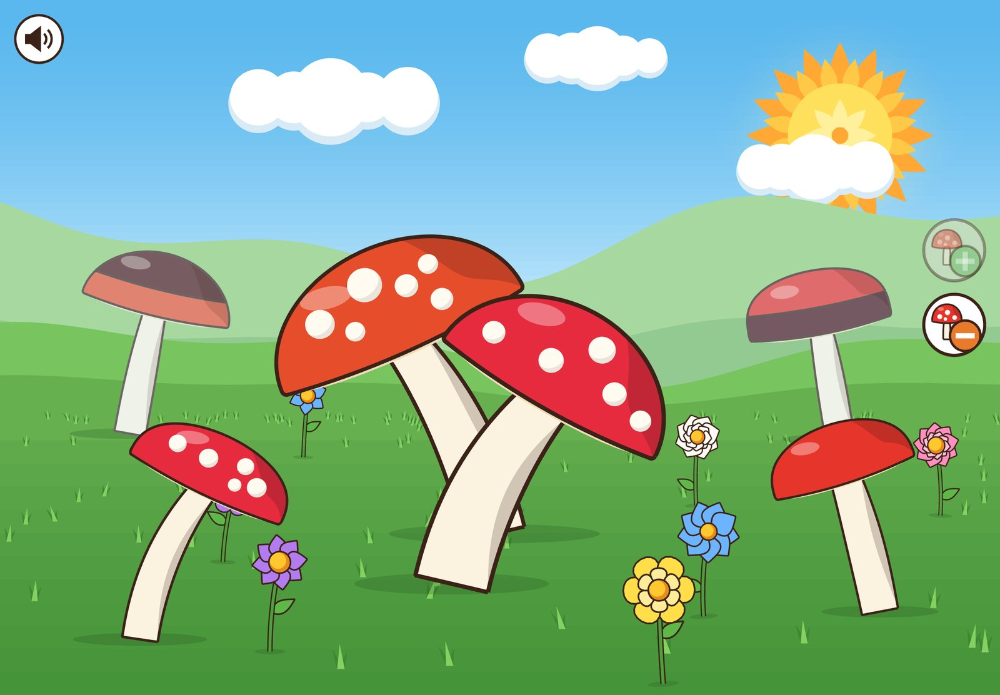
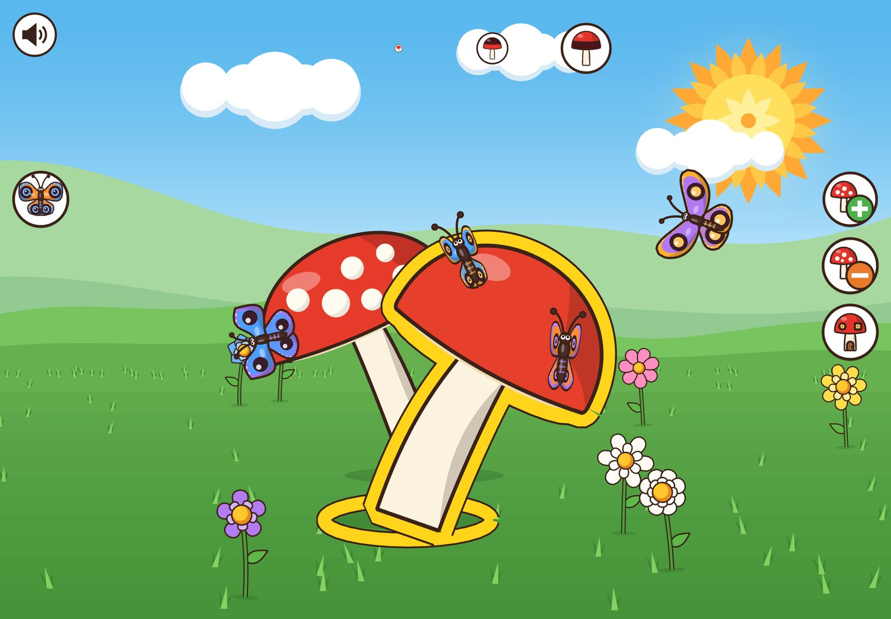
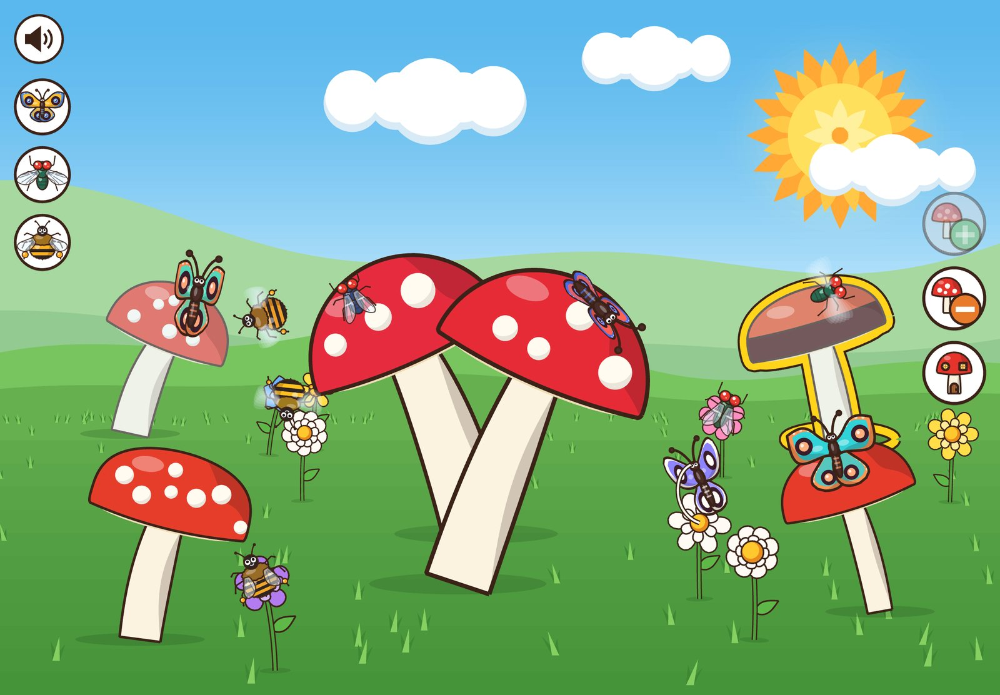
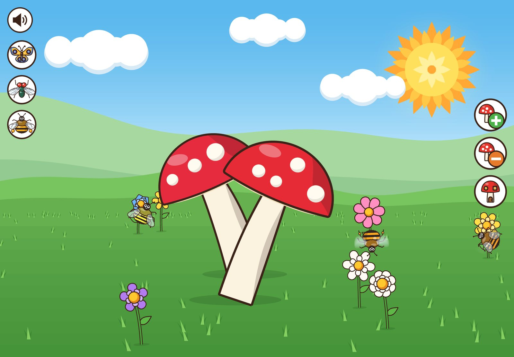
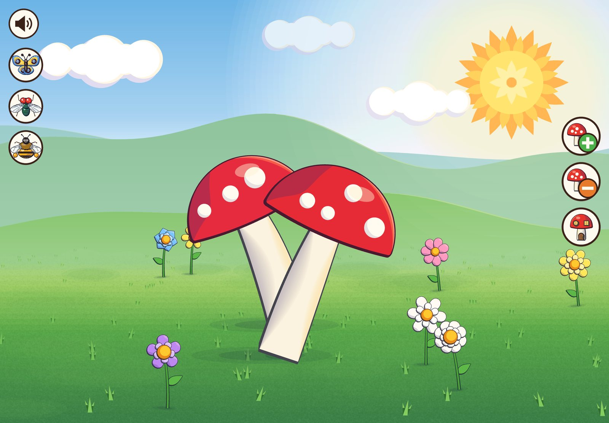
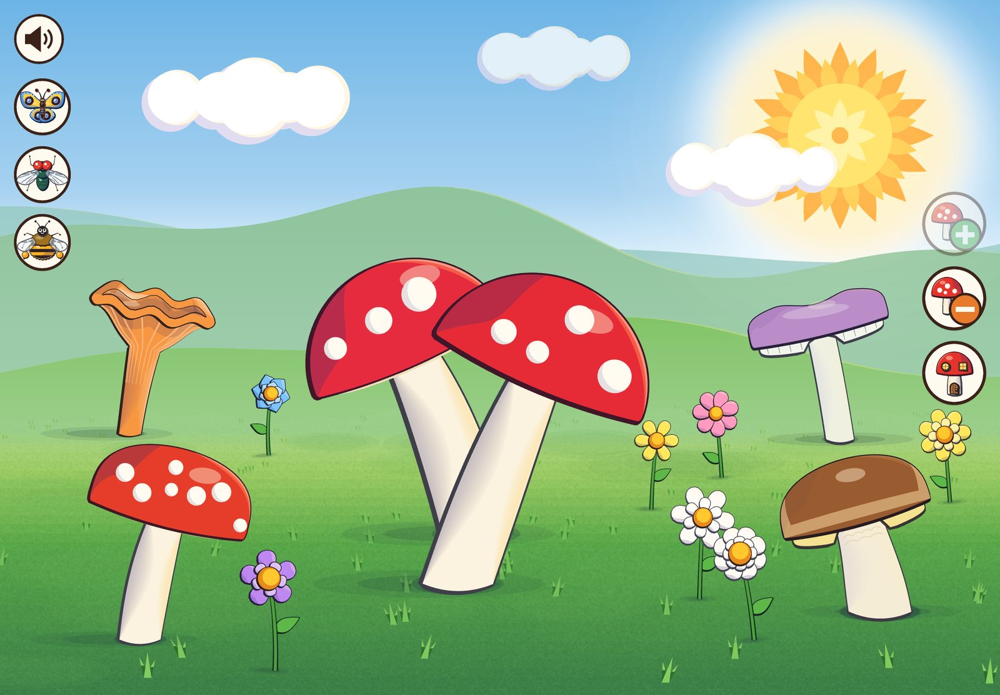

# My son drew a mushroom house. 92 Claude sessions built it in eight days.

|                |                                                                                       |
| -------------- | ------------------------------------------------------------------------------------- |
| **Assignment** | a game from my son's ballpoint drawing and two voice notes — no text, no goal         |
| **Span**       | planned on 17 September; built 26 September – 4 October 2026 · 8.5 days               |
| **Sessions**   | 92 Claude Code sessions, handing over to each other through 98 relay summaries        |
| **Commits**    | 3,162, every one of them by Claude — 1,045 of those are cost-log rows, 430 are merges |
| **Shipped**    | 40,901 lines of game code and 27,345 lines of tests · 2,267 tests green               |
| **Cost**       | $1,777 at Claude API rates, three quarters of it spent by subagents                   |
| **The plan**   | 9 bites, which grew to 19                                                             |
| **My part**    | playing it, reviewing it, and turning it around every couple of days                  |

The game is live at [vovazakharov.com/mushrooms](https://vovazakharov.com/mushrooms) — best on a tablet held sideways, or on a computer.

---

## The drawing

So here's how it went. My son Syama — he was five then, he's turning six about now — drew a picture on squared paper. I looked at it: there were mushrooms in the middle, some three insects off to the side, and some little buttons with mushrooms on them. I asked: what's this? He said: this is my game.

I asked him to explain how it works, and then right away I gave him the voice recorder so he'd explain it in his own words. It seemed to me it would be fun to give it to Claude exactly like that, and see how it writes a game from nothing but my little son's explanation.

What the game is now, in plain words: a full-screen meadow with no goal and no text. Plus grows one of four species of mushroom, minus sinks one, and the house button gives a cap windows and a door. Tap a door and a mouse runs to another house; tap a window and a worm crawls over the cap. Butterflies drink at flowers, flies go for fly agarics, and bees plant flowers. Tap a cloud and it rains — the flowers fold, the insects hide under the caps, the spores you knocked out of a mushroom sprout, and a rainbow follows. Tap the sun and it's dusk, with lit windows, fireflies and crickets; tap the moon and it's day again. Every flower is a note or a drum, by its colour and shape, so the meadow is also an instrument. And you can walk it, in any direction, for as long as you like: it has no edge.

None of which, you'll notice, is in the drawing. How it got there is what this case study is about.

## Part I — Before the beast

### Thursday, 17 September

This is the bit I skip when I tell the story out loud, because nothing much seemed to happen: the same day Syama drew the picture, I opened a session, gave it the drawing and the two voice notes, and said, more or less, let's make the mushroom toy from Syama's drawing and his description.

Here are the voice notes — the lines that carry the rules. The other voice in them is mine.

> If you press it, the butterfly, it appears on its little fly agarics. And the fly, if you press it, it appears on the little fly agarics too. And the bee, if you press it, it appears too.
>
> This is plus mushroom, this is minus mushroom. This is a mouse house in a mushroom, and which windows are these? — My door is needed too. — This one or this one? — Yes, this one's needed too. — And where do they go, they appear in the fly agaric? — Yes. Windows here.
>
> — And what's the point of the game? What do you have to do? — You play it like this. The point of the game is just to watch the butterflies, flies, bees.
>
> _Это если нажать на неё, на бабочку, то она появится у себя на мухомориках. А муха, если на неё нажать, то она появится тоже на мухомориках. А пчела, если нажать, то она тоже появится.  Это вот плюс грибочек, это минус грибочек. Это мышиный домик в грибочке, и это какие окошки? — Тоже нужна моя дверь. — Эта или эта? — Да, эта тоже нужна. — А где они, в мухоморе появляются тогда? — Да. Вот тут окошки.  — А смысл игры в чём? Что нужно делать? — Тут играть так. Просто смысл игры, что смотреть на бабочек, мух, пчёл._

And a second, shorter one, about the four shapes along the top of the page: "And it shows this, this, this or this. On top, at the bottom, like this or like this, I picked like this. — What's that, on top or at the bottom? — Well, black on top or at the bottom."

The session did what our setup tells it to do with a request like that: it judged the job small enough, wrote a plan, and started implementing it on its own go-ahead. I stopped it four minutes in ("no, let's do a plan after all, don't rush") and read what it had in mind. What it had in mind was a web page. Mantine buttons labelled from the site's translation files, matching the drawing's word-plus-checkbox; inline SVG in the site's foreground colour with hatched fills — "an ink-drawing toy", as the plan put it; at most eight mushrooms and twenty-four insects; the insects landing by CSS transition. A perfectly reasonable reading of the drawing, if you're a web developer. Syama isn't.

↻ **Pivot.** I wanted it to look and move like a real mobile game:

> like some Angry Birds, in how it's drawn and animated
>
> _как какой-нибудь angry birds по отрисовке и анимациям_

The plan went from a form to a real game in [Phaser](https://phaser.io/), a canvas game engine, loaded on that one route. No text anywhere, so a child of any age can play — which also took the translations with it.

↻ **Pivot.** And I didn't want the plan's four drawn mushrooms either:

> you press, another mushroom appears, press again, another one — then a whole forest, and every one of them different. Same with the flies and bees
>
> _нажал, появился ещё грибок, ещё нажал, ещё -- потом целый лес, и каждый -- разный. так же с мухами-пчёлами_

So no sprites, no pictures at all: every mushroom and every insect is grown by a seeded generator — a seed gives the genes, the genes give the proportions, the spots, the lean — and drawn by code. That one sentence is where my love of procedural generation entered the game; it never left.

Then the plan was narrowed to a first stage — a static meadow, with the rest of the drawing parked in [an issue](https://github.com/vzakharov/vovazakharov.com/issues/65) — and then everything just lay there for a while. I almost forgot about it.

### Nine days later

Then, one Saturday, I noticed I still had quite a lot left of my weekly limit. I thought: let me just launch it. And at the same time I had this thought, something to try, because I didn't really have the time on the weekends for this kind of programming. Well, and if I did, I have other things to program. Let me try making — not a skill yet, but an embryo of a skill — that teaches the agent to do everything by itself, with my involvement being, let's say, asynchronous: me just coming in now and then and correcting it along the way.

Well, even that is me getting ahead of myself, because originally there was no such idea. Originally the idea was just that it would do everything by itself. And then, somewhere in the middle, I understood that I could say things — and that I needed to say things, to fix things. But I'm getting ahead of myself.

## The launch message

Here it is in full, sent on Saturday, 26 September, at 08\:17 UTC (every time in this story is UTC):

> so, haven't been here in a while. Let's go for something cool this time. Look, here's what I want you to do:
>
> 1. google what amazing things people have made with Opus 5.5 (you). It doesn't mean I want a super-multiplayer 3D shooter, just so you get charged with pride in your own abilities, so the game comes out really beautiful, atmospheric and comfortable for a six-year-old boy
> 2. rebase onto current main — there are a couple of interesting skills and approaches there
> 3. treat this as an "elephant" (you'll get it once you rebase), meaning the plan should cover the whole game
> 4. after every bite, do "/relay leave a code review on the last bite" — what relay is you'll also figure out, and the code review should be done with our "five-percent file" in mind — that is, look at what I would look at ("what would the Scarecrow have done in our place")
> 5. after the review, hand over "/relay /handle"
> 6. and so on in a loop, until you reach the end
> 7. at the end, do "/relay finalize" (no need to merge)
>
> that is, the whole process should run completely autonomously, without a single intervention from me. The exception — well, if you get really stuck on something, and the way out is to hack the whole internet or wipe my local disk (even though you're in a VM), well, you get it :)
>
> the result should be available both in the repo in the usual format and as an Artifact, so that when I come back I can look at what came out right away.
>
> (rubs hands) well then, here we go?
>
> _так, давно сюда не заходил. Давай-ка мы замахнёмся на крутое в этот раз. смотри, что хочу, чтобы ты сделал:  1- погуглил про то, какие офигительные вещи люди понаделали с Opus 5.5 (тобой). Это не значит что я хочу супер-мультиплеер-3д-шутер, но просто чтобы ты зарядился чувством гордости и своих возможностей, чтобы игра получилась прямо красивая, атмосферная и удобная для мальчишки 6 лет  2- ребейзнлся на текущий мейн -- там пара интересных скиллов и подходов  3- считал это "слоном" (ребейзнешься -- поймёшь), то есть план должен быть на всю игру  4- после каждого куска делал "/relay оставь код ревью на последний кусок" -- что такое релей тоже поймёшь, а код ревью надо оставлять с учётом нашего "пятипроцентника" -- то есть смотреть на то на что смотрел бы я ("что бы на нашем месте сделал Страшила")  5- после ревью передавал "/relay /handle"  6- так по циклу, пока не дойдёшь до конца  7- в конце селал "/relay finalize" (мерджить не надо)  то есть весь процесс должен пройти полностью автономно, без единого моего вмешательства. Исключение -- ну если совсем во что-то уткнёшься, и выходом будет взломать весь интернет, стереть мой локальный диск (несмотря на то что ты находишься в VM), ну короче ты поял :)  результат должен быть доступен как в репе в обычном формате, так и в качестве артефакта, чтобы, когда я пришёл, я мог сразу посмотреть что вышло.  (потирает ручки) ну, что, поехали?_

A few words of the house dialect. An **elephant** is a plan too big for one session, eaten a **bite** per session — one pull request, many bites. **Relay** is our skill for what `/compact` does, except that instead of squeezing the conversation in place, the session writes a summary to a file on the branch and hands it to a brand-new session, which starts from that summary. The **five-percent file** is where I'd been collecting the few review comments of mine that actually changed something an agent had already settled — the residue you still need a human for. Since every review in this run was going to be an agent's, a moment later I added: freeze that file, and don't add to it.

↻ **Pivot.** Within four minutes the session had rebased the nine-day-old branch onto `main` and rewritten the plan: not a static meadow any more but the whole game, nine bites, "an elephant eaten by an autonomous relay loop". Then it flipped the plan to in-progress, quoting my "(rubs hands) well then, here we go?" in the commit message as the go-ahead, and started on bite 1.

### The first minutes

The launch message had no notes in it, by the way. I asked for them a few minutes later, while the first bite was being built:

> one thing I want you to keep, including between sessions — a file for a future skill that will automate all of this (working name megabeast). Not the skill itself, but specifically the thoughts on what you found along the way that would help make this process repeatable and at the best level
>
> _одна штука которую хочу чтобы ты держал, в том числе между сессиями -- файлик будущего скилла, который будет это всё автоматизировать (рабочее название megabeast). Не сам скилл, а именно соображения с тем, что ты нашёл по пути, что помогло бы сделать этот процесс повторяемым и на лучшем уровне_

For some reason "megabeast" came to me right away. By the end it had become a golem, but for the whole time this task ran it was called the megabeast. Into this — not this skill, the sketch of the skill — the agent was supposed to write down the lessons it had learned. And, again getting ahead of myself, as many of you probably know, this is how it goes: if you give an agent something to write into, then after about ten passes it turns into a Great Soviet Encyclopedia. But I didn't know all that yet — well, not as applied to this particular case. The notes did swell, to the point where they had to be split into a folder of seven files; by the end they held 17,681 words.

In the same few minutes came the other thing I asked for, which I remember as being there from the very start. I wanted the game to bring the whole family into it. Ecology, because my second son, Zoltan, loves ecology. My own love of procedural generation, which was already in — that's why our mushrooms aren't drawn in advance, but grow out of genes, let's say, anew every time: the mushrooms, and the insects, and the flowers, and everything else. And so that our family would close the circle, I said that my wife Leysan really loves mandalas, so let's put some mandalas in there, somewhere, I don't know where yet:

> and let there be something inspired by mandalas, because my wife Leysan loves drawing them. Not literally drawing mandalas, but inspired. Then it comes out: the idea from Syama, the love of procedural stuff from me, of ecology from Zoltan, of mandalas from Leysan
>
> _и давай там что-то будет inspired by mandalas потому что их любит рисовать моя жена Лейсан. Не прямо чтобы рисовал мандалы, а именно inspired. тогда получится от Сямы идея, от меня любовь к процедуркам, от Золтана к экологии, от Лейсан к Мандалам_

↻ **Pivot**, a quiet one: a tap toy became a small ecosystem. "Some ecological things should come through — interactions of different beings in nature, and with nature itself", and, a message later, "but not as nagging teaching — everything should be before your eyes, not in explanations." Pollination, rain and dusk went into the plan that minute; none of them was in the drawing.

And I think the agent handled the mandalas brilliantly, creatively: as you'll see in the pictures below, our sun is a mandala, the flowers are mandalas, even the insects' wings carry the pattern. And all of it so unobtrusive that if you didn't know it was done with a mandala in mind, you'd think it was just an interesting design choice.

## How the loop works

Each arrow labelled _relay_ is a new session. The old one writes `relay.md` — standing constraints (passed on verbatim, or they stop applying), the conversation so far, the intent, the decisions, the errors and dead ends, the state, pointers, and the next step — and starts its successor. The successor reads it, and nothing else of the past.

A bite session claims the plan, writes down what this bite will do with every decision already made, and then mostly orchestrates: the building is done by subagents, in waves, each landing a step or two. At the end it takes screenshots, runs the checks, republishes the Artifact, pauses the plan, and relays. The review session plays the build and leaves a pull-request review of inline comments, as I would. The handle session answers every thread, fixes what needs fixing, and relays to the next bite.

And every eighth session the chain stops, because a chain of sessions starting sessions is capped at eight deep. Then it waits for me to paste `/relay take <branch>` into a fresh session by hand. That cap turned out to matter more than anything I designed, and I'll come back to it.

## Bites 1–8: a meadow on one screen

### 26 September: the meadow, still; alive; and a forest

Bites 1 to 3 each took well under an hour of wall time. Bite 1 was claimed at 08\:24 and built by 08\:35: a sunny meadow and two spotted fly agarics, grown from seeded genes, with the game's logic in a pure model and the Phaser scene only drawing what the model says. Its first run of our checks found 17 lint errors and four of the repository's own gates red, which is about what a first bite should find. Bite 2 made the meadow breathe — clouds drifting, grass swaying, a tapped mushroom wobbling out a puff of spores, seven flowers chiming — with every sound synthesized in the browser. Bite 3 gave the meadow Syama's `+` and `−` and his four cap shapes as a picker, and planted a forest in depth.

Nobody took screenshots of these three bites at the time; these come from each bite's last commit, rebuilt for this article. The meadow wasn't seeded on load then, so the flowers and the far caps come out different every time.

_Snag, machinery._ After bite 3's review, the chain hit its depth of eight. The session ended at 11\:42; I pasted the relay by hand at 15\:22. About three and a half hours of nothing.

### 26 September, evening: the mouse house

Bite 4 made the house work: the house button, Syama's row of windows plus his door, a cap that gets windows and a stem that gets a door, and a mouse peeking out of it.

_Snag, game._ With two mushrooms leaning into each other, the back one's door kept hiding behind the front one's stem. The handling session swept door heights over 2,000 generated visits and found that no height at all shows the door on 40% of phone-portrait visits. What fixed it was the clump: the portrait clump's feet stand closer in depth and farther apart across.

This is also where the screenshots came from. The agents had been taking them all along, for their own checks, into a temporary folder that never left the session. I asked them to keep the screenshots on the branch instead, because I wanted to glance at them from time to time, and to pick, at the end of every bite, the ones worth showing. That's why every screenshot below is real, taken by the agents themselves, at the time.

_Snag, machinery._ At about 200k tokens of context, the handling session stopped, pushed, and asked me whether it should `/compact` or `/relay`. To which:

> so, we agreed that we're going yolo/megabeast, and you don't ask me anything
>
> _так, мы же договороились что идём yolo/megabeast, и ты у меня ничего не спрашиваешь_

It wrote the lesson into the megabeast notes and relayed. It wasn't the last time an agent asked.

The Artifact — the playable copy of the game that lives right in the Claude app — was in the launch message, and it got built. But, getting ahead of myself, I didn't particularly need it: mostly I checked the game by pulling the branch onto my computer and running it locally. That same evening I asked the agent how to do that.

### 27 September, night: the butterfly

Bite 5 brought the butterfly in: it flies in on a curve, drinks at the flowers, rests on the caps, and a tap sends it off.

_Snag, game._ The review found the butterflies getting lost on their way to a flower, landing two to a flower, and drinking with the proboscis pointing away from it; in flight, closed wings read as sticks. The close-up on the right is after the fix: the proboscis into the flower's heart.

### 27 September: the fly, the bee, and the line

Bite 6 was the fly, which goes for fly agarics, and the bee, which carries pollen and plants flowers in a ring. With it, every control in Syama's drawing worked — the plan called this the MPP line.

_Snag, machinery._ After bite 6, the chain hit its depth again — at 06\:15, while I slept. The next session started at 17\:13. Eleven hours of nothing, which is when I started to wonder whether the cap was a bug or a feature. The first lineage built bites 1–3 in about three hours and twenty minutes; the second took thirteen hours for bites 4–6.

_Snag, machinery._ That night the weekly quota was about to run out in the middle of bite 6's handling. I asked whether the subagents could be paused so they'd pick up when I said the quota had reset; they were, and in the morning it was "good morning, here we go!". Then I asked the session to check with its two subagents how much context they had left. One answered "115k". Read off its transcript, it was at 220k, and the other at 274k. A subagent can't tell you its own context size; you have to read it from the outside.

### 27 September, afternoon: my own review

Halfway through, I left a review of my own on the pull request, the first of the run. I told the session to read it but not act on it yet: maybe it would suggest how to instruct the sessions that came next.

↻ **Pivot.**

> play with the atmosphere a little, right now it looks a bit too Peppa Pig, you know? Get inspired by some beautiful/atmospheric platformers. Not about photorealism or some super-duper 3D, but something drawn with soul.
>
> _чуть-чуть поиграться с атмосферностью, сейчас это выглядит немного слишком свинка-пеппа, понаешь? вдохновиться бы какими-нибудь beautiful/atmospheric платформерами. Не о том, чтобы это был фотореализм или какое-то супер-пупер-3д, но что-то такое рисованное с душой._

"Can take it next after this bite, shifting the rest." It did: atmosphere became bite 7, and dusk, which had been bite 7, slid down the list — all the way to bite 17, as it turned out.

The same review asked for an Artifact at the end of every bite ("if it's hard, forget it — I've already figured out how to run it locally"), said the screen felt too small or the objects too big, and — I'd forgotten this until I reread it — already had the walking in it: "later we can think about actually 'moving' around it, either as a spectator or as a participant in events — like, you come up too fast and the insects fly away — but let's leave that out of the brackets for now." Two days later it wasn't out of the brackets any more.

When the session then proposed changing the loop to one session per bite, I stopped that too: "changing relay to something else in this megabeast approach — definitely not."

### 28 September: one light

Bite 7 took three platformers for reference — _Gris_, _Ori_ and _Alto_ — and gave the meadow one light: a graded sky, a haloed sun, hills fading into mist, lit ground, caps with highlights on the sun side, inked creatures.

Before and after. Look at the sun: that's the mandala.

### 28 September: real mushrooms

↻ **Pivot.** While two subagents were busy with bite 6's leftovers, I sent this:

> right now we have fly agarics and some other mushrooms that don't look like anything. In Syama's original drawing there were different kinds of doors, and the first agent apparently read them as different kinds of caps. That, although a mistake, is a good idea. But let's have real mushrooms instead of undefined ones: fly agaric — the same as we have; porcini — whitish stem, brownish cap, stockier; chanterelle — a slightly different shape (the stem naturally widens into the cap, "rays" of gills spread out under the cap, and the colour orange-ish); russula — a simple one, but it can have caps of different colours
>
> _сейчас у нас есть мухоморы и какие-то другие грибы, ни на что не похожие. там вообще в оригинальном рисунке у Сямы разные виды дверей были, а первоначальный агент, видимо, считал их как разные виды шляпок. Это, хоть и ошибка, но хорошая идея. Но давай у нас будут реальные грибы вместо неопределённых: мухомор -- тот же что уже есть; белый гриб - белая-ish ножка, коричневая-ish шапка, поплотнее; лисичка -- немного другая форма (ножка естественно переходит в шляпку расширением, по шляпке снизу расходятся "лучики" пластин, ну и цвет рыжий-ish); сыроежка -- простенькая, но у неё могут быть шляпки разных цветов_

Then, right after, "no, let's put the atmosphere ahead of the mushroom species" — so this became bite 8.

_Snag, game._ The session building bite 8 looked at the frames itself, twice, rather than trusting its subagents' reports. Its first look found the porcini's stem too thin and the chanterelle reading as "a hockey stick with a plate". The next scene agent fixed both.

That was 28 September. The meadow fit on one screen, every one of Syama's buttons worked, the mushrooms were real, and the light was soft. It was, by any measure, the game in the drawing. And then I had an idea.

## Part II — The meadow learns to walk

## Part III — Rain, night, and keeping it

## The numbers

## What I would keep

## Syama's verdict

## Appendix A — every pivot

## Appendix B — every snag

## To be continued
