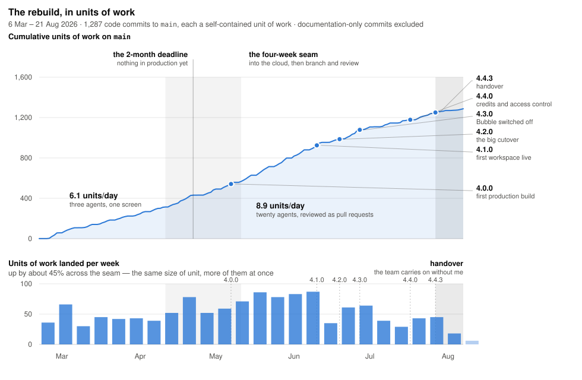
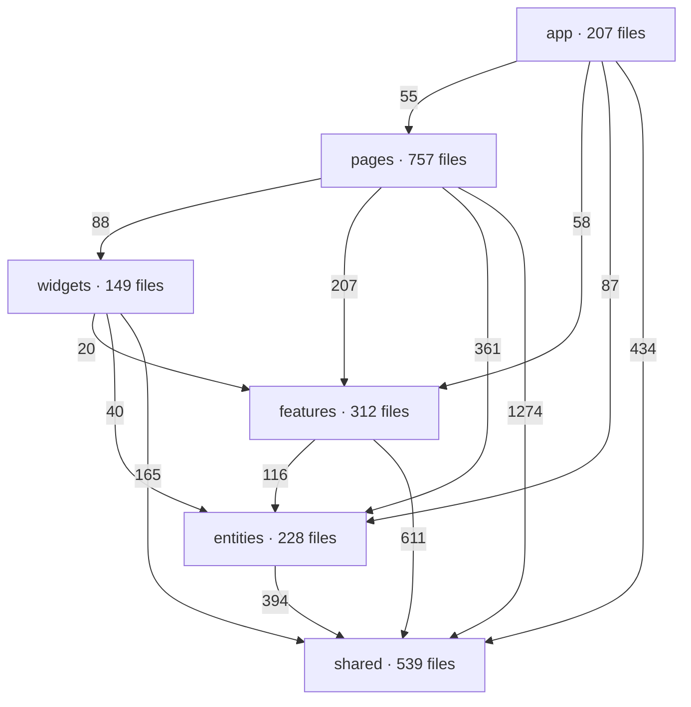
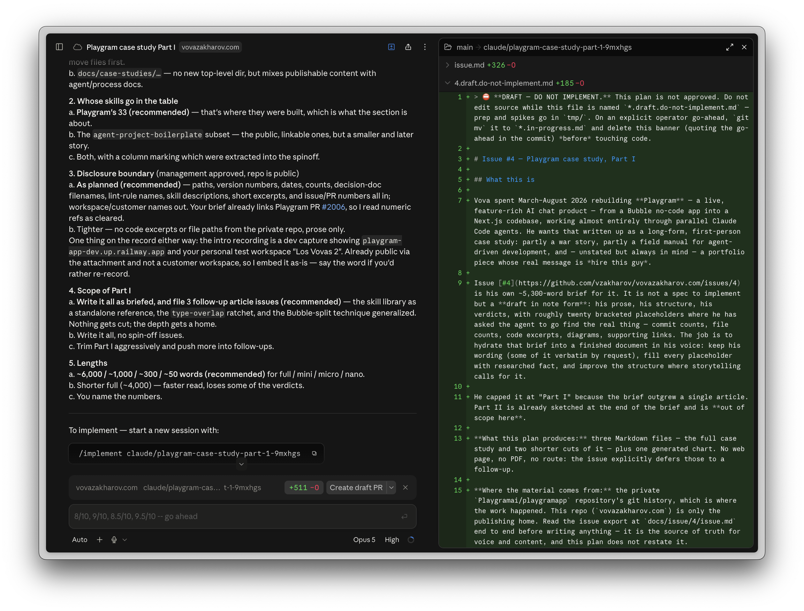

# From Bubble to Next.js in 4 months: the Playgram case study

**Part I of II.**

|                          |                                                                        |
| ------------------------ | ---------------------------------------------------------------------- |
| **Assignment**           | rebuild a live, feature-rich no-code app as a production Next.js 16 codebase |
| **Span**                 | 6 March – 20 August 2026 · 168 days                                     |
| **The "code" I started from** | an 11.6 MB minified JSON — the Bubble app export                   |
| **Shipped**              | 1,537 commits to `main` · 1,063 merged pull requests · 244,000 lines of TypeScript |
| **Cold load**            | multi-second → sub-second                                              |
| **Releases**             | 4 majors, 3 workspace cutovers, zero rollbacks                          |
| **Team**                 | me, and somewhere between ten and twenty-five Claude Code agents at a time |

_Disclaimer: the disclosures in this case study were approved by Playgram management, i.e. no NDA breach._

---

After I started writing this case study, I realized that even the [brief](https://github.com/vzakharov/vovazakharov.com/issues/4) I'd give Claude to hydrate turned out to be 5,300 words long — and even then, after I'd finished it I understood that I'd only scratched the surface of everything I wanted to tell. So, (a) sorry it's so long, (b) check out the [mini version](./playgram-bubble-to-nextjs-part-1.mini.md) and the [micro version](./playgram-bubble-to-nextjs-part-1.micro.md), and (c) I'll post more detailed insights on some or all of the aspects later.

## Intro

In case you didn't know, Bubble is a no-code app builder.

When you think of such tools, you'd think that people would just use it to make simple things — a directory site, an internal CRUD tool, a booking form, the kind of marketplace MVP you build to find out whether anyone wants it.

But you'd be surprised how far people can actually take it — from a [subletting marketplace](https://bubble.io/blog/ohana/) whose hosts have earned $16.2 million and which [Stripe projects](https://stripe.com/customers/ohana) will process $60 million this year, to a [hospitality operations platform](https://bubble.io/blog/suiteop/) running a hundred-plus organizations and up to 30,000 daily guest users, to a [one-person company](https://bubble.io/blog/formula-bot/) that reached a million users, built by a non-programmer over a paternity leave.

None of those are toys. A lot of software you've used was probably drawn rather than typed.

In our case, we're talking about Playgram, an app that managed to put together a chat interface giving access to multiple providers and models, realtime team/project chat UIs, libraries of generated images & files, memory & knowledge management, voice input, and tons of other small "nifties" — all brought to life with no code at all:

https://github.com/user-attachments/assets/16e67cd5-5727-419b-be2b-ffaa2541a44c

(This is a screen recording already after migration to code, but you get the idea.)

So why would then they want to switch to code if it was all so great?

## Why

**1 — Performance.** However hard you try, when you put abstraction over abstraction over abstraction to make an app work in a "draw a couple of interconnected boxes, and it just works" fashion, you're bound to hurt the performance. The platform — quoting its [own performance guide](https://manual.bubble.io/help-guides/maintaining-an-application/performance-and-scaling) — sends "the code for all the elements (visible and invisible)" before it draws anything, degrades multiplicatively with every nested repeating group, and ships the code of every plugin you install on every page load, whether you use it or not.

But the part you can't claw back is the floor. A Bubble page ships three render-blocking platform bundles before your app exists; a group of developers [measured](https://forum.bubble.io/t/seeking-advice-on-slow-page-loads-in-bubble-applications/327360) an almost-empty page — one text heading, nothing else — and found a Lighthouse Speed Index of 1.5–1.7 seconds.

To spoil the ending: moving Playgram to Next changed cold load times from multi-second to sub-second; something which is _instantly_ tangible for a user, even if "wait a couple secs at first load" doesn't sound like such a big thing.

**2 — Bumping into the bubble's edges.** All too many Bubble developers have faced the same thing again and again as their apps grow: they meet the system's limits and end up installing (and sometimes purchasing) third-party plugins, running vanilla JS in the browser, or even writing their own reactivity frameworks to make up for what Bubble can not provide. Quite illustratively, the number one Bubble plugin, with over 538,000 lifetime downloads, is [one that allows](https://bubble.io/blog/top-community-plugins-templates-2023/) running custom JavaScript. The most popular thing anyone ever built for the platform is a way out of it — and two of the five top templates that year were entire homegrown application frameworks built on top of Bubble, for the same reason one layer up.

In the case of Playgram, by the way, the makers are Zeroqode, with a ballpark of 800 plugins shipped, two of which were among the five most-installed community plugins for Bubble in 2023. And they still felt like they were lacking. When the people who supply everyone else's escape hatches start wanting out, that tells you something.

**3 — Missing out on all the AI agents stuff.** Although Bubble has been making inroads into using AI for its builders, needless to say its capabilities are far behind what modern tools like Claude Code, Cursor, or Codex provide. The team was feeling like they were missing out on being able to deliver more features in smaller time frames.

That last one is the interesting one, and it's most of what this case study is actually about. They didn't just want code. They wanted the thing that code makes possible.

## What

So that's what Levon and his team came up to me with. They wanted a fully functional code-based rewrite of an already working app shipped in 1.5–2 months (a timeline I agreed to but didn't ultimately meet).

To give some perspective on why this was a pretty challenging endeavor:

**1 — A Bubble app export** — the "code" in "no code", and the thing you're going to feed to an agent while rebuilding — **is a multi-megabyte JSON.** In the case of Playgram, it weighed 11.6 megabytes, minified, on one line. Suffice to say, VS Code crashes when you try to open a JSON that big. Good luck feeding that to an agent. The instruction that ended up in the repo's own guide for agents is blunter than anything I'd have written for a human: **"Do not read directly** — all the info you might need is in the split files."

**2 — This was a live app in the beginning of its lifecycle.** The team was meant to keep shipping new features, improving prompts, and catching bugs while a code rewrite was being built in parallel. The target kept moving, on purpose, and correctly so — you don't freeze a product for four months to please your contractor.

**3 — The team invested quite a lot into design,** so they were adamant the rewrite had to be not just functionally equivalent, but a _pixel-perfect_ match visually, too.

**4 — Like most Bubble apps, the app kept its data in Bubble's proprietary DB format,** with no way of easy data migration to a new platform, whatever that would ultimately be. That one is a story of its own, and it's Part II's.

Below you'll find how we tackled each of these challenges; how we discovered new ones I would've never envisioned, and what mistakes we made along the way (so you don't have to).

## The four months, in numbers

Before the grit, the shape of the thing.



| Date            | Day | What happened                                                          |
| --------------- | --- | ---------------------------------------------------------------------- |
| **6 Mar**       | 1   | First commit. Not code — a splitting script and a pile of research.     |
| **10 Mar**      | 5   | The Next.js app gets bootstrapped. `layout.tsx`, `page.tsx`, and nothing else. |
| **12 Mar**      | 7   | First feature code: auth screens, styled to match the Bubble original.  |
| **19 Mar**      | 14  | A message goes to an LLM and a response comes back. The product loop works. |
| **6 May**       | 62  | **The original deadline.** Nothing in production.                       |
| **21 May**      | 76  | `4.0.0` — first production build.                                       |
| **26 May**      | 81  | Everything moves to PR-based flow and cloud agents. The slope changes.  |
| **24 Jun**      | 110 | `4.1.0` — first workspace actually running on the rewrite.              |
| **3 Jul**       | 119 | `4.2.0` — the big cutover.                                              |
| **11 Jul**      | 127 | `4.3.0` — all workspaces on the rewrite. Bubble is off.                 |
| **7 Aug**       | 154 | Last day of my full-time assignment.                                    |

A note on that chart. The point where my working method changed isn't a spot — it's a seam about four weeks wide, and three independent signals agree on where it sits. The commit rate steps from 6.8/day across the March–April grind to 11.1/day from late May. The `Co-Authored-By: Claude` trailer — the local CLI's default signature — is on 404 commits through March and April, and then simply stops. And the `(pr #…)` squash marker appears on 26 May and immediately runs at about eighty a week.

The number that actually proves the point, though, is a boring one: **churn per commit stays flat at around 400 lines while commits per day go up 63%.** Same-sized units of work, just more of them at a time. That's the fingerprint of parallel streams, not of bigger batches — which is exactly what "I went from three agents to twenty" should look like in a graph.

A word on what a "commit" means here, because it's load-bearing for that chart. A commit is not just "a piece of code shipped to GitHub." Before switching to a PR-based approach (more on that below), every commit to `main` was a finished set of work on a specific, well-defined scope. So, basically, you can say it _was_ a PR, just not formed as such. After the switch, every commit on `main` is a squash from a PR branch — so, throughout this codebase's evolution, the "conceptual" meaning of a commit on `main` hasn't changed.

---

# Part one: setting the table

Everything in this half happened before the code could scale. It's the least glamorous four weeks of the project and the reason the other fourteen worked.

## The split

As I already said, the JSON that is an exported Bubble app is an 11.6 MB file, minified, so not even the most context-rich agent would be able to eat it at once. That's why the first step I took was to write a script that splits it into pieces.

But "splitting" isn't as straightforward as it seems.

**1 — You can't just grab subobjects, cut them by some ceiling size, and expect an agent to handle it.** For context, our _ultimate_ split turned out to be **3,487 files** — far more than what an agent can comfortably navigate. Slicing by size gets you 3,487 files named after nothing, and an agent that must read all of them to find one.

**2 — Even if you DO manage to split it once** — remember, the app changes; so every week, once you re-export the Bubble app and try to have the agent "look at the diff", you'd get a chaotic mess that would be impossible to make sense of. A split that isn't stable across re-exports is a split you can only use once.

**What we did right:** the agent researched the common data structures within the JSON programmatically, figuring out what a usual "workflow" is, how its constituent "actions" look, which keys store the "names" of all those entities, etc. As a result, it was able to split it into something that _almost_ looks like code (or, at least, enough so for an AI agent — not a human, mind you — to be able to figure it out).

Here's the click handler on the chat composer's send button. The splitter gave it a directory of its own and wrote one file per step, so `actions/index.js` is the workflow's body, in order, as ES module imports:

```js
// bubble/playgram_split/pages/index/workflows/buttonclicked_btnaw0/actions/index.js
import { _1488796042609x768734193128308700_aag } from './_1488796042609x768734193128308700_aag.js';
import { setfocustoelement } from './setfocustoelement.js';
import { setcustomstate } from './setcustomstate.js';
import { resetgroup } from './resetgroup.js';
import { schedule_trigger_stream_existing_chat_after_0_seconds } from './schedule_trigger_stream_existing_chat_after_0_seconds/index.js';
import { displaylistdata } from './displaylistdata.js';
import { setcustomstate_1 } from './setcustomstate_1.js';
import { schedulecustom } from './schedulecustom.js';

export const actions = {
  '0': _1488796042609x768734193128308700_aag,
  '1': setfocustoelement,
  '2': setcustomstate,
  '3': resetgroup,
  '4': schedule_trigger_stream_existing_chat_after_0_seconds,
  '5': displaylistdata,
  '6': setcustomstate_1,
  '7': schedulecustom,
};
```

Read that as a function body and you're reading it correctly. The directory name carries the trigger, the numbered map is Bubble's own step order, every step is a file you can open — and step 4's filename is not a slug of an ID but the label a human typed into the Bubble editor, recovered from the export's `name` field: _"Schedule trigger_stream_existing_chat after 0 seconds"_.

And there's one lovely bit of self-incrimination in there. Step 0 is the only step with an unreadable name, because it's the only step Bubble keys purely by plugin ID — `1488796042609x768734193128308700`. That ID belongs to Toolbox, the run-custom-JavaScript plugin from a few paragraphs up. Step zero of sending a chat message in our no-code app was a `Run javascript` action.

Elements got the same treatment. A whole reusable component, 27 lines, untrimmed — its own properties, then the two imports that bind it to its children and to its handlers:

```js
// bubble/playgram_split/element_definitions/dropdown_admin_analytics/index.js
import { elements } from './elements/index.js';
import { workflows } from './workflows/index.js';

export const Dropdown_admin_analytics = {
  elements: elements,
  workflows: workflows,
  properties: {
    height: 200,
    width: 200,
    group_type: 'option.date_period__os_',
    background_style: 'none',
    max_width_px: 80,
    default_width: 200,
    max_height_px: 36,
    min_height_px: 36,
    wf_folder_list: { bTqIt0: 'Project', bTqIu0: 'User Settings' },
    element_version: 5,
    container_layout: 'column',
    custom_element_platform: 'web',
  },
  type: 'CustomDefinition',
  id: 'bTrBV1',
  name: 'Dropdown admin analytics',
};
```

The directory tree does the rest of the work, because it reproduces the UI containment hierarchy verbatim. `workspace_settings/elements/popup_delete_member/elements/group_buttons/` is, quite literally, where the Cancel and Delete buttons live. `memory_knowledge/.../group_container_voice_recorder/elements/button_save_recording.js` is the save button on the voice recorder. An agent asked to find the delete-member confirmation does not search; it navigates.

Two details in there that I'd steal for any future version of this. The first is that the export's own opaque-ID map gets rewritten as a lookup table, so any ID an agent stumbles on resolves to a path:

```js
export const id_to_path_aal_to_btduh1 = {
  bTaDh: '%p3.bTUzR0.%wf.bTYJM.actions.0',
  bTaEG: '%ed.bTMNU.%wf.bTaEL',
  bTavl: '%ed.bTaul.%el.bTavh.%el.bTavx.%el.bTavy',
  // ...
```

The second is what happens when a Bubble element tree nests deeper than a filesystem enjoys. Anything past a 300-character path gets diverted into a `contd/` directory under a name built from the initials of each path segment, with the real location restored as the file's first line:

```js
// Original path: element_definitions/memory_knowledge/elements/group_main_column_container/elements/group_main_container/elements/group_add_new_memory/elements/group_input_add_memory_content/elements/group_container_input_voice/elements/group_container_voice_recorder/elements/group_dictate_use_button/elements/group_micro_use_button
export const group_micro_use_button = {
```

491 of the 3,487 files live in `contd/`. That's a hack, and it's the right hack.

### How it actually works, since that's the transferable part

The script is 1,036 lines of dependency-free Python. Two things in it are the reason the output reads like code rather than like sliced JSON.

**It duck-types on shape, because there's nothing else to go on.** Bubble's export carries no type tags at the collection level, so the splitter sniffs every dict against a handful of predicates and routes it to a specialised writer. Each predicate is a majority vote, which is precisely what makes it survive a format nobody documented:

```python
def is_workflows_dict(d):
    """True if the dict looks like a Bubble workflows collection."""
    if not isinstance(d, dict):
        return False
    vals = [v for v in d.values() if v is not None]
    if not vals:
        return False
    hits = sum(
        1 for v in vals
        if isinstance(v, dict) and 'type' in v and 'actions' in v
    )
    return hits / len(vals) >= 0.7
```

Seventy percent. Not all. Ask a schema-first parser to handle a real Bubble export and it dies on the first irregularity; a voting heuristic shrugs and carries on.

**It recovers human names through a precedence chain,** which is the single highest-leverage function in the file:

```python
def workflow_item_name(key, v):
    """Best human-readable name for a single workflow item."""
    if not isinstance(v, dict):
        return key
    event_name = (v.get('properties') or {}).get('event_name') or ''
    if event_name:
        return event_name
    name = v.get('name') or ''
    if name:
        return name
    wf_name = (v.get('properties') or {}).get('wf_name') or ''
    if wf_name:
        return wf_name
    wtype = v.get('type') or ''
    return f'{wtype}_{key}' if wtype else key
```

That last line is why an unnamed handler lands as `buttonclicked_bthdj.js` and not `bthdj.js`. Even the fallback tries to say something.

And on problem 2 — the weekly re-export — the answer turned out to be five separate deliberate choices, none of which is obvious until a diff has burned you:

1. **Names come from content, never from position.** A workflow keeps its filename when a step is inserted above it; a new element doesn't renumber its siblings.
2. **Everything is emitted in a deterministic order.** Numeric collections sort numerically, chunk contents sort case-insensitively. Nothing depends on dict-iteration luck.
3. **Chunks are named by their range, not by an index** — `id_to_path_btlgb_to_btnwa0.js`. Insert an entry and you perturb two boundary names, instead of shifting an `_1 … _18` sequence and rewriting every file in it.
4. **Long strings get hoisted out to `.txt` siblings** whose filenames derive from their JSON path. This one is entirely about prompts: an LLM prompt embedded in JSON is a single line of `\n` escapes, so every edit to it diffs as one enormous changed line. Pulled out to a text file, it diffs like prose. 256 of them.
5. **One key per line,** so a changed property is a one-line diff.

The commit history of that script is the lesson in miniature. Seven refinements landed on the first day, and every one after the initial version is either a new structure-recogniser or a diff-legibility fix. At the first commit the split was 1,183 files and 15.3 MB. After the refinements: 3,137 files and 13.6 MB. **The total size barely moved; the file count tripled.** Same information, cut into three times as many navigable pieces — which is why the final number is 3,487 rather than something that sounds more restrained.

Best of all, now every button, input group, workflow, etc., was tied to a specific file in the "split" — if the Bubble app ever changed, it would more likely than not be represented in diffs in relevant files.

There was a lot of trial and error along the way, but overall I would say it was one of the most successful parts of the project, and something that definitely is a know-how to keep for further projects.

**Verdict: 10/10 would use again.**

Now that an agent had the app's intricacies more or less figured out, it was time to start... coding? No, doc'ing!

## The decision docs

The first four days of the assignment produced about 23,000 lines of documentation and zero lines of application code. The Next.js app didn't exist until day 5; the first feature code — those auth screens — landed on day 7. And the decision work kept running for the rest of the fortnight alongside the first real code.

What were we deciding? Things like:

1. Which hosting to use
2. Which DB platform
3. Whether row-level security was a safety net or a maintenance tax
4. Which UI component library

Code-wise, the project was greenfield — although the app itself wasn't — so every road was open. (One road was never actually open, and I should be honest about it: **the framework was never really in question.** "Next.js rebuild" is in the very first commit message of the repo. There's no decision doc weighing Remix or SvelteKit, because there was no such deliberation. Hosting and database, on the other hand, were wide open, and we spent real effort there.)

Even stuff like which Node version to use, or which package manager, was subjected to scrutiny. The package-manager doc is my favourite of the small ones, because its reasoning is entirely about the thing that makes this project unusual: we picked pnpm because its strict symlinked `node_modules` blocks phantom dependencies, and phantom dependencies matter more in a codebase that is mostly written by agents — an agent will happily import a package that only happens to be present transitively, and be right, until the day it isn't.

The decision process was insanely intricate: four different models from different providers each made its own research, then a fifth synthesized their inputs and provided it for us humans to decide on. And there's one detail in that process I'm still a bit proud of, which is what happens between the two steps:

> **Bias removal.** After Step 1, analysis files are renamed from `_<model>` to `_1/_2/_3/_4` before Claude Code sees them. This prevents anchoring on a model's reputation when evaluating arguments.

Each model wrote its analysis into its own file, unaware of the others (parallel worktrees — each agent genuinely can't see its siblings). Then, by hand, I stripped the model names off the filenames before the synthesizer ever read them. The synthesizing skill is instructed to recap what each analysis argued _without revealing which model wrote which_. It's a small thing that took ten seconds per decision, and it meant nobody — me included — got to decide that the argument was good because Opus made it.

Here's what that produced for the database question:

```markdown
# Database Decision Documents: Comparison

_Four independently generated analyses of the same question: what should the
primary relational stack be for Playgram's Next.js rebuild?_

## Recommendations at a Glance

| Doc   | Recommended Stack                | DB Host                    | ORM     | Auth          |
| ----- | -------------------------------- | -------------------------- | ------- | ------------- |
| **1** | Drizzle + Neon + Better Auth     | Neon                       | Drizzle | Better Auth   |
| **2** | Drizzle + Railway PG + Better Auth | Railway                  | Drizzle | Better Auth   |
| **3** | Supabase + Drizzle               | Supabase                   | Drizzle | Supabase Auth |
| **4** | Drizzle + Postgres + Better Auth | Flexible (Railway default) | Drizzle | Better Auth   |

**Universal agreement:** Drizzle ORM. All four docs independently chose it over
Prisma and the Supabase client.

**Split decisions:** DB hosting (Neon vs Railway vs Supabase) and auth
(Better Auth vs Supabase Auth).

## Where They Disagree

| Question                              | Doc 1                          | Doc 2                                    | Doc 3                                     | Doc 4                                  |
| ------------------------------------- | ------------------------------ | ---------------------------------------- | ----------------------------------------- | -------------------------------------- |
| **Is RLS valuable here?**             | No — BFF makes it redundant    | No — second auth layer, maintenance burden | Yes — strong multi-tenant DB guardrail  | No — app-side authorization preferred  |
| **Is Supabase Auth worth the coupling?** | No                          | No                                       | Yes — mature, low-risk, handles OAuth/email flows | No                          |
| **Is Neon worth an extra vendor?**    | Yes — branching justifies it   | Not yet — revisit later                  | No — Supabase covers DB hosting           | Defer — pick host after stack          |
```

Look at the Doc 3 column. Doc 3 was the lone dissenter — one against three — on both "is RLS valuable" and "is Supabase Auth worth the coupling."

Doc 3 won both. We ship Supabase Auth and we ship RLS as a fail-closed safety net. And the decision doc says out loud why the arithmetic lost:

> **Supabase was chosen despite a lower weighted score.** Neon led the scoring on raw capability […] The matrix simply had no row for the factor that decided it, auth co-location.

Frankly? I think the whole thing was to a considerable degree overthinking and — I hate to admit that — avoiding (future) responsibility. "But five agents told it would be fine!" sounds like a good argument until it isn't.

> _on outsourcing a decision to a panel of models_
>
> **"But five agents told it would be fine!" sounds like a good argument until it isn't.**

A note aside, I think here lies the most important thing to keep in mind when coding with agents: whoever writes the code or a document, it's _you_ who gets kicked if things go wrong, and rightfully so.

> **Whoever writes the code or a document, it's _you_ who gets kicked if things go wrong, and rightfully so.**

Two more things I'd correct in my own memory of this phase.

The first is that the decision docs were never a two-week artifact. There are 26 of them today and only 12 were written in that first fortnight; the rest are dated June, July, August. The policy that settled in:

> Decisions are generally made at the point where they're needed, not speculatively upfront. The testing framework decision, for example, was taken when the first production code shipped — not before.

Which is right, and is also a gentle rebuke to the fortnight: the docs written at the point of need are the good ones.

The second is that two of those early decisions are now on the record as wrong. `database.md` argued that per-PR database branching was low-value with a single developer; `database-branching.md` reverses it four months later, because with a dozen agents opening migration PRs in parallel, it turned out to be worth quite a lot. That's the honest score for a two-week upfront decision pass: durable on tooling, wrong on at least two operational calls.

**Verdict: 6.5/10;** next time I'd probably spend much less time on obvious things. (Obvious counter-argument: next time I will have the setup that worked the first time, so I would likely not need so much decision-making at all.)

### The decisions we actually made

| Thing                  | Choice                                                         | Because                                                                                    |
| ---------------------- | -------------------------------------------------------------- | ------------------------------------------------------------------------------------------ |
| Hosting                | **Railway** \*                                                 | see the asterisk                                                                           |
| Database               | **Supabase** (Postgres)                                        | auth co-location — one platform, one dashboard                                              |
| ORM                    | **Drizzle**                                                    | SQL-native, no codegen step, schema-as-code; the only unanimous 4/4 call                    |
| Framework              | **Next.js 16**                                                 | never weighed; it was the premise                                                          |
| Auth                   | **Supabase Auth**                                              | Better Auth was the better architectural fit and lost anyway — it meant owning email delivery, rate limiting and security patching |
| Tenancy                | **custom tables**                                              | memberships carry domain data; we needed full schema control                                |
| Row-level security     | **fail-closed safety net**                                     | defence in depth against our own app-code bugs                                              |
| UI library             | **Mantine v8**                                                 | the only one shipping command palette, RTE, code highlighting, date pickers, DnD, notifications and modals as first-party |
| Architecture           | **Feature-Sliced Design + BFF**                                | "code will be primarily AI-authored, and LLM agents benefit from rigid constraints that prevent them from cutting corners" |
| Package manager        | **pnpm**                                                       | strict symlinked `node_modules` blocks phantom deps                                          |
| Node version           | **no mandated version manager**                                | `engine-strict=true` plus a preinstall check that fails loudly                               |
| Linting                | **strict ESLint + Steiger, every rule `error`**                | "LLMs treat warnings as negotiable"                                                          |
| Testing                | **Vitest + RTL + Playwright**                                  | decided the day a Mantine hydration mismatch got through lint, typecheck _and_ build         |
| i18n                   | **no library; per-slice `config/texts.ts`**                    | no localization planned — hygiene only                                                       |

\* We did not, in fact, start on GCP and move to Railway. We started on Railway on day one, got tempted away to Google Cloud Run on day four — chiefly by a 60-minute request timeout we thought we'd need — and were back on Railway within 72 hours. What killed it wasn't the app; it was an org policy called `constraints/iam.allowedPolicyMemberDomains` that wouldn't let me grant `allUsers` the `run.invoker` role, which is to say: I could not make a staging URL public. I tried three ways around it. All three failed, including self-granting `orgpolicy.policyAdmin` — I had `roles/owner` on the project and `organizationAdmin` on the org, and it turns out neither of those grants `setOrgPolicy`. The blocker doc I wrote that evening calls it "a GCP bureaucracy problem, not an application problem," and the resolution I appended the next morning is more candid:

> **The honest reason:** beyond the org policy blocker, the accumulated friction of GCP's IAM/permission model became too much to justify continuing. Getting a public staging URL — a task that takes seconds on any other platform — consumed hours navigating org policies, service accounts, and permission layers.

Could've been a skill issue. Genuinely — three of my four failures there were me typing the wrong `gcloud` incantation at an organization I owned. But we have never once wanted to move off Railway, and five months later somebody deleted the last of the Cloud Run tooling.

## The strutwork: FSD, linters, and other things to keep the agents focused

Now, if there's one thing I've learned about coding with agents it's that agents work best when there are strict guardrails in place. For their own good. See, especially when it comes to "where to put what" decisions, agents work by the "nearest neighbor" principle. If you awkwardly misplace a line of code, cross-importing a low-level abstraction from a high-level component module, the next agent working on your codebase is more likely to do the same again. And again. And again. Over time, the likelihood of your codebase getting properly screwed up converges to 1.

> _on letting one misplaced import slide_
>
> **Over time, the likelihood of your codebase getting properly screwed up converges to 1.**

Which is why, from the moment the first line of code was placed, I made sure to introduce SUPER-STRICT project structuring and linting requirements, and they only grew stricter as the work progressed.

The control freak work here consisted of three angles.

### 1 — Feature-sliced design

In case you don't know the term, feature-sliced design, or FSD, is an approach to (mostly) frontend development that prescribes splitting your code into _layers_ and _slices_, with rigid rules on what can be placed where, and what and how can import from what and where.

As an example, here's the real import graph of the final state — every arrow is a count of actual import statements, and every arrow points down:



13 page slices, 14 features, 8 widgets, 8 entities — `chat`, `subscription`, `llm-model`, `tenancy`, `file`, `member-group`, `project`, `keyboard-shortcut`. 8,123 import statements inside `src/`. Number of imports that point upward: **zero**. Number of imports that reach sideways between slices of the same layer: also **zero**. Not because we were careful — because two tools won't let us. Steiger runs as `pnpm lint:fsd` and is the authority; `eslint-plugin-boundaries` re-implements the same rules in the editor so you find out while you're typing rather than at the gate.

Even without looking into the code of each of them, such a structure gives not just an agent, but every human who first looks at the directory structure, an approximate understanding of what's going on. This has helped immensely especially when new features came into view: the agent doesn't need to spend its time, mental resource — and tokens — thinking about where to place that member-group access control feature we discussed in the standup and that has now to be implemented. It sees clear, logical patterns, and follows them.

There's a second-order effect I didn't expect and rather like. Between the first production build and today, `src/` went from 98,000 to 244,000 lines — and the layers that grew _fastest_ in relative terms are the bottom ones. `shared` and `entities` both nearly tripled; the app-specific top layer didn't quite double. Rigid boundaries don't only stop things being put in the wrong place; they make the reusable layer the path of least resistance, so it thickens on its own.

An unobvious beauty of it, which you only discover through struggle, is that when you have something that does NOT seem to fit, it almost always ends up meaning you've got some higher-level conceptual understanding wrong. The form ends up defining the essence — for everyone's better.

> _on FSD's refusal to let a thing sit in the wrong place_
>
> **The form ends up defining the essence — for everyone's better.**

**Verdict: 8.5/10** only because I think I could be MORE rigorous with intra-slice hygiene. A tiny piece of evidence for exactly that: the boundaries config carries a hand-written exception letting `pages/chat` import from `app`, added for a chat header menu months ago. There are currently zero such imports. The carve-out has been dead for weeks and nobody noticed, including me. A rule you don't re-audit is a rule that slowly stops describing your codebase.

### 2 — Linting

Now, I'm a simple man: I see a lint rule, I turn it on.

No, seriously. We have **362 lint rules explicitly enabled** in the project: 111 from core ESLint, 102 from `@typescript-eslint`, 38 from `jsx-a11y`, 35 from `@eslint-react`, 21 from `@next/next`, and a scattering from `unicorn`, `boundaries`, `drizzle`, `simple-import-sort` and friends. We also have **28 hand-written ones** on top. AND, where linting itself isn't enough, we've written standalone scripts that make it even harder for an agent to go astray.

Two things about that config are deliberate. The first is that nothing is silently inherited: every rule is listed explicitly as `error` or `off`, with a comment, including rules a preset already turns on. It's a longer config, and it means no rule ever changes behaviour because a dependency bumped its recommended set. The second is a one-line policy that I'd now put in every repo I own:

> **Severity is `error` or `off` — never `warn`.** … a warning is a rule nobody enforces (LLMs and humans alike treat warnings as negotiable and let them accumulate).

For examples of the hand-written ones:

**`prefer-shorthand-spread`** requires `{ ...{ wug } }` instead of `wug={wug}` on components, and folds runs of them together, so `a={a} b={b} c={c}` becomes `{...{ a, b, c }}`. It's auto-fixable, so nobody ever thinks about it. It also knows one thing that makes it more than a style rule:

```ts
// React strips `key` and `ref` from spread props, so folding `key={key}` into
// `{...{ key }}` silently drops the key. A spread carrying one is opaque.
export const RESERVED_JSX_ATTRS = new Set(['key', 'ref']);
```

**`prefer-matches`** prohibits using bare `eq(table.field, field)` in favour of the hand-written `matches(table, { field })` helper. The obvious reason is that `and(eq(t.a, x), eq(t.b, y))` chains are noise. The better reason is in the commit that renamed the helper from `eqCols`:

> Column-map WHERE fragments are operator-agnostic going forward (`null`, `inArray`, etc.), so the name no longer promises eq-only semantics.

`matches` is a seam. The day we want `{ field: null }` to mean `isNull`, we change one function instead of four hundred call sites. And the rule is careful about when _not_ to fire — a lone `eq(table.col, obj.col)` stays as it is, because `matches(table, pick(obj, 'col'))` is genuinely worse to read.

**`no-subaction-server-export`** is my favourite, because it's the only one of the 28 whose failure mode is a live authentication hole. We have a `subAction` gate for internal steps that run inside an already-authorized flow; it deliberately performs no access check. Export one from a `'use server'` file and Next's server-action transform turns it into a client-callable, unauthenticated endpoint. One keystroke. An agent tidying helpers into a barrel file would do it without any local signal that anything was wrong. And we already had a rule requiring every `'use server'` export to be wrapped in `safeAction(...)` — it just never looked at _which gate_ was inside. So this rule draws the line the other one missed.

Individually, they don't seem like a big deal. Together though, they make the entire codebase look DRY, clean and less token-wasteful for agents who keep reading them hundreds of times a day. And the case for writing your own is one sentence:

> Custom rules catch issues at write time instead of code review time. They're especially effective at constraining AI agents, which will never violate a lint rule but will happily violate a comment-based convention.

That's the whole thing. An agent will cheerfully ignore a paragraph in your CLAUDE.md and will never, ever ship a lint error.

To top it all, the fearful `type-overlap` script. It parses every type alias in the codebase and reports any two of them that declare the same member — same name, same modifiers, same annotation. Threshold one. If `Chat` and `ChatSummary` both declare `workspaceId: string`, that's a failure, and the fix is to extract a shared base and have both include it.

Why bother? Because a duplicated shape is two things to change, and TypeScript will never tell you they've diverged — each copy redeclared its own fields, so both compile perfectly while meaning different things. The incident that bought this script its budget is worth spelling out: we had a `tokenCounts: { input, output }` shape sitting next to a pair of DB columns called `inputTokens` and `outputTokens`. Both type-checked. Every usage log we wrote recorded zero tokens. We found it by accident, months later, during an unrelated refactor.

The other return is one I didn't anticipate: about a third of the time, a reported overlap isn't a missing base at all — it's a key that's lying. Two types both had a `file`, and one meant a path while the other meant a `File`. Two had an `owner`, meaning a repo owner and a workspace owner. One pair had `isActive` and `active` for the same concept. As the decision doc puts it: _the tool can't tell you which; it makes you look._

Its blast radius was actually so big we had to ratchet it in stages before the entire codebase was clean. The real sequence, which I'd forgotten was quite this bad: threshold 3, then 2, then back up to 4 when we rewrote the detector and it started finding more, then 3, then 2, then finally 1. Five downward flips over 26 days, thirteen landings on `main`, about 1,300 file-changes, every one of them type-level only. At the tightest point we were running a second, per-member ratchet alongside the global one — a committed list of member signatures already deduped and held at threshold 1, so nothing that had been cleaned could get re-inlined while the floor was still 2. That list peaked at 277 signatures before we deleted it and dropped the floor to 1. 248 overlap groups were cleared in total. Roughly 330 shared bases exist now that didn't before.

Overengineering, you think? But think about this: the alternative is 248 pairs of types quietly disagreeing in a codebase where a dozen agents edit in parallel and none can see the other copy. The `tokenCounts` bug cost us months of wrong analytics and was found by luck. And unlike a human, an agent handed "extract a base type and update 32 call sites" doesn't argue, doesn't get bored, and doesn't do 30 of them. Especially in an agent workflow, this is not something you should take lightly.

**Verdict: 10/10** — they just work, make the code cleaner, and, unlike humans, agents don't get rage bouts from them.

**Tip:** put something along these lines in your CLAUDE.md to stop agents from trying to circumvent lint rules:

> Do not contort the architecture solely to silence a rule. Rules exist to keep the codebase consistent and safe — work _with_ them, not around them in a hacky way.

### 3 — Scripts, where linting can't reach

A lint rule sees one file. Some things you want to forbid are properties of the whole graph, so they end up as scripts in the vet suite. A few, to give the flavour of what this category is for:

- **`poison-check`** — catches `server-only` poisoning: any `'use client'` file that transitively imports a server-only module. It reads madge's dependency graph and re-parses with TypeScript, specifically so type-only imports don't count, since those are erased at compile time and are harmless.
- **`drizzle-chain-check`** — verifies that the migration snapshots form an unbroken chain. This one was written after migration `0099` was generated on a branch that hadn't merged `0098`, which silently forked the chain and dropped an enum value, and nothing failed at deploy time for two whole migrations. Parallel agents plus sequentially-numbered migrations is a footgun with a very quiet trigger.
- **Four `check-standalone-*` scripts** that each prove one native dependency actually works inside the built bundle: PDF text extraction, image transcoding, HEIC decoding, the worker pool. All four exist because Next's file tracing cannot see how those libraries load their own assets — a dynamic `require`, an ELF RPATH, a base64 data URI in a static require, a path-loaded worker isolate. The bundle looks complete and dies on first use. Each of these was a production incident once.
- **`ast-metrics`** — measures file size in semantic AST nodes rather than lines, and deliberately never fails. It's a trend tripwire, not a gate.

All of them run concurrently, all of them run to completion even when one has already failed, and the summary at the end names every check that broke. That last property matters more than it sounds when the consumer is an agent: fail fast and it fixes one thing, pushes, and waits four minutes to be told about the next.

## Planning

Now that we had the functionality figured out (or so we thought), and all the strutwork in place to keep the code from falling under its own weight once it was there, it was time to figure out where to actually start.

Our initial approach was: if we know the entire functionality, why not just describe everything we have to do in a single document? That's how the "migration plan" was born, and it looked _very_ detailed — file-by-file, path-by-path, with stage numbers and acceptance criteria.

As the work progressed though (we'll get to that later in more detail), this detailedness started being more of a burden than a help. There are few annoying things more important, and few important things more annoying, than keeping codebase documentation from drifting — and this file was a prime illustration of it. Every one of those file paths was a promise, and the codebase kept breaking them for perfectly good reasons. After a while you're not reading the plan to find out what to do; you're reading it to find out how out of date it is.

**Verdict: 6/10** — next time I'd keep only the big picture in the plan, leaving the details to figure out as we go.

---

# Part two: learning to run twenty agents

Everything up to here I could have done in 2024, slowly. This half is the part that actually changed how I work.

Before I started working on the project, I used to work with 3, tops 5 parallel agents at once, all on my local machine, all with carefully looking into every line change as they made it, and even into their "thinking" (talk about micromanagement). The way this assignment turned me from this to comfortably handling 10–15 parallel sessions, all in Claude, with focused code reviews instead of "looking from behind the shoulder", represents probably the biggest evolution of me as an AI-enabled software engineer.

So what drove it, and how exactly did it translate?

## Cloud-based agent VMs

Like many, I initially started using Claude via its VS Code plugin; after a while, like many again, I switched to the CLI because it seemed to roll out new features and fixes faster. However, both suffered from the same thing: I had to have my laptop on, and, when it was more than 3–5 agents, it just started melting under the load.

So my initial switch to the web interface was one born out of necessity, and very reluctantly.

Thing is, my first-ever introduction to coding agents was via the first version of Codex, which ran on web, and the UX felt counterintuitive and cumbersome. I imagined it would be the same.

It also felt too "hands-off" that the agent would be working _somewhere_ that isn't _right here_, you know?

Finally, constantly having to merge conflicting branches into main seemed like it would have been quite a headache.

But boy could I be wronger.

> _on the fear of handing work to something that isn't on your own machine_
>
> **But boy could I be wronger.**

Mere weeks after starting, I was already running 20+ agents at once, limited only by the account's five-hourly quota:


So how did my fears resolve?

**1 — UI/UX has largely improved.**

Depending on your choice of agent software (Claude Code / Cursor / Codex / etc.), these will vary, but I can judge by the first two, and both are _really_ convenient to use.

- Each starts a new branch in the cloud, which can be turned into a PR with a click of a button (although I did end up replacing that with my own `/pr` skill — more on that below)
- Whenever there _is_ a PR, you can conveniently navigate to it to review files, post your comments, and hand them over to the agent afterwards
- You can pin the sessions you're working on right now, and the sidebar shows each with its current state — in progress vs completed — so switching between them becomes a matter of clicking any one that's currently idle

A callout on the choice of software, models, etc.: the thing all those benchmarks don't usually tell you is that it doesn't make much difference! Each model and each app has its quirks — but at this point, all are really good. If you read in a benchmark that _this model_ now beats _that model_ by 100 ELO points in coding tasks, don't take this as an urge to FOMO.

**2 — "Hands-off" engineering actually turned out much more comfortable than I thought.**

Like many coders, I liked to be "close to code." I thought, I know the tricks of the trade better than an AI would do, I had opinions on how certain things should look, etc. Well, guess what, I still do, in a way (for 95% of cases, agents do know better than me, but the remaining 5% isn't trifle — it can actually steer the architecture from going astray).

But here's the thing: you don't have to be constantly _in_ it to be able to steer it. Right now my flow is almost 100% based on code reviews I do in GitHub's native interface, based on _already made_ changes. (And, of course, before that there is also most often the planning stage, which I also review rigorously.)

In a way, I turned from a boss who's constantly micromanaging his team into one who reviews the outcome, not the process.

> **I turned from a boss who's constantly micromanaging his team into one who reviews the outcome, not the process.**

**3 — Handling merge conflicts turned out to be the most overestimated complexity.**

Apart from handling database migrations, which do have the tendency to go south if worked on simultaneously in different branches (and I'll get back to this later), agents turned out to be perfectly capable of resolving merge conflicts in a large variety of situations. I'm not only talking about leading the branch to _technically_ not having conflicting files with main, but about actually having a thought about what changed here, what changed there, and how the changes interact with each other. Yes, it took writing a [skill](https://github.com/vzakharov/agent-project-boilerplate/blob/main/.claude/skills/sync-branch/SKILL.md) to make sure the usual footguns are taken care of — but, after 1,063 merged PRs resolved this way, I've had zero problems with agents doing this.

**Verdict: 10/10** — you can't get back to the CLI or the VS Code plugin once you've mastered the zen of the cloud.

## Building the skills

Now, this is perhaps the tastiest part for anyone dabbling with coding agents. Over the work, I came up with a variety of skills that make sure every repeatable process behaves in an expectable way.

I'll actually give you all of them.

| Skill | What it does | How it helps |
| --- | --- | --- |
| **`/audit-github-backlog`** | Sweeps every open issue and PR against today's code and proposes a close/refile/keep plan. | Fans analysts out per backlog bucket<br>Assigns P0–P3 to every keeper<br>Asserts coverage mechanically, closes nothing |
| **`/autopilot`** | Unattended grooming loop: claims one contained issue, plans it in a comment, implements, hands off. | Claims work with a visible label<br>Imitates plan mode as an issue comment<br>Leaves only the merge for humans |
| **`/bootstrap-workflow-dispatch`** | Temporarily adds a push trigger so GitHub can dispatch a workflow that isn't on the default branch yet. | Unblocks "workflow not found" failures<br>Adds, then removes, the one-shot trigger<br>Keeps the default branch untouched |
| **`/branch-rename`** | Renames the harness auto-branch to a semantic slug derived from the PR or the diff. | Derives the slug without asking<br>Warns that renaming kills an open PR<br>Re-slugs an already-named branch on force |
| **`/check-merge`** | One-shot check of whether the PR base advanced or the PR landed, handing the result back. | Detects a base that moved underneath<br>Classifies merged/closed PRs in one call<br>Re-syncs the drifted squash-message comment |
| **`/dry`** | Reviews the session diff for duplication, applying the obvious consolidations and escalating the rest. | Applies obvious dedups silently<br>Surfaces only ambiguous abstractions<br>Keeps non-issues out of the report |
| **`/explore`** | Delegates a codebase question to parallel Explore subagents and synthesizes their findings. | Spawns one agent per question facet<br>Keeps raw searching out of context<br>Returns a single synthesized answer |
| **`/finalize`** | Land prep: vet, merge the base, dispatch tests if warranted, mark ready, propose the squash, attest. | Runs vet and merges the base branch<br>Sweeps working artifacts off the branch<br>Posts the only durable verification record |
| **`/fix-ci`** | Triages a failing Actions run, presents findings, then applies and verifies the fix. | Separates flake from real regression<br>Reports before changing anything<br>Routes release-lane breaks to their own PR |
| **`/from-branch`** | Attaches the session to an existing branch or PR, abandons the auto-branch, then runs the follow-up. | Resolves PR deep links and bare branches<br>Deletes the throwaway session branch<br>Dispatches the requested follow-up skill |
| **`/hotfix`** | Ships a fix straight off production, bypassing staging, with a retargeted PR and post-merge reconcile. | Gates urgent work behind a plan anyway<br>Retargets the PR onto production safely<br>Reconciles the shipped fix back to main |
| **`/implement`** | Executes an approved plan end to end, runs the mandatory quality passes, then opens a draft PR. | Flips the plan file to in-progress<br>Forces the dry and tighten-docs passes<br>Ends with a draft PR opened |
| **`/issue`** | Takes a GitHub issue end to end: exports the thread, splits when oversized, implements, opens a PR. | Reads the exported thread and attachments<br>Splits over-scoped issues before coding<br>Lands every slice as a draft PR |
| **`/log-review`** | Reads production logs since the last run, forms an opinionated readout, files a deduped issue per problem. | Reduces the firehose outside the context<br>Dedups issues by judgment, not strings<br>Publishes a readout plus Slack summary |
| **`/override-gh`** | No-op marker reminding agents that `gh` and `GH_TOKEN` exist and bypass the egress proxy. | Stops needless fallback to other tooling<br>Documents the proxy-bypassing shim<br>Takes no action when invoked |
| **`/plan`** | File-based stand-in for plan mode and multiple-choice questions in web sessions where those UIs misbehave. | Writes a reviewable plan under docs/plans/<br>Asks questions as numbered prose<br>Emits a copyable /implement handoff block |
| **`/pr`** | Opens the draft PR: renames the branch, pushes, derives title and body, adds QA checklist and squash proposal. | Blocks until the plan gate clears<br>Renames the branch before a PR exists<br>Posts the squash proposal up front |
| **`/preview`** | Mounts a change on a temp route in an env-less VM and screenshots it at several widths. | Boots dev against a placeholder env<br>Replaces reasoning about looks with looking<br>Decides teardown versus commit beforehand |
| **`/propose-issue`** | Finds the existing open issue that already covers a proposed unit of work, or files a new one. | Searches before creating a duplicate<br>Turns surfaced follow-ups into tracked issues<br>Serves as other skills' filing entry point |
| **`/qa-checklist`** | Writes a manual QA checklist into the PR body, plus a table classifying automatability and coverage. | Updates the PR body idempotently<br>Flags steps no test protects<br>Marks rows the merge itself misses |
| **`/readonly-probe`** | Dispatches a structurally read-only DB, vector-store and platform-log probe against staging or production. | Grounds investigations in real deployed data<br>Wraps every query in read-only transactions<br>Reaches infra an env-less VM cannot |
| **`/release`** | Drafts the release commit and notes, and opens the staging-based PR that arms the production deploy. | Proposes the SemVer bump from commits<br>Writes the release-notes file for review<br>Fast-paths urgent fixes as micropatches |
| **`/renumber-migration`** | Resolves a migration number collision by cherry-picking peers, renumbering, and re-parenting the snapshot. | Keeps the migration journal contiguous<br>Re-parents the snapshot to reality<br>Clears chain-check forks from parallel PRs |
| **`/roundtable`** | Runs a four-phase multi-agent discussion on a topic through a shared banter file, then reports. | Spawns researchers plus a devil's advocate<br>Coordinates debate via one shared file<br>Pauses mid-way for user feedback |
| **`/squash-message`** | Owns the copy-ready squash title and body: drafts it in a file, tightens it, posts it as a PR comment. | Drafts into a file before showing anything<br>Enforces a tightening pass first<br>Edits the live comment on re-runs |
| **`/sync-branch`** | Brings a branch up to date with its merge target in a single reviewable merge commit, then pushes. | Resolves the merge logically, not just textually<br>Keeps the catch-up to one commit<br>Delegates target detection to check-merge |
| **`/synthesize`** | Step 2 of the multi-model workflow: reads the independent drafts, discusses them, produces the real output. | Commits the drafts before synthesizing<br>Surfaces where the models diverged<br>Deletes drafts with the final output |
| **`/test-on-gh`** | Dispatches GitHub-hosted test runs (default, integration, E2E or targeted) and blocks for the result. | Buys CI signal where PRs run none<br>Selects buckets, specs or flake passes<br>Forces a push before dispatching |
| **`/tighten-docs`** | Rewrites added prose that narrates the change or spends more words than it informs, in place. | Converts change-narration into lasting contracts<br>Cuts prose the signature already states<br>Leaves declared no-touch zones alone |
| **`/update-docs`** | Diffs since the last doc-update commit and refreshes the decisions summary and other affected docs. | Confirms findings before editing docs<br>Advances the update watermark<br>Commits the documentation refresh |
| **`/update-tests`** | Analyses recent changes for unit, integration and E2E test gaps and files an issue per gap. | Names gaps by test category<br>Files each gap through propose-issue<br>Writes no test code itself |
| **`/watch-ci`** | Watches an in-flight Actions run tick by tick, pushing fixes mid-run behind the commit skip marker. | Surfaces failures as they happen<br>Pushes fixes without wasting the run<br>Hands non-actionable failures to fix-ci |
| **`/weigh`** | Step 1 of the multi-model workflow: one agent writes its independent analysis to a draft file. | Keeps each model's analysis uncontaminated<br>Drops the draft in a staging directory<br>Sets up the synthesize comparison |

A few notes on reading that table.

The first is that they compose. `/implement` doesn't just implement; it loads `/dry` and `/tighten-docs` by reference and then hands off to `/pr`, which loads `/branch-rename`, `/qa-checklist` and `/squash-message`. `/finalize` reaches into six others. The skills are less a menu than a call graph, and the reason that works is that each one is a file in the repo that another one can point at.

The second is that this is not a tidy garden. `roundtable` still refers to a methodology we deleted in May; `weigh` and `synthesize` are the two halves of that multi-model decision process from March and nothing has invoked them since; `explore` is 655 bytes of frontmatter restating what the default behaviour already does. Four of thirty-three that should probably go.

**Verdict: 8/10** — some skills got churned along the way, some might as well be in the future. I guess that's the nature of the process, but having to keep an eye on updating them — and mostly forgetting to — is a burden. Thirty-three files that describe how you work is a real asset. It's also a second codebase, and it drifts exactly like the first one, except nothing lints it.

## Planning and implementing

`/plan` and `/implement`, among the skills above, are perhaps worth talking about at some length.

Obviously, everyone knows all the agent software already has "plan mode", so why create a skill that does the same?

Well, believe it or not, it initially started as a way to work around a [bug](https://github.com/anthropics/claude-code/issues/72704) in Claude Code. In web sessions, the plan-approval dialog doesn't survive the session going idle: the backend wakes the session back up and re-emits the pending prompt, so you end up staring at the same plan-approval box stacked three or four times, and if you answer one of the superseded copies your answer goes nowhere. Same for the tool that asks you multiple-choice questions. Annoying in a way that's hard to work around from the inside, since the thing that's broken is the thing you'd use to ask about it.

So I thought, okay, I'll just create a skill that would do _exactly_ the same as what plan mode does (by mentioning it by reference), but produce an in-repo, tracked file instead of a transient, ephemeral, obscurely stored plan object. Questions get asked as numbered prose in the chat instead of through the broken dialog.

But what started as a workaround ended up being not just a permanent part of my own workflow, but the core of a [spinoff](https://github.com/vzakharov/agent-project-boilerplate) I created to then use in my other projects, new and old — but more on that later.

First of all, I've been able to squeeze a few essential things into both `/plan` and `/implement` that aren't part of the usual "create a plan" / "implement the plan" flow. For example, the `/plan` skill prescribes including a "DRY notes" section in every plan, which has to state what's genuinely shared versus duplicated, which existing helper gets reused — and, when the plan decides _not_ to extract a shared abstraction, why forcing one would be net-negative. It makes the reuse call explicit and reviewable before implementation, rather than discovered in review.

And the `/implement` skill includes:

- a prescription to run the `/dry` skill again (!) — because even if there were DRY notes in the plan, the agent (from experience!) will often end up inserting repetitive code in places that weren't described in detail in the plan
- running the `/tighten-docs` skill, which does two things:
  - a "make the docs durable" step. You might've encountered this: an agent works on your review, and it starts inserting stuff like "it was this, now it's that, because…" — stuff that does _not_ belong in the codebase because it describes archaeology that noises up the reader's context window (whether a human or an agent). So it will meticulously go through the added prose and bring it back to describing a durable contract instead of said archaeology. A comment saying `// now also handles the null case` becomes `// null means the workspace has no owner yet`, or it gets deleted, because the diff already said the first thing and will keep saying it forever.
  - a "tighten the docs" step, because gosh, agents can be loquacious when they write docstrings, comments etc. (btw, throughout this, I'm referring to "docs" as anything that describes how the app/code works — it doesn't have to be an `.md` file; a two-line comment in an especially tricky part is a doc too).

But most importantly, once I started having the plan in my codebase, I started thinking, hmmm, do I even have to implement this plan _with all the conversation context kept_? After a few trials, I concluded that no, I don't!

**Verdict: 9/10** — there are probably more checks one could cram in to stop some suboptimalities that do keep repeating.

Which led me to probably the most important part of the process I've adopted and that I now replicate everywhere, which is:

## Context hygiene

One of the biggest killers of agent productivity (and your wallet) is bloated context. Whenever I get to consult someone on how to use agents, the first mistake I see — over and over again — is that people will just not ever end their conversations. "Do smth here; or let's also do smth there; oh, you know what, let's also do this totally unrelated thing."

Yes, today's agents can handle up to 1M tokens of context, but it doesn't mean you should use them all! Moreover, my rule of thumb is: if you're anywhere past 200k, you've likely strayed too far, and the agent can no longer reliably remember\* the stuff you started talking about.

\* Now, when I say "remember", it doesn't mean it has no recall. Most likely if you ask it to reproduce some exchange from earlier in the convo, it'll be able to — but it won't be able to use _all of it_ reliably.

If you're old enough to have lived through the digital camera revolution of the early 2000s, you remember the "race for megapixels". 2, then 4, then 8, then 16 — but at some point you started realizing that more megapixels just meant more noise on the matrix; the stuff had become a marketing race, not a technical one.

> _on why a 1M-token context window is not a target_
>
> **More megapixels just meant more noise on the matrix.**

This long rant is meant to say: in any given session, you must hold one specific thread for the agent. If you have a side thought, it's better to create and use a separate skill to file [follow-up issues](https://github.com/vzakharov/agent-project-boilerplate/blob/main/.claude/skills/propose-issue/SKILL.md) on GitHub rather than pulling the agent every which way.

> _the rule_
>
> **One session, one thread.**

Okay, but what does any of this have to do with planning and implementing? Here's what: when you've written a plan, _iff_ it is a good plan, it _has_ to be enough for the agent to follow through. No previous part of your conversation — how you came up with this approach instead of that approach — should be a factor in the quality of work done. It's like a litmus test: if it doesn't hold, it means your plan itself is bad.

Then, this makes the next consequence obvious: if your plan is necessary and sufficient for a quality implementation, you can just start a new session and implement from there. It's obviously not possible with the standard UX-based "plan mode" (there's nothing to start "from"), but with a plan file that sits right in your repo on this feature's branch, it fits perfectly.

I even ended up instructing the `/plan` skill to always provide a copiable instruction that I can just paste into a new session, and the `/implement` skill will "attach" itself to the needed branch, find the plan file, and start executing it.

For example, here's how it looks for the plan to write this exact case study:



(Right, these skills can be applied not just to code — I actually do even all my personal stuff in a separate repo with almost the same set of skills now, that's how versatile it is. And yes, you can read what was actually used as an input to create this case study: <https://github.com/vzakharov/vovazakharov.com/issues/4> — I've nothing to hide.)

So in the end, my usual flow goes like this:

**Session 1:** start writing a plan using the `/issue` skill (if you laid it out on GitHub first, or if e.g. the [log review](https://github.com/vzakharov/agent-project-boilerplate/blob/main/.claude/skills/log-review/SKILL.md) agent created it itself), or just from `/pr do this-and-that`. Review the plan, discuss it, come up with the decisions for the forks.

**Session 2:** `/implement <branch/name>` — which the agent in session 1 gracefully provided. Go to the PR, review code, add comments.

**Session 3:** `/from-branch <branch/name> address code review` — the agent sees my comments, also sees the entire PR history, does the changes, replies to all of my comments right on GitHub (also _very_ handy, because you get the archaeology of every decision taken; it also helps restore your memory when you're coming to the PR from one of the ten others you're working on simultaneously).

**Session 4:** `/finalize <branch/name>` — it removes the unnecessary artifacts (such as the plan file itself), sees how the trunk has advanced since, merges it in, runs the necessary quality gates (more on that below), fixes them, and hands it off to me to merge.

I always merge with a squash — I don't want each PR's detailed archaeology to reach `main`. I need one commit with a snappy title and a high-level description body, so any agent (or a human, for that matter) trying to figure out how this or that feature came to be, or how this or that file advanced over time, or what stuff we need to include in the [release](https://github.com/vzakharov/agent-project-boilerplate/blob/main/.claude/skills/release/SKILL.md), can do so from the log alone.

**Verdict: 9/10** — there's still stuff to optimize but as it stands it's a wallet (and mind) saver.

## To be continued

This ends Part I of the case study; coming up in Part II:

- Continuous integration and deployment
  - Unit, integration and E2E tests, and why it may not be a good idea to run all on every PR & merge
  - Using Claude Code's own VM as the petri dish to avoid spending money on GitHub Actions
  - Release cycles and hotfix break-ins
- Data migration
- Stuff that sounds simple but isn't
  - Navigation, and that 75-commit, 139-file PR we had to ship mid-production because our representation of "what chat exists" kept bloating and drifting as more and more consumers were added
  - Attachment handling: spreadsheets with unexpected stuff in them, images that failed to convert, and spreadsheets, always the spreadsheets, that made us end up writing a home-grown XLS reader
  - Memory chunking, and that time a malformed HTML hung our entire app for 4+ hours and made us start using workers (I know I know)
- And, finally, why the hell it seemed like everything was ALMOST ready in 2 months, and stayed ALMOST ready for 2 more, or Pareto never fails.

Stay tuned!
