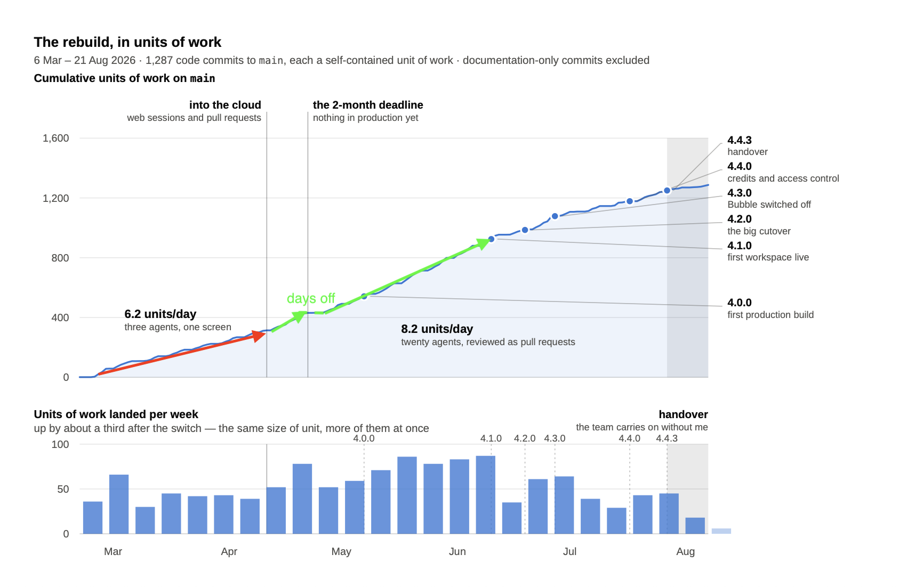

# Issue #28: Re-window the before/after rates on the commit-cumsum chart

- **State:** open
- **URL:** https://github.com/vzakharov/vovazakharov.com/issues/28
- **Author:** @vzakharov
- **Created:** 2026-09-06T19:02:36Z
- **Updated:** 2026-09-06T19:02:36Z
- **Closed:** _not closed_
- **Labels:** _none_

---

## Body

The commit-cumsum chart (`public/case-studies/assets/playgram-commit-cumsum.svg`, and the prose around it in `public/case-studies/playgram.md`) reports the switch into the cloud as **6.2 → 8.2 units of work per day**. Both windows are drawn wrong, so the ratio understates the effect.

## What is wrong

**The "after" window runs too long, and includes days that were not worked.**

- It should be measured between the two green lines in the annotation — the stretch that begins once work resumes after the break, not at the 25 April cloud switch itself.
- A considerable number of **days off** fall inside the current window. Idle days drag the daily rate down without saying anything about how fast the work went.
- It should **end at `4.1.0` (24 June)**. Before `4.1.0` the job was shipping the Bubble-parity app; after it, the job was bug fixes and later new features. That is a different kind of work, and averaging the two together measures the change of assignment rather than the change of tooling.

**The "before" window starts too early.** The red arrow currently begins at the very start of the project, which was a **docs-only phase**. Excluding documentation-only commits (as the chart already does) is not the same as excluding a period during which documentation was the work — those days land in the denominator as zeroes.

## What to do

1. Pick the four dates: start of the before-window (after the docs-only phase), its end; start of the after-window (after the break), and `4.1.0` as its end.
2. Recompute both rates over worked days, not calendar days.
3. Redraw the annotations on the chart to show the windows actually measured, so the picture and the number agree.
4. Update the prose in `playgram.md` and the chart's alt text, both of which currently quote 6.2 and 8.2.

## Why it matters beyond the chart

`writing/linkedin/plan.md` carries a post ("What parallelism actually measures as") whose entire content is this number. It is marked unsettled and blocked on this issue — it cannot be drafted until the windowing is fixed, because the post's whole claim is that the honest number is smaller than the marketing, and an honest number has to be honestly windowed.

---
_Generated by [Claude Code](https://claude.ai/code)_

---

