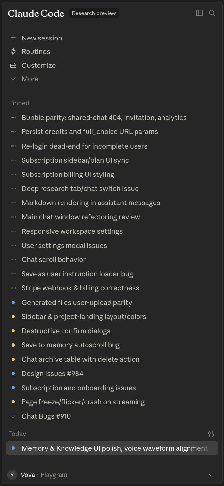

# Issue #4: Playgram case study Part I (wip)

- **State:** open
- **URL:** https://github.com/vzakharov/vovazakharov.com/issues/4
- **Author:** @vzakharov
- **Created:** 2026-08-17T13:47:49Z
- **Updated:** 2026-08-20T22:52:04Z
- **Closed:** _not closed_
- **Labels:** _none_

---

## Body

Make, first as an in-repo md file (for further conversion into a proper page and PDF once the content is finalized -- not as part of this issue), a case study of my recent work (Mar 9 - Aug 9) converting the Playgram bubble AP to code.

Approximate plan/structure. Notes:

- brackets indicate what needs to be supplemented by the agent themself
- when I use Russian, it's not an indication to use the same in the story -- I was just struggling to find the right idiom, but you won't:)
- although you'll be most certainly extending on my thoughts below, pls try to keep my tone of voice, and certain parts verbatim, even when they sound mildly unnatural (but not if they're way off)
- throughout, pick some quotes you can use as quote callouts (like, something first put in the text is then repeated as a separate quote)
- when we mention specific workspaces, do not include their names, as this repo is public, as well as all its branches/PRs
- the structure/splitting into sections/their order is from my head and does not have to be the same. If you think you can suggest a better structure from the pov of storytelling or otherwise, pls do.
- after writing so much in this brief, I don't even know if all of it belongs in the case study. Maybe some of this is subject to follow-up articles instead. I don't want to lose it because it all seems equally important to me, but of course we need to think from the pov of a reader, and of course the cta (not one we'll mention openly, but one we keep in mind) is "hire this guy"
- as you can see, I ended up making this "Part 1" because of just how much info I'm trying to fit in. I'm just feeling that if I don't, I'll never finish it because writing this brief is taking its toll on me lol

Title: From Bubble to Nextjs in 4 months: Playgram case study

disclaimer: the disclosures in this case study were approved by Playgram management, i.e. no NDA breach

pre-intro: after I started writing this case study, I realized that even the [brief](https://github.com/vzakharov/vovazakharov.com/issues/4) I'll give Claude to hydrate turned out to be X,000 [tbd] words long -- and even then, after I've finished it I understand that I've only scratched the surface of everything I wanted to tell. So, (a) sorry it's so long, (b) check out the mini version, micro version and nano version [we'll have to create all three], and (c) I'll post more detailed insights on some or all of the aspects later.

## intro

in case you didn't know, bubble is a no code app builder

when you think of such tools, you'd think that people would just use it to make simple things like [enumerate a couple]

but you'd be surprised how far people can actually take it -- bubble's been used to create [research and list a few eyebrow-raising use cases; perhaps bubble's own [success stories page](https://bubble.io/customers) is a good place to start]

in our case, we're talking about Playgram, an app that managed to put together a chat interface giving access to multiple providers and models, realtime team/project chat UIs, libraries of generated images & files, memory & knowledge management, voice input, and tons of other small "nifties" -- all brought to life with no code at all:

./attachments/16e67cd5-5727-419b-be2b-ffaa2541a44c

(This is a screen recording already after migration to code, but you get the idea.)

so why would then they want to switch to code if it was all so great?

## why

[for each of the points below, it makes sense to make some research to grab an actual pain story or two; not to mention them specifically, but to just put them as markdown links on respective phrase here or there, so it doesn't look like hand-waving]

1- performance. however hard you try, when you put abstraction over abstraction over abstraction to make an app work in a "draw a couple interconnected boxes, and it just works" fashion, you're bound to hurt the performance. Забегая вперёд, moving Playgram to Next changed cold load times from multi-second to sub-second; something which is _instantly_ tangible for a user, even if "wait a couple secs at first load" doesn't sound like such a big thing.

2- bumping into the bubble's edges [use some clever wordplay as in bubble as the platform vs an actual bubble]. All too many bubble developers have faced the same thing again and again as their apps grow: they meet the system's limits and end up installing (and sometimes purchasing) third-party plugins, running vanilla js in browser, or even up writing their own reactivity frameworks to make up for what bubble can not provide. In case of Playgram, by the way, the makers are Zeroqode -- the #1 provider of bubble plugins [source claim], and they still felt like they were lacking.

3- missing out on all the AI agents stuff. Although bubble has been making inroads into using AI for its builders, needless to say its capabilities are far beyond what modern tools like Claude Code, Cursor, or Codes provide. The team was feeling like they were missing out on being able to deliver more feature in smaller time frames

## what

so that's what Levon and his team came up to me with. They wanted a fully functional code-based rewrite of an already working app shipped in 1.5-2 months (a timeline I agreed to but didn't ultimately meet).

To give some perspective of why this was a pretty challenging endeavor:

1- A Bubble app export -- the "code" in "no code" and the thing that you're going to feed to an agent while rebuilding -- is a multi-megabyte JSON. In case of Playgram, it weighed 11 megabytes:

Suffice to say, VS Code crashes when you try to open a JSON that big -- good luck feeding that to an agent.

2- This was a live app in the beginning of its lifecycle -- the team was meant to keep shipping new features, improving prompts, and catching bugs while a code rewrite was being built in parallel.

3- The team invested quite a lot into design, so they were adamant the rewrite had to be not just functionally equivalent, but a _pixel-perfect_ match visually, too.

4- Like most Bubble apps, the app kept its data in Bubble's proprietary DB format, with no way of easy data migration to a new platform, whatever that would ultimately be.

Below you'll find we tackled each of these challenges; how we discovered new ones I would've never envisioned, and what mistakes we made along the way (so you don't have to).

## How

This is the grit of the case study, split into phases of working on the rebuild. Where applicable, each part will be covered with "what we did right" and "what I'd do differently next time".

But first of all, a brief snapshot on the project timeline

[Here I need you to explore the codebase evolution and split it into phases. Besides looking at the commits per se, one thing we can do is trace LOC growth vs file types/slices/else, to figure out the kind of work and the domains we were working on. Two specific points in time we want to keep in mind is 2 month-ish from the beginning -- the original intended timeline, how much was done by then? then release 4.0.0 (first production build), 4.1.0 (first workspace cutover), 4.2.0 (second, biggest workspace cutover), 4.3.0 (all workspaces cutover), Aug 7 (last day of my full-time assignment), now).]

### The split

As I already said, the JSON that is an exported Bubble app is a 11 MB file minified, so not even the most context-rich agent would be able to eat it at once. That's why the first step I took was write a script that splits it into pieces.

But "splitting" isn't as straightfoward as it seems

1- You can't just grab subobjects, cutting them by some ceiling size, and expect an agent to be able to handle this. For context, our _ultimate_ split turned out to be [restore & count] files -- far more than what an agent can comfortably navigate.

2- Even if you DO manage to split it ones -- remember, the app changes; so every week, once you re-export the bubble app and try to have the agent to "look at the diff", you'd get a chaotic mess that would be impossible to make sense of.

What we did right: The agent research common data structures with the JSON programmatically, figuring out what a usual "wokflow" is, how its constituent "actions" look like, which keys store "names" of all those entities, etc. As a result, it was able to split in something that _almost_ looks like code (or, at least, enough so for an AI agent -- not a human, mind you -- to be able to figure it out):

[Find some representative file from the split from its last existing snapshot, a152276, I can take a screenshot of]

Best of all, now every button, input group, workflow, etc., was tied to a specific file in the "split" -- if the bubble app ever changed, it would more likely than not be represented in diffs in relevant files.

There was a lot of trial and error along the way, but overall I would say it was one of the most successful parts of the project, and something that definitely is a know how to keep for further projects.

Verdict: 10/10 would use again.

Now that an agent had the app's intricacies more or less figured out, it was time so start... coding? No, doc'ing!

### The decision docs

Apart from the script used for splitting, NO code was shipped in the first two weeks of the assignment. Instead, we worked on decisions such as:
1- Which hosting to use
2- Which db platform
3- Which framework, after all
code-wise, the project was greenfield -- although the app itself wasn't -- so every road was open.

Even stuff like which Node version to use or [pick one or two extreme examples] was subjected to scrutiny.

The decision process was insanely intricated: four different models from different providers (OpenAI, Anthropic, Google, Kimi) each made its own research, then a fifth model synthesized their inputs and provided it for us humans to decide on.

[Find some example of an early decision made so I can put a screenshot of a commit message or a doc including several opinions]

Frankly? I think it was to a considerable degree overthinking and -- I hate to admit that -- avoiding (future) responsibility. "But five agents told it would be fine!" sounds like a good argument until it isn't. (A note aside, I think here lies the most important thing to keep in mind when coding with agents: whoever writes the code or a document, it's _you_ who gets kicked if things go wrong, and rightfully so.)

Verdict: 6.5/10; next time I'd probably spend much less time on obvious things. (Obvious counter-argument: next time I will have the setup that worked the first time, so I would likely not need so much decision-making at all.)

[Make a callout for decisions actually made. Under Railway, make an asterisk note saying that we had initially started with GCP, but its overengineered and unfriendly approach to everything made us switch to Railway less than a week into trying to make GCP work. "Could've been a skill issue"]

### The strutwork: FSD, linters, and other things to keep the agents focused

Now, if there's one thing I've learned about coding with agents is, agents work best when there's strict guardrails in place. For their own good. See, especially when it comes to "where to put what" decisions, agents work by the "nearest neighbor" principle. If you awkwardly misplace a line of code, cross-importing a low-level abstraction from a high-level component module, the next agent working on your codebase is more likely to do the same again. And again. And again. Over time, the likelihood of your codebase getting properly screwed up converges to 1.

Which is why, from the moment the first line of code was placed, I made sure to introduce SUPER-STRICT project structuring and linting requirements, and they only grew stricter as the work progressed.

The control freak work here consisted of three angles:

1- feature-sliced design. In case you don't know the term, feature-sliced design, or FSD, is an approach to (mostly) frontend development that prescribes splitting your code into _layers_ and _slices_, with rigid rules on what can be placed where, and what and how can import from what and where.

As an example, in our final state, we have the following interconnected entities, features, widgets, and pages:

[insert a mermaid diagram displaing import directions]

Even without looking into the code of each of them, such a structure gives not just an agent, but every human who first looks at the directory structure, an approximate understanding of what's going on. This has helped immensely especially when new features came into view: the agent doesn't need to spend its time, mental resource -- and tokens -- thinking about where to place that member-group access control feature we discussed in the standup and that has now to be implemented. It sees clear, logical patterns, and follows them.

An unobvious beauty of it, which you only discover through struggle, is that when you have something that does NOT seem to fit, it almost always ends up meaning you've got some higher-level conceptual understanding wrong. The form ends up defining the essence -- for everyone's better.

Verdict: 8.5/10 only because I think I could be MORE rigorous with intra-slice hygiene.

2- linting

Now, I'm a simple man: I see a lint rule, I turn it on. No, seriously, we have [insert number] linting rules enabled in the project: [this many from this package, that many from that package, etc.]. We also have [this many] hand-written ones on top. AND, where linting itself isn't enough, we've written standalone scripts that make it even harder for an agent to go astray.

For example:

- [the linter rule that requires to put `{ ...{ wug } }` instead of `wug={wug}` on components
- the one that prohibits using bare `eq(table.field, field)` in favor of the hand-written `matches(table, { field })` helper
- [some other nice one]

Individually, they don't seem like a big deal. Together though, they make the entire codebase look DRY (we'll write about DRY later), clean and less token-wasteful for agents who keep reading them 100s times a day.

To top it all, the fearful `type-overlap` script that [describe]. Its blast radius was actually so big we had to ratchet it in 5 to 10 stages before the entire codebase was clean. Overengineering, you think? But think about this: [arguments]. Especially in an agent workflow, this is not something you should take lightly.

Verdict: 10/10 -- they just work, make the code cleaner, and, unlike humans, agents don't get rage bouts from them.

Tip: Put something along these lines in your CLAUDE.md to stop agents from trying to circumvent lint rules:

> Do not contort the architecture solely to silence a rule. Rules exist to keep the codebase consistent and safe — work _with_ them, not around them in a hacky way.

### Planning

Now that we had the functionality figured out (or so we thought), and all the strutwork in place to not have the code fall under its own weight once it's there, it was time to figure out where to actually start.

Our initial approach was: if we know the entire functionality, why not just describe everything we have to do in a single document? That's how the "migration plan" was born, and it looked _very_ detailed -- including code paths, [smth, smth]:

[Find some state from the era when it was detailed so I can make and insert a screenshot]

As the work progressed though (we'll get to that later in more detail), this detailness started being more of a burden than help: There's few annoying things more important and few important things more annoying than avoiding codebase documentation from drifting, and this file was prime illustration of it.

Verdict: 6/10 -- next time I'd keep only the big picture in the plan, leaving the details to figure out as we go.

### Execution (with agents)

Before I started working on the project, I used to work with 3, tops 5 parallel agents at once, all on my local machine, all with carefully looking into every line change as they made it, and even into their "thinking" (talk about micromanagement). The way this assignment turned me from this to comfortably handling 10-15 parallel sessions, all in claude, with focused code reviews instead of "looking from behind the shoulder", represents probably the biggest evolution of me as an AI-enabled software engineer.

Look at the number of commits\* shipped across time, you can precisely [this needs to be confirmed] see the spot where my mindset changed:

[here we'd need a cum-sum char]

- Here, a "commit" is not just "a piece of code shipped to github." Before switching to a PR-based approach (more on that below), every commit to main was a finished set of work on a specific, well-defined scope. So, basically, you can say it _was_ a PR, just not formed as such. After the switch, every commit on main is a squash from a PR branch -- so, throughout this codebase's evolution, the "conceptual" meaning of a commit on main hasn't changed.

So what drove it and how exactly it translated?

#### Cloud-based agent VMs

Like many, I initially started using Claude via its VS Code plugin; after a while, like many again, I switched to the CLI because it seemed to roll out new features and fixes faster. However, both suffered from the same thing: I had to have my laptop on, and, when it was more than 3-5 agents, it just started melting under the load.

So my initial switch to the web interface was one born out of necessity, and very reluctantly.

Thing is, my first-ever introduction to coding agents was via the first version of Codex, which ran on web, and the UX felt counterintuitive and cumbersome. I imagined it would be the same.

It also felt too "hands-off" that the agent would be working _somewhere_ that isn't _right here_, you know?

Finally, constantly having to merge conflicting branches into main seemed like it would have been quite a headache.

But boy could I be wronger.

Mere weeks after starting, I was already running 20+ agents at once, limited only by the account's five-hourly quota:

So how did my fears resolve?

1- UI/UX has largely improved.

Depending on your choice of the agent software (Claude Code/Cursor/Codex/etc.), these will vary, but I can judge by the first two, and both are _really_ convenient to use.

- Each starts a new branch in the cloud, which can be turned into PR with a click of a button (although I did end up replacing it with my own /pr skill -- more on that below)
- Whenever there _is_ a PR, you can conveniently navigate to it to review files, post your comments, and hand them over to the agent afterwards
- You can pin the sessions you're working on right now, and the sidebar shows each with its current state -- in progress vs completed -- so switching between them becomes a matter of clicking any one that's currently idle

A callout on choice of software, models, etc.: Things all those benchmarks don't usually tell you is: It doesn't make much difference! Each model and each app has its quirks -- but at this point, all are really good. If you read in a bechmark, that <this model name> now beats <that model name> by 100 ELO points in coding tasks, don't take this as an urge to FOMO.

2- “Hands-off” engineering actally turned out much more comfortable than I thought

Like many coders, I liked to be “close to code.” I thought, I know the tricks of the trade better than an AI would do, I had opinions on how certain things should look, etc. Well, guess what, I still do, in a way (for 95% of case, agents do know better than me, but the remaining 5% isn’t trifle, it can actually steer the architecture from going astray).

But here’s the thing: You don’t have to be constantly _in_ it to be able to steer it. Right now my flow is almost 100% based on code reviews I do in gh's native interface based on _already made_ changes. (And, of course, before that there is also most often the planning stage, which I also review rigorously.)

In a way, I turned from a boss who's constantly micromanaging his team to one who reviews the outcome, not the process.

3- Handling merging conflicts turned out to be the most overestimated complexity

Apart from handling database migrations, which do have the tendency to go south if worked on simultaneously in different branches (and I'll get back to this later), agents turned out to be perfectly capable to resolve merge conflicts in a large variety of situations. I'm not only talking leading the branch to _technically_ not having conflicting files with main, but about actually having a thought about what changed here, what changed there, and how the changes interacts between each other. Yes, it took writing a [skill](https://github.com/vzakharov/agent-project-boilerplate/blob/main/.claude/skills/sync-branch/SKILL.md) to make sure the usual footguns are taken care of -- but, after a thousand PRs resolved this wat [here pls double check how many actual PRs since this approach was introduced], I've had zero problems with agents doing this.

#### Building the skills

Now, this is perhaps the tastiest part for anyone dabbling with coding agents. Over the work, I came up with a variety of skills that make sure every repeatable process behaves in an expectable way, here are just some of them

I'll actually give you all of them:
[List all the skills we have on that repo. If some are outdated, I'll ask to remove them during the review. It should something like a table with one cell for the skill title, one with a short description, and one with a bullet list of how it helps (each bullet being really short and starting with a third-person verb)]

#### Planning and implementing

`/plan` and `/implement` among the skills above are perhaps worth talking more about at some length.

Obviously, everyone knows all the agent software already has "plan mode", so why create a skill that does the same?

Well, believe it or not, it initially started as a way to work around a [bug](https://github.com/anthropics/claude-code/issues/72704) in Claude Code: [describe the bug in a simple way].

So I thought, okay, I'll just create a skill that would do _exactly_ the same as what plan mode does (by mentioning it by reference), but produce an in-repo, tracked file instead of a transient, ephemeral, obscurely stored plan file-object.

But what started as a workaround ended up being not just a permanent part of my own workflow, but the core of a [spinoff](https://github.com/vzakharov/agent-project-boilerplate) I created to then use in my other projects, new and old -- but more on that later.

First of all, I've been able to squeeze a few essential things into both `/plan` and `/implement` that aren't part of the usual "create a plan" / "implement the plan" flow. For example, the "/plan" skill prescribes to include a "DRY notes" section in the plan, which would specifically mention steps that will be taken to prevent the codebase from bloating and WETting.

And /implement skill includes:

- prescription to run the `/dry` sill again (!) -- because even if there were DRY notes in the plan, the agent (from experience!) will often and up inserting repetitive code in places that weren't described in detail in the plan
- Run the "/tighten-docs" skill, which does two things:
  -- a "make the docs durable" step. You might've encountered this: an agent works on your review, and they start inserting stuff like "it was this, now it's that, because..." -- stuff that does _not_ belong in the codebase because it describes archaeology that noises the reader's context window (whether a human or an agent). So it will meticulously go through the added prose and bring it back to describing "durable contract" instead of said archaeology, for example: [add an example]
  -- a "tighten the docs" step, because gosh agents can be loquacious when they write docstrings, comments etc. (btw, throughout this, I'm referring to "docs" as anything that describes how the app/code works -- it doesn't have to be an .md file; a two-line comment in an especially tricky part is a doc too).

But most importantly, once I started having the plan in my codebase, I started thinking, hmmm, do I even have to implement this plan _with all the conversation context kept_? After a few trials, I concluded that no, I don't!

Which led me to probably the most important part of the process I've adopted and that I now replicate everywhere, which is

#### Session-based development [The naming is lame, see if you can come up with something snappier]

One of the biggest killers of agent productivity (and your wallet) is bloated context. Whenever I get to consult someone on how to use agents, the first mistake I see -- over and over again -- that people will just not ever end their conversations. "Do smth here; or let's also do smth there; oh, you know what, let's also do this totally unrelated thing."

Yes, today's agents can handle up to 1M tokens of context, but it doesn't mean you should use them all! Moreover, my rule of thumb is: if you're anywhere past 200k, you've likely strayed too far, and the agent can no longer reliably remember\* the stuff you started talking about.

Now, when I say "remember", it doesn't mean it has no recall. Most likely if you ask them to reproduce some exchange from earlier in the convo, they'll be able to -- but they won't be able to use _all of it_ reliably.

If you're old enough to have lived through the digital camera revolution of early 2000s, you remember the "race for megapixels". 2, then 4, then 8, then 16 -- but at some point you started realizing that more megapixels just meant more noise on the matrix; the stuff has become a marketing race, not a technical one.

This long rant is meant to say: In any given session, you must hold one specific thread for the agent. If you have a side thought, it's better to create and use a separate skill to file [follow-up issues](https://github.com/vzakharov/agent-project-boilerplate/blob/main/.claude/skills/propose-issue/SKILL.md) on github rather than pulling the agent every any way.

Okay but what does any of this have to do with planning and implementing? Here's what: when you've written a plan, _iff_ it is a good plan, it _has_ to be enough for the agent to follow through. No previous part of your conversation -- how you came up with this approach instead of that approach -- should be a factor to the quality of work done. It's like a litmus test: if it doesn't hold, it means your plan itself is bad.

Then, this makes the next consequence obvious: if your plan is necessary and sufficient for quality implementation, you can just start a new session and implement from there. It's obviously not possible with the standard UX-based "plan mode" (there's nothing to start "from"), but with a plan file that sits right in your repo on this feature's branch, it fits perfectly.

I even ended up instructing the `/plan` skill to always provide a copiable instruction that I can just paste in a new session, and the `/implement` skill will "attach" itself to the needed branch, find the plan file, and start executing it.

For example, here's how it looks for the plan to write this exact case study:

[We'll add a screenshot here once we get to this stage]

(Right, these skills can be applied not just code -- I actually do even all my personal stuff in a separate repo with almost the same set of skills now, that’s how versatile it is. And yes, you can read what was actually used as an input to create this case study: https://github.com/vzakharov/vovazakharov.com/issues/4 -- I've nothing to hide.)

So in the end, my usual flow goes like this:

Session 1: start writing a plan using the `/issue` skill (if you laid it out on gh first, or if e.g. it the [log review](https://github.com/vzakharov/agent-project-boilerplate/blob/main/.claude/skills/log-review/SKILL.md) agent created it itself), or just from `/pr do this-and-that`. Review the plan, discuss it, come up with the decisions for the forks.

Session 2: `/implement <branch/name>` -- which the agent in session 1 gracefully provided. Go to the PR, review code, add comments.

Session 3: `/from-branch <branch/name> address code review` -- the agent sees my comments, also sees the entire PR history, does the changes, replies to all of my comments right on gh (also _very_ handy, because you get the archaeology of every decision taken, also helps restore your memory when you're coming to the PR from one of the 10 others you're working on simultaneously).

Session 4: `/finalize <branch/name>` -- it removes the unnecessary artifacts (such as the branch file itself), sees how the trunk has advanced since, merges it in, runs the necessary quality gates (more on that below), fixes them, and hands it off to you to merge.

I always merge with a squash -- I don't want each PR's detailed archaeology to reach `main`, I need one commit with a snappy title and a high-level description body, so any agent (or a human, for that matter) trying to figure out how this or that feature came to be, or how this or that file advanced over time, or what stuff we need to include in the [release](https://github.com/vzakharov/agent-project-boilerplate/blob/main/.claude/skills/release/SKILL.md) (more on that below).

## To be continued

This ends Part I of the case study; coming up in Part II:

- Continuous integration and deployment
  -- Unit, integration and E2E tests, and why it may not be a good idea to run all on every PR & merge
  -- Using Claude Code's own VM as the petri dish to avoid spending money on GitHub actions
  -- Release cycles and hotfix break-ins
- Data migration
  -- [some three-way split into sub bullets too]
- Stuff that sounds simple but isn't
  -- Navigation and that PR we had 75-commit, 139-file PR [referring to https://github.com/Playgramai/playgramapp/pull/2006] we had to ship mid-production because our representation of "what chat exists" kept bloating and drifting as more and more consumers were added
  -- Attachment handling: spreadsheets with unexpected stuff in them, images that failed to convert, and spreadsheets, always the spreadsheets, that made us end up writing a home-grown XLS reader
  -- Memory chunking and that time a malformed HTML hang our entire app for 4+ hours and made us start using workers (I know I know)
- And, finally, why the hell it seemed like everything was ALMOST ready in 2 months, and stayed ALMOST ready for 2 more, or Pareto never fails.

Stay tuned!

---

## Timeline (status, references, and other events)

- **2026-08-20T22:50:23Z** @vzakharov renamed from «Playgram case study (wip)» to «Playgram case study Part I (wip)».
- **2026-08-20T22:52:04Z** @vzakharov assigned @vzakharov.
- **2026-08-20T23:03:39Z** @vzakharov cross-referenced this issue from [#5 feat: adopt the /issue skill from the agent boilerplate](https://github.com/vzakharov/vovazakharov.com/pull/5).
- **2026-08-20T23:15:16Z** @vzakharov referenced this issue in a commit: https://api.github.com/repos/vzakharov/vovazakharov.com/commits/009436cd188861b7da516a8aa2e209f156cbd761.
