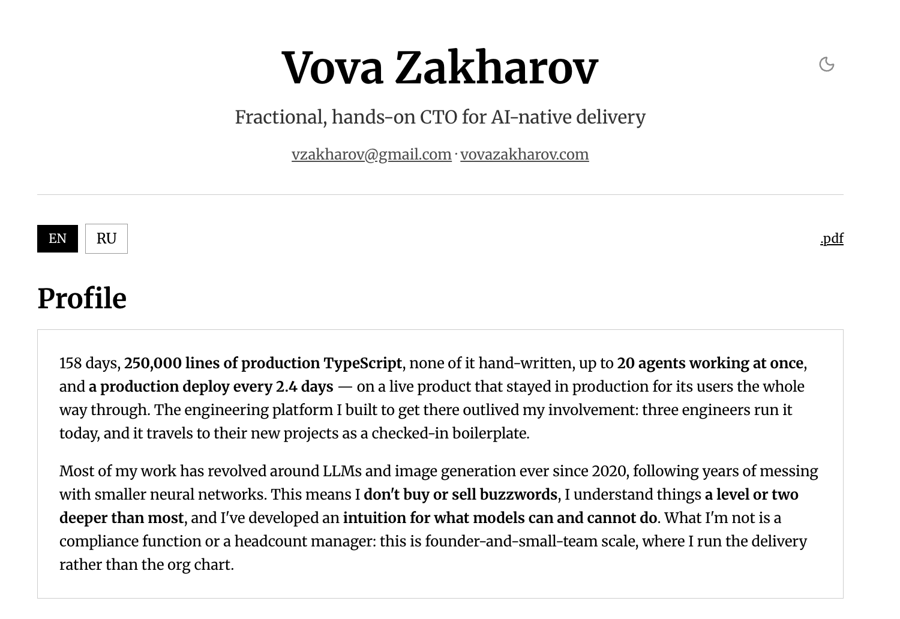

# Issue #40: The theme toggle should come from a layout, not from every page that wants one

- **State:** open
- **URL:** https://github.com/vzakharov/vovazakharov.com/issues/40
- **Author:** @vzakharov
- **Created:** 2026-09-09T23:46:58Z
- **Updated:** 2026-09-10T00:43:03Z
- **Closed:** _not closed_
- **Labels:** _none_

---

## Body

Raised in review on [#36](https://github.com/vzakharov/vovazakharov.com/pull/36):

> frankly, not a fan of idea of putting this in every consumer that needs a theme switcher -- because all of them do. I'd rather prefer a layout (if that's the right term)-based approach where the theme always comes. but not here, so let's file an issue

## What

Six pages render `<ThemeToggle />` themselves, two of them through `CornerHeader`:

| Page | How it renders the toggle |
| --- | --- |
| `pages/home` | `CornerHeader corner={<ThemeToggle />}` |
| `pages/cv` | `CornerHeader corner={<ThemeToggle />}` |
| `pages/writing` | a `<Group>` of its own |
| `pages/music` | a `<Group>` of its own |
| `pages/case-studies` (index) | a `<Group>` of its own |
| `pages/case-studies` (article) | a `<Group>` beside the back-link |

That is every page on the site, which is the objection: an opt-in every consumer takes is not an opt-in. A page that forgets it ships without a toggle and nothing says so, and the four `<Group>` sites are also where `print-hidden` went missing before #36 put it on the control itself.

## The shape to reach for

The toggle moves into the app layer — `src/app/ui/root-layout.tsx`, or a wrapper it renders — so it lands once, out of the page's flow, and a page renders nothing for it. `CornerHeader` and its two call sites go away with it; the four `<Group>`s lose a child.

Two things to work out on the way:

- **Where it sits per page.** The current corner is positioned against the *header's* box, which is why `CornerHeader` owns both halves of it. From a layout the anchor is the viewport or the page shell instead, so the control's position stops tracking the header — fine on the pages that put it in a row today, a visible change on home and the CV, where it is currently level with the avatar and the name. Worth looking at with `/preview` rather than deciding from source.
- **The article's back-link row.** On `/case-studies/<slug>` the toggle is the right-hand end of a `justify="space-between"` nav whose left is the back-link. Hoisting the toggle leaves that row with one child and a `space-between` that no longer means anything.

Neither is load-bearing on #36, which is why this is filed rather than done there.

---

## Comments

### Comment by @vzakharov on 2026-09-10T00:43:03Z

[https://github.com/vzakharov/vovazakharov.com/issues/40#issuecomment-5610898322](https://github.com/vzakharov/vovazakharov.com/issues/40#issuecomment-5610898322)

To the questions:

1- I'd say it's fine if it always sits in the top-right corner, regardless of the current page's header/max width. but we'll need to see and test

2- well the back-link stays on the left, where it is now; the theme toggle is in the same place visually, even if the means are different.

Unrelated but riding along: make the buttons in CV sit above the separator, not below it:

---

## Timeline (status, references, and other events)

- **2026-09-09T23:54:30Z** @vzakharov cross-referenced this issue from [#36 feat(cv): refresh the CV and rebuild the theme picker as two-state](https://github.com/vzakharov/vovazakharov.com/pull/36).
