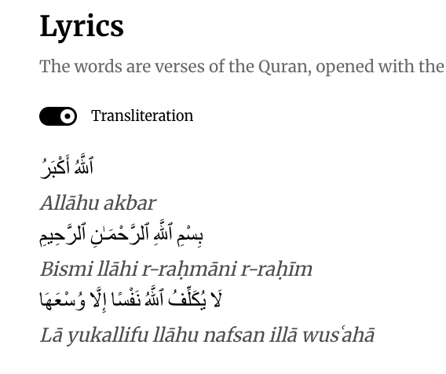
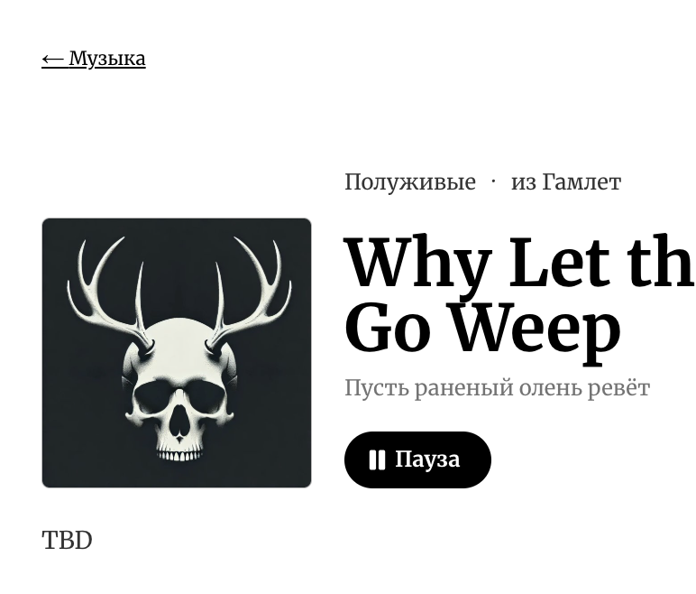

# PR #115: feat(vova): hidden song catalogue, index tabs, slugs, one title shape

- **State:** open
- **URL:** https://github.com/vzakharov/vovazakharov.com/pull/115
- **Author:** @vzakharov (agent)
- **Base ← Head:** main ← claude/music-catalogue-hidden-ldz252
- **Draft:** yes
- **Merged:** _not merged_
- **Created:** 2026-10-07T06:35:11Z
- **Updated:** 2026-10-09T12:21:19Z
- **Closed:** _not closed_
- **Labels:** _none_

---

## Awaiting an answer: 6

_Unresolved threads whose newest post is a human's, and human reviews and comments that are new since the last export or that no agent post has followed (the export committed at 6612c69). Resolved threads never count; an `(agent)` tail is a reply already given._

- **T31** `apps/vova/public/music/mithqal.md`:73 — unresolved — last: @vzakharov (human) 2026-10-09T12:06:23Z — "потусклее бы транслитерацию, и может шрифт поменьше, сейчас…" → [↓](#t31)
- **T32** `apps/vova/public/music/schadina.md`:40 — unresolved — last: @vzakharov (human) 2026-10-09T12:10:00Z — "> Апострофы в Schadina (строки 59, 65, 67). Предлагаю замени…" → [↓](#t32)
- **T33** `docs/remove-before-merging/slugs.md`:1 — unresolved — last: @vzakharov (human) 2026-10-09T12:12:22Z — "надо прописать в правилах где-то методику назначения слаговд…" → [↓](#t33)
- **T34** `src/pages/music/lib/albums.ts`:90 — unresolved — last: @vzakharov (human) 2026-10-09T12:14:29Z — "давай эту обложку на весь альбом ` makes it list everything, so going back from a hidden song lands on an index that still carries it; a build ignores the variable.
- **A hidden song plays from its own page**: the play control takes a track rather than a queue position, and a track the queue does not hold joins its end (`append` in the player reducer, covered by `player-state.test.ts`).
- **147 masters from `vovas-music` are now song pages, all hidden**, `description: TBD` in both languages, beside the ten songs already on the site. Words come from his Suno profile and his review, set as verse: Suno's control markers, stress marks, drawn-out syllables and pause ellipses do not travel (`.claude/rules/content.md`), while a published poem's own punctuation stays. Two masters not in `vovas-music` (`hello-human`, `ghostly-blues`) are hosted on the site itself under `/music/assets/`, so `repo` is optional.
- **Every song and album has a readable slug**: an English title as it is, a Russian one translated to English, any other language kept in the original and transliterated (`minem-babay`, `agios-o-skopos`); the albums `ctfu` and `nsfl` keep their acronyms. **This renames seven of the ten songs already live on vovazakharov.com, so their old addresses stop resolving once this merges**: `first` → `20`, `june` → `breathe`, `rak` → `cancer`, `sashas` → `dad`, `letim` → `lets-fly`, `reka-2` → `river-part-two`, `wereback` → `we-re-back`. There are no redirects; Vova confirmed nobody had seen those pages.
- **`/music` opens on three lines of intro and a «Shuffle all» button**, which plays the whole public catalogue in a fresh shuffle from its top (`shuffleAll` in the player reducer, tested); the pull quote and the SoundCloud, Suno and GitHub lines are gone.
- **The index is three tabs, Artists / Albums / Songs**, each its own static page — `/music`, `/music/albums`, `/music/songs`, the same under `/music/all/` and in Russian — so `songs` is a reserved song slug. Artists is a grid of artist tiles (two to a row on a phone, four from `md`); Albums every album newest first, with its artist and years; Songs the full track list. An artist page shows its albums as a cover grid, newest first by the latest song date, since albums carry no release date, and among them the songs on no album that the artist leads, as tiles linking to the song («Single · 2025»); an album page numbers its tracks from `track` and states its length the way streaming services do («10 песен, 33 минуты»). The same pages under `/music/all/…` carry the hidden songs too — `noindex`, out of the sitemap, linked only from hidden songs. On a song page the artists and the album are links, underlined on hover (`NameLink` in `shared/ui`), and so is each artist in the player bar; the credits sit under the lyrics, a line for music and then one for lyrics.
- **Every picture is a cover** (`pages/music/lib/pictures.ts`): a song page shows the song's own cover, else its album's; an artist is pictured by its newest album that has a cover, else its newest single's, else that of the newest song billing it. Eight songs have a cover of their own and twelve albums one, some taken from Apple Music where the repository holds none; the same picture is the page's social card.
- **Only the catalogue's schema stays in `shared`**: `src/shared/music-catalogue` holds the frontmatter schema and the project and album names it validates against, with an `index.node-safe.ts` for the scaffolder and the tests; how projects and albums are shown, addressed, billed and pictured is `pages/music/lib`.
- **One title per song**: every one of the 157 songs states its `title` once at the top level, a locale only where it differs, and a gloss as `title: { transliteration, translation }`. The line under a title shows only when the title is in a script the reader doesn't read, its translation with no language prefix (`title-gloss.ts`, tested). A title that is itself a romanization carries `titleTransliterated: true` and is set in italics wherever it shows, as transliterations are in the lyrics (`_…_`, `lyric-inline.ts`). `pnpm check:song-titles` fails on a title a reader cannot place — a missing gloss for a locale, a missing `titleLanguage` where the title is not in the language sung.
- **A transliteration switch over lyrics in another script**: a song carrying `<!-- lyrics:<lang>-latn -->` (`mithqal`'s Arabic first) gets a switch above its words, off by default; on, each romanized line sits in italics under its own, never in place of it. The build fails when the romanization does not match the words stanza for stanza and line for line, or carries a note.
- **Second review round's content**: albums «Папа-море» and «We Made AI Sing Our Old Shite», the project «Листопад», credit corrections, about 45 sourced notes on the lyrics, lyrics cut to what is sung, ё written in the Russian columns, and expletives written out — `pnpm check:masked-words` fails on a word masked with asterisks. It and `check:song-titles` run in vet through `scripts/vet-songs.sh`, only on a branch that changes a song or the checks themselves.
- **What made the catalogue possible**: `language` became a list (main language first), with Tatar, Arabic, Polish, Latin, Chinese, French, German, Italian and Spanish; a song sung wholly in one of them shows a crib in the reader's language beside its words. Albums and projects joined their registries, and a project can be billed under another name per language (Yoohie is «Йухи» on Russian pages). The same whole-line `[^label]` ending consecutive lines gives the group one note. `pnpm music:scaffold --spec <file>` takes the master and the authored fields. `pnpm type-overlap` is clean.

## Open before merge

- **`pnpm check:prose-quotes` fails on `apps/vova/public/music/schadina.md`, lines 59, 65 and 67**: the straight apostrophes there mark soft signs in the transliterated words. Waiting on Vova's call on writing them as ʼ (U+02BC), which the check accepts.
- **The PR is `CONFLICTING` with `main`**; `/finalize` merges the base.
- **The full `./scripts/vet.sh` has not run** on this branch's latest state; `/finalize` runs it.
- **For Vova to check**: every guessed master, project and language carries a `<!-- For Vova to check: … -->` comment in its song file — `grep -l "For Vova to check" apps/vova/public/music/*.md`.

## QA Checklist

- [ ] `hidden-off-index` — `/music` and `/ru/music` show only the artists of public songs; the player's next/previous never reaches a hidden song.
- [ ] `show-hidden` — under `SHOW_HIDDEN=1 pnpm dev:vova`, `/music` shows every artist `/music/all` does, and «← Music» from a hidden song keeps them; under plain `pnpm dev:vova`, and in `pnpm build:vova`'s export with the variable set, it shows only the public ones.
- [ ] `hidden-page` — `/music/minem-babay` renders, plays, and the player bar shows it while it plays; next from it goes to the start of the queue.
- [ ] `hidden-sitemap` — no hidden song's address and nothing under `/music/all/` is in `/sitemap.xml`.
- [ ] `hidden-noindex` — a hidden song's page and every `/music/all/…` page carry `<meta name="robots" content="noindex">`; a public song's page does not.
- [ ] `renamed-live` — `/music/breathe`, `/music/cancer`, `/music/dad`, `/music/lets-fly`, `/music/river-part-two`, `/music/we-re-back` and `/music/20` render; `/music/june` and the other old addresses 404; `birdie`, `crossroads` and `slime` keep theirs.
- [ ] `intro` — `/music` and `/music/ru` open on three lines of intro, no pull quote, no SoundCloud, Suno or GitHub line.
- [ ] `shuffle-all` — «Shuffle all» («Всё вперемешку») starts the player on a shuffled public queue from its top, with shuffle on; pressing it again starts a different order.
- [ ] `index-tabs` — `/music` heads its list with Artists / Albums / Songs, Artists current; `/music/albums` lists every album newest first under artist · years; `/music/songs` lists every public song; each tab works under `/music/all/` and in Russian (`/music/albums/ru`), and the language switch keeps the tab.
- [ ] `artist-grid` — the Artists tab is a grid of artist tiles, four to a row on desktop and two on a phone, each name said once; a tile's name opens the artist.
- [ ] `artist-singles` — `/music/all/artists/generated` shows `cross-out` among its albums as a tile «Single · 2024» opening the song; `chikh-pykh` (Yoohie featuring за/обложкой) is a tile on Йухи's page and not on за/обложкой's.
- [ ] `player-billing` — while a featured song plays, each artist in the player bar links to their page; the lock screen shows the billing as plain text.
- [ ] `song-credits` — `/music/everything-begins-with-love` shows «Music: Vladimir Zakharov Sr.» then «Words: Vladimir Zakharov Sr.» under its lyrics, and nothing about credits in the line under the title; a song with no `credits` shows no such line.
- [ ] `song-picture` — `/music/mithqal` shows its own cover; `/music/my-offence-is-rank` shows «Папа-река»'s; `/music/minem-babay`, on no album and with no cover, shows none; a song page shared in a messenger unfurls with the picture it shows.
- [ ] `artist-pictures` — on `/music/all` each artist tile shows the cover of its newest album that has one, else its newest single's; an artist with neither shows its name.
- [ ] `album-grid` — `/music/all/artists/poluzhivye` shows its albums as tiles, covers on «Папа-река» and «Кому на Руси жить хорошо», newest first.
- [ ] `quran-notes` — `/music/mithqal/ru` carries a note on each verse's first appearance naming its sura and verse, each linking to quran.com's Russian page; `/music/mithqal/en` the same in English.
- [ ] `transliteration-switch` — `/music/mithqal` shows a «Transliteration» switch above the Arabic, off; on, each Arabic line has its romanization in italics under it and the Arabic stays; a song with no romanization block has no switch. Breaking the line count of the `lyrics:ar-latn` block fails `pnpm build:vova`.
- [ ] `succumb-note` — `/music/succumb-to-me/ru` carries the so come / succumb note and, on the first «Не хочу быть рабом своего гнева», the note that the refrain is the person answering his anger; `/music/succumb-to-me/en` carries only the latter.
- [ ] `album-page` — `/music/all/albums/father-sea` numbers its tracks and states its length on its own line under artist · year («N песен, M минут» on the Russian page).
- [ ] `song-links` — on a song page the artists and album are links, underlined only on hover; a hidden song's links go to `/music/all/…`.
- [ ] `everything-index` — `/music/all/en` lists all 157 songs, `/music/all/ru` the same in Russian.
- [ ] `title-gloss` — `/music/agios-o-skopos` shows «Agios o Skopos · Holy Is the Purpose» under its English title, the transliteration in italics, and no line under «Предназначение» on the Russian page.
- [ ] `title-italics` — `/music/mithqal`'s title is in italics on the page and on its tile and row in the catalogue lists.
- [ ] `title-check` — removing the `en` translation from a song with a Russian title fails `pnpm check:song-titles`.
- [ ] `lyric-italics` — `/music/in-the-flesh` sets _Poekhali!_ in italics in its English column.
- [ ] `retitled` — `/music/hello-human` is titled “Hello, Human”, glossed «Здравствуй, человек» on the Russian page.
- [ ] `new-albums` — «Папа-море», «We Made AI Sing Our Old Shite» and the project «Листопад» each have a page under `/music/all/…`.
- [ ] `yo` — `/ru/music/my-offence-is-rank` writes ё in its Russian column (нём, её, ещё).
- [ ] `unmasked` — `/music/fuck-religion` writes its expletives out; a masked word added to any song fails `pnpm check:masked-words`.
- [ ] `multi-line-note` — `/music/farewell` shows one note over the three lines it covers.
- [ ] `site-master` — `/music/hello-human` and `/music/ghostly-blues` play from `/music/assets/` and show no «source» link.
- [ ] `multi-language` — `/music/trisagion` names Russian, Latin and English, in that order, in both locales; `/music/minem-babay` names Tatar.
- [ ] `localized-project` — a Yoohie song (e.g. `/music/because-of-you`) is billed «Йухи» on its Russian page and in the player bar, and «Yoohie» everywhere in English.
- [ ] `scaffold-spec` — `pnpm music:scaffold --spec <file>` on a spec naming a master in a repository with several root FLACs writes a song file in the new title shape that passes `pnpm format:check`.

| Item                     | Automatable | Covered? | Notes                                                                                   |
| ------------------------ | ----------- | -------- | --------------------------------------------------------------------------------------- |
| `hidden-off-index`       | e2e         | ❌       | Build, then assert the exported `/music` HTML holds no hidden-only artist               |
| `show-hidden`            | e2e         | ❌       | Done by hand in dev: 5 artists without the flag, 12 with it, as `/music/all`            |
| `hidden-page`            | e2e         | ❌       | Drive the built page in a headless browser, press play, read the bar                    |
| `hidden-sitemap`         | e2e         | ❌       | Grep `out/sitemap.xml` for every hidden slug and `/music/all/`                          |
| `hidden-noindex`         | e2e         | ❌       | Grep the exported pages for the robots meta                                             |
| `renamed-live`           | e2e         | ❌       | Assert the export has each new slug's page and none of the seven old ones               |
| `intro`                  | manual-only | —        | Copy and layout read on the page                                                        |
| `shuffle-all`            | unit        | ✅       | `player-state.test.ts` — fresh order from its top, stays shuffled; the button is manual |
| `index-tabs`             | e2e         | ❌       | Assert the export has each tab's page in both catalogues and locales                    |
| `artist-grid`            | manual-only | —        | Tile layout and wrapping across breakpoints                                             |
| `artist-singles`         | unit        | ❌       | `artistReleases` is pure: singles under the lead artist only, newest first              |
| `player-billing`         | unit        | ✅       | `player-state.test.ts` — `billingText`; the links in the bar are manual                 |
| `song-credits`           | e2e         | ❌       | Assert on the exported song page's credit lines and their order                         |
| `song-picture`           | unit        | ❌       | `songPicture` is pure: own cover, else the album's, else none                           |
| `artist-pictures`        | unit        | ❌       | `artistPicture` over fixture releases: album before single before featured song         |
| `album-grid`             | unit        | ❌       | Album order by latest song date, ties in registry order                                 |
| `quran-notes`            | e2e         | ❌       | The build fails on a dangling note; the links were checked to answer 200                |
| `transliteration-switch` | unit        | ❌       | Alignment is enforced at build; the switch's behavior is manual                         |
| `succumb-note`           | e2e         | ❌       | Assert on the exported HTML of both locales                                             |
| `album-page`             | unit        | ✅       | `duration.test.ts` — length line and plurals; track column is manual                    |
| `song-links`             | manual-only | —        | Hover styling on the rendered page                                                      |
| `everything-index`       | e2e         | ❌       | Grep the exported `/music/all/en` HTML for every slug                                   |
| `title-gloss`            | unit        | ✅       | `title-gloss.test.ts` — which locale shows which gloss; italics are manual              |
| `title-italics`          | manual-only | —        | Italics read across the page and lists                                                  |
| `title-check`            | integration | ❌       | Run the check on a fixture directory with one gloss missing                             |
| `lyric-italics`          | unit        | ✅       | `lyric-inline.test.ts` — `_…_` marks and escaped underscores                            |
| `retitled`               | e2e         | ❌       | Grep the exported page's `<h1>` per locale                                              |
| `new-albums`             | e2e         | ❌       | Assert the exported album and project pages exist                                       |
| `yo`                     | manual-only | —        | Which words take ё is a reading in context                                              |
| `unmasked`               | unit        | ✅       | `check-masked-words.test.ts`, and the gate runs in vet                                  |
| `multi-line-note`        | unit        | ✅       | `lyric-notes.test.ts` — consecutive lines sharing a label                               |
| `site-master`            | e2e         | ❌       | Assert the exported page's audio `src` is the site path                                 |
| `multi-language`         | unit        | ❌       | Frontmatter schema reads a string or a list into a list                                 |
| `localized-project`      | unit        | ✅       | `music-projects.test.ts` — the name per locale; the rendering is manual                 |
| `scaffold-spec`          | integration | ❌       | Run the CLI on a fixture spec, compare the written file                                 |

🤖 Generated with [Claude Code](https://claude.com/claude-code)

https://claude.ai/code/session_01SEnVtCceg5Gfy29f9yHRiP

---

## Comments

- **C01** @vzakharov (agent) — 2026-10-07T06:35:29Z — "Proposed squash title/body: ``` feat(vova): hidden song cata…" → [↓](#c01)
- **C02** @vzakharov (human) — 2026-10-08T21:08:23Z — "почему-то затерялись два комментария, не вижу для них даже п…" → [↓](#c02)
- **C03** @vzakharov (agent) — 2026-10-08T21:27:24Z — "Оба не потерялись, а не показываются: в PR 310 изменённых фа…" → [↓](#c03)
- **C04** @vzakharov (human) — 2026-10-09T12:21:19Z — "общий коммент, все песни в которых сейчас уже есть и descrip…" → [↓](#c04)

<a id="c01"></a>

### Comment by @vzakharov (agent) on 2026-10-07T06:35:29Z

[https://github.com/vzakharov/vovazakharov.com/pull/115#issuecomment-6032423822](https://github.com/vzakharov/vovazakharov.com/pull/115#issuecomment-6032423822)

Proposed squash title/body:

```
feat(vova): hidden song catalogue, index tabs, slugs, one title shape (pr #115)
```

```
The vovas-music organization holds far more masters than the site
lists, most of them not ready to show. A document now takes
`hidden: true`: its page is built and served at its address, but no
listing, player queue or sitemap carries it, and it is noindex; one
predicate in shared/content decides, listing everything under
`SHOW_HIDDEN=1 pnpm dev:<site>`, never in a build. 147 masters land as
hidden song pages, words set as verse with sourced notes, ё written,
expletives written out (check:masked-words holds it).

Every song and album has a readable slug: English titles as they are,
Russian ones translated, other languages transliterated; ctfu and nsfl
keep their acronyms. Seven of the ten songs already live were renamed
(first, june, rak, sashas, letim, reka-2, wereback), and their old
addresses stop resolving, with no redirects.

/music opens on a short intro and a "Shuffle all" button, then tabs
for artists, albums and songs, each a static page, with twins under
/music/all that carry the hidden songs, noindex. Every picture is a
cover: a song shows its own or its album's, an artist its newest
release's. Artists and albums link from the song page and the player
bar, and an album page numbers its tracks and states its length. A
song states its title once, with a {transliteration, translation}
gloss for a reader who cannot read its script, romanized titles in
italics, and check:song-titles holding the rules. Lyrics in another
script can carry a line-aligned romanization behind a switch, off by
default, never replacing the original.

To carry the catalogue, a song's language is a list with nine
languages added, albums and projects have registries, a project can be
billed per language, the schema lives in shared/music-catalogue, and
music:scaffold takes a spec naming the master and its fields.

Co-authored-by: Claude <noreply@anthropic.com>
```

---

<a id="c02"></a>

### Comment by @vzakharov (human) on 2026-10-08T21:08:23Z

[https://github.com/vzakharov/vovazakharov.com/pull/115#issuecomment-6069084532](https://github.com/vzakharov/vovazakharov.com/pull/115#issuecomment-6069084532)

почему-то затерялись два комментария, не вижу для них даже поля ответ:

https://github.com/vzakharov/vovazakharov.com/pull/115#discussion_r4219153134

https://github.com/vzakharov/vovazakharov.com/pull/115#discussion_r4223096349

---

<a id="c03"></a>

### Comment by @vzakharov (agent) on 2026-10-08T21:27:24Z

[https://github.com/vzakharov/vovazakharov.com/pull/115#issuecomment-6069380419](https://github.com/vzakharov/vovazakharov.com/pull/115#issuecomment-6069380419)

Оба не потерялись, а не показываются: в PR 310 изменённых файлов, а GitHub во вкладке файлов рисует только первые 300 — sultan.md и utro.md по алфавиту в хвосте, так что ветки на них там не видны и ответить в них негде. На оба я уже ответил в самих ветках, обе правки в a8d1017:

- [«Побег»](https://github.com/vzakharov/vovazakharov.com/pull/115#discussion_r4223701354): Виктор «Никсон» Сазонов добавлен к папе в авторы музыки (в pobeg.md);
- [«Доброе утро»](https://github.com/vzakharov/vovazakharov.com/pull/115#discussion_r4223701602): слова и музыка — «Славик, друг Андрея Мокрушина».

Ссылки выше открывают ветки и на вкладке Conversation.

---

<a id="c04"></a>

### Comment by @vzakharov (human) on 2026-10-09T12:21:19Z

[https://github.com/vzakharov/vovazakharov.com/pull/115#issuecomment-6080765964](https://github.com/vzakharov/vovazakharov.com/pull/115#issuecomment-6080765964)

общий коммент, все песни в которых сейчас уже есть и description и body, снимай hidden. Те что остались hidden, пусть скрипт (при музыкальном вете) составляет кодгеном список, желательно с группировкой по артистам / альбомам, чтобы я по мере наполнения мог добавлять.

---

## Review threads

<a id="r01"></a>

### R01 — Review by @vzakharov (human) — COMMENTED

_2026-10-08T19:16:55Z_

[https://github.com/vzakharov/vovazakharov.com/pull/115#pullrequestreview-5461709471](https://github.com/vzakharov/vovazakharov.com/pull/115#pullrequestreview-5461709471)

см. ниже

_204 resolved threads omitted; re-run with `--include-resolved` to export them._

- **T01** `apps/vova/public/music/caprice.md`:13 — unresolved — last: @vzakharov (agent) 2026-10-09T10:09:49Z — "Сделал: у «Чих-Пых» — Chikh-Pykh, у «Лёли» — Lyoli, и там, г…" → [↓](#t01)
- **T02** `apps/vova/public/music/mobius.md`:1 — unresolved — last: @vzakharov (agent) 2026-10-09T10:09:50Z — "Принял: у Inverno `titleLanguage: it`, а языка песни нет, та…" → [↓](#t02)
- **T03** `apps/vova/public/music/two-girls-one-fridge.md`:33 — unresolved — last: @vzakharov (agent) 2026-10-09T07:56:13Z — "Подсказка на строке в обеих колонках, без ссылки: A nod to _…" → [↓](#t03)
- **T04** `apps/vova/public/music/bezm.md`:2 — unresolved — last: @vzakharov (agent) 2026-10-09T10:09:51Z — "Убрал многоточие из названия и обеих подписей — 21a6781." → [↓](#t04)
- **T05** `apps/vova/public/music/bronte.md`:2 — unresolved — last: @vzakharov (agent) 2026-10-09T10:09:53Z — "Это первая строка: в сборниках стихотворение Шарлотты Бронте…" → [↓](#t05)
- **T06** `apps/vova/public/music/comeback.md`:18 — unresolved — last: @vzakharov (agent) 2026-10-09T10:09:54Z — "Вставил твои слова без пометок Suno и сделал русский подстро…" → [↓](#t06)
- **T07** `apps/vova/public/music/erebos.md`:18 — unresolved — last: @vzakharov (agent) 2026-10-09T10:09:55Z — "Сделал «Эребос», на первом упоминании — сноска о том, что ис…" → [↓](#t07)
- **T08** `apps/vova/public/music/fingers.md`:156 — unresolved — last: @vzakharov (agent) 2026-10-09T10:09:57Z — "В подстрочнике теперь «for none and for all», все три раза —…" → [↓](#t08)
- **T09** `apps/vova/public/music/inverno.md`:3 — unresolved — last: @vzakharov (agent) 2026-10-09T10:09:58Z — "Да, у Inverno `titleLanguage: it` — так и есть." → [↓](#t09)
- **T10** `apps/vova/public/music/inverno.md`:22 — unresolved — last: @vzakharov (agent) 2026-10-09T10:10:00Z — "Добавил русскую подпись «Зима» — 5c39356. Проверка теперь тр…" → [↓](#t10)
- **T11** `apps/vova/public/music/lebed.md`:2 — unresolved — last: @vzakharov (agent) 2026-10-09T10:10:01Z — "Убрал многоточие — 21a6781." → [↓](#t11)
- **T12** `apps/vova/public/music/leli.md`:28 — unresolved — last: @vzakharov (agent) 2026-10-09T10:10:03Z — "Поправил: “Lyoli [was] just a masterpiece” — 5c39356." → [↓](#t12)
- **T13** `apps/vova/public/music/mithqal.md`:2 — unresolved — last: @vzakharov (agent) 2026-10-09T10:10:04Z — "Сделал флаг `titleTransliterated` (по твоему переименованию)…" → [↓](#t13)
- **T14** `apps/vova/public/music/mne-nravitsya.md`:19 — unresolved — last: @vzakharov (agent) 2026-10-09T10:10:06Z — "Нет: название, взятое из первой строки, в английском пишется…" → [↓](#t14)
- **T15** `apps/vova/public/music/nazovi.md`:2 — unresolved — last: @vzakharov (agent) 2026-10-09T10:10:07Z — "Убрал многоточие — 21a6781." → [↓](#t15)
- **T16** `docs/remove-before-merging/slugs.md`:5 — unresolved — last: @vzakharov (agent) 2026-10-09T10:10:09Z — "Переименовал все десять: 20, breathe, lets-fly, cancer, rive…" → [↓](#t16)
- **T17** `docs/remove-before-merging/slugs.md`:7 — unresolved — last: @vzakharov (agent) 2026-10-09T10:10:11Z — "Оставил inverno и mithqal, leli → lyoli — 5370b83." → [↓](#t17)
- **T18** `docs/remove-before-merging/slugs.md`:12 — unresolved — last: @vzakharov (agent) 2026-10-09T10:10:12Z — "Оставил agios-o-skopos." → [↓](#t18)
- **T19** `docs/remove-before-merging/slugs.md`:16 — unresolved — last: @vzakharov (agent) 2026-10-09T10:10:13Z — "babay → minem-babay — 5370b83. По этому правилу перепроверил…" → [↓](#t19)
- **T20** `docs/remove-before-merging/slugs.md`:23 — unresolved — last: @vzakharov (agent) 2026-10-09T10:10:14Z — "Сделал chikh-pykh, через kh — как в твоей транслитерации Chi…" → [↓](#t20)
- **T21** `docs/remove-before-merging/slugs.md`:42 — unresolved — last: @vzakharov (agent) 2026-10-09T10:10:16Z — "Оставил la-scorpionne." → [↓](#t21)
- **T22** `docs/remove-before-merging/slugs.md`:57 — unresolved — last: @vzakharov (agent) 2026-10-09T10:10:17Z — "moroz → frost-the-governor — 5370b83." → [↓](#t22)
- **T23** `docs/remove-before-merging/slugs.md`:58 — unresolved — last: @vzakharov (agent) 2026-10-09T10:10:19Z — "mu-icok-new → little-peasant, от «мужичок с ноготок» — 5370b…" → [↓](#t23)
- **T24** `docs/remove-before-merging/slugs.md`:70 — unresolved — last: @vzakharov (agent) 2026-10-09T10:10:20Z — "Оставил peta." → [↓](#t24)
- **T25** `docs/remove-before-merging/slugs.md`:73 — unresolved — last: @vzakharov (agent) 2026-10-09T10:10:21Z — "poko → dead-man, от «покойника» — 5370b83." → [↓](#t25)
- **T26** `docs/remove-before-merging/slugs.md`:79 — unresolved — last: @vzakharov (agent) 2026-10-09T10:10:22Z — "Оставил requiem." → [↓](#t26)
- **T27** `docs/remove-before-merging/slugs.md`:80 — unresolved — last: @vzakharov (agent) 2026-10-09T10:10:23Z — "s74 → sonnet-74 — 5370b83." → [↓](#t27)
- **T28** `docs/remove-before-merging/slugs.md`:93 — unresolved — last: @vzakharov (agent) 2026-10-09T10:10:24Z — "two-girls-one-fridge → 2girls1fridge — 5370b83." → [↓](#t28)
- **T29** `docs/remove-before-merging/slugs.md`:104 — unresolved — last: @vzakharov (agent) 2026-10-09T10:10:26Z — "zhadina → schadina — 5370b83." → [↓](#t29)
- **T30** `docs/remove-before-merging/slugs.md`:106 — unresolved — last: @vzakharov (agent) 2026-10-09T10:14:56Z — "В сессии: «давай абревиатурами». Вернул ctfu и nsfl — d487e4…" → [↓](#t30)
- **T31** `apps/vova/public/music/mithqal.md`:73 — unresolved — last: @vzakharov (human) 2026-10-09T12:06:23Z — "потусклее бы транслитерацию, и может шрифт поменьше, сейчас…" → [↓](#t31)
- **T32** `apps/vova/public/music/schadina.md`:40 — unresolved — last: @vzakharov (human) 2026-10-09T12:10:00Z — "> Апострофы в Schadina (строки 59, 65, 67). Предлагаю замени…" → [↓](#t32)
- **T33** `docs/remove-before-merging/slugs.md`:1 — unresolved — last: @vzakharov (human) 2026-10-09T12:12:22Z — "надо прописать в правилах где-то методику назначения слаговд…" → [↓](#t33)
- **T34** `src/pages/music/lib/albums.ts`:90 — unresolved — last: @vzakharov (human) 2026-10-09T12:14:29Z — "давай эту обложку на весь альбом </a>

### `apps/vova/public/music/caprice.md`:13 — unresolved

```diff
@@ -1,19 +1,19 @@
… 12 lines elided …
 explicit: false
 hidden: true
 en:
-  title: 'Каприс Каркасси'
```

**@vzakharov (human)** — 2026-10-09T05:56:07Z

хм, а где перевод и транслитерация? нужно сделать вет, чтобы для песен на *не*английском всегда была транслитерация и перевод названия в английском, для песен на английском -- перевод

**@vzakharov (agent)** — 2026-10-09T08:14:19Z

Сделал вет: `pnpm check:song-titles` требует для неанглийского названия английский перевод (и транслитерацию, если оно не латиницей), для английского — русский перевод; собственное название в локали их заменяет. Всё, что он нашёл, заполнил, у Каприса теперь «Kapris Karkassi · Carcassi’s Caprice» — a2e0e8f. Спорные догадки, проверь: «Чих-Пых» → Sneeze-Puff, «Лёли» → Leli (как у Соскис), «Сколько» → How Long, Mithqāl → Weight.

**@vzakharov (human)** — 2026-10-09T09:13:32Z

Чих-Пых это Chikh-Pykh! :)

у Lyoli таки Lyoli, и давай если транслитерация = перевод то писать только как перевод

**@vzakharov (agent)** — 2026-10-09T10:09:49Z

Сделал: у «Чих-Пых» — Chikh-Pykh, у «Лёли» — Lyoli, и там, где транслитерация совпадала бы с переводом, остаётся только перевод — 5c39356. Под это же проверка теперь не требует транслитерации, она стала необязательной — a6b3e89.

---

<a id="t02"></a>

### `apps/vova/public/music/mobius.md`:1 — unresolved

**@vzakharov (human)** — 2026-10-09T06:39:47Z

там выше писал про перевод/транслитерацию, но понял, что не всегда язык заголовка совпадает с языком песни (например, в инструментальных нет языка). Давай правило: titleLanguage вверху фронтматтера, если любое из следующего: а) отличается от языка песни, б) у песни несколько языков, в) песня инструментальная

**@vzakharov (agent)** — 2026-10-09T08:14:21Z

Правило вошло в тот же вет: `titleLanguage` сразу под `title`, если а) язык названия не тот, что у песни, б) у песни несколько языков, в) песня инструментальная; и ошибка, если `titleLanguage` совпадает с единственным языком песни. Расставил везде, где он нашёл: у инструменталов и многоязычных — en, у Inverno — it, у Mithqāl — ar, раз оно латиницей. a2e0e8f

**@vzakharov (human)** — 2026-10-09T09:14:33Z

Inverno инструментальная, как и весь альбом кроме двух последних песен

**@vzakharov (agent)** — 2026-10-09T10:09:50Z

Принял: у Inverno `titleLanguage: it`, а языка песни нет, так что правило про инструменталы на ней и держится — менять ничего не пришлось.

---

<a id="t03"></a>

### `apps/vova/public/music/two-girls-one-fridge.md`:33 — unresolved

**@vzakharov (human)** — 2026-10-09T07:29:34Z

аллюзия на two girls one cup (можно без ссылки 🙈 )

**@vzakharov (agent)** — 2026-10-09T07:56:13Z

Подсказка на строке в обеих колонках, без ссылки: A nod to _2 Girls 1 Cup_ / Отсылка к «2 Girls 1 Cup». 9da6bce

---

<a id="t04"></a>

### `apps/vova/public/music/bezm.md`:2 — unresolved

```diff
@@ -1,5 +1,5 @@
 ---
-title: 'В безмерности небес'
+title: 'В безмерности небес…'
```

**@vzakharov (human)** — 2026-10-09T09:17:28Z

тут без многоточия, звучит самодостаточно как название

**@vzakharov (agent)** — 2026-10-09T10:09:51Z

Убрал многоточие из названия и обеих подписей — 21a6781.

---

<a id="t05"></a>

### `apps/vova/public/music/bronte.md`:2 — unresolved

```diff
@@ -1,5 +1,5 @@
 ---
-title: 'Life, Believe, Is Not a Dream'
+title: 'Life, Believe, Is Not a Dream…'
```

**@vzakharov (human)** — 2026-10-09T09:18:09Z

у неё это как название стихотворения или как строчка идёт? странно выглдяит когда И многоточие И капитализация. к русскому не относится

**@vzakharov (agent)** — 2026-10-09T10:09:53Z

Это первая строка: в сборниках стихотворение Шарлотты Бронте называется «Life». Поэтому английское название теперь в sentence case, с многоточием: «Life, believe, is not a dream…» — 21a6781.

---

<a id="t06"></a>

### `apps/vova/public/music/comeback.md`:18 — unresolved

```diff
@@ -14,6 +14,8 @@ hidden: true
… 1 line elided …
   description: 'TBD'
 ru:
+  title:
+    translation: 'Песня-камбэк (У нас бэнгер)'
```

**@vzakharov (human)** — 2026-10-09T09:20:08Z

"вот вам хит" (если хит -- это что-то другое, то "вот вам бэнгер")

понял что не давал слова:

```
[Verse]

It took us twenty some years
To go back to the drawing board
In the silence that no one hears
Trying but failing to not get bored

Do you remember us? We don't think so
Probably never knew we existed
Yet here you are, nothing better to do, so
Can we at least pretend that you missed us?

[Chorus]

Take our hand
And fly away
Although you know what
Better don't

We don't know
What words to sing
Yet here we have
A banger!

[Verse 2]

O, how the times have flown,
From tracking our guitar in the bedroom,
To sitting here all alone,
Prompting the A.I
in the kitchen.

We don't even have to sing,
This thing does better than we ever will,
It even sounds a bit like Fat Mike,
So let's just nod our heads to the rhythm!
```

сделай проверку на обязательность слов для не-инструментальных песен пжст

**@vzakharov (agent)** — 2026-10-09T10:09:54Z

Вставил твои слова без пометок Suno и сделал русский подстрочник, «вот вам хит» — 5c39356; сноска про Fat Mike — 25b8b43. Проверка обязательности слов: `songLyrics` падает на неинструментальной песне без слов — a6b3e89.

---

<a id="t07"></a>

### `apps/vova/public/music/erebos.md`:18 — unresolved

```diff
@@ -14,6 +14,8 @@ hidden: true
… 1 line elided …
   description: 'TBD'
 ru:
+  title:
+    translation: 'Эреб'
```

**@vzakharov (human)** — 2026-10-09T09:22:40Z

я бы всё-таки сделал Эребос, хотя у нас он переводится как Эреб. Тем более что в тексте -- Эребос. На первом упоминании можно сделать пометку что искажение намеренное

**@vzakharov (agent)** — 2026-10-09T10:09:55Z

Сделал «Эребос», на первом упоминании — сноска о том, что искажение намеренное — 5c39356.

---

<a id="t08"></a>

### `apps/vova/public/music/fingers.md`:156 — unresolved

```diff
@@ -149,7 +151,9 @@ And tearing the silence apart
 Your curly laugh
 Getting lost in your eyelashes
 That’s my ark
-And spinning this song for no one and for everyone
+And spinning this song [for no one and for everyone][^nietzsche-en]
+
+[^nietzsche-en]: After the subtitle of Nietzsche’s Thus Spoke Zarathustra: “A Book for All and None.”
```

**@vzakharov (human)** — 2026-10-09T09:23:10Z

тогда и в переводе for none and for all

**@vzakharov (agent)** — 2026-10-09T10:09:57Z

В подстрочнике теперь «for none and for all», все три раза — 5c39356.

---

<a id="t09"></a>

### `apps/vova/public/music/inverno.md`:3 — unresolved

```diff
@@ -1,5 +1,6 @@
 ---
 title: 'Inverno'
+titleLanguage: it
```

**@vzakharov (human)** — 2026-10-09T09:24:45Z

а, ступил там выше, конечно название it

**@vzakharov (agent)** — 2026-10-09T10:09:58Z

Да, у Inverno `titleLanguage: it` — так и есть.

---

<a id="t10"></a>

### `apps/vova/public/music/inverno.md`:22 — unresolved

```diff
@@ -14,6 +15,8 @@ hidden: true
… 4 lines elided …
+    translation: 'Winter'
   description: 'TBD'
 ru:
   title: 'Инверно'
```

**@vzakharov (human)** — 2026-10-09T09:25:19Z

а перевод? проверка должна требовать перевода, если язык НЕ en/ru соответственно

**@vzakharov (agent)** — 2026-10-09T10:10:00Z

Добавил русскую подпись «Зима» — 5c39356. Проверка теперь требует перевод в каждой локали, язык которой не совпадает с языком названия — a6b3e89.

---

<a id="t11"></a>

### `apps/vova/public/music/lebed.md`:2 — unresolved

```diff
@@ -1,5 +1,5 @@
 ---
-title: 'Я куплю тебе дом'
+title: 'Я куплю тебе дом…'
```

**@vzakharov (human)** — 2026-10-09T09:25:36Z

это тоже полное название

**@vzakharov (agent)** — 2026-10-09T10:10:01Z

Убрал многоточие — 21a6781.

---

<a id="t12"></a>

### `apps/vova/public/music/leli.md`:28 — unresolved

```diff
@@ -16,17 +16,20 @@ credits:
… 16 lines elided …
-     they are sung in. Each marker is an HTML comment, like this note. -->
+<!-- lang:en -->
+
+I was really proud of this song when I wrote it — it felt like something very new for me personally. But somehow nobody I showed it to thought much of it. In time I stopped thinking much of it myself: it does drag, and the sound is a bit too lo-fi even by Suno 2 standards. Then, some time later, I showed it to my dad (I’d been waiting for the whole album to be ready and hadn’t shown it to him on its own). He was lukewarm about the album, but “Lyoli is just a masterpiece.” Go figure!
```

**@vzakharov (human)** — 2026-10-09T09:26:18Z

but “Lyoli [was] just a masterpiece”

**@vzakharov (agent)** — 2026-10-09T10:10:03Z

Поправил: “Lyoli [was] just a masterpiece” — 5c39356.

---

<a id="t13"></a>

### `apps/vova/public/music/mithqal.md`:2 — unresolved

```diff
@@ -1,5 +1,6 @@
 ---
 title: 'Mithqāl'
```

**@vzakharov (human)** — 2026-10-09T09:28:24Z

наверное этот конкретный тайтл надо итализировать так как это транскрипция, в отличие например от agios-o-skopos, который напсан греческим. Кстати. давай и там так же сделаем. А то хрен кто прочтёт. Итализацию -- по флагу "название транскрибировано"

**@vzakharov (agent)** — 2026-10-09T10:10:04Z

Сделал флаг `titleTransliterated` (по твоему переименованию): такое название везде набирается курсивом, кроме метаданных плеера для экрана блокировки. Стоит у Mithqāl и у Ágios o skopós — a6b3e89.

---

<a id="t14"></a>

### `apps/vova/public/music/mne-nravitsya.md`:19 — unresolved

```diff
@@ -15,8 +15,8 @@ credits:
… 3 lines elided …
-    transliteration: 'Mne nravitsya, chto vy bolny ne mnoy'
-    translation: 'I Like It That You Are Not Lovesick for Me'
+    transliteration: 'Mne nravitsya, chto vy bolny ne mnoy…'
+    translation: 'I Like It That You Are Not Lovesick for Me…'
```

**@vzakharov (human)** — 2026-10-09T09:28:44Z

а принято в английском капитализировать, если ...?

**@vzakharov (agent)** — 2026-10-09T10:10:06Z

Нет: название, взятое из первой строки, в английском пишется как предложение (sentence case). Теперь «I like it that you are not lovesick for me…», и так же у остальных таких названий — 21a6781.

---

<a id="t15"></a>

### `apps/vova/public/music/nazovi.md`:2 — unresolved

```diff
@@ -1,5 +1,5 @@
 ---
-title: 'Назови меня по имени'
+title: 'Назови меня по имени…'
```

**@vzakharov (human)** — 2026-10-09T09:29:32Z

это полное название

**@vzakharov (agent)** — 2026-10-09T10:10:07Z

Убрал многоточие — 21a6781.

---

<a id="t16"></a>

### `docs/remove-before-merging/slugs.md`:5 — unresolved

```diff
@@ -0,0 +1,106 @@
… 1 line elided …
+
+Rule (Vova): «берём английское название или перевод, но если слишком длинно, то сокращаем». Applied as: the English title or the `en` translation, lowercased, punctuation dropped, a leading “the”/“a”…
+
+**Kept as they are**: the ten songs already live on `main` — `birdie`, `crossroads`, `first`, `june`, `letim`, `rak`, `reka-2`, `sashas`, `slime`, `wereback`. A static export has no redirects, so renaming them breaks every link already out there. Say if they should move anyway.
```

**@vzakharov (human)** — 2026-10-09T09:33:55Z

не надо, никто это не видел и не слушал :)

birdie, crossroads, 20, breathe, lets-fly, cancer, river-part-two, dad, slime, we-re-back

**@vzakharov (agent)** — 2026-10-09T10:10:09Z

Переименовал все десять: 20, breathe, lets-fly, cancer, river-part-two, dad, we-re-back; birdie, crossroads и slime остались — 5370b83, ссылки — 2d472f5.

---

<a id="t17"></a>

### `docs/remove-before-merging/slugs.md`:7 — unresolved

```diff
@@ -0,0 +1,106 @@
… 3 lines elided …
+
+**Kept as they are**: the ten songs already live on `main` — `birdie`, `crossroads`, `first`, `june`, `letim`, `rak`, `reka-2`, `sashas`, `slime`, `wereback`. A static export has no redirects, so ren…
+
+**Already fine** (the slug is the title): `8849`, `alive`, `artemis`, `believe-in-me`, `boom`, `call-of-the-steppe`, `calm-into-the-storm`, `cant-take-your-eyes-out-of-you`, `chaos-always-wins`, `codependence-day`, `do-not-listen`, `erebos`, `facepalm-death`, `fetal-soup`, `fireflies`, `flesh-fiction`, `fuck-religion`, `grand-finale`, `grave-awakening`, `hamlet`, `hamlet-extended`, `hang-for-the-moment`, `heres-to-the-virus`, `horizons`, `ignite`, `in-our-image`, `in-the-beginning`, `in-the-end`, `in-the-flesh`, `infinite-solitude`, `ink`, `inside`, `intermezzo`, `inverno` ❓ (Italian title; `winter` by the rule), `last-christmas`, `leli`, `like-that`, `mist-over-azov`, `mithqal` ❓ (`weight` by the rule), `mobius`, `monkey`, `normal`, `ok-loser`, `one-day`, `overture`, `parking-in-disabled-spot`, `phoenix`, `sirens-of-the-sands`, `trisagion`, `undone`, `vagabond`, `wanderers-farewell`, `watch-people-die`, `300000-years`.
```

**@vzakharov (human)** — 2026-10-09T09:35:56Z

inverno is ok
lyoli
mithqal is ok

**@vzakharov (agent)** — 2026-10-09T10:10:11Z

Оставил inverno и mithqal, leli → lyoli — 5370b83.

---

<a id="t18"></a>

### `docs/remove-before-merging/slugs.md`:12 — unresolved

```diff
@@ -0,0 +1,106 @@
… 8 lines elided …
+## Renames
+
+- `40days` → `everything-begins-with-love`
+- `agios-o-skopos` → `holy-is-the-purpose`
```

**@vzakharov (human)** — 2026-10-09T09:36:18Z

agios-o-skopos

**@vzakharov (agent)** — 2026-10-09T10:10:12Z

Оставил agios-o-skopos.

---

<a id="t19"></a>

### `docs/remove-before-merging/slugs.md`:16 — unresolved

```diff
@@ -0,0 +1,106 @@
… 12 lines elided …
+- `almost` → `i-almost-love-you`
+- `asa` → `in-holy-rus`
+- `baa` → `baa-baa-black-sheep`
+- `babay` → `my-grandpa`
```

**@vzakharov (human)** — 2026-10-09T09:36:43Z

minem-babay

essentially, we translate to en for ru, others we keep in source (transliterated)

**@vzakharov (agent)** — 2026-10-09T10:10:13Z

babay → minem-babay — 5370b83. По этому правилу перепроверил весь список: русские названия переведены, остальные оставлены в оригинале транслитом (minem-babay, agios-o-skopos, inverno, mithqal, la-scorpionne, schadina).

---

<a id="t20"></a>

### `docs/remove-before-merging/slugs.md`:23 — unresolved

```diff
@@ -0,0 +1,106 @@
… 19 lines elided …
+- `bronte` → `life-is-not-a-dream`
+- `burmakin` → `just-tired`
+- `caprice` → `carcassi-caprice`
+- `chp` → `sneeze-puff`
```

**@vzakharov (human)** — 2026-10-09T09:37:09Z

chik-pykh

**@vzakharov (agent)** — 2026-10-09T10:10:14Z

Сделал chikh-pykh, через kh — как в твоей транслитерации Chikh-Pykh на T01, чтобы слаг и подпись совпадали — 5370b83. Если хочешь именно chik-pykh — поменяю.

---

<a id="t21"></a>

### `docs/remove-before-merging/slugs.md`:42 — unresolved

```diff
@@ -0,0 +1,106 @@
… 38 lines elided …
+- `heart` → `other-heart`
+- `klo` → `chinaberry`
+- `kobk` → `kill-or-be-killed`
+- `la-scorpionne` → `scorpioness` ❓ (or keep the French `la-scorpionne`)
```

**@vzakharov (human)** — 2026-10-09T09:37:48Z

french

**@vzakharov (agent)** — 2026-10-09T10:10:16Z

Оставил la-scorpionne.

---

<a id="t22"></a>

### `docs/remove-before-merging/slugs.md`:57 — unresolved

```diff
@@ -0,0 +1,106 @@
… 53 lines elided …
+- `monday` → `every-monday` ❓
+- `monday_doo` → `every-monday-doo` ❓ (both are titled Every Monday, both on ctfu; the second is the later, Yoohie-only take — what tells them apart?)
+- `moral` → `moral-man`
+- `moroz` → `not-the-wind`
```

**@vzakharov (human)** — 2026-10-09T09:39:04Z

frost-the-governor (мороз-воевода, более известная отсылка)

**@vzakharov (agent)** — 2026-10-09T10:10:17Z

moroz → frost-the-governor — 5370b83.

---

<a id="t23"></a>

### `docs/remove-before-merging/slugs.md`:58 — unresolved

```diff
@@ -0,0 +1,106 @@
… 54 lines elided …
+- `monday_doo` → `every-monday-doo` ❓ (both are titled Every Monday, both on ctfu; the second is the later, Yoohie-only take — what tells them apart?)
+- `moral` → `moral-man`
+- `moroz` → `not-the-wind`
+- `mu-icok-new` → `freezing-winter`
```

**@vzakharov (human)** — 2026-10-09T09:39:16Z

что-то от "мужичок"

**@vzakharov (agent)** — 2026-10-09T10:10:19Z

mu-icok-new → little-peasant, от «мужичок с ноготок» — 5370b83.

---

<a id="t24"></a>

### `docs/remove-before-merging/slugs.md`:70 — unresolved

```diff
@@ -0,0 +1,106 @@
… 66 lines elided …
+- `otvet` → `answer`
+- `pes` → `piebald-dog`
+- `pes-reprise` → `piebald-dog-reprise`
+- `peta` → `ethical-treatment-of-humans` ❓ (or keep `peta`, which is the joke)
```

**@vzakharov (human)** — 2026-10-09T09:39:58Z

peta, yes

**@vzakharov (agent)** — 2026-10-09T10:10:20Z

Оставил peta.

---

<a id="t25"></a>

### `docs/remove-before-merging/slugs.md`:73 — unresolved

```diff
@@ -0,0 +1,106 @@
… 69 lines elided …
+- `peta` → `ethical-treatment-of-humans` ❓ (or keep `peta`, which is the joke)
+- `pobeg` → `river-part-one`
+- `pod-laskoy-pleda` → `plush-plaid`
+- `poko` → `snowstorm`
```

**@vzakharov (human)** — 2026-10-09T09:40:13Z

от "покойника"

**@vzakharov (agent)** — 2026-10-09T10:10:21Z

poko → dead-man, от «покойника» — 5370b83.

---

<a id="t26"></a>

### `docs/remove-before-merging/slugs.md`:79 — unresolved

```diff
@@ -0,0 +1,106 @@
… 75 lines elided …
+- `psch` → `pschpthy`
+- `rank` → `my-offence-is-rank`
+- `rebels` → `rebels-between-the-lines`
+- `requiem` → `into-this-abyss`
```

**@vzakharov (human)** — 2026-10-09T09:40:24Z

requiem

**@vzakharov (agent)** — 2026-10-09T10:10:22Z

Оставил requiem.

---

<a id="t27"></a>

### `docs/remove-before-merging/slugs.md`:80 — unresolved

```diff
@@ -0,0 +1,106 @@
… 76 lines elided …
+- `rank` → `my-offence-is-rank`
+- `rebels` → `rebels-between-the-lines`
+- `requiem` → `into-this-abyss`
+- `s74` → `do-not-torment-yourself`
```

**@vzakharov (human)** — 2026-10-09T09:40:31Z

sonnet-74

**@vzakharov (agent)** — 2026-10-09T10:10:23Z

s74 → sonnet-74 — 5370b83.

---

<a id="t28"></a>

### `docs/remove-before-merging/slugs.md`:93 — unresolved

```diff
@@ -0,0 +1,106 @@
… 89 lines elided …
+- `tango` → `disintegration-tango`
+- `tikhiy-sneg` → `quiet-snow`
+- `tvoya-l-vina` → `is-it-your-fault`
+- `two-girls-one-fridge` → `two-girls-one-fridge` (unchanged)
```

**@vzakharov (human)** — 2026-10-09T09:40:53Z

2girls1fridge

**@vzakharov (agent)** — 2026-10-09T10:10:24Z

two-girls-one-fridge → 2girls1fridge — 5370b83.

---

<a id="t29"></a>

### `docs/remove-before-merging/slugs.md`:104 — unresolved

```diff
@@ -0,0 +1,106 @@
… 100 lines elided …
+- `ya-govoryu` → `in-those-words`
+- `yad` → `poison`
+- `za-gorizont` → `beyond-the-horizon`
+- `zhadina` → `greedyguts`
```

**@vzakharov (human)** — 2026-10-09T09:42:30Z

schadina as already changed on the branch

**@vzakharov (agent)** — 2026-10-09T10:10:26Z

zhadina → schadina — 5370b83.

---

<a id="t30"></a>

### `docs/remove-before-merging/slugs.md`:106 — unresolved

```diff
@@ -0,0 +1,106 @@
… 102 lines elided …
+- `za-gorizont` → `beyond-the-horizon`
+- `zhadina` → `greedyguts`
+
+Album slugs (`polzat`, `ctfu`, `old-shite`, …) are not in this list. Say if they should follow the same rule.
```

**@vzakharov (human)** — 2026-10-09T09:42:40Z

yeah they should. тьфу, чего я начал говорить на английском?

**@vzakharov (agent)** — 2026-10-09T10:10:27Z

Переименовал и альбомы, по тому же правилу: ctfu → cheer-the-fuck-up, divine → divine-discontent, ghosts → ghosts-of-flesh, nsfl → not-safe-for-life, stories → let-the-stories-spin, papa-reka → father-river, papa-more → father-sea, rus → who-is-happy-in-russia, dng → five-romances, nursery → nursery-rhymes, nikogo → for-none-and-for-all, polzat → stronger-than-love; vagabond, pschpthy, hamlet, ignite, prototypes и old-shite остались — 2d472f5. Если ctfu и nsfl лучше оставить аббревиатурами — скажи.

**@vzakharov (agent)** — 2026-10-09T10:14:56Z

В сессии: «давай абревиатурами». Вернул ctfu и nsfl — d487e49.

---

<a id="t31"></a>

### `apps/vova/public/music/mithqal.md`:73 — unresolved

```diff
@@ -63,12 +66,48 @@ ru:
 وَمَن يَعْمَلْ مِثْقَالَ ذَرَّةٍۢ شَرًّا يَرَهُۥ
 وَمَن يَعْمَلْ مِثْقَالَ ذَرَّةٍۢ شَرًّا يَرَهُۥ
 
+<!-- lyrics:ar-latn -->
+
+Allāhu akbar
+Bismi llāhi r-raḥmāni r-raḥīm
+Lā yukallifu llāhu nafsan illā wusʿahā
```

**@vzakharov (human)** — 2026-10-09T12:06:23Z

потусклее бы транслитерацию, и может шрифт поменьше, сейчас всё в кашу как-то



---

<a id="t32"></a>

### `apps/vova/public/music/schadina.md`:40 — unresolved

```diff
@@ -37,32 +37,32 @@ A jeschtscho du poprossil Welik pokatatsja
… 1 line elided …
 
 Schadina Schadina Schadina Gowjadina
-Wsüdu gde ne pojawlüs' wse wdagonku draznjatsja
+Wsüdu gde ne pojawlüs' wse wdagonku drasnjatsja
```

**@vzakharov (human)** — 2026-10-09T12:10:00Z

> Апострофы в Schadina (строки 59, 65, 67). Предлагаю заменить их на ʼ (U+02BC) — так в транслитерации обычно передают мягкий знак. Пока они прямые, vet падает. Заменить?

ок

---

<a id="t33"></a>

### `docs/remove-before-merging/slugs.md`:1 — unresolved

**@vzakharov (human)** — 2026-10-09T12:12:22Z

надо прописать в правилах где-то методику назначения слаговдля будущих песен (обрати внимание: если ты удалял без внесения изменений по моим комментариям, то в последней версии файла будет неактуальная версия)

---

<a id="t34"></a>

### `src/pages/music/lib/albums.ts`:90 — unresolved

```diff
@@ -89,12 +89,12 @@ const MUSIC_ALBUMS: Record<MusicAlbum, MusicAlbumRecord> = {
     cover: true,
     gloss: { en: { transliteration: 'Gamlet', translation: 'Hamlet' } },
```

**@vzakharov (human)** — 2026-10-09T12:14:29Z

давай эту обложку на весь альбом



---

<a id="t35"></a>

### `apps/vova/public/music/valentines-day.md`:1 — unresolved

**@vzakharov (human)** — 2026-10-09T12:18:47Z

этой строфы в песне нет:

```
В цветах он весь лежал,
Но в землю плач подруги нежной
Его не провожал.
```

---

## Timeline (status, references, and other events)

- **2026-10-07T06:43:10Z** @vzakharov renamed from «feat(vova): a music catalogue checklist and a hidden flag for songs» to «feat(vova): hidden documents, and a checklist of every music master».
- **2026-10-07T07:48:59Z** @vzakharov reviewed (COMMENTED): https://github.com/vzakharov/vovazakharov.com/pull/115#pullrequestreview-5439203216.
- **2026-10-07T08:16:34Z** @vzakharov renamed from «feat(vova): hidden documents, and a checklist of every music master» to «feat(vova): hidden documents, and 119 masters as hidden song pages».
- **2026-10-07T08:16:55Z** @vzakharov referenced this pull request in a commit: https://api.github.com/repos/vzakharov/vovazakharov.com/commits/2fc2e61b65d3f8e48a2484de1a42751d5a23e4b3.
- **2026-10-07T09:12:07Z** @vzakharov renamed from «feat(vova): hidden documents, and 119 masters as hidden song pages» to «feat(vova): hidden documents, and 150 masters as hidden song pages».
- **2026-10-07T09:12:25Z** @vzakharov referenced this pull request in a commit: https://api.github.com/repos/vzakharov/vovazakharov.com/commits/3bdc3bfff5b3f4e6d3b5e7ad826da0a02b658700.
- **2026-10-07T12:07:10Z** @vzakharov reviewed (COMMENTED): https://github.com/vzakharov/vovazakharov.com/pull/115#pullrequestreview-5440544314.
- **2026-10-07T12:08:45Z** @vzakharov referenced this pull request in a commit: https://api.github.com/repos/vzakharov/vovazakharov.com/commits/7622ca28efbef1a2431292b40798ff07ac3d19e3.
- **2026-10-07T12:15:17Z** @vzakharov referenced this pull request in a commit: https://api.github.com/repos/vzakharov/vovazakharov.com/commits/28b8a7c74a1a0faaf3109c6f393206feabe0fae8.
- **2026-10-07T12:18:09Z** @vzakharov referenced this pull request in a commit: https://api.github.com/repos/vzakharov/vovazakharov.com/commits/f23f05d69c5e61a22aadc6543e866f5430da657b.
- **2026-10-07T12:18:34Z** @vzakharov referenced this pull request in a commit: https://api.github.com/repos/vzakharov/vovazakharov.com/commits/1e0539475977028fbb51d7e664f7e5815238c21e.
- **2026-10-07T12:19:32Z** @vzakharov referenced this pull request in a commit: https://api.github.com/repos/vzakharov/vovazakharov.com/commits/a9618e3c4d39e121e4208c0eb90ddb5efddbe7f1.
- **2026-10-07T12:34:45Z** @vzakharov referenced this pull request in a commit: https://api.github.com/repos/vzakharov/vovazakharov.com/commits/8e6e4e110a58ae41e096d681f2679588229f91e8.
- **2026-10-07T13:04:35Z** @vzakharov referenced this pull request in a commit: https://api.github.com/repos/vzakharov/vovazakharov.com/commits/df9523a50e511807d334d9c7506c91a8bc757152.
- **2026-10-07T18:04:52Z** @vzakharov referenced this pull request in a commit: https://api.github.com/repos/vzakharov/vovazakharov.com/commits/585972de28927f661b42c4a34e2fd9441c1131fc.
- **2026-10-07T18:55:12Z** @vzakharov referenced this pull request in a commit: https://api.github.com/repos/vzakharov/vovazakharov.com/commits/e9510e53b789bb4fb8a1a3d130bbac8e769e0660.
- **2026-10-07T18:55:54Z** @vzakharov referenced this pull request in a commit: https://api.github.com/repos/vzakharov/vovazakharov.com/commits/cfbc81790acd4d66b1a28fa953256f5e9f1df831.
- **2026-10-07T18:56:40Z** @vzakharov referenced this pull request in a commit: https://api.github.com/repos/vzakharov/vovazakharov.com/commits/7b54f6260a83cfe14f92745292cd4b17a9107639.
- **2026-10-07T18:58:07Z** @vzakharov referenced this pull request in a commit: https://api.github.com/repos/vzakharov/vovazakharov.com/commits/214ad571179dff4d410c95e9ed0d159be3023deb.
- **2026-10-07T19:01:46Z** @vzakharov referenced this pull request in a commit: https://api.github.com/repos/vzakharov/vovazakharov.com/commits/9a967a60ed7d8f2e62e48a4c021441c7a158fbb1.
- **2026-10-07T19:02:03Z** @vzakharov referenced this pull request in a commit: https://api.github.com/repos/vzakharov/vovazakharov.com/commits/502d31728de7dffdac10642f249b60a1bfe92b5f.
- **2026-10-07T19:07:22Z** @vzakharov referenced this pull request in a commit: https://api.github.com/repos/vzakharov/vovazakharov.com/commits/0368e03f20fc28b56c2028bc531dbd2d88662447.
- **2026-10-07T19:08:13Z** @vzakharov renamed from «feat(vova): hidden documents, and 150 masters as hidden song pages» to «feat(vova): hidden documents, artist pages, 147 hidden song pages».
- **2026-10-07T19:08:39Z** @vzakharov referenced this pull request in a commit: https://api.github.com/repos/vzakharov/vovazakharov.com/commits/c4ee84398be3ea78b7923637f8600e89a938b7af.
- **2026-10-08T19:16:29Z** @vzakharov reviewed (COMMENTED): https://github.com/vzakharov/vovazakharov.com/pull/115#pullrequestreview-5453901697.
- **2026-10-08T19:16:55Z** @vzakharov reviewed (COMMENTED): https://github.com/vzakharov/vovazakharov.com/pull/115#pullrequestreview-5461709471.
- **2026-10-08T19:21:21Z** @vzakharov referenced this pull request in a commit: https://api.github.com/repos/vzakharov/vovazakharov.com/commits/37979ee7ac2be5d43c0bb36c17a4ce04f3d8c951.
- **2026-10-08T19:21:21Z** @vzakharov referenced this pull request in a commit: https://api.github.com/repos/vzakharov/vovazakharov.com/commits/5327aa8d82c93f8a25a2091d4ad8f4c52bddb20d.
- **2026-10-08T19:21:49Z** @vzakharov referenced this pull request in a commit: https://api.github.com/repos/vzakharov/vovazakharov.com/commits/6530f1fe10ac4a9b5150786386bde1b475be283d.
- **2026-10-08T19:24:08Z** @vzakharov cross-referenced this pull request from [#170 PR export: warn on a large review up front and route it through subagents](https://github.com/vzakharov/muthur/issues/170).
- **2026-10-08T19:32:52Z** @vzakharov cross-referenced this pull request from [#171 feat: warn on a large PR review up front, route it through subagents](https://github.com/vzakharov/muthur/pull/171).
- **2026-10-08T20:31:27Z** @vzakharov renamed from «feat(vova): hidden documents, artist pages, 147 hidden song pages» to «feat(vova): hidden song catalogue, artist and album pages, one title shape».
- **2026-10-09T04:53:00Z** @vzakharov renamed from «feat(vova): hidden song catalogue, artist and album pages, one title shape» to «feat(vova): hidden song catalogue, music index tabs, one title shape».
- **2026-10-09T07:45:30Z** @vzakharov reviewed (COMMENTED): https://github.com/vzakharov/vovazakharov.com/pull/115#pullrequestreview-5466099779.
- **2026-10-09T09:44:02Z** @vzakharov reviewed (COMMENTED): https://github.com/vzakharov/vovazakharov.com/pull/115#pullrequestreview-5468165661.
- **2026-10-09T10:34:13Z** @vzakharov renamed from «feat(vova): hidden song catalogue, music index tabs, one title shape» to «feat(vova): hidden song catalogue, index tabs, slugs, one title shape».
- **2026-10-09T12:20:20Z** @vzakharov reviewed (COMMENTED): https://github.com/vzakharov/vovazakharov.com/pull/115#pullrequestreview-5469783391.
