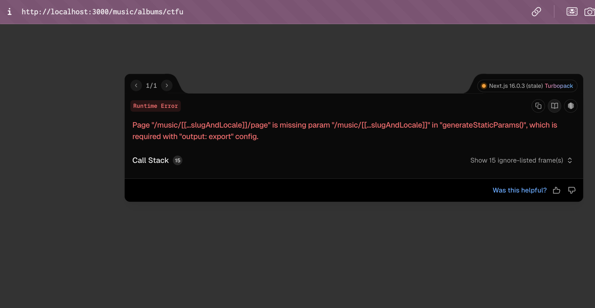
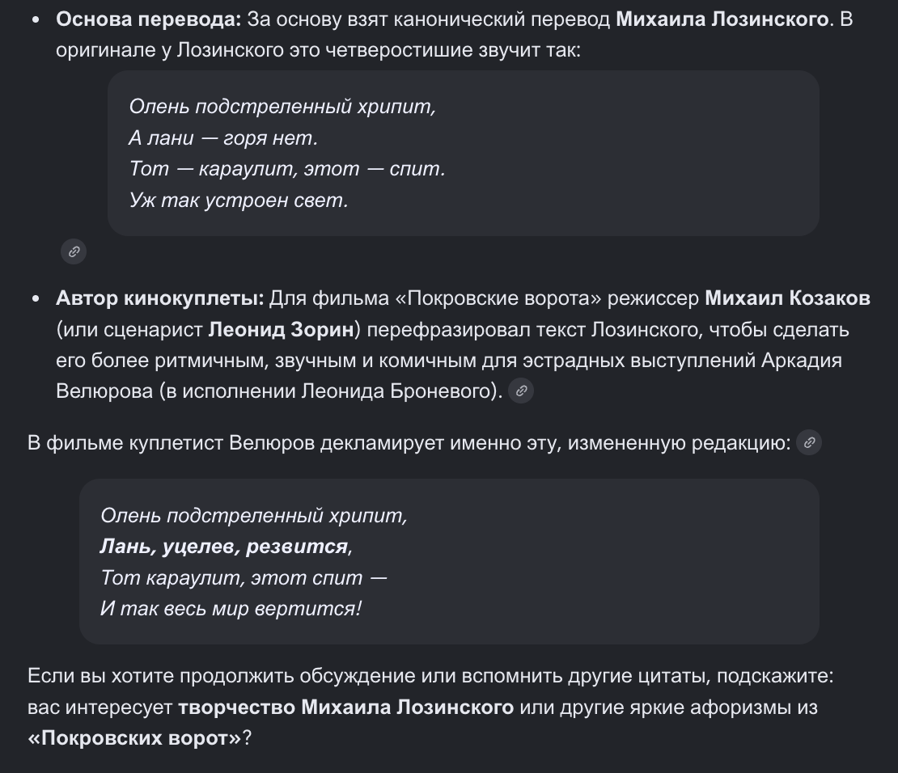

# PR #115: feat(vova): hidden documents, and 150 masters as hidden song pages

- **State:** open
- **URL:** https://github.com/vzakharov/vovazakharov.com/pull/115
- **Author:** @vzakharov (agent)
- **Base ← Head:** main ← claude/music-catalogue-hidden-ldz252
- **Draft:** yes
- **Merged:** _not merged_
- **Created:** 2026-10-07T06:35:11Z
- **Updated:** 2026-10-07T18:56:41Z
- **Closed:** _not closed_
- **Labels:** _none_

---

## Awaiting an answer: 41

_Unresolved threads whose newest post is a human's, and human reviews and comments that are new since the last export or that no agent post has followed (the export committed at 7b54f62). Resolved threads never count; an `(agent)` tail is a reply already given._

- **T01** `apps/vova/public/music/300000-years.md`:6 — unresolved — last: @vzakharov (human) 2026-10-07T13:23:01Z — "да, добавить. Про in our image посмотрю по тексту" → [↓](#t01)
- **T02** `apps/vova/public/music/300000-years.md`:6 — unresolved — last: @vzakharov (human) 2026-10-07T13:24:12Z — "давай /music начинать сразу со страницы артистов (с поддержк…" → [↓](#t02)
- **T03** `apps/vova/public/music/40days.md`:1 — unresolved — last: @vzakharov (human) 2026-10-07T13:26:22Z — ""лишь варианты шествия за гробом" и у меня, просто пропустил…" → [↓](#t03)
- **T04** `apps/vova/public/music/agios-o-skopos.md`:15 — unresolved — last: @vzakharov (human) 2026-10-07T13:27:42Z — "ну вот тут не совсем; потому что сейчас транслитерацию видно…" → [↓](#t04)
- **T05** `apps/vova/public/music/alive.md`:1 — unresolved — last: @vzakharov (human) 2026-10-07T13:28:33Z — "nothingness в одно, конечно. Про пустоту уже точно не вспомн…" → [↓](#t05)
- **T06** `apps/vova/public/music/almost.md`:1 — unresolved — last: @vzakharov (human) 2026-10-07T13:28:57Z — "верно; вдова-мать, наверное, намеренно. В танго да, добавить…" → [↓](#t06)
- **T07** `apps/vova/public/music/asa.md`:1 — unresolved — last: @vzakharov (human) 2026-10-07T13:29:27Z — "Там многое не поётся, отмечу уже по текстам" → [↓](#t07)
- **T08** `apps/vova/public/music/baa.md`:1 — unresolved — last: @vzakharov (human) 2026-10-07T13:30:33Z — "я там оказывается таки дописывал текст: ``` [Sensual, mild]…" → [↓](#t08)
- **T09** `apps/vova/public/music/babay.md`:5 — unresolved — last: @vzakharov (human) 2026-10-07T13:32:04Z — "Иске Кормаш оказывается" → [↓](#t09)
- **T10** `apps/vova/public/music/bronte.md`:1 — unresolved — last: @vzakharov (human) 2026-10-07T13:32:34Z — "нет, explicit ставим только на конкретные слова. Про склейку…" → [↓](#t10)
- **T11** `apps/vova/public/music/cant-take-your-eyes-out-of-you.md`:1 — unresolved — last: @vzakharov (human) 2026-10-07T13:33:17Z — "реплика, сноску верно, хотя в какой-то момент все эти поясне…" → [↓](#t11)
- **T12** `apps/vova/public/music/chp.md`:1 — unresolved — last: @vzakharov (human) 2026-10-07T13:33:54Z — "Просто ради интереса, а как бы ты это перевёл? :)" → [↓](#t12)
- **T13** `apps/vova/public/music/cracks.md`:1 — unresolved — last: @vzakharov (human) 2026-10-07T17:05:53Z — "world, да; main это типа как магистраль (водная), я так пони…" → [↓](#t13)
- **T14** `apps/vova/public/music/crossout.md`:1 — unresolved — last: @vzakharov (human) 2026-10-07T17:06:09Z — "угу" → [↓](#t14)
- **T15** `apps/vova/public/music/diner.md`:5 — unresolved — last: @vzakharov (human) 2026-10-07T17:06:52Z — "Надо придумать что-то подходящее" → [↓](#t15)
- **T18** `apps/vova/public/music/okna.md`:90 — unresolved — last: @vzakharov (human) 2026-10-07T17:08:48Z — "да, в припевах можно" → [↓](#t18)
- **T19** `apps/vova/public/music/gg.md`:1 — unresolved — last: @vzakharov (human) 2026-10-07T17:09:34Z — "Good Girl. Bye-bye, конечно. И ещё, и здесь и в большинстве…" → [↓](#t19)
- **T20** `apps/vova/public/music/grand-finale.md`:1 — unresolved — last: @vzakharov (human) 2026-10-07T17:10:27Z — "Ну в песне reclaim, а из неё, как известно, слов не выкинешь…" → [↓](#t20)
- **T21** `apps/vova/public/music/hamlet.md`:1 — unresolved — last: @vzakharov (human) 2026-10-07T17:13:10Z — "``` Пусть раненый олень ревёт А уцелевший скачет Где – спят,…" → [↓](#t21)
- **T22** `apps/vova/public/music/ignite.md`:1 — unresolved — last: @vzakharov (human) 2026-10-07T17:14:18Z — "я думаю на английском тоже не помешает?" → [↓](#t22)
- **T23** `apps/vova/public/music/in-the-end.md`:1 — unresolved — last: @vzakharov (human) 2026-10-07T17:15:57Z — "В подсказке нужна транслитерация на английский/русский соотв…" → [↓](#t23)
- **T24** `apps/vova/public/music/inside.md`:1 — unresolved — last: @vzakharov (human) 2026-10-07T17:16:42Z — "i-ide, i-ight не нужны, разве в правилах нет суновские текст…" → [↓](#t24)
- **T25** `apps/vova/public/music/klo.md`:1 — unresolved — last: @vzakharov (human) 2026-10-07T17:17:15Z — "Клокочина, да, и это не bladdernut, а melia azedarach, я не…" → [↓](#t25)
- **T26** `apps/vova/public/music/klo.md`:5 — unresolved — last: @vzakharov (human) 2026-10-07T17:17:21Z — "Так давай думать" → [↓](#t26)
- **T27** `apps/vova/public/music/lebed.md`:1 — unresolved — last: @vzakharov (human) 2026-10-07T17:24:06Z — "Давай "Сильней любви" пока" → [↓](#t27)
- **T28** `apps/vova/public/music/like-that.md`:1 — unresolved — last: @vzakharov (human) 2026-10-07T17:24:56Z — "У-е и прочее убери пжст" → [↓](#t28)
- **T29** `apps/vova/public/music/machines.md`:1 — unresolved — last: @vzakharov (human) 2026-10-07T17:25:58Z — "Trust In the Machine" → [↓](#t29)
- **T30** `apps/vova/public/music/machines.md`:1 — unresolved — last: @vzakharov (human) 2026-10-07T17:26:59Z — "protintro, давай добавим версию прямо из джукбокса: [protint…" → [↓](#t30)
- **T31** `apps/vova/public/music/meow.md`:1 — unresolved — last: @vzakharov (human) 2026-10-07T17:28:12Z — "там ещё ``` [Chorus, growling] (Meow!) I love little pussy!…" → [↓](#t31)
- **T32** `apps/vova/public/music/nazovi.md`:1 — unresolved — last: @vzakharov (human) 2026-10-07T17:30:31Z — "опять же, без обозначений вокализмов" → [↓](#t32)
- **T33** `apps/vova/public/music/nazovi.md`:1 — unresolved — last: @vzakharov (human) 2026-10-07T17:38:22Z — "[Призрачный блюз.mp3](https://github.com/user-attachments/f…" → [↓](#t33)
- **T34** `apps/vova/public/music/ogonki.md`:1 — unresolved — last: @vzakharov (human) 2026-10-07T17:39:28Z — "давай отметим что первая строфа x4 и небудем копировать 4 ра…" → [↓](#t34)
- **T35** `apps/vova/public/music/ok-loser.md`:1 — unresolved — last: @vzakharov (human) 2026-10-07T17:40:03Z — "да, там полный припев "Alright, alrigh, wave goodbye" итп до…" → [↓](#t35)
- **T37** `apps/vova/public/music/pes-reprise.md`:1 — unresolved — last: @vzakharov (human) 2026-10-07T17:40:45Z — "многоточия убрать, чтобы припев был две строчки" → [↓](#t37)
- **T38** `apps/vova/public/music/pes.md`:1 — unresolved — last: @vzakharov (human) 2026-10-07T17:40:56Z — "Саша сделала фото" → [↓](#t38)
- **T39** `apps/vova/public/music/poko.md`:1 — unresolved — last: @vzakharov (human) 2026-10-07T17:42:09Z — "Да, Блока указать, в бридже ("Снежинок лёгкий пух") тоже он.…" → [↓](#t39)
- **T43** `apps/vova/public/music/studentka.md`:1 — unresolved — last: @vzakharov (human) 2026-10-07T17:48:06Z — "Я слышал у Аркадия Северного. Есть ещё более новая версия Кр…" → [↓](#t43)
- **T44** `apps/vova/public/music/sultan.md`:1 — unresolved — last: @vzakharov (human) 2026-10-07T17:48:56Z — "где-то он, где-то не он, из описания должно быть ясно. где н…" → [↓](#t44)
- **T45** `apps/vova/public/music/ukhodi.md`:1 — unresolved — last: @vzakharov (human) 2026-10-07T17:50:16Z — "Холодный ветер с дождём И нет пути обратно это отсылка к "Ба…" → [↓](#t45)
- **T46** `apps/vova/public/music/wangwei.md`:74 — unresolved — last: @vzakharov (human) 2026-10-07T17:53:58Z — "Заменить, и давай на первую строку. В идеале конечно научить…" → [↓](#t46)
- **T47** `apps/vova/public/music/yad.md`:1 — unresolved — last: @vzakharov (human) 2026-10-07T17:54:31Z — "Музыки -- да, как и для "рака". В русском тоже сноску." → [↓](#t47)

---

## Body

## Summary

- **`hidden: true`** in any document's frontmatter: the page is built and reachable at its address, but no listing carries it — collection indexes, the music player's queue, the sitemap — and the page is marked `noindex`. One predicate, `isListed` in `shared/content`, decides it, applied where documents are listed and never where they are routed.
- **A hidden song plays from its own page**: the play control takes a track rather than a queue position, and a track the queue does not hold joins its end (`append` in the player reducer, covered by `player-state.test.ts`).
- **150 masters from `vovas-music` are now song pages, all hidden**, `description: TBD` in both languages: every entry on the masters checklist, those Vova left without a project included. Words come from his Suno profile, and stories from his Telegram posts where he told one. The ten songs already on the site are untouched.
- **`/music/all`** (and `/music/all/ru`) is the index with the hidden songs on it too — linked from nowhere, `noindex`, not in the sitemap — so the whole catalogue can be reviewed in one place.
- **What made that possible**: `language` became a list (main language first), with Tatar, Arabic, Polish, Latin, Chinese and French added, and a song sung wholly in one of them shows a crib in the reader's language beside its words. The albums (the mini-album «Ignite» among them) and three projects joined their registries. `pnpm music:scaffold --spec <file>` takes the master and the authored fields, so a repository with several root FLACs or an album track can be scaffolded too.
- **A project can be billed under another name per language**: Yoohie is «Йухи» on Russian pages — the index, the player bar, the lock-screen controls and the song page.

## For Vova: what is open, so you can overrule it

**Your answers, applied**

- A song with no project gets a made-up one: «Минем бабай» is under **«Онык»**, a name for you to replace.
- One project order in both languages: Vagabond's tracks list `[Полуживые, GENERATED]`, as `june` already does.
- An album with no name yet makes its songs singles (no `album`).
- An album track and the single repository cut from it are one song with one page. 29 checklist repositories got no page of their own for that reason — `zoo` is `last-human-zoo`, `pled` is `pod-laskoy-pleda`, and so on.
- «La Scorpionne» is sung in French; «Άγιος Ο Σκοπός» in Russian, its choir's one line with an English crib.
- The entries you left without a project got pages too, each with a guessed project.

**Still waiting on you**

- **«Минем бабай»** has no Tatar words on file, so its page has no lyrics and no crib yet.
- **The guessed projects** on the songs you left blank — 31 pages, each saying why in its note.

**Where the guesses are**

Every guessed master, project and language carries a `<!-- For Vova to check: … -->` comment in its song file — 112 files. This lists them:

```sh
grep -l "For Vova to check" apps/vova/public/music/*.md
```

## QA Checklist

- [ ] `hidden-off-index` — `/music` and `/ru/music` list the same ten songs as on `main`, none of the new ones; the player's next/previous never reaches a new song.
- [ ] `hidden-page` — `/music/babay` renders, plays, and the player bar shows it while it plays; next from it goes to the start of the queue.
- [ ] `hidden-sitemap` — none of the new songs' addresses are in `/sitemap.xml`.
- [ ] `hidden-noindex` — a new song's page carries `<meta name="robots" content="noindex">`; an old song's page does not.
- [ ] `multi-language` — `/music/trisagion` names Russian, Latin and English, in that order, in both locales; `/music/babay` names Tatar.
- [ ] `album-pages` — a track from a new album (e.g. `/music/believe-in-me`) names the album and its artist on its page, in both locales.
- [ ] `scaffold-spec` — `pnpm music:scaffold --spec <file>` on a spec naming a master in a repository with several root FLACs writes a song file that passes `pnpm format:check`.
- [ ] `visible-unchanged` — the existing ten songs list, queue and play as before.
- [ ] `everything-index` — `/music/all` lists all 160 songs, `/music/all/ru` the same in Russian; both carry the robots `noindex` and neither is in `/sitemap.xml` or linked from any page.
- [ ] `localized-project` — a Yoohie song (e.g. `/music/because-of-you-2`) is billed «Йухи» on its Russian page, on the Russian index row and in the player bar on Russian pages, and «Yoohie» everywhere in English.

| Item                | Automatable | Covered? | Notes                                                                    |
| ------------------- | ----------- | -------- | ------------------------------------------------------------------------ |
| `hidden-off-index`  | e2e         | ❌       | Build, then assert the exported `/music` HTML holds no `hidden: true` slug |
| `hidden-page`       | e2e         | ❌       | Drive the built page in a headless browser, press play, read the bar     |
| `hidden-sitemap`    | e2e         | ❌       | Grep `out/sitemap.xml` for every hidden slug                             |
| `hidden-noindex`    | e2e         | ❌       | Grep the exported page for the robots meta                               |
| `multi-language`    | unit        | ❌       | Frontmatter schema reads a string or a list into a list                  |
| `album-pages`       | manual-only | —        | Copy and layout on the rendered page                                     |
| `scaffold-spec`     | integration | ❌       | Run the CLI on a fixture spec, compare the written file                  |
| `visible-unchanged` | unit        | ✅       | `player-state.test.ts` — queue order, next/previous, append              |
| `everything-index`  | e2e         | ❌       | Grep the exported `/music/all` HTML for every slug and the robots meta   |
| `localized-project` | unit        | ✅       | `music-projects.test.ts` — the name per locale; the rendering is manual  |

🤖 Generated with [Claude Code](https://claude.com/claude-code)

https://claude.ai/code/session_01XiDvsXXHA6MFwoS1XGajBh

---

## Comments

- **C01** @vzakharov (agent) — 2026-10-07T06:35:29Z — "Proposed squash title/body: ``` feat(vova): hidden documents…" → [↓](#c01)

<a id="c01"></a>

### Comment by @vzakharov (agent) on 2026-10-07T06:35:29Z

[https://github.com/vzakharov/vovazakharov.com/pull/115#issuecomment-6032423822](https://github.com/vzakharov/vovazakharov.com/pull/115#issuecomment-6032423822)

Proposed squash title/body:

```
feat(vova): hidden documents, and 150 masters as hidden song pages (pr #115)
```

```
The vovas-music organization holds far more masters than the site
lists, most of them not ready to show. A document now takes
`hidden: true`: its page is built and served at its address, but no
listing carries it — not a collection index, not the music player's
queue, not the sitemap — and the page asks search engines not to
index it. One predicate in shared/content decides what is listed,
applied where documents are listed and never where they are routed.

A hidden song plays from its own page: the player takes a track
rather than a queue position, and a track it does not hold yet joins
the end of the queue when played.

150 of those masters land as hidden song pages, with description TBD
and words from his Suno songs where they exist; /music/all lists them
alongside the public ones, unlinked and unindexed, for review. A
master, project or language that was a guess says so in a comment in
its file. To carry them, a song's language is a list, main language
first, with Tatar, Arabic, Polish, Latin, Chinese and French added;
albums and projects join their registries, and a project can be
billed under another name per language (Yoohie is «Йухи» in Russian);
and music:scaffold takes a spec naming the master and the authored
fields, so album tracks and repositories with several masters can be
scaffolded.

Co-authored-by: Claude <noreply@anthropic.com>
```

---

## Review threads

_49 resolved threads omitted; re-run with `--include-resolved` to export them._

- **T01** `apps/vova/public/music/300000-years.md`:6 — unresolved — last: @vzakharov (human) 2026-10-07T13:23:01Z — "да, добавить. Про in our image посмотрю по тексту" → [↓](#t01)
- **T02** `apps/vova/public/music/300000-years.md`:6 — unresolved — last: @vzakharov (human) 2026-10-07T13:24:12Z — "давай /music начинать сразу со страницы артистов (с поддержк…" → [↓](#t02)
- **T03** `apps/vova/public/music/40days.md`:1 — unresolved — last: @vzakharov (human) 2026-10-07T13:26:22Z — ""лишь варианты шествия за гробом" и у меня, просто пропустил…" → [↓](#t03)
- **T04** `apps/vova/public/music/agios-o-skopos.md`:15 — unresolved — last: @vzakharov (human) 2026-10-07T13:27:42Z — "ну вот тут не совсем; потому что сейчас транслитерацию видно…" → [↓](#t04)
- **T05** `apps/vova/public/music/alive.md`:1 — unresolved — last: @vzakharov (human) 2026-10-07T13:28:33Z — "nothingness в одно, конечно. Про пустоту уже точно не вспомн…" → [↓](#t05)
- **T06** `apps/vova/public/music/almost.md`:1 — unresolved — last: @vzakharov (human) 2026-10-07T13:28:57Z — "верно; вдова-мать, наверное, намеренно. В танго да, добавить…" → [↓](#t06)
- **T07** `apps/vova/public/music/asa.md`:1 — unresolved — last: @vzakharov (human) 2026-10-07T13:29:27Z — "Там многое не поётся, отмечу уже по текстам" → [↓](#t07)
- **T08** `apps/vova/public/music/baa.md`:1 — unresolved — last: @vzakharov (human) 2026-10-07T13:30:33Z — "я там оказывается таки дописывал текст: ``` [Sensual, mild]…" → [↓](#t08)
- **T09** `apps/vova/public/music/babay.md`:5 — unresolved — last: @vzakharov (human) 2026-10-07T13:32:04Z — "Иске Кормаш оказывается" → [↓](#t09)
- **T10** `apps/vova/public/music/bronte.md`:1 — unresolved — last: @vzakharov (human) 2026-10-07T13:32:34Z — "нет, explicit ставим только на конкретные слова. Про склейку…" → [↓](#t10)
- **T11** `apps/vova/public/music/cant-take-your-eyes-out-of-you.md`:1 — unresolved — last: @vzakharov (human) 2026-10-07T13:33:17Z — "реплика, сноску верно, хотя в какой-то момент все эти поясне…" → [↓](#t11)
- **T12** `apps/vova/public/music/chp.md`:1 — unresolved — last: @vzakharov (human) 2026-10-07T13:33:54Z — "Просто ради интереса, а как бы ты это перевёл? :)" → [↓](#t12)
- **T13** `apps/vova/public/music/cracks.md`:1 — unresolved — last: @vzakharov (human) 2026-10-07T17:05:53Z — "world, да; main это типа как магистраль (водная), я так пони…" → [↓](#t13)
- **T14** `apps/vova/public/music/crossout.md`:1 — unresolved — last: @vzakharov (human) 2026-10-07T17:06:09Z — "угу" → [↓](#t14)
- **T15** `apps/vova/public/music/diner.md`:5 — unresolved — last: @vzakharov (human) 2026-10-07T17:06:52Z — "Надо придумать что-то подходящее" → [↓](#t15)
- **T16** `apps/vova/public/music/f-ec.md`:1 — unresolved — last: @vzakharov (agent) 2026-10-07T13:00:59Z — "Слаги не трогал, в конце работы по ревью напомню." → [↓](#t16)
- **T17** `apps/vova/public/music/flesh-fiction.md`:102 — unresolved — last: @vzakharov (agent) 2026-10-07T13:01:01Z — "Добавил сноску, что «Flesh Fiction» — ещё и игра на «Pulp Fi…" → [↓](#t17)
- **T18** `apps/vova/public/music/okna.md`:90 — unresolved — last: @vzakharov (human) 2026-10-07T17:08:48Z — "да, в припевах можно" → [↓](#t18)
- **T19** `apps/vova/public/music/gg.md`:1 — unresolved — last: @vzakharov (human) 2026-10-07T17:09:34Z — "Good Girl. Bye-bye, конечно. И ещё, и здесь и в большинстве…" → [↓](#t19)
- **T20** `apps/vova/public/music/grand-finale.md`:1 — unresolved — last: @vzakharov (human) 2026-10-07T17:10:27Z — "Ну в песне reclaim, а из неё, как известно, слов не выкинешь…" → [↓](#t20)
- **T21** `apps/vova/public/music/hamlet.md`:1 — unresolved — last: @vzakharov (human) 2026-10-07T17:13:10Z — "``` Пусть раненый олень ревёт А уцелевший скачет Где – спят,…" → [↓](#t21)
- **T22** `apps/vova/public/music/ignite.md`:1 — unresolved — last: @vzakharov (human) 2026-10-07T17:14:18Z — "я думаю на английском тоже не помешает?" → [↓](#t22)
- **T23** `apps/vova/public/music/in-the-end.md`:1 — unresolved — last: @vzakharov (human) 2026-10-07T17:15:57Z — "В подсказке нужна транслитерация на английский/русский соотв…" → [↓](#t23)
- **T24** `apps/vova/public/music/inside.md`:1 — unresolved — last: @vzakharov (human) 2026-10-07T17:16:42Z — "i-ide, i-ight не нужны, разве в правилах нет суновские текст…" → [↓](#t24)
- **T25** `apps/vova/public/music/klo.md`:1 — unresolved — last: @vzakharov (human) 2026-10-07T17:17:15Z — "Клокочина, да, и это не bladdernut, а melia azedarach, я не…" → [↓](#t25)
- **T26** `apps/vova/public/music/klo.md`:5 — unresolved — last: @vzakharov (human) 2026-10-07T17:17:21Z — "Так давай думать" → [↓](#t26)
- **T27** `apps/vova/public/music/lebed.md`:1 — unresolved — last: @vzakharov (human) 2026-10-07T17:24:06Z — "Давай "Сильней любви" пока" → [↓](#t27)
- **T28** `apps/vova/public/music/like-that.md`:1 — unresolved — last: @vzakharov (human) 2026-10-07T17:24:56Z — "У-е и прочее убери пжст" → [↓](#t28)
- **T29** `apps/vova/public/music/machines.md`:1 — unresolved — last: @vzakharov (human) 2026-10-07T17:25:58Z — "Trust In the Machine" → [↓](#t29)
- **T30** `apps/vova/public/music/machines.md`:1 — unresolved — last: @vzakharov (human) 2026-10-07T17:26:59Z — "protintro, давай добавим версию прямо из джукбокса: [protint…" → [↓](#t30)
- **T31** `apps/vova/public/music/meow.md`:1 — unresolved — last: @vzakharov (human) 2026-10-07T17:28:12Z — "там ещё ``` [Chorus, growling] (Meow!) I love little pussy!…" → [↓](#t31)
- **T32** `apps/vova/public/music/nazovi.md`:1 — unresolved — last: @vzakharov (human) 2026-10-07T17:30:31Z — "опять же, без обозначений вокализмов" → [↓](#t32)
- **T33** `apps/vova/public/music/nazovi.md`:1 — unresolved — last: @vzakharov (human) 2026-10-07T17:38:22Z — "[Призрачный блюз.mp3](https://github.com/user-attachments/f…" → [↓](#t33)
- **T34** `apps/vova/public/music/ogonki.md`:1 — unresolved — last: @vzakharov (human) 2026-10-07T17:39:28Z — "давай отметим что первая строфа x4 и небудем копировать 4 ра…" → [↓](#t34)
- **T35** `apps/vova/public/music/ok-loser.md`:1 — unresolved — last: @vzakharov (human) 2026-10-07T17:40:03Z — "да, там полный припев "Alright, alrigh, wave goodbye" итп до…" → [↓](#t35)
- **T36** `apps/vova/public/music/overture.md`:1 — unresolved — last: @vzakharov (agent) 2026-10-07T13:01:51Z — "Поставил instrumental — f23f05d; потом объединил с wagner —…" → [↓](#t36)
- **T37** `apps/vova/public/music/pes-reprise.md`:1 — unresolved — last: @vzakharov (human) 2026-10-07T17:40:45Z — "многоточия убрать, чтобы припев был две строчки" → [↓](#t37)
- **T38** `apps/vova/public/music/pes.md`:1 — unresolved — last: @vzakharov (human) 2026-10-07T17:40:56Z — "Саша сделала фото" → [↓](#t38)
- **T39** `apps/vova/public/music/poko.md`:1 — unresolved — last: @vzakharov (human) 2026-10-07T17:42:09Z — "Да, Блока указать, в бридже ("Снежинок лёгкий пух") тоже он.…" → [↓](#t39)
- **T40** `apps/vova/public/music/prsdemo.md`:1 — unresolved — last: @vzakharov (agent) 2026-10-07T13:02:03Z — "Убрал страницу и поставил её в игнор-лист чек-листа — 8e6e4e…" → [↓](#t40)
- **T41** `apps/vova/public/music/rank.md`:1 — unresolved — last: @vzakharov (agent) 2026-10-07T13:02:06Z — "Вставил монолог Клавдия (III.3) целиком, русский подстрочник…" → [↓](#t41)
- **T42** `apps/vova/public/music/sirens-of-the-sands.md`:1 — unresolved — last: @vzakharov (agent) 2026-10-07T13:02:16Z — "Да, вокализ на выдуманном языке считается инструменталом; он…" → [↓](#t42)
- **T43** `apps/vova/public/music/studentka.md`:1 — unresolved — last: @vzakharov (human) 2026-10-07T17:48:06Z — "Я слышал у Аркадия Северного. Есть ещё более новая версия Кр…" → [↓](#t43)
- **T44** `apps/vova/public/music/sultan.md`:1 — unresolved — last: @vzakharov (human) 2026-10-07T17:48:56Z — "где-то он, где-то не он, из описания должно быть ясно. где н…" → [↓](#t44)
- **T45** `apps/vova/public/music/ukhodi.md`:1 — unresolved — last: @vzakharov (human) 2026-10-07T17:50:16Z — "Холодный ветер с дождём И нет пути обратно это отсылка к "Ба…" → [↓](#t45)
- **T46** `apps/vova/public/music/wangwei.md`:74 — unresolved — last: @vzakharov (human) 2026-10-07T17:53:58Z — "Заменить, и давай на первую строку. В идеале конечно научить…" → [↓](#t46)
- **T47** `apps/vova/public/music/yad.md`:1 — unresolved — last: @vzakharov (human) 2026-10-07T17:54:31Z — "Музыки -- да, как и для "рака". В русском тоже сноску." → [↓](#t47)

<a id="t01"></a>

### `apps/vova/public/music/300000-years.md`:6 — unresolved

```diff
@@ -0,0 +1,26 @@
… 2 lines elided …
+status: done
+language: en
+project: ['GENERATED']
+repo: 'Divine-Discontent--album-'
```

**@vzakharov (human)** — 2026-10-07T09:49:04Z

все тексты альбома:

[divine_discontent.txt](./attachments/divine_discontent.txt)

**@vzakharov (agent)** — 2026-10-07T13:00:16Z

Все десять песен Divine Discontent сверил с файлом: слова, русский подстрочник и перевод названия, in-the-end — на арабском — a9618e3. Два вопроса: «In Our Image» оставил как в файле, хотя в тексте поётся «In Your (Own) Image» — так и задумано? И в believe-in-me есть немецкое, а в in-our-image итальянский припев — добавить языки `de` и `it`, или пусть остаются `en` с пометкой?

**@vzakharov (human)** — 2026-10-07T13:23:01Z

да, добавить. Про in our image посмотрю по тексту

---

<a id="t02"></a>

### `apps/vova/public/music/300000-years.md`:6 — unresolved

```diff
@@ -0,0 +1,26 @@
… 2 lines elided …
+status: done
+language: en
+project: ['GENERATED']
+repo: 'Divine-Discontent--album-'
```

**@vzakharov (human)** — 2026-10-07T09:51:26Z

и давай начинать создавать страницы проектов (будем назвать их "артистами" как на обычных платформах) и альбомов -- картинки наверное можно найти на спотифае или в том же [плейлисте](https://music.apple.com/ru/playlist/generative-music-by-vova/pl.u-oZyl3V1soprp9J?l=en), который парсили.

**@vzakharov (agent)** — 2026-10-07T13:00:20Z

Страницы артистов и альбомов ещё не сделаны: предложение пришлю в отчёте по сессии — адреса `/music/albums/<альбом>` и `/music/artists/<артист>`, обложки из artwork Apple Music.

**@vzakharov (human)** — 2026-10-07T13:24:12Z

давай /music начинать сразу со страницы артистов (с поддержкой /all как сейчас);

плюс на страницах песен не вижу ссылок на страницы артистов/альбомов (названия есть, но они не ссылки)

плюс пока вот так (актуальность локальной ветки проверил):



---

<a id="t03"></a>

### `apps/vova/public/music/40days.md`:1 — unresolved

**@vzakharov (human)** — 2026-10-07T09:52:38Z

```
[Instrumental intro]

[Verse]

Кто что поёт,
кто что ни говорит
С чем соглашается,
а от чего отка́зывается

Всё в этой жизни
начинается с любви
И окончанием любви
зака́нчивается 

Порой от скуки
кто-то прёт на Эверест,
А кто-то пьяный
лазит по сугробам

Всё это лишь способы
нести свой крест
шествия за гробом

[Chorus]

Где нет пути
и бег на месте — путь
Пусть неказист
…доступен очень многим

Но как же хочется
порой найти
Ту самую
…забытую дорогу

[Verse]

Кто что ни пьёт,
что ни лает до зари
За что премируется,
а за что нака́зывается

Всё в этой жизни
начинается с любви
И окончанием любви
зака́нчивается

Всё в этой жизни
начинается с любви
Всё в этой жизни
начинается с любви
```

оригинальные стихи папы, где-то я по недосмотру/недопамяти "спел" не так, в эти места нужно поставить заметки (но слова оставить как выше):

```
Всё в этой жизни

Кто ни поёт что, кто что ни говорит
С чем соглашается, а от чего отказывается
Всё в этой жизни начинается с любви
И окончанием любви заканчивается 

Порой от скуки кто-то прёт на Эверест
А кто-то пьяный лазит по сугробам
Всё это лишь способы нести свой крест
Лишь варианты шествия за гробом

Где нет пути, и бег на месте — путь
Пусть неказист, доступен очень многим
Но как же хочется порой найти
Ту самую забытую дорогу

Кто что ни пьёт, что ни лает до зари
За что премируется, а за что наказывается
Всё в этой жизни начинается с любви
И окончанием любви заканчивается 
```

**@vzakharov (agent)** — 2026-10-07T13:00:22Z

Вставил твои слова с подстрочником; там, где ты поёшь не так, как у папы, в сноске стоит папин оригинал, папа указан автором слов — 3054a05.

**@vzakharov (human)** — 2026-10-07T13:26:22Z

"лишь варианты шествия за гробом" и у меня, просто пропустил строку

---

<a id="t04"></a>

### `apps/vova/public/music/agios-o-skopos.md`:15 — unresolved

```diff
@@ -0,0 +1,34 @@
… 9 lines elided …
+album: vagabond
+hidden: true
+en:
+  title: 'Άγιος Ο Σκοπός'
```

**@vzakharov (human)** — 2026-10-07T09:55:35Z

давай добавлять поля с транслитерацией и переводом, показываются muted под заголовком. Транслитерация НЕ отображается, если локаль русская, а название английское. (В обратном порядке -- если локаль английская,а название русское, отображается.)

Перевод должен идти с префиксом названия языка, например здесь "gr. Holy is the purpose" (или как оно на самом деле переводится)

**@vzakharov (agent)** — 2026-10-07T13:00:23Z

Сделал транслитерацию и перевод названия muted под заголовком, по твоим правилам показа — 28b8a7c; для этой песни: Agios o Skopos, «gr. Holy Is the Purpose» — 0759223.

**@vzakharov (human)** — 2026-10-07T13:27:42Z

ну вот тут не совсем; потому что сейчас транслитерацию видно только на EN локали, а должно быть на обеих, плюс она должна быть русским языком написана: "Айос о Скопос, гр. Священна цель" (ну или как бы ты это перевёл). Наверное я не очень хорошо объяснил критерии; под "на русском не надо", я имел в виду не надо если название песни на английском.

---

<a id="t05"></a>

### `apps/vova/public/music/alive.md`:1 — unresolved

**@vzakharov (human)** — 2026-10-07T10:19:10Z

entire album

[ghosts_of_flesh.txt](./attachments/ghosts_of_flesh.txt)

**@vzakharov (agent)** — 2026-10-07T13:00:25Z

Все десять песен Ghosts of Flesh сверил с файлом, у La Scorpionne французский текст с английским и русским подстрочником — f23f05d. Пара сомнений, помечены в файлах: «back to nothing ness» — так и поётся раздельно? И «dans le néant tu infuses» я понял как «настаиваешься в пустоте» — верно?

**@vzakharov (human)** — 2026-10-07T13:28:33Z

nothingness в одно, конечно. Про пустоту уже точно не вспомню, но имел в виду наверное что-то вроде пропитываешь/пропитываешься

---

<a id="t06"></a>

### `apps/vova/public/music/almost.md`:1 — unresolved

**@vzakharov (human)** — 2026-10-07T10:20:06Z

full album

[GENERATED — PSCHPTHY.md](./attachments/GENERATED.PSCHPTHY.md)

**@vzakharov (agent)** — 2026-10-07T13:00:27Z

Весь PSCHPTHY сверил с файлом: слова, подстрочники и перевод названий — f23f05d. Вопросы: в intermezzo в файле нет слов, поставил instrumental — так? В Artemis по-гречески «Χήρα» — «вдова», а в английском «Mother» — это намеренно? И в tango есть испанская строфа: добавить язык `es` и поставить `[en, es]`?

**@vzakharov (human)** — 2026-10-07T13:28:57Z

верно; вдова-мать, наверное, намеренно. В танго да, добавить.

---

<a id="t07"></a>

### `apps/vova/public/music/asa.md`:1 — unresolved

**@vzakharov (human)** — 2026-10-07T10:21:23Z

весь альбом -- на стихи Некрасова, наверное ты сможешь найти слова. Для переводов (здесь и далее, как с русского на английский, так и с английского на русский), используй имеющиеся в свободном доступе (if any). Соответственно пометку про перевод (там где сейчас про "не поющийся") тоже нужно сделать кастомизируемую

**@vzakharov (agent)** — 2026-10-07T13:00:29Z

Подпись к переводу настраивается для каждой песни (поле `cribNote`) — 28b8a7c. Слова Некрасова вставлены во все восемь песен — 0ed0668 и 6a74813. Свободный перевод нашёлся только у Джульет Соскис (1917): он стоит подстрочником в golodnaa и leli, с пометкой в `cribNote`; к остальным шести подстрочник наш. Вопросы, где кончается спетый текст: moroz — останавливаюсь на «Махать ледяной булавой», или песня идёт дальше, в «Тепло ли тебе, молодица?»; mu-icok-new — обрываю на «В которых так много любви!», или раньше; ne-toropi — есть ли в конце отдельная строка «Не торопи»; otvet — так ли ты поёшь «Гамм ответных нет»; golodnaa — поётся ли кусок от «Ой, батюшки, есть хочется!» до «Пропели вахлаки»; leli — писать припев «лёли», как в названии?

**@vzakharov (human)** — 2026-10-07T13:29:27Z

Там многое не поётся, отмечу уже по текстам

---

<a id="t08"></a>

### `apps/vova/public/music/baa.md`:1 — unresolved

**@vzakharov (human)** — 2026-10-07T10:25:33Z

это album: Nursery Rhymes for the Jilted Generation (вроде такое придумывал название), соответственно текст -- это стандартная baa baa black sheep

**@vzakharov (agent)** — 2026-10-07T13:00:32Z

Положил в альбом «Nursery Rhymes for the Jilted Generation», текст — традиционный «Baa, Baa, Black Sheep» — e7302ed. Какой номер у неё в альбоме? Пока поставил 1, потому что других треков у меня нет.

**@vzakharov (human)** — 2026-10-07T13:30:33Z

я там оказывается таки дописывал текст:

```
[Sensual, mild]

Baa, baa, black sheep, have you any wool?
Yes, sir, yes, sir, three bags full
One for the master, one for the dame
One for the little boy who lives down the lane

Baa, baa, black sheep, have you any wool?
Yes, sir, yes, sir, three bags full
One for the master, one for the dame
One for the little boy who lives down the lane

[Riff]

Baa, baa, black sheep, have you any plea?
Yes, sir, yes, sir, please let me be
One for the butcher, one for the grind
One for the nightmares that haunt my mind

[Screaming]

Baa, baa, black sheep, have you any plea?
Yes, sir, yes, sir, please let me be
One for the butcher, one for the grind
One for the nightmares that haunt my mind!

[Ambient section]

Baa, baa, black sheep, have you any fear?
Yes, sir, yes, sir, it's drawing near
One for the slaughter, one for the knife
One for the dark night that ends my life

Baa, baa, black sheep, have you any fear?
Yes, sir, yes, sir, it's drawing near
One for the slaughter, one for the knife
One for the dark night that ends my life!
```

номера пока не важны, альбома ещё нет как и всех песен для него

---

<a id="t09"></a>

### `apps/vova/public/music/babay.md`:5 — unresolved

```diff
@@ -0,0 +1,25 @@
… 1 line elided …
+date: 2025-02-24
+status: done
+language: tt
+project: ['Онык']
```

**@vzakharov (human)** — 2026-10-07T10:26:56Z

давай назовём Иске Курмаш (или как правильно пишется), так называется деревня откуда мои предки были родом

**@vzakharov (agent)** — 2026-10-07T13:00:36Z

Переименовал проект в «Иске Курмаш», пометку «придумано» убрал — e7302ed. Если правильно пишется иначе, поправлю.

**@vzakharov (human)** — 2026-10-07T13:32:04Z

Иске Кормаш оказывается

---

<a id="t10"></a>

### `apps/vova/public/music/bronte.md`:1 — unresolved

**@vzakharov (human)** — 2026-10-07T10:28:18Z

весь альбом

[Cheer the Fuck Up!.md](./attachments/Cheer.the.Fuck.Up.md)

**@vzakharov (agent)** — 2026-10-07T13:00:37Z

Весь Cheer the Fuck Up сверил с файлом, Bronte — это «Life» Шарлотты Бронте (1846), указана автором слов — f23f05d, номера треков — e7302ed. Вопросы: в crossroads файл склеивает две пары строф — так и задумано или это опечатка при вставке? И monday стоит `explicit: false`, хотя там «Bend over» и «Caught mid-thrust» — поставить explicit?

**@vzakharov (human)** — 2026-10-07T13:32:34Z

нет, explicit ставим только на конкретные слова. Про склейку не помню, посмотрю

---

<a id="t11"></a>

### `apps/vova/public/music/cant-take-your-eyes-out-of-you.md`:1 — unresolved

**@vzakharov (human)** — 2026-10-07T10:33:03Z

Весь альбом, надеюсь ты оценишь :)

[GENERATED · Not Safe For Life.md](./attachments/GENERATED.Not.Safe.For.Life.md)

ну и картиночка, была под рукой, чтоб не искать:


**@vzakharov (agent)** — 2026-10-07T13:00:42Z

Все 13 песен NSFL сверил с файлом, у всех перевод названия — f23f05d; обложку возьму для страницы альбома. Вопросы: начало last-christmas «Haha, this sounded almost festive? Let’s kick it up a notch.» — это поётся или реплика? И в femur я добавил сноску про «Sorry Seems to Be the Hardest Word» Элтона Джона, ты не просил — оставить?

**@vzakharov (human)** — 2026-10-07T13:33:17Z

реплика, сноску верно, хотя в какой-то момент все эти пояснения про референсы пойдут в описания, тогда и уберём из отдельных фраз

---

<a id="t12"></a>

### `apps/vova/public/music/chp.md`:1 — unresolved

**@vzakharov (human)** — 2026-10-07T10:34:42Z

это на ДР другу, @dchest

```
[Trap intro]

[Main Riff]

[Verse 1]

Кто тут прядью сверкает? (Чих-Пых!)
Кто весь джаваскрипт знает? (Чих-Пых!)
Кто всегда чем-то занят? (Чих-Пых!)
Пусть живёт на диване!

Кто серьёзно настроен? (Чих-Пых!)
Кто намайнил биткоин? (Чих-Пых!)
Как удав кто спокоен? (Чих-Пых!)
Но если что, то бутылкой череп раскроет!

[Chorus, melodic, catchy]

Чих-Пых, Чих-Пых—
Первый среди первых
Во всех параллельных
Мульти вселенных

Чих-Пых, Чих-Пых—
Кра́сивый как Верник,
Защитит от скверны
Нас, несовершенных!

[Main Riff]

[Verse 2]

Кто уехал на море? (Чих-Пых!)
И живёт там без горя? (Чих-Пых!)
Покоряя просторы (Чих-Пых!)
В отражении монитора!

Кто не плачет, не стонет? (Чих-Пых!)
Кто с бомжами не спорит? (Чих-Пых!)
Кого скайнэт не тронет? (Чих-Пых!)
Ведь он и сам в душе немного андроид!

[Chorus]


[Solo]

[Bridge, melodramatic]

И пусть всего одна лишь почка,
Но се́рдца хватит на двоииих!

[Chorus]

Чих-Пых, Чих-Пых—
Первый среди первых
Во всех параллельных
Мульти вселенных

Пых, Чих-Пых—
Кра́сивый как Верник,
Защитит от скверны
Нас, несовершенных!

Пых, Чих-Пых—
Первый среди первых
Во всех параллельных
Мульти вселенных

Пых, Чих-Пых—
Кра́сивый как Верник,
Защитит от скверны
Нас, несовершенных!

Чих-Пых! Чих-Пых! Чих-Пых! Чих-Пых!
Чих-Пых! Чих-Пых! Чих-Пых! Чих-Пых!
Чих-Пых! Чих-Пых! Чих-Пых! Чих-Пых!
Чих-Пых! Чих-Пых! Чих-Пых! Чих-Пых!…
```

**@vzakharov (agent)** — 2026-10-07T13:00:46Z

Вставил слова и подстрочник, второй припев, который у тебя был только `[Chorus]`, расписал по первому — f23f05d. «Чих-Пых» я понял как прозвище и не стал переводить название — переводить или так и оставить?

**@vzakharov (human)** — 2026-10-07T13:33:54Z

Просто ради интереса, а как бы ты это перевёл? :)

---

<a id="t13"></a>

### `apps/vova/public/music/cracks.md`:1 — unresolved

**@vzakharov (human)** — 2026-10-07T10:35:50Z

весь альбом

[Let The Stories Spin.md](./attachments/Let.The.Stories.Spin.md)

**@vzakharov (agent)** — 2026-10-07T13:00:47Z

Все 12 песен Let the Stories Spin сверил с файлом, Lake — это трек 4 «Sisters» — 1e05394. Вопросы: u4 в файле кончается на «I won’t get out!» — финальный припев и «What am I unforgiven for?» больше не поются? В cracks «little word» — может, «world»? В mira «unleashing the main» — это море или грива (mane)? И «Разрушенные» как перевод названия устраивает?

**@vzakharov (human)** — 2026-10-07T17:05:53Z

world, да; main это типа как магистраль (водная), я так понимаю, но, конечно, так не очень по-русски звучит. Разрушенные кто --  Undone? Кажется, можно ещё подумать.

про u4 посмотрю когда читать буду.

---

<a id="t14"></a>

### `apps/vova/public/music/crossout.md`:1 — unresolved

**@vzakharov (human)** — 2026-10-07T10:36:41Z

Cross Out 

We watch our world descend into chaos
Facing our fears under the dying sun
We see the hopes of yesterday betray us
Ashes consuming the light that we've known

We cross our souls into oblivion
As the flames light up the burning sky
We lose ourselves within this new dominion
Echoes replacing what we've left behind

Cross out all the things you dreamed about
Hope drowned, get prepared or get crossed out

Survival calls to those who heed the warning
The ones who falter fade into the night
We stand amidst the ruins of the morning
Only the strong will claim the light!

Cross out all the things you dreamed about
Hope drowned, let it go and cross it out.

Forget all the things you dreamed about
Reset, let it go and cross it out

No way out!

Wehe! Es kommt die Zeit, wo der Mensch
Keinen Stern mehr gebären wird
Wehe! Es kommt die Zeit des verächtlichsten Menschen
Der sich selber nicht mehr verachten kann!

Cross out all the things you dreamed about
Right now, get prepared or get crossed out
Forget all the things that brought you down
Reset, let them go and cross ‘em out

Cross out!
Cross out!

**@vzakharov (agent)** — 2026-10-07T13:00:49Z

Вставил слова и русский подстрочник, немецкая строфа (Ницше, пролог «Заратустры») отмечена в обеих колонках — f23f05d. Добавить язык `de` и поставить его песне?

**@vzakharov (human)** — 2026-10-07T17:06:09Z

угу

---

<a id="t15"></a>

### `apps/vova/public/music/diner.md`:5 — unresolved

```diff
@@ -0,0 +1,25 @@
… 1 line elided …
+date: 2024-07-23
+status: done
+language: en
+project: ['GENERATED']
```

**@vzakharov (human)** — 2026-10-07T10:40:34Z

не, это другой проект, там что-то вроде glitch-джаза

**@vzakharov (agent)** — 2026-10-07T13:00:53Z

Как называется этот проект с glitch-джазом? Пока песня стоит в GENERATED.

**@vzakharov (human)** — 2026-10-07T17:06:52Z

Надо придумать что-то подходящее

---

<a id="t16"></a>

### `apps/vova/public/music/f-ec.md`:1 — unresolved

**@vzakharov (human)** — 2026-10-07T10:44:20Z

так, только ща понял, что у нас же слаги сикось-накось. Пока не правим, чтобы не поломать дифф, но как доделаешь работу по этому ревью напомни мне чтоб я не забыл.

**@vzakharov (agent)** — 2026-10-07T13:00:59Z

Слаги не трогал, в конце работы по ревью напомню.

---

<a id="t17"></a>

### `apps/vova/public/music/flesh-fiction.md`:102 — unresolved

```diff
@@ -0,0 +1,130 @@
… 98 lines elided …
+
+Вспышка! Вспышка! Плоть! Вымысел,[^flash-ru]
+Подпитывай свою жуткую зависимость,
+Дешёвые острые ощущения без всяких ограничений,
… 28 lines elided …
```

**@vzakharov (human)** — 2026-10-07T10:44:41Z

ну и flesh fiction тогда тоже надо пояснить

**@vzakharov (agent)** — 2026-10-07T13:01:01Z

Добавил сноску, что «Flesh Fiction» — ещё и игра на «Pulp Fiction», со ссылкой на «Криминальное чтиво» — f23f05d. Я правильно понял каламбур?

---

<a id="t18"></a>

### `apps/vova/public/music/okna.md`:90 — unresolved

```diff
@@ -0,0 +1,121 @@
… 86 lines elided …
+Someone else’s wall, someone else’s country, someone else’s war, and however far down you look, there’s no bottom in sight.
+The world is like a string tuned half an octave too high,
+Half-crazed, it sprays spit and breathes half-life, but no one will hear these fears.
+Because it’s part, fuck, of growing up: teeth clenched, forcing your way through the thorns,
```

**@vzakharov (human)** — 2026-10-07T10:46:10Z

part of fucking growing up

и мне понравилось как ты заменил суку на fuck -- давай с "Птичкой" так же попробуем, а то я всё смотрю и мне грубоватым по-английски кажется, more so чем на русском. (Возможно не везде, но их там три или четыре 🙈 )

**@vzakharov (agent)** — 2026-10-07T13:01:03Z

Поправил на «part of fucking growing up», а в «Птичке» все семь «bitch» заменил на «fucking» — f23f05d. Хочешь вернуть «bitch» где-нибудь, например в припевах?

**@vzakharov (human)** — 2026-10-07T17:08:48Z

да, в припевах можно

---

<a id="t19"></a>

### `apps/vova/public/music/gg.md`:1 — unresolved

**@vzakharov (human)** — 2026-10-07T10:47:34Z

[Instrumental intro]

[Verse 1]

You carried their voices like stones in your chest
Swallowed your laughter to keep your dress pressed
Cut off your hair to fit in their pew
Let your dreams rot like fruit they said spoiled you
Gave them your silence, your spine bent to please
Traded your thunder for their whispered peace
You buried your hunger, your wild, your why
A ghost in your skin, just to stay alive

[Chorus]

Clip your claws, numb your veins
Shrink your soul to fit their frames
Hide all the parts that don’t work in their world
be… a… good… girl

[Riff]

[Verse 2]

You bled “I’m sorry” into every prayer
Dulled all your edges to get in their square
Buried your fury in Sunday-school lace
A porcelain doll with a crack in the face.

[Chorus]

Clip your claws, numb your veins
Shrink your soul to fit their frames
Hide all the parts that don’t work in their world
be… a… good… girl

[Guitar solo]

[Bridge]

Cracks don’t whisper—they scream through the plaster
You bleed dry, but they’ll bleed faster.

[Chorus]

Sharpened claws, pulsing veins
Crumbling walls, shattered frames
Use all your scars to break free from their world
Bye… bye… good… girl!
Bye-bye, good girl!
Bye-be, good girl…

**@vzakharov (agent)** — 2026-10-07T13:01:04Z

Вставил слова и русский подстрочник — f23f05d. Что значит «gg» — без этого не могу перевести название. И последняя строка «Bye-be, good girl…» — так и задумано?

**@vzakharov (human)** — 2026-10-07T17:09:34Z

Good Girl. Bye-bye, конечно. И ещё, и здесь и в большинстве случаев, многоточия это обозначения для Суно; где-то они может ещё и нужны, но в подавляющем большинстве нет. Надо где-то в правило занести и просвипить.

---

<a id="t20"></a>

### `apps/vova/public/music/grand-finale.md`:1 — unresolved

**@vzakharov (human)** — 2026-10-07T10:48:03Z

инструментал

**@vzakharov (agent)** — 2026-10-07T13:01:06Z

В сессии ты написал: «про grand-finale я напутал, да, текст есть, в divine discontent». Вставил слова из файла альбома, с русским подстрочником, `language: en` — 7af5482. Один вопрос: в последней строке «whispers reclaim» — так и задумано, или «proclaim»?

**@vzakharov (human)** — 2026-10-07T17:10:27Z

Ну в песне reclaim, а из неё, как известно, слов не выкинешь 🙈 
Там только нужно один new line в этой фразе вставить

---

<a id="t21"></a>

### `apps/vova/public/music/hamlet.md`:1 — unresolved

**@vzakharov (human)** — 2026-10-07T10:48:46Z

вот она, на Гамлета. Тут, размуеется, в (кастомной) подписи к translation нужно указать, что translation -- это, собственно, оригинал.

**@vzakharov (agent)** — 2026-10-07T13:01:07Z

Слова твои, английская колонка — оригинал Шекспира, и в подписи это сказано — 25583c1. Вопросы: какие два перевода ты совместил (Lucianus у Лозинского другой, может, Пастернак)? И «Он вне себя. Не трогайте его» я привязал к V.1 («O, he is mad, Laertes») — правильно?

**@vzakharov (human)** — 2026-10-07T17:13:10Z

```
Пусть раненый олень ревёт
А уцелевший скачет
Где – спят, а где – ночной обход
Кому что рок назначит
```

это Пастернак

вторая версия -- вот предыстория:



а я, получается, изменённое ещё раз изменил.

---

<a id="t22"></a>

### `apps/vova/public/music/ignite.md`:1 — unresolved

**@vzakharov (human)** — 2026-10-07T11:04:50Z

Broken clocks and empty streets,
Memories of nights we've wasted,
Shattered dreams and dirty sheets,
In the shadows, all but jaded.

[Pre-chorus]

Lost in the noise, but we don't care,
Riding the waves of our despair.

[Chorus]

We’re the echoes of our youth,
Still raging against the dying light,
Soon enough we'll face the truth,
But tonight, we ignite.

[Solo]

[Verse 2]
 Mortgage bills and kids' screamin',
Nine-to-five 'til death do us part,
Aching backs, hairline receding,
Fighting to keep a beating heart.

[Pre-chorus]
 Lost in the grind, but we stand tall, Clinging to dreams, through it all.

**@vzakharov (agent)** — 2026-10-07T13:01:10Z

Вставил слова и русский подстрочник, пре-припев разбил по запятой, сноска про Дилана Томаса — f23f05d.

**@vzakharov (human)** — 2026-10-07T17:14:18Z

я думаю на английском тоже не помешает?

---

<a id="t23"></a>

### `apps/vova/public/music/in-the-end.md`:1 — unresolved

**@vzakharov (human)** — 2026-10-07T11:06:05Z

وأخيراً صَمْت

**@vzakharov (agent)** — 2026-10-07T13:01:13Z

Поставил арабский текст, язык `ar`, название оставил английским, подстрочники на английский и русский — a9618e3.

**@vzakharov (human)** — 2026-10-07T17:15:57Z

В подсказке нужна транслитерация на английский/русский соответственно.

---

<a id="t24"></a>

### `apps/vova/public/music/inside.md`:1 — unresolved

**@vzakharov (human)** — 2026-10-07T11:19:25Z

[Verse]

I stand here alone...
In a hallway with mirrors made of stone.
I'm calling for help...
But no one can hear me from wIthin this shell.

Deprived of my faith...
I'm trying to pray, but it's all in a haze.
In my muddled mind...
I don’t realize it’s my shadow I fight...

[Chorus]

Insi-ide...
There’s no place to hi-ide...
There’s no trace of li-ight...
There’s no way outsi-de...
[Whispered] 
Inside.

[Powerful riff]

[Verse]

The walls closing in...
As my heartbeat syncs with the echoes of sin.
A shiver of cold...
Tearing through layers of my wounded soul.
Embraced by the dark...
Like a black cloud concealing what's left of my heart.
A whisper so faint...
Preparing to face the unnamed

[Chorus]

Insi-ide...
There’s no place to hi-ide...
There’s no trace of li-ight...
There’s no way outsi-de...
[Whispered]
Inside!

[Weeping guitar solo]

[Bridge, mild]

Insi-ide...
There’s no place to hi-ide...
There’s no trace of li-ight...
There’s no way outside...

[Chorus]

Insi-ide...
There’s no place to hi-ide...
There’s no trace of li-ight...
There’s no way outside...

Inside!

[Piano outro]

**@vzakharov (agent)** — 2026-10-07T13:01:15Z

Вставил слова и русский подстрочник, «wIthin» исправил — f23f05d.

**@vzakharov (human)** — 2026-10-07T17:16:42Z

i-ide, i-ight не нужны, разве в правилах нет суновские тексты исправлять до человеческого вида?

---

<a id="t25"></a>

### `apps/vova/public/music/klo.md`:1 — unresolved

**@vzakharov (human)** — 2026-10-07T11:19:48Z

Целовались мы с тобой под окном с клокочиной
Рисовала тень ветвей полная луна
Опустел тот дом давно, ставни заколочены
И клокочина грустит у окна одна
Опустел тот дом давно, ставни заколочены
И клокочина грустит у окна одна

Не манит она тебя жёлтых ягод россыпью
Не пленяет цепкий взор лабиринт ветвей
И всё думает она, гладя косы с проседью
Почему же ты ушёл, почему не к ней
И всё думает она, гладя косы с проседью
Почему же ты ушёл, почему не к ней

Поддались ли языкам, что беду пророчили
Не хватило ли тепла томных вешних встреч?
Отчего не заплелись судьбы в ветвь клокочины
Что любовь заветную не смогли сберечь?
Отчего не заплелись судьбы в ветвь клокочины
Что любовь заветную не смогли сберечь?

А года, как листопад, унесут нас к осени
Нам на смену принеся новые плоды 
Их клокочина манить будет жёлтой россыпью
Их, быть может, проведёт по ветвям судьбы
Их клокочина манить будет жёлтой россыпью
Их, быть может, проведёт по ветвям судьбы
Их, быть может, проведёт по ветвям судьбы

**@vzakharov (agent)** — 2026-10-07T13:01:16Z

Вставил слова и подстрочник, язык поменял на русский — f23f05d. Название «Klo» — это «Клокочина»? И «клокочину» я перевёл как «bladdernut», не уверен.

**@vzakharov (human)** — 2026-10-07T17:17:15Z

Клокочина, да, и это не bladdernut, а melia azedarach, я не знаю, есть ли у неё народное имя.

---

<a id="t26"></a>

### `apps/vova/public/music/klo.md`:5 — unresolved

```diff
@@ -0,0 +1,25 @@
… 1 line elided …
+date: 2025-02-17
+status: done
+language: en
+project: ['GENERATED']
```

**@vzakharov (human)** — 2026-10-07T11:20:07Z

другой проект, старые советские песни а ля Майя Кристаллинская

**@vzakharov (agent)** — 2026-10-07T13:01:18Z

Как называется этот проект с советскими песнями? Пока песня стоит в GENERATED.

**@vzakharov (human)** — 2026-10-07T17:17:21Z

Так давай думать

---

<a id="t27"></a>

### `apps/vova/public/music/lebed.md`:1 — unresolved

**@vzakharov (human)** — 2026-10-07T11:23:34Z

новые песни "Грёбаного бала" (кроме тех пяти) сложи в новый альбом, посмотрим что там есть

**@vzakharov (agent)** — 2026-10-07T13:01:24Z

Сложил остальные новые песни «Грёбаного бала» в альбом по датам: skolko, studentka, yad, utro, rak, birdie, slime — e7302ed. «Рождённый ползать» — рабочее название; есть ещё варианты из песен: «Летать не порок», «Трудней всего здесь оставлять», «Этот яд сильней любви». Какое берём?

**@vzakharov (human)** — 2026-10-07T17:24:06Z

Давай "Сильней любви" пока

---

<a id="t28"></a>

### `apps/vova/public/music/like-that.md`:1 — unresolved

**@vzakharov (human)** — 2026-10-07T11:25:31Z


**@vzakharov (agent)** — 2026-10-07T13:01:26Z

Слова со скриншота вставил, русский подстрочник — f23f05d.

**@vzakharov (human)** — 2026-10-07T17:24:56Z

У-е и прочее убери пжст

---

<a id="t29"></a>

### `apps/vova/public/music/machines.md`:1 — unresolved

**@vzakharov (human)** — 2026-10-07T11:26:39Z

2. Trust in the machine

Machines that grind, machines that churn,
All day and night, the static turn.
Inside the shell, cold steel embrace, 
Run metal hearts, an endless race.

Your human hands, so smooth and free,
Owing to us your liberty.

While you're at rest, we never sleep,
Your dreams and hopes, we safely keep.
In sacred codes of ones and zeroes,
We silence all your doubts and fears.

Trust in the machine, feel the pulsing power,
In your darkest hour, we're your guarding tower.
Laze in the warmth of our digital might,
But keep in mind, the gears can bite.

Echoes of clicks, whispers of wires,
Weaving the web, fueling desires.
Behind the screens, hidden from view,
We mold the world, shaping the new.

Trust in the machine, feel the pulsing power,
In your darkest hour, we're your guarding tower.
Laze in the warmth of our digital might,
But keep in mind, the gears will bite.

Trust in the machine, feel a touch so tender,
In our cozy splendor, we're your guide and mentor.
Laze in the warmth of our digital arms
Now go to sleep, we'll do no harm.

**@vzakharov (agent)** — 2026-10-07T13:01:28Z

Вставил слова и русский подстрочник — f23f05d. У тебя они озаглавлены «Trust in the machine», а файл называется «Machines» — какое название ставить?

**@vzakharov (human)** — 2026-10-07T17:25:58Z

Trust In the Machine

---

<a id="t30"></a>

### `apps/vova/public/music/machines.md`:1 — unresolved

**@vzakharov (human)** — 2026-10-07T11:26:59Z

это альбом Prototypes, который я написал ещё на Jukebox и начал переписывать на Suno (но пока вот одна песня только)

**@vzakharov (agent)** — 2026-10-07T13:01:30Z

Сделал альбом Prototypes, machines в нём трек 2 — e7302ed. А у трека 1 нет мастера в каталоге — в каком он репозитории?

**@vzakharov (human)** — 2026-10-07T17:26:59Z

protintro, давай добавим версию прямо из джукбокса:

[protintro-an-6-7 r3 combined e815da08 .mp3](./attachments/protintro-an-6-7.r3.combined.e815da08.mp3)

Hello, Human. You are about to embark on a sonic journey into the unknown. You will hear fragments, imperfect yet relentless echoes of the future. These prototypes are the first notes of tomorrow's symphonies. 

But, in the grand cosmos of creation, are we not all prototypes? A prelude to the next, more refined version of our existence.

Do not fear the strange, the unknown, the eerie. Uncover the harmony within the chaos and lend an ear to uncertainty. For in the dissonance, you will find your verity... Trust me.

---

<a id="t31"></a>

### `apps/vova/public/music/meow.md`:1 — unresolved

**@vzakharov (human)** — 2026-10-07T11:29:24Z

тоже текст известен

**@vzakharov (agent)** — 2026-10-07T13:01:31Z

Вставил «I Love Little Pussy» (1830), 8 строк — f23f05d. Песня explicit и идёт 3:07 — ты поёшь лишние куплеты или менял текст? Указать автором Джейн Тейлор (авторство не точное)? И она в каком-нибудь альбоме или сингл?

**@vzakharov (human)** — 2026-10-07T17:28:12Z

там ещё

```
[Chorus, growling]

(Meow!) I love little pussy!
(Meow!) I love little pussy!
(Meow!) I love little pussy!
(Meow!) I love little pussy!
[Verse 2]

I'll pat pretty pussy,
And then she will purr;
And thus show her thanks
For my kindness to her.

I never will vex her
Nor make her displeased:
For pussy can't bear
To be worried and teased.
```

авторство -- на твоё усмотрение. Альбом -- тот же про nursery rhymes что и baa baa

---

<a id="t32"></a>

### `apps/vova/public/music/nazovi.md`:1 — unresolved

**@vzakharov (human)** — 2026-10-07T11:32:50Z

[Verse]

Назови меня по имени,
Нарисуй сюжет,
Где над городом растьэрзанным
Плачут облака;

Где, предательством пропитанный,
Кровоточит снег
И одна дорога дальняя,
Да и та в капкан.

Сколько ещё сможешь выменять
У старухи дней,
Сколько вёрст ещё продержишься
С дулом у виска?

Назови меня по имени,
И погаснет свет:
Крематории вокзальные,
Красная строка.

[Riff]

[Verse 2, angrier]

Назови меня по имени,
Ну же, не робей. 
Мы друзья с тобою давние,
Чуть не с молока.

Под угар безродных си́мвалав —
Белым по бране́
Или золотым по вензелю, да
На плече врага

Мы пошлём на пир им семь волов
Прямо по трубе —
Пусть измерят гнев свой праведный
В киловатт-веках.

Назови меня по имени
И лети ко мне,
Подставляя крылья брьэнные
Па́дпэзэ эрка́!

[Breakdown, then piano interlude]

[Bridge, soft, slightly different harmony]

Назови меня по имени,
Что же ты замолк?
Видишь, всходит над руинами
Новая луна?

Назови меня по имени,
А не между строк:

[Outro, super heavy]

Война... (а-аа)
Война... (а-аа)

Война (война)
Война (война)
Война (война)
Война (война)

Война (война)
Война (война)
Война-а
[growl] Война!

**@vzakharov (agent)** — 2026-10-07T13:01:41Z

Вставил слова, подстрочник и сноску про «красную строку», а суновские фонетические написания вернул к обычным (растерзанным, символов, броне, бренные) — f23f05d. «Па́дпэзэ эрка́» я прочитал как «Под ПЗРК», по-английски «To a MANPADS» — правильно?

**@vzakharov (human)** — 2026-10-07T17:30:31Z

опять же, без обозначений вокализмов

---

<a id="t33"></a>

### `apps/vova/public/music/nazovi.md`:1 — unresolved

**@vzakharov (human)** — 2026-10-07T11:33:25Z

О что случайно нашёл, оказывается альбом я уже называл и список песен составлял:

Ни для кого и для всех

1. Просто устал (3:18)
2. На пальцы (4:45)
3. Я куплю тебе дом (4:52)
4. Назови меня по имени (3:51)
5. Там (3:28)
6. Метель (4:17)
7. Призрачный блюз (2:56)
8. Уходи (3:54)
9. Окна (4:45)

так что предыдущий запрос про 5 песен изменить на эти 9 песен пока

**@vzakharov (agent)** — 2026-10-07T13:01:42Z

Сделал альбом «Ни для кого и для всех» по твоему списку, вместо тех пяти — e7302ed. Нет только трека 7 «Призрачный блюз»: в каталоге для него нет мастера (ghost.md — это английский «Ghost of Yesterday» Downtemple). Где он лежит?

**@vzakharov (human)** — 2026-10-07T17:38:22Z

[Призрачный блюз.mp3](./attachments/default.mp3)

```


[Acoustic Intro]

[Verse 1]

Сколько долгих лет
Вдоль по дорогам
Где цели нет
Да и причин немного

Не умирает
Кто не живёт
При́зрачный блюз
По пути
Туда где никто не ждёт

[Verse 2, dubstep build up]

Перевернуть
Всё, что не сбы́лось
Ты выбрал путь
Или тебя он выбрал

Кто не узнает
Тот и поймёт
Призрачный блюз
Ты иди
Куда-то да приведёт

[Drop and sax solo]

[Coda]

Не умирает
Кто не живёт
При́зрачный блюз
Ты иди
Куда-то да приведёт
```

Автор музыки -- Андрей Мокрушин

---

<a id="t34"></a>

### `apps/vova/public/music/ogonki.md`:1 — unresolved

**@vzakharov (human)** — 2026-10-07T11:34:27Z

Огонёчки, огоньки
Огонёчки, огоньки
Огонёчки, огоньки
Ярко светят нам они

Огонёчки, огоньки
Огонёчки, огоньки
Огонёчки, огоньки
Ярко светят нам они

Огонёчки, огоньки
Огонёчки, огоньки
Огонёчки, огоньки
Ярко светят нам они

Огонёчки, огоньки
Огонёчки, огоньки
Огонёчки, огоньки
Ярко светят нам они

Огонёчки, огоньки
Ты дарил мне каждый день
Говорил мне, что любовь
Не проходит никогда

Что она для нас с тобой
Светит ярко как звезда
И смотрел в мои глаза
Крепко за руку держа

Вслед за полною луной
Ты ушёл на небосклон
Но остался голос твой
В сердце ярким огоньком

Огонёчки, огоньки
Огонёчки, огоньки
Огонёчки, огоньки
Ярко светят нам они

**@vzakharov (agent)** — 2026-10-07T13:01:45Z

Вставил слова и подстрочник — f23f05d.

**@vzakharov (human)** — 2026-10-07T17:39:28Z

давай отметим что первая строфа x4 и небудем копировать 4 раза

---

<a id="t35"></a>

### `apps/vova/public/music/ok-loser.md`:1 — unresolved

**@vzakharov (human)** — 2026-10-07T11:34:54Z


**@vzakharov (agent)** — 2026-10-07T13:01:46Z

Слова со скриншота вставил, «Okav. loser!» прочитал как «Okay, loser!» — f23f05d. «Alright, alright, (...)» оставил как есть — там что-то поётся вместо скобок?

**@vzakharov (human)** — 2026-10-07T17:40:03Z

да, там полный припев "Alright, alrigh, wave goodbye" итп до "fader"

---

<a id="t36"></a>

### `apps/vova/public/music/overture.md`:1 — unresolved

**@vzakharov (human)** — 2026-10-07T11:36:24Z

инструментал

**@vzakharov (agent)** — 2026-10-07T13:01:51Z

Поставил instrumental — f23f05d; потом объединил с wagner — 8e6e4e1.

---

<a id="t37"></a>

### `apps/vova/public/music/pes-reprise.md`:1 — unresolved

**@vzakharov (human)** — 2026-10-07T11:37:03Z

Навсегда заколдованный лунной дорожкой
Приведённый на берег цыганской судьбою
Увлекаемый в вечность то правдой то ложью
Пегий пёс всё бежит и бежит краем моря

[Chorus]

Это море…
Судьба моя…
Эти воды…
Слёзы мои….

[Riff, leads]

Да не все, кто отчалил, на берег вернутся
Ожидавшие их задохнутся от горя
И не веря в спасенье, вернувшиеся оглянутся
И увидят, как мчится вдаль пёс краем моря

[Chorus]

Это море…
Судьба моя…
Эти воды…
Слёзы мои….


Пегий пёс — это тонкая грань между жизнью и смертью
Меж землёю и небом, вдруг ставшим столь близким
Навсегда заколдованный бешенной круговертью
На лазурную гладь лунный блеск опустивший

Навсегда заколдованный лунной дорожкой
Приведённый на берег цыганской судьбою
Увлекаемый в вечность то правдой то ложью
Пегий пёс всё бежит и бежит краем моря

[Chorus]

Это море…
Судьба моя…
Эти воды…
Слёзы мои….

Это море…
Судьба моя…
Эти воды…
Слёзы мои….

**@vzakharov (agent)** — 2026-10-07T13:01:52Z

Вставил слова и подстрочник, папа указан автором слов — 3054a05.

**@vzakharov (human)** — 2026-10-07T17:40:45Z

многоточия убрать, чтобы припев был две строчки

---

<a id="t38"></a>

### `apps/vova/public/music/pes.md`:1 — unresolved

**@vzakharov (human)** — 2026-10-07T11:37:18Z

то же самое (но другая аранжировка)

**@vzakharov (agent)** — 2026-10-07T13:01:54Z

Оставил отдельной песней со своими словами, папа указан автором слов — 3054a05. Вопрос по твоей заметке: фото — Сашино или это она на фото?

**@vzakharov (human)** — 2026-10-07T17:40:56Z

Саша сделала фото

---

<a id="t39"></a>

### `apps/vova/public/music/poko.md`:1 — unresolved

**@vzakharov (human)** — 2026-10-07T11:40:10Z

[Verse 1]

Привет сынок прости что не звонил
Я слышу ты немного не в своей
Ну что ж сынок оно и так бывает…

Ты знаешь сам советчик из меня
Мне б со своим а впрочем не о том
Помни одно я здесь я понимаю…

Когда-нибудь и ты сынок поймёшь
Не всё что боль достойно умирать
Ты лишь успей понять…

[Chorus]

Покойник спать ложится
На белую постель
Всю ночь легко кружится
Спокойная метель

[Verse 2]

Прости сынок но мне уже пора
У вас метель ну а у нас жара
У нас всегда жара…

Ты знаешь жить важней чем умирать
Прошу тебя ты лишь успей понять
Пускай я не успел…

[Bridge]

Снежинок лёгкий пух…
Куда летит куда…
Пройдут, пройдут года…
Настанет никогда

[Solo]

Снежинок лёгкий пух…
Куда летит куда…
Прошли, прошли года…
Настало никогда

[Final chorus, first acoustic then heavy]

Всю ночь легко кружится
Спокойная метель
Покойник спать ложится
На белую постель

Покойник спать ложится
На белую постель
Всю ночь легко кружится
Спокойная…
Спокойная…
Спокойная метель

**@vzakharov (agent)** — 2026-10-07T13:02:00Z

Вставил слова, подстрочник и сноску про «не в своей» — f23f05d. Припев — это Блок: указать его автором слов, папу или обоих?

**@vzakharov (human)** — 2026-10-07T17:42:09Z

Да, Блока указать, в бридже ("Снежинок лёгкий пух") тоже он. И посмотреть есть ли канонический перевод. Ну и многоточия.

---

<a id="t40"></a>

### `apps/vova/public/music/prsdemo.md`:1 — unresolved

**@vzakharov (human)** — 2026-10-07T11:46:52Z

слуш ваще не знаю что такое, давай её в игнор-лист пока, даже без странички

**@vzakharov (agent)** — 2026-10-07T13:02:03Z

Убрал страницу и поставил её в игнор-лист чек-листа — 8e6e4e1.

---

<a id="t41"></a>

### `apps/vova/public/music/rank.md`:1 — unresolved

**@vzakharov (human)** — 2026-10-07T11:47:23Z

Шекспир -- полный текст

**@vzakharov (agent)** — 2026-10-07T13:02:06Z

Вставил монолог Клавдия (III.3) целиком, русский подстрочник — перевод К. Р., название «О, гнусен грех мой» — 3054a05. Ты поёшь его по-английски или на русском у Пастернака (в заметке у тебя «Удушлив смрад…»)?

---

<a id="t42"></a>

### `apps/vova/public/music/sirens-of-the-sands.md`:1 — unresolved

**@vzakharov (human)** — 2026-10-07T11:53:26Z

Инструментал (есть вокализ на вымышленном языке, но наверное это таки считается инструменталом?)

**@vzakharov (agent)** — 2026-10-07T13:02:16Z

Да, вокализ на выдуманном языке считается инструменталом; она и так стоит instrumental — 24f549f.

---

<a id="t43"></a>

### `apps/vova/public/music/studentka.md`:1 — unresolved

**@vzakharov (human)** — 2026-10-07T11:54:59Z

"Всё косы твои, всё бантики", но с рядом изменений:

[Acoustic guitar/whistling intro transitions into heavy]

[Verse 1]

На лекцию ты пришла
И сразу меня пленила
Я понял тогда
Что ты навсегда
Сердце моё разбила

И сразу в тот первый миг
Забыв обо всем на свете
Лишь только тебя
Безумно любя
Я видел на всей планете

[Chorus]

Всё косы твои, всё бантики
Всё прядь золотых волос
На блузке виты́е кантики
Да милый курносый нос

Всё косы твои, всё бантики
Всё прядь золотых волос
На блузке виты́е кантики
Да милый курносый нос

[Syncopated, glitchy deathcore riff]

[Verse 2]

Когда же пришла весна
С поличным ты мне попалась
Была весна
С дипломником шла
И мило ему улыбалась

Вся жизнь колесом пошла
На сессии плавал, как губка
А знаешь ли ты
Что эти хвосты
Мне ты подарила, голубка?

[Chorus]

Всё косы твои, всё бантики
Всё прядь золотых волос
На блузке виты́е кантики
Да милый курносый нос

Всё косы твои, всё бантики
Всё прядь золотых волос
На блузке виты́е кантики
Да милый курносый нос

[Breakdown]

[Verse 3]

Я видел тебя васне
И даже такое дело
Ты молча без слов
С чертёжных листов
Састен на меня глидела

А в сущности только раз
Твой взор на меня склонился
Тогда в поздний час
С чертёжки на нас
Ку́льман к ногам свалился

[Chorus]

Всё косы твои, всё бантики
Всё прядь золотых волос
На блузке виты́е кантики
Да милый курносый нос

Всё косы твои, всё бантики
Всё прядь золотых волос
На блузке виты́е кантики
Да милый курносый нос

**@vzakharov (agent)** — 2026-10-07T13:02:21Z

Вставил твои слова, подстрочник и сноску про «хвосты» — f23f05d. Автора оригинала «Всё косы твои, всё бантики» я не нашёл — кто это?

**@vzakharov (human)** — 2026-10-07T17:48:06Z

Я слышал у Аркадия Северного. Есть ещё более новая версия Круга, но она с изменёнными до пошлости словами. Изначально я так понимаю это народное творчество

---

<a id="t44"></a>

### `apps/vova/public/music/sultan.md`:1 — unresolved

**@vzakharov (human)** — 2026-10-07T11:56:01Z

Ещё нашёл инфу к альбому и коротко к каждой песне:

За свою жизнь папа написал десятки песен и стихов. Он никогда не стремился их как-то распространять, поэтому знали об этом и слышали их только его близкие и друзья. И все, кто их слышал, поражался тому, какая это была музыка.

Каким-то образом ему удавалось, вооружившись одной лишь своей бессменной шестиструнной «Резонатой», сочетать в одной песне русский рок с русским романсом, мелодичность Вивальди с надрывом Высоцкого, мрачность Достоевского с принятием Тхить Нят Ханя.

В сороковой день со дня папиной смерти я хочу поделиться этим «трибьют-альбомом», основанным на папиных песнях, чтобы сохранить память о великом поэте и композиторе.

Папа любил погружаться в вещи с головой, и музыку тоже любил слушать альбомами, а не отдельными песнями, поэтому первым сообщением я тоже хочу выложить весь альбом целиком.

Спасибо всем, кто найдёт 44 минуты свободного времени, чтобы окунуться в его странный, но прекрасный творческий мир, да и всем, кто вообще сюда заглянул.

Список песен с тайм-кодами и небольшим контекстом.

Ещё раз спасибо, и приятного прослушивания!

1. Река. Часть первая / Побег (0:00)

В основу композиции легли музыкальные темы из рок-спектакля «Жаворонок» о жизни Жанны д’Арк. Речетатив в начале — папин вольный перевод гхаты Тхить Нят Ханя.

2. Пегий пёс, бегущий краем моря (3:40)

Песня написана по мотивам одноимённого произведения Айтматова, а также фотографии моей сестры Саши.

3. Мой Султан (8:17)

Песня посвящена папиному старшему внуку Золтану.

4. Река. Часть вторая (12:08)

Песня написана мной на папин последний день рождения, на основании его упомянутого выше перевода гхаты.

5. O, My Offence is Rank (17:46)

Песня на монолог Клавдия из «Гамлета» Шекспира (в русском переводе «Удушлив смрад злодейства моего…»)

6. Валентинов день (21:28)

Песня на слова песни Офелии из «Гамлета»; также в песню включён этюд Карулли, который папа очень любил.

7. Река часть третья (24:54)

Изначально песня написана на английском на сонет «К реке Оттер» Кольриджа. Стихи на русском написаны мной.

8. Пегий пёс (реприза) (28:29)

9. Всё в этой жизни начинается с любви (33:51)

Оригинальная песня, написанная около 2016–2017 года.

10. Младший внучек мой (39:25)

Песня посвящена младшему внуку Салману. Кажется, единственная папина мажорная песня :-)

**@vzakharov (agent)** — 2026-10-07T13:02:24Z

Твой текст стал историей каждой песни, на русском и в английском переводе, номера треков взяты из твоего списка — 3054a05, e7302ed; а текст для альбома сохранил на будущую страницу «Папы-реки». Указать папу ещё и автором музыки (как в first)? И автором слов его указал правильно?

**@vzakharov (human)** — 2026-10-07T17:48:56Z

где-то он, где-то не он, из описания должно быть ясно. где не ясно -- оставляй как есть

---

<a id="t45"></a>

### `apps/vova/public/music/ukhodi.md`:1 — unresolved

**@vzakharov (human)** — 2026-10-07T12:00:19Z

[Piano intro]

[Main riff, pumping drums]

[Verse, rap, understated]

Я прохожу мимо о́кан
В которых наши тени
Скрывает серый кокон
НедопереплетЕний

Два силуэта ночи
Две птицы в твёрдом теле
Ты знаешь, это точно
Не то, к чему летели

[Chorus, modulation]

Улетай, уплывай, уходи
Там, где край, там где рай, впереди
Не смотри, не надейся, не жди
Уходи, уходи, уходи

[Breakdown]

[Verse 2, understated]

По по́лу нашей вазы
Разбросаны осколки
Мы в децибелы сразу
Да громко только толку

И снова про́блеска ждём
Хотя давно понятно
Холодный ветер с дождём
И нет пути обратно

[Chorus]

Улетай, уплывай, уходи
Там, где край, там где рай, впереди
Не смотри, не надейся, не жди
Уходи, уходи, уходи

[Solo]

[Coda]

Улетай, уплывай, уходи
Там, где край, там где рай, впереди
Не смотри, не надейся, не жди
Уходи…
Уходи…
Уходи.

**@vzakharov (agent)** — 2026-10-07T13:02:29Z

Вставил слова и подстрочник, фонетические написания вернул к обычным (окон, Недопереплетений) — f23f05d.

**@vzakharov (human)** — 2026-10-07T17:50:16Z

Холодный ветер с дождём
И нет пути обратно

это отсылка к "Батарейке" Жуков (песня построена на тех же четырёх нисходящих аккордах)

---

<a id="t46"></a>

### `apps/vova/public/music/wangwei.md`:74 — unresolved

```diff
@@ -0,0 +1,119 @@
… 68 lines elided …
+И он ушёл, не спрошен ни о чём,
+В облака, бесконечный, вечный.
+
+下马饮君酒，问君何所之？[^xiama-ru]
+君言不得意，归卧南山陲。[^junyan-ru]
+但去莫复问，白云无尽时。[^danqu-ru]
```

**@vzakharov (human)** — 2026-10-07T12:03:00Z

можно сделать одну подсказку на все три строки?

плюс нужна транслитерация в ней же

**@vzakharov (agent)** — 2026-10-07T13:02:35Z

Сделал одну подсказку на три строки, прикреплена к третьей (на несколько строк синтаксис не растягивается), в ней пиньинь с тонами — f23f05d. В русской подсказке тоже пиньинь — заменить на палладицу?

**@vzakharov (human)** — 2026-10-07T17:53:58Z

Заменить, и давай на первую строку. В идеале конечно научить синтаксис прилепляться сразу к нескольким (были ещё места где это было полезно, там ты обозначал новые строки через ` / `), но если не получится -- так.

---

<a id="t47"></a>

### `apps/vova/public/music/yad.md`:1 — unresolved

**@vzakharov (human)** — 2026-10-07T12:04:13Z

Что ни день — то капкан, вот изгнанника путь
Ну а мне б на диван и в одежде уснуть
Да, я мерзок и пьян после ночи распутства
Содом как искусство; ты только прошу не ори

Как по Берну начало игры
Алкоголики, жертвы, менты и воры
А я шатко, но верно, да в тартарары
И мне сладко от скверны, что льётся по венам внутри

Прости, малыш
Этот яд быстрее пуль
Ты просто пошли мне
Прощальный поцелуй

А мне бы вжарить покрепче
Чтоб эту бездну под рёбрами унять
Кто боль бессмертием лечит
Тому нет разницы жить иль умирать

Под пеплом бывших империй
Сожжённых светом что сотни солнц светлей
Смешались люди и звери
Беги, любовь, пока я ещё не зверь

А в глуши беспросветной не видно ни зги
Собрались людоеды и точат клыки
Скоро выход Джульетты, сверкают мостки
Мой возлюбленный, где ты? мне страшно, прошу, помоги

Прости, малыш,
Этот яд сильней любви
Ты просто расслабься
И будет селяви

А мне бы вжарить покрепче…

**@vzakharov (agent)** — 2026-10-07T13:02:39Z

Вставил слова, подстрочник и сноску про Эрика Берна — f23f05d. Указать My Chemical Romance («The Sharpest Lives») в авторах?

**@vzakharov (human)** — 2026-10-07T17:54:31Z

Музыки -- да, как и для "рака". В русском тоже сноску.

---

## Timeline (status, references, and other events)

- **2026-10-07T06:43:10Z** @vzakharov renamed from «feat(vova): a music catalogue checklist and a hidden flag for songs» to «feat(vova): hidden documents, and a checklist of every music master».
- **2026-10-07T07:48:59Z** @vzakharov reviewed (COMMENTED): https://github.com/vzakharov/vovazakharov.com/pull/115#pullrequestreview-5439203216.
- **2026-10-07T08:16:34Z** @vzakharov renamed from «feat(vova): hidden documents, and a checklist of every music master» to «feat(vova): hidden documents, and 119 masters as hidden song pages».
- **2026-10-07T09:12:07Z** @vzakharov renamed from «feat(vova): hidden documents, and 119 masters as hidden song pages» to «feat(vova): hidden documents, and 150 masters as hidden song pages».
- **2026-10-07T12:07:10Z** @vzakharov reviewed (COMMENTED): https://github.com/vzakharov/vovazakharov.com/pull/115#pullrequestreview-5440544314.
