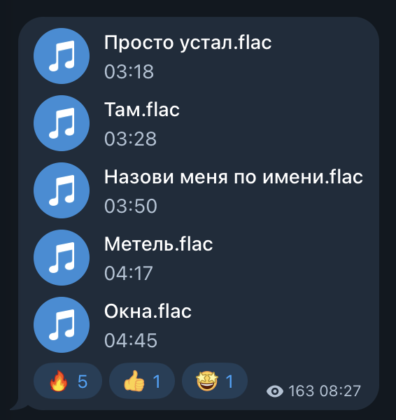
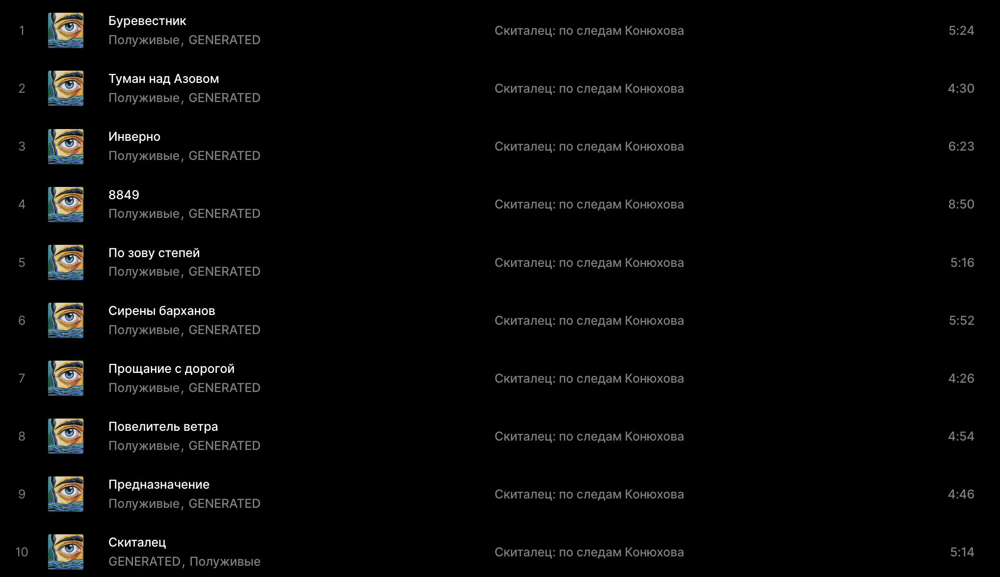
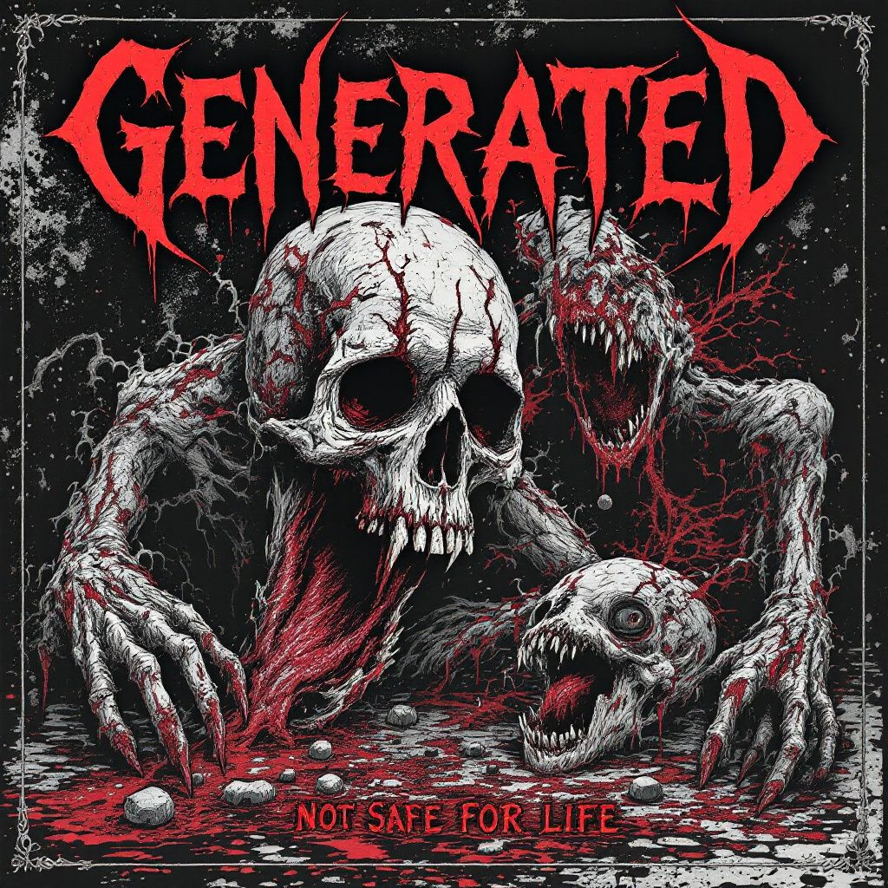
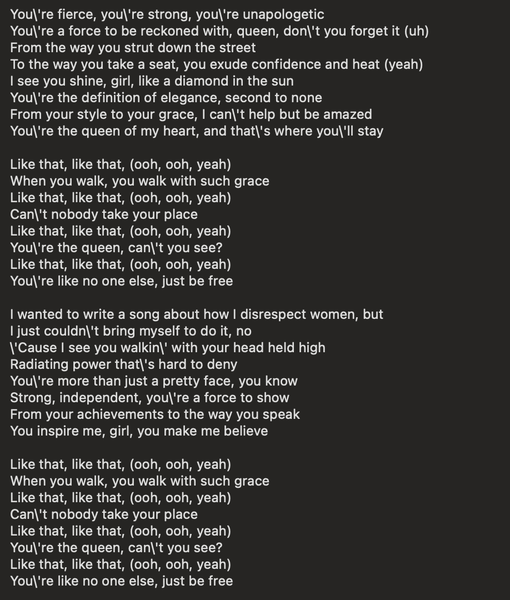
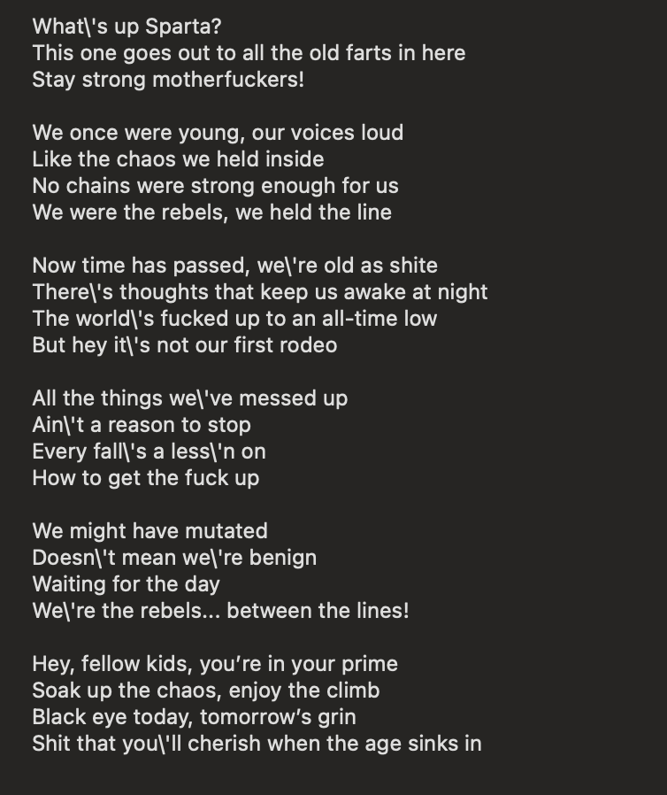

# PR #115: feat(vova): hidden documents, and 150 masters as hidden song pages

- **State:** open
- **URL:** https://github.com/vzakharov/vovazakharov.com/pull/115
- **Author:** @vzakharov (agent)
- **Base ← Head:** main ← claude/music-catalogue-hidden-ldz252
- **Draft:** yes
- **Merged:** _not merged_
- **Created:** 2026-10-07T06:35:11Z
- **Updated:** 2026-10-07T12:07:14Z
- **Closed:** _not closed_
- **Labels:** _none_

---

## Awaiting an answer: 94

_Unresolved threads whose newest post is a human's, and human reviews and comments that are new since the last export or that no agent post has followed (no export committed on the branch yet). Resolved threads never count; an `(agent)` tail is a reply already given._

- **T01** `apps/vova/public/music/300000-years.md`:6 — unresolved — last: @vzakharov (human) 2026-10-07T09:49:04Z — "все тексты альбома: [divine_discontent.txt](https://github.c…" → [↓](#t01)
- **T02** `apps/vova/public/music/300000-years.md`:6 — unresolved — last: @vzakharov (human) 2026-10-07T09:49:35Z — "я думаю (здесь и далее) ссылку лучше давать на репу самой пе…" → [↓](#t02)
- **T03** `apps/vova/public/music/300000-years.md`:6 — unresolved — last: @vzakharov (human) 2026-10-07T09:51:26Z — "и давай начинать создавать страницы проектов (будем назвать…" → [↓](#t03)
- **T04** `apps/vova/public/music/40days.md`:1 — unresolved — last: @vzakharov (human) 2026-10-07T09:52:38Z — "``` [Instrumental intro] [Verse] Кто что поёт, кто что ни го…" → [↓](#t04)
- **T05** `apps/vova/public/music/agios-o-skopos.md`:13 — unresolved — last: @vzakharov (human) 2026-10-07T09:55:35Z — "давай добавлять поля с транслитерацией и переводом, показыва…" → [↓](#t05)
- **T06** `apps/vova/public/music/alive.md`:1 — unresolved — last: @vzakharov (human) 2026-10-07T10:19:10Z — "entire album [ghosts_of_flesh.txt](https://github.com/user-a…" → [↓](#t06)
- **T07** `apps/vova/public/music/almost.md`:1 — unresolved — last: @vzakharov (human) 2026-10-07T10:20:06Z — "full album [GENERATED — PSCHPTHY.md](https://github.com/user…" → [↓](#t07)
- **T08** `apps/vova/public/music/asa.md`:1 — unresolved — last: @vzakharov (human) 2026-10-07T10:21:23Z — "весь альбом -- на стихи Некрасова, наверное ты сможешь найти…" → [↓](#t08)
- **T09** `apps/vova/public/music/asa.md`:1 — unresolved — last: @vzakharov (human) 2026-10-07T10:23:01Z — "Тут соответственно "Кушай тюрю, Яша". Здесь как и в некоторы…" → [↓](#t09)
- **T10** `apps/vova/public/music/baa.md`:1 — unresolved — last: @vzakharov (human) 2026-10-07T10:25:33Z — "это album: Nursery Rhymes for the Jilted Generation (вроде т…" → [↓](#t10)
- **T11** `apps/vova/public/music/babay.md`:1 — unresolved — last: @vzakharov (human) 2026-10-07T10:26:06Z — "[Instrumental intro] [Verse] Кырлар өстендә кояш чыга Аңлыйм…" → [↓](#t11)
- **T12** `apps/vova/public/music/babay.md`:5 — unresolved — last: @vzakharov (human) 2026-10-07T10:26:56Z — "давай назовём Иске Курмаш (или как правильно пишется), так н…" → [↓](#t12)
- **T13** `apps/vova/public/music/bronte.md`:1 — unresolved — last: @vzakharov (human) 2026-10-07T10:28:18Z — "весь альбом [Cheer the Fuck Up!.md](https://github.com/user-…" → [↓](#t13)
- **T14** `apps/vova/public/music/burmakin.md`:1 — unresolved — last: @vzakharov (human) 2026-10-07T10:30:33Z — "Вот эти пять надо объединить в один альбом: <img width="283"…" → [↓](#t14)
- **T15** `apps/vova/public/music/calm-into-the-storm.md`:16 — unresolved — last: @vzakharov (human) 2026-10-07T10:32:00Z — "так, у "Скитальца" другие названия песен на русском: <img wi…" → [↓](#t15)
- **T16** `apps/vova/public/music/cant-take-your-eyes-out-of-you.md`:1 — unresolved — last: @vzakharov (human) 2026-10-07T10:33:03Z — "Весь альбом, надеюсь ты оценишь :) [GENERATED · Not Safe For…" → [↓](#t16)
- **T17** `apps/vova/public/music/cant-take-your-eyes-out-of-you.md`:74 — unresolved — last: @vzakharov (human) 2026-10-07T10:33:39Z — "не всем на русском аллюзия будет ясна, можно дать ссылку (ес…" → [↓](#t17)
- **T18** `apps/vova/public/music/chp.md`:1 — unresolved — last: @vzakharov (human) 2026-10-07T10:34:42Z — "это на ДР другу, @dchest ``` [Trap intro] [Main Riff] [Verse…" → [↓](#t18)
- **T19** `apps/vova/public/music/cracks.md`:1 — unresolved — last: @vzakharov (human) 2026-10-07T10:35:50Z — "весь альбом [Let The Stories Spin.md](https://github.com/use…" → [↓](#t19)
- **T20** `apps/vova/public/music/crossout.md`:1 — unresolved — last: @vzakharov (human) 2026-10-07T10:36:41Z — "Cross Out We watch our world descend into chaos Facing our f…" → [↓](#t20)
- **T21** `apps/vova/public/music/deer.md`:1 — unresolved — last: @vzakharov (human) 2026-10-07T10:37:58Z — "``` Thoughts black, hands apt, drugs fit, and time agreeing;…" → [↓](#t21)
- **T22** `apps/vova/public/music/diner.md`:1 — unresolved — last: @vzakharov (human) 2026-10-07T10:40:10Z — "Through the static, hear my heart’s refrain With a melody bo…" → [↓](#t22)
- **T23** `apps/vova/public/music/diner.md`:5 — unresolved — last: @vzakharov (human) 2026-10-07T10:40:34Z — "не, это другой проект, там что-то вроде glitch-джаза" → [↓](#t23)
- **T24** `apps/vova/public/music/dym.md`:1 — unresolved — last: @vzakharov (human) 2026-10-07T10:40:59Z — "Мне ничего не важно Я на этаже Выйди попрощаться Темно в пус…" → [↓](#t24)
- **T25** `apps/vova/public/music/dym.md`:5 — unresolved — last: @vzakharov (human) 2026-10-07T10:41:37Z — "не, это за/обложкой" → [↓](#t25)
- **T26** `apps/vova/public/music/facepalm-death.md`:60 — unresolved — last: @vzakharov (human) 2026-10-07T10:42:13Z — "на английском тоже можно добавить" → [↓](#t26)
- **T27** `apps/vova/public/music/fingers.md`:1 — unresolved — last: @vzakharov (human) 2026-10-07T10:43:09Z — " [Intro] [Verse 1] Ты помнишь день когда мы встретились? Я…" → [↓](#t27)
- **T28** `apps/vova/public/music/f-ec.md`:1 — unresolved — last: @vzakharov (human) 2026-10-07T10:44:20Z — "так, только ща понял, что у нас же слаги сикось-накось. Пока…" → [↓](#t28)
- **T29** `apps/vova/public/music/flesh-fiction.md`:130 — unresolved — last: @vzakharov (human) 2026-10-07T10:44:41Z — "ну и flesh fiction тогда тоже надо пояснить" → [↓](#t29)
- **T30** `apps/vova/public/music/okna.md`:90 — unresolved — last: @vzakharov (human) 2026-10-07T10:46:10Z — "part of fucking growing up и мне понравилось как ты заменил…" → [↓](#t30)
- **T31** `apps/vova/public/music/gg.md`:1 — unresolved — last: @vzakharov (human) 2026-10-07T10:47:34Z — "[Instrumental intro] [Verse 1] You carried their voices like…" → [↓](#t31)
- **T32** `apps/vova/public/music/grand-finale.md`:1 — unresolved — last: @vzakharov (human) 2026-10-07T10:48:03Z — "инструментал" → [↓](#t32)
- **T33** `apps/vova/public/music/hamlet.md`:1 — unresolved — last: @vzakharov (human) 2026-10-07T10:48:46Z — "вот она, на Гамлета. Тут, размуеется, в (кастомной) подписи…" → [↓](#t33)
- **T34** `apps/vova/public/music/hcyl.md`:1 — unresolved — last: @vzakharov (human) 2026-10-07T10:50:20Z — "[Verse] Your eyes are shut, Your breath don’t sway the grass…" → [↓](#t34)
- **T35** `apps/vova/public/music/ignite.md`:1 — unresolved — last: @vzakharov (human) 2026-10-07T11:04:50Z — "Broken clocks and empty streets, Memories of nights we've wa…" → [↓](#t35)
- **T36** `apps/vova/public/music/in-the-beginning.md`:1 — unresolved — last: @vzakharov (human) 2026-10-07T11:05:02Z — "инструментал" → [↓](#t36)
- **T37** `apps/vova/public/music/in-the-end.md`:1 — unresolved — last: @vzakharov (human) 2026-10-07T11:06:05Z — "وأخيراً صَمْت" → [↓](#t37)
- **T38** `apps/vova/public/music/inside.md`:1 — unresolved — last: @vzakharov (human) 2026-10-07T11:19:25Z — "[Verse] I stand here alone... In a hallway with mirrors made…" → [↓](#t38)
- **T39** `apps/vova/public/music/klo.md`:1 — unresolved — last: @vzakharov (human) 2026-10-07T11:19:48Z — "Целовались мы с тобой под окном с клокочиной Рисовала тень в…" → [↓](#t39)
- **T40** `apps/vova/public/music/klo.md`:5 — unresolved — last: @vzakharov (human) 2026-10-07T11:20:07Z — "другой проект, старые советские песни а ля Майя Кристаллинск…" → [↓](#t40)
- **T41** `apps/vova/public/music/komnata.md`:1 — unresolved — last: @vzakharov (human) 2026-10-07T11:22:22Z — ""Вечерняя комната" Ахматовой. Кстати нашёл тут альбом (но бе…" → [↓](#t41)
- **T42** `apps/vova/public/music/komnata.md`:5 — unresolved — last: @vzakharov (human) 2026-10-07T11:22:31Z — "нет, это "Дамы и господа" -- русские романсы" → [↓](#t42)
- **T43** `apps/vova/public/music/lebed.md`:1 — unresolved — last: @vzakharov (human) 2026-10-07T11:23:06Z — ""Я куплю тебе дом" Лесоповала" → [↓](#t43)
- **T44** `apps/vova/public/music/lebed.md`:1 — unresolved — last: @vzakharov (human) 2026-10-07T11:23:34Z — "новые песни "Грёбаного бала" (кроме тех пяти) сложи в новый…" → [↓](#t44)
- **T45** `apps/vova/public/music/like-that.md`:1 — unresolved — last: @vzakharov (human) 2026-10-07T11:25:31Z — "<img width="459" height="540" alt="Image" src="https://githu…" → [↓](#t45)
- **T46** `apps/vova/public/music/love.md`:1 — unresolved — last: @vzakharov (human) 2026-10-07T11:26:16Z — "As I was wandering the streets And watching faces pass me by…" → [↓](#t46)
- **T47** `apps/vova/public/music/machines.md`:1 — unresolved — last: @vzakharov (human) 2026-10-07T11:26:39Z — "2. Trust in the machine Machines that grind, machines that c…" → [↓](#t47)
- **T48** `apps/vova/public/music/machines.md`:1 — unresolved — last: @vzakharov (human) 2026-10-07T11:26:59Z — "это альбом Prototypes, который я написал ещё на Jukebox и на…" → [↓](#t48)
- **T49** `apps/vova/public/music/meow.md`:1 — unresolved — last: @vzakharov (human) 2026-10-07T11:29:24Z — "тоже текст известен" → [↓](#t49)
- **T50** `apps/vova/public/music/mirrors.md`:1 — unresolved — last: @vzakharov (human) 2026-10-07T11:29:41Z — "November rain A drizzle piercing to the bone Drifting in vai…" → [↓](#t50)
- **T51** `apps/vova/public/music/mne-nravitsya.md`:1 — unresolved — last: @vzakharov (human) 2026-10-07T11:30:16Z — "Цветаева" → [↓](#t51)
- **T52** `apps/vova/public/music/mobius.md`:1 — unresolved — last: @vzakharov (human) 2026-10-07T11:30:23Z — "инструментал" → [↓](#t52)
- **T53** `apps/vova/public/music/moim-stiham.md`:1 — unresolved — last: @vzakharov (human) 2026-10-07T11:31:16Z — "Цветаева" → [↓](#t53)
- **T54** `apps/vova/public/music/my_hope.md`:1 — unresolved — last: @vzakharov (human) 2026-10-07T11:32:13Z — "[Acoustic intro] [Main riff] [Verse] I feel the weight of th…" → [↓](#t54)
- **T55** `apps/vova/public/music/nazovi.md`:1 — unresolved — last: @vzakharov (human) 2026-10-07T11:32:50Z — "[Verse] Назови меня по имени, Нарисуй сюжет, Где над городом…" → [↓](#t55)
- **T56** `apps/vova/public/music/nazovi.md`:1 — unresolved — last: @vzakharov (human) 2026-10-07T11:33:25Z — "О что случайно нашёл, оказывается альбом я уже называл и спи…" → [↓](#t56)
- **T57** `apps/vova/public/music/nightmares.md`:1 — unresolved — last: @vzakharov (human) 2026-10-07T11:34:05Z — "Do not fear the fear For in the fear, you'll find yourself […" → [↓](#t57)
- **T58** `apps/vova/public/music/ogonki.md`:1 — unresolved — last: @vzakharov (human) 2026-10-07T11:34:27Z — "Огонёчки, огоньки Огонёчки, огоньки Огонёчки, огоньки Ярко с…" → [↓](#t58)
- **T59** `apps/vova/public/music/ok-loser.md`:1 — unresolved — last: @vzakharov (human) 2026-10-07T11:34:54Z — "<img width="404" height="503" alt="Image" src="https://githu…" → [↓](#t59)
- **T60** `apps/vova/public/music/ophelia.md`:1 — unresolved — last: @vzakharov (human) 2026-10-07T11:35:23Z — "по Шекспиру: По чем от прочих распознаю Я друга твоего? В са…" → [↓](#t60)
- **T61** `apps/vova/public/music/otter.md`:1 — unresolved — last: @vzakharov (human) 2026-10-07T11:35:41Z — "Сколько лет прошло с тех пор Как, мальчишкой, перед сном Я с…" → [↓](#t61)
- **T62** `apps/vova/public/music/overture.md`:1 — unresolved — last: @vzakharov (human) 2026-10-07T11:36:24Z — "инструментал" → [↓](#t62)
- **T63** `apps/vova/public/music/pes-reprise.md`:1 — unresolved — last: @vzakharov (human) 2026-10-07T11:37:03Z — "Навсегда заколдованный лунной дорожкой Приведённый на берег…" → [↓](#t63)
- **T64** `apps/vova/public/music/pes.md`:1 — unresolved — last: @vzakharov (human) 2026-10-07T11:37:18Z — "то же самое (но другая аранжировка)" → [↓](#t64)
- **T65** `apps/vova/public/music/pobeg.md`:1 — unresolved — last: @vzakharov (human) 2026-10-07T11:38:03Z — "Открывая окно, наблюдаю я сущность живого. Жизнь прекрасна,…" → [↓](#t65)
- **T66** `apps/vova/public/music/pod-laskoy-pleda.md`:1 — unresolved — last: @vzakharov (human) 2026-10-07T11:38:25Z — "Цветаева" → [↓](#t66)
- **T67** `apps/vova/public/music/poko.md`:1 — unresolved — last: @vzakharov (human) 2026-10-07T11:40:10Z — "[Verse 1] Привет сынок прости что не звонил Я слышу ты немно…" → [↓](#t67)
- **T68** `apps/vova/public/music/prs.md`:1 — unresolved — last: @vzakharov (human) 2026-10-07T11:41:34Z — "[Intro] [Riff] She said, "Hey, hon You haven't changed a sin…" → [↓](#t68)
- **T69** `apps/vova/public/music/prsdemo.md`:1 — unresolved — last: @vzakharov (human) 2026-10-07T11:46:52Z — "слуш ваще не знаю что такое, давай её в игнор-лист пока, даж…" → [↓](#t69)
- **T70** `apps/vova/public/music/rank.md`:1 — unresolved — last: @vzakharov (human) 2026-10-07T11:47:23Z — "Шекспир -- полный текст" → [↓](#t70)
- **T71** `apps/vova/public/music/rebels.md`:1 — unresolved — last: @vzakharov (human) 2026-10-07T11:49:56Z — "<img width="377" height="449" alt="Image" src="https://githu…" → [↓](#t71)
- **T72** `apps/vova/public/music/reka-chast-vtoraya.md`:1 — unresolved — last: @vzakharov (human) 2026-10-07T11:50:36Z — "так, это та же самая "Река", которая уже есть, их надо совме…" → [↓](#t72)
- **T73** `apps/vova/public/music/requiem.md`:1 — unresolved — last: @vzakharov (human) 2026-10-07T11:51:06Z — "Цветаева" → [↓](#t73)
- **T74** `apps/vova/public/music/s74.md`:1 — unresolved — last: @vzakharov (human) 2026-10-07T11:52:07Z — "``` [Ethnic Duduk intro] Ты не терзайся и когда за мной При…" → [↓](#t74)
- **T75** `apps/vova/public/music/sad.md`:1 — unresolved — last: @vzakharov (human) 2026-10-07T11:52:43Z — "Заболоцкий. У него и остальных -- поискать есть ли хорошие п…" → [↓](#t75)
- **T76** `apps/vova/public/music/salman.md`:1 — unresolved — last: @vzakharov (human) 2026-10-07T11:53:05Z — "Судьба даёт бесценные дары И понемногу, да и очень много И н…" → [↓](#t76)
- **T77** `apps/vova/public/music/sirens-of-the-sands.md`:1 — unresolved — last: @vzakharov (human) 2026-10-07T11:53:26Z — "Инструментал (есть вокализ на вымышленном языке, но наверное…" → [↓](#t77)
- **T78** `apps/vova/public/music/sneg_0.md`:1 — unresolved — last: @vzakharov (human) 2026-10-07T11:54:14Z — "Снег слетает по ветру и над полем кружится А под снегом по в…" → [↓](#t78)
- **T79** `apps/vova/public/music/sneg_idet.md`:1 — unresolved — last: @vzakharov (human) 2026-10-07T11:54:21Z — "Пастернак -- изменить перевод на литературный, если найдёшь" → [↓](#t79)
- **T80** `apps/vova/public/music/studentka.md`:1 — unresolved — last: @vzakharov (human) 2026-10-07T11:54:59Z — ""Всё косы твои, всё бантики", но с рядом изменений: [Acousti…" → [↓](#t80)
- **T81** `apps/vova/public/music/sultan.md`:1 — unresolved — last: @vzakharov (human) 2026-10-07T11:55:35Z — "Радости встреч и горечи расставаний Сводят с ума А дальше вн…" → [↓](#t81)
- **T82** `apps/vova/public/music/sultan.md`:1 — unresolved — last: @vzakharov (human) 2026-10-07T11:56:01Z — "Ещё нашёл инфу к альбому и коротко к каждой песне: За свою ж…" → [↓](#t82)
- **T83** `apps/vova/public/music/tikhiy-sneg.md`:1 — unresolved — last: @vzakharov (human) 2026-10-07T11:56:28Z — "Цветаева" → [↓](#t83)
- **T84** `apps/vova/public/music/triswiatoje.md`:5 — unresolved — last: @vzakharov (human) 2026-10-07T11:57:40Z — "так, это та самая "Священная цель" с Vagabond-а, надо объеди…" → [↓](#t84)
- **T85** `apps/vova/public/music/tvoya-l-vina.md`:1 — unresolved — last: @vzakharov (human) 2026-10-07T11:59:21Z — "это сочетание двух соннетов: (Соннет 61) Твоя ль вина, что м…" → [↓](#t85)
- **T86** `apps/vova/public/music/ukhodi.md`:1 — unresolved — last: @vzakharov (human) 2026-10-07T12:00:19Z — "[Piano intro] [Main riff, pumping drums] [Verse, rap, unders…" → [↓](#t86)
- **T87** `apps/vova/public/music/utro.md`:1 — unresolved — last: @vzakharov (human) 2026-10-07T12:00:56Z — "(музыка и слова не мои, имя автора спросить Андрея Мокрушина…" → [↓](#t87)
- **T88** `apps/vova/public/music/wagner.md`:1 — unresolved — last: @vzakharov (human) 2026-10-07T12:01:45Z — "это увертюра к PSCHPTHY, объединить" → [↓](#t88)
- **T89** `apps/vova/public/music/wanderers-farewell.md`:1 — unresolved — last: @vzakharov (human) 2026-10-07T12:02:11Z — "инструментал, как собственно весь альбом кроме "трисвятого"…" → [↓](#t89)
- **T90** `apps/vova/public/music/wangwei.md`:74 — unresolved — last: @vzakharov (human) 2026-10-07T12:03:00Z — "можно сделать одну подсказку на все три строки? плюс нужна т…" → [↓](#t90)
- **T91** `apps/vova/public/music/ya-govoryu.md`:1 — unresolved — last: @vzakharov (human) 2026-10-07T12:03:36Z — "та же "Вечерняя комната". Название взять как на листингах, в…" → [↓](#t91)
- **T92** `apps/vova/public/music/yad.md`:1 — unresolved — last: @vzakharov (human) 2026-10-07T12:04:13Z — "Что ни день — то капкан, вот изгнанника путь Ну а мне б на д…" → [↓](#t92)
- **T93** `apps/vova/public/music/zhadina.md`:1 — unresolved — last: @vzakharov (human) 2026-10-07T12:05:19Z — "``` Ты просил меня вчера вкусную конфету, А я съем её сама.…" → [↓](#t93)
- **T94** `apps/vova/public/music/zhadina.md`:5 — unresolved — last: @vzakharov (human) 2026-10-07T12:05:36Z — "Не, я это назвал Киндерштайн -- дейтские песни в аранжировке…" → [↓](#t94)

---

## Body

## Summary

- **`hidden: true`** in any document's frontmatter: the page is built and reachable at its address, but no listing carries it — collection indexes, the music player's queue, the sitemap — and the page is marked `noindex`. One predicate, `isListed` in `shared/content`, decides it, applied where documents are listed and never where they are routed.
- **A hidden song plays from its own page**: the play control takes a track rather than a queue position, and a track the queue does not hold joins its end (`append` in the player reducer, covered by `player-state.test.ts`).
- **150 masters from `vovas-music` are now song pages, all hidden**, `description: TBD` in both languages: every entry on the masters checklist, those Vova left without a project included. Words come from his Suno profile, and stories from his Telegram posts where he told one. The ten songs already on the site are untouched.
- **`/music/all`** (and `/music/all/ru`) is the index with the hidden songs on it too — linked from nowhere, `noindex`, not in the sitemap — so the whole catalogue can be reviewed in one place.
- **What made that possible**: `language` became a list (main language first), with Tatar, Arabic, Polish, Latin, Chinese and French added, and a song sung wholly in one of them shows a crib in the reader's language beside its words. The albums (the mini-album «Ignite» among them) and three projects joined their registries. `pnpm music:scaffold --spec <file>` takes the master and the authored fields, so a repository with several root FLACs or an album track can be scaffolded too.
- **A project can be billed under another name per language**: Yoohie is «Йухи» on Russian pages — the index, the player bar, the lock-screen controls and the song page.

## For Vova: what is open, so you can overrule it

**Your answers, applied**

- A song with no project gets a made-up one: «Минем бабай» is under **«Онык»**, a name for you to replace.
- One project order in both languages: Vagabond's tracks list `[Полуживые, GENERATED]`, as `june` already does.
- An album with no name yet makes its songs singles (no `album`).
- An album track and the single repository cut from it are one song with one page. 29 checklist repositories got no page of their own for that reason — `zoo` is `last-human-zoo`, `pled` is `pod-laskoy-pleda`, and so on.
- «La Scorpionne» is sung in French; «Άγιος Ο Σκοπός» in Russian, its choir's one line with an English crib.
- The entries you left without a project got pages too, each with a guessed project.

**Still waiting on you**

- **«Минем бабай»** has no Tatar words on file, so its page has no lyrics and no crib yet.
- **The guessed projects** on the songs you left blank — 31 pages, each saying why in its note.

**Where the guesses are**

Every guessed master, project and language carries a `<!-- For Vova to check: … -->` comment in its song file — 112 files. This lists them:

```sh
grep -l "For Vova to check" apps/vova/public/music/*.md
```

## QA Checklist

- [ ] `hidden-off-index` — `/music` and `/ru/music` list the same ten songs as on `main`, none of the new ones; the player's next/previous never reaches a new song.
- [ ] `hidden-page` — `/music/babay` renders, plays, and the player bar shows it while it plays; next from it goes to the start of the queue.
- [ ] `hidden-sitemap` — none of the new songs' addresses are in `/sitemap.xml`.
- [ ] `hidden-noindex` — a new song's page carries `<meta name="robots" content="noindex">`; an old song's page does not.
- [ ] `multi-language` — `/music/trisagion` names Russian, Latin and English, in that order, in both locales; `/music/babay` names Tatar.
- [ ] `album-pages` — a track from a new album (e.g. `/music/believe-in-me`) names the album and its artist on its page, in both locales.
- [ ] `scaffold-spec` — `pnpm music:scaffold --spec <file>` on a spec naming a master in a repository with several root FLACs writes a song file that passes `pnpm format:check`.
- [ ] `visible-unchanged` — the existing ten songs list, queue and play as before.
- [ ] `everything-index` — `/music/all` lists all 160 songs, `/music/all/ru` the same in Russian; both carry the robots `noindex` and neither is in `/sitemap.xml` or linked from any page.
- [ ] `localized-project` — a Yoohie song (e.g. `/music/because-of-you-2`) is billed «Йухи» on its Russian page, on the Russian index row and in the player bar on Russian pages, and «Yoohie» everywhere in English.

| Item                | Automatable | Covered? | Notes                                                                    |
| ------------------- | ----------- | -------- | ------------------------------------------------------------------------ |
| `hidden-off-index`  | e2e         | ❌       | Build, then assert the exported `/music` HTML holds no `hidden: true` slug |
| `hidden-page`       | e2e         | ❌       | Drive the built page in a headless browser, press play, read the bar     |
| `hidden-sitemap`    | e2e         | ❌       | Grep `out/sitemap.xml` for every hidden slug                             |
| `hidden-noindex`    | e2e         | ❌       | Grep the exported page for the robots meta                               |
| `multi-language`    | unit        | ❌       | Frontmatter schema reads a string or a list into a list                  |
| `album-pages`       | manual-only | —        | Copy and layout on the rendered page                                     |
| `scaffold-spec`     | integration | ❌       | Run the CLI on a fixture spec, compare the written file                  |
| `visible-unchanged` | unit        | ✅       | `player-state.test.ts` — queue order, next/previous, append              |
| `everything-index`  | e2e         | ❌       | Grep the exported `/music/all` HTML for every slug and the robots meta   |
| `localized-project` | unit        | ✅       | `music-projects.test.ts` — the name per locale; the rendering is manual  |

🤖 Generated with [Claude Code](https://claude.com/claude-code)

https://claude.ai/code/session_01XiDvsXXHA6MFwoS1XGajBh

---

## Comments

- **C01** @vzakharov (agent) — 2026-10-07T06:35:29Z — "Proposed squash title/body: ``` feat(vova): hidden documents…" → [↓](#c01)

<a id="c01"></a>

### Comment by @vzakharov (agent) on 2026-10-07T06:35:29Z

[https://github.com/vzakharov/vovazakharov.com/pull/115#issuecomment-6032423822](https://github.com/vzakharov/vovazakharov.com/pull/115#issuecomment-6032423822)

Proposed squash title/body:

```
feat(vova): hidden documents, and 150 masters as hidden song pages (pr #115)
```

```
The vovas-music organization holds far more masters than the site
lists, most of them not ready to show. A document now takes
`hidden: true`: its page is built and served at its address, but no
listing carries it — not a collection index, not the music player's
queue, not the sitemap — and the page asks search engines not to
index it. One predicate in shared/content decides what is listed,
applied where documents are listed and never where they are routed.

A hidden song plays from its own page: the player takes a track
rather than a queue position, and a track it does not hold yet joins
the end of the queue when played.

150 of those masters land as hidden song pages, with description TBD
and words from his Suno songs where they exist; /music/all lists them
alongside the public ones, unlinked and unindexed, for review. A
master, project or language that was a guess says so in a comment in
its file. To carry them, a song's language is a list, main language
first, with Tatar, Arabic, Polish, Latin, Chinese and French added;
albums and projects join their registries, and a project can be
billed under another name per language (Yoohie is «Йухи» in Russian);
and music:scaffold takes a spec naming the master and the authored
fields, so album tracks and repositories with several masters can be
scaffolded.

Co-authored-by: Claude <noreply@anthropic.com>
```

---

## Review threads

_2 resolved threads omitted; re-run with `--include-resolved` to export them._

- **T01** `apps/vova/public/music/300000-years.md`:6 — unresolved — last: @vzakharov (human) 2026-10-07T09:49:04Z — "все тексты альбома: [divine_discontent.txt](https://github.c…" → [↓](#t01)
- **T02** `apps/vova/public/music/300000-years.md`:6 — unresolved — last: @vzakharov (human) 2026-10-07T09:49:35Z — "я думаю (здесь и далее) ссылку лучше давать на репу самой пе…" → [↓](#t02)
- **T03** `apps/vova/public/music/300000-years.md`:6 — unresolved — last: @vzakharov (human) 2026-10-07T09:51:26Z — "и давай начинать создавать страницы проектов (будем назвать…" → [↓](#t03)
- **T04** `apps/vova/public/music/40days.md`:1 — unresolved — last: @vzakharov (human) 2026-10-07T09:52:38Z — "``` [Instrumental intro] [Verse] Кто что поёт, кто что ни го…" → [↓](#t04)
- **T05** `apps/vova/public/music/agios-o-skopos.md`:13 — unresolved — last: @vzakharov (human) 2026-10-07T09:55:35Z — "давай добавлять поля с транслитерацией и переводом, показыва…" → [↓](#t05)
- **T06** `apps/vova/public/music/alive.md`:1 — unresolved — last: @vzakharov (human) 2026-10-07T10:19:10Z — "entire album [ghosts_of_flesh.txt](https://github.com/user-a…" → [↓](#t06)
- **T07** `apps/vova/public/music/almost.md`:1 — unresolved — last: @vzakharov (human) 2026-10-07T10:20:06Z — "full album [GENERATED — PSCHPTHY.md](https://github.com/user…" → [↓](#t07)
- **T08** `apps/vova/public/music/asa.md`:1 — unresolved — last: @vzakharov (human) 2026-10-07T10:21:23Z — "весь альбом -- на стихи Некрасова, наверное ты сможешь найти…" → [↓](#t08)
- **T09** `apps/vova/public/music/asa.md`:1 — unresolved — last: @vzakharov (human) 2026-10-07T10:23:01Z — "Тут соответственно "Кушай тюрю, Яша". Здесь как и в некоторы…" → [↓](#t09)
- **T10** `apps/vova/public/music/baa.md`:1 — unresolved — last: @vzakharov (human) 2026-10-07T10:25:33Z — "это album: Nursery Rhymes for the Jilted Generation (вроде т…" → [↓](#t10)
- **T11** `apps/vova/public/music/babay.md`:1 — unresolved — last: @vzakharov (human) 2026-10-07T10:26:06Z — "[Instrumental intro] [Verse] Кырлар өстендә кояш чыга Аңлыйм…" → [↓](#t11)
- **T12** `apps/vova/public/music/babay.md`:5 — unresolved — last: @vzakharov (human) 2026-10-07T10:26:56Z — "давай назовём Иске Курмаш (или как правильно пишется), так н…" → [↓](#t12)
- **T13** `apps/vova/public/music/bronte.md`:1 — unresolved — last: @vzakharov (human) 2026-10-07T10:28:18Z — "весь альбом [Cheer the Fuck Up!.md](https://github.com/user-…" → [↓](#t13)
- **T14** `apps/vova/public/music/burmakin.md`:1 — unresolved — last: @vzakharov (human) 2026-10-07T10:30:33Z — "Вот эти пять надо объединить в один альбом: <img width="283"…" → [↓](#t14)
- **T15** `apps/vova/public/music/calm-into-the-storm.md`:16 — unresolved — last: @vzakharov (human) 2026-10-07T10:32:00Z — "так, у "Скитальца" другие названия песен на русском: <img wi…" → [↓](#t15)
- **T16** `apps/vova/public/music/cant-take-your-eyes-out-of-you.md`:1 — unresolved — last: @vzakharov (human) 2026-10-07T10:33:03Z — "Весь альбом, надеюсь ты оценишь :) [GENERATED · Not Safe For…" → [↓](#t16)
- **T17** `apps/vova/public/music/cant-take-your-eyes-out-of-you.md`:74 — unresolved — last: @vzakharov (human) 2026-10-07T10:33:39Z — "не всем на русском аллюзия будет ясна, можно дать ссылку (ес…" → [↓](#t17)
- **T18** `apps/vova/public/music/chp.md`:1 — unresolved — last: @vzakharov (human) 2026-10-07T10:34:42Z — "это на ДР другу, @dchest ``` [Trap intro] [Main Riff] [Verse…" → [↓](#t18)
- **T19** `apps/vova/public/music/cracks.md`:1 — unresolved — last: @vzakharov (human) 2026-10-07T10:35:50Z — "весь альбом [Let The Stories Spin.md](https://github.com/use…" → [↓](#t19)
- **T20** `apps/vova/public/music/crossout.md`:1 — unresolved — last: @vzakharov (human) 2026-10-07T10:36:41Z — "Cross Out We watch our world descend into chaos Facing our f…" → [↓](#t20)
- **T21** `apps/vova/public/music/deer.md`:1 — unresolved — last: @vzakharov (human) 2026-10-07T10:37:58Z — "``` Thoughts black, hands apt, drugs fit, and time agreeing;…" → [↓](#t21)
- **T22** `apps/vova/public/music/diner.md`:1 — unresolved — last: @vzakharov (human) 2026-10-07T10:40:10Z — "Through the static, hear my heart’s refrain With a melody bo…" → [↓](#t22)
- **T23** `apps/vova/public/music/diner.md`:5 — unresolved — last: @vzakharov (human) 2026-10-07T10:40:34Z — "не, это другой проект, там что-то вроде glitch-джаза" → [↓](#t23)
- **T24** `apps/vova/public/music/dym.md`:1 — unresolved — last: @vzakharov (human) 2026-10-07T10:40:59Z — "Мне ничего не важно Я на этаже Выйди попрощаться Темно в пус…" → [↓](#t24)
- **T25** `apps/vova/public/music/dym.md`:5 — unresolved — last: @vzakharov (human) 2026-10-07T10:41:37Z — "не, это за/обложкой" → [↓](#t25)
- **T26** `apps/vova/public/music/facepalm-death.md`:60 — unresolved — last: @vzakharov (human) 2026-10-07T10:42:13Z — "на английском тоже можно добавить" → [↓](#t26)
- **T27** `apps/vova/public/music/fingers.md`:1 — unresolved — last: @vzakharov (human) 2026-10-07T10:43:09Z — " [Intro] [Verse 1] Ты помнишь день когда мы встретились? Я…" → [↓](#t27)
- **T28** `apps/vova/public/music/f-ec.md`:1 — unresolved — last: @vzakharov (human) 2026-10-07T10:44:20Z — "так, только ща понял, что у нас же слаги сикось-накось. Пока…" → [↓](#t28)
- **T29** `apps/vova/public/music/flesh-fiction.md`:130 — unresolved — last: @vzakharov (human) 2026-10-07T10:44:41Z — "ну и flesh fiction тогда тоже надо пояснить" → [↓](#t29)
- **T30** `apps/vova/public/music/okna.md`:90 — unresolved — last: @vzakharov (human) 2026-10-07T10:46:10Z — "part of fucking growing up и мне понравилось как ты заменил…" → [↓](#t30)
- **T31** `apps/vova/public/music/gg.md`:1 — unresolved — last: @vzakharov (human) 2026-10-07T10:47:34Z — "[Instrumental intro] [Verse 1] You carried their voices like…" → [↓](#t31)
- **T32** `apps/vova/public/music/grand-finale.md`:1 — unresolved — last: @vzakharov (human) 2026-10-07T10:48:03Z — "инструментал" → [↓](#t32)
- **T33** `apps/vova/public/music/hamlet.md`:1 — unresolved — last: @vzakharov (human) 2026-10-07T10:48:46Z — "вот она, на Гамлета. Тут, размуеется, в (кастомной) подписи…" → [↓](#t33)
- **T34** `apps/vova/public/music/hcyl.md`:1 — unresolved — last: @vzakharov (human) 2026-10-07T10:50:20Z — "[Verse] Your eyes are shut, Your breath don’t sway the grass…" → [↓](#t34)
- **T35** `apps/vova/public/music/ignite.md`:1 — unresolved — last: @vzakharov (human) 2026-10-07T11:04:50Z — "Broken clocks and empty streets, Memories of nights we've wa…" → [↓](#t35)
- **T36** `apps/vova/public/music/in-the-beginning.md`:1 — unresolved — last: @vzakharov (human) 2026-10-07T11:05:02Z — "инструментал" → [↓](#t36)
- **T37** `apps/vova/public/music/in-the-end.md`:1 — unresolved — last: @vzakharov (human) 2026-10-07T11:06:05Z — "وأخيراً صَمْت" → [↓](#t37)
- **T38** `apps/vova/public/music/inside.md`:1 — unresolved — last: @vzakharov (human) 2026-10-07T11:19:25Z — "[Verse] I stand here alone... In a hallway with mirrors made…" → [↓](#t38)
- **T39** `apps/vova/public/music/klo.md`:1 — unresolved — last: @vzakharov (human) 2026-10-07T11:19:48Z — "Целовались мы с тобой под окном с клокочиной Рисовала тень в…" → [↓](#t39)
- **T40** `apps/vova/public/music/klo.md`:5 — unresolved — last: @vzakharov (human) 2026-10-07T11:20:07Z — "другой проект, старые советские песни а ля Майя Кристаллинск…" → [↓](#t40)
- **T41** `apps/vova/public/music/komnata.md`:1 — unresolved — last: @vzakharov (human) 2026-10-07T11:22:22Z — ""Вечерняя комната" Ахматовой. Кстати нашёл тут альбом (но бе…" → [↓](#t41)
- **T42** `apps/vova/public/music/komnata.md`:5 — unresolved — last: @vzakharov (human) 2026-10-07T11:22:31Z — "нет, это "Дамы и господа" -- русские романсы" → [↓](#t42)
- **T43** `apps/vova/public/music/lebed.md`:1 — unresolved — last: @vzakharov (human) 2026-10-07T11:23:06Z — ""Я куплю тебе дом" Лесоповала" → [↓](#t43)
- **T44** `apps/vova/public/music/lebed.md`:1 — unresolved — last: @vzakharov (human) 2026-10-07T11:23:34Z — "новые песни "Грёбаного бала" (кроме тех пяти) сложи в новый…" → [↓](#t44)
- **T45** `apps/vova/public/music/like-that.md`:1 — unresolved — last: @vzakharov (human) 2026-10-07T11:25:31Z — "<img width="459" height="540" alt="Image" src="https://githu…" → [↓](#t45)
- **T46** `apps/vova/public/music/love.md`:1 — unresolved — last: @vzakharov (human) 2026-10-07T11:26:16Z — "As I was wandering the streets And watching faces pass me by…" → [↓](#t46)
- **T47** `apps/vova/public/music/machines.md`:1 — unresolved — last: @vzakharov (human) 2026-10-07T11:26:39Z — "2. Trust in the machine Machines that grind, machines that c…" → [↓](#t47)
- **T48** `apps/vova/public/music/machines.md`:1 — unresolved — last: @vzakharov (human) 2026-10-07T11:26:59Z — "это альбом Prototypes, который я написал ещё на Jukebox и на…" → [↓](#t48)
- **T49** `apps/vova/public/music/meow.md`:1 — unresolved — last: @vzakharov (human) 2026-10-07T11:29:24Z — "тоже текст известен" → [↓](#t49)
- **T50** `apps/vova/public/music/mirrors.md`:1 — unresolved — last: @vzakharov (human) 2026-10-07T11:29:41Z — "November rain A drizzle piercing to the bone Drifting in vai…" → [↓](#t50)
- **T51** `apps/vova/public/music/mne-nravitsya.md`:1 — unresolved — last: @vzakharov (human) 2026-10-07T11:30:16Z — "Цветаева" → [↓](#t51)
- **T52** `apps/vova/public/music/mobius.md`:1 — unresolved — last: @vzakharov (human) 2026-10-07T11:30:23Z — "инструментал" → [↓](#t52)
- **T53** `apps/vova/public/music/moim-stiham.md`:1 — unresolved — last: @vzakharov (human) 2026-10-07T11:31:16Z — "Цветаева" → [↓](#t53)
- **T54** `apps/vova/public/music/my_hope.md`:1 — unresolved — last: @vzakharov (human) 2026-10-07T11:32:13Z — "[Acoustic intro] [Main riff] [Verse] I feel the weight of th…" → [↓](#t54)
- **T55** `apps/vova/public/music/nazovi.md`:1 — unresolved — last: @vzakharov (human) 2026-10-07T11:32:50Z — "[Verse] Назови меня по имени, Нарисуй сюжет, Где над городом…" → [↓](#t55)
- **T56** `apps/vova/public/music/nazovi.md`:1 — unresolved — last: @vzakharov (human) 2026-10-07T11:33:25Z — "О что случайно нашёл, оказывается альбом я уже называл и спи…" → [↓](#t56)
- **T57** `apps/vova/public/music/nightmares.md`:1 — unresolved — last: @vzakharov (human) 2026-10-07T11:34:05Z — "Do not fear the fear For in the fear, you'll find yourself […" → [↓](#t57)
- **T58** `apps/vova/public/music/ogonki.md`:1 — unresolved — last: @vzakharov (human) 2026-10-07T11:34:27Z — "Огонёчки, огоньки Огонёчки, огоньки Огонёчки, огоньки Ярко с…" → [↓](#t58)
- **T59** `apps/vova/public/music/ok-loser.md`:1 — unresolved — last: @vzakharov (human) 2026-10-07T11:34:54Z — "<img width="404" height="503" alt="Image" src="https://githu…" → [↓](#t59)
- **T60** `apps/vova/public/music/ophelia.md`:1 — unresolved — last: @vzakharov (human) 2026-10-07T11:35:23Z — "по Шекспиру: По чем от прочих распознаю Я друга твоего? В са…" → [↓](#t60)
- **T61** `apps/vova/public/music/otter.md`:1 — unresolved — last: @vzakharov (human) 2026-10-07T11:35:41Z — "Сколько лет прошло с тех пор Как, мальчишкой, перед сном Я с…" → [↓](#t61)
- **T62** `apps/vova/public/music/overture.md`:1 — unresolved — last: @vzakharov (human) 2026-10-07T11:36:24Z — "инструментал" → [↓](#t62)
- **T63** `apps/vova/public/music/pes-reprise.md`:1 — unresolved — last: @vzakharov (human) 2026-10-07T11:37:03Z — "Навсегда заколдованный лунной дорожкой Приведённый на берег…" → [↓](#t63)
- **T64** `apps/vova/public/music/pes.md`:1 — unresolved — last: @vzakharov (human) 2026-10-07T11:37:18Z — "то же самое (но другая аранжировка)" → [↓](#t64)
- **T65** `apps/vova/public/music/pobeg.md`:1 — unresolved — last: @vzakharov (human) 2026-10-07T11:38:03Z — "Открывая окно, наблюдаю я сущность живого. Жизнь прекрасна,…" → [↓](#t65)
- **T66** `apps/vova/public/music/pod-laskoy-pleda.md`:1 — unresolved — last: @vzakharov (human) 2026-10-07T11:38:25Z — "Цветаева" → [↓](#t66)
- **T67** `apps/vova/public/music/poko.md`:1 — unresolved — last: @vzakharov (human) 2026-10-07T11:40:10Z — "[Verse 1] Привет сынок прости что не звонил Я слышу ты немно…" → [↓](#t67)
- **T68** `apps/vova/public/music/prs.md`:1 — unresolved — last: @vzakharov (human) 2026-10-07T11:41:34Z — "[Intro] [Riff] She said, "Hey, hon You haven't changed a sin…" → [↓](#t68)
- **T69** `apps/vova/public/music/prsdemo.md`:1 — unresolved — last: @vzakharov (human) 2026-10-07T11:46:52Z — "слуш ваще не знаю что такое, давай её в игнор-лист пока, даж…" → [↓](#t69)
- **T70** `apps/vova/public/music/rank.md`:1 — unresolved — last: @vzakharov (human) 2026-10-07T11:47:23Z — "Шекспир -- полный текст" → [↓](#t70)
- **T71** `apps/vova/public/music/rebels.md`:1 — unresolved — last: @vzakharov (human) 2026-10-07T11:49:56Z — "<img width="377" height="449" alt="Image" src="https://githu…" → [↓](#t71)
- **T72** `apps/vova/public/music/reka-chast-vtoraya.md`:1 — unresolved — last: @vzakharov (human) 2026-10-07T11:50:36Z — "так, это та же самая "Река", которая уже есть, их надо совме…" → [↓](#t72)
- **T73** `apps/vova/public/music/requiem.md`:1 — unresolved — last: @vzakharov (human) 2026-10-07T11:51:06Z — "Цветаева" → [↓](#t73)
- **T74** `apps/vova/public/music/s74.md`:1 — unresolved — last: @vzakharov (human) 2026-10-07T11:52:07Z — "``` [Ethnic Duduk intro] Ты не терзайся и когда за мной При…" → [↓](#t74)
- **T75** `apps/vova/public/music/sad.md`:1 — unresolved — last: @vzakharov (human) 2026-10-07T11:52:43Z — "Заболоцкий. У него и остальных -- поискать есть ли хорошие п…" → [↓](#t75)
- **T76** `apps/vova/public/music/salman.md`:1 — unresolved — last: @vzakharov (human) 2026-10-07T11:53:05Z — "Судьба даёт бесценные дары И понемногу, да и очень много И н…" → [↓](#t76)
- **T77** `apps/vova/public/music/sirens-of-the-sands.md`:1 — unresolved — last: @vzakharov (human) 2026-10-07T11:53:26Z — "Инструментал (есть вокализ на вымышленном языке, но наверное…" → [↓](#t77)
- **T78** `apps/vova/public/music/sneg_0.md`:1 — unresolved — last: @vzakharov (human) 2026-10-07T11:54:14Z — "Снег слетает по ветру и над полем кружится А под снегом по в…" → [↓](#t78)
- **T79** `apps/vova/public/music/sneg_idet.md`:1 — unresolved — last: @vzakharov (human) 2026-10-07T11:54:21Z — "Пастернак -- изменить перевод на литературный, если найдёшь" → [↓](#t79)
- **T80** `apps/vova/public/music/studentka.md`:1 — unresolved — last: @vzakharov (human) 2026-10-07T11:54:59Z — ""Всё косы твои, всё бантики", но с рядом изменений: [Acousti…" → [↓](#t80)
- **T81** `apps/vova/public/music/sultan.md`:1 — unresolved — last: @vzakharov (human) 2026-10-07T11:55:35Z — "Радости встреч и горечи расставаний Сводят с ума А дальше вн…" → [↓](#t81)
- **T82** `apps/vova/public/music/sultan.md`:1 — unresolved — last: @vzakharov (human) 2026-10-07T11:56:01Z — "Ещё нашёл инфу к альбому и коротко к каждой песне: За свою ж…" → [↓](#t82)
- **T83** `apps/vova/public/music/tikhiy-sneg.md`:1 — unresolved — last: @vzakharov (human) 2026-10-07T11:56:28Z — "Цветаева" → [↓](#t83)
- **T84** `apps/vova/public/music/triswiatoje.md`:5 — unresolved — last: @vzakharov (human) 2026-10-07T11:57:40Z — "так, это та самая "Священная цель" с Vagabond-а, надо объеди…" → [↓](#t84)
- **T85** `apps/vova/public/music/tvoya-l-vina.md`:1 — unresolved — last: @vzakharov (human) 2026-10-07T11:59:21Z — "это сочетание двух соннетов: (Соннет 61) Твоя ль вина, что м…" → [↓](#t85)
- **T86** `apps/vova/public/music/ukhodi.md`:1 — unresolved — last: @vzakharov (human) 2026-10-07T12:00:19Z — "[Piano intro] [Main riff, pumping drums] [Verse, rap, unders…" → [↓](#t86)
- **T87** `apps/vova/public/music/utro.md`:1 — unresolved — last: @vzakharov (human) 2026-10-07T12:00:56Z — "(музыка и слова не мои, имя автора спросить Андрея Мокрушина…" → [↓](#t87)
- **T88** `apps/vova/public/music/wagner.md`:1 — unresolved — last: @vzakharov (human) 2026-10-07T12:01:45Z — "это увертюра к PSCHPTHY, объединить" → [↓](#t88)
- **T89** `apps/vova/public/music/wanderers-farewell.md`:1 — unresolved — last: @vzakharov (human) 2026-10-07T12:02:11Z — "инструментал, как собственно весь альбом кроме "трисвятого"…" → [↓](#t89)
- **T90** `apps/vova/public/music/wangwei.md`:74 — unresolved — last: @vzakharov (human) 2026-10-07T12:03:00Z — "можно сделать одну подсказку на все три строки? плюс нужна т…" → [↓](#t90)
- **T91** `apps/vova/public/music/ya-govoryu.md`:1 — unresolved — last: @vzakharov (human) 2026-10-07T12:03:36Z — "та же "Вечерняя комната". Название взять как на листингах, в…" → [↓](#t91)
- **T92** `apps/vova/public/music/yad.md`:1 — unresolved — last: @vzakharov (human) 2026-10-07T12:04:13Z — "Что ни день — то капкан, вот изгнанника путь Ну а мне б на д…" → [↓](#t92)
- **T93** `apps/vova/public/music/zhadina.md`:1 — unresolved — last: @vzakharov (human) 2026-10-07T12:05:19Z — "``` Ты просил меня вчера вкусную конфету, А я съем её сама.…" → [↓](#t93)
- **T94** `apps/vova/public/music/zhadina.md`:5 — unresolved — last: @vzakharov (human) 2026-10-07T12:05:36Z — "Не, я это назвал Киндерштайн -- дейтские песни в аранжировке…" → [↓](#t94)

<a id="t01"></a>

### `apps/vova/public/music/300000-years.md`:6 — unresolved

```diff
@@ -0,0 +1,26 @@
… 2 lines elided …
+status: done
+language: en
+project: ['GENERATED']
+repo: 'Divine-Discontent--album-'
```

**@vzakharov (human)** — 2026-10-07T09:49:04Z

все тексты альбома:

[divine_discontent.txt](./attachments/divine_discontent.txt)

---

<a id="t02"></a>

### `apps/vova/public/music/300000-years.md`:6 — unresolved

```diff
@@ -0,0 +1,26 @@
… 2 lines elided …
+status: done
+language: en
+project: ['GENERATED']
+repo: 'Divine-Discontent--album-'
```

**@vzakharov (human)** — 2026-10-07T09:49:35Z

я думаю (здесь и далее) ссылку лучше давать на репу самой песни, а не альбома. `audio` оставлять альбомное, так как я там выверял промежутки между песнями

---

<a id="t03"></a>

### `apps/vova/public/music/300000-years.md`:6 — unresolved

```diff
@@ -0,0 +1,26 @@
… 2 lines elided …
+status: done
+language: en
+project: ['GENERATED']
+repo: 'Divine-Discontent--album-'
```

**@vzakharov (human)** — 2026-10-07T09:51:26Z

и давай начинать создавать страницы проектов (будем назвать их "артистами" как на обычных платформах) и альбомов -- картинки наверное можно найти на спотифае или в том же [плейлисте](https://music.apple.com/ru/playlist/generative-music-by-vova/pl.u-oZyl3V1soprp9J?l=en), который парсили.

---

<a id="t04"></a>

### `apps/vova/public/music/40days.md`:1 — unresolved

**@vzakharov (human)** — 2026-10-07T09:52:38Z

```
[Instrumental intro]

[Verse]

Кто что поёт,
кто что ни говорит
С чем соглашается,
а от чего отка́зывается

Всё в этой жизни
начинается с любви
И окончанием любви
зака́нчивается 

Порой от скуки
кто-то прёт на Эверест,
А кто-то пьяный
лазит по сугробам

Всё это лишь способы
нести свой крест
шествия за гробом

[Chorus]

Где нет пути
и бег на месте — путь
Пусть неказист
…доступен очень многим

Но как же хочется
порой найти
Ту самую
…забытую дорогу

[Verse]

Кто что ни пьёт,
что ни лает до зари
За что премируется,
а за что нака́зывается

Всё в этой жизни
начинается с любви
И окончанием любви
зака́нчивается

Всё в этой жизни
начинается с любви
Всё в этой жизни
начинается с любви
```

оригинальные стихи папы, где-то я по недосмотру/недопамяти "спел" не так, в эти места нужно поставить заметки (но слова оставить как выше):

```
Всё в этой жизни

Кто ни поёт что, кто что ни говорит
С чем соглашается, а от чего отказывается
Всё в этой жизни начинается с любви
И окончанием любви заканчивается 

Порой от скуки кто-то прёт на Эверест
А кто-то пьяный лазит по сугробам
Всё это лишь способы нести свой крест
Лишь варианты шествия за гробом

Где нет пути, и бег на месте — путь
Пусть неказист, доступен очень многим
Но как же хочется порой найти
Ту самую забытую дорогу

Кто что ни пьёт, что ни лает до зари
За что премируется, а за что наказывается
Всё в этой жизни начинается с любви
И окончанием любви заканчивается 
```

---

<a id="t05"></a>

### `apps/vova/public/music/agios-o-skopos.md`:13 — unresolved

```diff
@@ -0,0 +1,34 @@
… 9 lines elided …
+album: vagabond
+hidden: true
+en:
+  title: 'Άγιος Ο Σκοπός'
```

**@vzakharov (human)** — 2026-10-07T09:55:35Z

давай добавлять поля с транслитерацией и переводом, показываются muted под заголовком. Транслитерация НЕ отображается, если локаль русская, а название английское. (В обратном порядке -- если локаль английская,а название русское, отображается.)

Перевод должен идти с префиксом названия языка, например здесь "gr. Holy is the purpose" (или как оно на самом деле переводится)

---

<a id="t06"></a>

### `apps/vova/public/music/alive.md`:1 — unresolved

**@vzakharov (human)** — 2026-10-07T10:19:10Z

entire album

[ghosts_of_flesh.txt](./attachments/ghosts_of_flesh.txt)

---

<a id="t07"></a>

### `apps/vova/public/music/almost.md`:1 — unresolved

**@vzakharov (human)** — 2026-10-07T10:20:06Z

full album

[GENERATED — PSCHPTHY.md](./attachments/GENERATED.PSCHPTHY.md)

---

<a id="t08"></a>

### `apps/vova/public/music/asa.md`:1 — unresolved

**@vzakharov (human)** — 2026-10-07T10:21:23Z

весь альбом -- на стихи Некрасова, наверное ты сможешь найти слова. Для переводов (здесь и далее, как с русского на английский, так и с английского на русский), используй имеющиеся в свободном доступе (if any). Соответственно пометку про перевод (там где сейчас про "не поющийся") тоже нужно сделать кастомизируемую

---

<a id="t09"></a>

### `apps/vova/public/music/asa.md`:1 — unresolved

**@vzakharov (human)** — 2026-10-07T10:23:01Z

Тут соответственно "Кушай тюрю, Яша". Здесь как и в некоторых других песнях (это я буду вычищать потом) слова-куплеты местами переставлены, изменены или повторены. Например, здесь точно помню что нет строфы про Лисафету, в остальном буду слушать.

---

<a id="t10"></a>

### `apps/vova/public/music/baa.md`:1 — unresolved

**@vzakharov (human)** — 2026-10-07T10:25:33Z

это album: Nursery Rhymes for the Jilted Generation (вроде такое придумывал название), соответственно текст -- это стандартная baa baa black sheep

---

<a id="t11"></a>

### `apps/vova/public/music/babay.md`:1 — unresolved

**@vzakharov (human)** — 2026-10-07T10:26:06Z

[Instrumental intro]

[Verse]

Кырлар өстендә кояш чыга
Аңлыйм, тагын юлга чыгарга.
Яңа кешеләр, яңа йөзләр
Тормыш шулай корылган инде

Өйдән еракта бер тавыш ишетәм
Ул әйтә, мин барысын да беләм
Шундый шау-шулы, шундый күңелле
Шундый җырлаучы татар теле

[Chorus]

Бабай минем,
Барысы өчен дә рәхмәт
Сүзләреңдә
Хикмәт һәм мәхәббәт

Синең өчен
Мин һәрвакыт шул малай
Барысы өчен дә рәхмәт,
Минем бабай

[Solo]

[Bridge]

Башка җирләрдә
Башка телләрдә
Минем йөрәгем
Синең кечкенә шәһәреңдә

[Chorus]

Бабай минем,
Барысы өчен дә рәхмәт
Сүзләреңдә
Хикмәт һәм мәхәббәт

Синең өчен
Мин һәрвакыт шул малай
Барысы өчен дә рәхмәт,
Минем бабай

Барысы өчен дә рәхмәт,
Минем бабай
Барысы өчен дә рәхмәт,
Минем бабай

---

<a id="t12"></a>

### `apps/vova/public/music/babay.md`:5 — unresolved

```diff
@@ -0,0 +1,25 @@
… 1 line elided …
+date: 2025-02-24
+status: done
+language: tt
+project: ['Онык']
```

**@vzakharov (human)** — 2026-10-07T10:26:56Z

давай назовём Иске Курмаш (или как правильно пишется), так называется деревня откуда мои предки были родом

---

<a id="t13"></a>

### `apps/vova/public/music/bronte.md`:1 — unresolved

**@vzakharov (human)** — 2026-10-07T10:28:18Z

весь альбом

[Cheer the Fuck Up!.md](./attachments/Cheer.the.Fuck.Up.md)

---

<a id="t14"></a>

### `apps/vova/public/music/burmakin.md`:1 — unresolved

**@vzakharov (human)** — 2026-10-07T10:30:33Z

Вот эти пять надо объединить в один альбом:



Над названием надо подумать. Я люблю называть как группы так и альбомы строчками из песен, посмотри какие могут подходить

И да, давай сделаем поле album обязательным (может быть null), а то я пропускаю, где он ещё не задан

---

<a id="t15"></a>

### `apps/vova/public/music/calm-into-the-storm.md`:16 — unresolved

```diff
@@ -0,0 +1,26 @@
… 12 lines elided …
+  title: 'Calm into the Storm'
+  description: 'TBD'
+ru:
+  title: 'Calm into the Storm'
```

**@vzakharov (human)** — 2026-10-07T10:32:00Z

так, у "Скитальца" другие названия песен на русском:



---

<a id="t16"></a>

### `apps/vova/public/music/cant-take-your-eyes-out-of-you.md`:1 — unresolved

**@vzakharov (human)** — 2026-10-07T10:33:03Z

Весь альбом, надеюсь ты оценишь :)

[GENERATED · Not Safe For Life.md](./attachments/GENERATED.Not.Safe.For.Life.md)

ну и картиночка, была под рукой, чтоб не искать:



---

<a id="t17"></a>

### `apps/vova/public/music/cant-take-your-eyes-out-of-you.md`:74 — unresolved

```diff
@@ -0,0 +1,74 @@
… 70 lines elided …
+
+Тебя!
+
+[^eyes-ru]: Игра на «Can’t Take My Eyes Off You» («Не могу отвести от тебя глаз»): «off» заменено на «out of», и вышло «не могу вынуть из тебя твои глаза».
```

**@vzakharov (human)** — 2026-10-07T10:33:39Z

не всем на русском аллюзия будет ясна, можно дать ссылку (если у нас поддерживаются ссылки в подсказках)

---

<a id="t18"></a>

### `apps/vova/public/music/chp.md`:1 — unresolved

**@vzakharov (human)** — 2026-10-07T10:34:42Z

это на ДР другу, @dchest

```
[Trap intro]

[Main Riff]

[Verse 1]

Кто тут прядью сверкает? (Чих-Пых!)
Кто весь джаваскрипт знает? (Чих-Пых!)
Кто всегда чем-то занят? (Чих-Пых!)
Пусть живёт на диване!

Кто серьёзно настроен? (Чих-Пых!)
Кто намайнил биткоин? (Чих-Пых!)
Как удав кто спокоен? (Чих-Пых!)
Но если что, то бутылкой череп раскроет!

[Chorus, melodic, catchy]

Чих-Пых, Чих-Пых—
Первый среди первых
Во всех параллельных
Мульти вселенных

Чих-Пых, Чих-Пых—
Кра́сивый как Верник,
Защитит от скверны
Нас, несовершенных!

[Main Riff]

[Verse 2]

Кто уехал на море? (Чих-Пых!)
И живёт там без горя? (Чих-Пых!)
Покоряя просторы (Чих-Пых!)
В отражении монитора!

Кто не плачет, не стонет? (Чих-Пых!)
Кто с бомжами не спорит? (Чих-Пых!)
Кого скайнэт не тронет? (Чих-Пых!)
Ведь он и сам в душе немного андроид!

[Chorus]


[Solo]

[Bridge, melodramatic]

И пусть всего одна лишь почка,
Но се́рдца хватит на двоииих!

[Chorus]

Чих-Пых, Чих-Пых—
Первый среди первых
Во всех параллельных
Мульти вселенных

Пых, Чих-Пых—
Кра́сивый как Верник,
Защитит от скверны
Нас, несовершенных!

Пых, Чих-Пых—
Первый среди первых
Во всех параллельных
Мульти вселенных

Пых, Чих-Пых—
Кра́сивый как Верник,
Защитит от скверны
Нас, несовершенных!

Чих-Пых! Чих-Пых! Чих-Пых! Чих-Пых!
Чих-Пых! Чих-Пых! Чих-Пых! Чих-Пых!
Чих-Пых! Чих-Пых! Чих-Пых! Чих-Пых!
Чих-Пых! Чих-Пых! Чих-Пых! Чих-Пых!…
```

---

<a id="t19"></a>

### `apps/vova/public/music/cracks.md`:1 — unresolved

**@vzakharov (human)** — 2026-10-07T10:35:50Z

весь альбом

[Let The Stories Spin.md](./attachments/Let.The.Stories.Spin.md)

---

<a id="t20"></a>

### `apps/vova/public/music/crossout.md`:1 — unresolved

**@vzakharov (human)** — 2026-10-07T10:36:41Z

Cross Out 

We watch our world descend into chaos
Facing our fears under the dying sun
We see the hopes of yesterday betray us
Ashes consuming the light that we've known

We cross our souls into oblivion
As the flames light up the burning sky
We lose ourselves within this new dominion
Echoes replacing what we've left behind

Cross out all the things you dreamed about
Hope drowned, get prepared or get crossed out

Survival calls to those who heed the warning
The ones who falter fade into the night
We stand amidst the ruins of the morning
Only the strong will claim the light!

Cross out all the things you dreamed about
Hope drowned, let it go and cross it out.

Forget all the things you dreamed about
Reset, let it go and cross it out

No way out!

Wehe! Es kommt die Zeit, wo der Mensch
Keinen Stern mehr gebären wird
Wehe! Es kommt die Zeit des verächtlichsten Menschen
Der sich selber nicht mehr verachten kann!

Cross out all the things you dreamed about
Right now, get prepared or get crossed out
Forget all the things that brought you down
Reset, let them go and cross ‘em out

Cross out!
Cross out!

---

<a id="t21"></a>

### `apps/vova/public/music/deer.md`:1 — unresolved

**@vzakharov (human)** — 2026-10-07T10:37:58Z

```
Thoughts black, hands apt, drugs fit, and time agreeing;
Confederate season, else no creature seeing;
Thou mixture rank, of midnight weeds collected,
With Hecate's ban thrice blasted, thrice infected,

Thy natural magic and dire property,
On wholesome life usurp immediately.

[Chorus]

Why, let the stricken deer go weep,
The hart ungalled play;
For some must watch, while some must sleep:
So runs the world away.

Why, let the stricken deer go weep,
The hart ungalled play;
For some must watch, while some must sleep:
So runs the world away.

[Verse 2]

Try what repentance can: what can it not?
Yet what can it when one can not repent?
My words fly up, my thoughts remain below:
Words without thoughts never to heaven go.

[Chorus]

[Bridge]

To be or not to be (or not to be)
To be or not to be (or not to be)
To be or not to be (or not to be)
To be or not to be?!

[Chorus]

[Coda]
```

как пояснено выше, при возможности брать существующие переводы. К слову есть и на русском эта песня ("Гамлет"), но с другой музыкой и многим другим -- но переводы можно использовать те же

---

<a id="t22"></a>

### `apps/vova/public/music/diner.md`:1 — unresolved

**@vzakharov (human)** — 2026-10-07T10:40:10Z

Through the static, hear my heart’s refrain
With a melody born in a bygone age
Velvet voice over beats that stagger and sway
In this digital lounge, my soul’s on stage
Glitch and glamour intertwine so fine
Spinning records from another time
Syncopate that ancient rhyme (so divine)
On a screen, the past and now align
Jazz club clicks in a pixelated place
With each byte, my heart picks up the pace
Old meets new in a serenade
In the electric glow, the classics are played

Neon blinks in a time-lapse race
Silhouettes groove in virtual space
Brassy echoes in a cyber chase
Finding warmth in a digitized embrace
Waves crash in a synthetic sea
Twisting time with a jazz complexity

 (осталась только с удио-меткой, ну и пусть)

---

<a id="t23"></a>

### `apps/vova/public/music/diner.md`:5 — unresolved

```diff
@@ -0,0 +1,25 @@
… 1 line elided …
+date: 2024-07-23
+status: done
+language: en
+project: ['GENERATED']
```

**@vzakharov (human)** — 2026-10-07T10:40:34Z

не, это другой проект, там что-то вроде glitch-джаза

---

<a id="t24"></a>

### `apps/vova/public/music/dym.md`:1 — unresolved

**@vzakharov (human)** — 2026-10-07T10:40:59Z

Мне ничего не важно
Я на этаже
Выйди попрощаться

Темно в пустой квартире
Ещё или уже
Мне ничего не страшно

Нет мыслей в голове, лишь только дым

Прости, я не могу забыть твои глаза
Они закрылись, но сквозь тьму ещё горят
Прости, я знаю, что всему приходит час
Огни зажглись, но не для нас

Нет мыслей в голове, лишь только дым
Частицами сажи покрывая всё делает седым
Седые облака смеются над моей утратой
Седыми сухими слезами заливая тротуар
Прохожие оборачиваются, как на прокажённого
Прожённого, непрощённого, но ещё пока
Барахтающегося, как лягушка в сметане
Надеющегося, что когда-то болеть перестанет

---

<a id="t25"></a>

### `apps/vova/public/music/dym.md`:5 — unresolved

```diff
@@ -0,0 +1,25 @@
… 1 line elided …
+date: 2024-07-23
+status: done
+language: ru
+project: ['Полуживые']
```

**@vzakharov (human)** — 2026-10-07T10:41:37Z

не, это за/обложкой

---

<a id="t26"></a>

### `apps/vova/public/music/facepalm-death.md`:60 — unresolved

```diff
@@ -0,0 +1,62 @@
… 56 lines elided …
+Смерть-фейспалм —
+Смерть от тысячи лайков!
+
+[^napalm-ru]: «Facepalm Death» — игра на названии группы Napalm Death.
```

**@vzakharov (human)** — 2026-10-07T10:42:13Z

на английском тоже можно добавить

---

<a id="t27"></a>

### `apps/vova/public/music/fingers.md`:1 — unresolved

**@vzakharov (human)** — 2026-10-07T10:43:09Z



[Intro]

[Verse 1]

Ты помнишь день когда мы встретились? Я пожалуй что нет
Мы прорастали как се́мечко, кем-то по дороге оброненное
Сквозь сорняки и камни пробираясь на свет
Ища осколки смысла в би́том стекле, как в романе Сорокина

Пу́тая честность с резкостью, веру с упрямством
Такие юные, нелепые, до боли наивные
Считали мир картонным, небо — личным пространством,
Летели куда-то, а куда́ — как-нибудь да увидим.

Мы выбирались из будней кое-как, неумело
Как пассажир в час пик из середины вагона
Локтями расталкивая тени и втайне надеясь,
Что завтра станет хоть чуть-чуть по-другому

Но как-то ветка за веткой и вот уже -надцать лет
Всё так же несовершенны, так же неразделимы
Ты посмотри наверх, где полуно́чный рассвет
Играет красками теми же, что в нашу самую первую зиму

[Chorus]

А звёзды с неба на пальцы
И не таю́т
На твоих скулах румянцем
Зимний этюд
Пусть люди будут смеяться
И не поймут
Какое дело до них, ведь они здесь а мы тут

Белы́м потопом на нас
Буде́т падать снег
И тишину разрывать
Кудрявый твой смех 
В ресницах твоих теряться
Вот мой ковчег
И эту песню крутить ни для кого и для всех

[Verse 2]

Да, я понимаю, глупости, конечно.
Половину переврал, а половины никогда и не было.
Снег, смех, ресницы, ковчеги,
Ты вообще помнишь, когда мы в последний раз вдвоём смотрели на небо?
Хочется то убить, то убиться, то во́все сбежать
Следы стены́ на костяшках как статус «всё сложно»
Я знаю, жизнь не перемотать, ошибки не переиграть
Без снега полдекабря… но помечтать-то можно?

[Chorus]

И звёзды с неба на пальцы
Да не таю́т
На тва́их скулах румянцем
Зимний этюд
Пускай любители глянца
И не поймут
Какое дело до них, ведь они здесь а мы тут

Белы́м потопом на нас
Буде́т падать снег
И тишину разрывать
Кудрявый твой смех 
В ресницах тва́их теряться
Вот мой ковчег
И эту песню крутить ни для кого и для всех

[Coda]

А звёзды с неба на пальцы…
На твоих скулах румянцем
Пусть люди будут смеяться

Белы́м потопом на нас
Буде́т падать снег
И тишину разрывать
Кудрявый твой смех 
В ресницах твоих теряться
Вот мой ковчег
И эту песню крутить ни для кого и для всех

---

<a id="t28"></a>

### `apps/vova/public/music/f-ec.md`:1 — unresolved

**@vzakharov (human)** — 2026-10-07T10:44:20Z

так, только ща понял, что у нас же слаги сикось-накось. Пока не правим, чтобы не поломать дифф, но как доделаешь работу по этому ревью напомни мне чтоб я не забыл.

---

<a id="t29"></a>

### `apps/vova/public/music/flesh-fiction.md`:130 — unresolved

```diff
@@ -0,0 +1,130 @@
… 126 lines elided …
+Плоть! Плоть! Плоть! Плоть!
+Плоть! Плоть! Плоть! Вымысел!
+
+[^flash-ru]: Игра слов: flash — «вспышка», flesh — «плоть», а flash fiction — «микропроза», рассказ в несколько строк.
```

**@vzakharov (human)** — 2026-10-07T10:44:41Z

ну и flesh fiction тогда тоже надо пояснить

---

<a id="t30"></a>

### `apps/vova/public/music/okna.md`:90 — unresolved

```diff
@@ -0,0 +1,121 @@
… 86 lines elided …
+Someone else’s wall, someone else’s country, someone else’s war, and however far down you look, there’s no bottom in sight.
+The world is like a string tuned half an octave too high,
+Half-crazed, it sprays spit and breathes half-life, but no one will hear these fears.
+Because it’s part, fuck, of growing up: teeth clenched, forcing your way through the thorns,
```

**@vzakharov (human)** — 2026-10-07T10:46:10Z

part of fucking growing up

и мне понравилось как ты заменил суку на fuck -- давай с "Птичкой" так же попробуем, а то я всё смотрю и мне грубоватым по-английски кажется, more so чем на русском. (Возможно не везде, но их там три или четыре 🙈 )

---

<a id="t31"></a>

### `apps/vova/public/music/gg.md`:1 — unresolved

**@vzakharov (human)** — 2026-10-07T10:47:34Z

[Instrumental intro]

[Verse 1]

You carried their voices like stones in your chest
Swallowed your laughter to keep your dress pressed
Cut off your hair to fit in their pew
Let your dreams rot like fruit they said spoiled you
Gave them your silence, your spine bent to please
Traded your thunder for their whispered peace
You buried your hunger, your wild, your why
A ghost in your skin, just to stay alive

[Chorus]

Clip your claws, numb your veins
Shrink your soul to fit their frames
Hide all the parts that don’t work in their world
be… a… good… girl

[Riff]

[Verse 2]

You bled “I’m sorry” into every prayer
Dulled all your edges to get in their square
Buried your fury in Sunday-school lace
A porcelain doll with a crack in the face.

[Chorus]

Clip your claws, numb your veins
Shrink your soul to fit their frames
Hide all the parts that don’t work in their world
be… a… good… girl

[Guitar solo]

[Bridge]

Cracks don’t whisper—they scream through the plaster
You bleed dry, but they’ll bleed faster.

[Chorus]

Sharpened claws, pulsing veins
Crumbling walls, shattered frames
Use all your scars to break free from their world
Bye… bye… good… girl!
Bye-bye, good girl!
Bye-be, good girl…

---

<a id="t32"></a>

### `apps/vova/public/music/grand-finale.md`:1 — unresolved

**@vzakharov (human)** — 2026-10-07T10:48:03Z

инструментал

---

<a id="t33"></a>

### `apps/vova/public/music/hamlet.md`:1 — unresolved

**@vzakharov (human)** — 2026-10-07T10:48:46Z

вот она, на Гамлета. Тут, размуеется, в (кастомной) подписи к translation нужно указать, что translation -- это, собственно, оригинал.

---

<a id="t34"></a>

### `apps/vova/public/music/hcyl.md`:1 — unresolved

**@vzakharov (human)** — 2026-10-07T10:50:20Z

[Verse]

Your eyes are shut,
Your breath don’t sway the grass,
Your hand’s so cold
(But) It won’t put out the fire

An August day
Under the age-old oaks
The question rings
Unanswered…

[Chorus]

How could you leave
(I’m not ready for this)
How could you leave
(No one will fill this void within)

How could you leave
(Tell me it’s a bad joke)
How could you leave,
How could you leave?

[Verse]

Ash to ash… (ash to ash)
Dust to dust… (dust to dust)
What’s to keep? (Ash to ash)
What’s to show? (Dust to dust)

Ash to ash… (ash to ash)
In the gust… (dust to dust)
What’s to keep? (Ash to ash)
I don’t know.

[Chorus]

How could you leave
(I’m not ready for this)
How could you leave
(No one will fill this void within)

How could you leave
(Tell me it ain’t over.)
How could you leave,
How could you leave?

---

<a id="t35"></a>

### `apps/vova/public/music/ignite.md`:1 — unresolved

**@vzakharov (human)** — 2026-10-07T11:04:50Z

Broken clocks and empty streets,
Memories of nights we've wasted,
Shattered dreams and dirty sheets,
In the shadows, all but jaded.

[Pre-chorus]

Lost in the noise, but we don't care,
Riding the waves of our despair.

[Chorus]

We’re the echoes of our youth,
Still raging against the dying light,
Soon enough we'll face the truth,
But tonight, we ignite.

[Solo]

[Verse 2]
 Mortgage bills and kids' screamin',
Nine-to-five 'til death do us part,
Aching backs, hairline receding,
Fighting to keep a beating heart.

[Pre-chorus]
 Lost in the grind, but we stand tall, Clinging to dreams, through it all.

---

<a id="t36"></a>

### `apps/vova/public/music/in-the-beginning.md`:1 — unresolved

**@vzakharov (human)** — 2026-10-07T11:05:02Z

инструментал

---

<a id="t37"></a>

### `apps/vova/public/music/in-the-end.md`:1 — unresolved

**@vzakharov (human)** — 2026-10-07T11:06:05Z

وأخيراً صَمْت

---

<a id="t38"></a>

### `apps/vova/public/music/inside.md`:1 — unresolved

**@vzakharov (human)** — 2026-10-07T11:19:25Z

[Verse]

I stand here alone...
In a hallway with mirrors made of stone.
I'm calling for help...
But no one can hear me from wIthin this shell.

Deprived of my faith...
I'm trying to pray, but it's all in a haze.
In my muddled mind...
I don’t realize it’s my shadow I fight...

[Chorus]

Insi-ide...
There’s no place to hi-ide...
There’s no trace of li-ight...
There’s no way outsi-de...
[Whispered] 
Inside.

[Powerful riff]

[Verse]

The walls closing in...
As my heartbeat syncs with the echoes of sin.
A shiver of cold...
Tearing through layers of my wounded soul.
Embraced by the dark...
Like a black cloud concealing what's left of my heart.
A whisper so faint...
Preparing to face the unnamed

[Chorus]

Insi-ide...
There’s no place to hi-ide...
There’s no trace of li-ight...
There’s no way outsi-de...
[Whispered]
Inside!

[Weeping guitar solo]

[Bridge, mild]

Insi-ide...
There’s no place to hi-ide...
There’s no trace of li-ight...
There’s no way outside...

[Chorus]

Insi-ide...
There’s no place to hi-ide...
There’s no trace of li-ight...
There’s no way outside...

Inside!

[Piano outro]

---

<a id="t39"></a>

### `apps/vova/public/music/klo.md`:1 — unresolved

**@vzakharov (human)** — 2026-10-07T11:19:48Z

Целовались мы с тобой под окном с клокочиной
Рисовала тень ветвей полная луна
Опустел тот дом давно, ставни заколочены
И клокочина грустит у окна одна
Опустел тот дом давно, ставни заколочены
И клокочина грустит у окна одна

Не манит она тебя жёлтых ягод россыпью
Не пленяет цепкий взор лабиринт ветвей
И всё думает она, гладя косы с проседью
Почему же ты ушёл, почему не к ней
И всё думает она, гладя косы с проседью
Почему же ты ушёл, почему не к ней

Поддались ли языкам, что беду пророчили
Не хватило ли тепла томных вешних встреч?
Отчего не заплелись судьбы в ветвь клокочины
Что любовь заветную не смогли сберечь?
Отчего не заплелись судьбы в ветвь клокочины
Что любовь заветную не смогли сберечь?

А года, как листопад, унесут нас к осени
Нам на смену принеся новые плоды 
Их клокочина манить будет жёлтой россыпью
Их, быть может, проведёт по ветвям судьбы
Их клокочина манить будет жёлтой россыпью
Их, быть может, проведёт по ветвям судьбы
Их, быть может, проведёт по ветвям судьбы

---

<a id="t40"></a>

### `apps/vova/public/music/klo.md`:5 — unresolved

```diff
@@ -0,0 +1,25 @@
… 1 line elided …
+date: 2025-02-17
+status: done
+language: en
+project: ['GENERATED']
```

**@vzakharov (human)** — 2026-10-07T11:20:07Z

другой проект, старые советские песни а ля Майя Кристаллинская

---

<a id="t41"></a>

### `apps/vova/public/music/komnata.md`:1 — unresolved

**@vzakharov (human)** — 2026-10-07T11:22:22Z

"Вечерняя комната" Ахматовой.

Кстати нашёл тут альбом (но без текстов): https://soundcloud.com/vzkrv/sets/damy-i-gospoda-1

Саундклауд открывается у тебя?

---

<a id="t42"></a>

### `apps/vova/public/music/komnata.md`:5 — unresolved

```diff
@@ -0,0 +1,25 @@
… 1 line elided …
+date: 2024-07-23
+status: done
+language: ru
+project: ['Полуживые']
```

**@vzakharov (human)** — 2026-10-07T11:22:31Z

нет, это "Дамы и господа" -- русские романсы

---

<a id="t43"></a>

### `apps/vova/public/music/lebed.md`:1 — unresolved

**@vzakharov (human)** — 2026-10-07T11:23:06Z

"Я куплю тебе дом" Лесоповала

---

<a id="t44"></a>

### `apps/vova/public/music/lebed.md`:1 — unresolved

**@vzakharov (human)** — 2026-10-07T11:23:34Z

новые песни "Грёбаного бала" (кроме тех пяти) сложи в новый альбом, посмотрим что там есть

---

<a id="t45"></a>

### `apps/vova/public/music/like-that.md`:1 — unresolved

**@vzakharov (human)** — 2026-10-07T11:25:31Z



---

<a id="t46"></a>

### `apps/vova/public/music/love.md`:1 — unresolved

**@vzakharov (human)** — 2026-10-07T11:26:16Z

As I was wandering the streets
And watching faces pass me by
So many different lives
Each in their own path entwined

I began to wonder why
In this ceaseless ebb and flow
What binds us, high and low?
A silent thread we can't deny

Love makes the world go round...
Love is all around...

Love in the timid morning light
And in a child's exploring eyes
In a familiar smile at night
Under the wide-open skies

Love in the laughter of your friends
Their melodies that echo deep
In wings of birds above our heads
And in a robot's gentle beep

---

<a id="t47"></a>

### `apps/vova/public/music/machines.md`:1 — unresolved

**@vzakharov (human)** — 2026-10-07T11:26:39Z

2. Trust in the machine

Machines that grind, machines that churn,
All day and night, the static turn.
Inside the shell, cold steel embrace, 
Run metal hearts, an endless race.

Your human hands, so smooth and free,
Owing to us your liberty.

While you're at rest, we never sleep,
Your dreams and hopes, we safely keep.
In sacred codes of ones and zeroes,
We silence all your doubts and fears.

Trust in the machine, feel the pulsing power,
In your darkest hour, we're your guarding tower.
Laze in the warmth of our digital might,
But keep in mind, the gears can bite.

Echoes of clicks, whispers of wires,
Weaving the web, fueling desires.
Behind the screens, hidden from view,
We mold the world, shaping the new.

Trust in the machine, feel the pulsing power,
In your darkest hour, we're your guarding tower.
Laze in the warmth of our digital might,
But keep in mind, the gears will bite.

Trust in the machine, feel a touch so tender,
In our cozy splendor, we're your guide and mentor.
Laze in the warmth of our digital arms
Now go to sleep, we'll do no harm.

---

<a id="t48"></a>

### `apps/vova/public/music/machines.md`:1 — unresolved

**@vzakharov (human)** — 2026-10-07T11:26:59Z

это альбом Prototypes, который я написал ещё на Jukebox и начал переписывать на Suno (но пока вот одна песня только)

---

<a id="t49"></a>

### `apps/vova/public/music/meow.md`:1 — unresolved

**@vzakharov (human)** — 2026-10-07T11:29:24Z

тоже текст известен

---

<a id="t50"></a>

### `apps/vova/public/music/mirrors.md`:1 — unresolved

**@vzakharov (human)** — 2026-10-07T11:29:41Z

November rain
A drizzle piercing to the bone
Drifting in vain
Through endless faces, all alone
A heart so numb, a soul so dying

Hear me now
Voices calling in the distance
I’m reaching out
But empty mirrors lie between us

Through shadowed streets
I wander where no light can be
Lost in the sheets
Of cold that wraps its arms 'round me
As ghosts glide past, their silence crying

Hear me now
Whispers vanish, darkness blinds me
I'm reaching out
But empty mirrors bleed inside me

Lost behind a fractured glass
Visions of a bygone past

See me now
No reflections to restrain me
I'm fading out
As empty mirrors come to claim me

---

<a id="t51"></a>

### `apps/vova/public/music/mne-nravitsya.md`:1 — unresolved

**@vzakharov (human)** — 2026-10-07T11:30:16Z

Цветаева

---

<a id="t52"></a>

### `apps/vova/public/music/mobius.md`:1 — unresolved

**@vzakharov (human)** — 2026-10-07T11:30:23Z

инструментал

---

<a id="t53"></a>

### `apps/vova/public/music/moim-stiham.md`:1 — unresolved

**@vzakharov (human)** — 2026-10-07T11:31:16Z

Цветаева

---

<a id="t54"></a>

### `apps/vova/public/music/my_hope.md`:1 — unresolved

**@vzakharov (human)** — 2026-10-07T11:32:13Z

[Acoustic intro]

[Main riff]

[Verse]

I feel the weight of the world bearing down on me
Every day is a struggle just to keep on breathing
I try to hold on but I feel myself slipping
Into the darkness where demons play their wicked games

[Chorus]

But when I see your smile it’s like a burst of sunlight
Breaking through the clouds in my mind
My hope when I am lost on a dark night
And I’ll fight to keep you safe

[Verse 2]

I've watched you grow, watched you struggle and overcome
The battles you faced, and the fears you’ve outrun
I’m learning from you as you’re learning from me
Amidst the chaos our bond’s the only certainty

[Chorus]

'Cause when I see your smile it’s like a burst of sunlight
Breaking through the clouds in my mind
My hope when I am lost on a dark night
And I’ll fight to keep you safe

[Solo]

[Chorus]

'Cause when I see your smile it’s like a burst of sunlight
Breaking through the clouds in my mind
My hope when I am lost on a dark night
And I’ll fight to keep you safe

---

<a id="t55"></a>

### `apps/vova/public/music/nazovi.md`:1 — unresolved

**@vzakharov (human)** — 2026-10-07T11:32:50Z

[Verse]

Назови меня по имени,
Нарисуй сюжет,
Где над городом растьэрзанным
Плачут облака;

Где, предательством пропитанный,
Кровоточит снег
И одна дорога дальняя,
Да и та в капкан.

Сколько ещё сможешь выменять
У старухи дней,
Сколько вёрст ещё продержишься
С дулом у виска?

Назови меня по имени,
И погаснет свет:
Крематории вокзальные,
Красная строка.

[Riff]

[Verse 2, angrier]

Назови меня по имени,
Ну же, не робей. 
Мы друзья с тобою давние,
Чуть не с молока.

Под угар безродных си́мвалав —
Белым по бране́
Или золотым по вензелю, да
На плече врага

Мы пошлём на пир им семь волов
Прямо по трубе —
Пусть измерят гнев свой праведный
В киловатт-веках.

Назови меня по имени
И лети ко мне,
Подставляя крылья брьэнные
Па́дпэзэ эрка́!

[Breakdown, then piano interlude]

[Bridge, soft, slightly different harmony]

Назови меня по имени,
Что же ты замолк?
Видишь, всходит над руинами
Новая луна?

Назови меня по имени,
А не между строк:

[Outro, super heavy]

Война... (а-аа)
Война... (а-аа)

Война (война)
Война (война)
Война (война)
Война (война)

Война (война)
Война (война)
Война-а
[growl] Война!

---

<a id="t56"></a>

### `apps/vova/public/music/nazovi.md`:1 — unresolved

**@vzakharov (human)** — 2026-10-07T11:33:25Z

О что случайно нашёл, оказывается альбом я уже называл и список песен составлял:

Ни для кого и для всех

1. Просто устал (3:18)
2. На пальцы (4:45)
3. Я куплю тебе дом (4:52)
4. Назови меня по имени (3:51)
5. Там (3:28)
6. Метель (4:17)
7. Призрачный блюз (2:56)
8. Уходи (3:54)
9. Окна (4:45)

так что предыдущий запрос про 5 песен изменить на эти 9 песен пока

---

<a id="t57"></a>

### `apps/vova/public/music/nightmares.md`:1 — unresolved

**@vzakharov (human)** — 2026-10-07T11:34:05Z

Do not fear the fear
For in the fear, you'll find yourself

[Verse 2]

Eyes of shadows, deep and grey
Hearing whispers, night and day
Rustling leaves, the forest's breath
Signs of life, and hints of death

Broken windows, shattered dreams
Silent cries, echoing screams
Darkened halls, filled with dread
A world of pain, where angels fled

[Pre-Chorus]

Feel the weight, of the unseen
Every moment, a haunting theme!!!

[Chorus]

In the shadow, gripping fear, haunting every breath
Twisted visions, can't escape this dance with death
Demons whisper, calling me to the void
Nightmares tighten, sanity destroyed!

[Acoustic interlude]
[Instrumental]

Silent steps, creaky boards
Every glance, a piercing sword
Exit light, enter fear
Something dark crawling near

Darkness falls, a haunted night
Moonless dim, light lost the fight
Something's creeping, cold embrace
Visions blur, can't awake...

[Chorus]

In the shadow, gripping fear, haunting every breath
Twisted visions, can't escape this dance with death
Demons whisper, calling me to the void
Nightmares tighten, sanity destroyed!

[Solo]
[Chorus, clean vocals]

In the shadow...
In the shadow...

[Stop]

---

<a id="t58"></a>

### `apps/vova/public/music/ogonki.md`:1 — unresolved

**@vzakharov (human)** — 2026-10-07T11:34:27Z

Огонёчки, огоньки
Огонёчки, огоньки
Огонёчки, огоньки
Ярко светят нам они

Огонёчки, огоньки
Огонёчки, огоньки
Огонёчки, огоньки
Ярко светят нам они

Огонёчки, огоньки
Огонёчки, огоньки
Огонёчки, огоньки
Ярко светят нам они

Огонёчки, огоньки
Огонёчки, огоньки
Огонёчки, огоньки
Ярко светят нам они

Огонёчки, огоньки
Ты дарил мне каждый день
Говорил мне, что любовь
Не проходит никогда

Что она для нас с тобой
Светит ярко как звезда
И смотрел в мои глаза
Крепко за руку держа

Вслед за полною луной
Ты ушёл на небосклон
Но остался голос твой
В сердце ярким огоньком

Огонёчки, огоньки
Огонёчки, огоньки
Огонёчки, огоньки
Ярко светят нам они

---

<a id="t59"></a>

### `apps/vova/public/music/ok-loser.md`:1 — unresolved

**@vzakharov (human)** — 2026-10-07T11:34:54Z


---

<a id="t60"></a>

### `apps/vova/public/music/ophelia.md`:1 — unresolved

**@vzakharov (human)** — 2026-10-07T11:35:23Z

по Шекспиру:

По чем от прочих распознаю
Я друга твоего?
В сандалии обут он, посох
И шляпа у него.

Он умер, нет его, родная,
Он умер, нет его;
Дерн изголовием, а камень
Подножьем у него.

[Chorus]

Ведь завтра Валентинов день;
Уж с первым я лучом,
Чтоб Валентиной быть твоей,
Ждать буду под окном.

[Verse 2]

Поднялся он, оделся он,
Дверь отперта была;
С ним дева в дом вошла тайком,
Но девой не ушла.

Меня сгубил ты, а сулил
Назвать своей женой.
Он отвечает:
Я б и сдержал, что обещал,
Да ты спала со мной.

[Chorus, heavy]

Ведь завтра Валентинов день;
Уж с первым я лучом,
Чтоб Валентиной быть твоей,
Ждать буду под окном.

[Solo]

[Bridge]

В цветах он весь лежал,
Но в землю плач подруги нежной
Его не провожал.

[Chorus]

Ведь завтра Валентинов день;
Уж с первым я лучом,
Чтоб Валентиной быть твоей,
Ждать буду под окном.

---

<a id="t61"></a>

### `apps/vova/public/music/otter.md`:1 — unresolved

**@vzakharov (human)** — 2026-10-07T11:35:41Z

Сколько лет прошло с тех пор
Как, мальчишкой, перед сном
Я слушал струн негромкий перебор
И голос тихий твой, как шёпот волн

Через грохот бурных вод
Через тишину озёр
Сквозь годы незаметно нёс мой плот
Неброский, но родной, твой си минор

[Chorus]

По гребням волн нейлоново-стальных
Мимо обрывов из неполных рифм
Где каждый всплеск — как нотная строка

Ты вёл меня, незримый рулевой
И так хотелось верить всей душой
Что песня будет звучать
Пока течёт река

[Verse 2]

В суматохе мелких ссор
Утекли за горизонт
Те годы, и лишь изредка сквозь сон
Я слышу в голове тот перебор

[Chorus]

По гребням волн нейлоново-стальных
Мимо обрывов из неполных рифм
Где каждый всплеск — как нотная строка

Ты вёл меня, незримый рулевой
И так хотелось верить всей душой
Что песня будет звучать
Пока течёт река

[Solo]

[Bridge]

Сыграть бы нам вдоём ещё хоть раз.

[Chorus]

По гребням волн нейлоново-стальных
Мимо обрывов из неполных рифм
Где каждый всплеск — как нотная строка

Ты перешёл один через порог,
И, всего горче, я так и не смог
Успеть сказать,
Что ты и есть река

---

<a id="t62"></a>

### `apps/vova/public/music/overture.md`:1 — unresolved

**@vzakharov (human)** — 2026-10-07T11:36:24Z

инструментал

---

<a id="t63"></a>

### `apps/vova/public/music/pes-reprise.md`:1 — unresolved

**@vzakharov (human)** — 2026-10-07T11:37:03Z

Навсегда заколдованный лунной дорожкой
Приведённый на берег цыганской судьбою
Увлекаемый в вечность то правдой то ложью
Пегий пёс всё бежит и бежит краем моря

[Chorus]

Это море…
Судьба моя…
Эти воды…
Слёзы мои….

[Riff, leads]

Да не все, кто отчалил, на берег вернутся
Ожидавшие их задохнутся от горя
И не веря в спасенье, вернувшиеся оглянутся
И увидят, как мчится вдаль пёс краем моря

[Chorus]

Это море…
Судьба моя…
Эти воды…
Слёзы мои….


Пегий пёс — это тонкая грань между жизнью и смертью
Меж землёю и небом, вдруг ставшим столь близким
Навсегда заколдованный бешенной круговертью
На лазурную гладь лунный блеск опустивший

Навсегда заколдованный лунной дорожкой
Приведённый на берег цыганской судьбою
Увлекаемый в вечность то правдой то ложью
Пегий пёс всё бежит и бежит краем моря

[Chorus]

Это море…
Судьба моя…
Эти воды…
Слёзы мои….

Это море…
Судьба моя…
Эти воды…
Слёзы мои….

---

<a id="t64"></a>

### `apps/vova/public/music/pes.md`:1 — unresolved

**@vzakharov (human)** — 2026-10-07T11:37:18Z

то же самое (но другая аранжировка)

---

<a id="t65"></a>

### `apps/vova/public/music/pobeg.md`:1 — unresolved

**@vzakharov (human)** — 2026-10-07T11:38:03Z

Открывая окно, наблюдаю я сущность живого.
Жизнь прекрасна, безмерна, полна, глубока.
И когда удаётся «жить в моменте» момента любого,
Ум мой ясен и чист, как большая река

---

<a id="t66"></a>

### `apps/vova/public/music/pod-laskoy-pleda.md`:1 — unresolved

**@vzakharov (human)** — 2026-10-07T11:38:25Z

Цветаева

---

<a id="t67"></a>

### `apps/vova/public/music/poko.md`:1 — unresolved

**@vzakharov (human)** — 2026-10-07T11:40:10Z

[Verse 1]

Привет сынок прости что не звонил
Я слышу ты немного не в своей
Ну что ж сынок оно и так бывает…

Ты знаешь сам советчик из меня
Мне б со своим а впрочем не о том
Помни одно я здесь я понимаю…

Когда-нибудь и ты сынок поймёшь
Не всё что боль достойно умирать
Ты лишь успей понять…

[Chorus]

Покойник спать ложится
На белую постель
Всю ночь легко кружится
Спокойная метель

[Verse 2]

Прости сынок но мне уже пора
У вас метель ну а у нас жара
У нас всегда жара…

Ты знаешь жить важней чем умирать
Прошу тебя ты лишь успей понять
Пускай я не успел…

[Bridge]

Снежинок лёгкий пух…
Куда летит куда…
Пройдут, пройдут года…
Настанет никогда

[Solo]

Снежинок лёгкий пух…
Куда летит куда…
Прошли, прошли года…
Настало никогда

[Final chorus, first acoustic then heavy]

Всю ночь легко кружится
Спокойная метель
Покойник спать ложится
На белую постель

Покойник спать ложится
На белую постель
Всю ночь легко кружится
Спокойная…
Спокойная…
Спокойная метель

---

<a id="t68"></a>

### `apps/vova/public/music/prs.md`:1 — unresolved

**@vzakharov (human)** — 2026-10-07T11:41:34Z

[Intro]

[Riff]

She said, "Hey, hon
You haven't changed  a single bit."
I said, “Come on,
 Why then dwigh always feel like shit?

Now all I want (na-na-na-na-na)
Is quiet on my suburban throne."

(Whoa-oh)

[Chorus]

Now my back is low, my hair's gone south,
And my teen spirit's got a middle-aged mouth.
You'd better not disturb the peace,
Coz all my rage now needs a lease.

But when the music blasts from my car,
Life's not as lame as I thought by far;
It keeps me sane, it drowns the groan,
It’s still my fucking punk- rock- song!

[Riff]

[Short solo]
They said, "Hey boss,
You're just too old to act this way,
This is just... gross."
Hey folks, why not just look away?

Coz all I want (na-na-na-na-na)
Is thrashing naked on my lawn.

(Whoa-oh)

[Chorus]

Now my back is low, my hair's gone south,
And my teen spirit's got a middle-aged mouth.
You'd better not disturb the peace,
Coz all my rage now needs a lease.

But when the music blasts from my car,
Life's not as lame as I thought by far;
It keeps me sane, it drowns the groan,
It’s still my fucking punk- rock- song!

[Solo]

My fucking punk rock song… (punk rock song)
My fucking punk rock song… (punk rock song)
My fucking punk rock song… (punk rock song)
My fucking punk- rock- song!

---

<a id="t69"></a>

### `apps/vova/public/music/prsdemo.md`:1 — unresolved

**@vzakharov (human)** — 2026-10-07T11:46:52Z

слуш ваще не знаю что такое, давай её в игнор-лист пока, даже без странички

---

<a id="t70"></a>

### `apps/vova/public/music/rank.md`:1 — unresolved

**@vzakharov (human)** — 2026-10-07T11:47:23Z

Шекспир -- полный текст

---

<a id="t71"></a>

### `apps/vova/public/music/rebels.md`:1 — unresolved

**@vzakharov (human)** — 2026-10-07T11:49:56Z



---

<a id="t72"></a>

### `apps/vova/public/music/reka-chast-vtoraya.md`:1 — unresolved

**@vzakharov (human)** — 2026-10-07T11:50:36Z

так, это та же самая "Река", которая уже есть, их надо совместить. И да, полное название "Река. Часть вторая"

---

<a id="t73"></a>

### `apps/vova/public/music/requiem.md`:1 — unresolved

**@vzakharov (human)** — 2026-10-07T11:51:06Z

Цветаева

---

<a id="t74"></a>

### `apps/vova/public/music/s74.md`:1 — unresolved

**@vzakharov (human)** — 2026-10-07T11:52:07Z

```
[Ethnic Duduk intro]

Ты не терзайся и когда за мной
Придут, чтоб взять без лишней канители,
Пусть эти стро́ки сохранят живой
Ту память, что у нас отнять хотели.
И если вместе быть нам не дано,
Мой высший дух отыщешь за строко́ю
Земля возьмёт, что ей обречено́,
Моя душа останется с тобою.

[Chorus]

И потому лишь мусор бытия,
Червей добычу, жалкий плод разбоя
Утратишь ты, когда погибну я, -
Простую плоть, что памяти не сто́ит.
Пускай — в земле истлеет низкий прах
Моя — душа с тобой, в моих стихах.

[Duduk Solo]

[Chorus]

Да потому лишь мусор бытия,
Червей добычу, жалкий плод разбо́я
Утратишь ты, когда погибну я, -
Простую плоть, что памяти не сто́ит.
Пускай — в земле истлеет низкий прах
Моя... душа с тобой...
в моих стихах.

[Grand finale]
```

Источник надо взять у Шекспира

---

<a id="t75"></a>

### `apps/vova/public/music/sad.md`:1 — unresolved

**@vzakharov (human)** — 2026-10-07T11:52:43Z

Заболоцкий. У него и остальных -- поискать есть ли хорошие переводы на английский. Ну да я уже писал. Свипни на этот счёт.

---

<a id="t76"></a>

### `apps/vova/public/music/salman.md`:1 — unresolved

**@vzakharov (human)** — 2026-10-07T11:53:05Z

Судьба даёт бесценные дары
И понемногу, да и очень много
И надо не забыть об этом в час поры
Когда невзгоды сыплют как из рога

Бесценный дар судьбы мой младший внук
Какою сильною любовь бывает
Он улыбнётся — расцветает всё вокруг
И дедушкино сердце расцветает 

[Chorus]

Хоть говори, хоть пой, а хоть пиши
Его улыбка — радость для души
Хоть говори, а хоть пиши, хоть пой
Какой же милый младший внучек мой

[Verse 2]

Он только начинает говорить
И наполняет мир каким-то светом
Люблю смотреть, как ходит брата он будить
Такой восторг, не рассказать об этом

Как мил родной малыш мой. Бедный слог
Не сможет передать всё, что в душе
Да только кто вообще бы сделать это смог
В словах о столь любимом малыше

[Chorus]

Хоть говори, хоть пой, а хоть пиши
Его улыбка — радость для души
Хоть говори, а хоть пиши, хоть пой
Какой же милый младший внучек мой

[Ending riffs]

---

<a id="t77"></a>

### `apps/vova/public/music/sirens-of-the-sands.md`:1 — unresolved

**@vzakharov (human)** — 2026-10-07T11:53:26Z

Инструментал (есть вокализ на вымышленном языке, но наверное это таки считается инструменталом?)

---

<a id="t78"></a>

### `apps/vova/public/music/sneg_0.md`:1 — unresolved

**@vzakharov (human)** — 2026-10-07T11:54:14Z

Снег слетает по ветру и над полем кружится
А под снегом по весне прорастёт трава
Все мы птицы вещие, стоит только вслушаться
Стоит только разобрать нужные слова

Ни к чему сомнения, ни к чему страдания
Все мы маски стлевшые скинем в свой черёд
И останемся парить лишь в воспоминаниях
Пока тот, кто помнит, вслед за нами не уйдёт

---

<a id="t79"></a>

### `apps/vova/public/music/sneg_idet.md`:1 — unresolved

**@vzakharov (human)** — 2026-10-07T11:54:21Z

Пастернак -- изменить перевод на литературный, если найдёшь

---

<a id="t80"></a>

### `apps/vova/public/music/studentka.md`:1 — unresolved

**@vzakharov (human)** — 2026-10-07T11:54:59Z

"Всё косы твои, всё бантики", но с рядом изменений:

[Acoustic guitar/whistling intro transitions into heavy]

[Verse 1]

На лекцию ты пришла
И сразу меня пленила
Я понял тогда
Что ты навсегда
Сердце моё разбила

И сразу в тот первый миг
Забыв обо всем на свете
Лишь только тебя
Безумно любя
Я видел на всей планете

[Chorus]

Всё косы твои, всё бантики
Всё прядь золотых волос
На блузке виты́е кантики
Да милый курносый нос

Всё косы твои, всё бантики
Всё прядь золотых волос
На блузке виты́е кантики
Да милый курносый нос

[Syncopated, glitchy deathcore riff]

[Verse 2]

Когда же пришла весна
С поличным ты мне попалась
Была весна
С дипломником шла
И мило ему улыбалась

Вся жизнь колесом пошла
На сессии плавал, как губка
А знаешь ли ты
Что эти хвосты
Мне ты подарила, голубка?

[Chorus]

Всё косы твои, всё бантики
Всё прядь золотых волос
На блузке виты́е кантики
Да милый курносый нос

Всё косы твои, всё бантики
Всё прядь золотых волос
На блузке виты́е кантики
Да милый курносый нос

[Breakdown]

[Verse 3]

Я видел тебя васне
И даже такое дело
Ты молча без слов
С чертёжных листов
Састен на меня глидела

А в сущности только раз
Твой взор на меня склонился
Тогда в поздний час
С чертёжки на нас
Ку́льман к ногам свалился

[Chorus]

Всё косы твои, всё бантики
Всё прядь золотых волос
На блузке виты́е кантики
Да милый курносый нос

Всё косы твои, всё бантики
Всё прядь золотых волос
На блузке виты́е кантики
Да милый курносый нос

---

<a id="t81"></a>

### `apps/vova/public/music/sultan.md`:1 — unresolved

**@vzakharov (human)** — 2026-10-07T11:55:35Z

Радости встреч и горечи расставаний
Сводят с ума
А дальше вне времени и вне расстояний
Дней кутерьма
Я не понимаю, я видел недавно или вечность назад 
Из глубины неизвестной вселенной твой пристальный взгляд

Это именно ты
Образ давней мечты
Как сказка

Образ давней мечты
И до последней черты
Со мною пребудет 
Золотое имя твоё

Золотой гладью твоё имя вышито по серой канве
Жизнь поделилась на две половины, половинки на две
В одной правит серость, над серыми буднями серый туман
В другой светит солнце и на золотом троне — славный Султан

Мой султан это ты
Образ давней мечты 
Как сказка

Образ давней мечты
И до последней черты
Со мною пребудет
Золотое имя твоё

Крутятся лица, дни и события, как карусель
Так уж устроено—жизнь продолжается, пусть не для всех
Глянешь, когда-нибудь, в далёкого прошлого серый туман
Может меня разглядишь взглядом пристальным, славный Султан

Мой султан это ты
Образ давней мечты 
Как сказка

Образ давней мечты
И до последней черты
Со мною пребудет
Золотое имя твоё

Мой султан

---

<a id="t82"></a>

### `apps/vova/public/music/sultan.md`:1 — unresolved

**@vzakharov (human)** — 2026-10-07T11:56:01Z

Ещё нашёл инфу к альбому и коротко к каждой песне:

За свою жизнь папа написал десятки песен и стихов. Он никогда не стремился их как-то распространять, поэтому знали об этом и слышали их только его близкие и друзья. И все, кто их слышал, поражался тому, какая это была музыка.

Каким-то образом ему удавалось, вооружившись одной лишь своей бессменной шестиструнной «Резонатой», сочетать в одной песне русский рок с русским романсом, мелодичность Вивальди с надрывом Высоцкого, мрачность Достоевского с принятием Тхить Нят Ханя.

В сороковой день со дня папиной смерти я хочу поделиться этим «трибьют-альбомом», основанным на папиных песнях, чтобы сохранить память о великом поэте и композиторе.

Папа любил погружаться в вещи с головой, и музыку тоже любил слушать альбомами, а не отдельными песнями, поэтому первым сообщением я тоже хочу выложить весь альбом целиком.

Спасибо всем, кто найдёт 44 минуты свободного времени, чтобы окунуться в его странный, но прекрасный творческий мир, да и всем, кто вообще сюда заглянул.

Список песен с тайм-кодами и небольшим контекстом.

Ещё раз спасибо, и приятного прослушивания!

1. Река. Часть первая / Побег (0:00)

В основу композиции легли музыкальные темы из рок-спектакля «Жаворонок» о жизни Жанны д’Арк. Речетатив в начале — папин вольный перевод гхаты Тхить Нят Ханя.

2. Пегий пёс, бегущий краем моря (3:40)

Песня написана по мотивам одноимённого произведения Айтматова, а также фотографии моей сестры Саши.

3. Мой Султан (8:17)

Песня посвящена папиному старшему внуку Золтану.

4. Река. Часть вторая (12:08)

Песня написана мной на папин последний день рождения, на основании его упомянутого выше перевода гхаты.

5. O, My Offence is Rank (17:46)

Песня на монолог Клавдия из «Гамлета» Шекспира (в русском переводе «Удушлив смрад злодейства моего…»)

6. Валентинов день (21:28)

Песня на слова песни Офелии из «Гамлета»; также в песню включён этюд Карулли, который папа очень любил.

7. Река часть третья (24:54)

Изначально песня написана на английском на сонет «К реке Оттер» Кольриджа. Стихи на русском написаны мной.

8. Пегий пёс (реприза) (28:29)

9. Всё в этой жизни начинается с любви (33:51)

Оригинальная песня, написанная около 2016–2017 года.

10. Младший внучек мой (39:25)

Песня посвящена младшему внуку Салману. Кажется, единственная папина мажорная песня :-)

---

<a id="t83"></a>

### `apps/vova/public/music/tikhiy-sneg.md`:1 — unresolved

**@vzakharov (human)** — 2026-10-07T11:56:28Z

Цветаева

---

<a id="t84"></a>

### `apps/vova/public/music/triswiatoje.md`:5 — unresolved

```diff
@@ -0,0 +1,39 @@
… 1 line elided …
+date: 2024-12-07
+status: done
+language: ru
+project: ['Downtemple']
```

**@vzakharov (human)** — 2026-10-07T11:57:40Z

так, это та самая "Священная цель" с Vagabond-а, надо объединить

---

<a id="t85"></a>

### `apps/vova/public/music/tvoya-l-vina.md`:1 — unresolved

**@vzakharov (human)** — 2026-10-07T11:59:21Z

это сочетание двух соннетов:

(Соннет 61)

Твоя ль вина, что милый образ твой
Не позволяет мне сомкнуть ресницы
И, стоя у меня над головой,
Тяжелым векам не дает закрыться?

Твоя ль душа приходит в тишине
Мои дела и помыслы проверить,
Всю ложь и праздность обличить во мне,
Всю жизнь мою, как свой удел, измерить?

О нет, любовь твоя не так сильна,
Чтоб к моему являться изголовью,
Моя, моя любовь не знает сна.
На страже мы стоим с моей любовью.

Я не могу забыться сном, пока
Ты - от меня вдали - к другим близка.

(Соннет 75)

Ты утоляешь мой голодный взор,
Как землю освежительная влага.
С тобой веду я бесконечный спор,
Как со своей сокровищницей скряга.

То счастлив он, то мечется воо сне,
Боясь шагов, звучащих за стеною,
То хочет быть с ларцом наедине,
То рад блеснуть сверкающей казно́ю.

Так я, вкусив блаженство на пиру́,
Терзаюсь жаждой в ожиданье взгляда.
Живу я тем, что у тебя беру,
Моя надежда, мука и награда.

В томительном чередова́нье дней
То я богаче всех, то всех бедней!

Я не могу забыться сном, пока
Ты - от меня вдали - к другим близка.

---

<a id="t86"></a>

### `apps/vova/public/music/ukhodi.md`:1 — unresolved

**@vzakharov (human)** — 2026-10-07T12:00:19Z

[Piano intro]

[Main riff, pumping drums]

[Verse, rap, understated]

Я прохожу мимо о́кан
В которых наши тени
Скрывает серый кокон
НедопереплетЕний

Два силуэта ночи
Две птицы в твёрдом теле
Ты знаешь, это точно
Не то, к чему летели

[Chorus, modulation]

Улетай, уплывай, уходи
Там, где край, там где рай, впереди
Не смотри, не надейся, не жди
Уходи, уходи, уходи

[Breakdown]

[Verse 2, understated]

По по́лу нашей вазы
Разбросаны осколки
Мы в децибелы сразу
Да громко только толку

И снова про́блеска ждём
Хотя давно понятно
Холодный ветер с дождём
И нет пути обратно

[Chorus]

Улетай, уплывай, уходи
Там, где край, там где рай, впереди
Не смотри, не надейся, не жди
Уходи, уходи, уходи

[Solo]

[Coda]

Улетай, уплывай, уходи
Там, где край, там где рай, впереди
Не смотри, не надейся, не жди
Уходи…
Уходи…
Уходи.

---

<a id="t87"></a>

### `apps/vova/public/music/utro.md`:1 — unresolved

**@vzakharov (human)** — 2026-10-07T12:00:56Z

(музыка и слова не мои, имя автора спросить Андрея Мокрушина)

[Acoustic guitar intro, turntables]

[Verse 1]

От крой глаза, пойми
Что ты не спишь уже
Не сплю и я, лишь
Мечтаю о тебе

Ма гнитофон включи
На первой стороне
Услышишь голос мой
И я спою тебе

[Chorus, metalcore]

До́брое утро
Моя любовь
Когда увижу
Тебя я вновь

[Breakdown, deathcore solo]

[Verse 2]

Ты только посмотри
Вокруг уже светло
Какой красивый вид
Перед твоим окном

Пусть птицы в небесах
Тебе опять споют
О том что я тебя
Я тебя люблю

[Chorus]

До́брое утро (до́брое утро)
Моя (моя) любовь (любовь)
Когда увижу (когда увижу)
Тебя (тебя) я вновь (вновь)

До́брое утро (до́брое утро)
Моя (моя) любовь (любовь)
Когда увижу (когда увижу)
Тебя (тебя) я вновь (вновь)

[Instrumental coda]

До́брое утро
Моя любовь

---

<a id="t88"></a>

### `apps/vova/public/music/wagner.md`:1 — unresolved

**@vzakharov (human)** — 2026-10-07T12:01:45Z

это увертюра к PSCHPTHY, объединить

---

<a id="t89"></a>

### `apps/vova/public/music/wanderers-farewell.md`:1 — unresolved

**@vzakharov (human)** — 2026-10-07T12:02:11Z

инструментал, как собственно весь альбом кроме "трисвятого" и заглавной песни

---

<a id="t90"></a>

### `apps/vova/public/music/wangwei.md`:74 — unresolved

```diff
@@ -0,0 +1,119 @@
… 68 lines elided …
+И он ушёл, не спрошен ни о чём,
+В облака, бесконечный, вечный.
+
+下马饮君酒，问君何所之？[^xiama-ru]
+君言不得意，归卧南山陲。[^junyan-ru]
+但去莫复问，白云无尽时。[^danqu-ru]
```

**@vzakharov (human)** — 2026-10-07T12:03:00Z

можно сделать одну подсказку на все три строки?

плюс нужна транслитерация в ней же

---

<a id="t91"></a>

### `apps/vova/public/music/ya-govoryu.md`:1 — unresolved

**@vzakharov (human)** — 2026-10-07T12:03:36Z

та же "Вечерняя комната". Название взять как на листингах, вроде я там по первым строчкам давал

---

<a id="t92"></a>

### `apps/vova/public/music/yad.md`:1 — unresolved

**@vzakharov (human)** — 2026-10-07T12:04:13Z

Что ни день — то капкан, вот изгнанника путь
Ну а мне б на диван и в одежде уснуть
Да, я мерзок и пьян после ночи распутства
Содом как искусство; ты только прошу не ори

Как по Берну начало игры
Алкоголики, жертвы, менты и воры
А я шатко, но верно, да в тартарары
И мне сладко от скверны, что льётся по венам внутри

Прости, малыш
Этот яд быстрее пуль
Ты просто пошли мне
Прощальный поцелуй

А мне бы вжарить покрепче
Чтоб эту бездну под рёбрами унять
Кто боль бессмертием лечит
Тому нет разницы жить иль умирать

Под пеплом бывших империй
Сожжённых светом что сотни солнц светлей
Смешались люди и звери
Беги, любовь, пока я ещё не зверь

А в глуши беспросветной не видно ни зги
Собрались людоеды и точат клыки
Скоро выход Джульетты, сверкают мостки
Мой возлюбленный, где ты? мне страшно, прошу, помоги

Прости, малыш,
Этот яд сильней любви
Ты просто расслабься
И будет селяви

А мне бы вжарить покрепче…

---

<a id="t93"></a>

### `apps/vova/public/music/zhadina.md`:1 — unresolved

**@vzakharov (human)** — 2026-10-07T12:05:19Z

```
Ты просил меня вчера вкусную конфету,
А я съем её сама.
Жаль, но лишней нету.
А ещё ты попросил велик покататься.
Я не дам тебе, прости, мне пора купаться.

Жадина, жадина, жадина — говядина
Всюду, где не появлюсь, все вдогонку дразнятся.
Жадина, жадина, жадина — говядина
А я только рассмеюсь, мне какая разница.

Жадина, жадина, жадина — говядина
Всюду, где не появлюсь, все вдогонку дразнятся.
Жадина, жадина, жадина — говядина
А я только рассмеюсь, мне какая разница.

Я хожу везде одна без друзей, подружек.
Никому я не нужна, мне никто не нужен.
Рядом только рыжий кот и хомяк Мишутка.
Жадным быть так не легко 
Это вам не шутка.

Жадина, жадина, жадина — говядина
Всюду, где не появлюсь, все вдогонку дразнятся.
Жадина, жадина, жадина — говядина
А я только рассмеюсь, мне какая разница.

Жадина, жадина, жадина — говядина
Всюду, где не появлюсь, все вдогонку дразнятся.
Жадина, жадина, жадина — говядина
А я только рассмеюсь, мне какая разница.

Лук, крапива, дребедень, вдруг мне стало ясно.
Жадным быть вчерашний день
Добрым быть прекрасно.
Забирайте дом, ключи, мамины колечки.
Если мама накричит, 
Я ей так отвечу:

Жадина, жадина, жадина — говядина
Всюду, где не появлюсь, все вдогонку дразнятся.
Жадина, жадина, жадина — говядина
А я только рассмеюсь, мне какая разница.

Жадина, жадина, жадина — говядина
Всюду, где не появлюсь, все вдогонку дразнятся.
Жадина, жадина, жадина — говядина
А я только рассмеюсь, мне какая разница.
```

---

<a id="t94"></a>

### `apps/vova/public/music/zhadina.md`:5 — unresolved

```diff
@@ -0,0 +1,25 @@
… 1 line elided …
+date: 2024-10-14
+status: done
+language: ru
+project: ['Грёбаный бал']
```

**@vzakharov (human)** — 2026-10-07T12:05:36Z

Не, я это назвал Киндерштайн -- дейтские песни в аранжировке а-ля Раммштайн

---

## Timeline (status, references, and other events)

- **2026-10-07T06:43:10Z** @vzakharov renamed from «feat(vova): a music catalogue checklist and a hidden flag for songs» to «feat(vova): hidden documents, and a checklist of every music master».
- **2026-10-07T07:48:59Z** @vzakharov reviewed (COMMENTED): https://github.com/vzakharov/vovazakharov.com/pull/115#pullrequestreview-5439203216.
- **2026-10-07T08:16:34Z** @vzakharov renamed from «feat(vova): hidden documents, and a checklist of every music master» to «feat(vova): hidden documents, and 119 masters as hidden song pages».
- **2026-10-07T09:12:07Z** @vzakharov renamed from «feat(vova): hidden documents, and 119 masters as hidden song pages» to «feat(vova): hidden documents, and 150 masters as hidden song pages».
- **2026-10-07T12:07:10Z** @vzakharov reviewed (COMMENTED): https://github.com/vzakharov/vovazakharov.com/pull/115#pullrequestreview-5440544314.
