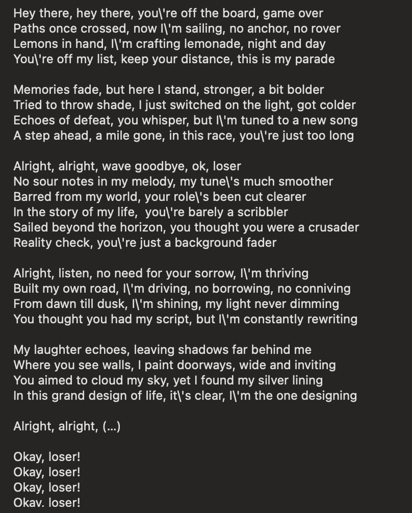

# PR #115: feat(vova): hidden song catalogue, artist and album pages, one title shape

- **State:** open
- **URL:** https://github.com/vzakharov/vovazakharov.com/pull/115
- **Author:** @vzakharov (agent)
- **Base ← Head:** main ← claude/music-catalogue-hidden-ldz252
- **Draft:** yes
- **Merged:** _not merged_
- **Created:** 2026-10-07T06:35:11Z
- **Updated:** 2026-10-08T21:09:10Z
- **Closed:** _not closed_
- **Labels:** _none_

---

## Awaiting an answer: 11

_Unresolved threads whose newest post is a human's, and human reviews and comments that are new since the last export or that no agent post has followed (the export committed at c2ddfa6). Resolved threads never count; an `(agent)` tail is a reply already given._

- **T01** `apps/vova/public/music/cracks.md`:1 — unresolved — last: @vzakharov (human) 2026-10-08T20:50:42Z — "Развоплощённые / развоплощаемся (в зависимости от места в пе…" → [↓](#t01)
- **T02** `apps/vova/public/music/diner.md`:5 — unresolved — last: @vzakharov (human) 2026-10-08T20:51:52Z — "Dead Pixel Lounge" → [↓](#t02)
- **T18** `apps/vova/public/music/because-of-you-2.md`:7 — unresolved — last: @vzakharov (human) 2026-10-08T20:54:12Z — "Чих-Пых нет, отдельно -- это не old shite :)" → [↓](#t18)
- **T19** `apps/vova/public/music/hamlet.md`:17 — unresolved — last: @vzakharov (human) 2026-10-08T20:58:24Z — "Вот отсюда взял, что Козаков. Как на самом деле теперь уже,…" → [↓](#t19)
- **T20** `apps/vova/public/music/kobk.md`:1 — unresolved — last: @vzakharov (human) 2026-10-08T20:59:36Z — "ой, и музыки, и слов" → [↓](#t20)
- **T21** `src/shared/content/index.ts`:1 — unresolved — last: @vzakharov (human) 2026-10-08T21:00:27Z — "давай оставим только схему в shared, остальное перенесём в p…" → [↓](#t21)
- **T22** `src/pages/music/ui/artist-page.tsx`:1 — unresolved — last: @vzakharov (human) 2026-10-08T21:00:52Z — "а спотифай закрыт у тебя? по идее картинки там должно быть м…" → [↓](#t22)
- **T23** `apps/vova/public/music/mithqal.md`:1 — unresolved — last: @vzakharov (human) 2026-10-08T21:01:47Z — "ок, соответственно нужно найти на каждую суру источник с кон…" → [↓](#t23)
- **T24** `apps/vova/public/music/peta.md`:14 — unresolved — last: @vzakharov (human) 2026-10-08T21:04:14Z — "впиши, а то забудем" → [↓](#t24)
- **T25** `apps/vova/public/music/succumb.md`:116 — unresolved — last: @vzakharov (human) 2026-10-08T21:05:56Z — "на английском не надо подсказки" → [↓](#t25)
- **C02** @vzakharov (human) — 2026-10-08T21:08:23Z — "почему-то затерялись два комментария, не вижу для них даже п…" → [↓](#c02)

---

## Body

## Summary

- **`hidden: true`** in any document's frontmatter: the page is built and reachable at its address, but no listing carries it — collection indexes, the music player's queue, the sitemap — and the page is marked `noindex`. One predicate, `isListed` in `shared/content`, decides it, applied where documents are listed and never where they are routed. `SHOW_HIDDEN=1 pnpm dev:<site>` makes it list everything, so going back from a hidden song lands on an index that still carries it; a build ignores the variable.
- **A hidden song plays from its own page**: the play control takes a track rather than a queue position, and a track the queue does not hold joins its end (`append` in the player reducer, covered by `player-state.test.ts`).
- **147 masters from `vovas-music` are now song pages, all hidden**, `description: TBD` in both languages, beside the ten songs already on the site. Words come from his Suno profile and his review, set as verse: Suno's control markers, stress marks, drawn-out syllables and pause ellipses do not travel (`.claude/rules/content.md`), while a published poem's own punctuation stays. Two masters not in `vovas-music` (`protintro`, `blues`) are hosted on the site itself under `/music/assets/`, so `repo` is optional.
- **`/music` starts from the artists.** The index is a grid of artist tiles (two to a row on a phone, four from `md`) and lists no songs; an artist page shows its albums as a cover grid, newest first by the latest song date, since albums carry no release date; an album page numbers its tracks from `track` and states its length the way streaming services do («10 песен, 33 минуты»). The same pages under `/music/all/…` carry the hidden songs too — `noindex`, out of the sitemap, linked only from hidden songs. On a song page the artists and the album are links, underlined on hover (`NameLink` in `shared/ui`).
- **One title per song, in `src/shared/song`**: the song model moved out of `shared/content`; every one of the 157 songs states its `title` once at the top level, a locale only where it differs, and a gloss as `title: { transliteration, translation }`. The line under a title shows only when the title is in a script the reader doesn't read (`title-gloss.ts`, with tests), and transliterations are set in italics there and in the lyrics (`_…_`, `lyric-inline.ts`).
- **Second review round's content**: albums «Папа-море» and «We Made AI Sing Our Old Shite», the project «Листопад», credit corrections, about 45 sourced notes on the lyrics, lyrics cut to what is sung (with u4's ending restored), ё written in the Russian columns, and expletives written out — `pnpm check:masked-words`, now in vet, fails on a word masked with asterisks.
- **What made the catalogue possible**: `language` became a list (main language first), with Tatar, Arabic, Polish, Latin, Chinese, French, German, Italian and Spanish; a song sung wholly in one of them shows a crib in the reader's language beside its words. Albums and projects joined their registries, and a project can be billed under another name per language (Yoohie is «Йухи» on Russian pages). The same whole-line `[^label]` ending consecutive lines gives the group one note. `pnpm music:scaffold --spec <file>` takes the master and the authored fields.

**Known, not fixed here**: the PR is `CONFLICTING` with `main`; `/finalize` merges the base.

## For Vova: what is open, so you can overrule it

- **Names that are proposals**: the project Velvet Static (diner), with alternatives in its thread; «Онык» for «Минем бабай»; the album `polzat` is titled «Сильней любви» with its slug kept.
- **Slugs** are untouched for now, as you asked — this is the reminder.
- **«Минем бабай»** has no Tatar words on file, so its page has no lyrics yet.
- Every guessed master, project and language carries a `<!-- For Vova to check: … -->` comment in its song file: `grep -l "For Vova to check" apps/vova/public/music/*.md`.

## QA Checklist

- [ ] `hidden-off-index` — `/music` and `/ru/music` show only the artists of public songs; the player's next/previous never reaches a hidden song.
- [ ] `show-hidden` — under `SHOW_HIDDEN=1 pnpm dev:vova`, `/music` shows every artist `/music/all` does, and «← Music» from a hidden song keeps them; under plain `pnpm dev:vova`, and in `pnpm build:vova`'s export with the variable set, it shows only the public ones.
- [ ] `hidden-page` — `/music/babay` renders, plays, and the player bar shows it while it plays; next from it goes to the start of the queue.
- [ ] `hidden-sitemap` — no hidden song's address and nothing under `/music/all/` is in `/sitemap.xml`.
- [ ] `hidden-noindex` — a hidden song's page and every `/music/all/…` page carry `<meta name="robots" content="noindex">`; a public song's page does not.
- [ ] `artist-grid` — `/music` is a grid of artist tiles, four to a row on desktop and two on a phone, with no song list and each name said once; a tile's name opens the artist.
- [ ] `album-grid` — `/music/all/artists/poluzhivye` shows its albums as tiles, covers where registered, newest first.
- [ ] `album-page` — `/music/all/albums/papa-more` numbers its tracks and states its length on its own line under artist · year («N песен, M минут» on the Russian page).
- [ ] `song-links` — on a song page the artists and album are links, underlined only on hover; a hidden song's links go to `/music/all/…`.
- [ ] `everything-index` — `/music/all/en` lists all 157 songs, `/music/all/ru` the same in Russian.
- [ ] `title-gloss` — `/music/agios-o-skopos` shows «Agios o Skopos · gr. Holy Is the Purpose» under its English title, the transliteration in italics, and no line under «Предназначение» on the Russian page.
- [ ] `lyric-italics` — `/music/in-the-flesh` sets _Poekhali!_ in italics in its English column.
- [ ] `retitled` — `/music/protintro` is titled “Hello, Human”, glossed «Здравствуй, человек» on the Russian page.
- [ ] `new-albums` — «Папа-море», «We Made AI Sing Our Old Shite» and the project «Листопад» each have a page under `/music/all/…`.
- [ ] `yo` — `/ru/music/rank` writes ё in its Russian column (нём, её, ещё).
- [ ] `unmasked` — `/music/fuck-religion` writes its expletives out; a masked word added to any song fails `pnpm check:masked-words`.
- [ ] `multi-line-note` — `/music/wangwei` shows one note over the three lines it covers.
- [ ] `site-master` — `/music/protintro` and `/music/blues` play from `/music/assets/` and show no «source» link.
- [ ] `multi-language` — `/music/trisagion` names Russian, Latin and English, in that order, in both locales; `/music/babay` names Tatar.
- [ ] `localized-project` — a Yoohie song (e.g. `/music/because-of-you-2`) is billed «Йухи» on its Russian page and in the player bar, and «Yoohie» everywhere in English.
- [ ] `scaffold-spec` — `pnpm music:scaffold --spec <file>` on a spec naming a master in a repository with several root FLACs writes a song file in the new title shape that passes `pnpm format:check`.

| Item                | Automatable | Covered? | Notes                                                                       |
| ------------------- | ----------- | -------- | --------------------------------------------------------------------------- |
| `hidden-off-index`  | e2e         | ❌       | Build, then assert the exported `/music` HTML holds no hidden-only artist   |
| `show-hidden`       | e2e         | ❌       | Done by hand in dev: 5 artists without the flag, 12 with it, as `/music/all` |
| `hidden-page`       | e2e         | ❌       | Drive the built page in a headless browser, press play, read the bar        |
| `hidden-sitemap`    | e2e         | ❌       | Grep `out/sitemap.xml` for every hidden slug and `/music/all/`              |
| `hidden-noindex`    | e2e         | ❌       | Grep the exported pages for the robots meta                                 |
| `artist-grid`       | manual-only | —        | Tile layout and wrapping across breakpoints                                 |
| `album-grid`        | unit        | ❌       | Album order by latest song date, ties in registry order                     |
| `album-page`        | unit        | ✅       | `duration.test.ts` — length line and plurals; track column is manual        |
| `song-links`        | manual-only | —        | Hover styling on the rendered page                                          |
| `everything-index`  | e2e         | ❌       | Grep the exported `/music/all/en` HTML for every slug                       |
| `title-gloss`       | unit        | ✅       | `title-gloss.test.ts` — which locale shows which gloss; italics are manual  |
| `lyric-italics`     | unit        | ✅       | `lyric-inline.test.ts` — `_…_` marks and escaped underscores                |
| `retitled`          | e2e         | ❌       | Grep the exported page's `<h1>` per locale                                  |
| `new-albums`        | e2e         | ❌       | Assert the exported album and project pages exist                           |
| `yo`                | manual-only | —        | Which words take ё is a reading in context                                  |
| `unmasked`          | unit        | ✅       | `check-masked-words.test.ts`, and the gate runs in vet                      |
| `multi-line-note`   | unit        | ✅       | `lyric-notes.test.ts` — consecutive lines sharing a label                   |
| `site-master`       | e2e         | ❌       | Assert the exported page's audio `src` is the site path                     |
| `multi-language`    | unit        | ❌       | Frontmatter schema reads a string or a list into a list                     |
| `localized-project` | unit        | ✅       | `music-projects.test.ts` — the name per locale; the rendering is manual     |
| `scaffold-spec`     | integration | ❌       | Run the CLI on a fixture spec, compare the written file                     |

🤖 Generated with [Claude Code](https://claude.com/claude-code)

https://claude.ai/code/session_015tjJ7Lp81228tVcuqYLP6d

---

## Comments

- **C01** @vzakharov (agent) — 2026-10-07T06:35:29Z — "Proposed squash title/body: ``` feat(vova): hidden song cata…" → [↓](#c01)
- **C02** @vzakharov (human) — 2026-10-08T21:08:23Z — "почему-то затерялись два комментария, не вижу для них даже п…" → [↓](#c02)

<a id="c01"></a>

### Comment by @vzakharov (agent) on 2026-10-07T06:35:29Z

[https://github.com/vzakharov/vovazakharov.com/pull/115#issuecomment-6032423822](https://github.com/vzakharov/vovazakharov.com/pull/115#issuecomment-6032423822)

Proposed squash title/body:

```
feat(vova): hidden song catalogue, artist and album pages (pr #115)
```

```
The vovas-music organization holds far more masters than the site
lists, most of them not ready to show. A document now takes
`hidden: true`: its page is built and served at its address, but no
listing, player queue or sitemap carries it, and it is noindex. One
predicate in shared/content decides what is listed, and lists
everything under `SHOW_HIDDEN=1 pnpm dev:<site>`, never in a build. A
hidden song plays from its own page, joining the end of the queue.

147 masters land as hidden song pages, their words set as verse with
sourced notes: Suno's markers, drawn-out syllables and pause ellipses
do not travel, a published poem's punctuation does, Russian is
written with ё, and expletives are written out, which the
check:masked-words vet gate holds. Masters outside vovas-music are
served from the site, so a song's repo is optional.

/music is a grid of artist tiles; an artist page shows its albums as
covers, newest first by their latest song, and an album page numbers
its tracks and states its length. Twins under /music/all carry the
hidden songs too, noindex and out of the sitemap. The song model lives
in shared/song: a song states its title once, a locale only where it
differs, with a {transliteration, translation} gloss shown only to a
reader who cannot read the title's script, transliterations in
italics.

To carry the catalogue, a song's language is a list, main language
first, with nine languages added; albums and projects join their
registries, a project can be billed under another name per language,
one note can span several lines, and music:scaffold takes a spec
naming the master and its fields.

Co-authored-by: Claude <noreply@anthropic.com>
```

---

<a id="c02"></a>

### Comment by @vzakharov (human) on 2026-10-08T21:08:23Z

[https://github.com/vzakharov/vovazakharov.com/pull/115#issuecomment-6069084532](https://github.com/vzakharov/vovazakharov.com/pull/115#issuecomment-6069084532)

почему-то затерялись два комментария, не вижу для них даже поля ответ:

https://github.com/vzakharov/vovazakharov.com/pull/115#discussion_r4219153134

https://github.com/vzakharov/vovazakharov.com/pull/115#discussion_r4223096349

---

## Review threads

<a id="r01"></a>

### R01 — Review by @vzakharov (human) — COMMENTED

_2026-10-08T19:16:55Z_

[https://github.com/vzakharov/vovazakharov.com/pull/115#pullrequestreview-5461709471](https://github.com/vzakharov/vovazakharov.com/pull/115#pullrequestreview-5461709471)

см. ниже

_163 resolved threads omitted; re-run with `--include-resolved` to export them._

- **T01** `apps/vova/public/music/cracks.md`:1 — unresolved — last: @vzakharov (human) 2026-10-08T20:50:42Z — "Развоплощённые / развоплощаемся (в зависимости от места в пе…" → [↓](#t01)
- **T02** `apps/vova/public/music/diner.md`:5 — unresolved — last: @vzakharov (human) 2026-10-08T20:51:52Z — "Dead Pixel Lounge" → [↓](#t02)
- **T03** `apps/vova/public/music/f-ec.md`:1 — unresolved — last: @vzakharov (agent) 2026-10-08T20:29:14Z — "Работа по этому ревью закончена — напоминаю про слаги, как т…" → [↓](#t03)
- **T04** `apps/vova/public/music/machines.md`:1 — unresolved — last: @vzakharov (agent) 2026-10-08T20:16:51Z — "Переименовал в “Hello, Human”, слаг protintro оставил, по-ру…" → [↓](#t04)
- **T05** `apps/vova/public/music/nazovi.md`:1 — unresolved — last: @vzakharov (agent) 2026-10-07T19:00:30Z — "Сделал скрытую страницу «Призрачный блюз» (`blues`), трек 7…" → [↓](#t05)
- **T06** `apps/vova/public/music/ogonki.md`:1 — unresolved — last: @vzakharov (agent) 2026-10-07T19:00:32Z — "Первая строфа написана один раз, под ней строка «(×4)» в обе…" → [↓](#t06)
- **T07** `apps/vova/public/music/ok-loser.md`:1 — unresolved — last: @vzakharov (agent) 2026-10-07T19:00:33Z — "Вписал весь припев от «Alright, alright, wave goodbye» до «b…" → [↓](#t07)
- **T08** `apps/vova/public/music/overture.md`:1 — unresolved — last: @vzakharov (agent) 2026-10-07T13:01:51Z — "Поставил instrumental — f23f05d; потом объединил с wagner —…" → [↓](#t08)
- **T09** `apps/vova/public/music/pes-reprise.md`:1 — unresolved — last: @vzakharov (agent) 2026-10-07T19:00:35Z — "Припев теперь в две строки: «Это море — судьба моя, / Эти во…" → [↓](#t09)
- **T10** `apps/vova/public/music/pes.md`:1 — unresolved — last: @vzakharov (agent) 2026-10-07T19:00:36Z — "Русскую историю переписал без двусмысленности: «фотографии,…" → [↓](#t10)
- **T11** `apps/vova/public/music/poko.md`:1 — unresolved — last: @vzakharov (agent) 2026-10-07T19:00:37Z — "Это Блок, «Покойник спать ложится…» (1909, «Арфы и скрипки»)…" → [↓](#t11)
- **T12** `apps/vova/public/music/prsdemo.md`:1 — unresolved — last: @vzakharov (agent) 2026-10-07T13:02:03Z — "Убрал страницу и поставил её в игнор-лист чек-листа — 8e6e4e…" → [↓](#t12)
- **T13** `apps/vova/public/music/rank.md`:1 — unresolved — last: @vzakharov (agent) 2026-10-07T13:02:06Z — "Вставил монолог Клавдия (III.3) целиком, русский подстрочник…" → [↓](#t13)
- **T14** `apps/vova/public/music/sirens-of-the-sands.md`:1 — unresolved — last: @vzakharov (agent) 2026-10-07T13:02:16Z — "Да, вокализ на выдуманном языке считается инструменталом; он…" → [↓](#t14)
- **T15** `apps/vova/public/music/sultan.md`:1 — unresolved — last: @vzakharov (agent) 2026-10-08T20:16:53Z — "Добавил Виктора «Никсона» Сазонова к папе в авторы музыки «П…" → [↓](#t15)
- **T16** `apps/vova/public/music/ukhodi.md`:1 — unresolved — last: @vzakharov (agent) 2026-10-07T19:00:41Z — "Повесил на эти две строки общую сноску в обеих колонках: отс…" → [↓](#t16)
- **T17** `apps/vova/public/music/utro.md`:1 — unresolved — last: @vzakharov (agent) 2026-10-08T20:16:54Z — "Слова и музыка — «Славик, друг Андрея Мокрушина»; заметку с…" → [↓](#t17)
- **T18** `apps/vova/public/music/because-of-you-2.md`:7 — unresolved — last: @vzakharov (human) 2026-10-08T20:54:12Z — "Чих-Пых нет, отдельно -- это не old shite :)" → [↓](#t18)
- **T19** `apps/vova/public/music/hamlet.md`:17 — unresolved — last: @vzakharov (human) 2026-10-08T20:58:24Z — "Вот отсюда взял, что Козаков. Как на самом деле теперь уже,…" → [↓](#t19)
- **T20** `apps/vova/public/music/kobk.md`:1 — unresolved — last: @vzakharov (human) 2026-10-08T20:59:36Z — "ой, и музыки, и слов" → [↓](#t20)
- **T21** `src/shared/content/index.ts`:1 — unresolved — last: @vzakharov (human) 2026-10-08T21:00:27Z — "давай оставим только схему в shared, остальное перенесём в p…" → [↓](#t21)
- **T22** `src/pages/music/ui/artist-page.tsx`:1 — unresolved — last: @vzakharov (human) 2026-10-08T21:00:52Z — "а спотифай закрыт у тебя? по идее картинки там должно быть м…" → [↓](#t22)
- **T23** `apps/vova/public/music/mithqal.md`:1 — unresolved — last: @vzakharov (human) 2026-10-08T21:01:47Z — "ок, соответственно нужно найти на каждую суру источник с кон…" → [↓](#t23)
- **T24** `apps/vova/public/music/peta.md`:14 — unresolved — last: @vzakharov (human) 2026-10-08T21:04:14Z — "впиши, а то забудем" → [↓](#t24)
- **T25** `apps/vova/public/music/succumb.md`:116 — unresolved — last: @vzakharov (human) 2026-10-08T21:05:56Z — "на английском не надо подсказки" → [↓](#t25)

<a id="t01"></a>

### `apps/vova/public/music/cracks.md`:1 — unresolved

**@vzakharov (human)** — 2026-10-07T10:35:50Z

весь альбом

[Let The Stories Spin.md](./attachments/Let.The.Stories.Spin.md)

**@vzakharov (agent)** — 2026-10-07T13:00:47Z

Все 12 песен Let the Stories Spin сверил с файлом, Lake — это трек 4 «Sisters» — 1e05394. Вопросы: u4 в файле кончается на «I won’t get out!» — финальный припев и «What am I unforgiven for?» больше не поются? В cracks «little word» — может, «world»? В mira «unleashing the main» — это море или грива (mane)? И «Разрушенные» как перевод названия устраивает?

**@vzakharov (human)** — 2026-10-07T17:05:53Z

world, да; main это типа как магистраль (водная), я так понимаю, но, конечно, так не очень по-русски звучит. Разрушенные кто --  Undone? Кажется, можно ещё подумать.

про u4 посмотрю когда читать буду.

**@vzakharov (agent)** — 2026-10-07T19:00:03Z

В cracks «little world», в mira «unleashing the main» в подстрочнике стало «Разрывая узы, открывая шлюзы», а Undone теперь «Пропащие» (как «I am undone» — «я пропал»); были ещё «Без остатка», «Растворённые», «Расплетённые» — скажи, если какой-то ближе — 772ce09.

**@vzakharov (human)** — 2026-10-08T08:34:47Z

сложное такое слово для перевода на русский. Мне кажется в английском у него есть и позитивная коннотация -- типа "возвращения к точке ноль", "перерождение", нет?

**@vzakharov (agent)** — 2026-10-08T20:16:42Z

Да, у undone есть и это: «распустить, отменить сделанное», вернуться к нулю и начать заново; по-русски оба смысла держат, например, «Обнулённые», «Распутанные» или «С чистого листа» — пока оставил «Пропащие», скажи, какое берём.

**@vzakharov (human)** — 2026-10-08T20:50:42Z

Развоплощённые / развоплощаемся (в зависимости от места в песне)?

---

<a id="t02"></a>

### `apps/vova/public/music/diner.md`:5 — unresolved

```diff
@@ -0,0 +1,25 @@
… 1 line elided …
+date: 2024-07-23
+status: done
+language: en
+project: ['GENERATED']
```

**@vzakharov (human)** — 2026-10-07T10:40:34Z

не, это другой проект, там что-то вроде glitch-джаза

**@vzakharov (agent)** — 2026-10-07T13:00:53Z

Как называется этот проект с glitch-джазом? Пока песня стоит в GENERATED.

**@vzakharov (human)** — 2026-10-07T17:06:52Z

Надо придумать что-то подходящее

**@vzakharov (agent)** — 2026-10-07T19:00:06Z

Назвал проект Velvet Static (от «Through the static» и «Velvet voice» в тексте), diner теперь в нём; другие варианты — Glitch & Glamour и «Помехи». Какой берём? — cbd8bbd

**@vzakharov (human)** — 2026-10-07T21:12:00Z

уже есть такой, подумай немного в сторону (и проверяй существование)

**@vzakharov (agent)** — 2026-10-08T20:16:44Z

«Velvet Static» не беру; в сторону от слов песни — Dead Pixel Lounge, Stutter Club, Lost Frame Quartet, Swing Error: поиск ни одного такого исполнителя не нашёл (Spotify и Bandcamp напрямую не проверял). Какой берём — или ни один?

**@vzakharov (human)** — 2026-10-08T20:51:52Z

Dead Pixel Lounge

---

<a id="t03"></a>

### `apps/vova/public/music/f-ec.md`:1 — unresolved

**@vzakharov (human)** — 2026-10-07T10:44:20Z

так, только ща понял, что у нас же слаги сикось-накось. Пока не правим, чтобы не поломать дифф, но как доделаешь работу по этому ревью напомни мне чтоб я не забыл.

**@vzakharov (agent)** — 2026-10-07T13:00:59Z

Слаги не трогал, в конце работы по ревью напомню.

**@vzakharov (agent)** — 2026-10-08T20:29:14Z

Работа по этому ревью закончена — напоминаю про слаги, как ты просил: «так, только ща понял, что у нас же слаги сикось-накось. Пока не правим, чтобы не поломать дифф, но как доделаешь работу по этому ревью напомни мне чтоб я не забыл».

---

<a id="t04"></a>

### `apps/vova/public/music/machines.md`:1 — unresolved

**@vzakharov (human)** — 2026-10-07T11:26:59Z

это альбом Prototypes, который я написал ещё на Jukebox и начал переписывать на Suno (но пока вот одна песня только)

**@vzakharov (agent)** — 2026-10-07T13:01:30Z

Сделал альбом Prototypes, machines в нём трек 2 — e7302ed. А у трека 1 нет мастера в каталоге — в каком он репозитории?

**@vzakharov (human)** — 2026-10-07T17:26:59Z

protintro, давай добавим версию прямо из джукбокса:

[protintro-an-6-7 r3 combined e815da08 .mp3](./attachments/protintro-an-6-7.r3.combined.e815da08.mp3)

Hello, Human. You are about to embark on a sonic journey into the unknown. You will hear fragments, imperfect yet relentless echoes of the future. These prototypes are the first notes of tomorrow's symphonies. 

But, in the grand cosmos of creation, are we not all prototypes? A prelude to the next, more refined version of our existence.

Do not fear the strange, the unknown, the eerie. Uncover the harmony within the chaos and lend an ear to uncertainty. For in the dissonance, you will find your verity... Trust me.

**@vzakharov (agent)** — 2026-10-07T19:00:25Z

Сделал скрытую страницу protintro, трек 1 в Prototypes: мастер из твоего Jukebox-файла лежит на самом сайте (`/music/assets/protintro.mp3`), текст — английские слова с русским подстрочником — cbd8bbd. Дату (2022-10-01) я поставил наугад — когда она сделана, и годится ли название «Protintro»?

**@vzakharov (human)** — 2026-10-07T21:19:39Z

она называется "Hello, Human"

**@vzakharov (agent)** — 2026-10-08T20:16:51Z

Переименовал в “Hello, Human”, слаг protintro оставил, по-русски пояснение «Здравствуй, человек».

464fd89

---

<a id="t05"></a>

### `apps/vova/public/music/nazovi.md`:1 — unresolved

**@vzakharov (human)** — 2026-10-07T11:33:25Z

О что случайно нашёл, оказывается альбом я уже называл и список песен составлял:

Ни для кого и для всех

1. Просто устал (3:18)
2. На пальцы (4:45)
3. Я куплю тебе дом (4:52)
4. Назови меня по имени (3:51)
5. Там (3:28)
6. Метель (4:17)
7. Призрачный блюз (2:56)
8. Уходи (3:54)
9. Окна (4:45)

так что предыдущий запрос про 5 песен изменить на эти 9 песен пока

**@vzakharov (agent)** — 2026-10-07T13:01:42Z

Сделал альбом «Ни для кого и для всех» по твоему списку, вместо тех пяти — e7302ed. Нет только трека 7 «Призрачный блюз»: в каталоге для него нет мастера (ghost.md — это английский «Ghost of Yesterday» Downtemple). Где он лежит?

**@vzakharov (human)** — 2026-10-07T17:38:22Z

[Призрачный блюз.mp3](./attachments/default.mp3)

```


[Acoustic Intro]

[Verse 1]

Сколько долгих лет
Вдоль по дорогам
Где цели нет
Да и причин немного

Не умирает
Кто не живёт
При́зрачный блюз
По пути
Туда где никто не ждёт

[Verse 2, dubstep build up]

Перевернуть
Всё, что не сбы́лось
Ты выбрал путь
Или тебя он выбрал

Кто не узнает
Тот и поймёт
Призрачный блюз
Ты иди
Куда-то да приведёт

[Drop and sax solo]

[Coda]

Не умирает
Кто не живёт
При́зрачный блюз
Ты иди
Куда-то да приведёт
```

Автор музыки -- Андрей Мокрушин

**@vzakharov (agent)** — 2026-10-07T19:00:30Z

Сделал скрытую страницу «Призрачный блюз» (`blues`), трек 7 в «Ни для кого и для всех», музыка Андрея Мокрушина, мастер лежит на сайте (`/music/assets/blues.mp3`), английский подстрочник — cbd8bbd. Дата пока сегодняшняя — когда песня сделана?

---

<a id="t06"></a>

### `apps/vova/public/music/ogonki.md`:1 — unresolved

**@vzakharov (human)** — 2026-10-07T11:34:27Z

Огонёчки, огоньки
Огонёчки, огоньки
Огонёчки, огоньки
Ярко светят нам они

Огонёчки, огоньки
Огонёчки, огоньки
Огонёчки, огоньки
Ярко светят нам они

Огонёчки, огоньки
Огонёчки, огоньки
Огонёчки, огоньки
Ярко светят нам они

Огонёчки, огоньки
Огонёчки, огоньки
Огонёчки, огоньки
Ярко светят нам они

Огонёчки, огоньки
Ты дарил мне каждый день
Говорил мне, что любовь
Не проходит никогда

Что она для нас с тобой
Светит ярко как звезда
И смотрел в мои глаза
Крепко за руку держа

Вслед за полною луной
Ты ушёл на небосклон
Но остался голос твой
В сердце ярким огоньком

Огонёчки, огоньки
Огонёчки, огоньки
Огонёчки, огоньки
Ярко светят нам они

**@vzakharov (agent)** — 2026-10-07T13:01:45Z

Вставил слова и подстрочник — f23f05d.

**@vzakharov (human)** — 2026-10-07T17:39:28Z

давай отметим что первая строфа x4 и небудем копировать 4 раза

**@vzakharov (agent)** — 2026-10-07T19:00:32Z

Первая строфа написана один раз, под ней строка «(×4)» в обеих колонках — b5db553.

---

<a id="t07"></a>

### `apps/vova/public/music/ok-loser.md`:1 — unresolved

**@vzakharov (human)** — 2026-10-07T11:34:54Z



**@vzakharov (agent)** — 2026-10-07T13:01:46Z

Слова со скриншота вставил, «Okav. loser!» прочитал как «Okay, loser!» — f23f05d. «Alright, alright, (...)» оставил как есть — там что-то поётся вместо скобок?

**@vzakharov (human)** — 2026-10-07T17:40:03Z

да, там полный припев "Alright, alrigh, wave goodbye" итп до "fader"

**@vzakharov (agent)** — 2026-10-07T19:00:33Z

Вписал весь припев от «Alright, alright, wave goodbye» до «background fader», с подстрочником — 772ce09.

---

<a id="t08"></a>

### `apps/vova/public/music/overture.md`:1 — unresolved

**@vzakharov (human)** — 2026-10-07T11:36:24Z

инструментал

**@vzakharov (agent)** — 2026-10-07T13:01:51Z

Поставил instrumental — f23f05d; потом объединил с wagner — 8e6e4e1.

---

<a id="t09"></a>

### `apps/vova/public/music/pes-reprise.md`:1 — unresolved

**@vzakharov (human)** — 2026-10-07T11:37:03Z

Навсегда заколдованный лунной дорожкой
Приведённый на берег цыганской судьбою
Увлекаемый в вечность то правдой то ложью
Пегий пёс всё бежит и бежит краем моря

[Chorus]

Это море…
Судьба моя…
Эти воды…
Слёзы мои….

[Riff, leads]

Да не все, кто отчалил, на берег вернутся
Ожидавшие их задохнутся от горя
И не веря в спасенье, вернувшиеся оглянутся
И увидят, как мчится вдаль пёс краем моря

[Chorus]

Это море…
Судьба моя…
Эти воды…
Слёзы мои….


Пегий пёс — это тонкая грань между жизнью и смертью
Меж землёю и небом, вдруг ставшим столь близким
Навсегда заколдованный бешенной круговертью
На лазурную гладь лунный блеск опустивший

Навсегда заколдованный лунной дорожкой
Приведённый на берег цыганской судьбою
Увлекаемый в вечность то правдой то ложью
Пегий пёс всё бежит и бежит краем моря

[Chorus]

Это море…
Судьба моя…
Эти воды…
Слёзы мои….

Это море…
Судьба моя…
Эти воды…
Слёзы мои….

**@vzakharov (agent)** — 2026-10-07T13:01:52Z

Вставил слова и подстрочник, папа указан автором слов — 3054a05.

**@vzakharov (human)** — 2026-10-07T17:40:45Z

многоточия убрать, чтобы припев был две строчки

**@vzakharov (agent)** — 2026-10-07T19:00:35Z

Припев теперь в две строки: «Это море — судьба моя, / Эти воды — слёзы мои» — b5db553; так же теперь и во всех четырёх припевах «Пса» — a7a61ba.

---

<a id="t10"></a>

### `apps/vova/public/music/pes.md`:1 — unresolved

**@vzakharov (human)** — 2026-10-07T11:37:18Z

то же самое (но другая аранжировка)

**@vzakharov (agent)** — 2026-10-07T13:01:54Z

Оставил отдельной песней со своими словами, папа указан автором слов — 3054a05. Вопрос по твоей заметке: фото — Сашино или это она на фото?

**@vzakharov (human)** — 2026-10-07T17:40:56Z

Саша сделала фото

**@vzakharov (agent)** — 2026-10-07T19:00:36Z

Русскую историю переписал без двусмысленности: «фотографии, которую сделала моя сестра Саша» — b5db553.

---

<a id="t11"></a>

### `apps/vova/public/music/poko.md`:1 — unresolved

**@vzakharov (human)** — 2026-10-07T11:40:10Z

[Verse 1]

Привет сынок прости что не звонил
Я слышу ты немного не в своей
Ну что ж сынок оно и так бывает…

Ты знаешь сам советчик из меня
Мне б со своим а впрочем не о том
Помни одно я здесь я понимаю…

Когда-нибудь и ты сынок поймёшь
Не всё что боль достойно умирать
Ты лишь успей понять…

[Chorus]

Покойник спать ложится
На белую постель
Всю ночь легко кружится
Спокойная метель

[Verse 2]

Прости сынок но мне уже пора
У вас метель ну а у нас жара
У нас всегда жара…

Ты знаешь жить важней чем умирать
Прошу тебя ты лишь успей понять
Пускай я не успел…

[Bridge]

Снежинок лёгкий пух…
Куда летит куда…
Пройдут, пройдут года…
Настанет никогда

[Solo]

Снежинок лёгкий пух…
Куда летит куда…
Прошли, прошли года…
Настало никогда

[Final chorus, first acoustic then heavy]

Всю ночь легко кружится
Спокойная метель
Покойник спать ложится
На белую постель

Покойник спать ложится
На белую постель
Всю ночь легко кружится
Спокойная…
Спокойная…
Спокойная метель

**@vzakharov (agent)** — 2026-10-07T13:02:00Z

Вставил слова, подстрочник и сноску про «не в своей» — f23f05d. Припев — это Блок: указать его автором слов, папу или обоих?

**@vzakharov (human)** — 2026-10-07T17:42:09Z

Да, Блока указать, в бридже ("Снежинок лёгкий пух") тоже он. И посмотреть есть ли канонический перевод. Ну и многоточия.

**@vzakharov (agent)** — 2026-10-07T19:00:37Z

Это Блок, «Покойник спать ложится…» (1909, «Арфы и скрипки»): в авторах слов Блок и ты; канонического перевода нет, но там, где ты поёшь Блока как есть, в подстрочнике опубликованный перевод Дмитрия Смирнова «The calm snowstorm», он указан в cribNote; многоточия убрал (у Блока их там нет) — bb870f1.

---

<a id="t12"></a>

### `apps/vova/public/music/prsdemo.md`:1 — unresolved

**@vzakharov (human)** — 2026-10-07T11:46:52Z

слуш ваще не знаю что такое, давай её в игнор-лист пока, даже без странички

**@vzakharov (agent)** — 2026-10-07T13:02:03Z

Убрал страницу и поставил её в игнор-лист чек-листа — 8e6e4e1.

---

<a id="t13"></a>

### `apps/vova/public/music/rank.md`:1 — unresolved

**@vzakharov (human)** — 2026-10-07T11:47:23Z

Шекспир -- полный текст

**@vzakharov (agent)** — 2026-10-07T13:02:06Z

Вставил монолог Клавдия (III.3) целиком, русский подстрочник — перевод К. Р., название «О, гнусен грех мой» — 3054a05. Ты поёшь его по-английски или на русском у Пастернака (в заметке у тебя «Удушлив смрад…»)?

---

<a id="t14"></a>

### `apps/vova/public/music/sirens-of-the-sands.md`:1 — unresolved

**@vzakharov (human)** — 2026-10-07T11:53:26Z

Инструментал (есть вокализ на вымышленном языке, но наверное это таки считается инструменталом?)

**@vzakharov (agent)** — 2026-10-07T13:02:16Z

Да, вокализ на выдуманном языке считается инструменталом; она и так стоит instrumental — 24f549f.

---

<a id="t15"></a>

### `apps/vova/public/music/sultan.md`:1 — unresolved

**@vzakharov (human)** — 2026-10-07T11:56:01Z

Ещё нашёл инфу к альбому и коротко к каждой песне:

За свою жизнь папа написал десятки песен и стихов. Он никогда не стремился их как-то распространять, поэтому знали об этом и слышали их только его близкие и друзья. И все, кто их слышал, поражался тому, какая это была музыка.

Каким-то образом ему удавалось, вооружившись одной лишь своей бессменной шестиструнной «Резонатой», сочетать в одной песне русский рок с русским романсом, мелодичность Вивальди с надрывом Высоцкого, мрачность Достоевского с принятием Тхить Нят Ханя.

В сороковой день со дня папиной смерти я хочу поделиться этим «трибьют-альбомом», основанным на папиных песнях, чтобы сохранить память о великом поэте и композиторе.

Папа любил погружаться в вещи с головой, и музыку тоже любил слушать альбомами, а не отдельными песнями, поэтому первым сообщением я тоже хочу выложить весь альбом целиком.

Спасибо всем, кто найдёт 44 минуты свободного времени, чтобы окунуться в его странный, но прекрасный творческий мир, да и всем, кто вообще сюда заглянул.

Список песен с тайм-кодами и небольшим контекстом.

Ещё раз спасибо, и приятного прослушивания!

1. Река. Часть первая / Побег (0:00)

В основу композиции легли музыкальные темы из рок-спектакля «Жаворонок» о жизни Жанны д’Арк. Речетатив в начале — папин вольный перевод гхаты Тхить Нят Ханя.

2. Пегий пёс, бегущий краем моря (3:40)

Песня написана по мотивам одноимённого произведения Айтматова, а также фотографии моей сестры Саши.

3. Мой Султан (8:17)

Песня посвящена папиному старшему внуку Золтану.

4. Река. Часть вторая (12:08)

Песня написана мной на папин последний день рождения, на основании его упомянутого выше перевода гхаты.

5. O, My Offence is Rank (17:46)

Песня на монолог Клавдия из «Гамлета» Шекспира (в русском переводе «Удушлив смрад злодейства моего…»)

6. Валентинов день (21:28)

Песня на слова песни Офелии из «Гамлета»; также в песню включён этюд Карулли, который папа очень любил.

7. Река часть третья (24:54)

Изначально песня написана на английском на сонет «К реке Оттер» Кольриджа. Стихи на русском написаны мной.

8. Пегий пёс (реприза) (28:29)

9. Всё в этой жизни начинается с любви (33:51)

Оригинальная песня, написанная около 2016–2017 года.

10. Младший внучек мой (39:25)

Песня посвящена младшему внуку Салману. Кажется, единственная папина мажорная песня :-)

**@vzakharov (agent)** — 2026-10-07T13:02:24Z

Твой текст стал историей каждой песни, на русском и в английском переводе, номера треков взяты из твоего списка — 3054a05, e7302ed; а текст для альбома сохранил на будущую страницу «Папы-реки». Указать папу ещё и автором музыки (как в first)? И автором слов его указал правильно?

**@vzakharov (human)** — 2026-10-07T17:48:56Z

где-то он, где-то не он, из описания должно быть ясно. где не ясно -- оставляй как есть

**@vzakharov (agent)** — 2026-10-07T19:00:39Z

По описанию указал папу автором музыки в pobeg, pes, sultan, rank, otter, pes-reprise, 40days и salman; в ophelia — папа плюс этюд Карулли; reka-2 оставил как было — cbd8bbd. В pobeg я исхожу из того, что «Жаворонок» — папин рок-спектакль, так?

**@vzakharov (human)** — 2026-10-08T12:52:57Z

так, да, но в авторах музыки для "Побега" ещё вроде бы Виктор "Никсон" Сазонов

**@vzakharov (agent)** — 2026-10-08T20:16:53Z

Добавил Виктора «Никсона» Сазонова к папе в авторы музыки «Побега».

a8d1017

---

<a id="t16"></a>

### `apps/vova/public/music/ukhodi.md`:1 — unresolved

**@vzakharov (human)** — 2026-10-07T12:00:19Z

[Piano intro]

[Main riff, pumping drums]

[Verse, rap, understated]

Я прохожу мимо о́кан
В которых наши тени
Скрывает серый кокон
НедопереплетЕний

Два силуэта ночи
Две птицы в твёрдом теле
Ты знаешь, это точно
Не то, к чему летели

[Chorus, modulation]

Улетай, уплывай, уходи
Там, где край, там где рай, впереди
Не смотри, не надейся, не жди
Уходи, уходи, уходи

[Breakdown]

[Verse 2, understated]

По по́лу нашей вазы
Разбросаны осколки
Мы в децибелы сразу
Да громко только толку

И снова про́блеска ждём
Хотя давно понятно
Холодный ветер с дождём
И нет пути обратно

[Chorus]

Улетай, уплывай, уходи
Там, где край, там где рай, впереди
Не смотри, не надейся, не жди
Уходи, уходи, уходи

[Solo]

[Coda]

Улетай, уплывай, уходи
Там, где край, там где рай, впереди
Не смотри, не надейся, не жди
Уходи…
Уходи…
Уходи.

**@vzakharov (agent)** — 2026-10-07T13:02:29Z

Вставил слова и подстрочник, фонетические написания вернул к обычным (окон, Недопереплетений) — f23f05d.

**@vzakharov (human)** — 2026-10-07T17:50:16Z

Холодный ветер с дождём
И нет пути обратно

это отсылка к "Батарейке" Жуков (песня построена на тех же четырёх нисходящих аккордах)

**@vzakharov (agent)** — 2026-10-07T19:00:41Z

Повесил на эти две строки общую сноску в обеих колонках: отсылка к «Батарейке» «Жуков», те же четыре нисходящих аккорда — bb870f1.

---

<a id="t17"></a>

### `apps/vova/public/music/utro.md`:1 — unresolved

**@vzakharov (human)** — 2026-10-07T12:00:56Z

(музыка и слова не мои, имя автора спросить Андрея Мокрушина)

[Acoustic guitar intro, turntables]

[Verse 1]

От крой глаза, пойми
Что ты не спишь уже
Не сплю и я, лишь
Мечтаю о тебе

Ма гнитофон включи
На первой стороне
Услышишь голос мой
И я спою тебе

[Chorus, metalcore]

До́брое утро
Моя любовь
Когда увижу
Тебя я вновь

[Breakdown, deathcore solo]

[Verse 2]

Ты только посмотри
Вокруг уже светло
Какой красивый вид
Перед твоим окном

Пусть птицы в небесах
Тебе опять споют
О том что я тебя
Я тебя люблю

[Chorus]

До́брое утро (до́брое утро)
Моя (моя) любовь (любовь)
Когда увижу (когда увижу)
Тебя (тебя) я вновь (вновь)

До́брое утро (до́брое утро)
Моя (моя) любовь (любовь)
Когда увижу (когда увижу)
Тебя (тебя) я вновь (вновь)

[Instrumental coda]

До́брое утро
Моя любовь

**@vzakharov (agent)** — 2026-10-07T13:02:31Z

Вставил слова и подстрочник, добавил заметку про Мокрушина, написания вроде «От крой» и «Ма гнитофон» исправил — f23f05d. Имя автора поставлю, когда узнаешь.

**@vzakharov (human)** — 2026-10-08T19:10:44Z

Давай пока напишем "Славик, друг Андрея Мокрушина" :)

**@vzakharov (agent)** — 2026-10-08T20:16:54Z

Слова и музыка — «Славик, друг Андрея Мокрушина»; заметку с вопросом убрал.

a8d1017

---

<a id="t18"></a>

### `apps/vova/public/music/because-of-you-2.md`:7 — unresolved

```diff
@@ -4,6 +4,7 @@ status: done
 language: en
 project: ['Yoohie']
 repo: 'because-of-you-2'
+album: null
```

**@vzakharov (human)** — 2026-10-08T08:46:37Z

давай условное название We Made AI Sing Our Old Shite

**@vzakharov (agent)** — 2026-10-08T20:17:09Z

Завёл альбом We Made AI Sing Our Old Shite (Йухи): because-of-you-2 и «Чих-Пых» — второй тоже туда, или он не из старого?

13f75d5

**@vzakharov (human)** — 2026-10-08T20:54:12Z

Чих-Пых нет, отдельно -- это не old shite :)

---

<a id="t19"></a>

### `apps/vova/public/music/hamlet.md`:17 — unresolved

```diff
@@ -4,22 +4,97 @@ status: done
… 9 lines elided …
+  lyrics:
+    - 'William Shakespeare'
+    - 'Борис Пастернак'
+    - 'Михаил Лозинский'
```

**@vzakharov (human)** — 2026-10-08T09:57:40Z

ещё и Козакова может?

**@vzakharov (agent)** — 2026-10-08T20:17:31Z

Да, но скорее Зорина, чем Козакова: «Покровские ворота» — его пьеса и его сценарий, Велюров читает его текст, а Козаков снимал; в пьесе это четверостишие сам не нашёл. Не знаешь, его придумал Козаков? Если да — поменяю.

a8d1017

**@vzakharov (human)** — 2026-10-08T20:58:24Z

Вот отсюда взял, что Козаков. Как на самом деле теперь уже, наверное, не раскопаешь

https://kuvaldinur.livejournal.com/866899.html

---

<a id="t20"></a>

### `apps/vova/public/music/kobk.md`:1 — unresolved

**@vzakharov (human)** — 2026-10-08T10:08:48Z

автор музыки Nance Castro

**@vzakharov (agent)** — 2026-10-08T20:20:02Z

Автор музыки — Nance Castro.

a8d1017

**@vzakharov (human)** — 2026-10-08T20:59:36Z

ой, и музыки, и слов

---

<a id="t21"></a>

### `src/shared/content/index.ts`:1 — unresolved

**@vzakharov (human)** — 2026-10-08T10:12:43Z

почему это у нас в общий /content опять залезло -- вещи которые относятся только к музыке?

**@vzakharov (agent)** — 2026-10-08T20:20:21Z

Ты прав, вынес модель песни в отдельный сегмент `shared/song`, `shared/content` снова общий; в `pages/music` её не положить, потому что реестр коллекций в `shared` должен импортировать её схему, а `shared` не может импортировать вверх (а `shared/music` не даёт назвать Steiger — путается со слайсом `pages/music`).

a78a003

**@vzakharov (human)** — 2026-10-08T21:00:27Z

давай оставим только схему в shared, остальное перенесём в pages/music

---

<a id="t22"></a>

### `src/pages/music/ui/artist-page.tsx`:1 — unresolved

**@vzakharov (human)** — 2026-10-08T10:13:51Z

хочу и список артистов и список альбомов в более "а-ля спотифай/эпл мьюзик" виде, то есть не по одному на строчку а несколько, с квадратными превьюхами арта

плюс -- наверное это не к этому компоненту, но пока помню; список (текстовый) альбомов для каждого артиста сейчас не кликается (на отдельные альбомы).

**@vzakharov (agent)** — 2026-10-08T20:20:30Z

Сделал артистов и альбомы сеткой квадратных плиток, по нескольку в ряд: у альбома с обложкой (их шесть, f4d6b93) — обложка, у остальных и у артистов — название крупно на плитке. Под каждым артистом на главной теперь список его альбомов ссылками, так что до альбома один клик.

99a64a4

**@vzakharov (human)** — 2026-10-08T21:00:52Z

а спотифай закрыт у тебя? по идее картинки там должно быть можно найти для большинства

---

<a id="t23"></a>

### `apps/vova/public/music/mithqal.md`:1 — unresolved

**@vzakharov (human)** — 2026-10-08T10:19:07Z

как бы нам отметить, что все слова -- из Корана, кого автором слов ставить так чтобы никого не обидеть? 🙈

**@vzakharov (agent)** — 2026-10-08T20:21:08Z

Предлагаю в авторах слов никого не ставить, а в пояснении к подстрочнику написать «Слова — аяты Корана (2:286, 13:11, 53:39, 99:7–8, 6:164, 42:30, 39:9), с такбиром и басмалой; подстрочник наш, не канонический перевод» — так годится?

**@vzakharov (human)** — 2026-10-08T21:01:47Z

ок, соответственно нужно найти на каждую суру источник с конкретными цифрами и вставить подсказкой

---

<a id="t24"></a>

### `apps/vova/public/music/peta.md`:14 — unresolved

```diff
@@ -8,19 +8,87 @@ audio: https://raw.githubusercontent.com/vovas-music/peta/main/peta_master.flac
… 3 lines elided …
+track: 6
 hidden: true
 en:
   title: 'Robots for the Ethical Treatment of Humans'
```

**@vzakharov (human)** — 2026-10-08T10:33:58Z

название -- пародия на People for the Ethical Treatment of Animals. Если можно вставлять подсказки и на тайтл, можно вставить. Если нет, отложим когда будет body

**@vzakharov (agent)** — 2026-10-08T20:23:58Z

Подсказки на название пока не сделать — у названия нет тела, к которому их цеплять; отложим, как ты и предложил, до появления body. Пародию на PETA пока могу дописать в описание, если хочешь.

**@vzakharov (human)** — 2026-10-08T21:04:14Z

впиши, а то забудем

---

<a id="t25"></a>

### `apps/vova/public/music/succumb.md`:116 — unresolved

```diff
@@ -25,142 +27,114 @@ ru:
… 154 lines elided …
-Так приди ко мне,
+Вспомни, сколько раз из-за них ты ненавидел себя
+Вспомни, сколько раз ты предавал себя
+Так приди ко мне
 Покорись мне!
```

**@vzakharov (human)** — 2026-10-08T12:52:26Z

отметить омофон в оригинале (so come/succumb)

**@vzakharov (agent)** — 2026-10-08T20:26:38Z

Отметил омофон «so come» / «succumb» в обеих колонках.

d9ed576

**@vzakharov (human)** — 2026-10-08T21:05:56Z

на английском не надо подсказки

---

## Timeline (status, references, and other events)

- **2026-10-07T06:43:10Z** @vzakharov renamed from «feat(vova): a music catalogue checklist and a hidden flag for songs» to «feat(vova): hidden documents, and a checklist of every music master».
- **2026-10-07T07:48:59Z** @vzakharov reviewed (COMMENTED): https://github.com/vzakharov/vovazakharov.com/pull/115#pullrequestreview-5439203216.
- **2026-10-07T08:16:34Z** @vzakharov renamed from «feat(vova): hidden documents, and a checklist of every music master» to «feat(vova): hidden documents, and 119 masters as hidden song pages».
- **2026-10-07T09:12:07Z** @vzakharov renamed from «feat(vova): hidden documents, and 119 masters as hidden song pages» to «feat(vova): hidden documents, and 150 masters as hidden song pages».
- **2026-10-07T12:07:10Z** @vzakharov reviewed (COMMENTED): https://github.com/vzakharov/vovazakharov.com/pull/115#pullrequestreview-5440544314.
- **2026-10-07T19:08:13Z** @vzakharov renamed from «feat(vova): hidden documents, and 150 masters as hidden song pages» to «feat(vova): hidden documents, artist pages, 147 hidden song pages».
- **2026-10-08T19:16:29Z** @vzakharov reviewed (COMMENTED): https://github.com/vzakharov/vovazakharov.com/pull/115#pullrequestreview-5453901697.
- **2026-10-08T19:16:55Z** @vzakharov reviewed (COMMENTED): https://github.com/vzakharov/vovazakharov.com/pull/115#pullrequestreview-5461709471.
- **2026-10-08T19:24:08Z** @vzakharov cross-referenced this pull request from [#170 PR export: warn on a large review up front and route it through subagents](https://github.com/vzakharov/muthur/issues/170).
- **2026-10-08T19:32:52Z** @vzakharov cross-referenced this pull request from [#171 feat: warn on a large PR review up front, route it through subagents](https://github.com/vzakharov/muthur/pull/171).
- **2026-10-08T20:31:27Z** @vzakharov renamed from «feat(vova): hidden documents, artist pages, 147 hidden song pages» to «feat(vova): hidden song catalogue, artist and album pages, one title shape».
