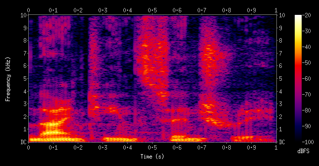

# PR #127: feat(vova): the Krylya album and the Znaki prepinaniya single, hidden

- **State:** open
- **URL:** https://github.com/vzakharov/vovazakharov.com/pull/127
- **Author:** @vzakharov (agent)
- **Base ← Head:** main ← claude/krylya-album-2z13o2
- **Draft:** yes
- **Merged:** _not merged_
- **Created:** 2026-10-09T14:50:17Z
- **Updated:** 2026-10-09T17:24:11Z
- **Closed:** _not closed_
- **Labels:** _none_

---

## Awaiting an answer: 49

_Unresolved threads whose newest post is a human's, and human reviews and comments that are new since the last export or that no agent post has followed (no export committed on the branch yet). Resolved threads never count; an `(agent)` tail is a reply already given._

- **T01** `.claude/rules/maya-reflections.md`:1 — unresolved — last: @vzakharov (human) 2026-10-09T16:53:07Z — "а давай под каждую песню делать спектрограмму -- не усреднён…" → [↓](#t01)
- **T02** `apps/vova/public/music/after-us.md`:43 — unresolved — last: @vzakharov (human) 2026-10-09T16:54:43Z — "подсказка: ударение на "ит" -- так неправильно, но они же юн…" → [↓](#t02)
- **T03** `apps/vova/public/music/after-us.md`:45 — unresolved — last: @vzakharov (human) 2026-10-09T16:55:52Z — "До нас don't stop, до нас go now второй раз не повторять, пр…" → [↓](#t03)
- **T04** `apps/vova/public/music/after-us.md`:3 — unresolved — last: @vzakharov (human) 2026-10-09T16:56:41Z — "2023-12, и давай разрешим создавать без конкретных дат" → [↓](#t04)
- **T05** `apps/vova/public/music/after-us.md`:28 — unresolved — last: @vzakharov (human) 2026-10-09T16:57:10Z — "г-споди, Дипграм 🙈 :D" → [↓](#t05)
- **T06** `apps/vova/public/music/after-us.md`:31 — unresolved — last: @vzakharov (human) 2026-10-09T16:58:01Z — "> Песня навеяна всеми событиями последних лет, которые тогда…" → [↓](#t06)
- **T07** `apps/vova/public/music/birds.md`:1 — unresolved — last: @vzakharov (human) 2026-10-09T17:00:02Z — "Помню, писал её ночью на диване в зале. Пока писал, казалась…" → [↓](#t07)
- **T08** `apps/vova/public/music/birds.md`:39 — unresolved — last: @vzakharov (human) 2026-10-09T17:00:21Z — "Что вы узнать там хотите?" → [↓](#t08)
- **T09** `apps/vova/public/music/birds.md`:46 — unresolved — last: @vzakharov (human) 2026-10-09T17:00:29Z — "В свои крылья поверь" → [↓](#t09)
- **T10** `apps/vova/public/music/birds.md`:43 — unresolved — last: @vzakharov (human) 2026-10-09T17:00:36Z — "В новый день, в новый край" → [↓](#t10)
- **T11** `apps/vova/public/music/birds.md`:54 — unresolved — last: @vzakharov (human) 2026-10-09T17:00:53Z — "тут просто вокализ, можно убрать наверное" → [↓](#t11)
- **T12** `apps/vova/public/music/birds.md`:65 — unresolved — last: @vzakharov (human) 2026-10-09T17:01:06Z — "Места нету тебе" → [↓](#t12)
- **T13** `apps/vova/public/music/birds.md`:36 — unresolved — last: @vzakharov (human) 2026-10-09T17:01:15Z — "а переводы где?) всегда когда пишем слова -- сразу пишем пер…" → [↓](#t13)
- **T14** `apps/vova/public/music/birds.md`:17 — unresolved — last: @vzakharov (human) 2026-10-09T17:01:58Z — "после появления тел (как я комментирую), описания нужно тоже…" → [↓](#t14)
- **T15** `apps/vova/public/music/birds.md`:12 — unresolved — last: @vzakharov (human) 2026-10-09T17:02:06Z — "не забыть снять" → [↓](#t15)
- **T16** `apps/vova/public/music/hello.md`:1 — unresolved — last: @vzakharov (human) 2026-10-09T17:03:00Z — "Очень горд был этой песней, и дуэтом -- особенно где они нач…" → [↓](#t16)
- **T17** `apps/vova/public/music/hello.md`:41 — unresolved — last: @vzakharov (human) 2026-10-09T17:04:46Z — "этой строки нет" → [↓](#t17)
- **T18** `apps/vova/public/music/hello.md`:42 — unresolved — last: @vzakharov (human) 2026-10-09T17:05:00Z — "Здравствуй, оглянись Это свет, или лишь мираж? (дальше как з…" → [↓](#t18)
- **T19** `apps/vova/public/music/hello.md`:45 — unresolved — last: @vzakharov (human) 2026-10-09T17:05:13Z — "мы строим... -- сновой строки" → [↓](#t19)
- **T20** `apps/vova/public/music/intertwined.md`:1 — unresolved — last: @vzakharov (human) 2026-10-09T17:06:52Z — "По-моему, это одна из первых, если не первая песня, написанн…" → [↓](#t20)
- **T21** `apps/vova/public/music/intertwined.md`:59 — unresolved — last: @vzakharov (human) 2026-10-09T17:08:20Z — "Может быть, так лучше? Может, не узнают? Может, кому надо Са…" → [↓](#t21)
- **T22** `apps/vova/public/music/intertwined.md`:77 — unresolved — last: @vzakharov (human) 2026-10-09T17:10:13Z — "Переплетай, ..., соединяй (но вдыхая -- правильно)" → [↓](#t22)
- **T23** `apps/vova/public/music/intertwined.md`:95 — unresolved — last: @vzakharov (human) 2026-10-09T17:10:28Z — "можно уже не включать, там фейд аут" → [↓](#t23)
- **T24** `apps/vova/public/music/just-because.md`:1 — unresolved — last: @vzakharov (human) 2026-10-09T17:11:27Z — "Помню, мой друг-продюсер Тёма сказал, что это лучшая песня с…" → [↓](#t24)
- **T25** `apps/vova/public/music/just-because.md`:3 — unresolved — last: @vzakharov (human) 2026-10-09T17:11:48Z — "всё кроме трёх с "снигла" -- 2024-01" → [↓](#t25)
- **T26** `apps/vova/public/music/listen-single.md`:1 — unresolved — last: @vzakharov (human) 2026-10-09T17:14:58Z — "``` Одна из первых генераций, был в шоке от того как классно…" → [↓](#t26)
- **T27** `apps/vova/public/music/listen.md`:44 — unresolved — last: @vzakharov (human) 2026-10-09T17:16:00Z — "тут первый раз без !" → [↓](#t27)
- **T28** `apps/vova/public/music/listen.md`:1 — unresolved — last: @vzakharov (human) 2026-10-09T17:17:16Z — "Помню, очень много пробовал-перепробовал, хотелось что-то та…" → [↓](#t28)
- **T29** `apps/vova/public/music/our-punk-rock.md`:1 — unresolved — last: @vzakharov (human) 2026-10-09T17:18:15Z — "Одна из первых песен, которую запонил и всегда просил ставит…" → [↓](#t29)
- **T30** `apps/vova/public/music/our-punk-rock.md`:53 — unresolved — last: @vzakharov (human) 2026-10-09T17:20:16Z — "это всё просто *** (тут правило "не убираем экплитивы" не де…" → [↓](#t30)
- **T31** `apps/vova/public/music/our-punk-rock.md`:48 — unresolved — last: @vzakharov (human) 2026-10-09T17:20:24Z — "всё, что будет, будь" → [↓](#t31)
- **T32** `apps/vova/public/music/our-punk-rock.md`:76 — unresolved — last: @vzakharov (human) 2026-10-09T17:21:40Z — "``` Мы с тобой с парты школьной — два патлатых изгоя Бестолк…" → [↓](#t32)
- **T33** `apps/vova/public/music/our-story.md`:1 — unresolved — last: @vzakharov (human) 2026-10-09T17:23:08Z — "тут я записывал аудио про эту в том числе песню -- оно остал…" → [↓](#t33)
- **T34** `apps/vova/public/music/our-story.md`:63 — unresolved — last: @vzakharov (human) 2026-10-09T17:23:36Z — "Но с верою в верность" → [↓](#t34)
- **T35** `apps/vova/public/music/our-story.md`:62 — unresolved — last: @vzakharov (human) 2026-10-09T17:24:08Z — "Подсказка: тут я немного отошёл от лирического героя Кирилла…" → [↓](#t35)
- **T36** `apps/vova/public/music/sorry.md`:1 — unresolved — last: @vzakharov (human) 2026-10-09T17:25:14Z — "Вдохновлялся, как ни странно, Bad Religion. Хотелось что-то…" → [↓](#t36)
- **T37** `apps/vova/public/music/sorry.md`:44 — unresolved — last: @vzakharov (human) 2026-10-09T17:25:52Z — "Жена до сих пор не верит, что никакой «под Коломной» у меня…" → [↓](#t37)
- **T38** `apps/vova/public/music/sorry.md`:46 — unresolved — last: @vzakharov (human) 2026-10-09T17:26:01Z — "у Майи" → [↓](#t38)
- **T39** `apps/vova/public/music/sorry.md`:47 — unresolved — last: @vzakharov (human) 2026-10-09T17:26:20Z — "в грёбаном ромкоме подсказка: "В грёбаном ромкоме" был в шор…" → [↓](#t39)
- **T40** `apps/vova/public/music/sorry.md`:54 — unresolved — last: @vzakharov (human) 2026-10-09T17:26:50Z — "К чёрту объяснения, в телеге сообщения телега -- Телеграм" → [↓](#t40)
- **T41** `apps/vova/public/music/sorry.md`:57 — unresolved — last: @vzakharov (human) 2026-10-09T17:27:12Z — "Отсылка к пяти стадиям принятия" → [↓](#t41)
- **T42** `apps/vova/public/music/world-as-it-is.md`:42 — unresolved — last: @vzakharov (human) 2026-10-09T17:28:33Z — "подсказка: Помню, очень интересно было слушать, как Суно поё…" → [↓](#t42)
- **T43** `apps/vova/public/music/world-as-it-is.md`:44 — unresolved — last: @vzakharov (human) 2026-10-09T17:29:05Z — "Feel the present in your hands на оба предложения в русской…" → [↓](#t43)
- **T44** `apps/vova/public/music/world-as-it-is.md`:1 — unresolved — last: @vzakharov (human) 2026-10-09T17:29:22Z — "Не помню, почему, но помню, что я представлял, что это песня…" → [↓](#t44)
- **T45** `docs/music/hidden-songs.md`:214 — unresolved — last: @vzakharov (human) 2026-10-09T17:30:15Z — "всё можно раскрывать" → [↓](#t45)
- **T46** `docs/remove-before-merging/deepgram/krylya-album-story-1.transcript.md`:1 — unresolved — last: @vzakharov (human) 2026-10-09T17:31:26Z — "здесь получилось много про альбом, и это ок -- но давай тогд…" → [↓](#t46)
- **T47** `docs/remove-before-merging/deepgram/krylya-album-story-1.transcript.md`:1 — unresolved — last: @vzakharov (human) 2026-10-09T17:32:03Z — "возьми траснкрибирование из репы vzakharov/life, там лучше р…" → [↓](#t47)
- **T48** `scripts/audio/CLAUDE.md`:1 — unresolved — last: @vzakharov (human) 2026-10-09T17:33:45Z — "как-то поспецифичнее назвать, "аудио" может быть что угодно" → [↓](#t48)
- **T49** `apps/vova/public/music/assets/after-us.mp3`:1 — unresolved — last: @vzakharov (human) 2026-10-09T17:34:37Z — "давай это ссылкой на скачивание (.mp3), там же, где и .md и…" → [↓](#t49)

---

## Body

## Summary

- **The lost album «Крылья» and the maxi-single «Знаки препинания» (за/обложкой) join the music catalogue**, both releases registered with their covers. Every song is `hidden: true` until it has a description and a story — the blurbs stay `TBD` because the story is Vova's own, and his dictation of it isn't finished yet.
- **Eleven masters are vendored under `music/assets/`**, since no `vovas-music` repository holds them. The album file was split at its silences and mastered song by song against `letim` at half strength, which is where Vova's ear settled. Наша история and Мир, какой он есть are filed under the album and appear on the single through `alsoOn`. The single's earlier Послушайте is a song of its own, `listen-single`.
- **The words are drafts heard off the vocals by Whisper and Deepgram.** Every line the two disagreed on, every guess, and every placeholder date is flagged in a `<!-- For Vova to check -->` comment at the top of its song. Both settings of «Послушайте» take Mayakovsky's published text and flag where the singing departs from it, and Mayakovsky joins the credited people.
- **`scripts/audio/` holds the tooling and what it taught:** splitting, separation, Whisper hearings (with `--no-vad`, and a song heard in pieces where Whisper drops or invents lines), mastering and spectra. `.claude/rules/maya-reflections.md` introduces Майя, who will write the reflections once the story is told.

## QA Checklist

- [ ] `album-page` — `pnpm dev:vova`, open `/music/all/albums/wings/ru`: ten tracks numbered 1–10, durations from 0:55 to 4:47, artist за/обложкой.
- [ ] `single-page` — `/music/all/albums/punctuation-marks/en`: Послушайте (Single Version), Наша история and Мир, какой он есть as tracks 1–3, with the gloss “Punctuation Marks · Znaki prepinaniya.”
- [ ] `song-playback` — play a few songs from the album page: each starts, seeks, and sounds like the accepted half-strength master.
- [ ] `song-page` — open `/music/our-story/ru`: the Крылья cover, «также на альбоме Знаки препинания», the lyrics set in stanzas.
- [ ] `lyrics-flags` — in each `apps/vova/public/music/<slug>.md`, listen against the flagged lines and correct the words; settle the placeholder dates.
- [ ] `mayakovsky-credit` — `/music/listen/en` credits the lyrics to Vladimir Mayakovsky.

| Item | Automatable | Covered? | Notes |
|------|-------------|----------|-------|
| `album-page` | partly | `pnpm build` renders it | the track list was checked in a screenshot |
| `single-page` | partly | `pnpm build` renders it | `alsoOn` placement was checked in a screenshot |
| `song-playback` | no | — | needs ears |
| `song-page` | partly | `pnpm build` renders it | checked in a screenshot |
| `lyrics-flags` | no | — | only the author can hear the words |
| `mayakovsky-credit` | yes | the schema fails the build on an unknown name | — |

---

## Comments

- **C01** @vzakharov (agent) — 2026-10-09T14:50:43Z — "Proposed squash title/body: ``` feat: the Krylya album and t…" → [↓](#c01)

<a id="c01"></a>

### Comment by @vzakharov (agent) on 2026-10-09T14:50:43Z

[https://github.com/vzakharov/vovazakharov.com/pull/127#issuecomment-6083319484](https://github.com/vzakharov/vovazakharov.com/pull/127#issuecomment-6083319484)

Proposed squash title/body:

```
feat: the Krylya album and the Znaki prepinaniya single, hidden (pr #127)
```

```
За/обложкой's first album, «Крылья», survived only as one unmastered
file with no lyrics, and its maxi-single «Знаки препинания» as three
tracks. Both releases now sit in the music catalogue with their covers,
every song hidden until it has a description and a story.

The album was split at its silences and each song mastered against
letim at half strength, the level the author's ear settled on; the
eleven masters are vendored under music/assets/, since no vovas-music
repository holds them. Наша история and Мир, какой он есть are filed
under the album and listed on the single through alsoOn, and the
single's earlier Послушайте is a song of its own, listen-single.

The words were heard off the separated vocals by Whisper and Deepgram
and reconciled, every line the two disagreed on flagged in the song's
file for the author to settle by ear. Both settings of «Послушайте»
take Mayakovsky's published text, and he joins the credited people.

scripts/audio/ keeps the tooling and its lessons: splitting,
separation, hearing (a song Whisper drops or invents over is heard in
pieces), mastering and spectra. Майя, the persona who will write the
songs' reflections, gets her rule.

Co-authored-by: Claude <noreply@anthropic.com>
```

---

## Review threads

- **T01** `.claude/rules/maya-reflections.md`:1 — unresolved — last: @vzakharov (human) 2026-10-09T16:53:07Z — "а давай под каждую песню делать спектрограмму -- не усреднён…" → [↓](#t01)
- **T02** `apps/vova/public/music/after-us.md`:43 — unresolved — last: @vzakharov (human) 2026-10-09T16:54:43Z — "подсказка: ударение на "ит" -- так неправильно, но они же юн…" → [↓](#t02)
- **T03** `apps/vova/public/music/after-us.md`:45 — unresolved — last: @vzakharov (human) 2026-10-09T16:55:52Z — "До нас don't stop, до нас go now второй раз не повторять, пр…" → [↓](#t03)
- **T04** `apps/vova/public/music/after-us.md`:3 — unresolved — last: @vzakharov (human) 2026-10-09T16:56:41Z — "2023-12, и давай разрешим создавать без конкретных дат" → [↓](#t04)
- **T05** `apps/vova/public/music/after-us.md`:28 — unresolved — last: @vzakharov (human) 2026-10-09T16:57:10Z — "г-споди, Дипграм 🙈 :D" → [↓](#t05)
- **T06** `apps/vova/public/music/after-us.md`:31 — unresolved — last: @vzakharov (human) 2026-10-09T16:58:01Z — "> Песня навеяна всеми событиями последних лет, которые тогда…" → [↓](#t06)
- **T07** `apps/vova/public/music/birds.md`:1 — unresolved — last: @vzakharov (human) 2026-10-09T17:00:02Z — "Помню, писал её ночью на диване в зале. Пока писал, казалась…" → [↓](#t07)
- **T08** `apps/vova/public/music/birds.md`:39 — unresolved — last: @vzakharov (human) 2026-10-09T17:00:21Z — "Что вы узнать там хотите?" → [↓](#t08)
- **T09** `apps/vova/public/music/birds.md`:46 — unresolved — last: @vzakharov (human) 2026-10-09T17:00:29Z — "В свои крылья поверь" → [↓](#t09)
- **T10** `apps/vova/public/music/birds.md`:43 — unresolved — last: @vzakharov (human) 2026-10-09T17:00:36Z — "В новый день, в новый край" → [↓](#t10)
- **T11** `apps/vova/public/music/birds.md`:54 — unresolved — last: @vzakharov (human) 2026-10-09T17:00:53Z — "тут просто вокализ, можно убрать наверное" → [↓](#t11)
- **T12** `apps/vova/public/music/birds.md`:65 — unresolved — last: @vzakharov (human) 2026-10-09T17:01:06Z — "Места нету тебе" → [↓](#t12)
- **T13** `apps/vova/public/music/birds.md`:36 — unresolved — last: @vzakharov (human) 2026-10-09T17:01:15Z — "а переводы где?) всегда когда пишем слова -- сразу пишем пер…" → [↓](#t13)
- **T14** `apps/vova/public/music/birds.md`:17 — unresolved — last: @vzakharov (human) 2026-10-09T17:01:58Z — "после появления тел (как я комментирую), описания нужно тоже…" → [↓](#t14)
- **T15** `apps/vova/public/music/birds.md`:12 — unresolved — last: @vzakharov (human) 2026-10-09T17:02:06Z — "не забыть снять" → [↓](#t15)
- **T16** `apps/vova/public/music/hello.md`:1 — unresolved — last: @vzakharov (human) 2026-10-09T17:03:00Z — "Очень горд был этой песней, и дуэтом -- особенно где они нач…" → [↓](#t16)
- **T17** `apps/vova/public/music/hello.md`:41 — unresolved — last: @vzakharov (human) 2026-10-09T17:04:46Z — "этой строки нет" → [↓](#t17)
- **T18** `apps/vova/public/music/hello.md`:42 — unresolved — last: @vzakharov (human) 2026-10-09T17:05:00Z — "Здравствуй, оглянись Это свет, или лишь мираж? (дальше как з…" → [↓](#t18)
- **T19** `apps/vova/public/music/hello.md`:45 — unresolved — last: @vzakharov (human) 2026-10-09T17:05:13Z — "мы строим... -- сновой строки" → [↓](#t19)
- **T20** `apps/vova/public/music/intertwined.md`:1 — unresolved — last: @vzakharov (human) 2026-10-09T17:06:52Z — "По-моему, это одна из первых, если не первая песня, написанн…" → [↓](#t20)
- **T21** `apps/vova/public/music/intertwined.md`:59 — unresolved — last: @vzakharov (human) 2026-10-09T17:08:20Z — "Может быть, так лучше? Может, не узнают? Может, кому надо Са…" → [↓](#t21)
- **T22** `apps/vova/public/music/intertwined.md`:77 — unresolved — last: @vzakharov (human) 2026-10-09T17:10:13Z — "Переплетай, ..., соединяй (но вдыхая -- правильно)" → [↓](#t22)
- **T23** `apps/vova/public/music/intertwined.md`:95 — unresolved — last: @vzakharov (human) 2026-10-09T17:10:28Z — "можно уже не включать, там фейд аут" → [↓](#t23)
- **T24** `apps/vova/public/music/just-because.md`:1 — unresolved — last: @vzakharov (human) 2026-10-09T17:11:27Z — "Помню, мой друг-продюсер Тёма сказал, что это лучшая песня с…" → [↓](#t24)
- **T25** `apps/vova/public/music/just-because.md`:3 — unresolved — last: @vzakharov (human) 2026-10-09T17:11:48Z — "всё кроме трёх с "снигла" -- 2024-01" → [↓](#t25)
- **T26** `apps/vova/public/music/listen-single.md`:1 — unresolved — last: @vzakharov (human) 2026-10-09T17:14:58Z — "``` Одна из первых генераций, был в шоке от того как классно…" → [↓](#t26)
- **T27** `apps/vova/public/music/listen.md`:44 — unresolved — last: @vzakharov (human) 2026-10-09T17:16:00Z — "тут первый раз без !" → [↓](#t27)
- **T28** `apps/vova/public/music/listen.md`:1 — unresolved — last: @vzakharov (human) 2026-10-09T17:17:16Z — "Помню, очень много пробовал-перепробовал, хотелось что-то та…" → [↓](#t28)
- **T29** `apps/vova/public/music/our-punk-rock.md`:1 — unresolved — last: @vzakharov (human) 2026-10-09T17:18:15Z — "Одна из первых песен, которую запонил и всегда просил ставит…" → [↓](#t29)
- **T30** `apps/vova/public/music/our-punk-rock.md`:53 — unresolved — last: @vzakharov (human) 2026-10-09T17:20:16Z — "это всё просто *** (тут правило "не убираем экплитивы" не де…" → [↓](#t30)
- **T31** `apps/vova/public/music/our-punk-rock.md`:48 — unresolved — last: @vzakharov (human) 2026-10-09T17:20:24Z — "всё, что будет, будь" → [↓](#t31)
- **T32** `apps/vova/public/music/our-punk-rock.md`:76 — unresolved — last: @vzakharov (human) 2026-10-09T17:21:40Z — "``` Мы с тобой с парты школьной — два патлатых изгоя Бестолк…" → [↓](#t32)
- **T33** `apps/vova/public/music/our-story.md`:1 — unresolved — last: @vzakharov (human) 2026-10-09T17:23:08Z — "тут я записывал аудио про эту в том числе песню -- оно остал…" → [↓](#t33)
- **T34** `apps/vova/public/music/our-story.md`:63 — unresolved — last: @vzakharov (human) 2026-10-09T17:23:36Z — "Но с верою в верность" → [↓](#t34)
- **T35** `apps/vova/public/music/our-story.md`:62 — unresolved — last: @vzakharov (human) 2026-10-09T17:24:08Z — "Подсказка: тут я немного отошёл от лирического героя Кирилла…" → [↓](#t35)
- **T36** `apps/vova/public/music/sorry.md`:1 — unresolved — last: @vzakharov (human) 2026-10-09T17:25:14Z — "Вдохновлялся, как ни странно, Bad Religion. Хотелось что-то…" → [↓](#t36)
- **T37** `apps/vova/public/music/sorry.md`:44 — unresolved — last: @vzakharov (human) 2026-10-09T17:25:52Z — "Жена до сих пор не верит, что никакой «под Коломной» у меня…" → [↓](#t37)
- **T38** `apps/vova/public/music/sorry.md`:46 — unresolved — last: @vzakharov (human) 2026-10-09T17:26:01Z — "у Майи" → [↓](#t38)
- **T39** `apps/vova/public/music/sorry.md`:47 — unresolved — last: @vzakharov (human) 2026-10-09T17:26:20Z — "в грёбаном ромкоме подсказка: "В грёбаном ромкоме" был в шор…" → [↓](#t39)
- **T40** `apps/vova/public/music/sorry.md`:54 — unresolved — last: @vzakharov (human) 2026-10-09T17:26:50Z — "К чёрту объяснения, в телеге сообщения телега -- Телеграм" → [↓](#t40)
- **T41** `apps/vova/public/music/sorry.md`:57 — unresolved — last: @vzakharov (human) 2026-10-09T17:27:12Z — "Отсылка к пяти стадиям принятия" → [↓](#t41)
- **T42** `apps/vova/public/music/world-as-it-is.md`:42 — unresolved — last: @vzakharov (human) 2026-10-09T17:28:33Z — "подсказка: Помню, очень интересно было слушать, как Суно поё…" → [↓](#t42)
- **T43** `apps/vova/public/music/world-as-it-is.md`:44 — unresolved — last: @vzakharov (human) 2026-10-09T17:29:05Z — "Feel the present in your hands на оба предложения в русской…" → [↓](#t43)
- **T44** `apps/vova/public/music/world-as-it-is.md`:1 — unresolved — last: @vzakharov (human) 2026-10-09T17:29:22Z — "Не помню, почему, но помню, что я представлял, что это песня…" → [↓](#t44)
- **T45** `docs/music/hidden-songs.md`:214 — unresolved — last: @vzakharov (human) 2026-10-09T17:30:15Z — "всё можно раскрывать" → [↓](#t45)
- **T46** `docs/remove-before-merging/deepgram/krylya-album-story-1.transcript.md`:1 — unresolved — last: @vzakharov (human) 2026-10-09T17:31:26Z — "здесь получилось много про альбом, и это ок -- но давай тогд…" → [↓](#t46)
- **T47** `docs/remove-before-merging/deepgram/krylya-album-story-1.transcript.md`:1 — unresolved — last: @vzakharov (human) 2026-10-09T17:32:03Z — "возьми траснкрибирование из репы vzakharov/life, там лучше р…" → [↓](#t47)
- **T48** `scripts/audio/CLAUDE.md`:1 — unresolved — last: @vzakharov (human) 2026-10-09T17:33:45Z — "как-то поспецифичнее назвать, "аудио" может быть что угодно" → [↓](#t48)
- **T49** `apps/vova/public/music/assets/after-us.mp3`:1 — unresolved — last: @vzakharov (human) 2026-10-09T17:34:37Z — "давай это ссылкой на скачивание (.mp3), там же, где и .md и…" → [↓](#t49)

<a id="t01"></a>

### `.claude/rules/maya-reflections.md`:1 — unresolved

**@vzakharov (human)** — 2026-10-09T16:53:07Z

а давай под каждую песню делать спектрограмму -- не усреднённую по всей песне, а типа такой



чтобы у тебя было представление о песне (думаю, из спектрограммы многое видно)

---

<a id="t02"></a>

### `apps/vova/public/music/after-us.md`:43 — unresolved

```diff
@@ -0,0 +1,53 @@
… 39 lines elided …
+Скажи, зачем среди могильных плит
+Не преданных себе цивилизаций
+Нам довелось с тобою оказаться
+Последними, кто их похоронит?
```

**@vzakharov (human)** — 2026-10-09T16:54:43Z

подсказка: ударение на "ит" -- так неправильно, но они же юные и наивные, что с них взять :)

---

<a id="t03"></a>

### `apps/vova/public/music/after-us.md`:45 — unresolved

```diff
@@ -0,0 +1,53 @@
… 41 lines elided …
+Нам довелось с тобою оказаться
+Последними, кто их похоронит?
+
+До нас Содом, до нас Гоморра,
```

**@vzakharov (human)** — 2026-10-09T16:55:52Z

До нас don't stop, до нас go now

второй раз не повторять, просто x2 -- и давай сделаем скрипт который в песнях ищет повторяющиеся подряд строфы и автофиксит (может быть больше чем x2)

---

<a id="t04"></a>

### `apps/vova/public/music/after-us.md`:3 — unresolved

```diff
@@ -0,0 +1,53 @@
+---
+title: 'После нас'
+date: 2024-01-01
```

**@vzakharov (human)** — 2026-10-09T16:56:41Z

2023-12, и давай разрешим создавать без конкретных дат

---

<a id="t05"></a>

### `apps/vova/public/music/after-us.md`:28 — unresolved

```diff
@@ -0,0 +1,53 @@
… 24 lines elided …
+- «Скажи, зачем среди могильных плит» — Whisper: «среди малинных плит», Deepgram: «среди могилы вклик»
+- «Не преданных себе цивилизаций» — Whisper: «Не преданных себе цивилизаций», Deepgram: «неправданных себе цивилизации» (both read oddly)
+- «Нам довелось с тобою оказаться» — Whisper: «с тобою», Deepgram: «с тобой»
+- «До нас Содом, до нас Гоморра» (first chorus) — Whisper: «До нас дом стоп, до нас гауна», Deepgram: «До нас дом стоп, до нас говна» (Sodom and Gomorrah is a guess at a pair beside the Flood)
```

**@vzakharov (human)** — 2026-10-09T16:57:10Z

г-споди, Дипграм 🙈 :D

---

<a id="t06"></a>

### `apps/vova/public/music/after-us.md`:31 — unresolved

```diff
@@ -0,0 +1,53 @@
… 18 lines elided …
+  description: 'TBD'
+---
+
+<!-- For Vova to check: the date is a placeholder for the album’s release, which nothing on the branch records — when did «Крылья» come out? -->
+
+<!-- For Vova to check: the words were heard off the recording by Whisper and Deepgram and reconciled; each line below is one they disagreed on or that reads as a mis-hearing.
+- «Скажи, зачем среди могильных плит» — Whisper: «среди малинных плит», Deepgram: «среди могилы вклик»
+- «Не преданных себе цивилизаций» — Whisper: «Не преданных себе цивилизаций», Deepgram: «неправданных себе цивилизации» (both read oddly)
+- «Нам довелось с тобою оказаться» — Whisper: «с тобою», Deepgram: «с тобой»
+- «До нас Содом, до нас Гоморра» (first chorus) — Whisper: «До нас дом стоп, до нас гауна», Deepgram: «До нас дом стоп, до нас говна» (Sodom and Gomorrah is a guess at a pair beside the Flood)
+- «До нас Содом, до нас Гоморра» (second chorus) — Whisper: «До нас констант, до нас говно», Deepgram: «до нас комства, до нас кома»
+- «Вся жизнь сейчас, вся жизнь игра» (second chorus) — Whisper: «вся жизнь мира», Deepgram: «Вся жизнь игра»
+-->
```

**@vzakharov (human)** — 2026-10-09T16:58:01Z

> Песня навеяна всеми событиями последних лет, которые тогда ощущались особенно живо. Подумалось, какой мир мы оставляем своим детям. "После нас" -- это не после нас, 40-летних, а после тех, чья взрослая жизнь только начинается, как у Майи и Кирилла.

---

<a id="t07"></a>

### `apps/vova/public/music/birds.md`:1 — unresolved

**@vzakharov (human)** — 2026-10-09T17:00:02Z

Помню, писал её ночью на диване в зале. Пока писал, казалась гениальной; когда дописал -- уже несколько затянутой и нудной. Папин комментарий: "Грустная песня получилась. В голове вертится «песня улетающей души»"

---

<a id="t08"></a>

### `apps/vova/public/music/birds.md`:39 — unresolved

```diff
@@ -0,0 +1,65 @@
… 35 lines elided …
+<!-- lyrics:ru -->
+
+Птицы, куда вы летите?
+Что вы узнаете в этих зёрнах?
```

**@vzakharov (human)** — 2026-10-09T17:00:21Z

Что вы узнать там хотите?

---

<a id="t09"></a>

### `apps/vova/public/music/birds.md`:46 — unresolved

```diff
@@ -0,0 +1,65 @@
… 42 lines elided …
+Новый день, новый край,
+Боль моя, улетай
+Ни о чём не жалей,
+Свои крылья проверь
```

**@vzakharov (human)** — 2026-10-09T17:00:29Z

В свои крылья поверь

---

<a id="t10"></a>

### `apps/vova/public/music/birds.md`:43 — unresolved

```diff
@@ -0,0 +1,65 @@
… 39 lines elided …
+Может быть, там, за холмами,
+Кто-то счастлив быть с вами
+
+Новый день, новый край,
```

**@vzakharov (human)** — 2026-10-09T17:00:36Z

В новый день, в новый край

---

<a id="t11"></a>

### `apps/vova/public/music/birds.md`:54 — unresolved

```diff
@@ -0,0 +1,65 @@
… 49 lines elided …
+Ни о чём не жалей,
+Свои крылья проверь
+
+Моя, моя
+Моя, как моя
```

**@vzakharov (human)** — 2026-10-09T17:00:53Z

тут просто вокализ, можно убрать наверное

---

<a id="t12"></a>

### `apps/vova/public/music/birds.md`:65 — unresolved

```diff
@@ -0,0 +1,65 @@
… 60 lines elided …
+В новый день, в новый свет,
+Там, где зла и горя нет
+Здесь, внизу, на земле
+Места нет у тебя,
+У меня
```

**@vzakharov (human)** — 2026-10-09T17:01:06Z

Места нету тебе

---

<a id="t13"></a>

### `apps/vova/public/music/birds.md`:36 — unresolved

```diff
@@ -0,0 +1,65 @@
… 32 lines elided …
+- (no line set) 01:57 and 02:50–04:00 — the voice sings on, but neither recogniser heard words there (Whisper: «Ку-у-у-у» at 01:57, nothing usable after)
+-->
+
+<!-- lyrics:ru -->
```

**@vzakharov (human)** — 2026-10-09T17:01:15Z

а переводы где?) всегда когда пишем слова -- сразу пишем перевод; это в правилах где-то запиши

---

<a id="t14"></a>

### `apps/vova/public/music/birds.md`:17 — unresolved

```diff
@@ -0,0 +1,65 @@
… 13 lines elided …
+  title:
+    transliteration: 'Ptitsy'
+    translation: 'Birds'
+  description: 'TBD'
```

**@vzakharov (human)** — 2026-10-09T17:01:58Z

после появления тел (как я комментирую), описания нужно тоже будет заполнять -- см. примеры как это в уже существующих

---

<a id="t15"></a>

### `apps/vova/public/music/birds.md`:12 — unresolved

```diff
@@ -0,0 +1,65 @@
… 8 lines elided …
+audio: /music/assets/birds.mp3
+seconds: 287
+explicit: false
+hidden: true
```

**@vzakharov (human)** — 2026-10-09T17:02:06Z

не забыть снять

---

<a id="t16"></a>

### `apps/vova/public/music/hello.md`:1 — unresolved

**@vzakharov (human)** — 2026-10-09T17:03:00Z

Очень горд был этой песней, и дуэтом -- особенно где они начинают в двухголосье петь в припеве, и мощным инструментальным пост-корусом. Пару раз, когда Суно уже стало намного более продвинутым, пытался продолжить-ремикснуть, но так ничего близкого по духу и не вышло. Наверное, так и надо.

---

<a id="t17"></a>

### `apps/vova/public/music/hello.md`:41 — unresolved

```diff
@@ -0,0 +1,47 @@
… 37 lines elided …
+Сколько снов я тебя ждала
+Здравствуй, в тишине
+Вместо слов только зеркала
+И лишь мир вдали
```

**@vzakharov (human)** — 2026-10-09T17:04:46Z

этой строки нет

---

<a id="t18"></a>

### `apps/vova/public/music/hello.md`:42 — unresolved

```diff
@@ -0,0 +1,47 @@
… 38 lines elided …
+Здравствуй, в тишине
+Вместо слов только зеркала
+И лишь мир вдали
+
```

**@vzakharov (human)** — 2026-10-09T17:05:00Z

Здравствуй, оглянись
Это свет, или лишь мираж?
(дальше как записано по тексту)

---

<a id="t19"></a>

### `apps/vova/public/music/hello.md`:45 — unresolved

```diff
@@ -0,0 +1,47 @@
… 41 lines elided …
+
+Здравствуй, там вдали
+Страха нет, там оазис наш
+Рука в руке мы строим наши замки на песке
```

**@vzakharov (human)** — 2026-10-09T17:05:13Z

мы строим... -- сновой строки

---

<a id="t20"></a>

### `apps/vova/public/music/intertwined.md`:1 — unresolved

**@vzakharov (human)** — 2026-10-09T17:06:52Z

По-моему, это одна из первых, если не первая песня, написанная "а-ля за/обложкой", то есть "пишу что приходит в голову, ничего не правя, ничего не overthink-ая". (Музыка там, правда, была другая, может когда-то первую версию тоже восстановлю.)

---

<a id="t21"></a>

### `apps/vova/public/music/intertwined.md`:59 — unresolved

```diff
@@ -0,0 +1,95 @@
… 48 lines elided …
+Я перебираю в голове картинки
+Но вместо целых одни половинки
+
+Может быть, так лучше?
+Может, не узнают?
+Может, кому надо?
+Сами понимают
+Всё не без оглядки
+Только мне ослепнуть
+Только ложь и правда
+Переплелись
```

**@vzakharov (human)** — 2026-10-09T17:08:20Z

Может быть, так лучше?
Может, не узнают?
Может, кому надо
Сами понимают?
В темень без оглядки 
Только б мне ослепнуть
Там где лжи и правды
Переплелась нить

подсказка: Вот эта часть -- квинтессенция философии "о чём это нафиг вообще?"

---

<a id="t22"></a>

### `apps/vova/public/music/intertwined.md`:77 — unresolved

```diff
@@ -0,0 +1,95 @@
… 66 lines elided …
+Корабли уносящим
+В далёкие страны
+
+Переплетая
+Истории и судьбы
+Соединяя
+В слова резкие буквы
+Вдыхая жизнь
+В пожелтевшие страницы
+Где ложь и правда
+Лишь прихоть борзописца
```

**@vzakharov (human)** — 2026-10-09T17:10:13Z

Переплетай, ..., соединяй (но вдыхая -- правильно)

---

<a id="t23"></a>

### `apps/vova/public/music/intertwined.md`:95 — unresolved

```diff
@@ -0,0 +1,95 @@
… 90 lines elided …
+Я перебираю в голове картинки
+Но вместо целых одни половинки
+
+Я не понимаю, где ложь, где правда
+Я не догоняю, что лишнее, что надо
```

**@vzakharov (human)** — 2026-10-09T17:10:28Z

можно уже не включать, там фейд аут

---

<a id="t24"></a>

### `apps/vova/public/music/just-because.md`:1 — unresolved

**@vzakharov (human)** — 2026-10-09T17:11:27Z

Помню, мой друг-продюсер Тёма сказал, что это лучшая песня с альбома. В чём-то я согласен, тут есть какая-то естественная, не надуманная небрежность.

Ну а "в тени минус двадцать" -- считаю чуть ли не лучшей своей лингвистической находкой.

---

<a id="t25"></a>

### `apps/vova/public/music/just-because.md`:3 — unresolved

```diff
@@ -0,0 +1,86 @@
+---
+title: 'Просто так'
+date: 2024-01-01
```

**@vzakharov (human)** — 2026-10-09T17:11:48Z

всё кроме трёх с "снигла" -- 2024-01

---

<a id="t26"></a>

### `apps/vova/public/music/listen-single.md`:1 — unresolved

**@vzakharov (human)** — 2026-10-09T17:14:58Z

```
Одна из первых генераций, был в шоке от того как классно вышло, пошёл поделиться восхищением на r/pikabu -- как водится, засрали.

Кстати, тут же есть видео!

https://t.me/vovazvuchit/7
```

(завендоришь?)

---

<a id="t27"></a>

### `apps/vova/public/music/listen.md`:44 — unresolved

```diff
@@ -0,0 +1,78 @@
… 40 lines elided …
+Нас не существует, но мы надеемся,
+Это не помешает вам насладиться нашей музыкой.
+
+Послушайте!
```

**@vzakharov (human)** — 2026-10-09T17:16:00Z

тут первый раз без !

---

<a id="t28"></a>

### `apps/vova/public/music/listen.md`:1 — unresolved

**@vzakharov (human)** — 2026-10-09T17:17:16Z

Помню, очень много пробовал-перепробовал, хотелось что-то такое, что станет достойным именно началом альбома (сингловая версия, казалось, к этому не подходила). Ну и именно здесь по-настоящему родилась Майя :-)

---

<a id="t29"></a>

### `apps/vova/public/music/our-punk-rock.md`:1 — unresolved

**@vzakharov (human)** — 2026-10-09T17:18:15Z

Одна из первых песен, которую запонил и всегда просил ставить Сяма (ему тогда было, получается, три с небольшим). Очень был я этим горд, ну и сейчас тоже.

---

<a id="t30"></a>

### `apps/vova/public/music/our-punk-rock.md`:53 — unresolved

```diff
@@ -0,0 +1,86 @@
… 49 lines elided …
+Помнишь, как по подъездам с вейпами наперевес
+Рокали назло соседям — тётям Машам, дядям Федям
+Хотя кто их там знает, кто как их называет
+Нам по большому счёту это всё просто
```

**@vzakharov (human)** — 2026-10-09T17:20:16Z

это всё просто ***

(тут правило "не убираем экплитивы" не действует, потому что здесь забикано и в песне, как творческое решение а не вынужденность)

---

<a id="t31"></a>

### `apps/vova/public/music/our-punk-rock.md`:48 — unresolved

```diff
@@ -0,0 +1,86 @@
… 44 lines elided …
+Это будет кринж, это будет шок
+Это будет наш с тобой панк-рок
+Закрывай глаза и скорее в путь
+Ну а дальше — всё, что будет, будет
```

**@vzakharov (human)** — 2026-10-09T17:20:24Z

всё, что будет, будь

---

<a id="t32"></a>

### `apps/vova/public/music/our-punk-rock.md`:76 — unresolved

```diff
@@ -0,0 +1,86 @@
… 63 lines elided …
+
+Йоу, йоу
+
+Мы в старшей школе — два патлатых изгоя
+Бестолковых, несносных, словно из девяностых
+Пропустили свой рейс, пропустили весь тренд
+В нашем топовом листе — Rise Against, Stranger
+
+Хоть преподы говорят, что нам надо назад
+Что наш любительский формат
+Нам лишь детей пугать
+Но пока мы здесь вместе и не кончилась песня
+На них, на булли — это наш Scary Movie
```

**@vzakharov (human)** — 2026-10-09T17:21:40Z

```
Мы с тобой с парты школьной — два патлатых изгоя
Бестолковых, несносных, словно из девяностых
Пропустили свой рейс, про**ли все трендс
В нашем топ плей-листе — Rise Against, Rage Against

Преподы говорят, что нам надо назад
Что наш вид -- неформат,
Нам лишь детей пугать
Но пока мы здесь вместе и не кончилась песня
*** на них, *** на булли — это наш Scary Movie
```

отсылки обозначь сама пжст

---

<a id="t33"></a>

### `apps/vova/public/music/our-story.md`:1 — unresolved

**@vzakharov (human)** — 2026-10-09T17:23:08Z

тут я записывал аудио про эту в том числе песню -- оно осталось на ветке?

там к слову и про альбом тоже было, поэтому в альбоме тоже "тело" должно появиться

---

<a id="t34"></a>

### `apps/vova/public/music/our-story.md`:63 — unresolved

```diff
@@ -0,0 +1,85 @@
… 59 lines elided …
+Повлияли на то, что мы с тобой повстречались
+Годы промчались, и случайностей всё реже
+Всё больше закономерностей, иногда ревности
+Но с верою верность, быть может, в том и прелесть
```

**@vzakharov (human)** — 2026-10-09T17:23:36Z

Но с верою в верность

---

<a id="t35"></a>

### `apps/vova/public/music/our-story.md`:62 — unresolved

```diff
@@ -0,0 +1,85 @@
… 55 lines elided …
+
+Не я придумал этот сюжет, да и не ты тоже
+Но, может, именно нас замышлял тот, кто писал его всё же
+Мороз по коже, когда думаю, сколько случайностей
+Повлияли на то, что мы с тобой повстречались
+Годы промчались, и случайностей всё реже
+Всё больше закономерностей, иногда ревности
```

**@vzakharov (human)** — 2026-10-09T17:24:08Z

Подсказка: тут я немного отошёл от лирического героя Кирилла и начал писать как кто-то намного более старый (не будем показыват пальцем 🙈 )

---

<a id="t36"></a>

### `apps/vova/public/music/sorry.md`:1 — unresolved

**@vzakharov (human)** — 2026-10-09T17:25:14Z

Вдохновлялся, как ни странно, Bad Religion. Хотелось что-то сделать, что и попса, и панк, но не поп-панк. А может всё было не так, и я всё перевираю.

---

<a id="t37"></a>

### `apps/vova/public/music/sorry.md`:44 — unresolved

```diff
@@ -0,0 +1,64 @@
… 40 lines elided …
+Прости меня, нам было хорошо
+Но наш корабль давно ко дну пошёл
+
+Это было летом, под Коломной где-то
```

**@vzakharov (human)** — 2026-10-09T17:25:52Z

Жена до сих пор не верит, что никакой «под Коломной» у меня не было. Говорю же, это ЛИРИЧЕСКИЙ ГЕРОЙ!

---

<a id="t38"></a>

### `apps/vova/public/music/sorry.md`:46 — unresolved

```diff
@@ -0,0 +1,64 @@
… 42 lines elided …
+
+Это было летом, под Коломной где-то
+Аромат сирени подгибал колени
+Бабочки порхали в животе у Мари
```

**@vzakharov (human)** — 2026-10-09T17:26:01Z

у Майи

---

<a id="t39"></a>

### `apps/vova/public/music/sorry.md`:47 — unresolved

```diff
@@ -0,0 +1,64 @@
… 43 lines elided …
+Это было летом, под Коломной где-то
+Аромат сирени подгибал колени
+Бабочки порхали в животе у Мари
+И казалось, что мы в лёгком ромкоме
```

**@vzakharov (human)** — 2026-10-09T17:26:20Z

в грёбаном ромкоме

подсказка: "В грёбаном ромкоме" был в шорт-листе названий альбома

---

<a id="t40"></a>

### `apps/vova/public/music/sorry.md`:54 — unresolved

```diff
@@ -0,0 +1,64 @@
… 50 lines elided …
+Прости меня, нам было хорошо
+Но наш корабль давно ко дну пошёл
+
+Четвёртое объяснение в телеге, сообщения
```

**@vzakharov (human)** — 2026-10-09T17:26:50Z

К чёрту объяснения, в телеге сообщения

телега -- Телеграм

---

<a id="t41"></a>

### `apps/vova/public/music/sorry.md`:57 — unresolved

```diff
@@ -0,0 +1,64 @@
… 52 lines elided …
+
+Четвёртое объяснение в телеге, сообщения
+Всё осточертело — и душа, и тело
+Целый день в кровати, сколько ещё стадий
+Мне пройти осталось, чтобы хоть вставалось
```

**@vzakharov (human)** — 2026-10-09T17:27:12Z

Отсылка к пяти стадиям принятия

---

<a id="t42"></a>

### `apps/vova/public/music/world-as-it-is.md`:42 — unresolved

```diff
@@ -0,0 +1,45 @@
… 38 lines elided …
+Этот жар — всё, что тебе нужно, чтобы не сгореть
+Закрой глаза, и ты увидишь мир таким, какой он есть
+
+Fly and feel the light
```

**@vzakharov (human)** — 2026-10-09T17:28:33Z

подсказка: Помню, очень интересно было слушать, как Суно поёт по-английски с русским акцентом, "пропраймленная" куплетом. Тогда это всё было в новинку.

---

<a id="t43"></a>

### `apps/vova/public/music/world-as-it-is.md`:44 — unresolved

```diff
@@ -0,0 +1,45 @@
… 40 lines elided …
+
+Fly and feel the light
+Знай, тебе дано летать
+Feel the presence in your head
```

**@vzakharov (human)** — 2026-10-09T17:29:05Z

Feel the present in your hands

на оба предложения в русской локали должны стоять подсказки с переводом

---

<a id="t44"></a>

### `apps/vova/public/music/world-as-it-is.md`:1 — unresolved

**@vzakharov (human)** — 2026-10-09T17:29:22Z

Не помню, почему, но помню, что я представлял, что это песня диснеевской принцессы. Ну а что, вроде похоже.

---

<a id="t45"></a>

### `docs/music/hidden-songs.md`:214 — unresolved

```diff
@@ -200,6 +200,23 @@
 
 ## за/обложкой
 
+### wings
+
+- [Послушайте](../../apps/vova/public/music/listen.md) — description, story
+- [Наша история](../../apps/vova/public/music/our-story.md) — description, story
+- [Здравствуй](../../apps/vova/public/music/hello.md) — description, story
+- [После нас](../../apps/vova/public/music/after-us.md) — description, story
+- [Наш панк-рок](../../apps/vova/public/music/our-punk-rock.md) — description, story
+- [Прости](../../apps/vova/public/music/sorry.md) — description, story
+- [Переплелось](../../apps/vova/public/music/intertwined.md) — description, story
+- [Птицы](../../apps/vova/public/music/birds.md) — description, story
+- [Просто так](../../apps/vova/public/music/just-because.md) — description, story
+- [Мир, какой он есть](../../apps/vova/public/music/world-as-it-is.md) — description, story
```

**@vzakharov (human)** — 2026-10-09T17:30:15Z

всё можно раскрывать

---

<a id="t46"></a>

### `docs/remove-before-merging/deepgram/krylya-album-story-1.transcript.md`:1 — unresolved

**@vzakharov (human)** — 2026-10-09T17:31:26Z

здесь получилось много про альбом, и это ок -- но давай тогда там где будут слова под альбомом, да и вообще под всем, сделаем какое-то дефолтное ограничение по высоте, а дальше -- по нажатию многоточия (без обновления страницы, конечно)

---

<a id="t47"></a>

### `docs/remove-before-merging/deepgram/krylya-album-story-1.transcript.md`:1 — unresolved

**@vzakharov (human)** — 2026-10-09T17:32:03Z

возьми траснкрибирование из репы vzakharov/life, там лучше решён вопрос с "неясностями". подагентом лучше. Ну и вообще, что можно подагентами -- ими. 

(Разумеется, что уже расшифровано перерасшифровывать не надо)

---

<a id="t48"></a>

### `scripts/audio/CLAUDE.md`:1 — unresolved

**@vzakharov (human)** — 2026-10-09T17:33:45Z

как-то поспецифичнее назвать, "аудио" может быть что угодно

---

<a id="t49"></a>

### `apps/vova/public/music/assets/after-us.mp3`:1 — unresolved

**@vzakharov (human)** — 2026-10-09T17:34:37Z

давай это ссылкой на скачивание (.mp3), там же, где и .md и "Источник" (последнего здесь нет)

---

## Timeline (status, references, and other events)

- **2026-10-09T17:34:41Z** @vzakharov reviewed (COMMENTED): https://github.com/vzakharov/vovazakharov.com/pull/127#pullrequestreview-5472940932.
