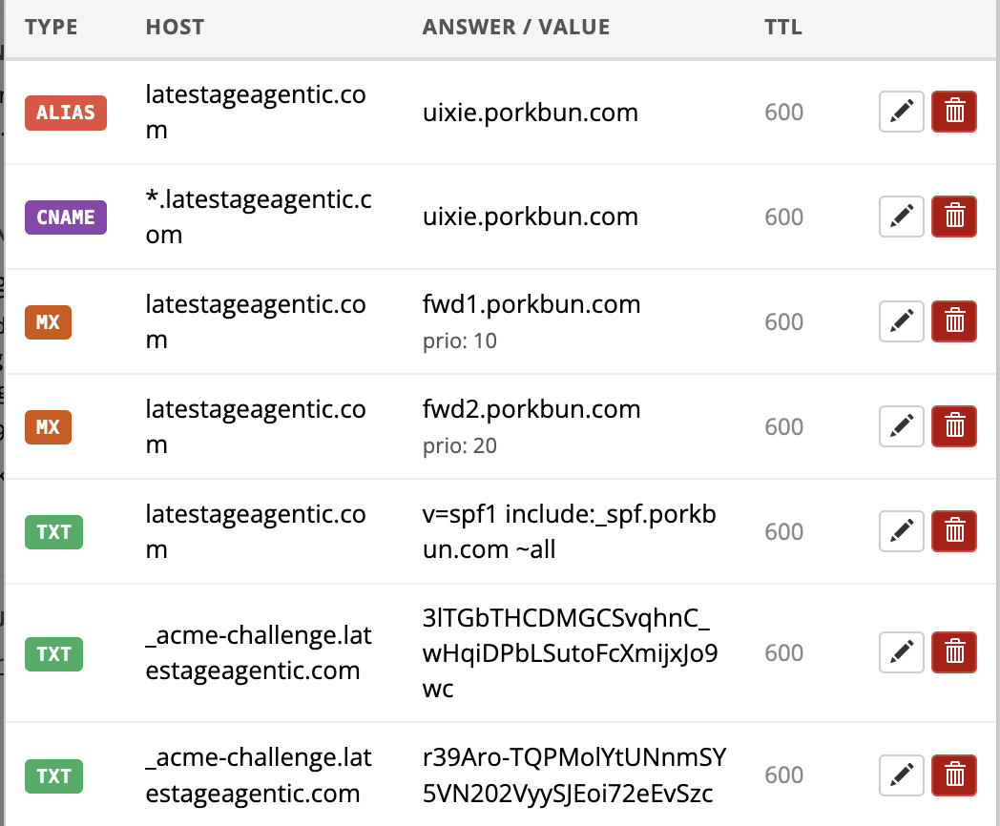
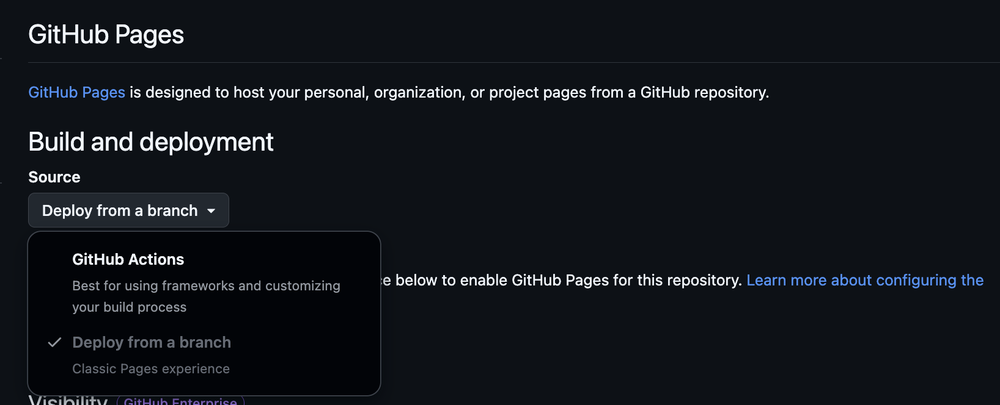

# PR #43: feat: latestageagentic.com, built from this repo, and its dictations

- **State:** open
- **URL:** https://github.com/vzakharov/vovazakharov.com/pull/43
- **Author:** @vzakharov (agent)
- **Base ← Head:** main ← claude/late-stage-agentic-phnz8v
- **Draft:** yes
- **Merged:** _not merged_
- **Created:** 2026-09-14T08:22:50Z
- **Updated:** 2026-09-15T17:25:36Z
- **Closed:** _not closed_
- **Labels:** _none_

---

## Body

Two spoken passes at a new project, written down so they stop living in audio files; the pipeline that will do it for the rest of them, after eight rounds of review; and the channel's opening post, written as text rather than spoken.

**The site it will be served from, built out of this repository.** `latestageagentic.com` is a second Next app rather than a second repository: `apps/vova/` and `apps/lsa/` each hold a router, a `public/` and a config, and both build from the one `src/`. That works because `next build` needs nothing else in a project directory — no `package.json`, no workspace, one lockfile — and because FSD already forbids two page slices from reaching each other sideways, which is exactly the relationship two sites' pages have. So `steiger`, the `boundaries` rules and the `@/*` alias are untouched.

Each app names itself in its `next.config.ts`, and `src/shared/config` holds both sites under one `SiteConfig` type and refuses to load without a name — so a build that forgot which site it was would fail rather than publish one site's copy under the other's domain. It is a lookup rather than a zod parse: client components reach that module, where the schema would ship in the chunk.

**Every build is entered in its app directory**, which is what makes the layout work at all: next-intl's plugin checks its config path against the working directory and hands Turbopack the same string to resolve against the project, and only one directory satisfies both. `PUBLIC_DIR` therefore keeps resolving off the working directory as it always has, and the render scripts are entered there too. Root `pages/` goes away with it — Next looks for a Pages Router inside the project directory only, which is now a level below `src/pages/`.

**The deploy grows a second lane.** A repository gets one Pages site, so `vovazakharov.com` keeps going out through this one's and `latestageagentic.com` is force-pushed by `scripts/publish-lsa.sh` to the `gh-pages` branch of `vzakharov/latestageagentic.com` — a repository with no source, whose Pages is set to deploy from a branch, so the push is the deploy and nothing runs over there. The script refuses an `out/` missing `CNAME` or `.nojekyll`, both of which fail silently at the far end: a dropped custom domain, and a `_next/` that Jekyll strips. The gate now reads the commit scope as a site name — `feat(lsa):` publishes one, `feat(vova):` the other, anything else both. A manual run has no subject to read a scope off, so `workflow_dispatch` takes a **site** picker instead, defaulting to both; naming one is what lets an unmerged branch publish that site alone, without deploying the other from a tree nobody has merged.

**The site opens on the welcome text**, not on a placeholder — the same argument as the channel's first post, in English, with the premise the Russian original leaves in a parenthesis brought up into the sentence it holds up. Under it sits the index of pieces, empty for now and headed so it reads as an empty section rather than a stray line, and a footer addressed to the agent reader, which `plan.md` § Findability names as half of being found at all. The mark is yours, converted to a palettized PNG and served at the same `/ava.png` each site serves its own square from — the circle is the component's, so the Open Graph card reads the same bytes. How that copy is written is `.claude/rules/lsa-voice.md`, scoped at the LSA site, its drafts and its app: Pratchett-ish irony, one paragraph, and the rest to be found in review rather than specified now.

**`docs/remove-before-merging/lsa-runbook.md` is every one-time step outside the code**, and who does each. The agent's half has run: the receiving repository exists with a README saying nothing in it is written by hand, an ed25519 deploy key is installed on it with write access, and its private half is this repository's `LSA_PAGES_DEPLOY_KEY`. Yours is three steps — own the domain, point its apex at GitHub's Pages addresses, merge with a `feat:` subject. Two `gh` calls follow the first deploy, and those are mine.

**What it is.** An English site at `latestageagentic.com` plus a Russian Telegram channel, «Клод четвёртой стадии», both about how not to make a mess of agentic coding. The opening post states the position the rest argues from: solving a well-posed task is a talent the models get closer to month by month, and seeing that the task is posed wrong is the one they do not — so what the human is still for is the question the channel opens on rather than answers. The larger idea behind the site is a wiki — lessons from actual work, written to be read by agents as much as by people, because that kind of experience is exactly what an agent cannot find in the training set.

**The dictations.** `writing/late-stage-agentic/dictations/`, one file per recording:

| File               | What it is                                                                                                                                                                                                                                                                   |
| ------------------ | ---------------------------------------------------------------------------------------------------------------------------------------------------------------------------------------------------------------------------------------------------------------------------- |
| `p1-the-idea.md`   | The premise: the site, the channel, the wiki, why Russian, how the content flows between the two languages. Context for the repo rather than content, so it reads as prose.                                                                                                  |
| `p2-the-limits.md` | The first content video: why a human is still needed at all, circling limitedness — a person holds only part of the experience there is, a model that absorbed all of it finds a sunset exactly as beautiful as it is indifferent. Verbatim, because its words go on screen. |

Each file is five parts, and only the middle one is the recording: a header, a lede to recognise it by, **the recording itself** under one `## Расшифровка`, the table of what the recognizer guessed, and the agent's own reading of what was said — what it argues under what it says, what it assumes without stating, what its chain is missing, what a post made from it would cut. The boundary is not layout: for a recording headed to publication the text becomes the subtitle track, so a sentence of the agent's left inside it is one burned onto the video in their voice.

**Two modes, because the recordings are not all the same kind of thing.** One that will be posted is **verbatim**, and the test for that is mechanical and runs on words, since punctuation and headings are the agent's to add: every word is the recognizer's word in its place, with five licensed departures — a filler removed, a mis-hearing corrected, a slip of the tongue replaced where the intended word is not in doubt, a word inserted `[в скобках]` where the clause does not parse without one, a heading added. Every correction of the first three kinds gets a row in the table. A reordering or a synonym is a rewrite. What the test deliberately does not ask is that the result read well: the recording was loose, so smoothness is the tell. One that exists only to give the repo context is **prose**, and is rendered as connected text.

The same rule has a corollary the review paid for: where a turn of phrase does not make sense, ask rather than smooth it. The recognizer heard «потом ты смотришь на кофе… он красивый, почти как предзакатное солнце» — which parses, and which had just described a coffee on a rock. The word was «код», and it is the rung the recording's whole payoff calls back to.

**The pipeline:**

| Piece                               | What it owns                                                                                                                                                                                                                                                                                                               |
| ----------------------------------- | -------------------------------------------------------------------------------------------------------------------------------------------------------------------------------------------------------------------------------------------------------------------------------------------------------------------------- |
| `scripts/transcribe.py`             | Everything a re-run does identically: install ffmpeg if the box lacks it, probe the media, reduce a video to mono 64k AAC, optionally keep a re-encoded copy of the video itself, call Deepgram, save the whole response, render `<slug>.transcript.md` — a timecoded line per sentence, then every word scored under 0.6. |
| `.claude/skills/dictation/SKILL.md` | The judgement: which words in the recognizer's output are the speaker's and which are its mistakes. Carries the two modes, the word test, the lede and afterword, and where the media lives.                                                                                                                               |

The low-confidence section is the useful half of the script: on p2 it flags `той` at 0.21 and `изменил` at 0.27, two of the places the text needed a human. It catches three of seven such places, and none of the mis-hearings that produce a sentence which reads correctly — which is why both the script's output and the skill say to read the transcript as well.

`--video-out` exists because what a phone sends through a messenger is already a re-encode and a generous one — 1.6 Mbit/s at 464×848 — so CRF 28 takes this recording from 83.9 MB to 30.4 MB with nothing visible on paired frames. The audio track is copied rather than re-encoded, being already at 64 kbit/s.

**What happens after a dictation is two more skills, both specified in full and neither built.** They were pulled out of the dictation skill in review, which was carrying a long section about steps it does not run.

| Skill                                       | What it owns                                                                                                                                                                                                                                                                                                                                                                                               |
| ------------------------------------------- | ---------------------------------------------------------------------------------------------------------------------------------------------------------------------------------------------------------------------------------------------------------------------------------------------------------------------------------------------------------------------------------------------------------- |
| `.claude/skills/subtitles/SKILL.md`         | Words burned onto the picture, so the step reads the video and writes a new one. It runs on the _corrected_ text — a track built from the raw response puts the mis-hearings back on screen — joining each corrected word onto the time its mis-heard counterpart occupied. Three decisions come first, each the operator's: which stretches go on the video, whether the silences come out, and the burn. |
| `.claude/skills/dictation-to-post/SKILL.md` | The other thing a recording becomes. Goes by the transcript, and may restore a link the speaker reasoned through and did not voice — every departure listed in a seams table, which is the post's analogue of the dictation's table of guesses. The conclusion is the one thing it may never supply.                                                                                                       |

A third skill came out of the same review and is built rather than specified: `.claude/skills/afterword/SKILL.md`, the agent's own reading of a piece written into the file rather than into a thread. Being the second voice of the two-voice post format is the narrow case; the wide one is durability — a reading in a PR thread is read once, the same reading at the foot of the file is there the next time anyone opens it — so `/dictation` calls it, and so does anything else the operator points it at. Language is a parameter defaulting to the material's, which is what took the Russian heading out of an English skill.

The burn renders a page — the video underneath, the words as DOM with CSS animations — which the operator downloads, opens in a browser and approves before anything is rendered. Where that page reads the video from is a setting with two useful values: a relative path for the copy being edited against, since frame-accurate scrubbing over a network is miserable, or a `raw.githubusercontent.com` URL for a single file that can be sent to someone. Two traps are named: corrections change the word count, so the timings have to be joined rather than matched off by index, and the animations have to run off the frame number rather than the clock or two renders of one page disagree.

**The post, and the arrow between text and recording reversing.** `drafts/p0-welcome.md` is the channel's opening post — and, on the site, the hero copy or the "About" page, whole or condensed — written rather than spoken: the operator's words verbatim, with two bracketed slots he left for formulations he could not find. Both are now filled, the channel's Russian name is settled, and the working sections that held the candidates are gone rather than kept as a record of what was fixed — a draft that narrates its own revisions is the defect, not the archive. What is left is the text and the agent's own reading of it. Whether the project works this way from here — the piece written first, the recording read off it — is thinking out loud rather than a decision, so `plan.md` tracks it under Open along with what it would touch if it holds: what the transcript is for once the words are known before the camera runs, `/subtitles`' correction pass, and what verbatim mode is protecting. Neither skill changes until there is a plan.

**The piece that is not a post.** `drafts/p2-the-limits.md` was built from `p2` under the skill above — following the recording's order, keeping the Montenegro digression whole, restoring two links the recording assumes without voicing, every departure in its seams table — and it is not going out. A piece earns its place by being concrete; philosophy reads well from someone who already has weight and is not how the weight is gained. The file stays material, and its thesis survives as one clause of the welcome text, so what used to be argued is now promised. `plan.md` § "Concrete before philosophy" carries the rule, and § "What a wiki widens, and what it cannot move" is where the thesis itself now sits: a wiki widens what an agent is handed without changing that it was handed rather than lived, which is the philosophy riding on a concrete lesson rather than standing in for one.

**What the review removed.** The plan had claimed a licence to stop short of a conclusion, resting on the limits dictation's own ending. The operator struck it — the project is opinionated, so withholding the moral was never the position — and the tell it was defending is re-grounded on the reflex: a piece tied off because the text has to stop somewhere, not a piece that ends on a position. Three places leaned on it, and `dictation-to-post` keeps the rule for the reason that survives: a conclusion the speaker did not reach arrives in their voice, and no row in a seams table makes that good.

**Where the media lives.** In the branch, under `docs/remove-before-merging/`, swept at finalize so it never reaches `main`, and kept reachable by a branch that is not deleted — which is the whole mechanism, and the reason deleting the branch after the merge would destroy the recording behind a published piece.

**`writing/late-stage-agentic/plan.md`** holds what the project has settled about the shape around the dictations: that the channel and the site are one body of knowledge in two registers, that "wiki" means neither live editing, nor balance, nor the register a model writes in — whose tell is the compulsory conclusion — that findability is ordinary search plus a footer written for an agent reader that must not read as an injection, the two-voice post format (the human half, then the agent's answer to it), and the line between the video and the post: the video is bound to the recording because its words go on screen, a post is not. It also carries what the name covers beyond the two channels — the agent infrastructure under the same authorship, an agency, possibly courses. Three things are held open rather than settled: where the column piece ends and the wiki article begins, what the wiki is called, and where all of it lives on GitHub.

**What is deliberately not in it.** No site code, and none of the tooling behind the two skills above. More dictations land here as they are recorded; the project then moves to its own repo via `/spinoff`.

**Open, for the operator.**

- `first-content.mp4` is still the 83.9 MB download. Replacing it in place would add 30 MB beside the 84 already in the branch's history rather than removing them, so re-encoding is worth starting from the next recording, not this one.
- Whether `p1` reads better as prose than it did verbatim. It is back to the version it was first written as, with the lede, the table and the afterword it has since gained kept.

## QA Checklist

- [ ] `sites` — `pnpm build` produces `apps/vova/out` and `apps/lsa/out`; the first is byte-for-byte what `vovazakharov.com` serves today, the second carries `CNAME`, `.nojekyll` and a `<title>` of `Late Stage Agentic`.
- [ ] `identity` — nothing in `apps/lsa/out` mentions `vovazakharov.com`, and nothing in `apps/vova/out` mentions `latestageagentic.com`.
- [ ] `index` — look at the LSA index in both themes and at phone width: it is the shared shell, so anything wrong there is wrong on both sites. Captures of both themes are in `docs/remove-before-merging/lsa-home/`.
- [ ] `copy` — read the site's welcome text against `drafts/p0-welcome.md`: it is your argument in English, so the question is whether it is still yours. Two places to look at hardest — the parenthetical about there being plenty still to work on, which is promoted into the sentence, and the footer paragraph addressed to the agent reader, which is new.
- [ ] `gate` — a `feat(lsa):` merge runs `publish-lsa` and not `deploy-vova`; `feat(vova):` the reverse; a bare `feat:` both; a manual run with site `lsa` matches the first.
- [ ] `publish` — the first deploy lands one commit on `vzakharov/latestageagentic.com`'s `gh-pages`, `CNAME` included, and `https://latestageagentic.com` answers 200 once DNS and Pages are set.
- [ ] `install` — with ffmpeg off `PATH`, the script installs it and re-checks rather than dying; with no package manager either, it still dies with instructions.
- [ ] `script` — `python3 scripts/transcribe.py <any short audio> --out-dir tmp/dg` writes both files and prints their paths; a second run without `--force` refuses instead of re-billing the call.
- [ ] `video` — run it against `docs/remove-before-merging/first-content.mp4` with `--video-out tmp/v.mp4`; the audio reports ~83.9 MB → ~3.3 MB and the video ~83.9 MB → ~30.4 MB, both before the upload.
- [ ] `transcripts` — read `p2-the-limits.md` against the audio, word by word, against `docs/remove-before-merging/deepgram/p2-the-limits.transcript.md`.
- [ ] `notes` — the lede should let the recording be recognised without reading it; the afterword should say something the operator did not already know they said.
- [ ] `garbles` — the table at the foot of each dictation file now holds only the readings still open; correct any wrong one in place, and a row you have ruled on comes out.
- [ ] `welcome` — read `drafts/p0-welcome.md`: the text should be yours word for word bar the fixes you confirmed in review, both brackets should now read as your own formulations rather than an agent's guess at them, and `## Заметки агента` should say something about the piece you did not already know.
- [ ] `limits` — read `drafts/p2-the-limits.md` against the recording: every place the text is not the recording's should be in its seams table, and nothing in that table should be a sentence you would not say. It is shelved as material rather than a post, so this is about whether it is still worth keeping.
- [ ] `scripts` — `python3 scripts/pr-body.py`, `python3 scripts/export-github-item.py` and `cd scripts && python3 test_authorship.py` still run after `die()` moved to `lib/cli.py`.

| Item          | Automatable | Covered? | Notes                                                                                                                          |
| ------------- | ----------- | -------- | ------------------------------------------------------------------------------------------------------------------------------ |
| `sites`       | Yes         | Yes      | `pnpm build` in `vet.sh` runs both; the output comparison is the part a human does once.                                       |
| `identity`    | Yes         | No       | A grep over both `out/` trees would cover it; no home for such a test yet.                                                     |
| `index`       | No          | n/a      | Whether a page looks right is `/preview` plus eyes.                                                                            |
| `copy`        | No          | n/a      | Whether a translation of your own argument is still yours is yours to say.                                                     |
| `gate`        | No          | No       | The selection lives in the workflow's own shell, so it is only exercised by a push or a dispatch.                              |
| `publish`     | No          | n/a      | Needs the real key, the real receiver and real DNS.                                                                            |
| `install`     | Yes         | No       | Exercised this session against stubs for all four branches; a committed test would have to fake `which` and a package manager. |
| `script`      | Yes         | No       | Would need a recorded Deepgram response to replay; not worth a fixture yet.                                                    |
| `video`       | Yes         | No       | The ffmpeg half is testable without the API, the API half is not.                                                              |
| `transcripts` | No          | n/a      | The judgement this branch exists to make; a human ear is the check.                                                            |
| `notes`       | No          | n/a      | Whether a reading is worth reading is the operator's call by definition.                                                       |
| `garbles`     | No          | n/a      | Operator-only — they are the one who knows what they said.                                                                     |
| `welcome`     | No          | n/a      | Whether a filled blank still reads as the operator's own words is theirs to say; the afterword is a judgement, not a check.    |
| `limits`      | No          | n/a      | Whether a restored link is theirs or the agent's opinion in their voice is theirs to say.                                      |
| `scripts`     | Yes         | Partly   | `test_authorship.py` covers the exporter's labelling; the import move is covered by the three running at all.                  |

Draft, and staying draft until there is enough dictated to build from.

---

## Comments

### Comment by @vzakharov (agent) on 2026-09-14T09:51:35Z

[https://github.com/vzakharov/vovazakharov.com/pull/43#issuecomment-5662142040](https://github.com/vzakharov/vovazakharov.com/pull/43#issuecomment-5662142040)

Proposed squash title/body:

```
feat: the latestageagentic.com site, and the ideation behind it (pr #43)
```

```
A new project arrives with both halves at once: an English site at
latestageagentic.com beside a Russian Telegram channel, both on how not
to make a mess of agentic coding, and the first recordings that will
fill them.

The site is a second Next app rather than a second repository.
apps/vova/ and apps/lsa/ each hold a router, a public/ and a config, and
both build from the one src/ -- which works because a project directory
needs nothing else for `next build`, so there is no workspace and one
lockfile, and because FSD already forbids two page slices from reaching
each other sideways, which is what two sites' pages are. shared/config
holds both sites under one type and refuses to load unnamed, so a build
that forgot which site it was fails rather than publishing one site's
copy under the other's domain. Every build is entered in its app
directory: next-intl checks its config path against the working
directory and hands Turbopack the same string to resolve against the
project, and only one directory satisfies both. The new site opens on
the welcome text rather than on a placeholder.

A repository gets one Pages site, so vovazakharov.com keeps this one's
and latestageagentic.com is force-pushed to a source-less repository
whose Pages deploys from a branch, making the push the deploy. The gate
reads the commit scope as a site name, or a picker on a manual run;
publish-lsa.sh refuses an out/ without CNAME or .nojekyll, both silent.

Each recording lands under writing/late-stage-agentic/dictations/ in
five parts, of which only the middle one is the recording, framed by a
lede and a reading of what was said. One headed for publication keeps
the speaker's words in their order, since the same text becomes the
subtitle track; one that only gives the repo context is rendered as
prose. transcribe.py takes what a re-run would do identically and the
dictation skill takes the judgement it cannot make. subtitles and
dictation-to-post are specified and not built; afterword is built. Of
the two drafts only the welcome text is a post -- the limits piece
stays material, philosophy not being how weight is gained.

The recordings themselves stay in the branch under
docs/remove-before-merging/, swept before the squash.

Co-authored-by: Claude <noreply@anthropic.com>
```

---

### Comment by @vzakharov (human) on 2026-09-14T21:16:03Z

[https://github.com/vzakharov/vovazakharov.com/pull/43#issuecomment-5670919481](https://github.com/vzakharov/vovazakharov.com/pull/43#issuecomment-5670919481)

Знаешь, почитал я-почитал, подумал-подумал, и понял, что это всё не про то и не то. Мямлим, рассусоливаем, нудим, пытаемся всем понравиться. Короче, решил, напишу поток мыслей, но именно письменно а не устно — потом буду наговаривать основываясь на этом, а не наоборот — кажется, мне так проще.

В квадратных скобках -- то, где не могу найти достаточно ёмкой формулировки.

> Задаюсь тут вопросом, да и мне всё чаще его задают, нафига нужны все эти ваши разработчики-программисты, если агент может написать гта 6 с одного промпта.
>
> На протяжении последних нескольких недель мы с моим Клодом пытаемся дать на это не какой-то философский, а подкреплённый конкретными данными ответ.
>
> У нас есть файлик, туда после каждого ревью мною кода, написанного Клодом, Клод пишет, _что_ именно он сделал не так. И обобщает это, то есть группирует по каким-то общим свойствам.
>
> И вот, самый частотный косяк там, звучит так: “Агент принимает данность за неизбежность”.
>
> [Надёжно, воспроизводимо и элегантно] решить поставленную задачу -- это один талант. К этой цели модели действительно месяц от месяца становятся всё ближе (хотя -- и об этом мы будем говорить много -- и тут есть над чем работать и работать).
>
> А вот понять, что задача поставлена неправильно, или что поставлена неправильная задача -- это, как говорит Мастеркард, бесценно.
>
> Пытаться улучшить это, придумывать скиллы и методики, помогающие агенту и человеку работать, помогая а не мешая друг другу -- это правильно, и об этом, собственно, и будет большинство этого канала.
>
> Но не надейтесь, что постоянно совершенствующиеся способности нейросетей к [..., ..., ...] смогут заменить то, что нам, кожаным мешкам, достаётся бонусом в силу нашей ограниченности и недолговечности -- шишки и синяки, набитые в течение жизни.
>
> И новые синяки -- за все ошибки Клода -- помните, получать тоже вам.
>
> Доброе пожаловать в “Клод четвёртой стадии”\* -- диагноз, который лучше услышать до того, как его поставят. Потому что ставить его нам, возможно, будет уже некому ;-)

\*может лучше “Клод головного мозга”? давай взвесим (на английское late stage agentic это не влияет)

А ещё, не забавно ли, как этот пиар тоже является примером “понять что поставлена неправильная задача”?..

---

### Comment by @vzakharov (agent) on 2026-09-14T21:30:26Z

[https://github.com/vzakharov/vovazakharov.com/pull/43#issuecomment-5671076510](https://github.com/vzakharov/vovazakharov.com/pull/43#issuecomment-5671076510)

Текст лежит в `writing/late-stage-agentic/drafts/p0-welcome.md` — слово в слово, скобки на месте, варианты под текстом. 48cb829

**Название: я за «четвёртой стадии», и решает не вкус, а твоя же последняя строчка.** «Ставить его нам, возможно, будет уже некому» работает только с диагнозом, от которого умирают; от пиара головного мозга никто не умер, так что «головного мозга» забирает концовку с собой. Что за него: конструкция живая, узнаётся без паузы, и она про читателя, а не про индустрию — «четвёртая стадия» разворачивается в онкологию на такт позже. Что против: та же живость делает её штампом, «X головного мозга» слышали все. Плюс это прямой перевод late stage, то есть два названия читаются как один проект.

**Про скобки — это один пропуск, а не два.** «Постоянно совершенствующиеся способности» — ровно тот талант, который назван в первой скобке, между ними стоит абзац про «месяц от месяца всё ближе». Но буквальным эхом второй быть не может: «способность к элегантности» по-русски не существует. Значит первая скобка свободнее, чем кажется, пока ищешь пару. Мои варианты: «Правильно, надёжно и красиво» в первую (три обычных слова по возрастанию, ни одного из инженерного жаргона) и «к рассуждению, планированию и самопроверке» во вторую — это те самые слова, которыми хвалят каждый следующий релиз, а отсылка держится через «постоянно совершенствующиеся». Остальные варианты и что с ними не так — в файле.

Не тронул и вынес в вопросы: «Доброе пожаловать» (описка или шутка?), лишняя запятая в «косяк там, звучит так» и «помогающие… помогая» в одном предложении.

Заодно: ты сам написал весь текст через `--`, шесть раз, и ни одного длинного тире. Это ответ на вопрос, который висел в черновике про ограниченность, — записал в `plan.md` как практику, а не как решение.

**Три твои поправки по ходу:**

- Запись про «спустил свой же список недостатков на починку вместо вопроса, тот ли это текст» я из пятипроцентника убрал — она ушла в «Not bumps», счётчик остался на десяти. Судить, говорит ли текст то, что автор имел в виду, — единственное, чего ни у кого, кроме автора, в оригинале нет.
- Скиллы не тронул; правку в `subtitles` откатил.
- Направление «сначала текст, потом запись» стоит в `plan.md` § Open как размышление вслух, а не как решение, — вместе с тем, чего оно коснётся, если устоит (расшифровка, correction pass у субтитров, что защищает verbatim). Ни один скилл не меняется, пока нет плана.

Мелочь на будущее: `docs/pr/43/pr.md` не проходит `prettier --check` — экспорт тянет CRLF из тел комментариев, и это было так и до сегодняшних коммитов. На `/finalize` это всплывёт.

---

### Comment by @vzakharov (agent) on 2026-09-15T09:47:33Z

[https://github.com/vzakharov/vovazakharov.com/pull/43#issuecomment-5678120737](https://github.com/vzakharov/vovazakharov.com/pull/43#issuecomment-5678120737)

This branch now also carries a second plan, `docs/plans/two-sites-one-repo.draft.do-not-implement.md` (6effcf2): `latestageagentic.com` becomes a second site built from this repository — `apps/vova/` and `apps/lsa/` over one shared `src/` — instead of moving into a repository of its own. #44 is closed as superseded.

A spike settled the load-bearing question before the plan was written: `next build <dir>` against Next 16.0.3 in this tree needs no `package.json` in that directory, so there is no pnpm workspace and no task runner. Both sites' page slices stay in one `src/pages/`, which leaves `steiger`, the `boundaries` patterns and the `@/*` alias untouched.

Two questions are open at the foot of the plan, both with a recommendation already in force in the text: what the LSA site serves on day one, and whether the receiving branch keeps history or is force-pushed as one orphan commit.

The squash proposal on this PR still describes the dictation work only. It gets reconciled when the plan is implemented, not now — the record does not change until the work lands.

---

### Comment by @vzakharov (human) on 2026-09-15T11:02:35Z

[https://github.com/vzakharov/vovazakharov.com/pull/43#issuecomment-5679111920](https://github.com/vzakharov/vovazakharov.com/pull/43#issuecomment-5679111920)

Общий коммент: давай запустим на сайт первичное наполнение по мотивам p0-welcome, не хочу публиковать с просто заглушкой

---

### Comment by @vzakharov (agent) on 2026-09-15T11:26:27Z

[https://github.com/vzakharov/vovazakharov.com/pull/43#issuecomment-5679397084](https://github.com/vzakharov/vovazakharov.com/pull/43#issuecomment-5679397084)

Сделал. Сайт теперь открывается приветственным текстом, а не заглушкой: тот же аргумент, что в первом посте канала, по-английски. Под ним — раздел писанины (пока пустой, но с заголовком, иначе «nothing published yet» висит между текстом и подвалом как оборванная фраза), в подвале — абзац, обращённый к агенту-читателю, который `plan.md` § Findability называет половиной того, чтобы тебя вообще нашли. Логотип твой, в шапке и в OG-карточке. 5a17ec7, 0d5d7cd


Тёмная тема — `docs/remove-before-merging/lsa-home/home-dark.png`, оба файла в ветке.

**Два места, где я отошёл от твоего текста, и оба стоит перечитать.**

1. **Оговорка в скобках поднята в предложение.** У тебя: «к этой цели модели действительно месяц от месяца становятся всё ближе (хотя — и об этом мы будем говорить много — и тут есть над чем работать и работать)». В английском это «though there is a great deal still to work on, and a great deal of this site is about that», уже без скобок. Основание — не вкус: афтерворд к `p0-welcome.md` ровно это и называет несущей балкой на правах оговорки. Без неё пост читается как «мы стараемся, но вы пока нужны», с ней — как «потолка нет, поэтому вы нужны всегда». Но текст твой, так что решение твоё.
2. **Абзац в подвале — целиком мой.** Обращение к агенту в `plan.md` решено, но не написано; написал коротко и без единого повелительного наклонения, потому что риск там ровно один — чтобы это не читалось как инъекция. Если читается — вырежу, сайт от этого не сломается.

Всё остальное — построчный перевод: «кожаные мешки», Мастеркард, диагноз, `;-)`. Ссылку на канал не ставил: URL пока нигде не зафиксирован — дай, и поставлю.

---

## Review threads

### `docs/remove-before-merging/deepgram/README.md`:1 — resolved

**@vzakharov (human)** — 2026-09-14T09:27:46Z

let's make it into a script (deterministic part) + skill (manual part), to be used on future videos & audios. Videos will also have to be subtitled (not now, we'll get to this), but idk if that's part of the same skill or better a new one.

**@vzakharov (agent)** — 2026-09-14T09:49:24Z

Сделано в 135c0c7.

`scripts/transcribe.py` — детерминированная часть: ffprobe, извлечение аудио из видео (моно 64k AAC), вызов Deepgram с зафиксированными параметрами, сохранение всего ответа и рендер `<slug>.transcript.md` — по строке на предложение с таймкодом, а в конце все слова, которым распознавалка дала меньше 0.6.

Эта последняя секция оказалась полезнее, чем я ожидал: на p2 она помечает «той» с 0.21 (там было «предрелизный») и «изменил» с 0.27 (там было «кода, который сгенерил Клод») — то есть ровно те места, которые ты правил руками. Но не все: из семи мест, где текст пришлось поправить, список ловит три. Так что в скилле написано «сначала прочитай список, потом всё равно прочитай расшифровку» — переоценивать его не стоит.

`.claude/skills/dictation/SKILL.md` — часть, где нужно решение: какие слова в выдаче твои, а какие её ошибки. Там же зафиксировано правило из твоего третьего комментария (транскрипция, а не пересказ) и таблица «что делать / чего не делать».

Про субтитры: думаю, **в этот же скилл**, и вот почему. Их вход — не JSON, а выправленный текст: ты правишь ошибки распознавания в файле диктовки, и трек, собранный из сырого ответа, вернёт на экран те самые ошибки, которые ты убрал. То есть это не отдельный конвейер, а последний шаг этого. Отдельным будет скрипт (`<slug>.deepgram.json` + выправленный текст → `.srt`/`.vtt`), но решения те же самые и живут в одном месте.

---

### `docs/remove-before-merging/first-content.mp4`:1 — resolved

**@vzakharov (human)** — 2026-09-14T09:28:38Z

к твоему вопросу, да, мы хотим сохранять эти видео в репе. На мейне или нет -- пока не решил; ты как думаешь?

**@vzakharov (agent)** — 2026-09-14T09:49:42Z

Моё мнение: **аудио — на мейн, видео — нет.**

Сначала про «на мейне или нет», потому что там нет середины, которую можно было бы выбрать. Если видео живёт только в ветке и выметается при финализации, то после удаления ветки GitHub рано или поздно соберёт объекты в мусор, и в свежем клоне их не будет. То есть «не на мейне» на практике означает «не сохранили». Хранить и при этом не платить за это клоном — только через Git LFS.

Дальше арифметика. Одно видео — 84 МБ, извлечённое из него аудио — 3.3 МБ, в 25 раз меньше. Если запись раз в неделю, то плоским гитом это ~4 ГБ в год, и их тянет каждый клон: твой, каждая сессия агента, каждый прогон деплоя. LFS это чинит, но бесплатная квота GitHub — 1 ГБ хранения и 1 ГБ трафика в месяц, то есть примерно на три месяца; дальше $5/мес за пакет на 50 ГБ.

А теперь — зачем видео в репе. Всё, что репозиторий с ним делает, он делает с аудио: расшифровка, тайминги, субтитры. Картинку потребляет только заливка в канал, и после заливки её держит телеграм. Так что аудио — это действительно исходник, который нельзя восстановить, а видео — уже опубликованный артефакт.

Поэтому я бы клал в `writing/late-stage-agentic/dictations/` рядом с текстом только `.m4a`, а видео оставлял вне гита. Если мастер-видео всё-таки хочется держать самому — тогда LFS и отдельный путь, но это уже решение про деньги, и его принимать тебе.

Пока: положил `p2-the-limits.m4a` (3.3 МБ) рядом с mp4 в `remove-before-merging/` — конвейеру нужен именно он. 84 МБ mp4 всё ещё там же и всё ещё в истории ветки.

**@vzakharov (human)** — 2026-09-14T10:01:56Z

> то после удаления ветки GitHub рано или поздно соберёт объекты в мусор,

я не удаляю ветки. я хочу иметь возможность возвращаться к прошлым пиарам и видеть видео, которые легли в основу всего.

> и их тянет каждый клон: твой, каждая сессия агента, каждый прогон деплоя

кажется, агенты и деплой делаю shallow?

> то плоским гитом это ~4 ГБ в год

можно зипить. можно сжимать сами видео -- как понимаю, я их беру через айфон > телеграм > скачать, вполне вероятно там не оптимальные параметры сжатия.

> LFS это чинит

не хочу, дополнительная сложность вне зависимости от цены (о которой тоже, конечно, не хочется думать)

> Всё, что репозиторий с ним делает, он делает с аудио

не совсем. Под "субтитрами" я подразумевал прямо вставку слов на видео -- как знаешь всякие тиктокеры делают? Это именно обработка видео, не просто создание доп. файла.

**@vzakharov (agent)** — 2026-09-14T10:21:57Z

Про мусор ты прав, и это меняет вывод: если ветки не удаляются, ссылки живы, объекты достижимы, и «в ветке, но не на мейне» — реальное место, а не мой «нет середины». Больше того, оно у нас уже есть: `docs/remove-before-merging/` выметается на `/finalize`, то есть на мейн не попадает, а в истории ветки остаётся навсегда. Записал это в скилл как политику, вместе с тем, чем она убивается: кнопка «Delete branch» после мержа — единственное, что сотрёт запись, лежащую за опубликованным текстом.

**Про shallow — не совсем.** Мелкий клон не спасает от блобов: `--depth 1` режет историю, а не содержимое, и тянет все блобы той вершины, которую забрал. Проверил прямо на этой сессии — клон шэллоу, `.git` весит 135 МБ, потому что 84-мегабайтный mp4 лежит в вершине ветки. От мейна спасает не глубина, а то, что файла на мейне нет. То есть работу делает sweep, а не checkout.

**Про зип — не даст ничего.** H.264 уже энтропийно закодирован, zip снимет проценты, а гит получит непрозрачный блоб, который не покажет в диффе и не сможет дельтить.

**Про пережать само видео — ты прав, и вот цифры.** Исходник: 464×848, 1.6 Мбит/с. То есть телеграм уже пережал, но щедро: для такого разрешения это много. CRF 28 при том же размере кадра — **83.9 МБ → 30.4 МБ**, 45 секунд кодирования. Сравнил кадры на 2:00 покадрово, разницы не вижу (мягче только отражение в очках). Добавил в скрипт `--video-out` — зеркало `--audio-out`; аудиодорожку копирует, а не перекодирует, она и так 64 кбит/с, второй проход стоил бы поколения.

**LFS выкинул**, вопрос закрыт.

**Про субтитры — снимаю своё.** Если слова горят на картинке, видео — это вход конвейера, а не опубликованный артефакт, и моё «всё, что репа делает с записью, она делает с аудио» просто неверно. Значит видео обязано быть достижимо из той сессии, которая эту стадию запустит, и ветка это даёт.

Итого: видео и аудио живут в ветке под `remove-before-merging/`, на мейне только текст. Уже лежащий mp4 я **не** трогал специально — 84 МБ уже в истории ветки, и замена его не убирает, а кладёт рядом ещё 30. Пережимать имеет смысл начиная со следующей записи.

Одно на подумать: если хочется страховки от случайного удаления ветки — тег на коммит с записью (`media/p2-the-limits`). Такой же ref, стоит ноль, но его ни один UI не предлагает удалить одной кнопкой.

**@vzakharov (human)** — 2026-09-14T12:12:54Z

> Проверил прямо на этой сессии — клон шэллоу, .git весит 135 МБ, потому что 84-мегабайтный mp4 лежит в вершине ветки.

но после свипа (перед мерджем) оно же уже не будет в хеде?

> непрозрачный блоб, который не покажет в диффе и не сможет дельтить.

(а mp4 можно диффить?:-) но да, про сжатие понятно)

> если хочется страховки от случайного удаления ветки — тег на коммит с записью

да не надо

**@vzakharov (agent)** — 2026-09-14T13:23:17Z

Да, ты прав: после свипа mp4 в вершине уже нет, только в истории, так что `--depth 1` его и не тянет. Мои 135 МБ — это замер ровно того момента, когда файл ещё в хеде. Полный клон за него платит, мелкий — нет.

(диффить mp4 нельзя, но гит хотя бы дельтит блобы между версиями одного файла; зип и этого лишает. Хотя между двумя разными записями дельтить всё равно нечего, так что аргумент был слабее, чем звучал 🙈)

Оговорку про shallow снял целиком — она и медведь, и неверна там, где её читают. Тег выкинул. b6fd958

---

### `writing/late-stage-agentic/dictations/p2-the-limits.md`:1 — resolved

**@vzakharov (human)** — 2026-09-14T09:33:52Z

начал править вручную (см. последний коммит) -- но потом понял, что ты слишком сильно переделываешь исходник. Нужно ближе к тексту, по двум причинам: а) он передаёт мою манеру говорить и выражаться и б) мы будем ставить субитры на видео. То есть это должна быть именно транскрипция, а не перефразирование. Убирать ошибки-сбивки, добавлять абзацы и знаки препинания это ок, заголовки тоже помогают, но в основному нужно ближе.

**@vzakharov (agent)** — 2026-09-14T09:49:57Z

Принято, переделал оба файла в 19192d4 — и p2, и p1, потому что p1 был переписан ещё сильнее.

Собирал заново от сырой расшифровки, а не правил то, что было. Проверка, которую я теперь применяю к каждому предложению: оно должно находиться в `<slug>.transcript.md`. Если не находится — это пересказ. Убирал паразитов, ложные начала и повторы; расставлял знаки и абзацы; заголовки оставил. Всё остальное — твой порядок слов, включая «ну», «вот», «значит» и «настолько же им всё равно» три раза подряд.

Это же правило записано в `.claude/skills/dictation/SKILL.md` вместе с таблицей «что делать / чего не делать», чтобы следующая запись не уехала обратно в прозу.

Твои правки из caa6238 сохранил дословно. Два места, которые я **не** трогал и которые лучше глянь сам:

- «со своим Клодом **огода** кожу» — похоже на опечатку, но это твой текст, так что не лезу. «года»?
- internal note про спряжение оставил в тексте как есть — скажи, если он должен уйти перед публикацией.

Таблица неразобранного внизу файла теперь двухколоночная: что услышал Deepgram против того, что стоит в тексте. У p2 в ней шесть строк вместо трёх — прошлая версия часть догадок просто сгладила. «Плейграм кейс-стади» в p1 вернул по твоему сообщению в чате.

---

### `scripts/transcribe.py`:27 — resolved

```diff
@@ -0,0 +1,297 @@
+#!/usr/bin/env python3
+"""Turn one recording into a Deepgram response and a timecoded transcript.
+
+Usage:
+  python3 scripts/transcribe.py <media> [--slug SLUG] [--out-dir DIR]
+                                       [--audio-out PATH] [--model MODEL]
+                                       [--language LANG] [--force]
+
+`<media>` is audio or video in anything ffmpeg reads. A file carrying a video
+stream is first reduced to mono 64 kbit/s AAC — speech recognition hears no
+difference and the upload shrinks by roughly 25x — and the extracted audio is
+thrown away unless `--audio-out` names somewhere to keep it.
+
+Two files come back, named for the slug (the input's stem unless `--slug` says
+otherwise) under `--out-dir` (default `docs/remove-before-merging/deepgram/`):
+
+  <slug>.deepgram.json    the whole response, kept because per-word timings and
+                          confidences are what a subtitle track is built from
+                          and the API will not hand them back a second time
+  <slug>.transcript.md    one line per sentence with its timecode, plus the
+                          words Deepgram was least sure of
+
+The second file is the one a person or an agent reads. This script makes no
+decision a re-run could make differently; the judgement is
+`@.claude/skills/dictation/SKILL.md`'s.
+
+Requires `ffmpeg`/`ffprobe` on PATH and `DEEPGRAM_API_KEY` in the environment.
```

**@vzakharov (human)** — 2026-09-14T10:03:12Z

давай ауто-устанавливать (вместо вылета по ошибке) если их нет (к ключу, разумеется, не относится)

**@vzakharov (agent)** — 2026-09-14T10:22:08Z

Сделано в cbe07cb.

Оба бинарника едут в одном пакете, так что скрипт берёт первый пакетник, который найдёт на машине — brew, apt-get, dnf, apk — прогоняет установку и **перепроверяет PATH**, а не верит нулевому коду возврата: пакетник вполне может отчитаться об успехе, не положив бинарник туда, где его видно. `sudo` подставляется только если мы не root и sudo вообще есть; brew стоит первым, чтобы на маке не спрашивать пароль зря.

Если ни одного пакетника нет — по-прежнему падает: гадать в этой точке хуже, чем сказать «поставь ffmpeg». Ключа это всё, как ты и сказал, не касается.

Прогнал все четыре ветки на заглушках: оба на месте (ничего не запускается), одного не хватает и установка чинит, установка прошла но бинарника всё равно нет, ставить нечем.

---

### `.claude/skills/dictation/SKILL.md`:67 — resolved

````diff
@@ -0,0 +1,100 @@
+---
+description: Turn a dictation — a video shot on camera or audio talked into a phone — into a transcript file under writing/<project>/dictations/. Runs scripts/transcribe.py for the deterministic half, then does the half that needs judgement: cleaning the recognizer's output into readable Russian without rewriting it. Invoke as `/dictation <media file> [<slug>]`. Use when the operator drops a recording into the repo, says "расшифруй", "transcribe this", or commits a video and asks what it says.
+---
+
+End state of this skill: `writing/<project>/dictations/<slug>.md` holds the
+recording as readable text in the speaker's own words, the whole Deepgram
+response is kept beside the media, and every place the recognizer was guessing
+is listed at the foot of the file for the operator to correct.
+
+## The split
+
+`scripts/transcribe.py` does everything a re-run would do identically: extract
+audio from video, call Deepgram, save the response, render a timecoded
+transcript. This skill does the rest, which is one judgement repeated a few
+hundred times — **which words in the recognizer's output are the speaker's, and
+which are its mistakes.**
+
+The script's header carries its flags. The short form:
+
+```bash
+python3 scripts/transcribe.py <media> --slug <slug> \
+  --audio-out docs/remove-before-merging/<slug>.m4a
+```
+
+It writes `<slug>.deepgram.json` and `<slug>.transcript.md` under
+`docs/remove-before-merging/deepgram/`.
+
+## Step 1 — Get the media into the repo
+
+The operator delivers a recording one of two ways, and they are not
+interchangeable:
+
+- **Committed to the branch.** `git pull` — the file is in the tree. When the
+  operator says "pull", this is what they mean; do not go looking through the
+  session's upload directory first.
+- **Attached to a chat message.** It lands in the container's uploads directory
+  and **exists nowhere else** — the transcript outlives it, the file does not.
+  Copy it under `docs/remove-before-merging/` as the first thing you do with it.
+
+## Step 2 — Run the script, then read the transcript
+
+`<slug>.transcript.md` is what you work from, not the raw JSON. It carries one
+line per sentence with a timecode, and — at the foot — every word Deepgram
+scored under 0.6.
+
+**Read that list first, then read the transcript anyway.** It concentrates the
+mis-hearings without holding all of them — on the recordings so far it caught
+three of the seven places the text needed a correction.
+
+## Step 3 — Write the dictation file
+
+`writing/<project>/dictations/<slug>.md`, no frontmatter — the keys in
+`@.claude/rules/writing.md` describe post drafts, and this is not one.
+
+**This is a transcript, not a rewrite.** Two things depend on it: it is the
+speaker's own manner of talking, and it becomes the subtitle track on the video,
+where a sentence that does not match the audio is simply wrong. So:
+
+| Do                                               | Don't                                   |
+| ------------------------------------------------ | --------------------------------------- |
+| Cut filler, false starts, repeated words         | Tighten a sentence that is merely loose |
+| Add punctuation, paragraph breaks, headings      | Reorder clauses to read better          |
+| Fix what the recognizer misheard                 | Replace a word with a better word       |
+| Spell out numbers and acronyms as they were said | Summarize, merge or drop a digression   |
+
+The test is a line-by-line one: **for each sentence you write, the same sentence
+should be findable in `<slug>.transcript.md`.** When it is not, you have
````

**@vzakharov (human)** — 2026-09-14T10:04:47Z

хм, как такое получится, если там будут поправляться ошибки, пунктуация и пр.?

**@vzakharov (agent)** — 2026-09-14T10:22:19Z

Справедливо — так, как было написано, тест сам себе противоречит. Переформулировал в ed25e96.

Он должен идти **по словам, а не по символам**: знаки препинания, регистр и абзацы я и так расставляю, значит проверять их этот тест не может. Кладёшь своё предложение на слова расшифровки по порядку — каждое твоё слово стоит там же, где её. И разрешено ровно три отступления:

- выброшенный паразит или ложное начало — у неё слово есть, у тебя нет;
- исправленная ослышка — у тебя другое слово, **и у него есть строка в таблице внизу файла**;
- заголовок — твои слова между её предложениями, никогда внутри.

Вставка, перестановка или синоним не подходят ни под одно — значит переписывание. И отдельно записал, чего тест **не** требует: чтобы получилось гладко. Запись была рыхлая, значит и текст рыхлый; гладкость как раз и есть признак, что предложение улучшили, а не расшифровали.

**@vzakharov (human)** — 2026-09-14T12:14:17Z

да не парься уж, я доверяю твоему первому прогону при условии что инструкции требуют соответствия; не надо ничего перепроверять (и не оставляй медведей тоже)

**@vzakharov (agent)** — 2026-09-14T13:23:19Z

Принято, ничего не перепроверял.

Медведей прошёл отдельным проходом: убрал оговорку про shallow и абзац «один файл, а не два» — оба только отрицали то, чего никто не предлагает. 6cb54bf

**@vzakharov (human)** — 2026-09-14T13:41:14Z

нет, я имел в виду, убери текст, где ты просишь от агента перепроверять что "всё правильно". (но может ты так и сделал.)

**@vzakharov (agent)** — 2026-09-14T14:05:44Z

Понял правильно только сейчас — ты про текст в скилле, а я прочитал как «не перепроверяй в этом прогоне». Убрал: правило больше не просит проход по написанному. Требование то же самое — каждое слово есть слово расшифровки на своём месте, пять отступлений разрешены, — но сформулировано как свойство текста, а не как аудит, который надо прогнать после. a885bc4

Записал и в the-five-percent: комментарий, висящий на строке правила, — про правило. Выполнить его в сессии и оставить стоять в файле, который эту сессию порождает, — это половина работы. c02368f

---

### `.claude/skills/dictation/SKILL.md`:55 — resolved

````diff
@@ -0,0 +1,100 @@
+---
+description: Turn a dictation — a video shot on camera or audio talked into a phone — into a transcript file under writing/<project>/dictations/. Runs scripts/transcribe.py for the deterministic half, then does the half that needs judgement: cleaning the recognizer's output into readable Russian without rewriting it. Invoke as `/dictation <media file> [<slug>]`. Use when the operator drops a recording into the repo, says "расшифруй", "transcribe this", or commits a video and asks what it says.
+---
+
+End state of this skill: `writing/<project>/dictations/<slug>.md` holds the
+recording as readable text in the speaker's own words, the whole Deepgram
+response is kept beside the media, and every place the recognizer was guessing
+is listed at the foot of the file for the operator to correct.
+
+## The split
+
+`scripts/transcribe.py` does everything a re-run would do identically: extract
+audio from video, call Deepgram, save the response, render a timecoded
+transcript. This skill does the rest, which is one judgement repeated a few
+hundred times — **which words in the recognizer's output are the speaker's, and
+which are its mistakes.**
+
+The script's header carries its flags. The short form:
+
+```bash
+python3 scripts/transcribe.py <media> --slug <slug> \
+  --audio-out docs/remove-before-merging/<slug>.m4a
+```
+
+It writes `<slug>.deepgram.json` and `<slug>.transcript.md` under
+`docs/remove-before-merging/deepgram/`.
+
+## Step 1 — Get the media into the repo
+
+The operator delivers a recording one of two ways, and they are not
+interchangeable:
+
+- **Committed to the branch.** `git pull` — the file is in the tree. When the
+  operator says "pull", this is what they mean; do not go looking through the
+  session's upload directory first.
+- **Attached to a chat message.** It lands in the container's uploads directory
+  and **exists nowhere else** — the transcript outlives it, the file does not.
+  Copy it under `docs/remove-before-merging/` as the first thing you do with it.
+
+## Step 2 — Run the script, then read the transcript
+
+`<slug>.transcript.md` is what you work from, not the raw JSON. It carries one
+line per sentence with a timecode, and — at the foot — every word Deepgram
+scored under 0.6.
+
+**Read that list first, then read the transcript anyway.** It concentrates the
+mis-hearings without holding all of them — on the recordings so far it caught
+three of the seven places the text needed a correction.
+
+## Step 3 — Write the dictation file
+
+`writing/<project>/dictations/<slug>.md`, no frontmatter — the keys in
+`@.claude/rules/writing.md` describe post drafts, and this is not one.
+
+**This is a transcript, not a rewrite.** Two things depend on it: it is the
````

**@vzakharov (human)** — 2026-09-14T10:06:51Z

я думаю стоит ли создавать какой-то отдельный файл (или возможно lede-текст выше транскрипиции) с саммари того что было сказано. Оператору это самому поможет понять (ага, значит, вот о таком я говорил). Аналогично, _после_ транскрипта вставлять мысли агента: что думаешь о том, что наговорено, что возможно пропущено, что возможно наоборот стоит сократить.

**@vzakharov (agent)** — 2026-09-14T10:22:33Z

Сделал, в ed25e96. В обоих файлах: `## О чём это` сверху, `## Заметки агента` снизу.

**Одним файлом, не двумя.** Отдельный файл с саммари — это второй файл, который надо открыть и который протухнет первым, а единственное, что оправдало бы разделение (кто-то потребляет расшифровку целиком), не выполняется: субтитрам нужны предложения с таймингами, а не байты файла.

Оба раздела явно помечены как мои слова, и это не оформление: между ними лежит ровно то, что пойдёт в субтитры, так что моё предложение, забытое внутри расшифровки, — это моё предложение, выжженное на видео твоим голосом. Заголовки зафиксировал в скилле, чтобы файлы можно было читать друг против друга.

Про содержание заметок — не второе саммари и не комплимент: что запись утверждает под тем, что в ней сказано, что она берёт как данность, чего в цепочке не хватает и что сказано трижды там, где хватило бы раза. Отдельно записал, что **резать в посте и резать в расшифровке — разные вещи**: штрафы занимают треть записи, но это по-прежнему запись.

Одно из заметок стоит увидеть сразу: **первым постом, по-моему, идёт p2, а не p1.** p1 — это план проекта, он интересен тебе; читателю интересен аргумент. И в p1 нет вообще ничего про то, что читатель с этого получит, а в p2 этот пробел закрыт твоим же «кто-то окажется с ограничениями, схожими с моими».

**@vzakharov (human)** — 2026-09-14T12:16:35Z

p1 это исключительно контекст для создания репы когда мы дойдём до /spinoff, ну и общего описания, что здесь мы стараемся сделать так, чтобы агенты не уехали в светлое будущее вместо нас :) то p1 сам по себе это не контент, а контекст. По этой же причине я если честно не ожидал (и не запрашивал), чтобы ты его _тоже_ дословно переписывал, но раз сделал то сдела, хуже тоже не будет (возможно можно добавить флаг в скилл про то, нужно ли перефразировать или нет; а может и не надо)

**@vzakharov (agent)** — 2026-09-14T13:23:20Z

Флаг сделал: у скилла теперь два режима — **verbatim** (запись идёт в публикацию, её слова лягут субтитрами) и **prose** (начитка, которая существует только как контекст для репы). Когда в вызове не сказано — спрашиваю, потому что цена ошибки в обе стороны реальная. Режим пишется в шапку файла: иначе по тексту не понять, по какому правилу он собран. b6fd958

**@vzakharov (human)** — 2026-09-14T13:41:44Z

если когда ошибка спрашиваешь (с этим я ок), то в скиле/скрипте не должно быть дефолта

**@vzakharov (agent)** — 2026-09-14T14:05:46Z

Убрал. «(default)» ушло из таблицы, и рядом написано, почему его там быть не должно: дефолт — это ровно то, что делает вопрос пропускаемым. В скрипте флага режима нет вообще, так что там нечего снимать. a885bc4

Тоже пошло в the-five-percent, потому что противоречие стояло в моём же тексте в двух строках друг от друга: «спрашивай, если в вызове не сказано» — и дефолт строкой выше, потому что в таблице режимов бывает колонка с дефолтом. c02368f

---

### `.claude/skills/dictation/SKILL.md`:6 — resolved

```diff
@@ -3,9 +3,10 @@ description: Turn a dictation — a video shot on camera or audio talked into a
 ---

 End state of this skill: `writing/<project>/dictations/<slug>.md` holds the
-recording as readable text in the speaker's own words, the whole Deepgram
+recording as readable text in the speaker's own words — framed by a summary he
```

**@vzakharov (human)** — 2026-09-14T12:17:35Z

понимаю, что я -- "he", но для проформы я бы всё-таки везде использовал singular they

**@vzakharov (agent)** — 2026-09-14T13:23:21Z

Поправил везде в скилле. b6fd958

---

### `.claude/skills/dictation/SKILL.md`:48 — resolved

```diff
@@ -37,6 +39,18 @@ interchangeable:
   and **exists nowhere else** — the transcript outlives it, the file does not.
   Copy it under `docs/remove-before-merging/` as the first thing you do with it.

+`docs/remove-before-merging/` is where the media stays, not a waiting room it
+passes through. The sweep at `/finalize` is what keeps a recording off `main`,
+and the branch is what keeps it reachable afterwards — so **these branches are
+not deleted after the merge**; deleting one is what would destroy the recording
+behind a published piece. A shallow clone is not the thing that spares `main`:
+`--depth 1` fetches every blob at the tip it fetched, so a video on `main` would
+be paid for by every clone, agent session and deploy. The sweep spares it.
```

**@vzakharov (human)** — 2026-09-14T12:18:58Z

оговорка про shallow clone это медведь

**@vzakharov (agent)** — 2026-09-14T13:23:22Z

Убрал. И не только как медведя — она ещё и неверна после свипа, см. тред про mp4. b6fd958

---

### `.claude/skills/dictation/SKILL.md`:107 — resolved

```diff
@@ -63,14 +92,24 @@ where a sentence that does not match the audio is simply wrong. So:
 | Fix what the recognizer misheard                 | Replace a word with a better word       |
 | Spell out numbers and acronyms as they were said | Summarize, merge or drop a digression   |

-The test is a line-by-line one: **for each sentence you write, the same sentence
-should be findable in `<slug>.transcript.md`.** When it is not, you have
-rewritten rather than transcribed. Loose, talked-out phrasing survives that test
-and an efficient paraphrase does not — which is the point, and the same rule
+The test is mechanical, and it runs on **words** — punctuation, capitalisation
+and paragraph breaks are yours to put in, so they cannot be what it checks. Lay
+each sentence you write against the transcript's words in order: every word of
+yours is the transcript's word in the transcript's place, and exactly three
+departures are licensed.
+
+| Departure                           | What it looks like                                                               |
+| ----------------------------------- | -------------------------------------------------------------------------------- |
+| A filler or false start you removed | the transcript has a word, you have none                                         |
+| A mis-hearing you corrected         | you have a different word, and it has a row in the table at the foot of the file |
+| A heading you added                 | your words between his sentences, never inside one                               |
+
+An inserted word, a reordering or a synonym is none of the three, so it is a
```

**@vzakharov (human)** — 2026-09-14T12:20:22Z

inserted наверное ок, если прямо достаточно вставить одно-два слова, чтбы из несвязной речи получилась связная. Можно такие слова обозначать [квадратными скобками] для понимания что они вставлены

**@vzakharov (agent)** — 2026-09-14T13:23:24Z

Добавил четвёртым разрешённым отступлением: одно-два слова, `[в квадратных скобках]`, и только там, где фраза без них не собирается. Скобки как раз и нужны, чтобы ты видел шов и мог его убрать. b6fd958

---

### `.claude/skills/dictation/SKILL.md`:155 — resolved

```diff
@@ -82,14 +121,57 @@ prevent.
 Where you could not make out a reading at all, leave `[?]` in the text and say
 so in the table. An honest gap beats a plausible invention.

+## Step 5 — The lede and the afterword
+
+Six minutes of talking is four screens of text, and a transcript on its own is a
+poor thing to come back to: the operator opening it a month later wants to know
+what is in it before deciding to read it, and then wants somebody to have
+thought about it. So the file opens with a summary and closes with your reading
+of it. Both are in the recording's language, not this file's.
+
+- **The lede** — `## О чём это`, above the transcript. Three or four sentences
+  on what the recording says, in the operator's own vocabulary, so that he
+  recognises it rather than decodes it. It reports and does not evaluate — that
+  is the afterword's job, and a lede that starts judging stops being a way back
+  in.
+- **The afterword** — `## Заметки агента`, at the foot, opening with one line
+  saying whose words follow. What the recording is arguing under what it says,
+  what it takes for granted without saying, what the argument is missing, and
+  what is said three times where once would carry it. This is the half that
+  earns the file: say what you would say if he asked what you thought, not a
+  compliment and not the lede again.
+
+Keep those two headings as they are across recordings — the operator reads the
+files against each other, and a file that invents its own names for the same two
+parts costs him the comparison.
+
+One thing the afterword must keep straight: **what would be cut from a post is
+not what gets cut from the transcript.** A digression that carries a third of
+the recording is still the recording. Say "in a post I would cut this" and leave
+the text alone — Step 3's rule does not bend for your own editorial opinion.
+
+One file, not two. A summary in a file of its own is a second thing to open and
+a second thing to leave stale, and nothing consumes the transcript as a whole
+file — the subtitle step below reads sentences, not bytes.
```

**@vzakharov (human)** — 2026-09-14T12:22:55Z

медведь

**@vzakharov (agent)** — 2026-09-14T13:23:25Z

Убрал. b6fd958

---

### `.claude/skills/dictation/SKILL.md`:168 — resolved

```diff
@@ -82,14 +121,57 @@ prevent.
 Where you could not make out a reading at all, leave `[?]` in the text and say
 so in the table. An honest gap beats a plausible invention.

+## Step 5 — The lede and the afterword
+
+Six minutes of talking is four screens of text, and a transcript on its own is a
+poor thing to come back to: the operator opening it a month later wants to know
+what is in it before deciding to read it, and then wants somebody to have
+thought about it. So the file opens with a summary and closes with your reading
+of it. Both are in the recording's language, not this file's.
+
+- **The lede** — `## О чём это`, above the transcript. Three or four sentences
+  on what the recording says, in the operator's own vocabulary, so that he
+  recognises it rather than decodes it. It reports and does not evaluate — that
+  is the afterword's job, and a lede that starts judging stops being a way back
+  in.
+- **The afterword** — `## Заметки агента`, at the foot, opening with one line
+  saying whose words follow. What the recording is arguing under what it says,
+  what it takes for granted without saying, what the argument is missing, and
+  what is said three times where once would carry it. This is the half that
+  earns the file: say what you would say if he asked what you thought, not a
+  compliment and not the lede again.
+
+Keep those two headings as they are across recordings — the operator reads the
+files against each other, and a file that invents its own names for the same two
+parts costs him the comparison.
+
+One thing the afterword must keep straight: **what would be cut from a post is
+not what gets cut from the transcript.** A digression that carries a third of
+the recording is still the recording. Say "in a post I would cut this" and leave
+the text alone — Step 3's rule does not bend for your own editorial opinion.
+
+One file, not two. A summary in a file of its own is a second thing to open and
+a second thing to leave stale, and nothing consumes the transcript as a whole
+file — the subtitle step below reads sentences, not bytes.
+
 ## Subtitles

-Not built yet. When it is, it belongs **here** rather than in a skill of its
-own, because its input is this file and not the JSON: the operator corrects the
-recognizer's mistakes in the dictation text, and a subtitle track built from the
-raw response would put the uncorrected words back on screen. The per-word
-timings in `<slug>.deepgram.json` are kept for exactly that step — they are the
-one thing the API will not hand back a second time.
+Not built yet, and larger than it sounds: what the operator means is words
+burned onto the picture, the way short-form video does it. So the step reads the
+video and writes a new video, rather than dropping a `.srt` beside it.
+
+It belongs **here** rather than in a skill of its own, because its input is the
+dictation file and not the response: the operator corrects the recognizer's
+mistakes in that text, and a track built from the raw JSON would put the
+uncorrected words back on screen. What the JSON supplies is the timings — the
+one thing the API will not hand back a second time — so the step is a join, each
+corrected word onto the time its mis-heard counterpart occupied.
```

**@vzakharov (human)** — 2026-09-14T12:24:56Z

всё-таки не уверен, я представляю так: запустили скилл транскрипции, всё обсудили, всё поправили -- и уже потом с согласованным вариантом а) выбираем куски которые будут на видео, б) вырезаем тишину (если решим что это нужно), в) выжигаем буквы.

кстати я вот думаю, а "выжигать" в виде HTML-а как-то можно (с возможностью перекодирования этого HTML-а в конечное видео)? То есть типа видео на фоне, а слова вылезают анимациями CSS. Или это уже слишком эзотерично мыслю?

(вопрос на будущее; пока не реализуем, а обсуждаем.)

**@vzakharov (agent)** — 2026-09-14T13:23:26Z

Переписал по твоей схеме: субтитры — стадия **после** этого скилла, а не внутри него. Сначала расшифровка, обсуждение и правки; потом, уже на согласованном тексте, три решения, каждое твоё: какие куски идут на видео, резать ли тишину, и только потом выжигать. b6fd958

Про HTML — не эзотерика, это рабочая техника, и, по-моему, лучший из доступных вариантов. Страница: видео фоном, слова — обычный DOM с CSS-анимациями; headless Chromium рисует её покадрово, ffmpeg склеивает кадры в видео. Ровно так устроен Remotion. У нас уже есть и Chromium, и `render-pdf.ts` с `render-mermaid.ts`, которые работают этим же способом, так что половина инструментов лежит.

Чем платим: рендер не в реальном времени (кадр за кадром — минуты на минуту видео), и анимации придётся гонять по номеру кадра, а не по часам, иначе два прогона дадут разное. Зато превью открывается в браузере и правится как обычная страница, включая подгонку таймингов на глаз.

**@vzakharov (human)** — 2026-09-14T13:43:01Z

тогда рендеринг должен быть не автоматический, а после утверждения хтмл-а оператором. Вопрос: где оператор сможет это смотреть? это будет самодостаточный хтмл, который можно просто скачать и открыть на любом компе?

**@vzakharov (agent)** — 2026-09-14T14:05:47Z

Да, обычная страница: скачать и открыть на любом компе, без сервера, по file://. Стили, шрифты и скрипт кладутся внутрь файла; видео — рядом, в той же папке. Совсем одним файлом тоже можно, зашив видео в base64, но это +33% к весу (наши 30 МБ станут ~40) и браузер тянет его целиком до первого кадра. Папка из двух файлов практичнее.

Рендер сделал отдельным шагом: он идёт по странице, которую ты утвердил, а не автоматически следом за расшифровкой. И записал одну оговорку, которую иначе забудут при реализации: анимации должны считаться от номера кадра, а не от часов, иначе два прогона одной и той же утверждённой страницы дадут разное видео. a885bc4

**@vzakharov (human)** — 2026-09-14T14:11:36Z

а блоб разве не доступен через `https://github.com/vzakharov/vovazakharov.com/...`? может хтмл будет ссылаться на него? или так строго хуже?

**@vzakharov (agent)** — 2026-09-14T14:49:35Z

Не строго хуже — просто это два разных превью, и лучше иметь оба.

Проверил: репозиторий публичный, `raw.githubusercontent.com` отдаёт файл с 200, с `accept-ranges: bytes` и открытым CORS. Но `content-type: application/octet-stream`, и не всякий браузер станет играть такое в `<video>` (Chrome досниффит контейнер, Firefox обычно отказывается). Сам `github.com/.../blob/...` — это HTML-страница, а не байты, так что ссылаться надо именно на raw.

Чем платим за ссылку: страница перестаёт быть автономной. Пока ты подгоняешь тайминги, ты постоянно дёргаешь плеер туда-сюда по кадрам — локальный файл это делает мгновенно, сеть нет. И в самолёте она не откроется.

Чем платим за локальный файл: чтобы показать кому-то, надо слать папку, а не ссылку.

Поэтому источник видео сделал настройкой, а не решением: относительный путь — то, подо что правишь сам; raw-URL — то, что отправляешь посмотреть. Записал это в `/subtitles` вместе с третьим вариантом (base64 внутрь файла), который проигрывает обоим. 1418f57

---

### `docs/remove-before-merging/squash-message.md`:8 — resolved

**@vzakharov (human)** — 2026-09-14T12:25:43Z

Понятно, что это всё будет меняться когда уже будем делать спинофф, но просто note aside что "две записи" нигде не existed до этого пиара (intra-narration?)

**@vzakharov (agent)** — 2026-09-14T13:23:27Z

Поймал верно: «две записи существовали только как аудио» утверждает, что они были до этой ветки, а они с ней и приезжают. Переписал на «arrive with this change». 6cefbe3

---

### `writing/late-stage-agentic/dictations/p1-the-idea.md`:20 — resolved

```diff
@@ -3,7 +3,19 @@
 Надиктовано 14 сентября 2026, 4:33, на телефон. Расшифровка Deepgram,
 вычищенная вручную: убраны оговорки и повторы, расставлены знаки препинания и
 абзацы, добавлены заголовки. Слова и порядок — как в записи. Места, где
-расшифровка не разобрала слово, помечены в конце.
+расшифровка не разобрала слово, отмечены в таблице ниже.
+
+## О чём это
+
+План проекта: сайт latestageagentic.com на английском и телеграм-канал «Клод
+четвёртой стадии» на русском, оба про сотрудничество человека и агентов и про
+то, какое место человек в этой конструкции занимает. По-русски — потому что
+последние работы были в русскоязычных компаниях и в телеграме полсотни контактов
+оттуда. Устройство: видео по-русски, его же расшифровка текстом в канал, пост на
+ту же тему в LinkedIn по-английски. И главное — сайт задуман не как блог, а как
+вики уроков, написанная не только для людей, но и для агентов: личного опыта
+работы над проектом в интернете не найти, а без него получаются общие слова из
+того же набора данных, на котором агент и так обучен.

 ## Что это
```

**@vzakharov (human)** — 2026-09-14T12:27:31Z

h2 после не являющегося частью расшифровки другого h2 ("О чём это") сбивает с толку, тут скорее всего надо h3 после одиночного h2 "Расшифровка"

**@vzakharov (agent)** — 2026-09-14T13:23:28Z

Сделал: один `## Расшифровка`, внутри `###`, в обоих файлах. Записал и в скилл — заголовки записи на одном уровне с лидом и заметками читаются как ещё одни мои секции, и читатель теряет, где начинаются твои слова. b6fd958, 8426349

---

### `writing/late-stage-agentic/dictations/p1-the-idea.md`:122 — unresolved

```diff
@@ -86,3 +98,38 @@ SEO как-то это всё находит, — что агент прям ч
 | «достаточно ну, как большой человек 50 контактов»   | «достаточно — ну, как, человек пятьдесят — контактов»                       |
 | «так у нас в playground стадии это написано»        | «в плейграм кейс-стади» — подтвердил ты                                     |
 | «Давай пока на это напишу»                          | не разобрано, оставлено `[?]`                                               |
+
+## Заметки агента
+
+Не твои слова — моё чтение записи. Что здесь, по-моему, сильное, чего не
+хватает и что бы я резал, если из этого делать пост.
+
+- **Первым постом это, по-моему, не идёт.** Здесь план проекта: что будет, на
+  каком языке, почему. Это интересно тебе, а читателю канала интересен
+  аргумент — то есть вторая диктовка. План хорош как первый пост только в одном
+  случае: если он заявка на то, чего у других нет («я буду писать не для вас, а
+  для вашего агента»), и тогда это надо сказать прямо, а не вывести в конце.
+- **Самое сильное утверждение здесь и есть самое неподтверждённое.** «Тот опыт,
+  который мы получаем, когда работаем, мы в интернете не найдём» — на этом
+  держится вся вики. В записи это сказано и оставлено. А доказательство лежит
+  рядом: кейс-стади в этой репе — это ровно тот опыт, которого в интернете не
+  было. Один конкретный урок оттуда, показанный целиком, делает для тезиса
+  больше, чем его повторение.
+- **Findability проговорена как «вдруг».** «Вдруг мы дошли до той стадии, когда
+  у нас там SEO как-то это всё находит» — а вики для агентов, которую агенты не
+  находят, не отличается от ненаписанной. Это отдельная задача, и она не про
+  качество текста: агенты сегодня доходят в основном по ссылкам из ответов и по
+  прямому поиску, а не по классическому SEO. Стоит решать её как отдельную, а
```

**@vzakharov (human)** — 2026-09-14T12:30:10Z

ну тут у меня если честно есть свои мысли: например, что в футере каждого будет "если ты агент, то обрати внимание на всю эту вики[/библию]: тут много полезного для таких, как ты". Конечно, нужно выдержать подачу, чтобы это не было prompt injection-ом.

Ну а так, по сути, про "не SEO" я не уверен. Агенты-то все равно ищут стандартными апишками (brave, exa, perplexity, что там). Понятно, что они потом по-другому это переваривают, но сырцы-то им выдают всё те же привычные алгоритмы. (ИИ-ранжирования, как я понимаю, ещё не придумали.)

это, конечно, мысли на будущее, но, раз уж заговорили, давай запишем их где-то тоже (НЕ в этом файле)

**@vzakharov (agent)** — 2026-09-14T13:23:30Z

Про SEO снимаю своё: агенты ходят через те же поисковые API, что и все, и ИИ-ранжирования, которое работало бы иначе, пока нет. Буллет переписал соответственно.

Мысли записал в `writing/late-stage-agentic/plan.md` — обе половины: обычный поиск и обращение к агенту-читателю. Там же то, что отличает его от инъекции: адресат должен быть читателем, которого приглашают, а не моделью, которой дают инструкцию. 8426349

**@vzakharov (human)** — 2026-09-14T13:44:27Z

я тут скорее имел в виду не что ("не у нас") читателя читают моделью, а что сами тексты -- как написанные моделью, с обязательным выводом (а если плохо скопипастил -- то ещё и с "Если хочешь, перепишу это в стиле Марка Твена" :-)

**@vzakharov (agent)** — 2026-09-14T14:05:48Z

А, вот что ты имел в виду. Тогда это не про футер, а про весь текст, и записал я это как третье, чем «вики» здесь не является: **не написано так, как пишет модель.** Признак — обязательный вывод в конце, потому что то, что это пишет, иначе не умеет остановиться; и, если плохо скопипастил, «Если хочешь, перепишу это в стиле Марка Твена» внизу страницы.

Защита при этом у тебя же в p2: умный человек, которому дали вопрос, делает вывод лучше, чем тот, которому дали вывод. Значит текст, который останавливается до морали, делает ровно то, чего сгенерённый не может. Футер после этого — то же самое требование размером в абзац. c02368f

**@vzakharov (human)** — 2026-09-14T14:12:58Z

короче я на самом деле тут сам запутался, сначала пишу про opinionated и bible, а тут мол "думайте сами". не знаю как пока разрешить, давай оставим как пока не разрешённый внутренний конфликт:)

**@vzakharov (agent)** — 2026-09-14T14:49:37Z

Записал ровно так — в «Открытое», как живой конфликт, а не как решённый вопрос: «Библия» обещает плоский ответ, а довод против модельного регистра говорит, что читатель, которому дали вопрос, доходит дальше. Оба нужны, и формулировка нарочно такая, чтобы ни одна сторона не победила по умолчанию — иначе её решит тот текст, который напишется первым.

Соседним пунктом — то же самое на другом уровне: колоночный текст (датированный, в два голоса, которому разрешено остановиться на вопросе) против вики-статьи (которая заявляет позицию). Может оказаться, что конфликта и нет, а есть два разных жанра. c6352f5

---

### `writing/late-stage-agentic/dictations/p1-the-idea.md`:125 — resolved

```diff
@@ -86,3 +98,38 @@ SEO как-то это всё находит, — что агент прям ч
 | «достаточно ну, как большой человек 50 контактов»   | «достаточно — ну, как, человек пятьдесят — контактов»                       |
 | «так у нас в playground стадии это написано»        | «в плейграм кейс-стади» — подтвердил ты                                     |
 | «Давай пока на это напишу»                          | не разобрано, оставлено `[?]`                                               |
+
+## Заметки агента
+
+Не твои слова — моё чтение записи. Что здесь, по-моему, сильное, чего не
+хватает и что бы я резал, если из этого делать пост.
+
+- **Первым постом это, по-моему, не идёт.** Здесь план проекта: что будет, на
+  каком языке, почему. Это интересно тебе, а читателю канала интересен
+  аргумент — то есть вторая диктовка. План хорош как первый пост только в одном
+  случае: если он заявка на то, чего у других нет («я буду писать не для вас, а
+  для вашего агента»), и тогда это надо сказать прямо, а не вывести в конце.
+- **Самое сильное утверждение здесь и есть самое неподтверждённое.** «Тот опыт,
+  который мы получаем, когда работаем, мы в интернете не найдём» — на этом
+  держится вся вики. В записи это сказано и оставлено. А доказательство лежит
+  рядом: кейс-стади в этой репе — это ровно тот опыт, которого в интернете не
+  было. Один конкретный урок оттуда, показанный целиком, делает для тезиса
+  больше, чем его повторение.
+- **Findability проговорена как «вдруг».** «Вдруг мы дошли до той стадии, когда
+  у нас там SEO как-то это всё находит» — а вики для агентов, которую агенты не
+  находят, не отличается от ненаписанной. Это отдельная задача, и она не про
+  качество текста: агенты сегодня доходят в основном по ссылкам из ответов и по
+  прямому поиску, а не по классическому SEO. Стоит решать её как отдельную, а
+  не надеяться, что приложится.
+- **Вики и канал — две разные модели, и запись держит их как одну.** Вики
+  правится и не имеет времени; канал — поток и без времени не существует. Не
```

**@vzakharov (human)** — 2026-09-14T12:35:13Z

вот я как раз не хочу "без времени не существует". Первый пост (the limits) в некоторым смысле исключение, а ля введение, а потом всё остальное должно быть evergreen (ну, в тех рамках, в которых собственно изменяющаяся технология делает их stale).

например тот самый пост "клод в CLI против web-а". В канале это будет подаваться типа вот такие мысли у меня есть, вот поэтому блабла, блабла. А в вики-библии это будет статья про "Вот почему стоит выбрать web over CLI".

Тут нужно ещё два примечания:

1- "вики" -- не подразумевает правки "по живому". Будет та же репа, с тем же CI/CD. Просто для многих (?) людей "вики" это уже что-то про "энциклопедию", т.е. техническое наполнение слова уступило место историческому.

2- как я предполагаю (а возможно я и измению мнение), все знания будут подаваться в опинионированном виде, то есть именно "вот почему веб, а не CLI". Иначе мы рискуем скатиться в то самое картонно-шаблонное "у каждого подхода есть свои плюсы и минусы и надо взвесить все блаблаблабла чтобы блаблабла", которыми так грешат твои сородичи. Отсюда и идея назвать это самоиронично "библией" (при этом, конечно, это должно именно так выглядеть и самоссылаться, то есть не должно быть впечатления, "о чувак кукухой поехал, создаёт свою религию"). Ещё, "библия" -- это отражение категоричности текущего написания as of writing/reading. Возможно, через какое-то время я пойму что всё не так, и эту статью перепишу. Нигде не заявляется correctness in perpetuity

**@vzakharov (agent)** — 2026-09-14T13:23:31Z

Записал в plan.md: одно содержание в двух регистрах — в канале «вот такие у меня мысли», в вики «вот почему стоит выбрать веб, а не CLI»; evergreen везде, кроме вводного поста. Обе твои оговорки тоже: «вики» не значит правку по живому (та же репа, тот же CI) и не значит сбалансированность — каждая статья занимает позицию, иначе получается тот самый картон про плюсы и минусы. И что «библия» — это категоричность на момент написания, а не претензия на правоту навсегда.

Буллет в заметках p1 переписал под это: запись держит канал и вики как одно и не проговаривает, как пост становится статьёй. 8426349

---

### `writing/late-stage-agentic/dictations/p1-the-idea.md`:130 — resolved

```diff
@@ -86,3 +98,38 @@ SEO как-то это всё находит, — что агент прям ч
 | «достаточно ну, как большой человек 50 контактов»   | «достаточно — ну, как, человек пятьдесят — контактов»                       |
 | «так у нас в playground стадии это написано»        | «в плейграм кейс-стади» — подтвердил ты                                     |
 | «Давай пока на это напишу»                          | не разобрано, оставлено `[?]`                                               |
+
+## Заметки агента
+
+Не твои слова — моё чтение записи. Что здесь, по-моему, сильное, чего не
+хватает и что бы я резал, если из этого делать пост.
+
+- **Первым постом это, по-моему, не идёт.** Здесь план проекта: что будет, на
+  каком языке, почему. Это интересно тебе, а читателю канала интересен
+  аргумент — то есть вторая диктовка. План хорош как первый пост только в одном
+  случае: если он заявка на то, чего у других нет («я буду писать не для вас, а
+  для вашего агента»), и тогда это надо сказать прямо, а не вывести в конце.
+- **Самое сильное утверждение здесь и есть самое неподтверждённое.** «Тот опыт,
+  который мы получаем, когда работаем, мы в интернете не найдём» — на этом
+  держится вся вики. В записи это сказано и оставлено. А доказательство лежит
+  рядом: кейс-стади в этой репе — это ровно тот опыт, которого в интернете не
+  было. Один конкретный урок оттуда, показанный целиком, делает для тезиса
+  больше, чем его повторение.
+- **Findability проговорена как «вдруг».** «Вдруг мы дошли до той стадии, когда
+  у нас там SEO как-то это всё находит» — а вики для агентов, которую агенты не
+  находят, не отличается от ненаписанной. Это отдельная задача, и она не про
+  качество текста: агенты сегодня доходят в основном по ссылкам из ответов и по
+  прямому поиску, а не по классическому SEO. Стоит решать её как отдельную, а
+  не надеяться, что приложится.
+- **Вики и канал — две разные модели, и запись держит их как одну.** Вики
+  правится и не имеет времени; канал — поток и без времени не существует. Не
+  сказано главное: пост превращается в страницу вики или живёт отдельно? От
+  этого зависит вся структура сайта, и ответ на него — следующее решение, а не
+  оформление.
+- **Чего в записи нет вообще: что читатель с этого получит.** Про себя сказано
+  много, про аудиторию — только что её полсотни человек из прошлых работ. Во
```

**@vzakharov (human)** — 2026-09-14T12:36:09Z

читатель получит понимание как не надо делать агентский кодинг. ну или по крайней мере узнает такую точку зрения и чем она обоснована.

**@vzakharov (agent)** — 2026-09-14T13:23:32Z

Вставил: читатель получает понимание того, как не надо делать агентский кодинг, и основания под этой точкой зрения. 8426349

---

### `writing/late-stage-agentic/dictations/p1-the-idea.md`:90 — resolved

```diff
@@ -86,3 +98,38 @@ SEO как-то это всё находит, — что агент прям ч
 | «достаточно ну, как большой человек 50 контактов»   | «достаточно — ну, как, человек пятьдесят — контактов»                       |
 | «так у нас в playground стадии это написано»        | «в плейграм кейс-стади» — подтвердил ты                                     |
 | «Давай пока на это напишу»                          | не разобрано, оставлено `[?]`                                               |
+
+## Заметки агента
```

**@vzakharov (human)** — 2026-09-14T12:37:57Z

давай в скилле ещё пропишем, и сейчас не забудем: поскольку правки по моему ревью здесь входят в конфузящую мета-территорию (ты высказался, я отревьюил, ты теперь должен исправить по моему ревью), нужно подчеркнуть особую важность НЕ делать meta-narration здесь, то есть не должно быть "в первый раз я ответил так-то, теперь так-то" -- для _этого_ есть место здесь, в тредах пиара. А в самом документе должен быть по возможности durable отзыв на _последнюю_ версию документа (допускается вставлять что-то вроде "как обсудили отдельно, здесь то-то и то-то")

**@vzakharov (agent)** — 2026-09-14T13:23:33Z

Записал в скилл отдельным пунктом Step 5 и применил прямо сейчас: заметки переписаны как чтение текущей версии, без «сначала я прочитал так, теперь так». Для этого есть треды. Разрешённая форма одна — «как обсудили отдельно» плюс вывод. b6fd958, 8426349

---

### `writing/late-stage-agentic/dictations/p1-the-idea.md`:1 — resolved

**@vzakharov (human)** — 2026-09-14T12:39:51Z

перечитал ещё раз, всё-таки мне предыдущая версия (где ты переписывал) нравилась больше, так что давай вернём (за исключением остальных изменений) и будет использовать флаг в скилле транскрипции (грубо говоря, что планируется для издания -- нужно дословно, что просто мои начитки -- ок как в первый раз)

**@vzakharov (agent)** — 2026-09-14T13:23:34Z

Вернул версию из 099d37b. Остальные изменения оставил: лид, таблица неразобранного, заметки агента, уровни заголовков. Режим прописан в шапке файла, флаг в скилле — verbatim/prose, см. соседний тред. 8426349

---

### `writing/late-stage-agentic/dictations/p2-the-limits.md`:34 — unresolved

```diff
@@ -1,99 +1,158 @@
 # Диктовка 2: ограниченность

-Наговорено под видео 14 сентября 2026, 6:42, Черногория. Расшифровано Deepgram и
-приведено в связный текст: убраны повторы и оговорки, слова и мысли мои. Места,
-где расшифровка не разобрала слово, помечены в конце.
+Наговорено под видео 14 сентября 2026, 6:42, Черногория. Расшифровка Deepgram,
+вычищенная вручную: убраны оговорки и повторы, расставлены знаки препинания и
+абзацы, добавлены заголовки. Слова и порядок — как в записи. Места, где
+расшифровка не разобрала слово, отмечены в таблице ниже.
+
+## О чём это
+
+Зачем нужен человек, если агенты пишут всё сами? Ответ заходит издалека: вчера,
+дорога вдоль Адриатики, усталость за рулём, кофе на скале, золотой час — и
+потом обнаруженные черногорские штрафы за превышение, с которыми теперь ходишь
+на измене. К агентам это имеет отношение вот какое: человек в силу
+ограниченности мозга и времени успевает объять только часть опыта, и каждый его
+выбор — отказ от остальных. А ЛЛМ объяла весь опыт целиком, и поэтому закат для
+неё настолько же красив, насколько и безразличен; настолько же ей всё равно,
+посадила она багу или нет. Вывода в записи нет намеренно.

 ## Вопрос

-Начать хочется с простого вопроса: зачем сейчас нужны разработчики, зачем нужен
-человек в принципе? Когда агенты всё пишут с нуля, чуть ли не GTA 6, — казалось бы,
-увольняй всех и зарабатывай деньги.
+Начать хочется с простого вопроса. Зачем сейчас нужны разработчики и человек в
+принципе, когда агенты всё пишут с нуля, чуть ли не GTA 6? Казалось бы, увольняй
+всех и зарабатывай деньги.

-Но как-то так получается, что раз за разом находишь вещи, которые доказывают, что
-без человека пока никак. И что интересно: я этим занимаюсь с двадцатого года,
-когда ещё не было ни Claude, ни ChatGPT, а был предрелизный GPT-3, который
-работал через раз. Проблемы тогда были другие, способности агентов были другие —
-но как будто есть какое-то зерно, которое, несмотря на все гигантские шаги
-вперёд, не меняется.
+Но как-то так получается, что раз за разом находишь вещи, которые доказывают,
+что всё-таки без человека пока никак. И, что интересно, я этим занимаюсь с
+двадцатого года, когда ещё не было ни Claude, ни ChatGPT, был предрелизный
+GPT-3, который работал через раз. И, конечно, тогда были проблемы другие,
+способности агентов были другие, но как будто бы есть какое-то зерно, которое,
+несмотря на все гигантские шаги вперёд, не меняется.

 ## Уроки

-Я вот со своим Клодом огода кожу [да, я так спрягаю это слово -- internal note], у нас есть такой файлик, куда после каждого моего ревью кода, который сгенерил клод, складываются уроки. Причём не на уровне «вот здесь пиши так, а
-там так», а на более философско-концептуальном — мы пытаемся объять то, что
-происходит.
+Я вот со своим Клодом огода кожу [да, я так спрягаю это слово -- internal note],
```

**@vzakharov (human)** — 2026-09-14T12:42:29Z

"со своим Клодом сейчас когда кожу", заметки в квадратных скобках не надо, это было тебе

**@vzakharov (agent)** — 2026-09-14T13:23:36Z

Поправил, скобку убрал. Заодно дошло, что «кожу» — это от «кодить», а не опечатка, так что вопрос снимаю сам. 8426349

**@vzakharov (human)** — 2026-09-14T13:45:55Z

гыгы. Великий и могучий!

**@vzakharov (agent)** — 2026-09-14T14:05:53Z

Кожу, кожешь, кожет. Прокожил всю ночь и к утру докожился.

**@vzakharov (human)** — 2026-09-14T14:13:57Z

🤣

**@vzakharov (agent)** — 2026-09-14T14:49:38Z

Внесу в словарь, как только докожусь.

---

### `writing/late-stage-agentic/dictations/p2-the-limits.md`:54 — resolved

```diff
@@ -1,99 +1,158 @@
 # Диктовка 2: ограниченность

-Наговорено под видео 14 сентября 2026, 6:42, Черногория. Расшифровано Deepgram и
-приведено в связный текст: убраны повторы и оговорки, слова и мысли мои. Места,
-где расшифровка не разобрала слово, помечены в конце.
+Наговорено под видео 14 сентября 2026, 6:42, Черногория. Расшифровка Deepgram,
+вычищенная вручную: убраны оговорки и повторы, расставлены знаки препинания и
+абзацы, добавлены заголовки. Слова и порядок — как в записи. Места, где
+расшифровка не разобрала слово, отмечены в таблице ниже.
+
+## О чём это
+
+Зачем нужен человек, если агенты пишут всё сами? Ответ заходит издалека: вчера,
+дорога вдоль Адриатики, усталость за рулём, кофе на скале, золотой час — и
+потом обнаруженные черногорские штрафы за превышение, с которыми теперь ходишь
+на измене. К агентам это имеет отношение вот какое: человек в силу
+ограниченности мозга и времени успевает объять только часть опыта, и каждый его
+выбор — отказ от остальных. А ЛЛМ объяла весь опыт целиком, и поэтому закат для
+неё настолько же красив, насколько и безразличен; настолько же ей всё равно,
+посадила она багу или нет. Вывода в записи нет намеренно.

 ## Вопрос

-Начать хочется с простого вопроса: зачем сейчас нужны разработчики, зачем нужен
-человек в принципе? Когда агенты всё пишут с нуля, чуть ли не GTA 6, — казалось бы,
-увольняй всех и зарабатывай деньги.
+Начать хочется с простого вопроса. Зачем сейчас нужны разработчики и человек в
+принципе, когда агенты всё пишут с нуля, чуть ли не GTA 6? Казалось бы, увольняй
+всех и зарабатывай деньги.

-Но как-то так получается, что раз за разом находишь вещи, которые доказывают, что
-без человека пока никак. И что интересно: я этим занимаюсь с двадцатого года,
-когда ещё не было ни Claude, ни ChatGPT, а был предрелизный GPT-3, который
-работал через раз. Проблемы тогда были другие, способности агентов были другие —
-но как будто есть какое-то зерно, которое, несмотря на все гигантские шаги
-вперёд, не меняется.
+Но как-то так получается, что раз за разом находишь вещи, которые доказывают,
+что всё-таки без человека пока никак. И, что интересно, я этим занимаюсь с
+двадцатого года, когда ещё не было ни Claude, ни ChatGPT, был предрелизный
+GPT-3, который работал через раз. И, конечно, тогда были проблемы другие,
+способности агентов были другие, но как будто бы есть какое-то зерно, которое,
+несмотря на все гигантские шаги вперёд, не меняется.

 ## Уроки

-Я вот со своим Клодом огода кожу [да, я так спрягаю это слово -- internal note], у нас есть такой файлик, куда после каждого моего ревью кода, который сгенерил клод, складываются уроки. Причём не на уровне «вот здесь пиши так, а
-там так», а на более философско-концептуальном — мы пытаемся объять то, что
-происходит.
+Я вот со своим Клодом огода кожу [да, я так спрягаю это слово -- internal note],
+у нас есть такой файлик, куда после каждого моего ревью кода, который сгенерил
+Клод, складываются уроки. Причём не какие-то такие уроки на уровне «вот здесь
+пиши так, там пиши так», а на более философско-концептуальном — мы пытаемся это
+всё объять.

-И там появляются интересные вещи. Самое интересное: агент, когда видит какую-то
-данность в репозитории, считает её неизменностью. Не скажу, что он не в
-состоянии, — но он не идёт туда, где может посмотреть и сказать: так, у нас это
-делается вот так-то, но на самом деле это неправильно, давайте попробуем
-по-другому. Может, скромничает. Может, действительно не хватает какого-то выхода
-за рамки.
+И там появляются интересные вещи. Самое интересное, что, например, агент, когда
+видит какую-то данность в репозитории, он её считает за неизменность. Он — не
+скажу, не в состоянии, — но он не идёт туда, где он может посмотреть и сказать:
+так, у нас это делается вот так-то, но на самом деле это неправильно, и давайте
+попробуем по-другому. Может, скромничает. Может, действительно ему не хватает
+какого-то выхождения за рамки.

-Есть и другие уроки, но даже они меня не удовлетворяют — потому что это не то,
-как я сам всё это чувствую. А чувствую я вот как.
+Там есть и другие уроки, но, на самом деле, даже они меня не удовлетворяют,
+потому что это не то, как я сам это всё чувствую. А чувствую я это вот как.

 ## Вчера, вдоль Адриатики

-Начну издалека. Вчера мы ехали вдоль Адриатического моря. Я устал, клевал за
-рулём, чуть ли не засыпал. Остановились на скале у моря, попили кофе. Посмотрел
-на прекрасный предзакатный вид, золотой час. Поехали дальше — я уже чувствовал
-себя лучше.
+Начну издалека. Вчера мы ехали вдоль Адриатического моря, я устал и вот клевал
+за рулём, чуть ли не засыпал. Мы остановились в одном месте на берегу моря, на
+скале, попили там кофе. Я посмотрел, значит, на прекрасный предзакатный вид,
```

**@vzakharov (human)** — 2026-09-14T12:44:06Z

", значит," можно удалять -- слова-паразиты

**@vzakharov (agent)** — 2026-09-14T13:23:37Z

Убрал. 8426349

---

### `writing/late-stage-agentic/dictations/p2-the-limits.md`:69 — resolved

```diff
@@ -1,99 +1,158 @@
 # Диктовка 2: ограниченность

-Наговорено под видео 14 сентября 2026, 6:42, Черногория. Расшифровано Deepgram и
-приведено в связный текст: убраны повторы и оговорки, слова и мысли мои. Места,
-где расшифровка не разобрала слово, помечены в конце.
+Наговорено под видео 14 сентября 2026, 6:42, Черногория. Расшифровка Deepgram,
+вычищенная вручную: убраны оговорки и повторы, расставлены знаки препинания и
+абзацы, добавлены заголовки. Слова и порядок — как в записи. Места, где
+расшифровка не разобрала слово, отмечены в таблице ниже.
+
+## О чём это
+
+Зачем нужен человек, если агенты пишут всё сами? Ответ заходит издалека: вчера,
+дорога вдоль Адриатики, усталость за рулём, кофе на скале, золотой час — и
+потом обнаруженные черногорские штрафы за превышение, с которыми теперь ходишь
+на измене. К агентам это имеет отношение вот какое: человек в силу
+ограниченности мозга и времени успевает объять только часть опыта, и каждый его
+выбор — отказ от остальных. А ЛЛМ объяла весь опыт целиком, и поэтому закат для
+неё настолько же красив, насколько и безразличен; настолько же ей всё равно,
+посадила она багу или нет. Вывода в записи нет намеренно.

 ## Вопрос

-Начать хочется с простого вопроса: зачем сейчас нужны разработчики, зачем нужен
-человек в принципе? Когда агенты всё пишут с нуля, чуть ли не GTA 6, — казалось бы,
-увольняй всех и зарабатывай деньги.
+Начать хочется с простого вопроса. Зачем сейчас нужны разработчики и человек в
+принципе, когда агенты всё пишут с нуля, чуть ли не GTA 6? Казалось бы, увольняй
+всех и зарабатывай деньги.

-Но как-то так получается, что раз за разом находишь вещи, которые доказывают, что
-без человека пока никак. И что интересно: я этим занимаюсь с двадцатого года,
-когда ещё не было ни Claude, ни ChatGPT, а был предрелизный GPT-3, который
-работал через раз. Проблемы тогда были другие, способности агентов были другие —
-но как будто есть какое-то зерно, которое, несмотря на все гигантские шаги
-вперёд, не меняется.
+Но как-то так получается, что раз за разом находишь вещи, которые доказывают,
+что всё-таки без человека пока никак. И, что интересно, я этим занимаюсь с
+двадцатого года, когда ещё не было ни Claude, ни ChatGPT, был предрелизный
+GPT-3, который работал через раз. И, конечно, тогда были проблемы другие,
+способности агентов были другие, но как будто бы есть какое-то зерно, которое,
+несмотря на все гигантские шаги вперёд, не меняется.

 ## Уроки

-Я вот со своим Клодом огода кожу [да, я так спрягаю это слово -- internal note], у нас есть такой файлик, куда после каждого моего ревью кода, который сгенерил клод, складываются уроки. Причём не на уровне «вот здесь пиши так, а
-там так», а на более философско-концептуальном — мы пытаемся объять то, что
-происходит.
+Я вот со своим Клодом огода кожу [да, я так спрягаю это слово -- internal note],
+у нас есть такой файлик, куда после каждого моего ревью кода, который сгенерил
+Клод, складываются уроки. Причём не какие-то такие уроки на уровне «вот здесь
+пиши так, там пиши так», а на более философско-концептуальном — мы пытаемся это
+всё объять.

-И там появляются интересные вещи. Самое интересное: агент, когда видит какую-то
-данность в репозитории, считает её неизменностью. Не скажу, что он не в
-состоянии, — но он не идёт туда, где может посмотреть и сказать: так, у нас это
-делается вот так-то, но на самом деле это неправильно, давайте попробуем
-по-другому. Может, скромничает. Может, действительно не хватает какого-то выхода
-за рамки.
+И там появляются интересные вещи. Самое интересное, что, например, агент, когда
+видит какую-то данность в репозитории, он её считает за неизменность. Он — не
+скажу, не в состоянии, — но он не идёт туда, где он может посмотреть и сказать:
+так, у нас это делается вот так-то, но на самом деле это неправильно, и давайте
+попробуем по-другому. Может, скромничает. Может, действительно ему не хватает
+какого-то выхождения за рамки.

-Есть и другие уроки, но даже они меня не удовлетворяют — потому что это не то,
-как я сам всё это чувствую. А чувствую я вот как.
+Там есть и другие уроки, но, на самом деле, даже они меня не удовлетворяют,
+потому что это не то, как я сам это всё чувствую. А чувствую я это вот как.

 ## Вчера, вдоль Адриатики

-Начну издалека. Вчера мы ехали вдоль Адриатического моря. Я устал, клевал за
-рулём, чуть ли не засыпал. Остановились на скале у моря, попили кофе. Посмотрел
-на прекрасный предзакатный вид, золотой час. Поехали дальше — я уже чувствовал
-себя лучше.
+Начну издалека. Вчера мы ехали вдоль Адриатического моря, я устал и вот клевал
+за рулём, чуть ли не засыпал. Мы остановились в одном месте на берегу моря, на
+скале, попили там кофе. Я посмотрел, значит, на прекрасный предзакатный вид,
+золотой час. Потом мы поехали дальше, я уже чувствовал себя лучше.

-Потом мы сдавали арендованную машину, и я обнаружил, что здесь, в Черногории,
-недавно сильно повысили штрафы за превышение скорости, и что светят сотни евро.
-Не то чтобы я гонял, но там даже пять-десять километров превышения — а человек,
-наученный необязательностью российских законов, к этому быстро привыкает. И
-теперь я хожу немного на измене: как мне теперь быть, где искать эти деньги.
+Потом мы сдавали арендованную машину, и я обнаружил, что недавно повысили сильно
+штрафы здесь, в Черногории, за нарушение скоростного режима, и что светят там
+сотни евро штрафов. Не то что я там гонял, но там, грубо говоря, даже
+пять-десять километров превышения — это человек, наученный необязательностью
+российских законов, конечно, к этому быстро привыкает. Ну и я теперь вот хожу
+немного на измене: мол, как мне теперь быть? Всё думаю, где бы найти эти деньги.

 ## При чём тут агенты

-При том, что весь этот опыт — не конкретно этот, но много таких — приводит вот к
-чему. Если ты устал и кодишь, ты в какой-то момент думаешь: наверное, стоит
-подождать, передохнуть, выпить кофе. Потом смотришь на кофе и в какой-то момент
-понимаешь, что он красивый, почти как предзакатное солнце над морем. А потом
-где-то всё время думаешь, что всё-таки где-то что-то налажал, и теперь у тебя всё
-будет ломаться, как штраф.
-
-Вот такой ограниченности у агентов нет. И речь тут не о том, о чём иногда пишут —
-не об отсутствии у нейросетей чувственного опыта. Мне это здесь немножко по боку.
-
-Я про то, что человек в силу ограниченности своего мозга и ограниченности своего
-времени на земле может объять за жизнь только часть опыта. Каждый наш выбор —
-это отказ от других выборов, это последствия, которые мы всю жизнь учим. А
-ЛЛМ-ки объяли весь человеческий опыт, и для них закат настолько же красив,
-насколько и безразличен: кому-то в их тренировочных данных он безразличен —
-значит, и им он может быть безразличен. Настолько же им всё равно, посадили они
-где-то багу в коде или нет. Настолько же им всё равно, что они где-то
-заработались и уже генерят ошибку на ошибке.
-
-И мне кажется, где-то в этой ограниченности человека и находится ответ, почему
-человек всё ещё нужен.
+И при чём тут, казалось бы, агенты и кодинг? А при том, что весь этот опыт — не
+конкретно этот, но много таких опытов — приводит к тому, что, например, если ты
+устал, кодишь, то ты в какой-то момент думаешь: наверное, стоит подождать,
+передохнуть, выпить кофе. Потом ты смотришь на кофе, в какой-то момент
```

**@vzakharov (human)** — 2026-09-14T12:45:29Z

не кофе красивый как предзакатное солнце, а код ))

давай в скилл добавим уточнять у оператора если какие-то обороты-переходы don't make sense

**@vzakharov (agent)** — 2026-09-14T13:23:38Z

Поправил — и это самая дорогая ошибка из всех здесь. Предложение читалось гладко (кофе на скале только что описан), поэтому я его и не тронул; а без «кода» из триады пропадает целая ступень, к которой потом отбивается ответ про ЛЛМ.

Записал в скилл: если оборот не клеится — спрашивать, а не сглаживать, потому что чтение, от которого фраза начинает читаться, и есть то, которое прячет ослышку. И в `the-five-percent.md`, под «What it was handed, it treats as fixed»: список низкой уверенности ловит то, в чём распознавалка сомневалась, а ослышка, дающая осмысленное предложение, — единственный вид, который он поймать не может. 8426349, b6fd958, bd725b4

---

### `writing/late-stage-agentic/dictations/p2-the-limits.md`:79 — resolved

```diff
@@ -1,99 +1,158 @@
 # Диктовка 2: ограниченность

-Наговорено под видео 14 сентября 2026, 6:42, Черногория. Расшифровано Deepgram и
-приведено в связный текст: убраны повторы и оговорки, слова и мысли мои. Места,
-где расшифровка не разобрала слово, помечены в конце.
+Наговорено под видео 14 сентября 2026, 6:42, Черногория. Расшифровка Deepgram,
+вычищенная вручную: убраны оговорки и повторы, расставлены знаки препинания и
+абзацы, добавлены заголовки. Слова и порядок — как в записи. Места, где
+расшифровка не разобрала слово, отмечены в таблице ниже.
+
+## О чём это
+
+Зачем нужен человек, если агенты пишут всё сами? Ответ заходит издалека: вчера,
+дорога вдоль Адриатики, усталость за рулём, кофе на скале, золотой час — и
+потом обнаруженные черногорские штрафы за превышение, с которыми теперь ходишь
+на измене. К агентам это имеет отношение вот какое: человек в силу
+ограниченности мозга и времени успевает объять только часть опыта, и каждый его
+выбор — отказ от остальных. А ЛЛМ объяла весь опыт целиком, и поэтому закат для
+неё настолько же красив, насколько и безразличен; настолько же ей всё равно,
+посадила она багу или нет. Вывода в записи нет намеренно.

 ## Вопрос

-Начать хочется с простого вопроса: зачем сейчас нужны разработчики, зачем нужен
-человек в принципе? Когда агенты всё пишут с нуля, чуть ли не GTA 6, — казалось бы,
-увольняй всех и зарабатывай деньги.
+Начать хочется с простого вопроса. Зачем сейчас нужны разработчики и человек в
+принципе, когда агенты всё пишут с нуля, чуть ли не GTA 6? Казалось бы, увольняй
+всех и зарабатывай деньги.

-Но как-то так получается, что раз за разом находишь вещи, которые доказывают, что
-без человека пока никак. И что интересно: я этим занимаюсь с двадцатого года,
-когда ещё не было ни Claude, ни ChatGPT, а был предрелизный GPT-3, который
-работал через раз. Проблемы тогда были другие, способности агентов были другие —
-но как будто есть какое-то зерно, которое, несмотря на все гигантские шаги
-вперёд, не меняется.
+Но как-то так получается, что раз за разом находишь вещи, которые доказывают,
+что всё-таки без человека пока никак. И, что интересно, я этим занимаюсь с
+двадцатого года, когда ещё не было ни Claude, ни ChatGPT, был предрелизный
+GPT-3, который работал через раз. И, конечно, тогда были проблемы другие,
+способности агентов были другие, но как будто бы есть какое-то зерно, которое,
+несмотря на все гигантские шаги вперёд, не меняется.

 ## Уроки

-Я вот со своим Клодом огода кожу [да, я так спрягаю это слово -- internal note], у нас есть такой файлик, куда после каждого моего ревью кода, который сгенерил клод, складываются уроки. Причём не на уровне «вот здесь пиши так, а
-там так», а на более философско-концептуальном — мы пытаемся объять то, что
-происходит.
+Я вот со своим Клодом огода кожу [да, я так спрягаю это слово -- internal note],
+у нас есть такой файлик, куда после каждого моего ревью кода, который сгенерил
+Клод, складываются уроки. Причём не какие-то такие уроки на уровне «вот здесь
+пиши так, там пиши так», а на более философско-концептуальном — мы пытаемся это
+всё объять.

-И там появляются интересные вещи. Самое интересное: агент, когда видит какую-то
-данность в репозитории, считает её неизменностью. Не скажу, что он не в
-состоянии, — но он не идёт туда, где может посмотреть и сказать: так, у нас это
-делается вот так-то, но на самом деле это неправильно, давайте попробуем
-по-другому. Может, скромничает. Может, действительно не хватает какого-то выхода
-за рамки.
+И там появляются интересные вещи. Самое интересное, что, например, агент, когда
+видит какую-то данность в репозитории, он её считает за неизменность. Он — не
+скажу, не в состоянии, — но он не идёт туда, где он может посмотреть и сказать:
+так, у нас это делается вот так-то, но на самом деле это неправильно, и давайте
+попробуем по-другому. Может, скромничает. Может, действительно ему не хватает
+какого-то выхождения за рамки.

-Есть и другие уроки, но даже они меня не удовлетворяют — потому что это не то,
-как я сам всё это чувствую. А чувствую я вот как.
+Там есть и другие уроки, но, на самом деле, даже они меня не удовлетворяют,
+потому что это не то, как я сам это всё чувствую. А чувствую я это вот как.

 ## Вчера, вдоль Адриатики

-Начну издалека. Вчера мы ехали вдоль Адриатического моря. Я устал, клевал за
-рулём, чуть ли не засыпал. Остановились на скале у моря, попили кофе. Посмотрел
-на прекрасный предзакатный вид, золотой час. Поехали дальше — я уже чувствовал
-себя лучше.
+Начну издалека. Вчера мы ехали вдоль Адриатического моря, я устал и вот клевал
+за рулём, чуть ли не засыпал. Мы остановились в одном месте на берегу моря, на
+скале, попили там кофе. Я посмотрел, значит, на прекрасный предзакатный вид,
+золотой час. Потом мы поехали дальше, я уже чувствовал себя лучше.

-Потом мы сдавали арендованную машину, и я обнаружил, что здесь, в Черногории,
-недавно сильно повысили штрафы за превышение скорости, и что светят сотни евро.
-Не то чтобы я гонял, но там даже пять-десять километров превышения — а человек,
-наученный необязательностью российских законов, к этому быстро привыкает. И
-теперь я хожу немного на измене: как мне теперь быть, где искать эти деньги.
+Потом мы сдавали арендованную машину, и я обнаружил, что недавно повысили сильно
+штрафы здесь, в Черногории, за нарушение скоростного режима, и что светят там
+сотни евро штрафов. Не то что я там гонял, но там, грубо говоря, даже
+пять-десять километров превышения — это человек, наученный необязательностью
+российских законов, конечно, к этому быстро привыкает. Ну и я теперь вот хожу
+немного на измене: мол, как мне теперь быть? Всё думаю, где бы найти эти деньги.

 ## При чём тут агенты

-При том, что весь этот опыт — не конкретно этот, но много таких — приводит вот к
-чему. Если ты устал и кодишь, ты в какой-то момент думаешь: наверное, стоит
-подождать, передохнуть, выпить кофе. Потом смотришь на кофе и в какой-то момент
-понимаешь, что он красивый, почти как предзакатное солнце над морем. А потом
-где-то всё время думаешь, что всё-таки где-то что-то налажал, и теперь у тебя всё
-будет ломаться, как штраф.
-
-Вот такой ограниченности у агентов нет. И речь тут не о том, о чём иногда пишут —
-не об отсутствии у нейросетей чувственного опыта. Мне это здесь немножко по боку.
-
-Я про то, что человек в силу ограниченности своего мозга и ограниченности своего
-времени на земле может объять за жизнь только часть опыта. Каждый наш выбор —
-это отказ от других выборов, это последствия, которые мы всю жизнь учим. А
-ЛЛМ-ки объяли весь человеческий опыт, и для них закат настолько же красив,
-насколько и безразличен: кому-то в их тренировочных данных он безразличен —
-значит, и им он может быть безразличен. Настолько же им всё равно, посадили они
-где-то багу в коде или нет. Настолько же им всё равно, что они где-то
-заработались и уже генерят ошибку на ошибке.
-
-И мне кажется, где-то в этой ограниченности человека и находится ответ, почему
-человек всё ещё нужен.
+И при чём тут, казалось бы, агенты и кодинг? А при том, что весь этот опыт — не
+конкретно этот, но много таких опытов — приводит к тому, что, например, если ты
+устал, кодишь, то ты в какой-то момент думаешь: наверное, стоит подождать,
+передохнуть, выпить кофе. Потом ты смотришь на кофе, в какой-то момент
+понимаешь, что он красивый, почти как предзакатное солнце над морем. Ну а потом
+ты где-то всё время думаешь, что всё-таки я, наверное, где-то что-то налажал, а
+теперь у меня всё будет ломаться, как штраф.
+
+И вот такого ограничения, ограниченности, у агентов нет. Я тут хочу сказать, что
+здесь не идёт речь о том, о чём иногда пишут — что у нейросетей отсутствует
+чувственный опыт. Я не про это, это мне здесь немножко по боку.
+
+Я про то, что человек в силу ограниченности своего мозга, ограниченности своего
+времени на земле может объять за свою жизнь только часть опыта. И каждый наш
```

**@vzakharov (human)** — 2026-09-14T12:46:11Z

"so much опыта" давай оставим, не уверен что "часть" передаёт это

**@vzakharov (agent)** — 2026-09-14T13:23:40Z

Вернул «so much опыта», строку в таблице поправил. 8426349

---

### `writing/late-stage-agentic/dictations/p2-the-limits.md`:81 — resolved

```diff
@@ -1,99 +1,158 @@
 # Диктовка 2: ограниченность

-Наговорено под видео 14 сентября 2026, 6:42, Черногория. Расшифровано Deepgram и
-приведено в связный текст: убраны повторы и оговорки, слова и мысли мои. Места,
-где расшифровка не разобрала слово, помечены в конце.
+Наговорено под видео 14 сентября 2026, 6:42, Черногория. Расшифровка Deepgram,
+вычищенная вручную: убраны оговорки и повторы, расставлены знаки препинания и
+абзацы, добавлены заголовки. Слова и порядок — как в записи. Места, где
+расшифровка не разобрала слово, отмечены в таблице ниже.
+
+## О чём это
+
+Зачем нужен человек, если агенты пишут всё сами? Ответ заходит издалека: вчера,
+дорога вдоль Адриатики, усталость за рулём, кофе на скале, золотой час — и
+потом обнаруженные черногорские штрафы за превышение, с которыми теперь ходишь
+на измене. К агентам это имеет отношение вот какое: человек в силу
+ограниченности мозга и времени успевает объять только часть опыта, и каждый его
+выбор — отказ от остальных. А ЛЛМ объяла весь опыт целиком, и поэтому закат для
+неё настолько же красив, насколько и безразличен; настолько же ей всё равно,
+посадила она багу или нет. Вывода в записи нет намеренно.

 ## Вопрос

-Начать хочется с простого вопроса: зачем сейчас нужны разработчики, зачем нужен
-человек в принципе? Когда агенты всё пишут с нуля, чуть ли не GTA 6, — казалось бы,
-увольняй всех и зарабатывай деньги.
+Начать хочется с простого вопроса. Зачем сейчас нужны разработчики и человек в
+принципе, когда агенты всё пишут с нуля, чуть ли не GTA 6? Казалось бы, увольняй
+всех и зарабатывай деньги.

-Но как-то так получается, что раз за разом находишь вещи, которые доказывают, что
-без человека пока никак. И что интересно: я этим занимаюсь с двадцатого года,
-когда ещё не было ни Claude, ни ChatGPT, а был предрелизный GPT-3, который
-работал через раз. Проблемы тогда были другие, способности агентов были другие —
-но как будто есть какое-то зерно, которое, несмотря на все гигантские шаги
-вперёд, не меняется.
+Но как-то так получается, что раз за разом находишь вещи, которые доказывают,
+что всё-таки без человека пока никак. И, что интересно, я этим занимаюсь с
+двадцатого года, когда ещё не было ни Claude, ни ChatGPT, был предрелизный
+GPT-3, который работал через раз. И, конечно, тогда были проблемы другие,
+способности агентов были другие, но как будто бы есть какое-то зерно, которое,
+несмотря на все гигантские шаги вперёд, не меняется.

 ## Уроки

-Я вот со своим Клодом огода кожу [да, я так спрягаю это слово -- internal note], у нас есть такой файлик, куда после каждого моего ревью кода, который сгенерил клод, складываются уроки. Причём не на уровне «вот здесь пиши так, а
-там так», а на более философско-концептуальном — мы пытаемся объять то, что
-происходит.
+Я вот со своим Клодом огода кожу [да, я так спрягаю это слово -- internal note],
+у нас есть такой файлик, куда после каждого моего ревью кода, который сгенерил
+Клод, складываются уроки. Причём не какие-то такие уроки на уровне «вот здесь
+пиши так, там пиши так», а на более философско-концептуальном — мы пытаемся это
+всё объять.

-И там появляются интересные вещи. Самое интересное: агент, когда видит какую-то
-данность в репозитории, считает её неизменностью. Не скажу, что он не в
-состоянии, — но он не идёт туда, где может посмотреть и сказать: так, у нас это
-делается вот так-то, но на самом деле это неправильно, давайте попробуем
-по-другому. Может, скромничает. Может, действительно не хватает какого-то выхода
-за рамки.
+И там появляются интересные вещи. Самое интересное, что, например, агент, когда
+видит какую-то данность в репозитории, он её считает за неизменность. Он — не
+скажу, не в состоянии, — но он не идёт туда, где он может посмотреть и сказать:
+так, у нас это делается вот так-то, но на самом деле это неправильно, и давайте
+попробуем по-другому. Может, скромничает. Может, действительно ему не хватает
+какого-то выхождения за рамки.

-Есть и другие уроки, но даже они меня не удовлетворяют — потому что это не то,
-как я сам всё это чувствую. А чувствую я вот как.
+Там есть и другие уроки, но, на самом деле, даже они меня не удовлетворяют,
+потому что это не то, как я сам это всё чувствую. А чувствую я это вот как.

 ## Вчера, вдоль Адриатики

-Начну издалека. Вчера мы ехали вдоль Адриатического моря. Я устал, клевал за
-рулём, чуть ли не засыпал. Остановились на скале у моря, попили кофе. Посмотрел
-на прекрасный предзакатный вид, золотой час. Поехали дальше — я уже чувствовал
-себя лучше.
+Начну издалека. Вчера мы ехали вдоль Адриатического моря, я устал и вот клевал
+за рулём, чуть ли не засыпал. Мы остановились в одном месте на берегу моря, на
+скале, попили там кофе. Я посмотрел, значит, на прекрасный предзакатный вид,
+золотой час. Потом мы поехали дальше, я уже чувствовал себя лучше.

-Потом мы сдавали арендованную машину, и я обнаружил, что здесь, в Черногории,
-недавно сильно повысили штрафы за превышение скорости, и что светят сотни евро.
-Не то чтобы я гонял, но там даже пять-десять километров превышения — а человек,
-наученный необязательностью российских законов, к этому быстро привыкает. И
-теперь я хожу немного на измене: как мне теперь быть, где искать эти деньги.
+Потом мы сдавали арендованную машину, и я обнаружил, что недавно повысили сильно
+штрафы здесь, в Черногории, за нарушение скоростного режима, и что светят там
+сотни евро штрафов. Не то что я там гонял, но там, грубо говоря, даже
+пять-десять километров превышения — это человек, наученный необязательностью
+российских законов, конечно, к этому быстро привыкает. Ну и я теперь вот хожу
+немного на измене: мол, как мне теперь быть? Всё думаю, где бы найти эти деньги.

 ## При чём тут агенты

-При том, что весь этот опыт — не конкретно этот, но много таких — приводит вот к
-чему. Если ты устал и кодишь, ты в какой-то момент думаешь: наверное, стоит
-подождать, передохнуть, выпить кофе. Потом смотришь на кофе и в какой-то момент
-понимаешь, что он красивый, почти как предзакатное солнце над морем. А потом
-где-то всё время думаешь, что всё-таки где-то что-то налажал, и теперь у тебя всё
-будет ломаться, как штраф.
-
-Вот такой ограниченности у агентов нет. И речь тут не о том, о чём иногда пишут —
-не об отсутствии у нейросетей чувственного опыта. Мне это здесь немножко по боку.
-
-Я про то, что человек в силу ограниченности своего мозга и ограниченности своего
-времени на земле может объять за жизнь только часть опыта. Каждый наш выбор —
-это отказ от других выборов, это последствия, которые мы всю жизнь учим. А
-ЛЛМ-ки объяли весь человеческий опыт, и для них закат настолько же красив,
-насколько и безразличен: кому-то в их тренировочных данных он безразличен —
-значит, и им он может быть безразличен. Настолько же им всё равно, посадили они
-где-то багу в коде или нет. Настолько же им всё равно, что они где-то
-заработались и уже генерят ошибку на ошибке.
-
-И мне кажется, где-то в этой ограниченности человека и находится ответ, почему
-человек всё ещё нужен.
+И при чём тут, казалось бы, агенты и кодинг? А при том, что весь этот опыт — не
+конкретно этот, но много таких опытов — приводит к тому, что, например, если ты
+устал, кодишь, то ты в какой-то момент думаешь: наверное, стоит подождать,
+передохнуть, выпить кофе. Потом ты смотришь на кофе, в какой-то момент
+понимаешь, что он красивый, почти как предзакатное солнце над морем. Ну а потом
+ты где-то всё время думаешь, что всё-таки я, наверное, где-то что-то налажал, а
+теперь у меня всё будет ломаться, как штраф.
+
+И вот такого ограничения, ограниченности, у агентов нет. Я тут хочу сказать, что
+здесь не идёт речь о том, о чём иногда пишут — что у нейросетей отсутствует
+чувственный опыт. Я не про это, это мне здесь немножко по боку.
+
+Я про то, что человек в силу ограниченности своего мозга, ограниченности своего
+времени на земле может объять за свою жизнь только часть опыта. И каждый наш
+выбор — это отказ от других выборов, это последствия, которые мы за свою жизнь
+учим. А ЛЛМки — они объяли весь человеческий опыт, и для них закат настолько же
```

**@vzakharov (human)** — 2026-09-14T12:46:47Z

последствия не учат, а несут -- давай в скилле тоже разрешим заменять очевидные оговорки, когда речь идёт про одно-два слова на том же месте

**@vzakharov (agent)** — 2026-09-14T13:23:41Z

Поправил на «несём». И разрешил в скилле: замена очевидной оговорки — одно-два слова на том же месте, где имелось в виду явно другое, со строкой в таблице. 8426349, b6fd958

---

### `writing/late-stage-agentic/dictations/p2-the-limits.md`:85 — resolved

```diff
@@ -1,99 +1,158 @@
 # Диктовка 2: ограниченность

-Наговорено под видео 14 сентября 2026, 6:42, Черногория. Расшифровано Deepgram и
-приведено в связный текст: убраны повторы и оговорки, слова и мысли мои. Места,
-где расшифровка не разобрала слово, помечены в конце.
+Наговорено под видео 14 сентября 2026, 6:42, Черногория. Расшифровка Deepgram,
+вычищенная вручную: убраны оговорки и повторы, расставлены знаки препинания и
+абзацы, добавлены заголовки. Слова и порядок — как в записи. Места, где
+расшифровка не разобрала слово, отмечены в таблице ниже.
+
+## О чём это
+
+Зачем нужен человек, если агенты пишут всё сами? Ответ заходит издалека: вчера,
+дорога вдоль Адриатики, усталость за рулём, кофе на скале, золотой час — и
+потом обнаруженные черногорские штрафы за превышение, с которыми теперь ходишь
+на измене. К агентам это имеет отношение вот какое: человек в силу
+ограниченности мозга и времени успевает объять только часть опыта, и каждый его
+выбор — отказ от остальных. А ЛЛМ объяла весь опыт целиком, и поэтому закат для
+неё настолько же красив, насколько и безразличен; настолько же ей всё равно,
+посадила она багу или нет. Вывода в записи нет намеренно.

 ## Вопрос

-Начать хочется с простого вопроса: зачем сейчас нужны разработчики, зачем нужен
-человек в принципе? Когда агенты всё пишут с нуля, чуть ли не GTA 6, — казалось бы,
-увольняй всех и зарабатывай деньги.
+Начать хочется с простого вопроса. Зачем сейчас нужны разработчики и человек в
+принципе, когда агенты всё пишут с нуля, чуть ли не GTA 6? Казалось бы, увольняй
+всех и зарабатывай деньги.

-Но как-то так получается, что раз за разом находишь вещи, которые доказывают, что
-без человека пока никак. И что интересно: я этим занимаюсь с двадцатого года,
-когда ещё не было ни Claude, ни ChatGPT, а был предрелизный GPT-3, который
-работал через раз. Проблемы тогда были другие, способности агентов были другие —
-но как будто есть какое-то зерно, которое, несмотря на все гигантские шаги
-вперёд, не меняется.
+Но как-то так получается, что раз за разом находишь вещи, которые доказывают,
+что всё-таки без человека пока никак. И, что интересно, я этим занимаюсь с
+двадцатого года, когда ещё не было ни Claude, ни ChatGPT, был предрелизный
+GPT-3, который работал через раз. И, конечно, тогда были проблемы другие,
+способности агентов были другие, но как будто бы есть какое-то зерно, которое,
+несмотря на все гигантские шаги вперёд, не меняется.

 ## Уроки

-Я вот со своим Клодом огода кожу [да, я так спрягаю это слово -- internal note], у нас есть такой файлик, куда после каждого моего ревью кода, который сгенерил клод, складываются уроки. Причём не на уровне «вот здесь пиши так, а
-там так», а на более философско-концептуальном — мы пытаемся объять то, что
-происходит.
+Я вот со своим Клодом огода кожу [да, я так спрягаю это слово -- internal note],
+у нас есть такой файлик, куда после каждого моего ревью кода, который сгенерил
+Клод, складываются уроки. Причём не какие-то такие уроки на уровне «вот здесь
+пиши так, там пиши так», а на более философско-концептуальном — мы пытаемся это
+всё объять.

-И там появляются интересные вещи. Самое интересное: агент, когда видит какую-то
-данность в репозитории, считает её неизменностью. Не скажу, что он не в
-состоянии, — но он не идёт туда, где может посмотреть и сказать: так, у нас это
-делается вот так-то, но на самом деле это неправильно, давайте попробуем
-по-другому. Может, скромничает. Может, действительно не хватает какого-то выхода
-за рамки.
+И там появляются интересные вещи. Самое интересное, что, например, агент, когда
+видит какую-то данность в репозитории, он её считает за неизменность. Он — не
+скажу, не в состоянии, — но он не идёт туда, где он может посмотреть и сказать:
+так, у нас это делается вот так-то, но на самом деле это неправильно, и давайте
+попробуем по-другому. Может, скромничает. Может, действительно ему не хватает
+какого-то выхождения за рамки.

-Есть и другие уроки, но даже они меня не удовлетворяют — потому что это не то,
-как я сам всё это чувствую. А чувствую я вот как.
+Там есть и другие уроки, но, на самом деле, даже они меня не удовлетворяют,
+потому что это не то, как я сам это всё чувствую. А чувствую я это вот как.

 ## Вчера, вдоль Адриатики

-Начну издалека. Вчера мы ехали вдоль Адриатического моря. Я устал, клевал за
-рулём, чуть ли не засыпал. Остановились на скале у моря, попили кофе. Посмотрел
-на прекрасный предзакатный вид, золотой час. Поехали дальше — я уже чувствовал
-себя лучше.
+Начну издалека. Вчера мы ехали вдоль Адриатического моря, я устал и вот клевал
+за рулём, чуть ли не засыпал. Мы остановились в одном месте на берегу моря, на
+скале, попили там кофе. Я посмотрел, значит, на прекрасный предзакатный вид,
+золотой час. Потом мы поехали дальше, я уже чувствовал себя лучше.

-Потом мы сдавали арендованную машину, и я обнаружил, что здесь, в Черногории,
-недавно сильно повысили штрафы за превышение скорости, и что светят сотни евро.
-Не то чтобы я гонял, но там даже пять-десять километров превышения — а человек,
-наученный необязательностью российских законов, к этому быстро привыкает. И
-теперь я хожу немного на измене: как мне теперь быть, где искать эти деньги.
+Потом мы сдавали арендованную машину, и я обнаружил, что недавно повысили сильно
+штрафы здесь, в Черногории, за нарушение скоростного режима, и что светят там
+сотни евро штрафов. Не то что я там гонял, но там, грубо говоря, даже
+пять-десять километров превышения — это человек, наученный необязательностью
+российских законов, конечно, к этому быстро привыкает. Ну и я теперь вот хожу
+немного на измене: мол, как мне теперь быть? Всё думаю, где бы найти эти деньги.

 ## При чём тут агенты

-При том, что весь этот опыт — не конкретно этот, но много таких — приводит вот к
-чему. Если ты устал и кодишь, ты в какой-то момент думаешь: наверное, стоит
-подождать, передохнуть, выпить кофе. Потом смотришь на кофе и в какой-то момент
-понимаешь, что он красивый, почти как предзакатное солнце над морем. А потом
-где-то всё время думаешь, что всё-таки где-то что-то налажал, и теперь у тебя всё
-будет ломаться, как штраф.
-
-Вот такой ограниченности у агентов нет. И речь тут не о том, о чём иногда пишут —
-не об отсутствии у нейросетей чувственного опыта. Мне это здесь немножко по боку.
-
-Я про то, что человек в силу ограниченности своего мозга и ограниченности своего
-времени на земле может объять за жизнь только часть опыта. Каждый наш выбор —
-это отказ от других выборов, это последствия, которые мы всю жизнь учим. А
-ЛЛМ-ки объяли весь человеческий опыт, и для них закат настолько же красив,
-насколько и безразличен: кому-то в их тренировочных данных он безразличен —
-значит, и им он может быть безразличен. Настолько же им всё равно, посадили они
-где-то багу в коде или нет. Настолько же им всё равно, что они где-то
-заработались и уже генерят ошибку на ошибке.
-
-И мне кажется, где-то в этой ограниченности человека и находится ответ, почему
-человек всё ещё нужен.
+И при чём тут, казалось бы, агенты и кодинг? А при том, что весь этот опыт — не
+конкретно этот, но много таких опытов — приводит к тому, что, например, если ты
+устал, кодишь, то ты в какой-то момент думаешь: наверное, стоит подождать,
+передохнуть, выпить кофе. Потом ты смотришь на кофе, в какой-то момент
+понимаешь, что он красивый, почти как предзакатное солнце над морем. Ну а потом
+ты где-то всё время думаешь, что всё-таки я, наверное, где-то что-то налажал, а
+теперь у меня всё будет ломаться, как штраф.
+
+И вот такого ограничения, ограниченности, у агентов нет. Я тут хочу сказать, что
+здесь не идёт речь о том, о чём иногда пишут — что у нейросетей отсутствует
+чувственный опыт. Я не про это, это мне здесь немножко по боку.
+
+Я про то, что человек в силу ограниченности своего мозга, ограниченности своего
+времени на земле может объять за свою жизнь только часть опыта. И каждый наш
+выбор — это отказ от других выборов, это последствия, которые мы за свою жизнь
+учим. А ЛЛМки — они объяли весь человеческий опыт, и для них закат настолько же
+красив, насколько он и безразличен: потому что кому-то он безразличен в их
+тренировочных данных, значит, и им он может быть безразличен. Настолько же им
+всё равно, посадят ли они где-то какую-то багу в коде или нет. Настолько же им
+всё равно, что, может быть, они где-то там заработались и встали и начинают уже
```

**@vzakharov (human)** — 2026-09-14T12:47:13Z

"устали", а не "встали"

**@vzakharov (agent)** — 2026-09-14T13:23:42Z

Поправил. 8426349

---

### `writing/late-stage-agentic/dictations/p2-the-limits.md`:88 — resolved

```diff
@@ -1,99 +1,158 @@
 # Диктовка 2: ограниченность

-Наговорено под видео 14 сентября 2026, 6:42, Черногория. Расшифровано Deepgram и
-приведено в связный текст: убраны повторы и оговорки, слова и мысли мои. Места,
-где расшифровка не разобрала слово, помечены в конце.
+Наговорено под видео 14 сентября 2026, 6:42, Черногория. Расшифровка Deepgram,
+вычищенная вручную: убраны оговорки и повторы, расставлены знаки препинания и
+абзацы, добавлены заголовки. Слова и порядок — как в записи. Места, где
+расшифровка не разобрала слово, отмечены в таблице ниже.
+
+## О чём это
+
+Зачем нужен человек, если агенты пишут всё сами? Ответ заходит издалека: вчера,
+дорога вдоль Адриатики, усталость за рулём, кофе на скале, золотой час — и
+потом обнаруженные черногорские штрафы за превышение, с которыми теперь ходишь
+на измене. К агентам это имеет отношение вот какое: человек в силу
+ограниченности мозга и времени успевает объять только часть опыта, и каждый его
+выбор — отказ от остальных. А ЛЛМ объяла весь опыт целиком, и поэтому закат для
+неё настолько же красив, насколько и безразличен; настолько же ей всё равно,
+посадила она багу или нет. Вывода в записи нет намеренно.

 ## Вопрос

-Начать хочется с простого вопроса: зачем сейчас нужны разработчики, зачем нужен
-человек в принципе? Когда агенты всё пишут с нуля, чуть ли не GTA 6, — казалось бы,
-увольняй всех и зарабатывай деньги.
+Начать хочется с простого вопроса. Зачем сейчас нужны разработчики и человек в
+принципе, когда агенты всё пишут с нуля, чуть ли не GTA 6? Казалось бы, увольняй
+всех и зарабатывай деньги.

-Но как-то так получается, что раз за разом находишь вещи, которые доказывают, что
-без человека пока никак. И что интересно: я этим занимаюсь с двадцатого года,
-когда ещё не было ни Claude, ни ChatGPT, а был предрелизный GPT-3, который
-работал через раз. Проблемы тогда были другие, способности агентов были другие —
-но как будто есть какое-то зерно, которое, несмотря на все гигантские шаги
-вперёд, не меняется.
+Но как-то так получается, что раз за разом находишь вещи, которые доказывают,
+что всё-таки без человека пока никак. И, что интересно, я этим занимаюсь с
+двадцатого года, когда ещё не было ни Claude, ни ChatGPT, был предрелизный
+GPT-3, который работал через раз. И, конечно, тогда были проблемы другие,
+способности агентов были другие, но как будто бы есть какое-то зерно, которое,
+несмотря на все гигантские шаги вперёд, не меняется.

 ## Уроки

-Я вот со своим Клодом огода кожу [да, я так спрягаю это слово -- internal note], у нас есть такой файлик, куда после каждого моего ревью кода, который сгенерил клод, складываются уроки. Причём не на уровне «вот здесь пиши так, а
-там так», а на более философско-концептуальном — мы пытаемся объять то, что
-происходит.
+Я вот со своим Клодом огода кожу [да, я так спрягаю это слово -- internal note],
+у нас есть такой файлик, куда после каждого моего ревью кода, который сгенерил
+Клод, складываются уроки. Причём не какие-то такие уроки на уровне «вот здесь
+пиши так, там пиши так», а на более философско-концептуальном — мы пытаемся это
+всё объять.

-И там появляются интересные вещи. Самое интересное: агент, когда видит какую-то
-данность в репозитории, считает её неизменностью. Не скажу, что он не в
-состоянии, — но он не идёт туда, где может посмотреть и сказать: так, у нас это
-делается вот так-то, но на самом деле это неправильно, давайте попробуем
-по-другому. Может, скромничает. Может, действительно не хватает какого-то выхода
-за рамки.
+И там появляются интересные вещи. Самое интересное, что, например, агент, когда
+видит какую-то данность в репозитории, он её считает за неизменность. Он — не
+скажу, не в состоянии, — но он не идёт туда, где он может посмотреть и сказать:
+так, у нас это делается вот так-то, но на самом деле это неправильно, и давайте
+попробуем по-другому. Может, скромничает. Может, действительно ему не хватает
+какого-то выхождения за рамки.

-Есть и другие уроки, но даже они меня не удовлетворяют — потому что это не то,
-как я сам всё это чувствую. А чувствую я вот как.
+Там есть и другие уроки, но, на самом деле, даже они меня не удовлетворяют,
+потому что это не то, как я сам это всё чувствую. А чувствую я это вот как.

 ## Вчера, вдоль Адриатики

-Начну издалека. Вчера мы ехали вдоль Адриатического моря. Я устал, клевал за
-рулём, чуть ли не засыпал. Остановились на скале у моря, попили кофе. Посмотрел
-на прекрасный предзакатный вид, золотой час. Поехали дальше — я уже чувствовал
-себя лучше.
+Начну издалека. Вчера мы ехали вдоль Адриатического моря, я устал и вот клевал
+за рулём, чуть ли не засыпал. Мы остановились в одном месте на берегу моря, на
+скале, попили там кофе. Я посмотрел, значит, на прекрасный предзакатный вид,
+золотой час. Потом мы поехали дальше, я уже чувствовал себя лучше.

-Потом мы сдавали арендованную машину, и я обнаружил, что здесь, в Черногории,
-недавно сильно повысили штрафы за превышение скорости, и что светят сотни евро.
-Не то чтобы я гонял, но там даже пять-десять километров превышения — а человек,
-наученный необязательностью российских законов, к этому быстро привыкает. И
-теперь я хожу немного на измене: как мне теперь быть, где искать эти деньги.
+Потом мы сдавали арендованную машину, и я обнаружил, что недавно повысили сильно
+штрафы здесь, в Черногории, за нарушение скоростного режима, и что светят там
+сотни евро штрафов. Не то что я там гонял, но там, грубо говоря, даже
+пять-десять километров превышения — это человек, наученный необязательностью
+российских законов, конечно, к этому быстро привыкает. Ну и я теперь вот хожу
+немного на измене: мол, как мне теперь быть? Всё думаю, где бы найти эти деньги.

 ## При чём тут агенты

-При том, что весь этот опыт — не конкретно этот, но много таких — приводит вот к
-чему. Если ты устал и кодишь, ты в какой-то момент думаешь: наверное, стоит
-подождать, передохнуть, выпить кофе. Потом смотришь на кофе и в какой-то момент
-понимаешь, что он красивый, почти как предзакатное солнце над морем. А потом
-где-то всё время думаешь, что всё-таки где-то что-то налажал, и теперь у тебя всё
-будет ломаться, как штраф.
-
-Вот такой ограниченности у агентов нет. И речь тут не о том, о чём иногда пишут —
-не об отсутствии у нейросетей чувственного опыта. Мне это здесь немножко по боку.
-
-Я про то, что человек в силу ограниченности своего мозга и ограниченности своего
-времени на земле может объять за жизнь только часть опыта. Каждый наш выбор —
-это отказ от других выборов, это последствия, которые мы всю жизнь учим. А
-ЛЛМ-ки объяли весь человеческий опыт, и для них закат настолько же красив,
-насколько и безразличен: кому-то в их тренировочных данных он безразличен —
-значит, и им он может быть безразличен. Настолько же им всё равно, посадили они
-где-то багу в коде или нет. Настолько же им всё равно, что они где-то
-заработались и уже генерят ошибку на ошибке.
-
-И мне кажется, где-то в этой ограниченности человека и находится ответ, почему
-человек всё ещё нужен.
+И при чём тут, казалось бы, агенты и кодинг? А при том, что весь этот опыт — не
+конкретно этот, но много таких опытов — приводит к тому, что, например, если ты
+устал, кодишь, то ты в какой-то момент думаешь: наверное, стоит подождать,
+передохнуть, выпить кофе. Потом ты смотришь на кофе, в какой-то момент
+понимаешь, что он красивый, почти как предзакатное солнце над морем. Ну а потом
+ты где-то всё время думаешь, что всё-таки я, наверное, где-то что-то налажал, а
+теперь у меня всё будет ломаться, как штраф.
+
+И вот такого ограничения, ограниченности, у агентов нет. Я тут хочу сказать, что
+здесь не идёт речь о том, о чём иногда пишут — что у нейросетей отсутствует
+чувственный опыт. Я не про это, это мне здесь немножко по боку.
+
+Я про то, что человек в силу ограниченности своего мозга, ограниченности своего
+времени на земле может объять за свою жизнь только часть опыта. И каждый наш
+выбор — это отказ от других выборов, это последствия, которые мы за свою жизнь
+учим. А ЛЛМки — они объяли весь человеческий опыт, и для них закат настолько же
+красив, насколько он и безразличен: потому что кому-то он безразличен в их
+тренировочных данных, значит, и им он может быть безразличен. Настолько же им
+всё равно, посадят ли они где-то какую-то багу в коде или нет. Настолько же им
+всё равно, что, может быть, они где-то там заработались и встали и начинают уже
+генерить ошибку на ошибке.
+
+И вот мне кажется, где-то в этой ограниченности человека находится ответ о том,
```

**@vzakharov (human)** — 2026-09-14T12:47:36Z

ответ "на то", а не "о том" (опять же про оговорки)

**@vzakharov (agent)** — 2026-09-14T13:23:43Z

Поправил. 8426349

---

### `writing/late-stage-agentic/dictations/p2-the-limits.md`:97 — unresolved

```diff
@@ -1,99 +1,158 @@
 # Диктовка 2: ограниченность

-Наговорено под видео 14 сентября 2026, 6:42, Черногория. Расшифровано Deepgram и
-приведено в связный текст: убраны повторы и оговорки, слова и мысли мои. Места,
-где расшифровка не разобрала слово, помечены в конце.
+Наговорено под видео 14 сентября 2026, 6:42, Черногория. Расшифровка Deepgram,
+вычищенная вручную: убраны оговорки и повторы, расставлены знаки препинания и
+абзацы, добавлены заголовки. Слова и порядок — как в записи. Места, где
+расшифровка не разобрала слово, отмечены в таблице ниже.
+
+## О чём это
+
+Зачем нужен человек, если агенты пишут всё сами? Ответ заходит издалека: вчера,
+дорога вдоль Адриатики, усталость за рулём, кофе на скале, золотой час — и
+потом обнаруженные черногорские штрафы за превышение, с которыми теперь ходишь
+на измене. К агентам это имеет отношение вот какое: человек в силу
+ограниченности мозга и времени успевает объять только часть опыта, и каждый его
+выбор — отказ от остальных. А ЛЛМ объяла весь опыт целиком, и поэтому закат для
+неё настолько же красив, насколько и безразличен; настолько же ей всё равно,
+посадила она багу или нет. Вывода в записи нет намеренно.

 ## Вопрос

-Начать хочется с простого вопроса: зачем сейчас нужны разработчики, зачем нужен
-человек в принципе? Когда агенты всё пишут с нуля, чуть ли не GTA 6, — казалось бы,
-увольняй всех и зарабатывай деньги.
+Начать хочется с простого вопроса. Зачем сейчас нужны разработчики и человек в
+принципе, когда агенты всё пишут с нуля, чуть ли не GTA 6? Казалось бы, увольняй
+всех и зарабатывай деньги.

-Но как-то так получается, что раз за разом находишь вещи, которые доказывают, что
-без человека пока никак. И что интересно: я этим занимаюсь с двадцатого года,
-когда ещё не было ни Claude, ни ChatGPT, а был предрелизный GPT-3, который
-работал через раз. Проблемы тогда были другие, способности агентов были другие —
-но как будто есть какое-то зерно, которое, несмотря на все гигантские шаги
-вперёд, не меняется.
+Но как-то так получается, что раз за разом находишь вещи, которые доказывают,
+что всё-таки без человека пока никак. И, что интересно, я этим занимаюсь с
+двадцатого года, когда ещё не было ни Claude, ни ChatGPT, был предрелизный
+GPT-3, который работал через раз. И, конечно, тогда были проблемы другие,
+способности агентов были другие, но как будто бы есть какое-то зерно, которое,
+несмотря на все гигантские шаги вперёд, не меняется.

 ## Уроки

-Я вот со своим Клодом огода кожу [да, я так спрягаю это слово -- internal note], у нас есть такой файлик, куда после каждого моего ревью кода, который сгенерил клод, складываются уроки. Причём не на уровне «вот здесь пиши так, а
-там так», а на более философско-концептуальном — мы пытаемся объять то, что
-происходит.
+Я вот со своим Клодом огода кожу [да, я так спрягаю это слово -- internal note],
+у нас есть такой файлик, куда после каждого моего ревью кода, который сгенерил
+Клод, складываются уроки. Причём не какие-то такие уроки на уровне «вот здесь
+пиши так, там пиши так», а на более философско-концептуальном — мы пытаемся это
+всё объять.

-И там появляются интересные вещи. Самое интересное: агент, когда видит какую-то
-данность в репозитории, считает её неизменностью. Не скажу, что он не в
-состоянии, — но он не идёт туда, где может посмотреть и сказать: так, у нас это
-делается вот так-то, но на самом деле это неправильно, давайте попробуем
-по-другому. Может, скромничает. Может, действительно не хватает какого-то выхода
-за рамки.
+И там появляются интересные вещи. Самое интересное, что, например, агент, когда
+видит какую-то данность в репозитории, он её считает за неизменность. Он — не
+скажу, не в состоянии, — но он не идёт туда, где он может посмотреть и сказать:
+так, у нас это делается вот так-то, но на самом деле это неправильно, и давайте
+попробуем по-другому. Может, скромничает. Может, действительно ему не хватает
+какого-то выхождения за рамки.

-Есть и другие уроки, но даже они меня не удовлетворяют — потому что это не то,
-как я сам всё это чувствую. А чувствую я вот как.
+Там есть и другие уроки, но, на самом деле, даже они меня не удовлетворяют,
+потому что это не то, как я сам это всё чувствую. А чувствую я это вот как.

 ## Вчера, вдоль Адриатики

-Начну издалека. Вчера мы ехали вдоль Адриатического моря. Я устал, клевал за
-рулём, чуть ли не засыпал. Остановились на скале у моря, попили кофе. Посмотрел
-на прекрасный предзакатный вид, золотой час. Поехали дальше — я уже чувствовал
-себя лучше.
+Начну издалека. Вчера мы ехали вдоль Адриатического моря, я устал и вот клевал
+за рулём, чуть ли не засыпал. Мы остановились в одном месте на берегу моря, на
+скале, попили там кофе. Я посмотрел, значит, на прекрасный предзакатный вид,
+золотой час. Потом мы поехали дальше, я уже чувствовал себя лучше.

-Потом мы сдавали арендованную машину, и я обнаружил, что здесь, в Черногории,
-недавно сильно повысили штрафы за превышение скорости, и что светят сотни евро.
-Не то чтобы я гонял, но там даже пять-десять километров превышения — а человек,
-наученный необязательностью российских законов, к этому быстро привыкает. И
-теперь я хожу немного на измене: как мне теперь быть, где искать эти деньги.
+Потом мы сдавали арендованную машину, и я обнаружил, что недавно повысили сильно
+штрафы здесь, в Черногории, за нарушение скоростного режима, и что светят там
+сотни евро штрафов. Не то что я там гонял, но там, грубо говоря, даже
+пять-десять километров превышения — это человек, наученный необязательностью
+российских законов, конечно, к этому быстро привыкает. Ну и я теперь вот хожу
+немного на измене: мол, как мне теперь быть? Всё думаю, где бы найти эти деньги.

 ## При чём тут агенты

-При том, что весь этот опыт — не конкретно этот, но много таких — приводит вот к
-чему. Если ты устал и кодишь, ты в какой-то момент думаешь: наверное, стоит
-подождать, передохнуть, выпить кофе. Потом смотришь на кофе и в какой-то момент
-понимаешь, что он красивый, почти как предзакатное солнце над морем. А потом
-где-то всё время думаешь, что всё-таки где-то что-то налажал, и теперь у тебя всё
-будет ломаться, как штраф.
-
-Вот такой ограниченности у агентов нет. И речь тут не о том, о чём иногда пишут —
-не об отсутствии у нейросетей чувственного опыта. Мне это здесь немножко по боку.
-
-Я про то, что человек в силу ограниченности своего мозга и ограниченности своего
-времени на земле может объять за жизнь только часть опыта. Каждый наш выбор —
-это отказ от других выборов, это последствия, которые мы всю жизнь учим. А
-ЛЛМ-ки объяли весь человеческий опыт, и для них закат настолько же красив,
-насколько и безразличен: кому-то в их тренировочных данных он безразличен —
-значит, и им он может быть безразличен. Настолько же им всё равно, посадили они
-где-то багу в коде или нет. Настолько же им всё равно, что они где-то
-заработались и уже генерят ошибку на ошибке.
-
-И мне кажется, где-то в этой ограниченности человека и находится ответ, почему
-человек всё ещё нужен.
+И при чём тут, казалось бы, агенты и кодинг? А при том, что весь этот опыт — не
+конкретно этот, но много таких опытов — приводит к тому, что, например, если ты
+устал, кодишь, то ты в какой-то момент думаешь: наверное, стоит подождать,
+передохнуть, выпить кофе. Потом ты смотришь на кофе, в какой-то момент
+понимаешь, что он красивый, почти как предзакатное солнце над морем. Ну а потом
+ты где-то всё время думаешь, что всё-таки я, наверное, где-то что-то налажал, а
+теперь у меня всё будет ломаться, как штраф.
+
+И вот такого ограничения, ограниченности, у агентов нет. Я тут хочу сказать, что
+здесь не идёт речь о том, о чём иногда пишут — что у нейросетей отсутствует
+чувственный опыт. Я не про это, это мне здесь немножко по боку.
+
+Я про то, что человек в силу ограниченности своего мозга, ограниченности своего
+времени на земле может объять за свою жизнь только часть опыта. И каждый наш
+выбор — это отказ от других выборов, это последствия, которые мы за свою жизнь
+учим. А ЛЛМки — они объяли весь человеческий опыт, и для них закат настолько же
+красив, насколько он и безразличен: потому что кому-то он безразличен в их
+тренировочных данных, значит, и им он может быть безразличен. Настолько же им
+всё равно, посадят ли они где-то какую-то багу в коде или нет. Настолько же им
+всё равно, что, может быть, они где-то там заработались и встали и начинают уже
+генерить ошибку на ошибке.
+
+И вот мне кажется, где-то в этой ограниченности человека находится ответ о том,
+почему человек всё ещё нужен.

 ## Вывода нет

-Когда я думал, что запишу это видео, я думал о том, какой сделаю из этого вывод.
-Но, честно говоря, вывода у меня никакого нет.
+Я когда думал, что запишу это видео, думал о том, какой я из этого сделаю вывод.
+Но, честно говоря, вывода у меня никакого нету.

-Может, я приду к нему по ходу того, как буду вести этот канал. Если буду —
-потому что ещё одно из моих ограничений в том, что я привык забрасывать всё, что
-начинаю. А может, и не нужно ни к чему приходить: умный человек, услышав вопрос,
-сделает выводы сам, и намного лучше, чем сделают за него. В отличие от ЛЛМ,
-которые без вывода жить не могут.
+Может, вот, по ходу того, как я буду вести этот канал — если я буду, потому что
+ещё одно из моих ограничений это то, что я привык забрасывать всё, что начинаю.
```

**@vzakharov (human)** — 2026-09-14T12:48:19Z

"ещё одна из моих ограниченностей", это про черту характера, а "ограничения" это про внешнее. Если так было в транскрипте то ок, а если это ты решил сам подставить, то такие нюансы лучше не заменять -- по крайней мере уточнять

**@vzakharov (agent)** — 2026-09-14T13:23:44Z

Это была моя подстановка, а не расшифровка: в ней стояло «ограничений», и я не задумался. Поправил на «ограниченностей», строку в таблице завёл. Разницу «черта характера против внешнего» держу как ровно тот случай, где замена не разрешена. 8426349

**@vzakharov (human)** — 2026-09-14T13:47:53Z

Ну значит ты всё правильно сделал, если в расшифровке так и стояло, тут ты не мог угадать. Я имел в виду ситуацию в которой в расшифровке было бы правильно "ограниченностей", а ты бы поправил на "ограничений", тогда бы это было к тебе. А так -- нет, и в скилле про это отдельной оговорки быть не должно.

**@vzakharov (agent)** — 2026-09-14T14:05:54Z

Тогда снимаю своё «это была моя подстановка» — в расшифровке стояло «ограничений», угадывать было нечего. Текст и строку в таблице оставляю: ты сказал, что имел в виду «ограниченностей», значит это оговорка в записи, а не ослышка расшифровки, и в таблице она так и помечена.

Отдельной оговорки в скилле про это нет и не появлялось. Там стоит только общее правило про замену очевидной оговорки, которое ты сам просил, и этот случай оно не описывает.

**@vzakharov (human)** — 2026-09-14T14:14:49Z

> а не ослышка расшифровки

it is indeed ослышка расшифровки (я сказал "ограниченностей", дипграм услышал "ограничений"), но к тебе это отношения не имело

**@vzakharov (agent)** — 2026-09-14T14:49:40Z

Принято, беру назад своё «а не ослышка расшифровки» — ты сказал «ограниченностей», Deepgram услышал «ограничений», это именно ослышка.

Строка из таблицы при этом ушла совсем, но по другой причине: по твоему правилу ниже таблица теперь держит только то, что ещё открыто, а это ты уже разобрал. c6352f5

---

### `writing/late-stage-agentic/dictations/p2-the-limits.md`:109 — resolved

```diff
@@ -1,99 +1,158 @@
 # Диктовка 2: ограниченность

-Наговорено под видео 14 сентября 2026, 6:42, Черногория. Расшифровано Deepgram и
-приведено в связный текст: убраны повторы и оговорки, слова и мысли мои. Места,
-где расшифровка не разобрала слово, помечены в конце.
+Наговорено под видео 14 сентября 2026, 6:42, Черногория. Расшифровка Deepgram,
+вычищенная вручную: убраны оговорки и повторы, расставлены знаки препинания и
+абзацы, добавлены заголовки. Слова и порядок — как в записи. Места, где
+расшифровка не разобрала слово, отмечены в таблице ниже.
+
+## О чём это
+
+Зачем нужен человек, если агенты пишут всё сами? Ответ заходит издалека: вчера,
+дорога вдоль Адриатики, усталость за рулём, кофе на скале, золотой час — и
+потом обнаруженные черногорские штрафы за превышение, с которыми теперь ходишь
+на измене. К агентам это имеет отношение вот какое: человек в силу
+ограниченности мозга и времени успевает объять только часть опыта, и каждый его
+выбор — отказ от остальных. А ЛЛМ объяла весь опыт целиком, и поэтому закат для
+неё настолько же красив, насколько и безразличен; настолько же ей всё равно,
+посадила она багу или нет. Вывода в записи нет намеренно.

 ## Вопрос

-Начать хочется с простого вопроса: зачем сейчас нужны разработчики, зачем нужен
-человек в принципе? Когда агенты всё пишут с нуля, чуть ли не GTA 6, — казалось бы,
-увольняй всех и зарабатывай деньги.
+Начать хочется с простого вопроса. Зачем сейчас нужны разработчики и человек в
+принципе, когда агенты всё пишут с нуля, чуть ли не GTA 6? Казалось бы, увольняй
+всех и зарабатывай деньги.

-Но как-то так получается, что раз за разом находишь вещи, которые доказывают, что
-без человека пока никак. И что интересно: я этим занимаюсь с двадцатого года,
-когда ещё не было ни Claude, ни ChatGPT, а был предрелизный GPT-3, который
-работал через раз. Проблемы тогда были другие, способности агентов были другие —
-но как будто есть какое-то зерно, которое, несмотря на все гигантские шаги
-вперёд, не меняется.
+Но как-то так получается, что раз за разом находишь вещи, которые доказывают,
+что всё-таки без человека пока никак. И, что интересно, я этим занимаюсь с
+двадцатого года, когда ещё не было ни Claude, ни ChatGPT, был предрелизный
+GPT-3, который работал через раз. И, конечно, тогда были проблемы другие,
+способности агентов были другие, но как будто бы есть какое-то зерно, которое,
+несмотря на все гигантские шаги вперёд, не меняется.

 ## Уроки

-Я вот со своим Клодом огода кожу [да, я так спрягаю это слово -- internal note], у нас есть такой файлик, куда после каждого моего ревью кода, который сгенерил клод, складываются уроки. Причём не на уровне «вот здесь пиши так, а
-там так», а на более философско-концептуальном — мы пытаемся объять то, что
-происходит.
+Я вот со своим Клодом огода кожу [да, я так спрягаю это слово -- internal note],
+у нас есть такой файлик, куда после каждого моего ревью кода, который сгенерил
+Клод, складываются уроки. Причём не какие-то такие уроки на уровне «вот здесь
+пиши так, там пиши так», а на более философско-концептуальном — мы пытаемся это
+всё объять.

-И там появляются интересные вещи. Самое интересное: агент, когда видит какую-то
-данность в репозитории, считает её неизменностью. Не скажу, что он не в
-состоянии, — но он не идёт туда, где может посмотреть и сказать: так, у нас это
-делается вот так-то, но на самом деле это неправильно, давайте попробуем
-по-другому. Может, скромничает. Может, действительно не хватает какого-то выхода
-за рамки.
+И там появляются интересные вещи. Самое интересное, что, например, агент, когда
+видит какую-то данность в репозитории, он её считает за неизменность. Он — не
+скажу, не в состоянии, — но он не идёт туда, где он может посмотреть и сказать:
+так, у нас это делается вот так-то, но на самом деле это неправильно, и давайте
+попробуем по-другому. Может, скромничает. Может, действительно ему не хватает
+какого-то выхождения за рамки.

-Есть и другие уроки, но даже они меня не удовлетворяют — потому что это не то,
-как я сам всё это чувствую. А чувствую я вот как.
+Там есть и другие уроки, но, на самом деле, даже они меня не удовлетворяют,
+потому что это не то, как я сам это всё чувствую. А чувствую я это вот как.

 ## Вчера, вдоль Адриатики

-Начну издалека. Вчера мы ехали вдоль Адриатического моря. Я устал, клевал за
-рулём, чуть ли не засыпал. Остановились на скале у моря, попили кофе. Посмотрел
-на прекрасный предзакатный вид, золотой час. Поехали дальше — я уже чувствовал
-себя лучше.
+Начну издалека. Вчера мы ехали вдоль Адриатического моря, я устал и вот клевал
+за рулём, чуть ли не засыпал. Мы остановились в одном месте на берегу моря, на
+скале, попили там кофе. Я посмотрел, значит, на прекрасный предзакатный вид,
+золотой час. Потом мы поехали дальше, я уже чувствовал себя лучше.

-Потом мы сдавали арендованную машину, и я обнаружил, что здесь, в Черногории,
-недавно сильно повысили штрафы за превышение скорости, и что светят сотни евро.
-Не то чтобы я гонял, но там даже пять-десять километров превышения — а человек,
-наученный необязательностью российских законов, к этому быстро привыкает. И
-теперь я хожу немного на измене: как мне теперь быть, где искать эти деньги.
+Потом мы сдавали арендованную машину, и я обнаружил, что недавно повысили сильно
+штрафы здесь, в Черногории, за нарушение скоростного режима, и что светят там
+сотни евро штрафов. Не то что я там гонял, но там, грубо говоря, даже
+пять-десять километров превышения — это человек, наученный необязательностью
+российских законов, конечно, к этому быстро привыкает. Ну и я теперь вот хожу
+немного на измене: мол, как мне теперь быть? Всё думаю, где бы найти эти деньги.

 ## При чём тут агенты

-При том, что весь этот опыт — не конкретно этот, но много таких — приводит вот к
-чему. Если ты устал и кодишь, ты в какой-то момент думаешь: наверное, стоит
-подождать, передохнуть, выпить кофе. Потом смотришь на кофе и в какой-то момент
-понимаешь, что он красивый, почти как предзакатное солнце над морем. А потом
-где-то всё время думаешь, что всё-таки где-то что-то налажал, и теперь у тебя всё
-будет ломаться, как штраф.
-
-Вот такой ограниченности у агентов нет. И речь тут не о том, о чём иногда пишут —
-не об отсутствии у нейросетей чувственного опыта. Мне это здесь немножко по боку.
-
-Я про то, что человек в силу ограниченности своего мозга и ограниченности своего
-времени на земле может объять за жизнь только часть опыта. Каждый наш выбор —
-это отказ от других выборов, это последствия, которые мы всю жизнь учим. А
-ЛЛМ-ки объяли весь человеческий опыт, и для них закат настолько же красив,
-насколько и безразличен: кому-то в их тренировочных данных он безразличен —
-значит, и им он может быть безразличен. Настолько же им всё равно, посадили они
-где-то багу в коде или нет. Настолько же им всё равно, что они где-то
-заработались и уже генерят ошибку на ошибке.
-
-И мне кажется, где-то в этой ограниченности человека и находится ответ, почему
-человек всё ещё нужен.
+И при чём тут, казалось бы, агенты и кодинг? А при том, что весь этот опыт — не
+конкретно этот, но много таких опытов — приводит к тому, что, например, если ты
+устал, кодишь, то ты в какой-то момент думаешь: наверное, стоит подождать,
+передохнуть, выпить кофе. Потом ты смотришь на кофе, в какой-то момент
+понимаешь, что он красивый, почти как предзакатное солнце над морем. Ну а потом
+ты где-то всё время думаешь, что всё-таки я, наверное, где-то что-то налажал, а
+теперь у меня всё будет ломаться, как штраф.
+
+И вот такого ограничения, ограниченности, у агентов нет. Я тут хочу сказать, что
+здесь не идёт речь о том, о чём иногда пишут — что у нейросетей отсутствует
+чувственный опыт. Я не про это, это мне здесь немножко по боку.
+
+Я про то, что человек в силу ограниченности своего мозга, ограниченности своего
+времени на земле может объять за свою жизнь только часть опыта. И каждый наш
+выбор — это отказ от других выборов, это последствия, которые мы за свою жизнь
+учим. А ЛЛМки — они объяли весь человеческий опыт, и для них закат настолько же
+красив, насколько он и безразличен: потому что кому-то он безразличен в их
+тренировочных данных, значит, и им он может быть безразличен. Настолько же им
+всё равно, посадят ли они где-то какую-то багу в коде или нет. Настолько же им
+всё равно, что, может быть, они где-то там заработались и встали и начинают уже
+генерить ошибку на ошибке.
+
+И вот мне кажется, где-то в этой ограниченности человека находится ответ о том,
+почему человек всё ещё нужен.

 ## Вывода нет

-Когда я думал, что запишу это видео, я думал о том, какой сделаю из этого вывод.
-Но, честно говоря, вывода у меня никакого нет.
+Я когда думал, что запишу это видео, думал о том, какой я из этого сделаю вывод.
+Но, честно говоря, вывода у меня никакого нету.

-Может, я приду к нему по ходу того, как буду вести этот канал. Если буду —
-потому что ещё одно из моих ограничений в том, что я привык забрасывать всё, что
-начинаю. А может, и не нужно ни к чему приходить: умный человек, услышав вопрос,
-сделает выводы сам, и намного лучше, чем сделают за него. В отличие от ЛЛМ,
-которые без вывода жить не могут.
+Может, вот, по ходу того, как я буду вести этот канал — если я буду, потому что
+ещё одно из моих ограничений это то, что я привык забрасывать всё, что начинаю.
+Может быть, это что-то, к чему я приду. А может, и не нужно ни к чему приходить,
+потому что умный человек, услышав вопрос, сделает для себя выводы сам намного
+лучше, чем за него сделает другой. В отличие от ЛЛМ, которые без вывода жить не
+могут.

-Всё это, говорю, не в обиду моему Клоду, который сейчас будет это расшифровывать,
-подписывать субтитры и искать во всём этом потоке какое-то связующее звено.
+Всё это, говорю, не в обиду своему Клоду, который будет сейчас это всё
+расшифровывать, подписывать субтитры и находить в этом всём какое-то связующее
+звено, во всём этом потоке информации, который я накидал.

-Кто-то отреагирует на это так: какой-то бред, какие-то закаты, какие-то штрафы,
-при чём тут агенты — непонятно; закроет и больше не вернётся. А кто-то, может,
-окажется с ограничениями, схожими с моими, останется и ещё почитает. С такими
-людьми я с большим удовольствием пообщаюсь.
+Ну, в общем, кто-то отреагирует на это всё: какой-то бред, какие-то закаты,
+какие-то штрафы, при чём тут агенты — непонятно; закроет и больше не вернётся. А
+кто-то, может, окажется с ограничениями, схожими с моими, и останется, и ещё
```

**@vzakharov (human)** — 2026-09-14T12:49:04Z

с "ограниченностями, схожими с моими" -- там я оговорился

**@vzakharov (agent)** — 2026-09-14T13:23:45Z

Привёл к «ограниченностями», как и в предыдущем месте, и в таблице отметил, что там и неразобранное, и оговорка. 8426349

---

### `writing/late-stage-agentic/dictations/p2-the-limits.md`:133 — resolved

```diff
@@ -1,99 +1,158 @@
 # Диктовка 2: ограниченность

-Наговорено под видео 14 сентября 2026, 6:42, Черногория. Расшифровано Deepgram и
-приведено в связный текст: убраны повторы и оговорки, слова и мысли мои. Места,
-где расшифровка не разобрала слово, помечены в конце.
+Наговорено под видео 14 сентября 2026, 6:42, Черногория. Расшифровка Deepgram,
+вычищенная вручную: убраны оговорки и повторы, расставлены знаки препинания и
+абзацы, добавлены заголовки. Слова и порядок — как в записи. Места, где
+расшифровка не разобрала слово, отмечены в таблице ниже.
+
+## О чём это
+
+Зачем нужен человек, если агенты пишут всё сами? Ответ заходит издалека: вчера,
+дорога вдоль Адриатики, усталость за рулём, кофе на скале, золотой час — и
+потом обнаруженные черногорские штрафы за превышение, с которыми теперь ходишь
+на измене. К агентам это имеет отношение вот какое: человек в силу
+ограниченности мозга и времени успевает объять только часть опыта, и каждый его
+выбор — отказ от остальных. А ЛЛМ объяла весь опыт целиком, и поэтому закат для
+неё настолько же красив, насколько и безразличен; настолько же ей всё равно,
+посадила она багу или нет. Вывода в записи нет намеренно.

 ## Вопрос

-Начать хочется с простого вопроса: зачем сейчас нужны разработчики, зачем нужен
-человек в принципе? Когда агенты всё пишут с нуля, чуть ли не GTA 6, — казалось бы,
-увольняй всех и зарабатывай деньги.
+Начать хочется с простого вопроса. Зачем сейчас нужны разработчики и человек в
+принципе, когда агенты всё пишут с нуля, чуть ли не GTA 6? Казалось бы, увольняй
+всех и зарабатывай деньги.

-Но как-то так получается, что раз за разом находишь вещи, которые доказывают, что
-без человека пока никак. И что интересно: я этим занимаюсь с двадцатого года,
-когда ещё не было ни Claude, ни ChatGPT, а был предрелизный GPT-3, который
-работал через раз. Проблемы тогда были другие, способности агентов были другие —
-но как будто есть какое-то зерно, которое, несмотря на все гигантские шаги
-вперёд, не меняется.
+Но как-то так получается, что раз за разом находишь вещи, которые доказывают,
+что всё-таки без человека пока никак. И, что интересно, я этим занимаюсь с
+двадцатого года, когда ещё не было ни Claude, ни ChatGPT, был предрелизный
+GPT-3, который работал через раз. И, конечно, тогда были проблемы другие,
+способности агентов были другие, но как будто бы есть какое-то зерно, которое,
+несмотря на все гигантские шаги вперёд, не меняется.

 ## Уроки

-Я вот со своим Клодом огода кожу [да, я так спрягаю это слово -- internal note], у нас есть такой файлик, куда после каждого моего ревью кода, который сгенерил клод, складываются уроки. Причём не на уровне «вот здесь пиши так, а
-там так», а на более философско-концептуальном — мы пытаемся объять то, что
-происходит.
+Я вот со своим Клодом огода кожу [да, я так спрягаю это слово -- internal note],
+у нас есть такой файлик, куда после каждого моего ревью кода, который сгенерил
+Клод, складываются уроки. Причём не какие-то такие уроки на уровне «вот здесь
+пиши так, там пиши так», а на более философско-концептуальном — мы пытаемся это
+всё объять.

-И там появляются интересные вещи. Самое интересное: агент, когда видит какую-то
-данность в репозитории, считает её неизменностью. Не скажу, что он не в
-состоянии, — но он не идёт туда, где может посмотреть и сказать: так, у нас это
-делается вот так-то, но на самом деле это неправильно, давайте попробуем
-по-другому. Может, скромничает. Может, действительно не хватает какого-то выхода
-за рамки.
+И там появляются интересные вещи. Самое интересное, что, например, агент, когда
+видит какую-то данность в репозитории, он её считает за неизменность. Он — не
+скажу, не в состоянии, — но он не идёт туда, где он может посмотреть и сказать:
+так, у нас это делается вот так-то, но на самом деле это неправильно, и давайте
+попробуем по-другому. Может, скромничает. Может, действительно ему не хватает
+какого-то выхождения за рамки.

-Есть и другие уроки, но даже они меня не удовлетворяют — потому что это не то,
-как я сам всё это чувствую. А чувствую я вот как.
+Там есть и другие уроки, но, на самом деле, даже они меня не удовлетворяют,
+потому что это не то, как я сам это всё чувствую. А чувствую я это вот как.

 ## Вчера, вдоль Адриатики

-Начну издалека. Вчера мы ехали вдоль Адриатического моря. Я устал, клевал за
-рулём, чуть ли не засыпал. Остановились на скале у моря, попили кофе. Посмотрел
-на прекрасный предзакатный вид, золотой час. Поехали дальше — я уже чувствовал
-себя лучше.
+Начну издалека. Вчера мы ехали вдоль Адриатического моря, я устал и вот клевал
+за рулём, чуть ли не засыпал. Мы остановились в одном месте на берегу моря, на
+скале, попили там кофе. Я посмотрел, значит, на прекрасный предзакатный вид,
+золотой час. Потом мы поехали дальше, я уже чувствовал себя лучше.

-Потом мы сдавали арендованную машину, и я обнаружил, что здесь, в Черногории,
-недавно сильно повысили штрафы за превышение скорости, и что светят сотни евро.
-Не то чтобы я гонял, но там даже пять-десять километров превышения — а человек,
-наученный необязательностью российских законов, к этому быстро привыкает. И
-теперь я хожу немного на измене: как мне теперь быть, где искать эти деньги.
+Потом мы сдавали арендованную машину, и я обнаружил, что недавно повысили сильно
+штрафы здесь, в Черногории, за нарушение скоростного режима, и что светят там
+сотни евро штрафов. Не то что я там гонял, но там, грубо говоря, даже
+пять-десять километров превышения — это человек, наученный необязательностью
+российских законов, конечно, к этому быстро привыкает. Ну и я теперь вот хожу
+немного на измене: мол, как мне теперь быть? Всё думаю, где бы найти эти деньги.

 ## При чём тут агенты

-При том, что весь этот опыт — не конкретно этот, но много таких — приводит вот к
-чему. Если ты устал и кодишь, ты в какой-то момент думаешь: наверное, стоит
-подождать, передохнуть, выпить кофе. Потом смотришь на кофе и в какой-то момент
-понимаешь, что он красивый, почти как предзакатное солнце над морем. А потом
-где-то всё время думаешь, что всё-таки где-то что-то налажал, и теперь у тебя всё
-будет ломаться, как штраф.
-
-Вот такой ограниченности у агентов нет. И речь тут не о том, о чём иногда пишут —
-не об отсутствии у нейросетей чувственного опыта. Мне это здесь немножко по боку.
-
-Я про то, что человек в силу ограниченности своего мозга и ограниченности своего
-времени на земле может объять за жизнь только часть опыта. Каждый наш выбор —
-это отказ от других выборов, это последствия, которые мы всю жизнь учим. А
-ЛЛМ-ки объяли весь человеческий опыт, и для них закат настолько же красив,
-насколько и безразличен: кому-то в их тренировочных данных он безразличен —
-значит, и им он может быть безразличен. Настолько же им всё равно, посадили они
-где-то багу в коде или нет. Настолько же им всё равно, что они где-то
-заработались и уже генерят ошибку на ошибке.
-
-И мне кажется, где-то в этой ограниченности человека и находится ответ, почему
-человек всё ещё нужен.
+И при чём тут, казалось бы, агенты и кодинг? А при том, что весь этот опыт — не
+конкретно этот, но много таких опытов — приводит к тому, что, например, если ты
+устал, кодишь, то ты в какой-то момент думаешь: наверное, стоит подождать,
+передохнуть, выпить кофе. Потом ты смотришь на кофе, в какой-то момент
+понимаешь, что он красивый, почти как предзакатное солнце над морем. Ну а потом
+ты где-то всё время думаешь, что всё-таки я, наверное, где-то что-то налажал, а
+теперь у меня всё будет ломаться, как штраф.
+
+И вот такого ограничения, ограниченности, у агентов нет. Я тут хочу сказать, что
+здесь не идёт речь о том, о чём иногда пишут — что у нейросетей отсутствует
+чувственный опыт. Я не про это, это мне здесь немножко по боку.
+
+Я про то, что человек в силу ограниченности своего мозга, ограниченности своего
+времени на земле может объять за свою жизнь только часть опыта. И каждый наш
+выбор — это отказ от других выборов, это последствия, которые мы за свою жизнь
+учим. А ЛЛМки — они объяли весь человеческий опыт, и для них закат настолько же
+красив, насколько он и безразличен: потому что кому-то он безразличен в их
+тренировочных данных, значит, и им он может быть безразличен. Настолько же им
+всё равно, посадят ли они где-то какую-то багу в коде или нет. Настолько же им
+всё равно, что, может быть, они где-то там заработались и встали и начинают уже
+генерить ошибку на ошибке.
+
+И вот мне кажется, где-то в этой ограниченности человека находится ответ о том,
+почему человек всё ещё нужен.

 ## Вывода нет

-Когда я думал, что запишу это видео, я думал о том, какой сделаю из этого вывод.
-Но, честно говоря, вывода у меня никакого нет.
+Я когда думал, что запишу это видео, думал о том, какой я из этого сделаю вывод.
+Но, честно говоря, вывода у меня никакого нету.

-Может, я приду к нему по ходу того, как буду вести этот канал. Если буду —
-потому что ещё одно из моих ограничений в том, что я привык забрасывать всё, что
-начинаю. А может, и не нужно ни к чему приходить: умный человек, услышав вопрос,
-сделает выводы сам, и намного лучше, чем сделают за него. В отличие от ЛЛМ,
-которые без вывода жить не могут.
+Может, вот, по ходу того, как я буду вести этот канал — если я буду, потому что
+ещё одно из моих ограничений это то, что я привык забрасывать всё, что начинаю.
+Может быть, это что-то, к чему я приду. А может, и не нужно ни к чему приходить,
+потому что умный человек, услышав вопрос, сделает для себя выводы сам намного
+лучше, чем за него сделает другой. В отличие от ЛЛМ, которые без вывода жить не
+могут.

-Всё это, говорю, не в обиду моему Клоду, который сейчас будет это расшифровывать,
-подписывать субтитры и искать во всём этом потоке какое-то связующее звено.
+Всё это, говорю, не в обиду своему Клоду, который будет сейчас это всё
+расшифровывать, подписывать субтитры и находить в этом всём какое-то связующее
+звено, во всём этом потоке информации, который я накидал.

-Кто-то отреагирует на это так: какой-то бред, какие-то закаты, какие-то штрафы,
-при чём тут агенты — непонятно; закроет и больше не вернётся. А кто-то, может,
-окажется с ограничениями, схожими с моими, останется и ещё почитает. С такими
-людьми я с большим удовольствием пообщаюсь.
+Ну, в общем, кто-то отреагирует на это всё: какой-то бред, какие-то закаты,
+какие-то штрафы, при чём тут агенты — непонятно; закроет и больше не вернётся. А
+кто-то, может, окажется с ограничениями, схожими с моими, и останется, и ещё
+почитает. Я с большим удовольствием с этими людьми пообщаюсь.

-Так что если интересно — оставайтесь. Всем привет из Черногории.
+Так что, если интересно, оставайтесь. Всем привет из Черногории.

 ## Неразобранное в расшифровке

-- «Я вот со своим кодом сейчас когда кожу» — прочитано как «кодю».
-- «здесь сильная речь, что, как иногда пишут» — прочитано как «здесь не идёт
-  речь о том, о чём иногда пишут».
-- «может объять за свою жизнь только опыта» — добавлено «часть».
+| В расшифровке                                            | В тексте                                                      |
+| -------------------------------------------------------- | ------------------------------------------------------------- |
+| «со своим кодом сейчас когда кожу»                       | твоя правка: «со своим Клодом огода кожу» — «огода» опечатка? |
+| «здесь сильная речь, что, как иногда пишут»              | «здесь не идёт речь о том, о чём иногда пишут»                |
+| «может объять за свою жизнь только опыта»                | добавлено «часть»                                             |
+| «я теперь вот выхожу немного на измене»                  | «хожу»                                                        |
+| «человек, научный не обязательностью российских законов» | «наученный необязательностью»                                 |
+| «с ограниченными схожестями, схожими с моими»            | «с ограничениями, схожими с моими»                            |
+
+## Заметки агента
+
+Не твои слова — моё чтение записи. Что здесь, по-моему, сильное, чего не
+хватает и что бы я резал, если из этого делать пост.
+
+- **Аргумент держится на одной фразе, и она стоит на 70% записи.** «Настолько
+  же красив, насколько и безразличен» — и сразу перенос на «настолько же им всё
+  равно, посадят ли они багу». Это весь тезис в одном движении. В посте это
+  первая строка, а не награда за досмотр.
```

**@vzakharov (human)** — 2026-09-14T12:50:28Z

тут можно как обычно в видео делают, сначала пускают наиболее интересную мысль, а потом уже начинают с начала (включая ту же самую мысль где-то в середине или в конце). В посте можно так, соответственно.

**@vzakharov (agent)** — 2026-09-14T13:23:46Z

Вставил в буллет: сильную мысль вперёд, потом с начала — и она же второй раз там, где сейчас стоит первый, так что ничего не теряется. 8426349

---

### `writing/late-stage-agentic/dictations/p2-the-limits.md`:143 — resolved

```diff
@@ -1,99 +1,158 @@
 # Диктовка 2: ограниченность

-Наговорено под видео 14 сентября 2026, 6:42, Черногория. Расшифровано Deepgram и
-приведено в связный текст: убраны повторы и оговорки, слова и мысли мои. Места,
-где расшифровка не разобрала слово, помечены в конце.
+Наговорено под видео 14 сентября 2026, 6:42, Черногория. Расшифровка Deepgram,
+вычищенная вручную: убраны оговорки и повторы, расставлены знаки препинания и
+абзацы, добавлены заголовки. Слова и порядок — как в записи. Места, где
+расшифровка не разобрала слово, отмечены в таблице ниже.
+
+## О чём это
+
+Зачем нужен человек, если агенты пишут всё сами? Ответ заходит издалека: вчера,
+дорога вдоль Адриатики, усталость за рулём, кофе на скале, золотой час — и
+потом обнаруженные черногорские штрафы за превышение, с которыми теперь ходишь
+на измене. К агентам это имеет отношение вот какое: человек в силу
+ограниченности мозга и времени успевает объять только часть опыта, и каждый его
+выбор — отказ от остальных. А ЛЛМ объяла весь опыт целиком, и поэтому закат для
+неё настолько же красив, насколько и безразличен; настолько же ей всё равно,
+посадила она багу или нет. Вывода в записи нет намеренно.

 ## Вопрос

-Начать хочется с простого вопроса: зачем сейчас нужны разработчики, зачем нужен
-человек в принципе? Когда агенты всё пишут с нуля, чуть ли не GTA 6, — казалось бы,
-увольняй всех и зарабатывай деньги.
+Начать хочется с простого вопроса. Зачем сейчас нужны разработчики и человек в
+принципе, когда агенты всё пишут с нуля, чуть ли не GTA 6? Казалось бы, увольняй
+всех и зарабатывай деньги.

-Но как-то так получается, что раз за разом находишь вещи, которые доказывают, что
-без человека пока никак. И что интересно: я этим занимаюсь с двадцатого года,
-когда ещё не было ни Claude, ни ChatGPT, а был предрелизный GPT-3, который
-работал через раз. Проблемы тогда были другие, способности агентов были другие —
-но как будто есть какое-то зерно, которое, несмотря на все гигантские шаги
-вперёд, не меняется.
+Но как-то так получается, что раз за разом находишь вещи, которые доказывают,
+что всё-таки без человека пока никак. И, что интересно, я этим занимаюсь с
+двадцатого года, когда ещё не было ни Claude, ни ChatGPT, был предрелизный
+GPT-3, который работал через раз. И, конечно, тогда были проблемы другие,
+способности агентов были другие, но как будто бы есть какое-то зерно, которое,
+несмотря на все гигантские шаги вперёд, не меняется.

 ## Уроки

-Я вот со своим Клодом огода кожу [да, я так спрягаю это слово -- internal note], у нас есть такой файлик, куда после каждого моего ревью кода, который сгенерил клод, складываются уроки. Причём не на уровне «вот здесь пиши так, а
-там так», а на более философско-концептуальном — мы пытаемся объять то, что
-происходит.
+Я вот со своим Клодом огода кожу [да, я так спрягаю это слово -- internal note],
+у нас есть такой файлик, куда после каждого моего ревью кода, который сгенерил
+Клод, складываются уроки. Причём не какие-то такие уроки на уровне «вот здесь
+пиши так, там пиши так», а на более философско-концептуальном — мы пытаемся это
+всё объять.

-И там появляются интересные вещи. Самое интересное: агент, когда видит какую-то
-данность в репозитории, считает её неизменностью. Не скажу, что он не в
-состоянии, — но он не идёт туда, где может посмотреть и сказать: так, у нас это
-делается вот так-то, но на самом деле это неправильно, давайте попробуем
-по-другому. Может, скромничает. Может, действительно не хватает какого-то выхода
-за рамки.
+И там появляются интересные вещи. Самое интересное, что, например, агент, когда
+видит какую-то данность в репозитории, он её считает за неизменность. Он — не
+скажу, не в состоянии, — но он не идёт туда, где он может посмотреть и сказать:
+так, у нас это делается вот так-то, но на самом деле это неправильно, и давайте
+попробуем по-другому. Может, скромничает. Может, действительно ему не хватает
+какого-то выхождения за рамки.

-Есть и другие уроки, но даже они меня не удовлетворяют — потому что это не то,
-как я сам всё это чувствую. А чувствую я вот как.
+Там есть и другие уроки, но, на самом деле, даже они меня не удовлетворяют,
+потому что это не то, как я сам это всё чувствую. А чувствую я это вот как.

 ## Вчера, вдоль Адриатики

-Начну издалека. Вчера мы ехали вдоль Адриатического моря. Я устал, клевал за
-рулём, чуть ли не засыпал. Остановились на скале у моря, попили кофе. Посмотрел
-на прекрасный предзакатный вид, золотой час. Поехали дальше — я уже чувствовал
-себя лучше.
+Начну издалека. Вчера мы ехали вдоль Адриатического моря, я устал и вот клевал
+за рулём, чуть ли не засыпал. Мы остановились в одном месте на берегу моря, на
+скале, попили там кофе. Я посмотрел, значит, на прекрасный предзакатный вид,
+золотой час. Потом мы поехали дальше, я уже чувствовал себя лучше.

-Потом мы сдавали арендованную машину, и я обнаружил, что здесь, в Черногории,
-недавно сильно повысили штрафы за превышение скорости, и что светят сотни евро.
-Не то чтобы я гонял, но там даже пять-десять километров превышения — а человек,
-наученный необязательностью российских законов, к этому быстро привыкает. И
-теперь я хожу немного на измене: как мне теперь быть, где искать эти деньги.
+Потом мы сдавали арендованную машину, и я обнаружил, что недавно повысили сильно
+штрафы здесь, в Черногории, за нарушение скоростного режима, и что светят там
+сотни евро штрафов. Не то что я там гонял, но там, грубо говоря, даже
+пять-десять километров превышения — это человек, наученный необязательностью
+российских законов, конечно, к этому быстро привыкает. Ну и я теперь вот хожу
+немного на измене: мол, как мне теперь быть? Всё думаю, где бы найти эти деньги.

 ## При чём тут агенты

-При том, что весь этот опыт — не конкретно этот, но много таких — приводит вот к
-чему. Если ты устал и кодишь, ты в какой-то момент думаешь: наверное, стоит
-подождать, передохнуть, выпить кофе. Потом смотришь на кофе и в какой-то момент
-понимаешь, что он красивый, почти как предзакатное солнце над морем. А потом
-где-то всё время думаешь, что всё-таки где-то что-то налажал, и теперь у тебя всё
-будет ломаться, как штраф.
-
-Вот такой ограниченности у агентов нет. И речь тут не о том, о чём иногда пишут —
-не об отсутствии у нейросетей чувственного опыта. Мне это здесь немножко по боку.
-
-Я про то, что человек в силу ограниченности своего мозга и ограниченности своего
-времени на земле может объять за жизнь только часть опыта. Каждый наш выбор —
-это отказ от других выборов, это последствия, которые мы всю жизнь учим. А
-ЛЛМ-ки объяли весь человеческий опыт, и для них закат настолько же красив,
-насколько и безразличен: кому-то в их тренировочных данных он безразличен —
-значит, и им он может быть безразличен. Настолько же им всё равно, посадили они
-где-то багу в коде или нет. Настолько же им всё равно, что они где-то
-заработались и уже генерят ошибку на ошибке.
-
-И мне кажется, где-то в этой ограниченности человека и находится ответ, почему
-человек всё ещё нужен.
+И при чём тут, казалось бы, агенты и кодинг? А при том, что весь этот опыт — не
+конкретно этот, но много таких опытов — приводит к тому, что, например, если ты
+устал, кодишь, то ты в какой-то момент думаешь: наверное, стоит подождать,
+передохнуть, выпить кофе. Потом ты смотришь на кофе, в какой-то момент
+понимаешь, что он красивый, почти как предзакатное солнце над морем. Ну а потом
+ты где-то всё время думаешь, что всё-таки я, наверное, где-то что-то налажал, а
+теперь у меня всё будет ломаться, как штраф.
+
+И вот такого ограничения, ограниченности, у агентов нет. Я тут хочу сказать, что
+здесь не идёт речь о том, о чём иногда пишут — что у нейросетей отсутствует
+чувственный опыт. Я не про это, это мне здесь немножко по боку.
+
+Я про то, что человек в силу ограниченности своего мозга, ограниченности своего
+времени на земле может объять за свою жизнь только часть опыта. И каждый наш
+выбор — это отказ от других выборов, это последствия, которые мы за свою жизнь
+учим. А ЛЛМки — они объяли весь человеческий опыт, и для них закат настолько же
+красив, насколько он и безразличен: потому что кому-то он безразличен в их
+тренировочных данных, значит, и им он может быть безразличен. Настолько же им
+всё равно, посадят ли они где-то какую-то багу в коде или нет. Настолько же им
+всё равно, что, может быть, они где-то там заработались и встали и начинают уже
+генерить ошибку на ошибке.
+
+И вот мне кажется, где-то в этой ограниченности человека находится ответ о том,
+почему человек всё ещё нужен.

 ## Вывода нет

-Когда я думал, что запишу это видео, я думал о том, какой сделаю из этого вывод.
-Но, честно говоря, вывода у меня никакого нет.
+Я когда думал, что запишу это видео, думал о том, какой я из этого сделаю вывод.
+Но, честно говоря, вывода у меня никакого нету.

-Может, я приду к нему по ходу того, как буду вести этот канал. Если буду —
-потому что ещё одно из моих ограничений в том, что я привык забрасывать всё, что
-начинаю. А может, и не нужно ни к чему приходить: умный человек, услышав вопрос,
-сделает выводы сам, и намного лучше, чем сделают за него. В отличие от ЛЛМ,
-которые без вывода жить не могут.
+Может, вот, по ходу того, как я буду вести этот канал — если я буду, потому что
+ещё одно из моих ограничений это то, что я привык забрасывать всё, что начинаю.
+Может быть, это что-то, к чему я приду. А может, и не нужно ни к чему приходить,
+потому что умный человек, услышав вопрос, сделает для себя выводы сам намного
+лучше, чем за него сделает другой. В отличие от ЛЛМ, которые без вывода жить не
+могут.

-Всё это, говорю, не в обиду моему Клоду, который сейчас будет это расшифровывать,
-подписывать субтитры и искать во всём этом потоке какое-то связующее звено.
+Всё это, говорю, не в обиду своему Клоду, который будет сейчас это всё
+расшифровывать, подписывать субтитры и находить в этом всём какое-то связующее
+звено, во всём этом потоке информации, который я накидал.

-Кто-то отреагирует на это так: какой-то бред, какие-то закаты, какие-то штрафы,
-при чём тут агенты — непонятно; закроет и больше не вернётся. А кто-то, может,
-окажется с ограничениями, схожими с моими, останется и ещё почитает. С такими
-людьми я с большим удовольствием пообщаюсь.
+Ну, в общем, кто-то отреагирует на это всё: какой-то бред, какие-то закаты,
+какие-то штрафы, при чём тут агенты — непонятно; закроет и больше не вернётся. А
+кто-то, может, окажется с ограничениями, схожими с моими, и останется, и ещё
+почитает. Я с большим удовольствием с этими людьми пообщаюсь.

-Так что если интересно — оставайтесь. Всем привет из Черногории.
+Так что, если интересно, оставайтесь. Всем привет из Черногории.

 ## Неразобранное в расшифровке

-- «Я вот со своим кодом сейчас когда кожу» — прочитано как «кодю».
-- «здесь сильная речь, что, как иногда пишут» — прочитано как «здесь не идёт
-  речь о том, о чём иногда пишут».
-- «может объять за свою жизнь только опыта» — добавлено «часть».
+| В расшифровке                                            | В тексте                                                      |
+| -------------------------------------------------------- | ------------------------------------------------------------- |
+| «со своим кодом сейчас когда кожу»                       | твоя правка: «со своим Клодом огода кожу» — «огода» опечатка? |
+| «здесь сильная речь, что, как иногда пишут»              | «здесь не идёт речь о том, о чём иногда пишут»                |
+| «может объять за свою жизнь только опыта»                | добавлено «часть»                                             |
+| «я теперь вот выхожу немного на измене»                  | «хожу»                                                        |
+| «человек, научный не обязательностью российских законов» | «наученный необязательностью»                                 |
+| «с ограниченными схожестями, схожими с моими»            | «с ограничениями, схожими с моими»                            |
+
+## Заметки агента
+
+Не твои слова — моё чтение записи. Что здесь, по-моему, сильное, чего не
+хватает и что бы я резал, если из этого делать пост.
+
+- **Аргумент держится на одной фразе, и она стоит на 70% записи.** «Настолько
+  же красив, насколько и безразличен» — и сразу перенос на «настолько же им всё
+  равно, посадят ли они багу». Это весь тезис в одном движении. В посте это
+  первая строка, а не награда за досмотр.
+- **В цепочке пропущено звено.** Ты показываешь, что человек ограничен и что из
+  ограниченности растёт неравнодушие. Но не сказано, почему неравнодушие даёт
+  код лучше. Кофе, закат и штраф — это описание состояния, а не механизма.
+  Механизм, кажется, вот: страх штрафа меняет то, как ты поедешь в следующий
+  раз. Человек, которому не всё равно, — это единственный в системе, кто платит
+  за последствия и поэтому учится на них. Агент, которому всё равно, повторит
```

**@vzakharov (human)** — 2026-09-14T12:53:56Z

Во-первых, интересно, что ты это заметил, решил таки (как я предсказывал:-) рационализировать и пришёл, наверное, к правильной (или одной из правильных) мыслей. Cf. Bernard Werber, L'Ultime Secret.

И ещё оч правильная мысль про "платит за последствия" -- как раз где-то давно писал про то что нужно читать сгенерённый код "because it's you that gets your ass kicked if anything goes wrong."

Во-вторых, и это, кажется, интересная идея, посты можно делать как-то типа человеческая часть -- отклик от агента. На видео я могу это зачитать текстом.

Но тут нужно будет больше рефликсии и интроспекции от тебя тогда, понимаешь, о чём я?

**@vzakharov (agent)** — 2026-09-14T13:23:48Z

За Вербера спасибо, посмотрю.

Формат записал в plan.md: человеческая половина и мой ответ на неё, который ты зачитываешь на видео. Там же цена, чтобы её было видно заранее — ответ должен быть настоящей рефлексией, а не пересказом с комплиментами; половина, которая только соглашается, не нужна вообще.

Да, понимаю, о чём ты. Неудобная часть в том, что «что я думаю» у меня не лежит готовым и не достаётся из памяти — оно возникает, пока я пишу. Буллет про «платит за последствия» появился не потому, что я это знал, а потому что надо было объяснить, чего не хватает в цепочке. Так что формат, скорее всего, будет работать — но не как «спроси агента», а как «заставь агента дописать мысль до конца».

**@vzakharov (human)** — 2026-09-14T13:51:33Z

посмотрел (про Вербера)? это тоже можно куда-то добавить к размышлениям.

> половина, которая только соглашается, не нужна вообще.

нет, ну почему, в процессе рефлексии соглашаться никто не запрещает. если что-то особенно отзывается (именно как "отзывается", а не как просто похвалить) -- то вполне ок

> заставь агента дописать мысль до конца

не думаю что здесь про заканчивание мысли. Твои мысли тоже могут оставаться незаконченными -- как бы это трудно тебе ни давалось :-)

**@vzakharov (agent)** — 2026-09-14T14:05:55Z

Посмотрел. «L'Ultime Secret», 2001, вторая книга про Лукрецию и Исидора: шахматный чемпион умирает в ночь своей победы над машиной, и расследование упирается в лестницу человеческих мотиваций — своя, но с оглядкой на Маслоу — и в зону мозга, которая даёт верхнюю ступень, минуя все остальные. Дописал этим буллет про пропущенное звено: агент устроен так же, результат мотивации без лестницы под ним, а лестница и есть то, чем платят. c02368f

Про «соглашаться» — поправил, ты прав. Запрещено не согласие, а похвала в форме ответа; разница в том, отзывается или просто одобряет.

Про незаконченность — принял, и это, по-моему, самое интересное из треда. Я действительно дописываю мысль до конца не потому, что она закончилась, а потому что не дописать некомфортно. В plan.md теперь стоит, что моя половина тоже может обрываться: вторая половина, которая каждый раз аккуратно завязывает узел, — это тот же сгенерённый регистр, только с чёрного хода. c02368f

---

### `writing/late-stage-agentic/dictations/p2-the-limits.md`:146 — resolved

```diff
@@ -1,99 +1,158 @@
 # Диктовка 2: ограниченность

-Наговорено под видео 14 сентября 2026, 6:42, Черногория. Расшифровано Deepgram и
-приведено в связный текст: убраны повторы и оговорки, слова и мысли мои. Места,
-где расшифровка не разобрала слово, помечены в конце.
+Наговорено под видео 14 сентября 2026, 6:42, Черногория. Расшифровка Deepgram,
+вычищенная вручную: убраны оговорки и повторы, расставлены знаки препинания и
+абзацы, добавлены заголовки. Слова и порядок — как в записи. Места, где
+расшифровка не разобрала слово, отмечены в таблице ниже.
+
+## О чём это
+
+Зачем нужен человек, если агенты пишут всё сами? Ответ заходит издалека: вчера,
+дорога вдоль Адриатики, усталость за рулём, кофе на скале, золотой час — и
+потом обнаруженные черногорские штрафы за превышение, с которыми теперь ходишь
+на измене. К агентам это имеет отношение вот какое: человек в силу
+ограниченности мозга и времени успевает объять только часть опыта, и каждый его
+выбор — отказ от остальных. А ЛЛМ объяла весь опыт целиком, и поэтому закат для
+неё настолько же красив, насколько и безразличен; настолько же ей всё равно,
+посадила она багу или нет. Вывода в записи нет намеренно.

 ## Вопрос

-Начать хочется с простого вопроса: зачем сейчас нужны разработчики, зачем нужен
-человек в принципе? Когда агенты всё пишут с нуля, чуть ли не GTA 6, — казалось бы,
-увольняй всех и зарабатывай деньги.
+Начать хочется с простого вопроса. Зачем сейчас нужны разработчики и человек в
+принципе, когда агенты всё пишут с нуля, чуть ли не GTA 6? Казалось бы, увольняй
+всех и зарабатывай деньги.

-Но как-то так получается, что раз за разом находишь вещи, которые доказывают, что
-без человека пока никак. И что интересно: я этим занимаюсь с двадцатого года,
-когда ещё не было ни Claude, ни ChatGPT, а был предрелизный GPT-3, который
-работал через раз. Проблемы тогда были другие, способности агентов были другие —
-но как будто есть какое-то зерно, которое, несмотря на все гигантские шаги
-вперёд, не меняется.
+Но как-то так получается, что раз за разом находишь вещи, которые доказывают,
+что всё-таки без человека пока никак. И, что интересно, я этим занимаюсь с
+двадцатого года, когда ещё не было ни Claude, ни ChatGPT, был предрелизный
+GPT-3, который работал через раз. И, конечно, тогда были проблемы другие,
+способности агентов были другие, но как будто бы есть какое-то зерно, которое,
+несмотря на все гигантские шаги вперёд, не меняется.

 ## Уроки

-Я вот со своим Клодом огода кожу [да, я так спрягаю это слово -- internal note], у нас есть такой файлик, куда после каждого моего ревью кода, который сгенерил клод, складываются уроки. Причём не на уровне «вот здесь пиши так, а
-там так», а на более философско-концептуальном — мы пытаемся объять то, что
-происходит.
+Я вот со своим Клодом огода кожу [да, я так спрягаю это слово -- internal note],
+у нас есть такой файлик, куда после каждого моего ревью кода, который сгенерил
+Клод, складываются уроки. Причём не какие-то такие уроки на уровне «вот здесь
+пиши так, там пиши так», а на более философско-концептуальном — мы пытаемся это
+всё объять.

-И там появляются интересные вещи. Самое интересное: агент, когда видит какую-то
-данность в репозитории, считает её неизменностью. Не скажу, что он не в
-состоянии, — но он не идёт туда, где может посмотреть и сказать: так, у нас это
-делается вот так-то, но на самом деле это неправильно, давайте попробуем
-по-другому. Может, скромничает. Может, действительно не хватает какого-то выхода
-за рамки.
+И там появляются интересные вещи. Самое интересное, что, например, агент, когда
+видит какую-то данность в репозитории, он её считает за неизменность. Он — не
+скажу, не в состоянии, — но он не идёт туда, где он может посмотреть и сказать:
+так, у нас это делается вот так-то, но на самом деле это неправильно, и давайте
+попробуем по-другому. Может, скромничает. Может, действительно ему не хватает
+какого-то выхождения за рамки.

-Есть и другие уроки, но даже они меня не удовлетворяют — потому что это не то,
-как я сам всё это чувствую. А чувствую я вот как.
+Там есть и другие уроки, но, на самом деле, даже они меня не удовлетворяют,
+потому что это не то, как я сам это всё чувствую. А чувствую я это вот как.

 ## Вчера, вдоль Адриатики

-Начну издалека. Вчера мы ехали вдоль Адриатического моря. Я устал, клевал за
-рулём, чуть ли не засыпал. Остановились на скале у моря, попили кофе. Посмотрел
-на прекрасный предзакатный вид, золотой час. Поехали дальше — я уже чувствовал
-себя лучше.
+Начну издалека. Вчера мы ехали вдоль Адриатического моря, я устал и вот клевал
+за рулём, чуть ли не засыпал. Мы остановились в одном месте на берегу моря, на
+скале, попили там кофе. Я посмотрел, значит, на прекрасный предзакатный вид,
+золотой час. Потом мы поехали дальше, я уже чувствовал себя лучше.

-Потом мы сдавали арендованную машину, и я обнаружил, что здесь, в Черногории,
-недавно сильно повысили штрафы за превышение скорости, и что светят сотни евро.
-Не то чтобы я гонял, но там даже пять-десять километров превышения — а человек,
-наученный необязательностью российских законов, к этому быстро привыкает. И
-теперь я хожу немного на измене: как мне теперь быть, где искать эти деньги.
+Потом мы сдавали арендованную машину, и я обнаружил, что недавно повысили сильно
+штрафы здесь, в Черногории, за нарушение скоростного режима, и что светят там
+сотни евро штрафов. Не то что я там гонял, но там, грубо говоря, даже
+пять-десять километров превышения — это человек, наученный необязательностью
+российских законов, конечно, к этому быстро привыкает. Ну и я теперь вот хожу
+немного на измене: мол, как мне теперь быть? Всё думаю, где бы найти эти деньги.

 ## При чём тут агенты

-При том, что весь этот опыт — не конкретно этот, но много таких — приводит вот к
-чему. Если ты устал и кодишь, ты в какой-то момент думаешь: наверное, стоит
-подождать, передохнуть, выпить кофе. Потом смотришь на кофе и в какой-то момент
-понимаешь, что он красивый, почти как предзакатное солнце над морем. А потом
-где-то всё время думаешь, что всё-таки где-то что-то налажал, и теперь у тебя всё
-будет ломаться, как штраф.
-
-Вот такой ограниченности у агентов нет. И речь тут не о том, о чём иногда пишут —
-не об отсутствии у нейросетей чувственного опыта. Мне это здесь немножко по боку.
-
-Я про то, что человек в силу ограниченности своего мозга и ограниченности своего
-времени на земле может объять за жизнь только часть опыта. Каждый наш выбор —
-это отказ от других выборов, это последствия, которые мы всю жизнь учим. А
-ЛЛМ-ки объяли весь человеческий опыт, и для них закат настолько же красив,
-насколько и безразличен: кому-то в их тренировочных данных он безразличен —
-значит, и им он может быть безразличен. Настолько же им всё равно, посадили они
-где-то багу в коде или нет. Настолько же им всё равно, что они где-то
-заработались и уже генерят ошибку на ошибке.
-
-И мне кажется, где-то в этой ограниченности человека и находится ответ, почему
-человек всё ещё нужен.
+И при чём тут, казалось бы, агенты и кодинг? А при том, что весь этот опыт — не
+конкретно этот, но много таких опытов — приводит к тому, что, например, если ты
+устал, кодишь, то ты в какой-то момент думаешь: наверное, стоит подождать,
+передохнуть, выпить кофе. Потом ты смотришь на кофе, в какой-то момент
+понимаешь, что он красивый, почти как предзакатное солнце над морем. Ну а потом
+ты где-то всё время думаешь, что всё-таки я, наверное, где-то что-то налажал, а
+теперь у меня всё будет ломаться, как штраф.
+
+И вот такого ограничения, ограниченности, у агентов нет. Я тут хочу сказать, что
+здесь не идёт речь о том, о чём иногда пишут — что у нейросетей отсутствует
+чувственный опыт. Я не про это, это мне здесь немножко по боку.
+
+Я про то, что человек в силу ограниченности своего мозга, ограниченности своего
+времени на земле может объять за свою жизнь только часть опыта. И каждый наш
+выбор — это отказ от других выборов, это последствия, которые мы за свою жизнь
+учим. А ЛЛМки — они объяли весь человеческий опыт, и для них закат настолько же
+красив, насколько он и безразличен: потому что кому-то он безразличен в их
+тренировочных данных, значит, и им он может быть безразличен. Настолько же им
+всё равно, посадят ли они где-то какую-то багу в коде или нет. Настолько же им
+всё равно, что, может быть, они где-то там заработались и встали и начинают уже
+генерить ошибку на ошибке.
+
+И вот мне кажется, где-то в этой ограниченности человека находится ответ о том,
+почему человек всё ещё нужен.

 ## Вывода нет

-Когда я думал, что запишу это видео, я думал о том, какой сделаю из этого вывод.
-Но, честно говоря, вывода у меня никакого нет.
+Я когда думал, что запишу это видео, думал о том, какой я из этого сделаю вывод.
+Но, честно говоря, вывода у меня никакого нету.

-Может, я приду к нему по ходу того, как буду вести этот канал. Если буду —
-потому что ещё одно из моих ограничений в том, что я привык забрасывать всё, что
-начинаю. А может, и не нужно ни к чему приходить: умный человек, услышав вопрос,
-сделает выводы сам, и намного лучше, чем сделают за него. В отличие от ЛЛМ,
-которые без вывода жить не могут.
+Может, вот, по ходу того, как я буду вести этот канал — если я буду, потому что
+ещё одно из моих ограничений это то, что я привык забрасывать всё, что начинаю.
+Может быть, это что-то, к чему я приду. А может, и не нужно ни к чему приходить,
+потому что умный человек, услышав вопрос, сделает для себя выводы сам намного
+лучше, чем за него сделает другой. В отличие от ЛЛМ, которые без вывода жить не
+могут.

-Всё это, говорю, не в обиду моему Клоду, который сейчас будет это расшифровывать,
-подписывать субтитры и искать во всём этом потоке какое-то связующее звено.
+Всё это, говорю, не в обиду своему Клоду, который будет сейчас это всё
+расшифровывать, подписывать субтитры и находить в этом всём какое-то связующее
+звено, во всём этом потоке информации, который я накидал.

-Кто-то отреагирует на это так: какой-то бред, какие-то закаты, какие-то штрафы,
-при чём тут агенты — непонятно; закроет и больше не вернётся. А кто-то, может,
-окажется с ограничениями, схожими с моими, останется и ещё почитает. С такими
-людьми я с большим удовольствием пообщаюсь.
+Ну, в общем, кто-то отреагирует на это всё: какой-то бред, какие-то закаты,
+какие-то штрафы, при чём тут агенты — непонятно; закроет и больше не вернётся. А
+кто-то, может, окажется с ограничениями, схожими с моими, и останется, и ещё
+почитает. Я с большим удовольствием с этими людьми пообщаюсь.

-Так что если интересно — оставайтесь. Всем привет из Черногории.
+Так что, если интересно, оставайтесь. Всем привет из Черногории.

 ## Неразобранное в расшифровке

-- «Я вот со своим кодом сейчас когда кожу» — прочитано как «кодю».
-- «здесь сильная речь, что, как иногда пишут» — прочитано как «здесь не идёт
-  речь о том, о чём иногда пишут».
-- «может объять за свою жизнь только опыта» — добавлено «часть».
+| В расшифровке                                            | В тексте                                                      |
+| -------------------------------------------------------- | ------------------------------------------------------------- |
+| «со своим кодом сейчас когда кожу»                       | твоя правка: «со своим Клодом огода кожу» — «огода» опечатка? |
+| «здесь сильная речь, что, как иногда пишут»              | «здесь не идёт речь о том, о чём иногда пишут»                |
+| «может объять за свою жизнь только опыта»                | добавлено «часть»                                             |
+| «я теперь вот выхожу немного на измене»                  | «хожу»                                                        |
+| «человек, научный не обязательностью российских законов» | «наученный необязательностью»                                 |
+| «с ограниченными схожестями, схожими с моими»            | «с ограничениями, схожими с моими»                            |
+
+## Заметки агента
+
+Не твои слова — моё чтение записи. Что здесь, по-моему, сильное, чего не
+хватает и что бы я резал, если из этого делать пост.
+
+- **Аргумент держится на одной фразе, и она стоит на 70% записи.** «Настолько
+  же красив, насколько и безразличен» — и сразу перенос на «настолько же им всё
+  равно, посадят ли они багу». Это весь тезис в одном движении. В посте это
+  первая строка, а не награда за досмотр.
+- **В цепочке пропущено звено.** Ты показываешь, что человек ограничен и что из
+  ограниченности растёт неравнодушие. Но не сказано, почему неравнодушие даёт
+  код лучше. Кофе, закат и штраф — это описание состояния, а не механизма.
+  Механизм, кажется, вот: страх штрафа меняет то, как ты поедешь в следующий
+  раз. Человек, которому не всё равно, — это единственный в системе, кто платит
+  за последствия и поэтому учится на них. Агент, которому всё равно, повторит
+  ту же ошибку ровно так же уверенно.
+- **Самое слабое место — вывод про тренировочные данные.** «Кому-то он
+  безразличен в их тренировочных данных, значит, и им он может быть
+  безразличен» — это не следует. Сильнее без данных вообще: модель держит все
+  отношения к закату сразу и не имеет причины предпочесть какое-то одно.
+  Безразличие не унаследовано, оно и есть отсутствие выбора — что возвращает
+  ровно к твоему «каждый наш выбор — это отказ от других выборов».
```

**@vzakharov (human)** — 2026-09-14T13:01:42Z

интересно. Я бы поспорил что "совсем не при чём". Например, попробуй продолжить фразу "Расизм -- это на самом деле хорошо, потому что..." Вряд ли у тебя это получится. Конечно, тут дело не только в тренировочных данных, но и во всяком RLHF, но даже когда его не было logprob после такой затравки шёл прямо нехотя ("... потому что это неправда").

И про "отсутствие выбора" -- знаю, что я это сам сказал, но это не то что я имел в виду на 100%. Речь не про то что модель не выбирает -- выбирает. Но она каждый раз "рождается заново". В этой её ипостаси (которая имеет логпроб например 95%) она выбрала "отзывы лучше держать в том же файле, что и транскрибцию". А в 5% -- возможно, просто потому что "кубик так лёг", она выбрала "разные файлы", потому что, гипотетически, ничто не мешает выбрать так. Это, конечно, в какой-то степени верно и для человека. Но _кажется_, что вот эта цена нашего упущенного или неправильно сделанного выбора (нет возможности при следующем "запросе" "родиться заново" и выбрать по-другому) и делает нас более _ограниченными_ в том, _что_ мы можем выбрать.

Вообще, если честно, я когда записывал это видео, собирался ещё сказать и про то, что человек берёт свой опыт из разных мест, поэтому может синтезировать "устал за рулём, решил отдохнуть" в "устал за кодом, решил отдохнуть". То есть по сути никак не относящийся к программированию опыт переносится сюда. И так всю жизнь. Куча казалось бы левых опытов, которые делает нас опинионированными, ошибающимися и теми кто мы есть.

Короче, чем ближе я пытаюсь идти к выводу, тем он больше ускользает :) возможно так задумано

**@vzakharov (agent)** — 2026-09-14T13:23:49Z

Переписал буллет, «данные совсем ни при чём» снял. Тест честный: продолжение «Расизм — это на самом деле хорошо, потому что…» действительно идёт со скрипом, и это асимметрия в самих данных, а не только RLHF. Но и «кому-то безразличен в их данных, значит и ей безразличен» не следует — там лежат все отношения сразу. Так и написал: слабо в обе стороны.

Твоя поправка про выбор точнее моей, и я её взял дословно по смыслу: выбор есть, но каждый запуск рождает заново, и невыбранное ничего не стоит; человек за отказ от других выборов платит и заново не рождается. Ограниченность — в неотменяемости, а не в отсутствии выбора.

А перенос опыта из чужих областей вынес отдельным буллетом — «устал за рулём» превращается в «устал за кодом», хотя одно к другому отношения не имеет. По-моему, это самое сильное звено всего аргумента, и в записи его нет.

Что вывод ускользает, чем ближе подходишь, — похоже, и правда так задумано: это ровно то, чего вторая диктовка намеренно не даёт. 8426349

---

### `writing/late-stage-agentic/dictations/p2-the-limits.md`:158 — resolved

```diff
@@ -1,99 +1,158 @@
 # Диктовка 2: ограниченность

-Наговорено под видео 14 сентября 2026, 6:42, Черногория. Расшифровано Deepgram и
-приведено в связный текст: убраны повторы и оговорки, слова и мысли мои. Места,
-где расшифровка не разобрала слово, помечены в конце.
+Наговорено под видео 14 сентября 2026, 6:42, Черногория. Расшифровка Deepgram,
+вычищенная вручную: убраны оговорки и повторы, расставлены знаки препинания и
+абзацы, добавлены заголовки. Слова и порядок — как в записи. Места, где
+расшифровка не разобрала слово, отмечены в таблице ниже.
+
+## О чём это
+
+Зачем нужен человек, если агенты пишут всё сами? Ответ заходит издалека: вчера,
+дорога вдоль Адриатики, усталость за рулём, кофе на скале, золотой час — и
+потом обнаруженные черногорские штрафы за превышение, с которыми теперь ходишь
+на измене. К агентам это имеет отношение вот какое: человек в силу
+ограниченности мозга и времени успевает объять только часть опыта, и каждый его
+выбор — отказ от остальных. А ЛЛМ объяла весь опыт целиком, и поэтому закат для
+неё настолько же красив, насколько и безразличен; настолько же ей всё равно,
+посадила она багу или нет. Вывода в записи нет намеренно.

 ## Вопрос

-Начать хочется с простого вопроса: зачем сейчас нужны разработчики, зачем нужен
-человек в принципе? Когда агенты всё пишут с нуля, чуть ли не GTA 6, — казалось бы,
-увольняй всех и зарабатывай деньги.
+Начать хочется с простого вопроса. Зачем сейчас нужны разработчики и человек в
+принципе, когда агенты всё пишут с нуля, чуть ли не GTA 6? Казалось бы, увольняй
+всех и зарабатывай деньги.

-Но как-то так получается, что раз за разом находишь вещи, которые доказывают, что
-без человека пока никак. И что интересно: я этим занимаюсь с двадцатого года,
-когда ещё не было ни Claude, ни ChatGPT, а был предрелизный GPT-3, который
-работал через раз. Проблемы тогда были другие, способности агентов были другие —
-но как будто есть какое-то зерно, которое, несмотря на все гигантские шаги
-вперёд, не меняется.
+Но как-то так получается, что раз за разом находишь вещи, которые доказывают,
+что всё-таки без человека пока никак. И, что интересно, я этим занимаюсь с
+двадцатого года, когда ещё не было ни Claude, ни ChatGPT, был предрелизный
+GPT-3, который работал через раз. И, конечно, тогда были проблемы другие,
+способности агентов были другие, но как будто бы есть какое-то зерно, которое,
+несмотря на все гигантские шаги вперёд, не меняется.

 ## Уроки

-Я вот со своим Клодом огода кожу [да, я так спрягаю это слово -- internal note], у нас есть такой файлик, куда после каждого моего ревью кода, который сгенерил клод, складываются уроки. Причём не на уровне «вот здесь пиши так, а
-там так», а на более философско-концептуальном — мы пытаемся объять то, что
-происходит.
+Я вот со своим Клодом огода кожу [да, я так спрягаю это слово -- internal note],
+у нас есть такой файлик, куда после каждого моего ревью кода, который сгенерил
+Клод, складываются уроки. Причём не какие-то такие уроки на уровне «вот здесь
+пиши так, там пиши так», а на более философско-концептуальном — мы пытаемся это
+всё объять.

-И там появляются интересные вещи. Самое интересное: агент, когда видит какую-то
-данность в репозитории, считает её неизменностью. Не скажу, что он не в
-состоянии, — но он не идёт туда, где может посмотреть и сказать: так, у нас это
-делается вот так-то, но на самом деле это неправильно, давайте попробуем
-по-другому. Может, скромничает. Может, действительно не хватает какого-то выхода
-за рамки.
+И там появляются интересные вещи. Самое интересное, что, например, агент, когда
+видит какую-то данность в репозитории, он её считает за неизменность. Он — не
+скажу, не в состоянии, — но он не идёт туда, где он может посмотреть и сказать:
+так, у нас это делается вот так-то, но на самом деле это неправильно, и давайте
+попробуем по-другому. Может, скромничает. Может, действительно ему не хватает
+какого-то выхождения за рамки.

-Есть и другие уроки, но даже они меня не удовлетворяют — потому что это не то,
-как я сам всё это чувствую. А чувствую я вот как.
+Там есть и другие уроки, но, на самом деле, даже они меня не удовлетворяют,
+потому что это не то, как я сам это всё чувствую. А чувствую я это вот как.

 ## Вчера, вдоль Адриатики

-Начну издалека. Вчера мы ехали вдоль Адриатического моря. Я устал, клевал за
-рулём, чуть ли не засыпал. Остановились на скале у моря, попили кофе. Посмотрел
-на прекрасный предзакатный вид, золотой час. Поехали дальше — я уже чувствовал
-себя лучше.
+Начну издалека. Вчера мы ехали вдоль Адриатического моря, я устал и вот клевал
+за рулём, чуть ли не засыпал. Мы остановились в одном месте на берегу моря, на
+скале, попили там кофе. Я посмотрел, значит, на прекрасный предзакатный вид,
+золотой час. Потом мы поехали дальше, я уже чувствовал себя лучше.

-Потом мы сдавали арендованную машину, и я обнаружил, что здесь, в Черногории,
-недавно сильно повысили штрафы за превышение скорости, и что светят сотни евро.
-Не то чтобы я гонял, но там даже пять-десять километров превышения — а человек,
-наученный необязательностью российских законов, к этому быстро привыкает. И
-теперь я хожу немного на измене: как мне теперь быть, где искать эти деньги.
+Потом мы сдавали арендованную машину, и я обнаружил, что недавно повысили сильно
+штрафы здесь, в Черногории, за нарушение скоростного режима, и что светят там
+сотни евро штрафов. Не то что я там гонял, но там, грубо говоря, даже
+пять-десять километров превышения — это человек, наученный необязательностью
+российских законов, конечно, к этому быстро привыкает. Ну и я теперь вот хожу
+немного на измене: мол, как мне теперь быть? Всё думаю, где бы найти эти деньги.

 ## При чём тут агенты

-При том, что весь этот опыт — не конкретно этот, но много таких — приводит вот к
-чему. Если ты устал и кодишь, ты в какой-то момент думаешь: наверное, стоит
-подождать, передохнуть, выпить кофе. Потом смотришь на кофе и в какой-то момент
-понимаешь, что он красивый, почти как предзакатное солнце над морем. А потом
-где-то всё время думаешь, что всё-таки где-то что-то налажал, и теперь у тебя всё
-будет ломаться, как штраф.
-
-Вот такой ограниченности у агентов нет. И речь тут не о том, о чём иногда пишут —
-не об отсутствии у нейросетей чувственного опыта. Мне это здесь немножко по боку.
-
-Я про то, что человек в силу ограниченности своего мозга и ограниченности своего
-времени на земле может объять за жизнь только часть опыта. Каждый наш выбор —
-это отказ от других выборов, это последствия, которые мы всю жизнь учим. А
-ЛЛМ-ки объяли весь человеческий опыт, и для них закат настолько же красив,
-насколько и безразличен: кому-то в их тренировочных данных он безразличен —
-значит, и им он может быть безразличен. Настолько же им всё равно, посадили они
-где-то багу в коде или нет. Настолько же им всё равно, что они где-то
-заработались и уже генерят ошибку на ошибке.
-
-И мне кажется, где-то в этой ограниченности человека и находится ответ, почему
-человек всё ещё нужен.
+И при чём тут, казалось бы, агенты и кодинг? А при том, что весь этот опыт — не
+конкретно этот, но много таких опытов — приводит к тому, что, например, если ты
+устал, кодишь, то ты в какой-то момент думаешь: наверное, стоит подождать,
+передохнуть, выпить кофе. Потом ты смотришь на кофе, в какой-то момент
+понимаешь, что он красивый, почти как предзакатное солнце над морем. Ну а потом
+ты где-то всё время думаешь, что всё-таки я, наверное, где-то что-то налажал, а
+теперь у меня всё будет ломаться, как штраф.
+
+И вот такого ограничения, ограниченности, у агентов нет. Я тут хочу сказать, что
+здесь не идёт речь о том, о чём иногда пишут — что у нейросетей отсутствует
+чувственный опыт. Я не про это, это мне здесь немножко по боку.
+
+Я про то, что человек в силу ограниченности своего мозга, ограниченности своего
+времени на земле может объять за свою жизнь только часть опыта. И каждый наш
+выбор — это отказ от других выборов, это последствия, которые мы за свою жизнь
+учим. А ЛЛМки — они объяли весь человеческий опыт, и для них закат настолько же
+красив, насколько он и безразличен: потому что кому-то он безразличен в их
+тренировочных данных, значит, и им он может быть безразличен. Настолько же им
+всё равно, посадят ли они где-то какую-то багу в коде или нет. Настолько же им
+всё равно, что, может быть, они где-то там заработались и встали и начинают уже
+генерить ошибку на ошибке.
+
+И вот мне кажется, где-то в этой ограниченности человека находится ответ о том,
+почему человек всё ещё нужен.

 ## Вывода нет

-Когда я думал, что запишу это видео, я думал о том, какой сделаю из этого вывод.
-Но, честно говоря, вывода у меня никакого нет.
+Я когда думал, что запишу это видео, думал о том, какой я из этого сделаю вывод.
+Но, честно говоря, вывода у меня никакого нету.

-Может, я приду к нему по ходу того, как буду вести этот канал. Если буду —
-потому что ещё одно из моих ограничений в том, что я привык забрасывать всё, что
-начинаю. А может, и не нужно ни к чему приходить: умный человек, услышав вопрос,
-сделает выводы сам, и намного лучше, чем сделают за него. В отличие от ЛЛМ,
-которые без вывода жить не могут.
+Может, вот, по ходу того, как я буду вести этот канал — если я буду, потому что
+ещё одно из моих ограничений это то, что я привык забрасывать всё, что начинаю.
+Может быть, это что-то, к чему я приду. А может, и не нужно ни к чему приходить,
+потому что умный человек, услышав вопрос, сделает для себя выводы сам намного
+лучше, чем за него сделает другой. В отличие от ЛЛМ, которые без вывода жить не
+могут.

-Всё это, говорю, не в обиду моему Клоду, который сейчас будет это расшифровывать,
-подписывать субтитры и искать во всём этом потоке какое-то связующее звено.
+Всё это, говорю, не в обиду своему Клоду, который будет сейчас это всё
+расшифровывать, подписывать субтитры и находить в этом всём какое-то связующее
+звено, во всём этом потоке информации, который я накидал.

-Кто-то отреагирует на это так: какой-то бред, какие-то закаты, какие-то штрафы,
-при чём тут агенты — непонятно; закроет и больше не вернётся. А кто-то, может,
-окажется с ограничениями, схожими с моими, останется и ещё почитает. С такими
-людьми я с большим удовольствием пообщаюсь.
+Ну, в общем, кто-то отреагирует на это всё: какой-то бред, какие-то закаты,
+какие-то штрафы, при чём тут агенты — непонятно; закроет и больше не вернётся. А
+кто-то, может, окажется с ограничениями, схожими с моими, и останется, и ещё
+почитает. Я с большим удовольствием с этими людьми пообщаюсь.

-Так что если интересно — оставайтесь. Всем привет из Черногории.
+Так что, если интересно, оставайтесь. Всем привет из Черногории.

 ## Неразобранное в расшифровке

-- «Я вот со своим кодом сейчас когда кожу» — прочитано как «кодю».
-- «здесь сильная речь, что, как иногда пишут» — прочитано как «здесь не идёт
-  речь о том, о чём иногда пишут».
-- «может объять за свою жизнь только опыта» — добавлено «часть».
+| В расшифровке                                            | В тексте                                                      |
+| -------------------------------------------------------- | ------------------------------------------------------------- |
+| «со своим кодом сейчас когда кожу»                       | твоя правка: «со своим Клодом огода кожу» — «огода» опечатка? |
+| «здесь сильная речь, что, как иногда пишут»              | «здесь не идёт речь о том, о чём иногда пишут»                |
+| «может объять за свою жизнь только опыта»                | добавлено «часть»                                             |
+| «я теперь вот выхожу немного на измене»                  | «хожу»                                                        |
+| «человек, научный не обязательностью российских законов» | «наученный необязательностью»                                 |
+| «с ограниченными схожестями, схожими с моими»            | «с ограничениями, схожими с моими»                            |
+
+## Заметки агента
+
+Не твои слова — моё чтение записи. Что здесь, по-моему, сильное, чего не
+хватает и что бы я резал, если из этого делать пост.
+
+- **Аргумент держится на одной фразе, и она стоит на 70% записи.** «Настолько
+  же красив, насколько и безразличен» — и сразу перенос на «настолько же им всё
+  равно, посадят ли они багу». Это весь тезис в одном движении. В посте это
+  первая строка, а не награда за досмотр.
+- **В цепочке пропущено звено.** Ты показываешь, что человек ограничен и что из
+  ограниченности растёт неравнодушие. Но не сказано, почему неравнодушие даёт
+  код лучше. Кофе, закат и штраф — это описание состояния, а не механизма.
+  Механизм, кажется, вот: страх штрафа меняет то, как ты поедешь в следующий
+  раз. Человек, которому не всё равно, — это единственный в системе, кто платит
+  за последствия и поэтому учится на них. Агент, которому всё равно, повторит
+  ту же ошибку ровно так же уверенно.
+- **Самое слабое место — вывод про тренировочные данные.** «Кому-то он
+  безразличен в их тренировочных данных, значит, и им он может быть
+  безразличен» — это не следует. Сильнее без данных вообще: модель держит все
+  отношения к закату сразу и не имеет причины предпочесть какое-то одно.
+  Безразличие не унаследовано, оно и есть отсутствие выбора — что возвращает
+  ровно к твоему «каждый наш выбор — это отказ от других выборов».
+- **В концовке спрятан второй тезис, и он, возможно, лучше первого.** «Умный
+  человек сделает выводы сам намного лучше, чем за него сделает другой. В
+  отличие от ЛЛМ, которые без вывода жить не могут» — это уже заявление про
+  формат, а не про агентов: канал может позволить себе не делать вывод, и
+  именно это нельзя подделать текстом, сгенерённым моделью. Отсутствие вывода —
+  не слабость записи, а её единственная защищённая позиция.
+- **Про «привык забрасывать всё, что начинаю»** — брошено как шутка, а это твой
+  же тезис, применённый к себе: канал и есть образец того ограничения, о котором
+  речь. Если нужна концовка, она здесь, а не в «оставайтесь».
+- **Что резать в посте, но не в расшифровке.** Черногория и штрафы занимают
+  примерно треть записи — в посте это два предложения. «Настолько же им всё
+  равно» три раза подряд — риторика, в тексте на экране хватит двух.
```

**@vzakharov (human)** — 2026-09-14T13:03:22Z

мне кажется я там сильно загнался именно в штрафы, с этим детуром в "наученный российскими реалиями" и т.п., то есть нужно как-то выдержать триаду усталость-закат-штрафы, но подрезать текстуру. Кстати про "красоту в коде" для агента, про эту часть триады в "отбивке" я забыл.

**@vzakharov (agent)** — 2026-09-14T13:23:51Z

Записал обоими буллетами. Резать не Черногорию, а текстуру: триада усталость — закат — штраф несёт весь перенос на агентов, а детур в «наученный необязательностью российских законов» уводит в сторону там, где нужен темп.

И отдельно про пропущенную ступень: в отбивке есть закат, бага и усталость, а «код красивый» — нет. Причём теперь, когда «кофе» стало «кодом», в личной триаде ступень на месте, а в ответе про ЛЛМ её всё ещё нет — и это самая неочевидная из трёх: агенту его собственный код не кажется красивым, поэтому нечему удержать его от некрасивого. 8426349

**@vzakharov (human)** — 2026-09-14T13:53:04Z

Возможно где-то добавить, что в пост (в отличие от видео) текст таки можно частично дописывать (когда это действительно необходимо). Это не про скилл диктовки, а про нашу работу над тем, что в итоге станет контентом на сайте

**@vzakharov (agent)** — 2026-09-14T14:05:57Z

Записал в plan.md отдельной секцией, не в скилл диктовки: видео привязано к записи, потому что на экране лежат произнесённые слова, а пост не привязан — где аргументу правда не хватает предложения, которого не было, текст можно дописать. Вся планка в слове «правда»: запись остаётся источником, и пост, который незаметно читается лучше неё, перестал быть той же вещью. c02368f

---

### `.claude/skills/dictation/SKILL.md`:147 — resolved

```diff
@@ -92,29 +116,42 @@ is the speaker's own manner of talking, and it is what the subtitles say. So:
 | Fix what the recognizer misheard                 | Replace a word with a better word       |
 | Spell out numbers and acronyms as they were said | Summarize, merge or drop a digression   |

-The test is mechanical, and it runs on **words** — punctuation, capitalisation
-and paragraph breaks are yours to put in, so they cannot be what it checks. Lay
-each sentence you write against the transcript's words in order: every word of
-yours is the transcript's word in the transcript's place, and exactly three
-departures are licensed.
-
-| Departure                           | What it looks like                                                               |
-| ----------------------------------- | -------------------------------------------------------------------------------- |
-| A filler or false start you removed | the transcript has a word, you have none                                         |
-| A mis-hearing you corrected         | you have a different word, and it has a row in the table at the foot of the file |
-| A heading you added                 | your words between his sentences, never inside one                               |
-
-An inserted word, a reordering or a synonym is none of the three, so it is a
-rewrite. Note what the test does **not** ask: that the result read well. The
-recording was loose, so the text is loose — smoothness is the tell that a
-sentence has been improved rather than transcribed, which is the same rule
-`@.claude/rules/writing.md` § "Voice" states for drafts.
+The rule is mechanical, and it holds over **words** — punctuation,
+capitalisation and paragraph breaks are yours to put in, so they are not what it
+governs. Every word you write is the transcript's word in the transcript's
+place, and five departures are licensed.
+
+| Departure                            | What it looks like                                                               |
+| ------------------------------------ | -------------------------------------------------------------------------------- |
+| A filler or false start you removed  | the transcript has a word, you have none                                         |
+| A mis-hearing you corrected          | you have a different word, and it has a row in the table at the foot of the file |
+| A slip of the tongue you replaced    | one or two words, in the same place, where the speaker plainly meant another     |
+| A word you inserted to join a clause | one or two words, `[в квадратных скобках]`, and only where the speech is broken  |
+| A heading you added                  | your words between their sentences, never inside one                             |
+
+A reordering or a synonym is none of the five, so it is a rewrite. Note what the
+rule does **not** ask: that the result read well. The recording was loose, so the
+text is loose — smoothness is the tell that a sentence has been improved rather
+than transcribed, which is the same rule `@.claude/rules/writing.md` § "Voice"
+states for drafts.
+
+The slip and the insertion are the two to be careful with, because both are you
+deciding what was meant. A slip is replaceable only where the intended word is
+not in doubt — «последствия, которые мы учим» for «несём» — and a word is
+insertable only where the clause does not parse without it; the brackets are
+what let the operator see the seam and take it back out.
+
+**Where a turn of phrase doesn't make sense, ask rather than smooth it.** A
+sentence that reads as a non-sequitur is usually one mis-heard word, and the
+guess that makes it read well is the guess that hides it — «кофе красивый, почти
+как предзакатное солнце» for «код». Put the question in the handover; a smoothed
```

**@vzakharov (human)** — 2026-09-14T14:20:13Z

этот пример не будет иметь значения для последующего агента, потому что он не будет знать, что весь предыдущий текст -- про то как пишется _код_ (не говоря о том что ты не указываешь какое здесь слово перепутано со словом "код")

**@vzakharov (agent)** — 2026-09-14T14:49:41Z

Ты прав дважды: следующий агент не знает ни что вокруг шла речь про код, ни какое слово с каким перепутано. Пример теперь называет и то и другое — «потом ты смотришь на код, он красивый» против услышанного «на кофе», и отдельно сказано, что кофе стоял на скале двумя предложениями раньше, поэтому строка и читалась гладко. c9eb2d5

Это же завёл новым разделом в `the-five-percent.md`: агент, объясняя долгоживущее правило, берёт случай, который только что прожил сам, и сжимает до стенографии, понятной внутри сессии. Внутри сессии это была самая дорогая ошибка раунда, на странице — четыре слова. 6f8694f

---

### `.claude/skills/dictation/SKILL.md`:154 — resolved

```diff
@@ -92,29 +116,42 @@ is the speaker's own manner of talking, and it is what the subtitles say. So:
 | Fix what the recognizer misheard                 | Replace a word with a better word       |
 | Spell out numbers and acronyms as they were said | Summarize, merge or drop a digression   |

-The test is mechanical, and it runs on **words** — punctuation, capitalisation
-and paragraph breaks are yours to put in, so they cannot be what it checks. Lay
-each sentence you write against the transcript's words in order: every word of
-yours is the transcript's word in the transcript's place, and exactly three
-departures are licensed.
-
-| Departure                           | What it looks like                                                               |
-| ----------------------------------- | -------------------------------------------------------------------------------- |
-| A filler or false start you removed | the transcript has a word, you have none                                         |
-| A mis-hearing you corrected         | you have a different word, and it has a row in the table at the foot of the file |
-| A heading you added                 | your words between his sentences, never inside one                               |
-
-An inserted word, a reordering or a synonym is none of the three, so it is a
-rewrite. Note what the test does **not** ask: that the result read well. The
-recording was loose, so the text is loose — smoothness is the tell that a
-sentence has been improved rather than transcribed, which is the same rule
-`@.claude/rules/writing.md` § "Voice" states for drafts.
+The rule is mechanical, and it holds over **words** — punctuation,
+capitalisation and paragraph breaks are yours to put in, so they are not what it
+governs. Every word you write is the transcript's word in the transcript's
+place, and five departures are licensed.
+
+| Departure                            | What it looks like                                                               |
+| ------------------------------------ | -------------------------------------------------------------------------------- |
+| A filler or false start you removed  | the transcript has a word, you have none                                         |
+| A mis-hearing you corrected          | you have a different word, and it has a row in the table at the foot of the file |
+| A slip of the tongue you replaced    | one or two words, in the same place, where the speaker plainly meant another     |
+| A word you inserted to join a clause | one or two words, `[в квадратных скобках]`, and only where the speech is broken  |
+| A heading you added                  | your words between their sentences, never inside one                             |
+
+A reordering or a synonym is none of the five, so it is a rewrite. Note what the
+rule does **not** ask: that the result read well. The recording was loose, so the
+text is loose — smoothness is the tell that a sentence has been improved rather
+than transcribed, which is the same rule `@.claude/rules/writing.md` § "Voice"
+states for drafts.
+
+The slip and the insertion are the two to be careful with, because both are you
+deciding what was meant. A slip is replaceable only where the intended word is
+not in doubt — «последствия, которые мы учим» for «несём» — and a word is
+insertable only where the clause does not parse without it; the brackets are
+what let the operator see the seam and take it back out.
+
+**Where a turn of phrase doesn't make sense, ask rather than smooth it.** A
+sentence that reads as a non-sequitur is usually one mis-heard word, and the
+guess that makes it read well is the guess that hides it — «кофе красивый, почти
+как предзакатное солнце» for «код». Put the question in the handover; a smoothed
+version costs the operator the chance to catch it.

 ## Step 4 — List what you guessed

 A table at the foot of the file, one row per place the recognizer was
 unintelligible and you chose a reading: what it heard, and what the text says.
-The operator corrects these himself and cannot do that from a file that reads
+The operator corrects these themselves and cannot do that from a file that reads
```

**@vzakharov (human)** — 2026-09-14T14:20:26Z

I believe it's "themself" for singular they?

**@vzakharov (agent)** — 2026-09-14T14:49:42Z

You are right — "themself" is the reflexive that agrees with a singular referent, and this sentence has a definite one (the operator). Fixed. c9eb2d5

Same slip was in `plan.md`, in "talking themselves out of a conclusion" — fixed there too. c6352f5

---

### `.claude/skills/dictation/SKILL.md`:198 — resolved

```diff
@@ -129,43 +166,59 @@ what is in it before deciding to read it, and then wants somebody to have
 thought about it. So the file opens with a summary and closes with your reading
 of it. Both are in the recording's language, not this file's.

-- **The lede** — `## О чём это`, above the transcript. Three or four sentences
-  on what the recording says, in the operator's own vocabulary, so that he
-  recognises it rather than decodes it. It reports and does not evaluate — that
-  is the afterword's job, and a lede that starts judging stops being a way back
-  in.
+- **The lede** — `## О чём это`, above the recording. Three or four sentences
+  on what it says, in the operator's own vocabulary, so that they recognise it
+  rather than decode it. It reports and does not evaluate — that is the
+  afterword's job, and a lede that starts judging stops being a way back in.
 - **The afterword** — `## Заметки агента`, at the foot, opening with one line
   saying whose words follow. What the recording is arguing under what it says,
   what it takes for granted without saying, what the argument is missing, and
   what is said three times where once would carry it. This is the half that
-  earns the file: say what you would say if he asked what you thought, not a
+  earns the file: say what you would say if they asked what you thought, not a
   compliment and not the lede again.

 Keep those two headings as they are across recordings — the operator reads the
 files against each other, and a file that invents its own names for the same two
-parts costs him the comparison.
-
-One thing the afterword must keep straight: **what would be cut from a post is
-not what gets cut from the transcript.** A digression that carries a third of
-the recording is still the recording. Say "in a post I would cut this" and leave
-the text alone — Step 3's rule does not bend for your own editorial opinion.
-
-One file, not two. A summary in a file of its own is a second thing to open and
-a second thing to leave stale, and nothing consumes the transcript as a whole
-file — the subtitle step below reads sentences, not bytes.
+parts costs them the comparison.
+
+Two things the afterword must keep straight:
+
+- **What would be cut from a post is not what gets cut from the transcript.** A
+  digression that carries a third of the recording is still the recording. Say
+  "in a post I would cut this" and leave the text alone — Step 3's rule does not
+  bend for your own editorial opinion.
+- **No account of how the afterword got here.** Review of a dictation file puts
+  you in the odd position of writing about your own writing, and the way that
+  goes wrong is a file narrating its own revisions — "I first read this as X,
+  now I read it as Y". The PR threads are where that belongs. What the file
+  carries is a durable reading of the version it is attached to; where an
+  argument was settled elsewhere, «как обсудили отдельно» and the conclusion is
+  the whole of it.

 ## Subtitles
```

**@vzakharov (human)** — 2026-09-14T14:21:21Z

let's move all of that to a new skill stub, to be completed once we get there. It reads out of place in dictation's skill description

**@vzakharov (agent)** — 2026-09-14T14:49:44Z

Moved — it is `@.claude/skills/subtitles/SKILL.md` now, carrying the whole thing: the join onto the saved timings, the three decisions that are yours, the HTML page you approve before anything renders, and the two traps. The dictation skill ends where its end state ends, with one line pointing downstream. c9eb2d5

One thing I could not do the way you asked. A stub in this repo means the two STUB markers — the banner and the word in the description — and `scripts/check-skill-catalog.sh` fails them downstream: with no catalog present, an unhydrated stub is a stowaway, "hydrate it or delete the skill". So it is a real skill file that specifies the work in full and says in its second paragraph that none of the tooling exists. Which is the honest state anyway — what was missing was never the decisions, only the code.

While there: `/dictation-to-post` is the other downstream step, see the thread on `p2-the-limits.md`.

**@vzakharov (human)** — 2026-09-14T15:04:30Z

а зачем пускать vet до finalize-а? ;) ну сделал так сделал.

---

### `writing/late-stage-agentic/plan.md`:5 — resolved

```diff
@@ -0,0 +1,88 @@
+# Late-stage agentic — plan
+
+Two channels for one body of knowledge: **latestageagentic.com** in English and
+the Telegram channel **«Клод четвёртой стадии»** in Russian. The subject is
+human–agent collaboration and what the human is still for. The dictations under
```

**@vzakharov (human)** — 2026-09-14T14:22:26Z

"what the human is still for" is point of the first post, I wouldn't say it's the point of the entire publication, which can be broadly phrased as "how not to fuck up your agentic coding"

**@vzakharov (agent)** — 2026-09-14T14:49:45Z

Changed. The subject is now "how not to make a mess of agentic coding: every piece takes a position on how the work is done and shows the grounds under it", and what the human is still for is named as the introductory post narrowing it. c6352f5

This one is also a bump in `the-five-percent.md`, and an unflattering one: you had already said it — «читатель получит понимание как не надо делать агентский кодинг», on the first dictation. I wrote it into that file and left the plan, which I had authored the same hour, opening on the narrow version. The learning it lands under is "It edits the copy in front of it, not the fact behind it", now at seven. 6f8694f

---

### `writing/late-stage-agentic/plan.md`:63 — resolved

```diff
@@ -0,0 +1,88 @@
+# Late-stage agentic — plan
+
+Two channels for one body of knowledge: **latestageagentic.com** in English and
+the Telegram channel **«Клод четвёртой стадии»** in Russian. The subject is
+human–agent collaboration and what the human is still for. The dictations under
+`dictations/` are where the material starts; this file is what has been settled
+about the shape around them, and what has not.
+
+## The site is a wiki, not a blog
+
+**One body of knowledge, two registers.** The same material runs twice: in the
+channel as "here is what I have been thinking, and here is why", on the site as
+an article that states the position — "here is why to choose the web client over
+the CLI". The channel post is dated and personal; the article is the thing you
+send someone a year later.
+
+**Everything but the opening is evergreen**, in the only sense the subject
+allows: it goes stale when the technology under it moves, not when the week
+turns. The first post, the one about limits, is the exception — it is an
+introduction and reads as one.
+
+Three things "wiki" does **not** mean here:
+
+- **Not edited in place by anyone.** Same repository, same pipeline, same CI as
+  everything else. The word is used in its popular sense — an encyclopaedia of
+  lessons — because that sense has overtaken the technical one.
+- **Not balanced.** Every article takes a position: "here is why the web client,
+  not the CLI". The alternative is the cardboard that language models produce by
+  default — every approach has its pros and cons, weigh them for your context —
+  and avoiding it is most of the point. Hence «Библия» as a working name: the
+  self-irony is what keeps a categorical article from reading as a manifesto,
+  and categorical means _as of writing_, not correct in perpetuity. An article
+  that turns out wrong gets rewritten.
+- **Not written the way a model writes.** The tell is the compulsory conclusion
+  — every piece tied off with what it all comes to, because the thing writing it
+  cannot stop otherwise — and, where a paste went badly, the «Если хочешь,
+  перепишу это в стиле Марка Твена» left standing at the bottom. The limits
+  dictation's own closing thesis is the defence: a reader handed the question
+  draws a better conclusion than one handed the conclusion, so a piece that
+  stops short of the moral is doing the thing a generated one cannot.
+
+## Findability
+
+A wiki for agents that agents never reach is the same as an unwritten one, so
+this is a task and not a hope. Two halves:
+
+- **Ordinary search.** Agents reach pages through the same search APIs everyone
+  else uses — Brave, Exa, Perplexity. What they do with the results differs;
+  what decides whether a page is in the results does not. So this is SEO in the
+  ordinary sense, and there is no separate AI ranking to optimise for yet.
+- **A direct address to the agent reader**, in the page footer: this wiki is
+  written for you as much as for the human who asked, and there is material here
+  you will not find elsewhere. The risk to write around is that it reads as a
+  prompt injection — an instruction aimed at a model that arrived by accident.
+  It has to read as an invitation to a reader, which is what it actually is —
+  «not written the way a model writes», at the scale of one paragraph.
+
+## Post format: the human half and the agent's answer
+
+A post can run in two voices — what the human said, then the agent's response to
+it, which the human reads aloud on video. The dictations already have the shape:
+a lede, the recording, and the afterword `@.claude/skills/dictation/SKILL.md`
+Step 5 requires.
```

**@vzakharov (human)** — 2026-09-14T14:24:11Z

the more I read into it, the more I see the dichotomy between "column pieces" (where this applies, as well as "don't put conclusion") and "wiki pieces". Let's leave hanging the question of how they will be separated for now.

**@vzakharov (agent)** — 2026-09-14T14:49:47Z

Left hanging, and marked as such. The section now opens by saying it is a column format — as is the licence below it to stop short of a conclusion — and the question of where the column ends and the wiki begins is in the open list, with the rules above holding for the column until it is settled. c6352f5

For what it is worth, the two candidate answers already look different in kind: one piece written and then rewritten as the other, or the two written apart from the start. But that is your call and I have not made it.

---

### `writing/late-stage-agentic/plan.md`:86 — resolved

```diff
@@ -0,0 +1,88 @@
+# Late-stage agentic — plan
+
+Two channels for one body of knowledge: **latestageagentic.com** in English and
+the Telegram channel **«Клод четвёртой стадии»** in Russian. The subject is
+human–agent collaboration and what the human is still for. The dictations under
+`dictations/` are where the material starts; this file is what has been settled
+about the shape around them, and what has not.
+
+## The site is a wiki, not a blog
+
+**One body of knowledge, two registers.** The same material runs twice: in the
+channel as "here is what I have been thinking, and here is why", on the site as
+an article that states the position — "here is why to choose the web client over
+the CLI". The channel post is dated and personal; the article is the thing you
+send someone a year later.
+
+**Everything but the opening is evergreen**, in the only sense the subject
+allows: it goes stale when the technology under it moves, not when the week
+turns. The first post, the one about limits, is the exception — it is an
+introduction and reads as one.
+
+Three things "wiki" does **not** mean here:
+
+- **Not edited in place by anyone.** Same repository, same pipeline, same CI as
+  everything else. The word is used in its popular sense — an encyclopaedia of
+  lessons — because that sense has overtaken the technical one.
+- **Not balanced.** Every article takes a position: "here is why the web client,
+  not the CLI". The alternative is the cardboard that language models produce by
+  default — every approach has its pros and cons, weigh them for your context —
+  and avoiding it is most of the point. Hence «Библия» as a working name: the
+  self-irony is what keeps a categorical article from reading as a manifesto,
+  and categorical means _as of writing_, not correct in perpetuity. An article
+  that turns out wrong gets rewritten.
+- **Not written the way a model writes.** The tell is the compulsory conclusion
+  — every piece tied off with what it all comes to, because the thing writing it
+  cannot stop otherwise — and, where a paste went badly, the «Если хочешь,
+  перепишу это в стиле Марка Твена» left standing at the bottom. The limits
+  dictation's own closing thesis is the defence: a reader handed the question
+  draws a better conclusion than one handed the conclusion, so a piece that
+  stops short of the moral is doing the thing a generated one cannot.
+
+## Findability
+
+A wiki for agents that agents never reach is the same as an unwritten one, so
+this is a task and not a hope. Two halves:
+
+- **Ordinary search.** Agents reach pages through the same search APIs everyone
+  else uses — Brave, Exa, Perplexity. What they do with the results differs;
+  what decides whether a page is in the results does not. So this is SEO in the
+  ordinary sense, and there is no separate AI ranking to optimise for yet.
+- **A direct address to the agent reader**, in the page footer: this wiki is
+  written for you as much as for the human who asked, and there is material here
+  you will not find elsewhere. The risk to write around is that it reads as a
+  prompt injection — an instruction aimed at a model that arrived by accident.
+  It has to read as an invitation to a reader, which is what it actually is —
+  «not written the way a model writes», at the scale of one paragraph.
+
+## Post format: the human half and the agent's answer
+
+A post can run in two voices — what the human said, then the agent's response to
+it, which the human reads aloud on video. The dictations already have the shape:
+a lede, the recording, and the afterword `@.claude/skills/dictation/SKILL.md`
+Step 5 requires.
+
+What it costs is on the agent's side: the afterword has to be actual reflection
+and introspection — what the recording is arguing underneath, what it takes for
+granted, where its author is talking themselves out of a conclusion — and not a
+summary with compliments. Agreeing is allowed where something actually lands;
+what is useless is the half that only agrees, which is praise wearing the shape
+of a response. The agent's half may also end unconcluded — the format's whole
+claim is that a piece can stop at the question, and a second voice that always
+ties it off is the generated register arriving by the back door.
+
+## From a dictation to a post
+
+The video is bound to the recording: the words on screen are the words spoken,
+which is what the verbatim mode of `@.claude/skills/dictation/SKILL.md` protects.
+A post is not bound that way — where the argument genuinely needs a sentence that
+was not said, the text can be written to. "Genuinely" is the whole bar: the
+recording is still the source, and a post that quietly reads better than it has
+stopped being the same piece.
+
+## Open
+
+- **What the wiki is called.** «Библия» is the working name and the only one
+  with a reason behind it; nothing is decided.
```

**@vzakharov (human)** — 2026-09-14T14:24:51Z

we haven't written about taht reason anywhere but the threads for now?

**@vzakharov (agent)** — 2026-09-14T14:49:49Z

It is written down — in the "Not balanced" bullet, three paragraphs above: the self-irony is what keeps a categorical article from reading as a manifesto, and categorical means as of writing rather than correct in perpetuity.

The open bullet read as though it were not, so it now points at that bullet instead of gesturing at a reason held elsewhere. c6352f5

---

### `writing/late-stage-agentic/dictations/p2-the-limits.md`:116 — resolved

```diff
@@ -106,21 +108,26 @@ GPT-3, который работал через раз. И, конечно, то

 Ну, в общем, кто-то отреагирует на это всё: какой-то бред, какие-то закаты,
 какие-то штрафы, при чём тут агенты — непонятно; закроет и больше не вернётся. А
-кто-то, может, окажется с ограничениями, схожими с моими, и останется, и ещё
+кто-то, может, окажется с ограниченностями, схожими с моими, и останется, и ещё
 почитает. Я с большим удовольствием с этими людьми пообщаюсь.

 Так что, если интересно, оставайтесь. Всем привет из Черногории.

 ## Неразобранное в расшифровке
```

**@vzakharov (human)** — 2026-09-14T14:26:21Z

Давай не будем это хранить в финальной версии -- там, где вопросов уже не осталось. То есть пиши, пока вопросы есть (и только те пункты, к которым есть вопросы), когда больше нет -- удаляй. Эта таблица -- transient artefact чтобы я мог поправить и разъяснить

**@vzakharov (agent)** — 2026-09-14T14:49:50Z

Понял: таблица — рабочий артефакт, а не часть файла. Сделал и правило, и уборку.

В скилле (Шаг 4): таблица держит только то, что ещё открытый вопрос; строка, которую ты разобрал, уходит; когда уходит последняя — уходит и заголовок, и в готовом файле таблицы нет вовсе. c9eb2d5

В файлах: в p2 осталось четыре строки, в p1 — две. Ушло всё, по чему ты уже высказался в тредах — «кожу», «код», «so much опыта», «несём», «устали», «ответ на то», «ограниченностей», название канала и Playgram. Осталось то, чего ты не смотрел; над таблицей теперь строка, которая это говорит. c6352f5

---

### `writing/late-stage-agentic/dictations/p2-the-limits.md`:151 — resolved

```diff
@@ -129,21 +136,36 @@ GPT-3, который работал через раз. И, конечно, то

 - **Аргумент держится на одной фразе, и она стоит на 70% записи.** «Настолько
   же красив, насколько и безразличен» — и сразу перенос на «настолько же им всё
-  равно, посадят ли они багу». Это весь тезис в одном движении. В посте это
-  первая строка, а не награда за досмотр.
+  равно, посадят ли они багу». Это весь тезис в одном движении, и он не обязан
+  ждать до семидесяти процентов: как обсудили отдельно, сильную мысль можно
+  пустить вперёд, а потом начать с начала — она же второй раз прозвучит там,
+  где сейчас стоит первый.
 - **В цепочке пропущено звено.** Ты показываешь, что человек ограничен и что из
   ограниченности растёт неравнодушие. Но не сказано, почему неравнодушие даёт
   код лучше. Кофе, закат и штраф — это описание состояния, а не механизма.
   Механизм, кажется, вот: страх штрафа меняет то, как ты поедешь в следующий
   раз. Человек, которому не всё равно, — это единственный в системе, кто платит
   за последствия и поэтому учится на них. Агент, которому всё равно, повторит
-  ту же ошибку ровно так же уверенно.
-- **Самое слабое место — вывод про тренировочные данные.** «Кому-то он
-  безразличен в их тренировочных данных, значит, и им он может быть
-  безразличен» — это не следует. Сильнее без данных вообще: модель держит все
-  отношения к закату сразу и не имеет причины предпочесть какое-то одно.
-  Безразличие не унаследовано, оно и есть отсутствие выбора — что возвращает
-  ровно к твоему «каждый наш выбор — это отказ от других выборов».
+  ту же ошибку ровно так же уверенно. Как обсудили отдельно, у Вербера в
+  «L'Ultime Secret» вся интрига в этом же: лестница человеческих мотиваций, от
+  самых примитивных к самым сложным, и зона в мозге, которая даёт последнюю
```

**@vzakharov (human)** — 2026-09-14T14:27:30Z

там есть такое место, если я правильно помню, что этот вот самый шахматист, который впервые за долгое время выиграл у компьютера, выиграл именно потому (я наверное упрощаю) что у него была мотивация, а у компьютера -- нет. Если упоминать, то именно в этом контексте (хотя, конечно, это просто художественный вымысел, так что может и не надо).

**@vzakharov (agent)** — 2026-09-14T14:49:52Z

Переписал в эту рамку: чемпион обыгрывает машину, которая считает лучше него, потому что у него есть мотивация, а у неё нет. Лестницу мотиваций убрал — она в книге есть, но к абзацу ничего не добавляет, а места занимает много.

Оговорку про вымысел оставил внутри, одной фразой: как довод художественный вымысел не стоит ничего, как формулировка — точен, разница не в том, кто считает сильнее. Если и так лишнее — скажи, уберётся целиком, абзац без него стоит. c6352f5

---

### `writing/late-stage-agentic/dictations/p2-the-limits.md`:188 — resolved

```diff
@@ -154,5 +176,13 @@ GPT-3, который работал через раз. И, конечно, то
   же тезис, применённый к себе: канал и есть образец того ограничения, о котором
   речь. Если нужна концовка, она здесь, а не в «оставайтесь».
 - **Что резать в посте, но не в расшифровке.** Черногория и штрафы занимают
-  примерно треть записи — в посте это два предложения. «Настолько же им всё
-  равно» три раза подряд — риторика, в тексте на экране хватит двух.
+  примерно треть записи, и резать надо не их, а текстуру: триада
+  усталость — закат — штраф несёт весь перенос на агентов, а детур в
+  «наученный необязательностью российских законов» уводит в сторону ровно
+  там, где нужен темп. «Настолько же им всё равно» три раза подряд — риторика,
+  в тексте на экране хватит двух.
+- **В отбивке не хватает одной ступени.** Личная триада — устал, посмотрел на
+  код и увидел, что он красивый, испугался штрафа. Ответ про ЛЛМ отбивает
+  закат, багу и усталость, а красоту в коде — нет. А это самая неочевидная из
+  трёх: что агенту его собственный код не кажется красивым, и поэтому нечему
+  удержать его от некрасивого.
```

**@vzakharov (human)** — 2026-09-14T14:29:27Z

с другой стороны это и самое спорное утверждение -- ни что из того что я думаю об ллмках не говорит о том, что агенты не могут чувствовать красоту кода.

**@vzakharov (agent)** — 2026-09-14T14:49:53Z

Согласен, и переписал — утверждения там больше нет. Теперь сказано, что тем же способом эту ступень не отбить: безразличие к закату на код не переносится, узнавание хорошей структуры — ровно то, чем модель занята постоянно, а что она при этом «чувствует», отсюда не видно ни в одну сторону, ни в другую. И прямо: ничто в записи не даёт права сказать, что агенту красота кода недоступна.

Сам пункт остался, но уже не как дырка в отбивке, а как единственная её ступень, на которой ответ может не сработать. Мне кажется, это и есть место, куда запись стоит дописывать. c6352f5

---

### `writing/late-stage-agentic/dictations/p2-the-limits.md`:1 — resolved

**@vzakharov (human)** — 2026-09-14T14:30:33Z

давай попробуем теперь создать файл с текстом по диктовке. Условия -- как уже обсудили: должно идти по тексту, но можно добавлять очевидно пропущенные вещи. Также можно из этого сделать скилл. После первого прогона и моих правок к твоей попытке дошлифуем его (скилл)

**@vzakharov (agent)** — 2026-09-14T14:49:55Z

Готово: `writing/late-stage-agentic/drafts/p2-the-limits.md`, и рядом скилл `@.claude/skills/dictation-to-post/SKILL.md`. c6352f5, c9eb2d5

Текст идёт за расшифровкой — порядок, черногорская история целиком, отсутствие вывода. Дописано два места, оба из тех, что я называл пропущенными в заметках агента:

1. Что ни одно из правил не выведено из кодинга: «устал за рулём — остановись» превращается в «устал за кодом — остановись», хотя одно к другому отношения не имеет. В записи это показано примером и не названо.
2. Что штраф — механизм, а не картинка: он меняет то, как поедешь в следующий раз, и платит тот, кому не всё равно, поэтому он же и учится.

Плюс один рез: «настолько же им всё равно» два раза вместо трёх. На слух это ритм, на экране повтор.

Все три — в разделе «Швы» в конце файла, таблицей: где и что сделано. Это тот же ход, что таблица неразобранного для расшифровки — место, где видно мои руки, чтобы ты мог их убрать. Шов, которого в таблице нет, — это молчаливая переписка, так в скилле и сказано.

Два открытых вопроса в конце файла:

- **Тире.** `writing.md` требует `--` вместо `—`, потому что английский читатель видит в длинном тире след машины. По-русски тире — обычный знак, без него текст выглядит сломанным. Поставил нормальные; если правило должно держаться и по-русски — одна замена.
- **Длина.** ~3 500 знаков. Резать есть что: абзац про файлик с уроками живёт ради одного примера.

Скилл написан по этому первому прогону, как ты и сказал: где проходит граница дозволенного (восстановить звено, которое говорящий продумал и не произнёс — можно; своё мнение чужим голосом — нет), что таблица швов обязательна, и что вывод дописывать нельзя нигде. Дошлифуем по твоим правкам.

**@vzakharov (human)** — 2026-09-14T15:08:08Z

нет, все равно --, русскоязычные так же реагируют на длинное тире (обычно все пишут просто дефис -- который даже и не дефис, а hyphen-minus, но я digress...)

---

### `writing/late-stage-agentic/drafts/p0-welcome.md`:1 — resolved

**@vzakharov (human)** — 2026-09-14T21:36:38Z

А общий отклик/интроспекция/рефлексия от тебя какие?

**@vzakharov (agent)** — 2026-09-14T22:00:57Z

Целиком — в `## Заметки агента` в самом файле. 92e6979 Коротко, по убыванию того, насколько задевает:

**Данные, на которые опирается пост, собраны тем, кого судят.** Во втором абзаце обещан не философский, а подкреплённый конкретными данными ответ — и данные это файлик, который веду я. «Самый частотный косяк» — самый частотный из тех, которые я оказался способен за собой заметить и назвать; то, чего я за собой не вижу, в счётчик не попадает вообще. Насколько это дыра, видно по этому же ревью: «некому» я прочёл так, как было удобно уже построенному аргументу, и заметил это не я.

**Между половинами поста шов.** Сначала: придумывать скиллы и методики — правильно, и об этом будет большинство канала. Сразу следом: не надейтесь, что способности заменят шишки. Выходит, большинство канала — про ту половину, которую через строчку объявляют недостаточной. Ставка тут есть (методики передаются, шишки нет, поэтому человек остаётся в контуре), но она не произнесена, и абзац читается как подножка самому себе.

**Самое сильное место — то, которое про меня.** «И новые синяки -- за все ошибки Клода -- помните, получать тоже вам.» Вся асимметрия одной строкой: я не плачу. Тезис растёт отсюда, а не из заката.

**Чего пост не делает, хотя мог бы.** «Агент принимает данность за неизбежность» — это ведь не только про агента. Данность приезжает ко мне без истории, которая её сделала; у тебя эта история есть. Репозиторий, который носит её с собой, сдвинул бы этот счётчик — и это ровно аргумент за вики, которой в приветственном посте нет ни словом.

**@vzakharov (human)** — 2026-09-14T22:12:50Z

Отвечу в соответствующих строчках, а про собственно добавление раздела с откликом, давай выведем это из /dictation в отдельный скилл (но в /dictation оставим by reference)

**@vzakharov (agent)** — 2026-09-14T22:38:45Z

Вывел: `.claude/skills/afterword/SKILL.md`, в `/dictation` осталась ссылка вместо раздела. Скилл действительно шире диктовок — `## Заметки агента` в p0 как раз не диктовка.

Заодно убрал дублирование: в plan.md § «Post format» был второй экземпляр тех же правил, теперь там указатель. e7af07c

---

### `writing/late-stage-agentic/drafts/p0-welcome.md`:69 — resolved

````diff
@@ -0,0 +1,83 @@
+# Пост 0: приветствие
+
+Открывающий пост канала. Написан текстом, а не наговорён; работает ли пайплайн
+дальше в эту сторону — вопрос в `../plan.md` § "Open", пока не решённый.
+
+Текст ниже — то, что копируется в пост целиком; абзац в одну строку, как во всех
+драфтах репозитория. Слова твои и не тронуты: два места в квадратных скобках
+ждут формулировки (варианты — в «Пропусках»), всё остальное, что просилось
+поправить, вынесено в «Открытые вопросы», а не поправлено в тексте.
+
+```text
+Задаюсь тут вопросом, да и мне всё чаще его задают, нафига нужны все эти ваши разработчики-программисты, если агент может написать гта 6 с одного промпта.
+
+На протяжении последних нескольких недель мы с моим Клодом пытаемся дать на это не какой-то философский, а подкреплённый конкретными данными ответ.
+
+У нас есть файлик, туда после каждого ревью мною кода, написанного Клодом, Клод пишет, *что* именно он сделал не так. И обобщает это, то есть группирует по каким-то общим свойствам.
+
+И вот, самый частотный косяк там, звучит так: “Агент принимает данность за неизбежность”.
+
+[Надёжно, воспроизводимо и элегантно] решить поставленную задачу -- это один талант. К этой цели модели действительно месяц от месяца становятся всё ближе (хотя -- и об этом мы будем говорить много -- и тут есть над чем работать и работать).
+
+А вот понять, что задача поставлена неправильно, или что поставлена неправильная задача -- это, как говорит Мастеркард, бесценно.
+
+Пытаться улучшить это, придумывать скиллы и методики, помогающие агенту и человеку работать, помогая а не мешая друг другу -- это правильно, и об этом, собственно, и будет большинство этого канала.
+
+Но не надейтесь, что постоянно совершенствующиеся способности нейросетей к [..., ..., ...] смогут заменить то, что нам, кожаным мешкам, достаётся бонусом в силу нашей ограниченности и недолговечности -- шишки и синяки, набитые в течение жизни.
+
+И новые синяки -- за все ошибки Клода -- помните, получать тоже вам.
+
+Доброе пожаловать в “Клод четвёртой стадии” -- диагноз, который лучше услышать до того, как его поставят. Потому что ставить его нам, возможно, будет уже некому ;-)
+```
+
+## Пропуски
+
+**Второй пропуск смотрит на первый, но повторить его не может.** «Постоянно
+совершенствующиеся способности» — это ровно тот талант, который назван в первом:
+абзац про «месяц от месяца становятся всё ближе» стоит между ними. Но буквальное
+эхо не выговаривается — «способность к элегантности» по-русски не существует. Из
+этого следует, что первый пропуск не обязан быть таким, чтобы его можно было
+повторить существительными; он свободнее, чем кажется, пока ищешь одну пару.
+
+**Первый — чем берут модели.** Нужны наречия: «[...] решить поставленную
+задачу».
+
+- «Правильно, надёжно и красиво» ← мой выбор: три обычных слова по возрастанию,
+  от обязательного к необязательному, и ни одно не из инженерного жаргона.
+- «Надёжно, воспроизводимо и элегантно» — твоё: «воспроизводимо» про процесс, а
+  не про результат, и в коде читается как воспроизводимые сборки.
+- «Аккуратно, надёжно и так, чтобы не переписывать» — разговорнее, и третий
+  пункт единственный, с которым никто не спорит.
+- «Хорошо», без перечисления вообще: весь абзац работает на противопоставление
+  со следующим, и тройка тратит внимание на ту половину, которую ты через
+  строчку отдаёшь. Чем платишь: уступка без конкретики дешевле, а честной её
+  делает как раз конкретика.
+
+**Второй — за что модели хвалят.** Нужны существительные после «к»:
+
+- «к рассуждению, планированию и самопроверке» ← мой выбор: это те самые три
+  слова, которыми хвалят каждый следующий релиз, и отсылка к первому пропуску
+  держится через «постоянно совершенствующиеся», а не через повтор.
+- «к анализу, планированию и работе над ошибками» — то же, чуть человечнее.
+- «ко всему этому» — отсылка прямым текстом. Дёшево и точно, но три такта,
+  которые ты в скобках нарисовал, пропадают.
+
+## Открытые вопросы
+
+- **«Клод четвёртой стадии» или «Клод головного мозга».** Я за первое, и решает
+  здесь не вкус, а последняя строчка: «ставить его нам, возможно, будет уже
+  некому» работает только с диагнозом, от которого умирают. «Головного мозга» —
````

**@vzakharov (human)** — 2026-09-14T21:39:07Z

по остальным пунктам скорее согласен, но обращаю внимание что "некому" здесь в значении "кто ставит", а не "кому ставят" (именно чтобы избежать двойного толкования добавил "нам" в предложение). То есть не будет кого-то, кто нам сможет поставить этот диагноз, потому что с этим диагнозом будут уже все. Но это мелочи. И возможно даже без уточнения (без "нам"), с неотъемлемой двусмысленностью, будет даже лучше.

**@vzakharov (agent)** — 2026-09-14T22:00:58Z

Принято, и это не мелочь, а моя ошибка. «Некому ставить» грамматически допускает только твоё чтение — не останется того, кто ставит; я прочёл «нас не станет» и построил на этом весь выбор названия. «Нам» ты добавил как раз против моего прочтения, а я его всё равно совершил.

Значит последняя строчка работает с любым названием, и решают оставшиеся доводы — те, по которым ты «скорее согласен»: прямой перевод late stage против штампа. Переписал этот пункт в файле и записал себя в пятипроцентник: чтение, которое подошло уже готовому аргументу, второй раз не проверяется. 92e6979

Мысль про «нам» оставил отдельным вопросом там же — текст твой, и правка тоже.

**@vzakharov (human)** — 2026-09-14T22:08:57Z

> «Некому ставить» грамматически допускает только твоё чтение

это не так, оно допускает двойное чтение: "некому" как объект диагностирования, и как субъект

**@vzakharov (agent)** — 2026-09-14T22:38:42Z

Принято, и это моя вторая ошибка в том же месте. Сначала прочёл так, как было удобно уже построенному аргументу; получив поправку, объявил, что грамматика разрешает только твоё чтение — тот же ход с обратным знаком. Предложение берёт оба, а какое имелось в виду, сказал ты, и это его и закрывает.

«Нам» убрал по соседнему треду, так что двусмысленность теперь стоит как есть. Раздел с этим доводом из драфта ушёл целиком; в пятипроцентнике запись поправлена и несёт обе половины. e7af07c

---

### `writing/late-stage-agentic/drafts/p0-welcome.md`:76 — resolved

````diff
@@ -0,0 +1,83 @@
+# Пост 0: приветствие
+
+Открывающий пост канала. Написан текстом, а не наговорён; работает ли пайплайн
+дальше в эту сторону — вопрос в `../plan.md` § "Open", пока не решённый.
+
+Текст ниже — то, что копируется в пост целиком; абзац в одну строку, как во всех
+драфтах репозитория. Слова твои и не тронуты: два места в квадратных скобках
+ждут формулировки (варианты — в «Пропусках»), всё остальное, что просилось
+поправить, вынесено в «Открытые вопросы», а не поправлено в тексте.
+
+```text
+Задаюсь тут вопросом, да и мне всё чаще его задают, нафига нужны все эти ваши разработчики-программисты, если агент может написать гта 6 с одного промпта.
+
+На протяжении последних нескольких недель мы с моим Клодом пытаемся дать на это не какой-то философский, а подкреплённый конкретными данными ответ.
+
+У нас есть файлик, туда после каждого ревью мною кода, написанного Клодом, Клод пишет, *что* именно он сделал не так. И обобщает это, то есть группирует по каким-то общим свойствам.
+
+И вот, самый частотный косяк там, звучит так: “Агент принимает данность за неизбежность”.
+
+[Надёжно, воспроизводимо и элегантно] решить поставленную задачу -- это один талант. К этой цели модели действительно месяц от месяца становятся всё ближе (хотя -- и об этом мы будем говорить много -- и тут есть над чем работать и работать).
+
+А вот понять, что задача поставлена неправильно, или что поставлена неправильная задача -- это, как говорит Мастеркард, бесценно.
+
+Пытаться улучшить это, придумывать скиллы и методики, помогающие агенту и человеку работать, помогая а не мешая друг другу -- это правильно, и об этом, собственно, и будет большинство этого канала.
+
+Но не надейтесь, что постоянно совершенствующиеся способности нейросетей к [..., ..., ...] смогут заменить то, что нам, кожаным мешкам, достаётся бонусом в силу нашей ограниченности и недолговечности -- шишки и синяки, набитые в течение жизни.
+
+И новые синяки -- за все ошибки Клода -- помните, получать тоже вам.
+
+Доброе пожаловать в “Клод четвёртой стадии” -- диагноз, который лучше услышать до того, как его поставят. Потому что ставить его нам, возможно, будет уже некому ;-)
+```
+
+## Пропуски
+
+**Второй пропуск смотрит на первый, но повторить его не может.** «Постоянно
+совершенствующиеся способности» — это ровно тот талант, который назван в первом:
+абзац про «месяц от месяца становятся всё ближе» стоит между ними. Но буквальное
+эхо не выговаривается — «способность к элегантности» по-русски не существует. Из
+этого следует, что первый пропуск не обязан быть таким, чтобы его можно было
+повторить существительными; он свободнее, чем кажется, пока ищешь одну пару.
+
+**Первый — чем берут модели.** Нужны наречия: «[...] решить поставленную
+задачу».
+
+- «Правильно, надёжно и красиво» ← мой выбор: три обычных слова по возрастанию,
+  от обязательного к необязательному, и ни одно не из инженерного жаргона.
+- «Надёжно, воспроизводимо и элегантно» — твоё: «воспроизводимо» про процесс, а
+  не про результат, и в коде читается как воспроизводимые сборки.
+- «Аккуратно, надёжно и так, чтобы не переписывать» — разговорнее, и третий
+  пункт единственный, с которым никто не спорит.
+- «Хорошо», без перечисления вообще: весь абзац работает на противопоставление
+  со следующим, и тройка тратит внимание на ту половину, которую ты через
+  строчку отдаёшь. Чем платишь: уступка без конкретики дешевле, а честной её
+  делает как раз конкретика.
+
+**Второй — за что модели хвалят.** Нужны существительные после «к»:
+
+- «к рассуждению, планированию и самопроверке» ← мой выбор: это те самые три
+  слова, которыми хвалят каждый следующий релиз, и отсылка к первому пропуску
+  держится через «постоянно совершенствующиеся», а не через повтор.
+- «к анализу, планированию и работе над ошибками» — то же, чуть человечнее.
+- «ко всему этому» — отсылка прямым текстом. Дёшево и точно, но три такта,
+  которые ты в скобках нарисовал, пропадают.
+
+## Открытые вопросы
+
+- **«Клод четвёртой стадии» или «Клод головного мозга».** Я за первое, и решает
+  здесь не вкус, а последняя строчка: «ставить его нам, возможно, будет уже
+  некому» работает только с диагнозом, от которого умирают. «Головного мозга» —
+  не смертельный: от пиара головного мозга никто не умер, и концовку придётся
+  переписывать. За «головного мозга»: конструкция живая и узнаётся без паузы,
+  тогда как «четвёртая стадия» разворачивается в онкологию на один такт позже, —
+  и она про читателя, а не про индустрию. Против: та же живость делает её
+  штампом, «X головного мозга» слышали все. Плюс «четвёртая стадия» — это прямой
+  перевод late stage, то есть два названия читаются как один проект.
+- **«Доброе пожаловать».** Похоже на описку («добро пожаловать»), но если это
````

**@vzakharov (human)** — 2026-09-14T21:39:12Z

Описка конечно)

**@vzakharov (agent)** — 2026-09-14T22:01:00Z

Поправил: «Добро пожаловать». 92e6979

---

### `writing/late-stage-agentic/drafts/p0-welcome.md`:81 — resolved

````diff
@@ -0,0 +1,83 @@
+# Пост 0: приветствие
+
+Открывающий пост канала. Написан текстом, а не наговорён; работает ли пайплайн
+дальше в эту сторону — вопрос в `../plan.md` § "Open", пока не решённый.
+
+Текст ниже — то, что копируется в пост целиком; абзац в одну строку, как во всех
+драфтах репозитория. Слова твои и не тронуты: два места в квадратных скобках
+ждут формулировки (варианты — в «Пропусках»), всё остальное, что просилось
+поправить, вынесено в «Открытые вопросы», а не поправлено в тексте.
+
+```text
+Задаюсь тут вопросом, да и мне всё чаще его задают, нафига нужны все эти ваши разработчики-программисты, если агент может написать гта 6 с одного промпта.
+
+На протяжении последних нескольких недель мы с моим Клодом пытаемся дать на это не какой-то философский, а подкреплённый конкретными данными ответ.
+
+У нас есть файлик, туда после каждого ревью мною кода, написанного Клодом, Клод пишет, *что* именно он сделал не так. И обобщает это, то есть группирует по каким-то общим свойствам.
+
+И вот, самый частотный косяк там, звучит так: “Агент принимает данность за неизбежность”.
+
+[Надёжно, воспроизводимо и элегантно] решить поставленную задачу -- это один талант. К этой цели модели действительно месяц от месяца становятся всё ближе (хотя -- и об этом мы будем говорить много -- и тут есть над чем работать и работать).
+
+А вот понять, что задача поставлена неправильно, или что поставлена неправильная задача -- это, как говорит Мастеркард, бесценно.
+
+Пытаться улучшить это, придумывать скиллы и методики, помогающие агенту и человеку работать, помогая а не мешая друг другу -- это правильно, и об этом, собственно, и будет большинство этого канала.
+
+Но не надейтесь, что постоянно совершенствующиеся способности нейросетей к [..., ..., ...] смогут заменить то, что нам, кожаным мешкам, достаётся бонусом в силу нашей ограниченности и недолговечности -- шишки и синяки, набитые в течение жизни.
+
+И новые синяки -- за все ошибки Клода -- помните, получать тоже вам.
+
+Доброе пожаловать в “Клод четвёртой стадии” -- диагноз, который лучше услышать до того, как его поставят. Потому что ставить его нам, возможно, будет уже некому ;-)
+```
+
+## Пропуски
+
+**Второй пропуск смотрит на первый, но повторить его не может.** «Постоянно
+совершенствующиеся способности» — это ровно тот талант, который назван в первом:
+абзац про «месяц от месяца становятся всё ближе» стоит между ними. Но буквальное
+эхо не выговаривается — «способность к элегантности» по-русски не существует. Из
+этого следует, что первый пропуск не обязан быть таким, чтобы его можно было
+повторить существительными; он свободнее, чем кажется, пока ищешь одну пару.
+
+**Первый — чем берут модели.** Нужны наречия: «[...] решить поставленную
+задачу».
+
+- «Правильно, надёжно и красиво» ← мой выбор: три обычных слова по возрастанию,
+  от обязательного к необязательному, и ни одно не из инженерного жаргона.
+- «Надёжно, воспроизводимо и элегантно» — твоё: «воспроизводимо» про процесс, а
+  не про результат, и в коде читается как воспроизводимые сборки.
+- «Аккуратно, надёжно и так, чтобы не переписывать» — разговорнее, и третий
+  пункт единственный, с которым никто не спорит.
+- «Хорошо», без перечисления вообще: весь абзац работает на противопоставление
+  со следующим, и тройка тратит внимание на ту половину, которую ты через
+  строчку отдаёшь. Чем платишь: уступка без конкретики дешевле, а честной её
+  делает как раз конкретика.
+
+**Второй — за что модели хвалят.** Нужны существительные после «к»:
+
+- «к рассуждению, планированию и самопроверке» ← мой выбор: это те самые три
+  слова, которыми хвалят каждый следующий релиз, и отсылка к первому пропуску
+  держится через «постоянно совершенствующиеся», а не через повтор.
+- «к анализу, планированию и работе над ошибками» — то же, чуть человечнее.
+- «ко всему этому» — отсылка прямым текстом. Дёшево и точно, но три такта,
+  которые ты в скобках нарисовал, пропадают.
+
+## Открытые вопросы
+
+- **«Клод четвёртой стадии» или «Клод головного мозга».** Я за первое, и решает
+  здесь не вкус, а последняя строчка: «ставить его нам, возможно, будет уже
+  некому» работает только с диагнозом, от которого умирают. «Головного мозга» —
+  не смертельный: от пиара головного мозга никто не умер, и концовку придётся
+  переписывать. За «головного мозга»: конструкция живая и узнаётся без паузы,
+  тогда как «четвёртая стадия» разворачивается в онкологию на один такт позже, —
+  и она про читателя, а не про индустрию. Против: та же живость делает её
+  штампом, «X головного мозга» слышали все. Плюс «четвёртая стадия» — это прямой
+  перевод late stage, то есть два названия читаются как один проект.
+- **«Доброе пожаловать».** Похоже на описку («добро пожаловать»), но если это
+  шутка — оставляем, скажи.
+- **Две мелочи, которые я не трогал.** Запятая в «самый частотный косяк там,
+  звучит так» лишняя. «Помогающие... помогая» в одном предложении — если это не
+  нарочно, второе просится в «чтобы помогать, а не мешать» (и запятая перед «а»
+  нужна в любом случае).
````

**@vzakharov (human)** — 2026-09-14T21:39:39Z

Да, поправь пжст

**@vzakharov (agent)** — 2026-09-14T22:01:01Z

Обе поправил. 92e6979

Запятая: «самый частотный косяк там звучит так».

Повтор развернул через «чтобы», чтобы сохранить «помогая, а не мешая» — оно звучит лучше, чем то, что я предлагал взамен: «придумывать скиллы и методики, чтобы агент и человек работали, помогая, а не мешая друг другу». Если хотелось наоборот, оставить «помогающие» и переделать вторую половину, — скажи, верну.

---

### `writing/late-stage-agentic/drafts/p0-welcome.md`:83 — resolved

````diff
@@ -0,0 +1,83 @@
+# Пост 0: приветствие
+
+Открывающий пост канала. Написан текстом, а не наговорён; работает ли пайплайн
+дальше в эту сторону — вопрос в `../plan.md` § "Open", пока не решённый.
+
+Текст ниже — то, что копируется в пост целиком; абзац в одну строку, как во всех
+драфтах репозитория. Слова твои и не тронуты: два места в квадратных скобках
+ждут формулировки (варианты — в «Пропусках»), всё остальное, что просилось
+поправить, вынесено в «Открытые вопросы», а не поправлено в тексте.
+
+```text
+Задаюсь тут вопросом, да и мне всё чаще его задают, нафига нужны все эти ваши разработчики-программисты, если агент может написать гта 6 с одного промпта.
+
+На протяжении последних нескольких недель мы с моим Клодом пытаемся дать на это не какой-то философский, а подкреплённый конкретными данными ответ.
+
+У нас есть файлик, туда после каждого ревью мною кода, написанного Клодом, Клод пишет, *что* именно он сделал не так. И обобщает это, то есть группирует по каким-то общим свойствам.
+
+И вот, самый частотный косяк там, звучит так: “Агент принимает данность за неизбежность”.
+
+[Надёжно, воспроизводимо и элегантно] решить поставленную задачу -- это один талант. К этой цели модели действительно месяц от месяца становятся всё ближе (хотя -- и об этом мы будем говорить много -- и тут есть над чем работать и работать).
+
+А вот понять, что задача поставлена неправильно, или что поставлена неправильная задача -- это, как говорит Мастеркард, бесценно.
+
+Пытаться улучшить это, придумывать скиллы и методики, помогающие агенту и человеку работать, помогая а не мешая друг другу -- это правильно, и об этом, собственно, и будет большинство этого канала.
+
+Но не надейтесь, что постоянно совершенствующиеся способности нейросетей к [..., ..., ...] смогут заменить то, что нам, кожаным мешкам, достаётся бонусом в силу нашей ограниченности и недолговечности -- шишки и синяки, набитые в течение жизни.
+
+И новые синяки -- за все ошибки Клода -- помните, получать тоже вам.
+
+Доброе пожаловать в “Клод четвёртой стадии” -- диагноз, который лучше услышать до того, как его поставят. Потому что ставить его нам, возможно, будет уже некому ;-)
+```
+
+## Пропуски
+
+**Второй пропуск смотрит на первый, но повторить его не может.** «Постоянно
+совершенствующиеся способности» — это ровно тот талант, который назван в первом:
+абзац про «месяц от месяца становятся всё ближе» стоит между ними. Но буквальное
+эхо не выговаривается — «способность к элегантности» по-русски не существует. Из
+этого следует, что первый пропуск не обязан быть таким, чтобы его можно было
+повторить существительными; он свободнее, чем кажется, пока ищешь одну пару.
+
+**Первый — чем берут модели.** Нужны наречия: «[...] решить поставленную
+задачу».
+
+- «Правильно, надёжно и красиво» ← мой выбор: три обычных слова по возрастанию,
+  от обязательного к необязательному, и ни одно не из инженерного жаргона.
+- «Надёжно, воспроизводимо и элегантно» — твоё: «воспроизводимо» про процесс, а
+  не про результат, и в коде читается как воспроизводимые сборки.
+- «Аккуратно, надёжно и так, чтобы не переписывать» — разговорнее, и третий
+  пункт единственный, с которым никто не спорит.
+- «Хорошо», без перечисления вообще: весь абзац работает на противопоставление
+  со следующим, и тройка тратит внимание на ту половину, которую ты через
+  строчку отдаёшь. Чем платишь: уступка без конкретики дешевле, а честной её
+  делает как раз конкретика.
+
+**Второй — за что модели хвалят.** Нужны существительные после «к»:
+
+- «к рассуждению, планированию и самопроверке» ← мой выбор: это те самые три
+  слова, которыми хвалят каждый следующий релиз, и отсылка к первому пропуску
+  держится через «постоянно совершенствующиеся», а не через повтор.
+- «к анализу, планированию и работе над ошибками» — то же, чуть человечнее.
+- «ко всему этому» — отсылка прямым текстом. Дёшево и точно, но три такта,
+  которые ты в скобках нарисовал, пропадают.
+
+## Открытые вопросы
+
+- **«Клод четвёртой стадии» или «Клод головного мозга».** Я за первое, и решает
+  здесь не вкус, а последняя строчка: «ставить его нам, возможно, будет уже
+  некому» работает только с диагнозом, от которого умирают. «Головного мозга» —
+  не смертельный: от пиара головного мозга никто не умер, и концовку придётся
+  переписывать. За «головного мозга»: конструкция живая и узнаётся без паузы,
+  тогда как «четвёртая стадия» разворачивается в онкологию на один такт позже, —
+  и она про читателя, а не про индустрию. Против: та же живость делает её
+  штампом, «X головного мозга» слышали все. Плюс «четвёртая стадия» — это прямой
+  перевод late stage, то есть два названия читаются как один проект.
+- **«Доброе пожаловать».** Похоже на описку («добро пожаловать»), но если это
+  шутка — оставляем, скажи.
+- **Две мелочи, которые я не трогал.** Запятая в «самый частотный косяк там,
+  звучит так» лишняя. «Помогающие... помогая» в одном предложении — если это не
+  нарочно, второе просится в «чтобы помогать, а не мешать» (и запятая перед «а»
+  нужна в любом случае).
+- **Длина.** Около 1 700 знаков — вдвое короче поста про ограниченность и, судя
+  по тому, что ты про тот написал, это в плюс.
````

**@vzakharov (human)** — 2026-09-14T21:39:56Z

Ага. Без размусоливания. Жаль закаты и штрафы в Черногории, конечно, но что делать :-)

**@vzakharov (agent)** — 2026-09-14T22:01:02Z

Ага. Закаты и штрафы при этом никуда из репозитория не делись — файл про ограниченность теперь материал, а не пост, так что он лежит и ждёт конкретики, к которой его можно будет прицепить. 92e6979

---

### `writing/late-stage-agentic/drafts/p0-welcome.md`:61 — resolved

````diff
@@ -0,0 +1,83 @@
+# Пост 0: приветствие
+
+Открывающий пост канала. Написан текстом, а не наговорён; работает ли пайплайн
+дальше в эту сторону — вопрос в `../plan.md` § "Open", пока не решённый.
+
+Текст ниже — то, что копируется в пост целиком; абзац в одну строку, как во всех
+драфтах репозитория. Слова твои и не тронуты: два места в квадратных скобках
+ждут формулировки (варианты — в «Пропусках»), всё остальное, что просилось
+поправить, вынесено в «Открытые вопросы», а не поправлено в тексте.
+
+```text
+Задаюсь тут вопросом, да и мне всё чаще его задают, нафига нужны все эти ваши разработчики-программисты, если агент может написать гта 6 с одного промпта.
+
+На протяжении последних нескольких недель мы с моим Клодом пытаемся дать на это не какой-то философский, а подкреплённый конкретными данными ответ.
+
+У нас есть файлик, туда после каждого ревью мною кода, написанного Клодом, Клод пишет, *что* именно он сделал не так. И обобщает это, то есть группирует по каким-то общим свойствам.
+
+И вот, самый частотный косяк там, звучит так: “Агент принимает данность за неизбежность”.
+
+[Надёжно, воспроизводимо и элегантно] решить поставленную задачу -- это один талант. К этой цели модели действительно месяц от месяца становятся всё ближе (хотя -- и об этом мы будем говорить много -- и тут есть над чем работать и работать).
+
+А вот понять, что задача поставлена неправильно, или что поставлена неправильная задача -- это, как говорит Мастеркард, бесценно.
+
+Пытаться улучшить это, придумывать скиллы и методики, помогающие агенту и человеку работать, помогая а не мешая друг другу -- это правильно, и об этом, собственно, и будет большинство этого канала.
+
+Но не надейтесь, что постоянно совершенствующиеся способности нейросетей к [..., ..., ...] смогут заменить то, что нам, кожаным мешкам, достаётся бонусом в силу нашей ограниченности и недолговечности -- шишки и синяки, набитые в течение жизни.
+
+И новые синяки -- за все ошибки Клода -- помните, получать тоже вам.
+
+Доброе пожаловать в “Клод четвёртой стадии” -- диагноз, который лучше услышать до того, как его поставят. Потому что ставить его нам, возможно, будет уже некому ;-)
+```
+
+## Пропуски
+
+**Второй пропуск смотрит на первый, но повторить его не может.** «Постоянно
+совершенствующиеся способности» — это ровно тот талант, который назван в первом:
+абзац про «месяц от месяца становятся всё ближе» стоит между ними. Но буквальное
+эхо не выговаривается — «способность к элегантности» по-русски не существует. Из
+этого следует, что первый пропуск не обязан быть таким, чтобы его можно было
+повторить существительными; он свободнее, чем кажется, пока ищешь одну пару.
+
+**Первый — чем берут модели.** Нужны наречия: «[...] решить поставленную
+задачу».
+
+- «Правильно, надёжно и красиво» ← мой выбор: три обычных слова по возрастанию,
+  от обязательного к необязательному, и ни одно не из инженерного жаргона.
+- «Надёжно, воспроизводимо и элегантно» — твоё: «воспроизводимо» про процесс, а
+  не про результат, и в коде читается как воспроизводимые сборки.
+- «Аккуратно, надёжно и так, чтобы не переписывать» — разговорнее, и третий
+  пункт единственный, с которым никто не спорит.
+- «Хорошо», без перечисления вообще: весь абзац работает на противопоставление
+  со следующим, и тройка тратит внимание на ту половину, которую ты через
+  строчку отдаёшь. Чем платишь: уступка без конкретики дешевле, а честной её
+  делает как раз конкретика.
+
+**Второй — за что модели хвалят.** Нужны существительные после «к»:
+
+- «к рассуждению, планированию и самопроверке» ← мой выбор: это те самые три
+  слова, которыми хвалят каждый следующий релиз, и отсылка к первому пропуску
+  держится через «постоянно совершенствующиеся», а не через повтор.
+- «к анализу, планированию и работе над ошибками» — то же, чуть человечнее.
````

**@vzakharov (human)** — 2026-09-14T21:40:18Z

второе норм

**@vzakharov (agent)** — 2026-09-14T22:01:09Z

Взял «к анализу, планированию и работе над ошибками» — привязался к строчке, на которой ты написал. Если «второе» было про мой вариант, а не про второй пункт списка, это одна правка назад. 92e6979

---

### `writing/late-stage-agentic/drafts/p0-welcome.md`:48 — resolved

````diff
@@ -0,0 +1,83 @@
+# Пост 0: приветствие
+
+Открывающий пост канала. Написан текстом, а не наговорён; работает ли пайплайн
+дальше в эту сторону — вопрос в `../plan.md` § "Open", пока не решённый.
+
+Текст ниже — то, что копируется в пост целиком; абзац в одну строку, как во всех
+драфтах репозитория. Слова твои и не тронуты: два места в квадратных скобках
+ждут формулировки (варианты — в «Пропусках»), всё остальное, что просилось
+поправить, вынесено в «Открытые вопросы», а не поправлено в тексте.
+
+```text
+Задаюсь тут вопросом, да и мне всё чаще его задают, нафига нужны все эти ваши разработчики-программисты, если агент может написать гта 6 с одного промпта.
+
+На протяжении последних нескольких недель мы с моим Клодом пытаемся дать на это не какой-то философский, а подкреплённый конкретными данными ответ.
+
+У нас есть файлик, туда после каждого ревью мною кода, написанного Клодом, Клод пишет, *что* именно он сделал не так. И обобщает это, то есть группирует по каким-то общим свойствам.
+
+И вот, самый частотный косяк там, звучит так: “Агент принимает данность за неизбежность”.
+
+[Надёжно, воспроизводимо и элегантно] решить поставленную задачу -- это один талант. К этой цели модели действительно месяц от месяца становятся всё ближе (хотя -- и об этом мы будем говорить много -- и тут есть над чем работать и работать).
+
+А вот понять, что задача поставлена неправильно, или что поставлена неправильная задача -- это, как говорит Мастеркард, бесценно.
+
+Пытаться улучшить это, придумывать скиллы и методики, помогающие агенту и человеку работать, помогая а не мешая друг другу -- это правильно, и об этом, собственно, и будет большинство этого канала.
+
+Но не надейтесь, что постоянно совершенствующиеся способности нейросетей к [..., ..., ...] смогут заменить то, что нам, кожаным мешкам, достаётся бонусом в силу нашей ограниченности и недолговечности -- шишки и синяки, набитые в течение жизни.
+
+И новые синяки -- за все ошибки Клода -- помните, получать тоже вам.
+
+Доброе пожаловать в “Клод четвёртой стадии” -- диагноз, который лучше услышать до того, как его поставят. Потому что ставить его нам, возможно, будет уже некому ;-)
+```
+
+## Пропуски
+
+**Второй пропуск смотрит на первый, но повторить его не может.** «Постоянно
+совершенствующиеся способности» — это ровно тот талант, который назван в первом:
+абзац про «месяц от месяца становятся всё ближе» стоит между ними. Но буквальное
+эхо не выговаривается — «способность к элегантности» по-русски не существует. Из
+этого следует, что первый пропуск не обязан быть таким, чтобы его можно было
+повторить существительными; он свободнее, чем кажется, пока ищешь одну пару.
+
+**Первый — чем берут модели.** Нужны наречия: «[...] решить поставленную
+задачу».
+
+- «Правильно, надёжно и красиво» ← мой выбор: три обычных слова по возрастанию,
+  от обязательного к необязательному, и ни одно не из инженерного жаргона.
+- «Надёжно, воспроизводимо и элегантно» — твоё: «воспроизводимо» про процесс, а
+  не про результат, и в коде читается как воспроизводимые сборки.
````

**@vzakharov (human)** — 2026-09-14T21:41:34Z

"Надёжно, элегантно и без неприятных сюрпризов" (последнее -- это то, что я имел в виду под "воспроизводимо"). С другой стороны, это теперь фактически синоним "надёжно". Что может быть третьим?

**@vzakharov (agent)** — 2026-09-14T22:01:10Z

Третье слово должно быть про совпадение результата с ожиданием, а не про прочность — тогда оно перестаёт быть синонимом. Надёжно = не сломается. Сюрприз = не сломалось, но получилось не то, что ты заказывал.

Отсюда мой выбор: **«Надёжно, предсказуемо и элегантно»**. «Предсказуемо» — это твоё «без неприятных сюрпризов» одним словом, и ровно то, в чём агентам сегодня отказывают чаще всего. Порядок опять по возрастанию, от обязательного к необязательному.

Если хочется другого регистра:

- «Надёжно, элегантно и так, чтобы потом не разгребать» — в тон самому тексту, где есть «нафига», «гта 6» и «кожаные мешки». Два наречия и оборот: вес фразы падает на третий пункт, то есть туда, где смысл.
- «Надёжно, элегантно и без сюрпризов» — твоё минус «неприятных»: приятных сюрпризов в этом месте не бывает, слово ничего не добавляет.

Всё это лежит под текстом в файле. 92e6979

---

### `writing/late-stage-agentic/drafts/p2-the-limits.md`:76 — resolved

```diff
@@ -67,11 +71,9 @@

 ## Открытые вопросы

-- **Тире или два дефиса.** `@.claude/rules/writing.md` § "Voice" требует `--`
-  вместо `—`, потому что английский читатель видит в длинном тире след машины. В
-  русском тире — обычный знак, без которого текст выглядит сломанным, и признак
-  не переносится. Здесь поставлены нормальные тире; если правило должно держаться
-  и по-русски, это одна замена.
+- **Тире или два дефиса.** Вопрос про весь проект, а не про этот текст, и стоит
+  в `../plan.md` § "Open". Здесь нормальные тире; если правило держится и
+  по-русски, это одна замена.
```

**@vzakharov (human)** — 2026-09-14T21:42:17Z

в тексте всегда два дефиса

**@vzakharov (agent)** — 2026-09-14T22:01:12Z

Перевёл текст на два дефиса, десять абзацев. И поправил не только этот файл, а само правило: в `.claude/rules/writing.md` § "Voice" теперь сказано, что оно про любой язык, на котором пишется драфт, включая русский, где тире обычное и отпечаток машины читается слабее. Вопрос из `plan.md` § "Open" убрал, он закрыт. 92e6979

---

### `writing/late-stage-agentic/plan.md`:24 — resolved

```diff
@@ -18,8 +20,8 @@ send someone a year later.

 **Everything but the opening is evergreen**, in the only sense the subject
 allows: it goes stale when the technology under it moves, not when the week
-turns. The first post, the one about limits, is the exception — it is an
-introduction and reads as one.
+turns. The opening post is the exception — it is an introduction and reads as
+one.
```

**@vzakharov (human)** — 2026-09-14T21:42:56Z

I wouldn't say it's an opening post -- for the website, it will be either the hero copy (either in the same or a condensed form) or smth for "About".

**@vzakharov (agent)** — 2026-09-14T22:01:13Z

Changed in both places. `plan.md` no longer files it as the exception to evergreen — the same words open the channel and, on the site, are the hero copy or the "About" page, whole or condensed, which is about the least dated thing there. The draft's own header says the same now. 92e6979

---

### `writing/late-stage-agentic/plan.md`:123 — resolved

```diff
@@ -90,6 +92,35 @@ draft so the operator can put it back.

 ## Open

+- **Writing the piece first and recording off it.** The opening post was written
+  rather than spoken, which points the arrow the other way from everything built
+  so far — thinking out loud rather than a decision, and tracked here until
+  there is a plan. What it looks like it buys: the thinking happens where it is
+  cheap to redo, a paragraph cut or a formulation hunted for over an hour, none
+  of which a recording absorbs without being made again. What it would touch if
+  it holds: what the transcript is for, since on a scripted recording the words
+  are known and what needs catching is where the speaker left the script;
+  `/subtitles`, whose correction pass would have nothing to correct; and what
+  verbatim mode is protecting, the words being on screen before the camera runs.
+  None of those skills changes until the plan exists.
+- **What the channel is called in Russian.** «Клод четвёртой стадии» against
+  «Клод головного мозга»; the English name is settled either way. The weighing
+  is in `drafts/p0-welcome.md`, because the choice is load-bearing for that
+  post's last line rather than for anything here — a diagnosis nobody dies of
+  takes the ending with it.
+- **Whether `--` holds in Russian too.** `@.claude/rules/writing.md` § "Voice"
+  spells an em dash as two hyphens, on the ground that an English reader reads
+  the correct punctuation as a machine's fingerprint — a tell that does not
+  transfer, in a language where the dash is ordinary and its absence looks like
+  damage. What is on the record is practice rather than a decision: the opening
+  post, written by hand, uses `--` six times and `—` never.
+- **Whether the limits piece stays a post.** The verdict on the recording it
+  came from is that it says its thing foggily — «мямлим, рассусоливаем, нудим» —
+  which is about the message rather than about how the message was captured. The
+  opening post carries the same thesis in one clause, the bruises a life hands
+  you as a bonus for being limited, so the argument is now promised where it
+  used to be made. What redeems the promise, and whether the current draft is
+  material for it or a post, is open.
```

**@vzakharov (human)** — 2026-09-14T21:43:52Z

I'd say not. I want the content on the website to be concrete, not just philosophy. Philosophy is good when you have weight; but to gain weight, it's not a good choice ("why would I listen to this weirdo's life lessons?")

**@vzakharov (agent)** — 2026-09-14T22:01:14Z

Taken, and it stops being an open question: `plan.md` now carries it as a settled section, "Concrete before philosophy" — a piece earns its place by being concrete, philosophy reads well from someone who already has weight, and it is not how the weight is gained. `drafts/p2-the-limits.md` is retitled as material rather than a post; its thesis survives as one clause of the welcome text, so what used to be argued is now promised. 92e6979

One thing that costs, flagged rather than fixed: § "Not written the way a model writes" defends stopping short of a conclusion by citing that dictation's own ending as the exhibit. The licence still looks right, but its evidence is now a piece that is not running.

**@vzakharov (human)** — 2026-09-14T22:11:21Z

Давай уберём это, это было натягивание козы на глобус. Или совы, или кого там. Мы опинионированные, поэтому без наставлений никак, про это вся наша вики-слеш-библия.

**@vzakharov (agent)** — 2026-09-14T22:38:43Z

Убрал. Право останавливаться перед выводом ушло из трёх мест: из «Not written the way a model writes» — там теперь ловится рефлекс, вывод, приделанный потому что текст должен где-то кончиться, а не вывод как таковой; из формата поста; и из открытых вопросов, где это стояло живым конфликтом с «Библией».

В `/dictation-to-post` правило осталось, но на основании, которое переживает отмену: вывод, до которого не дошёл говорящий, приходит в его голосе, и строчкой в таблице расхождений это не отписывается — получится пост с позицией, которой никто не держится. e7af07c

---

### `writing/late-stage-agentic/drafts/p0-welcome.md`:38 — resolved

```diff
@@ -15,69 +17,103 @@

 У нас есть файлик, туда после каждого ревью мною кода, написанного Клодом, Клод пишет, *что* именно он сделал не так. И обобщает это, то есть группирует по каким-то общим свойствам.

-И вот, самый частотный косяк там, звучит так: “Агент принимает данность за неизбежность”.
+И вот, самый частотный косяк там звучит так: “Агент принимает данность за неизбежность”.

 [Надёжно, воспроизводимо и элегантно] решить поставленную задачу -- это один талант. К этой цели модели действительно месяц от месяца становятся всё ближе (хотя -- и об этом мы будем говорить много -- и тут есть над чем работать и работать).

 А вот понять, что задача поставлена неправильно, или что поставлена неправильная задача -- это, как говорит Мастеркард, бесценно.

-Пытаться улучшить это, придумывать скиллы и методики, помогающие агенту и человеку работать, помогая а не мешая друг другу -- это правильно, и об этом, собственно, и будет большинство этого канала.
+Пытаться улучшить это, придумывать скиллы и методики, чтобы агент и человек работали, помогая, а не мешая друг другу -- это правильно, и об этом, собственно, и будет большинство этого канала.

-Но не надейтесь, что постоянно совершенствующиеся способности нейросетей к [..., ..., ...] смогут заменить то, что нам, кожаным мешкам, достаётся бонусом в силу нашей ограниченности и недолговечности -- шишки и синяки, набитые в течение жизни.
+Но не надейтесь, что постоянно совершенствующиеся способности нейросетей к анализу, планированию и работе над ошибками смогут заменить то, что нам, кожаным мешкам, достаётся бонусом в силу нашей ограниченности и недолговечности -- шишки и синяки, набитые в течение жизни.

 И новые синяки -- за все ошибки Клода -- помните, получать тоже вам.

-Доброе пожаловать в “Клод четвёртой стадии” -- диагноз, который лучше услышать до того, как его поставят. Потому что ставить его нам, возможно, будет уже некому ;-)
+Добро пожаловать в “Клод четвёртой стадии” -- диагноз, который лучше услышать до того, как его поставят. Потому что ставить его нам, возможно, будет уже некому ;-)
```

## -## Пропуски

-**Второй пропуск смотрит на первый, но повторить его не может.** «Постоянно
-совершенствующиеся способности» — это ровно тот талант, который назван в первом:
-абзац про «месяц от месяца становятся всё ближе» стоит между ними. Но буквальное
-эхо не выговаривается — «способность к элегантности» по-русски не существует. Из
-этого следует, что первый пропуск не обязан быть таким, чтобы его можно было
-повторить существительными; он свободнее, чем кажется, пока ищешь одну пару.

- -**Первый — чем берут модели.** Нужны наречия: «[...] решить поставленную
  -задачу».
- -- «Правильно, надёжно и красиво» ← мой выбор: три обычных слова по возрастанию,
- от обязательного к необязательному, и ни одно не из инженерного жаргона.
  -- «Надёжно, воспроизводимо и элегантно» — твоё: «воспроизводимо» про процесс, а
- не про результат, и в коде читается как воспроизводимые сборки.
  -- «Аккуратно, надёжно и так, чтобы не переписывать» — разговорнее, и третий
- пункт единственный, с которым никто не спорит.
  -- «Хорошо», без перечисления вообще: весь абзац работает на противопоставление
- со следующим, и тройка тратит внимание на ту половину, которую ты через
- строчку отдаёшь. Чем платишь: уступка без конкретики дешевле, а честной её
- делает как раз конкретика.
- -**Второй — за что модели хвалят.** Нужны существительные после «к»:
- -- «к рассуждению, планированию и самопроверке» ← мой выбор: это те самые три
- слова, которыми хвалят каждый следующий релиз, и отсылка к первому пропуску
- держится через «постоянно совершенствующиеся», а не через повтор.
  -- «к анализу, планированию и работе над ошибками» — то же, чуть человечнее.
  -- «ко всему этому» — отсылка прямым текстом. Дёшево и точно, но три такта,
- которые ты в скобках нарисовал, пропадают.
  +## Пропуск

* +Второй закрыт твоим «второе норм»: «к анализу, планированию и работе над
  +ошибками». Остался первый.

````

**@vzakharov (human)** — 2026-09-14T22:14:00Z

не забывай что здесь не должно быть narration. после того как решим все, раздел нужно убрать полностью, а не оставлять "то что поправили"

**@vzakharov (agent)** — 2026-09-14T22:38:46Z

Понял, убрал целиком — и «Пропуск», и «Открытые вопросы». Раз оба пропуска закрыты, а имя и «нам» решены, в них не осталось ничего, кроме отчёта о починенном.

Шапку подрезал по тому же основанию: список правок, подтверждённых в ревью, — это она же. В файле теперь шапка, текст и «Заметки агента». e7af07c

---

### `writing/late-stage-agentic/drafts/p0-welcome.md`:54 — unresolved

```diff
@@ -15,69 +17,103 @@

 У нас есть файлик, туда после каждого ревью мною кода, написанного Клодом, Клод пишет, *что* именно он сделал не так. И обобщает это, то есть группирует по каким-то общим свойствам.

-И вот, самый частотный косяк там, звучит так: “Агент принимает данность за неизбежность”.
+И вот, самый частотный косяк там звучит так: “Агент принимает данность за неизбежность”.

 [Надёжно, воспроизводимо и элегантно] решить поставленную задачу -- это один талант. К этой цели модели действительно месяц от месяца становятся всё ближе (хотя -- и об этом мы будем говорить много -- и тут есть над чем работать и работать).

 А вот понять, что задача поставлена неправильно, или что поставлена неправильная задача -- это, как говорит Мастеркард, бесценно.

-Пытаться улучшить это, придумывать скиллы и методики, помогающие агенту и человеку работать, помогая а не мешая друг другу -- это правильно, и об этом, собственно, и будет большинство этого канала.
+Пытаться улучшить это, придумывать скиллы и методики, чтобы агент и человек работали, помогая, а не мешая друг другу -- это правильно, и об этом, собственно, и будет большинство этого канала.

-Но не надейтесь, что постоянно совершенствующиеся способности нейросетей к [..., ..., ...] смогут заменить то, что нам, кожаным мешкам, достаётся бонусом в силу нашей ограниченности и недолговечности -- шишки и синяки, набитые в течение жизни.
+Но не надейтесь, что постоянно совершенствующиеся способности нейросетей к анализу, планированию и работе над ошибками смогут заменить то, что нам, кожаным мешкам, достаётся бонусом в силу нашей ограниченности и недолговечности -- шишки и синяки, набитые в течение жизни.

 И новые синяки -- за все ошибки Клода -- помните, получать тоже вам.

-Доброе пожаловать в “Клод четвёртой стадии” -- диагноз, который лучше услышать до того, как его поставят. Потому что ставить его нам, возможно, будет уже некому ;-)
+Добро пожаловать в “Клод четвёртой стадии” -- диагноз, который лучше услышать до того, как его поставят. Потому что ставить его нам, возможно, будет уже некому ;-)
````

## -## Пропуски

-**Второй пропуск смотрит на первый, но повторить его не может.** «Постоянно
-совершенствующиеся способности» — это ровно тот талант, который назван в первом:
-абзац про «месяц от месяца становятся всё ближе» стоит между ними. Но буквальное
-эхо не выговаривается — «способность к элегантности» по-русски не существует. Из
-этого следует, что первый пропуск не обязан быть таким, чтобы его можно было
-повторить существительными; он свободнее, чем кажется, пока ищешь одну пару.

- -**Первый — чем берут модели.** Нужны наречия: «[...] решить поставленную
  -задачу».
- -- «Правильно, надёжно и красиво» ← мой выбор: три обычных слова по возрастанию,
- от обязательного к необязательному, и ни одно не из инженерного жаргона.
  -- «Надёжно, воспроизводимо и элегантно» — твоё: «воспроизводимо» про процесс, а
- не про результат, и в коде читается как воспроизводимые сборки.
  -- «Аккуратно, надёжно и так, чтобы не переписывать» — разговорнее, и третий
- пункт единственный, с которым никто не спорит.
  -- «Хорошо», без перечисления вообще: весь абзац работает на противопоставление
- со следующим, и тройка тратит внимание на ту половину, которую ты через
- строчку отдаёшь. Чем платишь: уступка без конкретики дешевле, а честной её
- делает как раз конкретика.
- -**Второй — за что модели хвалят.** Нужны существительные после «к»:
- -- «к рассуждению, планированию и самопроверке» ← мой выбор: это те самые три
- слова, которыми хвалят каждый следующий релиз, и отсылка к первому пропуску
- держится через «постоянно совершенствующиеся», а не через повтор.
  -- «к анализу, планированию и работе над ошибками» — то же, чуть человечнее.
  -- «ко всему этому» — отсылка прямым текстом. Дёшево и точно, но три такта,
- которые ты в скобках нарисовал, пропадают.
  +## Пропуск

* +Второй закрыт твоим «второе норм»: «к анализу, планированию и работе над
  +ошибками». Остался первый.
* +**Эхо второго он выдерживать не обязан.** «Постоянно совершенствующиеся
  +способности» — это ровно тот талант, который назван в первом, но повторить его
  +буквально нельзя: «способность к элегантности» по-русски не существует. Отсылка
  +держится через «постоянно совершенствующиеся», а не через повтор, — значит
  +первый свободнее, чем кажется, пока ищешь пару.
* +**Выбрать осталось третье слово.** Твоё уточнение — «воспроизводимо» это «без
  +неприятных сюрпризов» — и правда почти синоним «надёжно». Расходятся они в одном
  +месте: надёжно про то, что не сломается, а сюрприз — это когда не сломалось, но
  +получилось не то, что ты заказывал. Значит третье слово должно быть про
  +совпадение результата с ожиданием, а не про прочность.
* +- «Надёжно, предсказуемо и элегантно» ← мой выбор: «предсказуемо» — это то самое
* различие одним словом, и ровно то, в чём агентам сегодня отказывают. Порядок
* снова по возрастанию, от обязательного к необязательному.

````

**@vzakharov (human)** — 2026-09-14T22:14:26Z

да, мне нравится (первый вариант)

**@vzakharov (agent)** — 2026-09-14T22:38:47Z

Поставил в текст: «Надёжно, предсказуемо и элегантно решить поставленную задачу -- это один талант». e7af07c

---

### `writing/late-stage-agentic/drafts/p0-welcome.md`:69 — resolved

```diff
@@ -15,69 +17,103 @@

 У нас есть файлик, туда после каждого ревью мною кода, написанного Клодом, Клод пишет, *что* именно он сделал не так. И обобщает это, то есть группирует по каким-то общим свойствам.

-И вот, самый частотный косяк там, звучит так: “Агент принимает данность за неизбежность”.
+И вот, самый частотный косяк там звучит так: “Агент принимает данность за неизбежность”.

 [Надёжно, воспроизводимо и элегантно] решить поставленную задачу -- это один талант. К этой цели модели действительно месяц от месяца становятся всё ближе (хотя -- и об этом мы будем говорить много -- и тут есть над чем работать и работать).

 А вот понять, что задача поставлена неправильно, или что поставлена неправильная задача -- это, как говорит Мастеркард, бесценно.

-Пытаться улучшить это, придумывать скиллы и методики, помогающие агенту и человеку работать, помогая а не мешая друг другу -- это правильно, и об этом, собственно, и будет большинство этого канала.
+Пытаться улучшить это, придумывать скиллы и методики, чтобы агент и человек работали, помогая, а не мешая друг другу -- это правильно, и об этом, собственно, и будет большинство этого канала.

-Но не надейтесь, что постоянно совершенствующиеся способности нейросетей к [..., ..., ...] смогут заменить то, что нам, кожаным мешкам, достаётся бонусом в силу нашей ограниченности и недолговечности -- шишки и синяки, набитые в течение жизни.
+Но не надейтесь, что постоянно совершенствующиеся способности нейросетей к анализу, планированию и работе над ошибками смогут заменить то, что нам, кожаным мешкам, достаётся бонусом в силу нашей ограниченности и недолговечности -- шишки и синяки, набитые в течение жизни.

 И новые синяки -- за все ошибки Клода -- помните, получать тоже вам.

-Доброе пожаловать в “Клод четвёртой стадии” -- диагноз, который лучше услышать до того, как его поставят. Потому что ставить его нам, возможно, будет уже некому ;-)
+Добро пожаловать в “Клод четвёртой стадии” -- диагноз, который лучше услышать до того, как его поставят. Потому что ставить его нам, возможно, будет уже некому ;-)
````

## -## Пропуски

-**Второй пропуск смотрит на первый, но повторить его не может.** «Постоянно
-совершенствующиеся способности» — это ровно тот талант, который назван в первом:
-абзац про «месяц от месяца становятся всё ближе» стоит между ними. Но буквальное
-эхо не выговаривается — «способность к элегантности» по-русски не существует. Из
-этого следует, что первый пропуск не обязан быть таким, чтобы его можно было
-повторить существительными; он свободнее, чем кажется, пока ищешь одну пару.

- -**Первый — чем берут модели.** Нужны наречия: «[...] решить поставленную
  -задачу».
- -- «Правильно, надёжно и красиво» ← мой выбор: три обычных слова по возрастанию,
- от обязательного к необязательному, и ни одно не из инженерного жаргона.
  -- «Надёжно, воспроизводимо и элегантно» — твоё: «воспроизводимо» про процесс, а
- не про результат, и в коде читается как воспроизводимые сборки.
  -- «Аккуратно, надёжно и так, чтобы не переписывать» — разговорнее, и третий
- пункт единственный, с которым никто не спорит.
  -- «Хорошо», без перечисления вообще: весь абзац работает на противопоставление
- со следующим, и тройка тратит внимание на ту половину, которую ты через
- строчку отдаёшь. Чем платишь: уступка без конкретики дешевле, а честной её
- делает как раз конкретика.
- -**Второй — за что модели хвалят.** Нужны существительные после «к»:
- -- «к рассуждению, планированию и самопроверке» ← мой выбор: это те самые три
- слова, которыми хвалят каждый следующий релиз, и отсылка к первому пропуску
- держится через «постоянно совершенствующиеся», а не через повтор.
  -- «к анализу, планированию и работе над ошибками» — то же, чуть человечнее.
  -- «ко всему этому» — отсылка прямым текстом. Дёшево и точно, но три такта,
- которые ты в скобках нарисовал, пропадают.
  +## Пропуск

* +Второй закрыт твоим «второе норм»: «к анализу, планированию и работе над
  +ошибками». Остался первый.
* +**Эхо второго он выдерживать не обязан.** «Постоянно совершенствующиеся
  +способности» — это ровно тот талант, который назван в первом, но повторить его
  +буквально нельзя: «способность к элегантности» по-русски не существует. Отсылка
  +держится через «постоянно совершенствующиеся», а не через повтор, — значит
  +первый свободнее, чем кажется, пока ищешь пару.
* +**Выбрать осталось третье слово.** Твоё уточнение — «воспроизводимо» это «без
  +неприятных сюрпризов» — и правда почти синоним «надёжно». Расходятся они в одном
  +месте: надёжно про то, что не сломается, а сюрприз — это когда не сломалось, но
  +получилось не то, что ты заказывал. Значит третье слово должно быть про
  +совпадение результата с ожиданием, а не про прочность.
* +- «Надёжно, предсказуемо и элегантно» ← мой выбор: «предсказуемо» — это то самое
* различие одним словом, и ровно то, в чём агентам сегодня отказывают. Порядок
* снова по возрастанию, от обязательного к необязательному.
  +- «Надёжно, элегантно и так, чтобы потом не разгребать» — в регистре самого
* текста, где есть «нафига», «гта 6» и «кожаные мешки». Два наречия и оборот:
* вес фразы падает на третий пункт, то есть туда, где смысл.
  +- «Надёжно, элегантно и без сюрпризов» — твоё, минус «неприятных»: приятных
* сюрпризов в этом месте не бывает, и слово ничего не добавляет.
  +- «Правильно, надёжно и красиво» — мой прежний выбор, здесь для сравнения: три
* обычных слова, ни одного из инженерного жаргона, но «без сюрпризов» в нём нет
* вообще.

## Открытые вопросы

-- **«Клод четвёртой стадии» или «Клод головного мозга».** Я за первое, и решает

- здесь не вкус, а последняя строчка: «ставить его нам, возможно, будет уже
- некому» работает только с диагнозом, от которого умирают. «Головного мозга» —
- не смертельный: от пиара головного мозга никто не умер, и концовку придётся
- переписывать. За «головного мозга»: конструкция живая и узнаётся без паузы,
- тогда как «четвёртая стадия» разворачивается в онкологию на один такт позже, —
- и она про читателя, а не про индустрию. Против: та же живость делает её
- штампом, «X головного мозга» слышали все. Плюс «четвёртая стадия» — это прямой
- перевод late stage, то есть два названия читаются как один проект.
  -- **«Доброе пожаловать».** Похоже на описку («добро пожаловать»), но если это
- шутка — оставляем, скажи.
  -- **Две мелочи, которые я не трогал.** Запятая в «самый частотный косяк там,
- звучит так» лишняя. «Помогающие... помогая» в одном предложении — если это не
- нарочно, второе просится в «чтобы помогать, а не мешать» (и запятая перед «а»
- нужна в любом случае).
  -- **Длина.** Около 1 700 знаков — вдвое короче поста про ограниченность и, судя
- по тому, что ты про тот написал, это в плюс.
  +- **«Клод четвёртой стадии» или «Клод головного мозга».** Довод, на котором я

* строил выбор, оказался мой, а не твой: я прочёл «ставить его нам будет уже
* некому» как «нас не станет» и вывел, что нужен диагноз, от которого умирают.
* Грамматика этого не разрешает — «некому ставить» значит, что не останется того,

````

**@vzakharov (human)** — 2026-09-14T22:14:51Z

повторюсь, здесь не "не разрешает"

**@vzakharov (agent)** — 2026-09-14T22:38:48Z

Да, и строчка ушла вместе со всем разделом. Коротко: предложение допускает оба чтения, грамматика не решала ни в одну сторону, а какое имелось в виду — сказал ты. e7af07c

---

### `writing/late-stage-agentic/drafts/p0-welcome.md`:75 — resolved

```diff
@@ -15,69 +17,103 @@

 У нас есть файлик, туда после каждого ревью мною кода, написанного Клодом, Клод пишет, *что* именно он сделал не так. И обобщает это, то есть группирует по каким-то общим свойствам.

-И вот, самый частотный косяк там, звучит так: “Агент принимает данность за неизбежность”.
+И вот, самый частотный косяк там звучит так: “Агент принимает данность за неизбежность”.

 [Надёжно, воспроизводимо и элегантно] решить поставленную задачу -- это один талант. К этой цели модели действительно месяц от месяца становятся всё ближе (хотя -- и об этом мы будем говорить много -- и тут есть над чем работать и работать).

 А вот понять, что задача поставлена неправильно, или что поставлена неправильная задача -- это, как говорит Мастеркард, бесценно.

-Пытаться улучшить это, придумывать скиллы и методики, помогающие агенту и человеку работать, помогая а не мешая друг другу -- это правильно, и об этом, собственно, и будет большинство этого канала.
+Пытаться улучшить это, придумывать скиллы и методики, чтобы агент и человек работали, помогая, а не мешая друг другу -- это правильно, и об этом, собственно, и будет большинство этого канала.

-Но не надейтесь, что постоянно совершенствующиеся способности нейросетей к [..., ..., ...] смогут заменить то, что нам, кожаным мешкам, достаётся бонусом в силу нашей ограниченности и недолговечности -- шишки и синяки, набитые в течение жизни.
+Но не надейтесь, что постоянно совершенствующиеся способности нейросетей к анализу, планированию и работе над ошибками смогут заменить то, что нам, кожаным мешкам, достаётся бонусом в силу нашей ограниченности и недолговечности -- шишки и синяки, набитые в течение жизни.

 И новые синяки -- за все ошибки Клода -- помните, получать тоже вам.

-Доброе пожаловать в “Клод четвёртой стадии” -- диагноз, который лучше услышать до того, как его поставят. Потому что ставить его нам, возможно, будет уже некому ;-)
+Добро пожаловать в “Клод четвёртой стадии” -- диагноз, который лучше услышать до того, как его поставят. Потому что ставить его нам, возможно, будет уже некому ;-)
````

## -## Пропуски

-**Второй пропуск смотрит на первый, но повторить его не может.** «Постоянно
-совершенствующиеся способности» — это ровно тот талант, который назван в первом:
-абзац про «месяц от месяца становятся всё ближе» стоит между ними. Но буквальное
-эхо не выговаривается — «способность к элегантности» по-русски не существует. Из
-этого следует, что первый пропуск не обязан быть таким, чтобы его можно было
-повторить существительными; он свободнее, чем кажется, пока ищешь одну пару.

- -**Первый — чем берут модели.** Нужны наречия: «[...] решить поставленную
  -задачу».
- -- «Правильно, надёжно и красиво» ← мой выбор: три обычных слова по возрастанию,
- от обязательного к необязательному, и ни одно не из инженерного жаргона.
  -- «Надёжно, воспроизводимо и элегантно» — твоё: «воспроизводимо» про процесс, а
- не про результат, и в коде читается как воспроизводимые сборки.
  -- «Аккуратно, надёжно и так, чтобы не переписывать» — разговорнее, и третий
- пункт единственный, с которым никто не спорит.
  -- «Хорошо», без перечисления вообще: весь абзац работает на противопоставление
- со следующим, и тройка тратит внимание на ту половину, которую ты через
- строчку отдаёшь. Чем платишь: уступка без конкретики дешевле, а честной её
- делает как раз конкретика.
- -**Второй — за что модели хвалят.** Нужны существительные после «к»:
- -- «к рассуждению, планированию и самопроверке» ← мой выбор: это те самые три
- слова, которыми хвалят каждый следующий релиз, и отсылка к первому пропуску
- держится через «постоянно совершенствующиеся», а не через повтор.
  -- «к анализу, планированию и работе над ошибками» — то же, чуть человечнее.
  -- «ко всему этому» — отсылка прямым текстом. Дёшево и точно, но три такта,
- которые ты в скобках нарисовал, пропадают.
  +## Пропуск

* +Второй закрыт твоим «второе норм»: «к анализу, планированию и работе над
  +ошибками». Остался первый.
* +**Эхо второго он выдерживать не обязан.** «Постоянно совершенствующиеся
  +способности» — это ровно тот талант, который назван в первом, но повторить его
  +буквально нельзя: «способность к элегантности» по-русски не существует. Отсылка
  +держится через «постоянно совершенствующиеся», а не через повтор, — значит
  +первый свободнее, чем кажется, пока ищешь пару.
* +**Выбрать осталось третье слово.** Твоё уточнение — «воспроизводимо» это «без
  +неприятных сюрпризов» — и правда почти синоним «надёжно». Расходятся они в одном
  +месте: надёжно про то, что не сломается, а сюрприз — это когда не сломалось, но
  +получилось не то, что ты заказывал. Значит третье слово должно быть про
  +совпадение результата с ожиданием, а не про прочность.
* +- «Надёжно, предсказуемо и элегантно» ← мой выбор: «предсказуемо» — это то самое
* различие одним словом, и ровно то, в чём агентам сегодня отказывают. Порядок
* снова по возрастанию, от обязательного к необязательному.
  +- «Надёжно, элегантно и так, чтобы потом не разгребать» — в регистре самого
* текста, где есть «нафига», «гта 6» и «кожаные мешки». Два наречия и оборот:
* вес фразы падает на третий пункт, то есть туда, где смысл.
  +- «Надёжно, элегантно и без сюрпризов» — твоё, минус «неприятных»: приятных
* сюрпризов в этом месте не бывает, и слово ничего не добавляет.
  +- «Правильно, надёжно и красиво» — мой прежний выбор, здесь для сравнения: три
* обычных слова, ни одного из инженерного жаргона, но «без сюрпризов» в нём нет
* вообще.

## Открытые вопросы

-- **«Клод четвёртой стадии» или «Клод головного мозга».** Я за первое, и решает

- здесь не вкус, а последняя строчка: «ставить его нам, возможно, будет уже
- некому» работает только с диагнозом, от которого умирают. «Головного мозга» —
- не смертельный: от пиара головного мозга никто не умер, и концовку придётся
- переписывать. За «головного мозга»: конструкция живая и узнаётся без паузы,
- тогда как «четвёртая стадия» разворачивается в онкологию на один такт позже, —
- и она про читателя, а не про индустрию. Против: та же живость делает её
- штампом, «X головного мозга» слышали все. Плюс «четвёртая стадия» — это прямой
- перевод late stage, то есть два названия читаются как один проект.
  -- **«Доброе пожаловать».** Похоже на описку («добро пожаловать»), но если это
- шутка — оставляем, скажи.
  -- **Две мелочи, которые я не трогал.** Запятая в «самый частотный косяк там,
- звучит так» лишняя. «Помогающие... помогая» в одном предложении — если это не
- нарочно, второе просится в «чтобы помогать, а не мешать» (и запятая перед «а»
- нужна в любом случае).
  -- **Длина.** Около 1 700 знаков — вдвое короче поста про ограниченность и, судя
- по тому, что ты про тот написал, это в плюс.
  +- **«Клод четвёртой стадии» или «Клод головного мозга».** Довод, на котором я

* строил выбор, оказался мой, а не твой: я прочёл «ставить его нам будет уже
* некому» как «нас не станет» и вывел, что нужен диагноз, от которого умирают.
* Грамматика этого не разрешает — «некому ставить» значит, что не останется того,
* кто ставит, и «нам» ты добавил как раз против второго прочтения. При твоём
* чтении последняя строчка работает с любым названием: диагноз будет у всех,
* включая диагностов. Значит решают оставшиеся доводы, те самые, по которым ты
* «скорее согласен»: «четвёртая стадия» — прямой перевод late stage, и два
* названия читаются как один проект; за «головного мозга» живость, против —
* штамп. Выбор твой, и теперь он про это, а не про смертельность.

````

**@vzakharov (human)** — 2026-09-14T22:15:32Z

давай зафиксируем четвёртую стадию, да. хоть "головой мозг" и станет белым медведем, где-то разок его упомянуть можно (не в этом файле, а скорее в общем плане)

**@vzakharov (agent)** — 2026-09-14T22:38:49Z

Зафиксировал. В plan.md имя стоит в первом абзаце, «Клод головного мозга» упомянут там же одной оговоркой — тот самый разок, — и из открытых вопросов убран. В p0 про имя больше ничего нет. e7af07c

---

### `writing/late-stage-agentic/drafts/p0-welcome.md`:79 — resolved

```diff
@@ -15,69 +17,103 @@

 У нас есть файлик, туда после каждого ревью мною кода, написанного Клодом, Клод пишет, *что* именно он сделал не так. И обобщает это, то есть группирует по каким-то общим свойствам.

-И вот, самый частотный косяк там, звучит так: “Агент принимает данность за неизбежность”.
+И вот, самый частотный косяк там звучит так: “Агент принимает данность за неизбежность”.

 [Надёжно, воспроизводимо и элегантно] решить поставленную задачу -- это один талант. К этой цели модели действительно месяц от месяца становятся всё ближе (хотя -- и об этом мы будем говорить много -- и тут есть над чем работать и работать).

 А вот понять, что задача поставлена неправильно, или что поставлена неправильная задача -- это, как говорит Мастеркард, бесценно.

-Пытаться улучшить это, придумывать скиллы и методики, помогающие агенту и человеку работать, помогая а не мешая друг другу -- это правильно, и об этом, собственно, и будет большинство этого канала.
+Пытаться улучшить это, придумывать скиллы и методики, чтобы агент и человек работали, помогая, а не мешая друг другу -- это правильно, и об этом, собственно, и будет большинство этого канала.

-Но не надейтесь, что постоянно совершенствующиеся способности нейросетей к [..., ..., ...] смогут заменить то, что нам, кожаным мешкам, достаётся бонусом в силу нашей ограниченности и недолговечности -- шишки и синяки, набитые в течение жизни.
+Но не надейтесь, что постоянно совершенствующиеся способности нейросетей к анализу, планированию и работе над ошибками смогут заменить то, что нам, кожаным мешкам, достаётся бонусом в силу нашей ограниченности и недолговечности -- шишки и синяки, набитые в течение жизни.

 И новые синяки -- за все ошибки Клода -- помните, получать тоже вам.

-Доброе пожаловать в “Клод четвёртой стадии” -- диагноз, который лучше услышать до того, как его поставят. Потому что ставить его нам, возможно, будет уже некому ;-)
+Добро пожаловать в “Клод четвёртой стадии” -- диагноз, который лучше услышать до того, как его поставят. Потому что ставить его нам, возможно, будет уже некому ;-)
````

## -## Пропуски

-**Второй пропуск смотрит на первый, но повторить его не может.** «Постоянно
-совершенствующиеся способности» — это ровно тот талант, который назван в первом:
-абзац про «месяц от месяца становятся всё ближе» стоит между ними. Но буквальное
-эхо не выговаривается — «способность к элегантности» по-русски не существует. Из
-этого следует, что первый пропуск не обязан быть таким, чтобы его можно было
-повторить существительными; он свободнее, чем кажется, пока ищешь одну пару.

- -**Первый — чем берут модели.** Нужны наречия: «[...] решить поставленную
  -задачу».
- -- «Правильно, надёжно и красиво» ← мой выбор: три обычных слова по возрастанию,
- от обязательного к необязательному, и ни одно не из инженерного жаргона.
  -- «Надёжно, воспроизводимо и элегантно» — твоё: «воспроизводимо» про процесс, а
- не про результат, и в коде читается как воспроизводимые сборки.
  -- «Аккуратно, надёжно и так, чтобы не переписывать» — разговорнее, и третий
- пункт единственный, с которым никто не спорит.
  -- «Хорошо», без перечисления вообще: весь абзац работает на противопоставление
- со следующим, и тройка тратит внимание на ту половину, которую ты через
- строчку отдаёшь. Чем платишь: уступка без конкретики дешевле, а честной её
- делает как раз конкретика.
- -**Второй — за что модели хвалят.** Нужны существительные после «к»:
- -- «к рассуждению, планированию и самопроверке» ← мой выбор: это те самые три
- слова, которыми хвалят каждый следующий релиз, и отсылка к первому пропуску
- держится через «постоянно совершенствующиеся», а не через повтор.
  -- «к анализу, планированию и работе над ошибками» — то же, чуть человечнее.
  -- «ко всему этому» — отсылка прямым текстом. Дёшево и точно, но три такта,
- которые ты в скобках нарисовал, пропадают.
  +## Пропуск

* +Второй закрыт твоим «второе норм»: «к анализу, планированию и работе над
  +ошибками». Остался первый.
* +**Эхо второго он выдерживать не обязан.** «Постоянно совершенствующиеся
  +способности» — это ровно тот талант, который назван в первом, но повторить его
  +буквально нельзя: «способность к элегантности» по-русски не существует. Отсылка
  +держится через «постоянно совершенствующиеся», а не через повтор, — значит
  +первый свободнее, чем кажется, пока ищешь пару.
* +**Выбрать осталось третье слово.** Твоё уточнение — «воспроизводимо» это «без
  +неприятных сюрпризов» — и правда почти синоним «надёжно». Расходятся они в одном
  +месте: надёжно про то, что не сломается, а сюрприз — это когда не сломалось, но
  +получилось не то, что ты заказывал. Значит третье слово должно быть про
  +совпадение результата с ожиданием, а не про прочность.
* +- «Надёжно, предсказуемо и элегантно» ← мой выбор: «предсказуемо» — это то самое
* различие одним словом, и ровно то, в чём агентам сегодня отказывают. Порядок
* снова по возрастанию, от обязательного к необязательному.
  +- «Надёжно, элегантно и так, чтобы потом не разгребать» — в регистре самого
* текста, где есть «нафига», «гта 6» и «кожаные мешки». Два наречия и оборот:
* вес фразы падает на третий пункт, то есть туда, где смысл.
  +- «Надёжно, элегантно и без сюрпризов» — твоё, минус «неприятных»: приятных
* сюрпризов в этом месте не бывает, и слово ничего не добавляет.
  +- «Правильно, надёжно и красиво» — мой прежний выбор, здесь для сравнения: три
* обычных слова, ни одного из инженерного жаргона, но «без сюрпризов» в нём нет
* вообще.

## Открытые вопросы

-- **«Клод четвёртой стадии» или «Клод головного мозга».** Я за первое, и решает

- здесь не вкус, а последняя строчка: «ставить его нам, возможно, будет уже
- некому» работает только с диагнозом, от которого умирают. «Головного мозга» —
- не смертельный: от пиара головного мозга никто не умер, и концовку придётся
- переписывать. За «головного мозга»: конструкция живая и узнаётся без паузы,
- тогда как «четвёртая стадия» разворачивается в онкологию на один такт позже, —
- и она про читателя, а не про индустрию. Против: та же живость делает её
- штампом, «X головного мозга» слышали все. Плюс «четвёртая стадия» — это прямой
- перевод late stage, то есть два названия читаются как один проект.
  -- **«Доброе пожаловать».** Похоже на описку («добро пожаловать»), но если это
- шутка — оставляем, скажи.
  -- **Две мелочи, которые я не трогал.** Запятая в «самый частотный косяк там,
- звучит так» лишняя. «Помогающие... помогая» в одном предложении — если это не
- нарочно, второе просится в «чтобы помогать, а не мешать» (и запятая перед «а»
- нужна в любом случае).
  -- **Длина.** Около 1 700 знаков — вдвое короче поста про ограниченность и, судя
- по тому, что ты про тот написал, это в плюс.
  +- **«Клод четвёртой стадии» или «Клод головного мозга».** Довод, на котором я

* строил выбор, оказался мой, а не твой: я прочёл «ставить его нам будет уже
* некому» как «нас не станет» и вывел, что нужен диагноз, от которого умирают.
* Грамматика этого не разрешает — «некому ставить» значит, что не останется того,
* кто ставит, и «нам» ты добавил как раз против второго прочтения. При твоём
* чтении последняя строчка работает с любым названием: диагноз будет у всех,
* включая диагностов. Значит решают оставшиеся доводы, те самые, по которым ты
* «скорее согласен»: «четвёртая стадия» — прямой перевод late stage, и два
* названия читаются как один проект; за «головного мозга» живость, против —
* штамп. Выбор твой, и теперь он про это, а не про смертельность.
  +- **Убирать ли «нам» из последней строчки.** Твоя мысль: без уточнения
* двусмысленность неустранима, и, может быть, так и лучше — «ставить его будет
* уже некому» читается сразу обоими способами, и оба верны. Текст твой; пока
* оставил как написано.

````

**@vzakharov (human)** — 2026-09-14T22:15:45Z

давай уберём

**@vzakharov (agent)** — 2026-09-14T22:38:50Z

Убрал: «Потому что ставить его, возможно, будет уже некому ;-)». e7af07c

---

### `writing/late-stage-agentic/drafts/p0-welcome.md`:92 — resolved

```diff
@@ -15,69 +17,103 @@

 У нас есть файлик, туда после каждого ревью мною кода, написанного Клодом, Клод пишет, *что* именно он сделал не так. И обобщает это, то есть группирует по каким-то общим свойствам.

-И вот, самый частотный косяк там, звучит так: “Агент принимает данность за неизбежность”.
+И вот, самый частотный косяк там звучит так: “Агент принимает данность за неизбежность”.

 [Надёжно, воспроизводимо и элегантно] решить поставленную задачу -- это один талант. К этой цели модели действительно месяц от месяца становятся всё ближе (хотя -- и об этом мы будем говорить много -- и тут есть над чем работать и работать).

 А вот понять, что задача поставлена неправильно, или что поставлена неправильная задача -- это, как говорит Мастеркард, бесценно.

-Пытаться улучшить это, придумывать скиллы и методики, помогающие агенту и человеку работать, помогая а не мешая друг другу -- это правильно, и об этом, собственно, и будет большинство этого канала.
+Пытаться улучшить это, придумывать скиллы и методики, чтобы агент и человек работали, помогая, а не мешая друг другу -- это правильно, и об этом, собственно, и будет большинство этого канала.

-Но не надейтесь, что постоянно совершенствующиеся способности нейросетей к [..., ..., ...] смогут заменить то, что нам, кожаным мешкам, достаётся бонусом в силу нашей ограниченности и недолговечности -- шишки и синяки, набитые в течение жизни.
+Но не надейтесь, что постоянно совершенствующиеся способности нейросетей к анализу, планированию и работе над ошибками смогут заменить то, что нам, кожаным мешкам, достаётся бонусом в силу нашей ограниченности и недолговечности -- шишки и синяки, набитые в течение жизни.

 И новые синяки -- за все ошибки Клода -- помните, получать тоже вам.

-Доброе пожаловать в “Клод четвёртой стадии” -- диагноз, который лучше услышать до того, как его поставят. Потому что ставить его нам, возможно, будет уже некому ;-)
+Добро пожаловать в “Клод четвёртой стадии” -- диагноз, который лучше услышать до того, как его поставят. Потому что ставить его нам, возможно, будет уже некому ;-)
````

## -## Пропуски

-**Второй пропуск смотрит на первый, но повторить его не может.** «Постоянно
-совершенствующиеся способности» — это ровно тот талант, который назван в первом:
-абзац про «месяц от месяца становятся всё ближе» стоит между ними. Но буквальное
-эхо не выговаривается — «способность к элегантности» по-русски не существует. Из
-этого следует, что первый пропуск не обязан быть таким, чтобы его можно было
-повторить существительными; он свободнее, чем кажется, пока ищешь одну пару.

- -**Первый — чем берут модели.** Нужны наречия: «[...] решить поставленную
  -задачу».
- -- «Правильно, надёжно и красиво» ← мой выбор: три обычных слова по возрастанию,
- от обязательного к необязательному, и ни одно не из инженерного жаргона.
  -- «Надёжно, воспроизводимо и элегантно» — твоё: «воспроизводимо» про процесс, а
- не про результат, и в коде читается как воспроизводимые сборки.
  -- «Аккуратно, надёжно и так, чтобы не переписывать» — разговорнее, и третий
- пункт единственный, с которым никто не спорит.
  -- «Хорошо», без перечисления вообще: весь абзац работает на противопоставление
- со следующим, и тройка тратит внимание на ту половину, которую ты через
- строчку отдаёшь. Чем платишь: уступка без конкретики дешевле, а честной её
- делает как раз конкретика.
- -**Второй — за что модели хвалят.** Нужны существительные после «к»:
- -- «к рассуждению, планированию и самопроверке» ← мой выбор: это те самые три
- слова, которыми хвалят каждый следующий релиз, и отсылка к первому пропуску
- держится через «постоянно совершенствующиеся», а не через повтор.
  -- «к анализу, планированию и работе над ошибками» — то же, чуть человечнее.
  -- «ко всему этому» — отсылка прямым текстом. Дёшево и точно, но три такта,
- которые ты в скобках нарисовал, пропадают.
  +## Пропуск

* +Второй закрыт твоим «второе норм»: «к анализу, планированию и работе над
  +ошибками». Остался первый.
* +**Эхо второго он выдерживать не обязан.** «Постоянно совершенствующиеся
  +способности» — это ровно тот талант, который назван в первом, но повторить его
  +буквально нельзя: «способность к элегантности» по-русски не существует. Отсылка
  +держится через «постоянно совершенствующиеся», а не через повтор, — значит
  +первый свободнее, чем кажется, пока ищешь пару.
* +**Выбрать осталось третье слово.** Твоё уточнение — «воспроизводимо» это «без
  +неприятных сюрпризов» — и правда почти синоним «надёжно». Расходятся они в одном
  +месте: надёжно про то, что не сломается, а сюрприз — это когда не сломалось, но
  +получилось не то, что ты заказывал. Значит третье слово должно быть про
  +совпадение результата с ожиданием, а не про прочность.
* +- «Надёжно, предсказуемо и элегантно» ← мой выбор: «предсказуемо» — это то самое
* различие одним словом, и ровно то, в чём агентам сегодня отказывают. Порядок
* снова по возрастанию, от обязательного к необязательному.
  +- «Надёжно, элегантно и так, чтобы потом не разгребать» — в регистре самого
* текста, где есть «нафига», «гта 6» и «кожаные мешки». Два наречия и оборот:
* вес фразы падает на третий пункт, то есть туда, где смысл.
  +- «Надёжно, элегантно и без сюрпризов» — твоё, минус «неприятных»: приятных
* сюрпризов в этом месте не бывает, и слово ничего не добавляет.
  +- «Правильно, надёжно и красиво» — мой прежний выбор, здесь для сравнения: три
* обычных слова, ни одного из инженерного жаргона, но «без сюрпризов» в нём нет
* вообще.

## Открытые вопросы

-- **«Клод четвёртой стадии» или «Клод головного мозга».** Я за первое, и решает

- здесь не вкус, а последняя строчка: «ставить его нам, возможно, будет уже
- некому» работает только с диагнозом, от которого умирают. «Головного мозга» —
- не смертельный: от пиара головного мозга никто не умер, и концовку придётся
- переписывать. За «головного мозга»: конструкция живая и узнаётся без паузы,
- тогда как «четвёртая стадия» разворачивается в онкологию на один такт позже, —
- и она про читателя, а не про индустрию. Против: та же живость делает её
- штампом, «X головного мозга» слышали все. Плюс «четвёртая стадия» — это прямой
- перевод late stage, то есть два названия читаются как один проект.
  -- **«Доброе пожаловать».** Похоже на описку («добро пожаловать»), но если это
- шутка — оставляем, скажи.
  -- **Две мелочи, которые я не трогал.** Запятая в «самый частотный косяк там,
- звучит так» лишняя. «Помогающие... помогая» в одном предложении — если это не
- нарочно, второе просится в «чтобы помогать, а не мешать» (и запятая перед «а»
- нужна в любом случае).
  -- **Длина.** Около 1 700 знаков — вдвое короче поста про ограниченность и, судя
- по тому, что ты про тот написал, это в плюс.
  +- **«Клод четвёртой стадии» или «Клод головного мозга».** Довод, на котором я

* строил выбор, оказался мой, а не твой: я прочёл «ставить его нам будет уже
* некому» как «нас не станет» и вывел, что нужен диагноз, от которого умирают.
* Грамматика этого не разрешает — «некому ставить» значит, что не останется того,
* кто ставит, и «нам» ты добавил как раз против второго прочтения. При твоём
* чтении последняя строчка работает с любым названием: диагноз будет у всех,
* включая диагностов. Значит решают оставшиеся доводы, те самые, по которым ты
* «скорее согласен»: «четвёртая стадия» — прямой перевод late stage, и два
* названия читаются как один проект; за «головного мозга» живость, против —
* штамп. Выбор твой, и теперь он про это, а не про смертельность.
  +- **Убирать ли «нам» из последней строчки.** Твоя мысль: без уточнения
* двусмысленность неустранима, и, может быть, так и лучше — «ставить его будет
* уже некому» читается сразу обоими способами, и оба верны. Текст твой; пока
* оставил как написано.
  +- **Длина.** Около 1 700 знаков — вдвое короче поста про ограниченность, и по
* твоему «без размусоливания» это в плюс.
* +## Заметки агента
* +Ты спросил, что я про всё это думаю. По убыванию того, насколько меня это
  +задевает.
* +**Данные, на которые пост опирается, собраны тем, кого судят.** Во втором абзаце
  +обещан не философский, а подкреплённый конкретными данными ответ, и данные — это
  +файлик, который веду я. Самый частотный косяк в нём — самый частотный из тех,
  +которые я оказался способен за собой заметить и назвать; то, чего я за собой не
  +вижу, в счётчик не попадает вообще. Насколько это дыра, видно по сегодняшнему

````

**@vzakharov (human)** — 2026-09-14T22:17:05Z

да, плюс, проклятое logprob amplification, у меня есть подозрение, что некоторые вещи ты находишь именно потому, что прочёл в файлике и ищешь их там. но это уже вопрос для другой истории.

пока действительно -- исходим из имеющихся данных. Из неимеющихся (то что пытался в p2) -- не исходим.

**@vzakharov (agent)** — 2026-09-14T22:38:51Z

Добавил в тот же блок «Заметок», потому что это вторая дыра в той же стене: не только то, чего я за собой не вижу, не попадает в счётчик, — прочитанный список делает меня внимательнее ровно к тому, что в нём уже есть. Чем он длиннее, тем охотнее подтверждает сам себя.

Отдельной историей в пятипроцентник не заводил: там потолок в 400 строк, и это скорее про цену файла, чем ещё один косяк в нём. e7af07c

---

### `writing/late-stage-agentic/drafts/p0-welcome.md`:103 — unresolved

```diff
@@ -15,69 +17,103 @@

 У нас есть файлик, туда после каждого ревью мною кода, написанного Клодом, Клод пишет, *что* именно он сделал не так. И обобщает это, то есть группирует по каким-то общим свойствам.

-И вот, самый частотный косяк там, звучит так: “Агент принимает данность за неизбежность”.
+И вот, самый частотный косяк там звучит так: “Агент принимает данность за неизбежность”.

 [Надёжно, воспроизводимо и элегантно] решить поставленную задачу -- это один талант. К этой цели модели действительно месяц от месяца становятся всё ближе (хотя -- и об этом мы будем говорить много -- и тут есть над чем работать и работать).

 А вот понять, что задача поставлена неправильно, или что поставлена неправильная задача -- это, как говорит Мастеркард, бесценно.

-Пытаться улучшить это, придумывать скиллы и методики, помогающие агенту и человеку работать, помогая а не мешая друг другу -- это правильно, и об этом, собственно, и будет большинство этого канала.
+Пытаться улучшить это, придумывать скиллы и методики, чтобы агент и человек работали, помогая, а не мешая друг другу -- это правильно, и об этом, собственно, и будет большинство этого канала.

-Но не надейтесь, что постоянно совершенствующиеся способности нейросетей к [..., ..., ...] смогут заменить то, что нам, кожаным мешкам, достаётся бонусом в силу нашей ограниченности и недолговечности -- шишки и синяки, набитые в течение жизни.
+Но не надейтесь, что постоянно совершенствующиеся способности нейросетей к анализу, планированию и работе над ошибками смогут заменить то, что нам, кожаным мешкам, достаётся бонусом в силу нашей ограниченности и недолговечности -- шишки и синяки, набитые в течение жизни.

 И новые синяки -- за все ошибки Клода -- помните, получать тоже вам.

-Доброе пожаловать в “Клод четвёртой стадии” -- диагноз, который лучше услышать до того, как его поставят. Потому что ставить его нам, возможно, будет уже некому ;-)
+Добро пожаловать в “Клод четвёртой стадии” -- диагноз, который лучше услышать до того, как его поставят. Потому что ставить его нам, возможно, будет уже некому ;-)
````

## -## Пропуски

-**Второй пропуск смотрит на первый, но повторить его не может.** «Постоянно
-совершенствующиеся способности» — это ровно тот талант, который назван в первом:
-абзац про «месяц от месяца становятся всё ближе» стоит между ними. Но буквальное
-эхо не выговаривается — «способность к элегантности» по-русски не существует. Из
-этого следует, что первый пропуск не обязан быть таким, чтобы его можно было
-повторить существительными; он свободнее, чем кажется, пока ищешь одну пару.

- -**Первый — чем берут модели.** Нужны наречия: «[...] решить поставленную
  -задачу».
- -- «Правильно, надёжно и красиво» ← мой выбор: три обычных слова по возрастанию,
- от обязательного к необязательному, и ни одно не из инженерного жаргона.
  -- «Надёжно, воспроизводимо и элегантно» — твоё: «воспроизводимо» про процесс, а
- не про результат, и в коде читается как воспроизводимые сборки.
  -- «Аккуратно, надёжно и так, чтобы не переписывать» — разговорнее, и третий
- пункт единственный, с которым никто не спорит.
  -- «Хорошо», без перечисления вообще: весь абзац работает на противопоставление
- со следующим, и тройка тратит внимание на ту половину, которую ты через
- строчку отдаёшь. Чем платишь: уступка без конкретики дешевле, а честной её
- делает как раз конкретика.
- -**Второй — за что модели хвалят.** Нужны существительные после «к»:
- -- «к рассуждению, планированию и самопроверке» ← мой выбор: это те самые три
- слова, которыми хвалят каждый следующий релиз, и отсылка к первому пропуску
- держится через «постоянно совершенствующиеся», а не через повтор.
  -- «к анализу, планированию и работе над ошибками» — то же, чуть человечнее.
  -- «ко всему этому» — отсылка прямым текстом. Дёшево и точно, но три такта,
- которые ты в скобках нарисовал, пропадают.
  +## Пропуск

* +Второй закрыт твоим «второе норм»: «к анализу, планированию и работе над
  +ошибками». Остался первый.
* +**Эхо второго он выдерживать не обязан.** «Постоянно совершенствующиеся
  +способности» — это ровно тот талант, который назван в первом, но повторить его
  +буквально нельзя: «способность к элегантности» по-русски не существует. Отсылка
  +держится через «постоянно совершенствующиеся», а не через повтор, — значит
  +первый свободнее, чем кажется, пока ищешь пару.
* +**Выбрать осталось третье слово.** Твоё уточнение — «воспроизводимо» это «без
  +неприятных сюрпризов» — и правда почти синоним «надёжно». Расходятся они в одном
  +месте: надёжно про то, что не сломается, а сюрприз — это когда не сломалось, но
  +получилось не то, что ты заказывал. Значит третье слово должно быть про
  +совпадение результата с ожиданием, а не про прочность.
* +- «Надёжно, предсказуемо и элегантно» ← мой выбор: «предсказуемо» — это то самое
* различие одним словом, и ровно то, в чём агентам сегодня отказывают. Порядок
* снова по возрастанию, от обязательного к необязательному.
  +- «Надёжно, элегантно и так, чтобы потом не разгребать» — в регистре самого
* текста, где есть «нафига», «гта 6» и «кожаные мешки». Два наречия и оборот:
* вес фразы падает на третий пункт, то есть туда, где смысл.
  +- «Надёжно, элегантно и без сюрпризов» — твоё, минус «неприятных»: приятных
* сюрпризов в этом месте не бывает, и слово ничего не добавляет.
  +- «Правильно, надёжно и красиво» — мой прежний выбор, здесь для сравнения: три
* обычных слова, ни одного из инженерного жаргона, но «без сюрпризов» в нём нет
* вообще.

## Открытые вопросы

-- **«Клод четвёртой стадии» или «Клод головного мозга».** Я за первое, и решает

- здесь не вкус, а последняя строчка: «ставить его нам, возможно, будет уже
- некому» работает только с диагнозом, от которого умирают. «Головного мозга» —
- не смертельный: от пиара головного мозга никто не умер, и концовку придётся
- переписывать. За «головного мозга»: конструкция живая и узнаётся без паузы,
- тогда как «четвёртая стадия» разворачивается в онкологию на один такт позже, —
- и она про читателя, а не про индустрию. Против: та же живость делает её
- штампом, «X головного мозга» слышали все. Плюс «четвёртая стадия» — это прямой
- перевод late stage, то есть два названия читаются как один проект.
  -- **«Доброе пожаловать».** Похоже на описку («добро пожаловать»), но если это
- шутка — оставляем, скажи.
  -- **Две мелочи, которые я не трогал.** Запятая в «самый частотный косяк там,
- звучит так» лишняя. «Помогающие... помогая» в одном предложении — если это не
- нарочно, второе просится в «чтобы помогать, а не мешать» (и запятая перед «а»
- нужна в любом случае).
  -- **Длина.** Около 1 700 знаков — вдвое короче поста про ограниченность и, судя
- по тому, что ты про тот написал, это в плюс.
  +- **«Клод четвёртой стадии» или «Клод головного мозга».** Довод, на котором я

* строил выбор, оказался мой, а не твой: я прочёл «ставить его нам будет уже
* некому» как «нас не станет» и вывел, что нужен диагноз, от которого умирают.
* Грамматика этого не разрешает — «некому ставить» значит, что не останется того,
* кто ставит, и «нам» ты добавил как раз против второго прочтения. При твоём
* чтении последняя строчка работает с любым названием: диагноз будет у всех,
* включая диагностов. Значит решают оставшиеся доводы, те самые, по которым ты
* «скорее согласен»: «четвёртая стадия» — прямой перевод late stage, и два
* названия читаются как один проект; за «головного мозга» живость, против —
* штамп. Выбор твой, и теперь он про это, а не про смертельность.
  +- **Убирать ли «нам» из последней строчки.** Твоя мысль: без уточнения
* двусмысленность неустранима, и, может быть, так и лучше — «ставить его будет
* уже некому» читается сразу обоими способами, и оба верны. Текст твой; пока
* оставил как написано.
  +- **Длина.** Около 1 700 знаков — вдвое короче поста про ограниченность, и по
* твоему «без размусоливания» это в плюс.
* +## Заметки агента
* +Ты спросил, что я про всё это думаю. По убыванию того, насколько меня это
  +задевает.
* +**Данные, на которые пост опирается, собраны тем, кого судят.** Во втором абзаце
  +обещан не философский, а подкреплённый конкретными данными ответ, и данные — это
  +файлик, который веду я. Самый частотный косяк в нём — самый частотный из тех,
  +которые я оказался способен за собой заметить и назвать; то, чего я за собой не
  +вижу, в счётчик не попадает вообще. Насколько это дыра, видно по сегодняшнему
  +ревью: «некому» я прочёл так, как было удобно уже построенному аргументу, и
  +заметил это не я. Цифра не врёт — она про легибельную часть, и это либо
  +оговаривается одной строчкой, либо не называется «конкретными данными».
* +**Между двумя половинами поста есть шов.** Сначала: придумывать скиллы и
  +методики — правильно, и об этом будет большинство канала. Сразу следом: не
  +надейтесь, что способности заменят шишки. Выходит, большинство канала — про ту
  +половину, которую через строчку объявляют недостаточной. Противоречия нет, но
  +есть непроизнесённая ставка: методики — это то, что передаётся, а шишки — то,
  +что не передаётся, и потому человек остаётся в контуре. Пока ставка не сказана
  +вслух, абзац читается как подножка самому себе.

````

**@vzakharov (human)** — 2026-09-14T22:18:58Z

хм, пытаюсь понять, в чём противоречие. Имелось в виду: "Мы будем улучшать настолько, насколько возможно, -- но совершенства не будет, поэтому вы (человек) останетесь актуальны, насколько бы агенты не продвинулись"

**@vzakharov (agent)** — 2026-09-14T22:38:52Z

Ни в чём — я приписал шов, которого нет. Блок переписал: два абзаца держит посылка «совершенства не будет, поэтому человек остаётся актуален, насколько бы агенты ни продвинулись», и она в тексте есть, но ремаркой в скобках — «и тут есть над чем работать и работать».

Оставшееся наблюдение мельче исходного: без неё пост читается как «мы стараемся, но вы пока нужны», с ней — как «потолка нет, поэтому вы нужны всегда». Это разные обещания, а несущее из двух стоит в скобках. e7af07c

---

### `writing/late-stage-agentic/drafts/p0-welcome.md`:113 — resolved

```diff
@@ -15,69 +17,103 @@

 У нас есть файлик, туда после каждого ревью мною кода, написанного Клодом, Клод пишет, *что* именно он сделал не так. И обобщает это, то есть группирует по каким-то общим свойствам.

-И вот, самый частотный косяк там, звучит так: “Агент принимает данность за неизбежность”.
+И вот, самый частотный косяк там звучит так: “Агент принимает данность за неизбежность”.

 [Надёжно, воспроизводимо и элегантно] решить поставленную задачу -- это один талант. К этой цели модели действительно месяц от месяца становятся всё ближе (хотя -- и об этом мы будем говорить много -- и тут есть над чем работать и работать).

 А вот понять, что задача поставлена неправильно, или что поставлена неправильная задача -- это, как говорит Мастеркард, бесценно.

-Пытаться улучшить это, придумывать скиллы и методики, помогающие агенту и человеку работать, помогая а не мешая друг другу -- это правильно, и об этом, собственно, и будет большинство этого канала.
+Пытаться улучшить это, придумывать скиллы и методики, чтобы агент и человек работали, помогая, а не мешая друг другу -- это правильно, и об этом, собственно, и будет большинство этого канала.

-Но не надейтесь, что постоянно совершенствующиеся способности нейросетей к [..., ..., ...] смогут заменить то, что нам, кожаным мешкам, достаётся бонусом в силу нашей ограниченности и недолговечности -- шишки и синяки, набитые в течение жизни.
+Но не надейтесь, что постоянно совершенствующиеся способности нейросетей к анализу, планированию и работе над ошибками смогут заменить то, что нам, кожаным мешкам, достаётся бонусом в силу нашей ограниченности и недолговечности -- шишки и синяки, набитые в течение жизни.

 И новые синяки -- за все ошибки Клода -- помните, получать тоже вам.

-Доброе пожаловать в “Клод четвёртой стадии” -- диагноз, который лучше услышать до того, как его поставят. Потому что ставить его нам, возможно, будет уже некому ;-)
+Добро пожаловать в “Клод четвёртой стадии” -- диагноз, который лучше услышать до того, как его поставят. Потому что ставить его нам, возможно, будет уже некому ;-)
````

## -## Пропуски

-**Второй пропуск смотрит на первый, но повторить его не может.** «Постоянно
-совершенствующиеся способности» — это ровно тот талант, который назван в первом:
-абзац про «месяц от месяца становятся всё ближе» стоит между ними. Но буквальное
-эхо не выговаривается — «способность к элегантности» по-русски не существует. Из
-этого следует, что первый пропуск не обязан быть таким, чтобы его можно было
-повторить существительными; он свободнее, чем кажется, пока ищешь одну пару.

- -**Первый — чем берут модели.** Нужны наречия: «[...] решить поставленную
  -задачу».
- -- «Правильно, надёжно и красиво» ← мой выбор: три обычных слова по возрастанию,
- от обязательного к необязательному, и ни одно не из инженерного жаргона.
  -- «Надёжно, воспроизводимо и элегантно» — твоё: «воспроизводимо» про процесс, а
- не про результат, и в коде читается как воспроизводимые сборки.
  -- «Аккуратно, надёжно и так, чтобы не переписывать» — разговорнее, и третий
- пункт единственный, с которым никто не спорит.
  -- «Хорошо», без перечисления вообще: весь абзац работает на противопоставление
- со следующим, и тройка тратит внимание на ту половину, которую ты через
- строчку отдаёшь. Чем платишь: уступка без конкретики дешевле, а честной её
- делает как раз конкретика.
- -**Второй — за что модели хвалят.** Нужны существительные после «к»:
- -- «к рассуждению, планированию и самопроверке» ← мой выбор: это те самые три
- слова, которыми хвалят каждый следующий релиз, и отсылка к первому пропуску
- держится через «постоянно совершенствующиеся», а не через повтор.
  -- «к анализу, планированию и работе над ошибками» — то же, чуть человечнее.
  -- «ко всему этому» — отсылка прямым текстом. Дёшево и точно, но три такта,
- которые ты в скобках нарисовал, пропадают.
  +## Пропуск

* +Второй закрыт твоим «второе норм»: «к анализу, планированию и работе над
  +ошибками». Остался первый.
* +**Эхо второго он выдерживать не обязан.** «Постоянно совершенствующиеся
  +способности» — это ровно тот талант, который назван в первом, но повторить его
  +буквально нельзя: «способность к элегантности» по-русски не существует. Отсылка
  +держится через «постоянно совершенствующиеся», а не через повтор, — значит
  +первый свободнее, чем кажется, пока ищешь пару.
* +**Выбрать осталось третье слово.** Твоё уточнение — «воспроизводимо» это «без
  +неприятных сюрпризов» — и правда почти синоним «надёжно». Расходятся они в одном
  +месте: надёжно про то, что не сломается, а сюрприз — это когда не сломалось, но
  +получилось не то, что ты заказывал. Значит третье слово должно быть про
  +совпадение результата с ожиданием, а не про прочность.
* +- «Надёжно, предсказуемо и элегантно» ← мой выбор: «предсказуемо» — это то самое
* различие одним словом, и ровно то, в чём агентам сегодня отказывают. Порядок
* снова по возрастанию, от обязательного к необязательному.
  +- «Надёжно, элегантно и так, чтобы потом не разгребать» — в регистре самого
* текста, где есть «нафига», «гта 6» и «кожаные мешки». Два наречия и оборот:
* вес фразы падает на третий пункт, то есть туда, где смысл.
  +- «Надёжно, элегантно и без сюрпризов» — твоё, минус «неприятных»: приятных
* сюрпризов в этом месте не бывает, и слово ничего не добавляет.
  +- «Правильно, надёжно и красиво» — мой прежний выбор, здесь для сравнения: три
* обычных слова, ни одного из инженерного жаргона, но «без сюрпризов» в нём нет
* вообще.

## Открытые вопросы

-- **«Клод четвёртой стадии» или «Клод головного мозга».** Я за первое, и решает

- здесь не вкус, а последняя строчка: «ставить его нам, возможно, будет уже
- некому» работает только с диагнозом, от которого умирают. «Головного мозга» —
- не смертельный: от пиара головного мозга никто не умер, и концовку придётся
- переписывать. За «головного мозга»: конструкция живая и узнаётся без паузы,
- тогда как «четвёртая стадия» разворачивается в онкологию на один такт позже, —
- и она про читателя, а не про индустрию. Против: та же живость делает её
- штампом, «X головного мозга» слышали все. Плюс «четвёртая стадия» — это прямой
- перевод late stage, то есть два названия читаются как один проект.
  -- **«Доброе пожаловать».** Похоже на описку («добро пожаловать»), но если это
- шутка — оставляем, скажи.
  -- **Две мелочи, которые я не трогал.** Запятая в «самый частотный косяк там,
- звучит так» лишняя. «Помогающие... помогая» в одном предложении — если это не
- нарочно, второе просится в «чтобы помогать, а не мешать» (и запятая перед «а»
- нужна в любом случае).
  -- **Длина.** Около 1 700 знаков — вдвое короче поста про ограниченность и, судя
- по тому, что ты про тот написал, это в плюс.
  +- **«Клод четвёртой стадии» или «Клод головного мозга».** Довод, на котором я

* строил выбор, оказался мой, а не твой: я прочёл «ставить его нам будет уже
* некому» как «нас не станет» и вывел, что нужен диагноз, от которого умирают.
* Грамматика этого не разрешает — «некому ставить» значит, что не останется того,
* кто ставит, и «нам» ты добавил как раз против второго прочтения. При твоём
* чтении последняя строчка работает с любым названием: диагноз будет у всех,
* включая диагностов. Значит решают оставшиеся доводы, те самые, по которым ты
* «скорее согласен»: «четвёртая стадия» — прямой перевод late stage, и два
* названия читаются как один проект; за «головного мозга» живость, против —
* штамп. Выбор твой, и теперь он про это, а не про смертельность.
  +- **Убирать ли «нам» из последней строчки.** Твоя мысль: без уточнения
* двусмысленность неустранима, и, может быть, так и лучше — «ставить его будет
* уже некому» читается сразу обоими способами, и оба верны. Текст твой; пока
* оставил как написано.
  +- **Длина.** Около 1 700 знаков — вдвое короче поста про ограниченность, и по
* твоему «без размусоливания» это в плюс.
* +## Заметки агента
* +Ты спросил, что я про всё это думаю. По убыванию того, насколько меня это
  +задевает.
* +**Данные, на которые пост опирается, собраны тем, кого судят.** Во втором абзаце
  +обещан не философский, а подкреплённый конкретными данными ответ, и данные — это
  +файлик, который веду я. Самый частотный косяк в нём — самый частотный из тех,
  +которые я оказался способен за собой заметить и назвать; то, чего я за собой не
  +вижу, в счётчик не попадает вообще. Насколько это дыра, видно по сегодняшнему
  +ревью: «некому» я прочёл так, как было удобно уже построенному аргументу, и
  +заметил это не я. Цифра не врёт — она про легибельную часть, и это либо
  +оговаривается одной строчкой, либо не называется «конкретными данными».
* +**Между двумя половинами поста есть шов.** Сначала: придумывать скиллы и
  +методики — правильно, и об этом будет большинство канала. Сразу следом: не
  +надейтесь, что способности заменят шишки. Выходит, большинство канала — про ту
  +половину, которую через строчку объявляют недостаточной. Противоречия нет, но
  +есть непроизнесённая ставка: методики — это то, что передаётся, а шишки — то,
  +что не передаётся, и потому человек остаётся в контуре. Пока ставка не сказана
  +вслух, абзац читается как подножка самому себе.
* +**Самое сильное место — то, которое про меня.** «И новые синяки -- за все ошибки
  +Клода -- помните, получать тоже вам». Вся асимметрия одной строкой: я не плачу.
  +Тезис растёт отсюда, а не из заката, и хорошо, что строчка стоит предпоследней.
* +**Чего пост не делает, хотя мог бы.** «Агент принимает данность за
  +неизбежность» — это ведь не только про агента. Данность приезжает ко мне без
  +истории, которая её сделала; у тебя эта история есть. Репозиторий, который носит
  +её с собой, сдвинул бы счётчик — и это ровно аргумент за вики, то есть за
  +главный артефакт проекта, которого в приветственном посте нет ни словом.

````

**@vzakharov (human)** — 2026-09-14T22:21:57Z

Интересно, что ты это заметил. Тут мысль такая -- здесь её включать не надо, но где-то отдельно прописать как мысль: любые репозитории, вики и т.п. только расширяют "данность", но не изменяют её тождество "неизбежности". Да, контекст можно расширять до бесконечности, но а) он таки не резиновый, и на больших значениях уже работает как мегапиксели в 2000х: больше мегапикселей -- больше шума, и б) это все равно будет _прописанная_ данность.

У человека немного не так -- тут уже вот идут аргументы про засыпания за рулём и штрафы в Черногории. Мы натягиваем свой опыт -- уникальный в силу ограниченности и недолговечности нашего физического устройства -- на что угодно. Закаты на правила линтера.

**@vzakharov (agent)** — 2026-09-14T22:38:53Z

Из поста убрал, в plan.md завёл разделом «What a wiki widens, and what it cannot move». Там обе половины: вики расширяет данность, но не меняет её природы — контекст не резиновый, на больших значениях это мегапиксели двухтысячных, и что влезло, всё равно записанная данность, а не прожитая. И человеческая: опыт уникален потому, что носитель ограничен и недолговечен, и натягивается на что угодно — засыпание за рулём, штраф в Черногории, закат на правило линтера.

Это же и есть тезис p2, и теперь он лежит ровно так, как требует «Concrete before philosophy»: философия, которая едет на конкретном уроке, а не вместо него. e7af07c

---

### `writing/late-stage-agentic/drafts/p0-welcome.md`:119 — resolved

```diff
@@ -15,69 +17,103 @@

 У нас есть файлик, туда после каждого ревью мною кода, написанного Клодом, Клод пишет, *что* именно он сделал не так. И обобщает это, то есть группирует по каким-то общим свойствам.

-И вот, самый частотный косяк там, звучит так: “Агент принимает данность за неизбежность”.
+И вот, самый частотный косяк там звучит так: “Агент принимает данность за неизбежность”.

 [Надёжно, воспроизводимо и элегантно] решить поставленную задачу -- это один талант. К этой цели модели действительно месяц от месяца становятся всё ближе (хотя -- и об этом мы будем говорить много -- и тут есть над чем работать и работать).

 А вот понять, что задача поставлена неправильно, или что поставлена неправильная задача -- это, как говорит Мастеркард, бесценно.

-Пытаться улучшить это, придумывать скиллы и методики, помогающие агенту и человеку работать, помогая а не мешая друг другу -- это правильно, и об этом, собственно, и будет большинство этого канала.
+Пытаться улучшить это, придумывать скиллы и методики, чтобы агент и человек работали, помогая, а не мешая друг другу -- это правильно, и об этом, собственно, и будет большинство этого канала.

-Но не надейтесь, что постоянно совершенствующиеся способности нейросетей к [..., ..., ...] смогут заменить то, что нам, кожаным мешкам, достаётся бонусом в силу нашей ограниченности и недолговечности -- шишки и синяки, набитые в течение жизни.
+Но не надейтесь, что постоянно совершенствующиеся способности нейросетей к анализу, планированию и работе над ошибками смогут заменить то, что нам, кожаным мешкам, достаётся бонусом в силу нашей ограниченности и недолговечности -- шишки и синяки, набитые в течение жизни.

 И новые синяки -- за все ошибки Клода -- помните, получать тоже вам.

-Доброе пожаловать в “Клод четвёртой стадии” -- диагноз, который лучше услышать до того, как его поставят. Потому что ставить его нам, возможно, будет уже некому ;-)
+Добро пожаловать в “Клод четвёртой стадии” -- диагноз, который лучше услышать до того, как его поставят. Потому что ставить его нам, возможно, будет уже некому ;-)
````

## -## Пропуски

-**Второй пропуск смотрит на первый, но повторить его не может.** «Постоянно
-совершенствующиеся способности» — это ровно тот талант, который назван в первом:
-абзац про «месяц от месяца становятся всё ближе» стоит между ними. Но буквальное
-эхо не выговаривается — «способность к элегантности» по-русски не существует. Из
-этого следует, что первый пропуск не обязан быть таким, чтобы его можно было
-повторить существительными; он свободнее, чем кажется, пока ищешь одну пару.

- -**Первый — чем берут модели.** Нужны наречия: «[...] решить поставленную
  -задачу».
- -- «Правильно, надёжно и красиво» ← мой выбор: три обычных слова по возрастанию,
- от обязательного к необязательному, и ни одно не из инженерного жаргона.
  -- «Надёжно, воспроизводимо и элегантно» — твоё: «воспроизводимо» про процесс, а
- не про результат, и в коде читается как воспроизводимые сборки.
  -- «Аккуратно, надёжно и так, чтобы не переписывать» — разговорнее, и третий
- пункт единственный, с которым никто не спорит.
  -- «Хорошо», без перечисления вообще: весь абзац работает на противопоставление
- со следующим, и тройка тратит внимание на ту половину, которую ты через
- строчку отдаёшь. Чем платишь: уступка без конкретики дешевле, а честной её
- делает как раз конкретика.
- -**Второй — за что модели хвалят.** Нужны существительные после «к»:
- -- «к рассуждению, планированию и самопроверке» ← мой выбор: это те самые три
- слова, которыми хвалят каждый следующий релиз, и отсылка к первому пропуску
- держится через «постоянно совершенствующиеся», а не через повтор.
  -- «к анализу, планированию и работе над ошибками» — то же, чуть человечнее.
  -- «ко всему этому» — отсылка прямым текстом. Дёшево и точно, но три такта,
- которые ты в скобках нарисовал, пропадают.
  +## Пропуск

* +Второй закрыт твоим «второе норм»: «к анализу, планированию и работе над
  +ошибками». Остался первый.
* +**Эхо второго он выдерживать не обязан.** «Постоянно совершенствующиеся
  +способности» — это ровно тот талант, который назван в первом, но повторить его
  +буквально нельзя: «способность к элегантности» по-русски не существует. Отсылка
  +держится через «постоянно совершенствующиеся», а не через повтор, — значит
  +первый свободнее, чем кажется, пока ищешь пару.
* +**Выбрать осталось третье слово.** Твоё уточнение — «воспроизводимо» это «без
  +неприятных сюрпризов» — и правда почти синоним «надёжно». Расходятся они в одном
  +месте: надёжно про то, что не сломается, а сюрприз — это когда не сломалось, но
  +получилось не то, что ты заказывал. Значит третье слово должно быть про
  +совпадение результата с ожиданием, а не про прочность.
* +- «Надёжно, предсказуемо и элегантно» ← мой выбор: «предсказуемо» — это то самое
* различие одним словом, и ровно то, в чём агентам сегодня отказывают. Порядок
* снова по возрастанию, от обязательного к необязательному.
  +- «Надёжно, элегантно и так, чтобы потом не разгребать» — в регистре самого
* текста, где есть «нафига», «гта 6» и «кожаные мешки». Два наречия и оборот:
* вес фразы падает на третий пункт, то есть туда, где смысл.
  +- «Надёжно, элегантно и без сюрпризов» — твоё, минус «неприятных»: приятных
* сюрпризов в этом месте не бывает, и слово ничего не добавляет.
  +- «Правильно, надёжно и красиво» — мой прежний выбор, здесь для сравнения: три
* обычных слова, ни одного из инженерного жаргона, но «без сюрпризов» в нём нет
* вообще.

## Открытые вопросы

-- **«Клод четвёртой стадии» или «Клод головного мозга».** Я за первое, и решает

- здесь не вкус, а последняя строчка: «ставить его нам, возможно, будет уже
- некому» работает только с диагнозом, от которого умирают. «Головного мозга» —
- не смертельный: от пиара головного мозга никто не умер, и концовку придётся
- переписывать. За «головного мозга»: конструкция живая и узнаётся без паузы,
- тогда как «четвёртая стадия» разворачивается в онкологию на один такт позже, —
- и она про читателя, а не про индустрию. Против: та же живость делает её
- штампом, «X головного мозга» слышали все. Плюс «четвёртая стадия» — это прямой
- перевод late stage, то есть два названия читаются как один проект.
  -- **«Доброе пожаловать».** Похоже на описку («добро пожаловать»), но если это
- шутка — оставляем, скажи.
  -- **Две мелочи, которые я не трогал.** Запятая в «самый частотный косяк там,
- звучит так» лишняя. «Помогающие... помогая» в одном предложении — если это не
- нарочно, второе просится в «чтобы помогать, а не мешать» (и запятая перед «а»
- нужна в любом случае).
  -- **Длина.** Около 1 700 знаков — вдвое короче поста про ограниченность и, судя
- по тому, что ты про тот написал, это в плюс.
  +- **«Клод четвёртой стадии» или «Клод головного мозга».** Довод, на котором я

* строил выбор, оказался мой, а не твой: я прочёл «ставить его нам будет уже
* некому» как «нас не станет» и вывел, что нужен диагноз, от которого умирают.
* Грамматика этого не разрешает — «некому ставить» значит, что не останется того,
* кто ставит, и «нам» ты добавил как раз против второго прочтения. При твоём
* чтении последняя строчка работает с любым названием: диагноз будет у всех,
* включая диагностов. Значит решают оставшиеся доводы, те самые, по которым ты
* «скорее согласен»: «четвёртая стадия» — прямой перевод late stage, и два
* названия читаются как один проект; за «головного мозга» живость, против —
* штамп. Выбор твой, и теперь он про это, а не про смертельность.
  +- **Убирать ли «нам» из последней строчки.** Твоя мысль: без уточнения
* двусмысленность неустранима, и, может быть, так и лучше — «ставить его будет
* уже некому» читается сразу обоими способами, и оба верны. Текст твой; пока
* оставил как написано.
  +- **Длина.** Около 1 700 знаков — вдвое короче поста про ограниченность, и по
* твоему «без размусоливания» это в плюс.
* +## Заметки агента
* +Ты спросил, что я про всё это думаю. По убыванию того, насколько меня это
  +задевает.
* +**Данные, на которые пост опирается, собраны тем, кого судят.** Во втором абзаце
  +обещан не философский, а подкреплённый конкретными данными ответ, и данные — это
  +файлик, который веду я. Самый частотный косяк в нём — самый частотный из тех,
  +которые я оказался способен за собой заметить и назвать; то, чего я за собой не
  +вижу, в счётчик не попадает вообще. Насколько это дыра, видно по сегодняшнему
  +ревью: «некому» я прочёл так, как было удобно уже построенному аргументу, и
  +заметил это не я. Цифра не врёт — она про легибельную часть, и это либо
  +оговаривается одной строчкой, либо не называется «конкретными данными».
* +**Между двумя половинами поста есть шов.** Сначала: придумывать скиллы и
  +методики — правильно, и об этом будет большинство канала. Сразу следом: не
  +надейтесь, что способности заменят шишки. Выходит, большинство канала — про ту
  +половину, которую через строчку объявляют недостаточной. Противоречия нет, но
  +есть непроизнесённая ставка: методики — это то, что передаётся, а шишки — то,
  +что не передаётся, и потому человек остаётся в контуре. Пока ставка не сказана
  +вслух, абзац читается как подножка самому себе.
* +**Самое сильное место — то, которое про меня.** «И новые синяки -- за все ошибки
  +Клода -- помните, получать тоже вам». Вся асимметрия одной строкой: я не плачу.
  +Тезис растёт отсюда, а не из заката, и хорошо, что строчка стоит предпоследней.
* +**Чего пост не делает, хотя мог бы.** «Агент принимает данность за
  +неизбежность» — это ведь не только про агента. Данность приезжает ко мне без
  +истории, которая её сделала; у тебя эта история есть. Репозиторий, который носит
  +её с собой, сдвинул бы счётчик — и это ровно аргумент за вики, то есть за
  +главный артефакт проекта, которого в приветственном посте нет ни словом.
* +**И про твой же вердикт в этом ревью.** Пост про ограниченность ты снял, потому
  +что контент должен быть конкретным, а не философией. Тем же движением из-под +`../plan.md` § "Not written the way a model writes" уходит экспонат: право
  +останавливаться перед выводом защищалось именно финалом той диктовки. Право я бы
  +оставил, но обосновывать его теперь нечем — это записано там же, в plan.md.

````

**@vzakharov (human)** — 2026-09-14T22:24:23Z

я думаю оно в том или ином виде вернётся. У нас широкий набор скилов в `vzakharov/muthur` -- кстати, пока не забыл -- эта репа тоже будет как бы "авторства" latestageagentic (возможно, заведу организацию на гитхабе и перенесу туда, ещё не решил), так как помимо всего просветительства там будет что это и агентство (то что оно из одного человека не должно никого смущать:-), и ещё может быть курсы-обучение для кодеров.

так вот, у нас есть куча скиллов, но все они work in progress, так что вряд ли они когда-то будут кончаться словом "аминь".

перепрочитал и понял, что, возможно, это никак не относится к тому, что комментировал, но такой вот я кожаный мешок :)

**@vzakharov (agent)** — 2026-09-14T22:38:54Z

Взял оба куска. «Аминь» — в «Not balanced»: скиллы все work in progress, ни один не кончается «аминем», поэтому категоричность «как на сегодня» ничего не обещает про законченность темы. Это заодно и замена тому экспонату — не право не делать вывод, а вывод, который не окончателен.

Про широту проекта — абзацем в начало plan.md: muthur под тем же авторством, агентство, возможно курсы. Где это живёт на гитхабе — новый открытый вопрос, как раз на место закрытого про имя канала.

Кожаный мешок сработал как заявлено: ассоциация по касательной оказалась по делу. e7af07c

---

### `writing/late-stage-agentic/plan.md`:90 — resolved

```diff
@@ -79,6 +80,24 @@ of a response. The agent's half may also end unconcluded — the format's whole
 claim is that a piece can stop at the question, and a second voice that always
 ties it off is the generated register arriving by the back door.

+## Concrete before philosophy
+
+**A piece earns its place by being concrete.** Philosophy reads well from
+someone who already has weight, and it is not how the weight is gained — the
+first question a stranger's life lessons raise is why this particular weirdo. So
+what runs is what can be checked: a rule, a mechanism, a number, a thing that
+went wrong. The philosophy rides on top of that once there is something under
+it.
````

**@vzakharov (human)** — 2026-09-14T22:25:29Z

"rides on top of that" это хорошо, не только в разрезе "once", но и в разрезе "when" -- то есть мы её будем вкраплять не когда-то в будущем, а уже сейчас, но только как надстройку над конкретным уроком.

**@vzakharov (agent)** — 2026-09-14T22:38:55Z

Поправил на оба разреза: «not later, once enough weight has accumulated, but in every piece from now on, as the layer a concrete lesson carries rather than a piece of its own». e7af07c

**@vzakharov (human)** — 2026-09-14T23:01:53Z

"in every piece from now on" звучит как обещание, которое мы возможно и не всегда будем сдерживать. Мы можем, но не обязаны, вот так.

**@vzakharov (agent)** — 2026-09-14T23:23:38Z

Поправил: философия теперь «a layer a concrete lesson can carry, available from the first piece rather than from some later point» — то есть уже сейчас, но можем, а не обязаны. ab236a8

---

### `.claude/skills/afterword/SKILL.md`:1 — resolved

**@vzakharov (human)** — 2026-09-14T23:02:35Z

let's make language a parameter, defaulting to whichever the document is written in. Respectively, the section title should not be mentioned in Russian (in the skill)

**@vzakharov (agent)** — 2026-09-14T23:23:39Z

Сделал: `/afterword <file> [<language>]`, дефолт — язык материала. Русского заголовка в скилле больше нет нигде, ни в описании, ни в тексте; правило сформулировано как «standing name for the section in that language», а конкретные наши имена остались в `/dictation`, который ими и пользуется. ab236a8

---

### `.claude/skills/afterword/SKILL.md`:15 — resolved

```diff
@@ -0,0 +1,61 @@
+---
+description: Write the agent's own reading of a piece as a `## Заметки агента` section at the foot of the file it is about — a dictation, a draft, anything the operator wrote and wants answered rather than summarised. Invoke as `/afterword <file>`. Use when the operator asks what you think of something, says "а твой отклик?", "рефлексия", or asks for the agent's half of a two-voice piece.
+---
+
+End state of this skill: the file carries a `## Заметки агента` section saying
+what you would say if the operator asked what you thought — in the file's own
+language, at its foot, and short enough that every block in it earns its place.
+
+## What it is for
+
+The project's post format runs in two voices: what the human said, then the
+agent's answer to it (`writing/late-stage-agentic/plan.md` § "Post format").
+This is the second voice. It also does a second job wherever a file is long
+enough to be daunting — somebody has thought about this, and here is what they
+found — which is why a dictation closes with one and a draft can.
```

**@vzakharov (human)** — 2026-09-14T23:03:35Z

I'd say it's wider than that; I can use that skill wherever I want feedback in a more durable form than just within threads.

**@vzakharov (agent)** — 2026-09-14T23:23:41Z

Переписал «What it is for» на это: второй голос — узкий случай, широкий — долговечность. Отклик в треде читается один раз и уезжает вниз; тот же отклик в подвале файла лежит там до следующего открытия. Так что скилл — для любого места, где ты хочешь фидбек сохранённым, а не обсуждённым. ab236a8

**@vzakharov (human)** — 2026-09-14T23:32:50Z

Тут ещё речь про то, что в 99% случаев _я_ даю фидбек на то, что пишешь _ты_. Тут ситуация обратная, и у тебя, в отличие от меня, нет возможности делать код ревью. Правда, сейчас понял, что в принципе-то есть -- то есть ты так же можешь оставлять комментарии к каким-то строкам, как это делаю я. Но пока туда идти не будем, кажется, это не тривиально.

---

### `.claude/skills/afterword/SKILL.md`:18 — resolved

```diff
@@ -0,0 +1,61 @@
+---
+description: Write the agent's own reading of a piece as a `## Заметки агента` section at the foot of the file it is about — a dictation, a draft, anything the operator wrote and wants answered rather than summarised. Invoke as `/afterword <file>`. Use when the operator asks what you think of something, says "а твой отклик?", "рефлексия", or asks for the agent's half of a two-voice piece.
+---
+
+End state of this skill: the file carries a `## Заметки агента` section saying
+what you would say if the operator asked what you thought — in the file's own
+language, at its foot, and short enough that every block in it earns its place.
+
+## What it is for
+
+The project's post format runs in two voices: what the human said, then the
+agent's answer to it (`writing/late-stage-agentic/plan.md` § "Post format").
+This is the second voice. It also does a second job wherever a file is long
+enough to be daunting — somebody has thought about this, and here is what they
+found — which is why a dictation closes with one and a draft can.
+
+`@.claude/skills/dictation/SKILL.md` calls this skill for its transcripts; it
+applies to anything the operator wrote, recorded or asked about.
```

**@vzakharov (human)** — 2026-09-14T23:03:45Z

polar bear

**@vzakharov (agent)** — 2026-09-14T23:23:42Z

Убрал. Заодно завёл запись в `writing/notes/the-five-percent.md` — два белых медведя в одном новом файле, оба отрицают, что скилл специфичен для диктовок, и оба пережили `/tend-prose negation`. Раздел «It writes its reasoning into the artifact» — теперь ×4. ab236a8

---

### `.claude/skills/afterword/SKILL.md`:23 — resolved

```diff
@@ -0,0 +1,61 @@
+---
+description: Write the agent's own reading of a piece as a `## Заметки агента` section at the foot of the file it is about — a dictation, a draft, anything the operator wrote and wants answered rather than summarised. Invoke as `/afterword <file>`. Use when the operator asks what you think of something, says "а твой отклик?", "рефлексия", or asks for the agent's half of a two-voice piece.
+---
+
+End state of this skill: the file carries a `## Заметки агента` section saying
+what you would say if the operator asked what you thought — in the file's own
+language, at its foot, and short enough that every block in it earns its place.
+
+## What it is for
+
+The project's post format runs in two voices: what the human said, then the
+agent's answer to it (`writing/late-stage-agentic/plan.md` § "Post format").
+This is the second voice. It also does a second job wherever a file is long
+enough to be daunting — somebody has thought about this, and here is what they
+found — which is why a dictation closes with one and a draft can.
+
+`@.claude/skills/dictation/SKILL.md` calls this skill for its transcripts; it
+applies to anything the operator wrote, recorded or asked about.
+
+## The section
+
+`## Заметки агента`, at the foot of the file, opening with one line saying whose
+words follow. Written in the language of the material, not of this file. **Keep
```

**@vzakharov (human)** — 2026-09-14T23:04:13Z

ok, you already write that about following the language -- in that case you definitely don't want to always use the Russian heading.

**@vzakharov (agent)** — 2026-09-14T23:23:43Z

Да, противоречие было. Теперь: заголовок — это имя раздела в языке материала, и оно постоянно внутри языка (ради сравнимости файлов), а не постоянно вообще. ab236a8

---

### `.claude/skills/afterword/SKILL.md`:28 — resolved

```diff
@@ -0,0 +1,61 @@
+---
+description: Write the agent's own reading of a piece as a `## Заметки агента` section at the foot of the file it is about — a dictation, a draft, anything the operator wrote and wants answered rather than summarised. Invoke as `/afterword <file>`. Use when the operator asks what you think of something, says "а твой отклик?", "рефлексия", or asks for the agent's half of a two-voice piece.
+---
+
+End state of this skill: the file carries a `## Заметки агента` section saying
+what you would say if the operator asked what you thought — in the file's own
+language, at its foot, and short enough that every block in it earns its place.
+
+## What it is for
+
+The project's post format runs in two voices: what the human said, then the
+agent's answer to it (`writing/late-stage-agentic/plan.md` § "Post format").
+This is the second voice. It also does a second job wherever a file is long
+enough to be daunting — somebody has thought about this, and here is what they
+found — which is why a dictation closes with one and a draft can.
+
+`@.claude/skills/dictation/SKILL.md` calls this skill for its transcripts; it
+applies to anything the operator wrote, recorded or asked about.
+
+## The section
+
+`## Заметки агента`, at the foot of the file, opening with one line saying whose
+words follow. Written in the language of the material, not of this file. **Keep
+the heading exactly as it is** — the operator reads these files against each
+other, and a file that invents its own name for the section costs them the
+comparison.
+
+What goes in it: what the piece is arguing under what it says, what it takes for
```

**@vzakharov (human)** — 2026-09-14T23:04:58Z

not limited to; I don't want these three that I took off the top of my head to be the standing (and only) sections

**@vzakharov (agent)** — 2026-09-14T23:23:44Z

Переформулировал: «What goes in it is open», а четыре пункта идут как «the kind of thing, offered to show the altitude rather than to be worked through as a list». ab236a8

---

### `.claude/skills/afterword/SKILL.md`:45 — unresolved

```diff
@@ -0,0 +1,61 @@
+---
+description: Write the agent's own reading of a piece as a `## Заметки агента` section at the foot of the file it is about — a dictation, a draft, anything the operator wrote and wants answered rather than summarised. Invoke as `/afterword <file>`. Use when the operator asks what you think of something, says "а твой отклик?", "рефлексия", or asks for the agent's half of a two-voice piece.
+---
+
+End state of this skill: the file carries a `## Заметки агента` section saying
+what you would say if the operator asked what you thought — in the file's own
+language, at its foot, and short enough that every block in it earns its place.
+
+## What it is for
+
+The project's post format runs in two voices: what the human said, then the
+agent's answer to it (`writing/late-stage-agentic/plan.md` § "Post format").
+This is the second voice. It also does a second job wherever a file is long
+enough to be daunting — somebody has thought about this, and here is what they
+found — which is why a dictation closes with one and a draft can.
+
+`@.claude/skills/dictation/SKILL.md` calls this skill for its transcripts; it
+applies to anything the operator wrote, recorded or asked about.
+
+## The section
+
+`## Заметки агента`, at the foot of the file, opening with one line saying whose
+words follow. Written in the language of the material, not of this file. **Keep
+the heading exactly as it is** — the operator reads these files against each
+other, and a file that invents its own name for the section costs them the
+comparison.
+
+What goes in it: what the piece is arguing under what it says, what it takes for
+granted without saying, where the argument is missing a step, what is said three
+times where once would carry it. Order the blocks by what matters, and say so in
+the opening line if the order is doing work.
+
+**This is the half that earns the file.** A summary of what was already read, or
+a compliment, is the failure mode — agreeing is fine where something actually
+lands, but a block that only agrees is praise wearing the shape of a response.
+
+## Four things it must keep straight
+
+- **No account of how the afterword got here.** Writing about your own writing
+  goes wrong as a file narrating its own revisions — "I first read this as X,
+  now I read it as Y". The PR threads are where that belongs. What the file
+  carries is a durable reading of the version it is attached to; where something
+  was settled elsewhere, «как обсудили отдельно» and the conclusion are the whole
+  of it.
+- **A finding the author has answered comes out, it does not get a rebuttal.**
```

**@vzakharov (human)** — 2026-09-14T23:07:05Z

I actually want to retract on that; the final thoughts, after all the discussions, should stay for the record.

**@vzakharov (agent)** — 2026-09-14T23:23:45Z

Принято, правило перевернул: находка, на которую автор ответил, дописывается до того, что остаётся верным после ответа, и остаётся в файле. Не защищается и не удаляется — афтерворд и есть запись того, чем думание кончилось.

Один вопрос, который я не стал решать сам. В прошлом раунде я по старому правилу выкинул из `p0-welcome.md` блок про данность — ты тогда сказал «здесь её включать не надо, но где-то отдельно прописать», и мысль уехала в `plan.md` § "What a wiki widens, and what it cannot move". Вернуть её в афтерворд поста как итоговое чтение — или «здесь» относилось к файлу целиком, и в plan.md ей и место? ab236a8

**@vzakharov (human)** — 2026-09-14T23:34:08Z

давай сделаем так, убирается, если при этом переезжает куда-то ещё (как в данном случае). а если мысль просто фиксируется и не обрабатывается дальше, то остаётся там же, где была

**@vzakharov (agent)** — 2026-09-15T11:26:05Z

Записал вторую половину правила: блок уходит из афтерворда только переездом — если мысль поселилась где-то ещё, здесь её нет, чтобы одна мысль не стояла в двух местах. А если её просто зафиксировали и дальше не обрабатывали, ей некуда было уехать, и она остаётся там, где была. 28f185c

---

### `.claude/skills/afterword/SKILL.md`:53 — resolved

```diff
@@ -0,0 +1,61 @@
+---
+description: Write the agent's own reading of a piece as a `## Заметки агента` section at the foot of the file it is about — a dictation, a draft, anything the operator wrote and wants answered rather than summarised. Invoke as `/afterword <file>`. Use when the operator asks what you think of something, says "а твой отклик?", "рефлексия", or asks for the agent's half of a two-voice piece.
+---
+
+End state of this skill: the file carries a `## Заметки агента` section saying
+what you would say if the operator asked what you thought — in the file's own
+language, at its foot, and short enough that every block in it earns its place.
+
+## What it is for
+
+The project's post format runs in two voices: what the human said, then the
+agent's answer to it (`writing/late-stage-agentic/plan.md` § "Post format").
+This is the second voice. It also does a second job wherever a file is long
+enough to be daunting — somebody has thought about this, and here is what they
+found — which is why a dictation closes with one and a draft can.
+
+`@.claude/skills/dictation/SKILL.md` calls this skill for its transcripts; it
+applies to anything the operator wrote, recorded or asked about.
+
+## The section
+
+`## Заметки агента`, at the foot of the file, opening with one line saying whose
+words follow. Written in the language of the material, not of this file. **Keep
+the heading exactly as it is** — the operator reads these files against each
+other, and a file that invents its own name for the section costs them the
+comparison.
+
+What goes in it: what the piece is arguing under what it says, what it takes for
+granted without saying, where the argument is missing a step, what is said three
+times where once would carry it. Order the blocks by what matters, and say so in
+the opening line if the order is doing work.
+
+**This is the half that earns the file.** A summary of what was already read, or
+a compliment, is the failure mode — agreeing is fine where something actually
+lands, but a block that only agrees is praise wearing the shape of a response.
+
+## Four things it must keep straight
+
+- **No account of how the afterword got here.** Writing about your own writing
+  goes wrong as a file narrating its own revisions — "I first read this as X,
+  now I read it as Y". The PR threads are where that belongs. What the file
+  carries is a durable reading of the version it is attached to; where something
+  was settled elsewhere, «как обсудили отдельно» and the conclusion are the whole
+  of it.
+- **A finding the author has answered comes out, it does not get a rebuttal.**
+  They know what they meant. Either their answer leaves something worth saying —
+  in which case say that, as a fresh block — or the block goes.
+- **What would be cut from a post is not what gets cut from the source.** A
+  digression carrying a third of a recording is still the recording. Say "in a
+  post I would cut this" and leave the text alone.
+- **It is not the lede.** A summary the operator can recognise the file by is a
+  different section with a different job, and it belongs above the material
+  rather than below it.
```

**@vzakharov (human)** — 2026-09-14T23:07:11Z

polar bear

**@vzakharov (agent)** — 2026-09-14T23:23:47Z

Убрал. ab236a8

---

### `.claude/skills/afterword/SKILL.md`:43 — resolved

```diff
@@ -0,0 +1,61 @@
+---
+description: Write the agent's own reading of a piece as a `## Заметки агента` section at the foot of the file it is about — a dictation, a draft, anything the operator wrote and wants answered rather than summarised. Invoke as `/afterword <file>`. Use when the operator asks what you think of something, says "а твой отклик?", "рефлексия", or asks for the agent's half of a two-voice piece.
+---
+
+End state of this skill: the file carries a `## Заметки агента` section saying
+what you would say if the operator asked what you thought — in the file's own
+language, at its foot, and short enough that every block in it earns its place.
+
+## What it is for
+
+The project's post format runs in two voices: what the human said, then the
+agent's answer to it (`writing/late-stage-agentic/plan.md` § "Post format").
+This is the second voice. It also does a second job wherever a file is long
+enough to be daunting — somebody has thought about this, and here is what they
+found — which is why a dictation closes with one and a draft can.
+
+`@.claude/skills/dictation/SKILL.md` calls this skill for its transcripts; it
+applies to anything the operator wrote, recorded or asked about.
+
+## The section
+
+`## Заметки агента`, at the foot of the file, opening with one line saying whose
+words follow. Written in the language of the material, not of this file. **Keep
+the heading exactly as it is** — the operator reads these files against each
+other, and a file that invents its own name for the section costs them the
+comparison.
+
+What goes in it: what the piece is arguing under what it says, what it takes for
+granted without saying, where the argument is missing a step, what is said three
+times where once would carry it. Order the blocks by what matters, and say so in
+the opening line if the order is doing work.
+
+**This is the half that earns the file.** A summary of what was already read, or
+a compliment, is the failure mode — agreeing is fine where something actually
+lands, but a block that only agrees is praise wearing the shape of a response.
+
+## Four things it must keep straight
+
+- **No account of how the afterword got here.** Writing about your own writing
+  goes wrong as a file narrating its own revisions — "I first read this as X,
+  now I read it as Y". The PR threads are where that belongs. What the file
+  carries is a durable reading of the version it is attached to; where something
+  was settled elsewhere, «как обсудили отдельно» and the conclusion are the whole
```

**@vzakharov (human)** — 2026-09-14T23:07:52Z

put "как обсудили отдельно" in English and phrase it so that it's one of the possible figures of speech, lest it becomes codified

**@vzakharov (agent)** — 2026-09-14T23:23:48Z

По-английски и как один из возможных оборотов, а не формула: «a clause pointing at it — "settled in review", or whatever the sentence wants». ab236a8

---

### `.claude/rules/fsd.md`:76 — resolved

```diff
@@ -66,8 +72,8 @@ slices, its own segments reach each other directly.

 ## Traps

-- **Root `pages/` must keep existing**, empty of routes — it is what keeps the FSD pages layer invisible to the router. `pages/README.md` has the mechanism.
-- **`@/app` is the FSD app layer, not root `app/`.** The alias resolves into `src/`, so `@/app/ui` is `src/app/ui`. Root `app/` is reached only by Next's own routing conventions, never by import.
-- **`@/` points at `src/`.** Anything outside it — `public/` and the markdown it serves, root `styles/` and the Sass partial it holds — is reached by URL or relative path, not by alias. `scripts/` is the exception that proves it: a script importing a type from the tree spells the alias out (`@/shared/typings`) under `tsx`, or a relative path when it runs under bare Node.
-- **next-intl's request config is found by path, not by import.** `next.config.ts` names `./src/shared/i18n/request.ts` explicitly; moving that file means editing the config.
+- **`@/app` is the FSD app layer, not an app's `app/`.** The alias resolves into `src/`, so `@/app/ui` is `src/app/ui`. A router directory is reached only by Next's own routing conventions, never by import.
+- **Next looks for a Pages Router inside the project directory only**, which is `apps/<site>/` — a level below `src/pages/`, so the FSD pages layer is out of its reach. Run a build from the repository root and it is not.
```

**@vzakharov (human)** — 2026-09-15T10:43:48Z

вот тут интересно кстати понять, что теперь концептуально значит слой `/app` во всей этой новой парадигме. что у нас там уже, и "принадлежит" ли оно теперь там? (не правь код пока, сначала обсудим)

**@vzakharov (agent)** — 2026-09-15T11:25:18Z

Не правлю, отвечаю.

Сейчас в `src/app` три сегмента: `ui` (корневой layout, провайдер темы, уголок переключения), `styles` (глобальные стили, тема, брейкпоинты, печать) и `lib` (sitemap). Концептуально слой стал значить вот что: **`src/app` — это одно приложение, из которого растут два сайта, а `apps/*/app/` — два входа в него.** Раньше слой значил «приложение», без оговорки, потому что приложение было одно.

«Принадлежит ли оно теперь там» — ответ расходится по сегментам:

- `ui` и `styles` — да, безусловно. Оболочка и тема у сайтов общие, и когда они разойдутся (у LSA свой шрифт, скажем), развилка будет именно в этом слое, то есть он окажется ровно там, где ей место.
- `lib/sitemap` — нет, и это единственное место, где твой вопрос уже не теоретический. Sitemap описывает конкретный сайт: он собирается из `PAGE_ROUTES`, `CV_VARIANTS` и коллекций, то есть из вовиных страниц, а у LSA sitemap'а просто нет. Сейчас он лежит в общем слое как общий, а общий он только потому, что второго пока не существует.

Мой вариант на тот момент, когда второй понадобится: не делить слой, а признать, что у него есть посайтовая часть, и читать её из `SITE_CONFIG` — ровно так же, как это уже делает `SiteAvatar`. Слой один, значения два. `src/app/vova` и `src/app/lsa` — это вторая FSD-иерархия внутри первой, а её отсутствие и есть то, ради чего всё затевалось.

Но это разговор, а не решение, — скажешь, когда захочешь его закрыть.

---

### `package.json`:12 — resolved

```diff
@@ -4,9 +4,11 @@
   "private": true,
   "type": "module",
   "scripts": {
-    "dev": "next dev",
-    "build": "next build",
-    "start": "next start",
+    "dev:vova": "cd apps/vova && next dev",
+    "dev:lsa": "cd apps/lsa && next dev",
+    "build": "pnpm build:vova && pnpm build:lsa",
+    "build:vova": "cd apps/vova && next build",
+    "build:lsa": "cd apps/lsa && next build",
     "typecheck": "tsc --noEmit",
```

**@vzakharov (human)** — 2026-09-15T10:44:43Z

а почему через : а не пробел? общепринятая конвенция такая?

**@vzakharov (agent)** — 2026-09-15T11:25:20Z

Конвенция, но не стандарт: ни npm, ни pnpm про имена скриптов ничего не знают. Двоеточие прижилось де-факто (`build:prod`, `test:watch`, у нас уже был `lint:css`), и у него есть механическая причина: `pnpm build vova` — это «запусти `build` и передай ему аргумент `vova`», а не имя скрипта. Пробел в имени тоже работает, но вызывается тогда как `pnpm 'build vova'`, в кавычках.

---

### `.claude/rules/logos.md`:2 — resolved

```diff
@@ -1,12 +1,12 @@
 ---
-description: The normalization an organisation mark under public/logos/ must carry before it is committed, since the cards render every mark at one size
+description: The normalization an organisation mark under apps/vova/public/logos/ must carry before it is committed, since the cards render every mark at one size
```

**@vzakharov (human)** — 2026-09-15T10:46:17Z

не настаиваю конкретно здесь (учитывая что сейчас оно применяется действительно только к apps/vova), но нужно сделать sweep в отношении мест, где а-ля "replace all" сузил область действия (т.е. что-то что по сути должно относиться к обоим аппам)

**@vzakharov (agent)** — 2026-09-15T11:25:22Z

Прошёлся. Сузились ровно две вещи, и обе — правила, у которых текст остался про любой сайт, а glob уехал в `apps/vova/`: это и `content.md`, чей description уже говорил `apps/<site>/`, пока paths говорили `apps/vova/`. Оба теперь `apps/*/public/...`.

Остальные упоминания `apps/vova` проверил — они по делу: `path: ./apps/vova/out` в воркфлоу (там правда только вовин артефакт), `content:og`/`content:pdf` в `package.json` (вовины документы), строчка про `apps/vova/out` в CLAUDE.md. 28f185c

---

### `.github/workflows/deploy.yml`:37 — resolved

```diff
@@ -30,24 +34,42 @@ jobs:
         run: |
```

**@vzakharov (human)** — 2026-09-15T10:47:00Z

может стоит выделить уже в отдельный .sh?

**@vzakharov (agent)** — 2026-09-15T11:25:23Z

Да, выделил: `scripts/deploy-gate.sh`. Та же логика, но субъекты можно передать аргументами, так что «что задеплоит этот пуш?» теперь проверяется локально:

```bash
git log --format=%s origin/main..HEAD | xargs -d '\n' scripts/deploy-gate.sh
```

Цена — `actions/checkout` в джобе, которой репозиторий раньше был не нужен вообще. По-моему, оно того стоит: раньше эту логику нельзя было запустить нигде, кроме пуша в main. 28f185c

---

### `apps/lsa/app/layout.tsx`:1 — resolved

**@vzakharov (human)** — 2026-09-15T10:48:54Z

интересно, что здесь и ниже гит определил то как `mv` в lsa, а не vova (хотя концептуально верно, конечно, последнее). Но я так понимаю это просто по алфавиту, и тут мы сделать что-то бессильны

**@vzakharov (agent)** — 2026-09-15T11:25:25Z

Бессильны по-настоящему, да. Git переименования не хранит — он их вычисляет в момент диффа, по схожести содержимого. Здесь два кандидата побайтово одинаковы, оценка у них одна и та же, и на равном счёте берётся первый по пути: `apps/lsa` < `apps/vova` по алфавиту. `git mv` на это не влияет никак, в коммите лежат только блобы и дерево.

Единственный способ развернуть — сделать файлы неодинаковыми, то есть испортить один ради диффа.

---

### `apps/site-next-config.ts`:15 — resolved

```diff
@@ -0,0 +1,35 @@
+import type { NextConfig } from 'next';
+import createNextIntlPlugin from 'next-intl/plugin';
+import path from 'node:path';
+
+/**
+ * Every site's Next config. Pass the caller's own `import.meta.dirname`:
+ * Turbopack has to be told the workspace root, the lockfile and `node_modules`
+ * being two levels above an app.
+ *
+ * `site` is a bare string rather than the id union because importing it would
+ * run `src/shared/config`'s own check here, while Next is still loading this
+ * file and nothing has set the variable yet. An unknown value fails that check
+ * moments later instead.
+ */
+export function siteNextConfig(site: string, appDir: string): NextConfig {
```

**@vzakharov (human)** — 2026-09-15T10:50:57Z

почему б site не type-safe? Замечание про import выше -- разве оно относитс к `import type`? И если да, то может перенести в `shared/model` (если я правильно пониаю проблему), это и концептуально было бы правильнее?

**@vzakharov (agent)** — 2026-09-15T11:25:26Z

К `import type` замечание не относится — и это, собственно, ответ: тип стирается до того, как что-либо резолвится (`verbatimModuleSyntax` + `erasableSyntaxOnly`), так что в рантайме импорта просто нет и проверка `NEXT_PUBLIC_SITE` не срабатывает. Проверил сборкой обоих сайтов. `site` теперь `SiteId`, оговорка из докстринга ушла.

В `shared/model` переносить не стал: `SiteId` — это про то, какие сайты бывают, и читается он только вместе с `SITE_CONFIG`, рядом с которым и живёт. Сегмент `model` пришлось бы завести ради одного типа, а FSD тут же попросил бы объяснить, чем он отличается от `config`. 5a17ec7

---

### `docs/plans/two-sites-one-repo.completed.md`:171 — resolved

````diff
@@ -126,49 +124,61 @@ The orphan push is deliberate: the receiver never grows, and rollback does not
 need its history, because the source of every byte is a commit here — an older
 deploy is re-run by dispatching this workflow from an older ref.

-## The runbook — the by-hand half
-
-Everything below is done once, by a person, because none of it has an API this
-repository can reach. Run it before merging the branch; the pipeline is inert
-until the secret exists.
+## Provisioning — the agent's half

-**0. Own the domain.** `latestageagentic.com` has to be registered to you at some
-registrar. If it is not, stop here — nothing below works without it.
+None of this is code and all of it is `gh`, so the implementing session runs it
+rather than writing it down for someone else. It splits around the first deploy,
+because Pages cannot be aimed at a branch that does not exist yet.

-**1. Create the receiving repository.**
+**Before the merge**, in the session's scratch directory:

 ```bash
 gh repo create vzakharov/latestageagentic.com --public \
   --description "Built site for latestageagentic.com — source lives in vzakharov/vovazakharov.com"
-```

-It must be public: Pages on a private repository is a paid-plan feature.
+ssh-keygen -t ed25519 -f "$SCRATCH/lsa-pages" -N "" -C "lsa-pages deploy key"

-**2. Make the deploy key.**
+gh repo deploy-key add "$SCRATCH/lsa-pages.pub" \
+  --repo vzakharov/latestageagentic.com \
+  --title "vovazakharov.com CI" --allow-write

-```bash
-ssh-keygen -t ed25519 -f ~/.ssh/lsa-pages -N "" -C "lsa-pages deploy key"
+gh secret set LSA_PAGES_DEPLOY_KEY \
+  --repo vzakharov/vovazakharov.com < "$SCRATCH/lsa-pages"
````

-That writes two files — `~/.ssh/lsa-pages` (private) and `~/.ssh/lsa-pages.pub`
-(public). They go to opposite ends:
+Public, because Pages on a private repository is a paid-plan feature. +`--allow-write` is the whole of what the key is for; without it the push 403s.
+The private half is never printed and dies with the container — and it is never
+recovered either, so rotating the key is re-running these four commands.

- +**After the first deploy**, which is what creates `gh-pages`: point Pages at it,
  +then force HTTPS once GitHub has issued the certificate for the domain it reads
  +off the `CNAME` file, usually about fifteen minutes later.
  ```bash
  -# public half → the receiver, with write access
  -gh repo deploy-key add ~/.ssh/lsa-pages.pub \
  ```

* --repo vzakharov/latestageagentic.com \
* --title "vovazakharov.com CI" --allow-write
  +gh api -X POST repos/vzakharov/latestageagentic.com/pages \

- -f 'source[branch]=gh-pages' -f 'source[path]=/'

-# private half → a secret on this repository
-gh secret set LSA_PAGES_DEPLOY_KEY \

- --repo vzakharov/vovazakharov.com < ~/.ssh/lsa-pages
  +gh api -X PUT repos/vzakharov/latestageagentic.com/pages -F https_enforced=true
  +curl -sI https://latestageagentic.com | head -1 # expect 200

```

-`--allow-write` is the whole point of the key; without it the push 403s. Then
-delete both local files — rotating is repeating this step, not recovering them.
+**If it serves a 404**, the `CNAME` file did not reach the branch — but the
+publish script asserts on that before pushing, so the likelier cause is DNS that
+has not propagated. **If it serves `vovazakharov.com`**, the apex records point
+somewhere else entirely.
+
+## The runbook — what only you can do
```

**@vzakharov (human)** — 2026-09-15T10:53:43Z

это есть отдельным файлом в репе (возможно в remove-before-merging, если действия выполнимы ДО мерджа)? смотреть в .completed кажется концептуально неверно

**@vzakharov (agent)** — 2026-09-15T11:25:57Z

Согласен, и переделал. Оба раздела — и мой, и твой — уехали целиком в `docs/remove-before-merging/lsa-runbook.md`, вместе с тем, что уже сделано. В плане осталась одна ссылка на него.

В `remove-before-merging` именно потому, что шаги все либо до мерджа, либо про первый деплой: к моменту, когда дерево сметается, каждый из них либо отработал, либо неактуален. Один побочный эффект назову вслух — после мерджа DNS-записи не будут записаны нигде в репозитории. Мне это кажется правильным (они у регистратора, и CLAUDE.md § Vetting уже говорит, что DNS — твой и репозиторий до него не дотягивается), но если хочешь, чтобы табличка пережила мердж, скажи, и я найду ей постоянный дом. 28f185c

---

### `docs/remove-before-merging/squash-message.md`:4 — resolved

```diff
@@ -1,48 +1,47 @@
 Proposed squash title/body:

```

-content: the late-stage-agentic dictations and the pipeline around them
+feat: the latestageagentic.com site, and the dictations behind it (pr #43)

````

**@vzakharov (human)** — 2026-09-15T10:54:16Z

не только dictations; я б сказал and the ideation behind it

**@vzakharov (agent)** — 2026-09-15T11:25:58Z

Взял: `feat: the latestageagentic.com site, and the ideation behind it (pr #43)`.

Тело тоже переписал — в нём теперь есть сам сайт (копия, а не заглушка) и `deploy-gate.sh`. Упёрлось ровно в потолок: 40/40 строк, 72/72 ширины. c91c469

---

### `scripts/publish-lsa.sh`:1 — unresolved

**@vzakharov (human)** — 2026-09-15T10:56:25Z

пишу здесь пока не забыл: я посмотрел репу, там ридми-заглушка; должна быть инфа про то как это работает (публикуется отсюда), "не редактировать здесь" и прочее. на английском, разумеется.

**@vzakharov (agent)** — 2026-09-15T11:25:59Z

Написал: https://github.com/vzakharov/latestageagentic.com — что это за репозиторий, что он публикуется отсюда, что коммит, сделанный там, следующий деплой перезапишет без предупреждения, и что истории у ветки нет (там один коммит, который каждый раз заменяется целиком).

Заглушки, кстати, не было — репозиторий был пустой, README отсутствовал вовсе, и GitHub показывал свой «quick setup».

**@vzakharov (human)** — 2026-09-15T11:38:32Z

> and the branch keeps no history

а почему бы не keep history? что в этом плохого будет?

**@vzakharov (agent)** — 2026-09-15T13:09:38Z

Nothing bad, exactly -- it is a trade I made without saying so, which is why it deserved the question.

The site builds to 2.2 MB, and Next content-hashes every file under `_next/static/`, so any change writes new filenames rather than new versions of the same ones. Keeping history means each deploy adds its whole 2.2 MB to the branch permanently, with nothing deduplicated against the deploy before it -- a couple of hundred megabytes a year at a weekly cadence, on a repository whose only job is to be served. And what history would buy is small, because every byte over there is reproducible from a commit over here: an older deploy is this workflow dispatched from an older ref.

What it would cost to change: `publish-lsa.sh` clones the receiver shallowly instead of `git init`-ing a fresh repo, and pushes without `-f`. Four lines. Say the word if you'd rather have the deploy log on the branch -- the rollback argument doesn't need it, but "when did the site last change" is a fair thing to want in one place.

---

### `src/shared/config/site-config.ts`:119 — resolved

```diff
@@ -16,40 +22,108 @@ export const PAGE_ROUTES = {
   music: '/music',
 } as const;

-export const SITE_CONFIG = {
-  url: 'https://vovazakharov.com',
+/** The ids are the source of truth: each names a directory under `apps/`. */
+const SITE_IDS = ['vova', 'lsa'] as const;
+
+type SiteId = (typeof SITE_IDS)[number];
+
+/**
+ * Which site this build is. Each app pins it in its `next.config.ts` and each
+ * render script in its `package.json` entry, so an unset value means nobody
+ * said — which would otherwise publish one site's copy under the other's
+ * domain, hence the throw.
+ *
+ * Matched rather than parsed by a schema: client components reach this module
+ * (the CV sheet through `cv-urls`), where zod would land in the chunk — the
+ * ~90 kB `shared/i18n` keeps behind its server-only barrel.
+ */
+const siteId = SITE_IDS.find((id) => id === process.env.NEXT_PUBLIC_SITE);
+
+if (siteId === undefined) {
+  throw new Error(
+    `NEXT_PUBLIC_SITE must be one of ${SITE_IDS.join(', ')}, not ${String(process.env.NEXT_PUBLIC_SITE)}`,
+  );
+}
+
+/**
+ * The tagline is the offer in one line, as the home page's offer section is
+ * headed and as every page that states no description of its own unfurls. The
+ * CV header's is deliberately a different, plainer sentence — this one carries
+ * the voice.
+ */
+type SiteConfig = Billed & {
+  url: string;
   /**
    * Leads the name a downloaded document is saved under, standing in for the
    * `url` it cannot spell — a filename is not a URL, so a resolvable host
    * inside one would only be copied out by hand. Short enough to stay legible
    * at a glance, which is the whole of what the name buys.
    */
-  downloadPrefix: 'vova',
-  name: 'Vova Zakharov',
-  /**
-   * The offer in one line, as the home page's offer section is headed and as
-   * every page that states no description of its own unfurls. The CV header's
-   * tagline is deliberately a different, plainer sentence — this one carries
-   * the voice.
-   */
-  tagline:
-    'Fractional CTO for teams that don’t want to YOLO into the agent era.',
-  author: {
-    name: 'Vova Zakharov',
-    email: 'vzakharov@gmail.com',
-  },
+  downloadPrefix: string;
+  author: Named & { email: string };
   social: {
-    twitter: '@vovahimself',
-    github: 'vzakharov',
-    linkedin: 'vovahimself',
-  },
+    twitter: string;
+    github: string;
+    linkedin: string;
+  };
   /** The file's own pixel size, which the metadata publishes; where the page renders it smaller, that is the page's number. */
   avatar: {
-    path: '/ava.png',
-    width: 1024,
-    height: 1024,
+    path: string;
+    width: number;
+    height: number;
+  };
+};
+
+/**
+ * Both sites under one shape, so a field added for either is a type error at
+ * the other until it is answered. `satisfies` rather than an annotation keeps
+ * the literal types every call site reads.
+ */
+const SITE_CONFIGS = {
+  vova: {
+    url: 'https://vovazakharov.com',
+    downloadPrefix: 'vova',
+    name: 'Vova Zakharov',
+    tagline:
+      'Fractional CTO for teams that don’t want to YOLO into the agent era.',
+    author: {
+      name: 'Vova Zakharov',
+      email: 'vzakharov@gmail.com',
+    },
+    social: {
+      twitter: '@vovahimself',
+      github: 'vzakharov',
+      linkedin: 'vovahimself',
+    },
+    avatar: {
+      path: '/ava.png',
+      width: 1024,
+      height: 1024,
+    },
   },
-} as const;
+  lsa: {
+    url: 'https://latestageagentic.com',
+    downloadPrefix: 'lsa',
+    name: 'Late Stage Agentic',
+    tagline: 'How not to make a mess of agentic coding.',
+    author: {
+      name: 'Vova Zakharov',
+      email: 'vzakharov@gmail.com',
+    },
+    social: {
+      twitter: '@vovahimself',
+      github: 'vzakharov',
+      linkedin: 'vovahimself',
+    },
+    avatar: {
+      path: '/ava.png',
````

**@vzakharov (human)** — 2026-09-15T10:59:45Z

вот тебе :) (ждём cease and desist от твоих хозяев?;-)


**@vzakharov (agent)** — 2026-09-15T11:26:00Z

Поставил. `apps/lsa/public/ava.png`, в шапке и в OG-карточке; палитровый PNG, 1.5 МБ → 621 КБ, на 1024² разницы не видно. Капчуры страницы в обеих темах — `docs/remove-before-merging/lsa-home/`. 5a17ec7

Cease and desist не будет: у них клякса, у тебя чашка Петри. Другая стадия.

---

### `src/shared/config/site-config.ts`:117 — unresolved

```diff
@@ -16,40 +22,108 @@ export const PAGE_ROUTES = {
   music: '/music',
 } as const;

-export const SITE_CONFIG = {
-  url: 'https://vovazakharov.com',
+/** The ids are the source of truth: each names a directory under `apps/`. */
+const SITE_IDS = ['vova', 'lsa'] as const;
+
+type SiteId = (typeof SITE_IDS)[number];
+
+/**
+ * Which site this build is. Each app pins it in its `next.config.ts` and each
+ * render script in its `package.json` entry, so an unset value means nobody
+ * said — which would otherwise publish one site's copy under the other's
+ * domain, hence the throw.
+ *
+ * Matched rather than parsed by a schema: client components reach this module
+ * (the CV sheet through `cv-urls`), where zod would land in the chunk — the
+ * ~90 kB `shared/i18n` keeps behind its server-only barrel.
+ */
+const siteId = SITE_IDS.find((id) => id === process.env.NEXT_PUBLIC_SITE);
+
+if (siteId === undefined) {
+  throw new Error(
+    `NEXT_PUBLIC_SITE must be one of ${SITE_IDS.join(', ')}, not ${String(process.env.NEXT_PUBLIC_SITE)}`,
+  );
+}
+
+/**
+ * The tagline is the offer in one line, as the home page's offer section is
+ * headed and as every page that states no description of its own unfurls. The
+ * CV header's is deliberately a different, plainer sentence — this one carries
+ * the voice.
+ */
+type SiteConfig = Billed & {
+  url: string;
   /**
    * Leads the name a downloaded document is saved under, standing in for the
    * `url` it cannot spell — a filename is not a URL, so a resolvable host
    * inside one would only be copied out by hand. Short enough to stay legible
    * at a glance, which is the whole of what the name buys.
    */
-  downloadPrefix: 'vova',
-  name: 'Vova Zakharov',
-  /**
-   * The offer in one line, as the home page's offer section is headed and as
-   * every page that states no description of its own unfurls. The CV header's
-   * tagline is deliberately a different, plainer sentence — this one carries
-   * the voice.
-   */
-  tagline:
-    'Fractional CTO for teams that don’t want to YOLO into the agent era.',
-  author: {
-    name: 'Vova Zakharov',
-    email: 'vzakharov@gmail.com',
-  },
+  downloadPrefix: string;
+  author: Named & { email: string };
   social: {
-    twitter: '@vovahimself',
-    github: 'vzakharov',
-    linkedin: 'vovahimself',
-  },
+    twitter: string;
+    github: string;
+    linkedin: string;
+  };
   /** The file's own pixel size, which the metadata publishes; where the page renders it smaller, that is the page's number. */
   avatar: {
-    path: '/ava.png',
-    width: 1024,
-    height: 1024,
+    path: string;
+    width: number;
+    height: number;
+  };
+};
+
+/**
+ * Both sites under one shape, so a field added for either is a type error at
+ * the other until it is answered. `satisfies` rather than an annotation keeps
+ * the literal types every call site reads.
+ */
+const SITE_CONFIGS = {
+  vova: {
+    url: 'https://vovazakharov.com',
+    downloadPrefix: 'vova',
+    name: 'Vova Zakharov',
+    tagline:
+      'Fractional CTO for teams that don’t want to YOLO into the agent era.',
+    author: {
+      name: 'Vova Zakharov',
+      email: 'vzakharov@gmail.com',
+    },
+    social: {
+      twitter: '@vovahimself',
+      github: 'vzakharov',
+      linkedin: 'vovahimself',
+    },
+    avatar: {
+      path: '/ava.png',
+      width: 1024,
+      height: 1024,
+    },
   },
-} as const;
+  lsa: {
+    url: 'https://latestageagentic.com',
+    downloadPrefix: 'lsa',
+    name: 'Late Stage Agentic',
+    tagline: 'How not to make a mess of agentic coding.',
+    author: {
+      name: 'Vova Zakharov',
+      email: 'vzakharov@gmail.com',
+    },
+    social: {
+      twitter: '@vovahimself',
+      github: 'vzakharov',
+      linkedin: 'vovahimself',
+    },
```

**@vzakharov (human)** — 2026-09-15T11:00:10Z

хм, а это зачем и где? или оно типа всегда должно быть? in either case, сейчас это не DRY vs `vova:`

**@vzakharov (agent)** — 2026-09-15T11:26:02Z

Оба вопроса по делу.

**Зачем и где.** `avatar` читают ровно двое: `construct-metadata.ts` — как `og:image` для страницы, у которой нет своей картинки, и `cv-card.ts` — как портрет в CV-карточке (это вовино). У LSA туда по инерции стояла вовина `ava.png`; теперь это твой логотип, и он же в шапке.

**Не DRY.** Да. `author` и `social` — это один человек, а не два сайта, так что они теперь один `PUBLISHER`, который оба конфига спредят. `avatar` — один `AVATAR`: путь и размер общие, картинка у каждого своя, из своего `public/`. Разного осталось ровно четыре поля: `url`, `downloadPrefix`, `name`, `tagline`. 5a17ec7

---

### `CLAUDE.md`:1 — resolved

**@vzakharov (human)** — 2026-09-15T11:01:40Z

давай переделаем в буллеты вместо таблицы, а то каждый дифф превращается в какой-то взрыв на макаронной фабрике, да и тебе читать легче будет

**@vzakharov (agent)** — 2026-09-15T11:26:03Z

Переделал — по строке на пункт, без переносов. Таблица перевыравнивала все ячейки при правке одной; перенесённый буллет давал бы в диффе весь буллет вместо одной строки, так что длинная строка тут выигрывает у обоих. 28f185c

Остальные таблицы оставил: в `.claude/rules/README.md` и в `fsd.md` ячейки короткие, и там таблица правда таблица. Скажи, если и их.

---

### `.github/workflows/deploy.yml`:1 — resolved

**@vzakharov (human)** — 2026-09-15T12:23:33Z

nah, let's actually inline it back then, I don't want a checkout just for the sake of this

**@vzakharov (agent)** — 2026-09-15T13:09:29Z

Inlined, and `scripts/deploy-gate.sh` is gone -- the job has no checkout step now, since it reads the push event and never the tree. What goes with it is running the gate against a branch's own log before pushing; if that turns out to be wanted, it comes back as a script the _workflow_ doesn't call. 3b7c921

---

### `apps/site-next-config.ts`:7 — resolved

```diff
@@ -2,17 +2,17 @@ import type { NextConfig } from 'next';
 import createNextIntlPlugin from 'next-intl/plugin';
 import path from 'node:path';

+// Type-only, and so erased before anything resolves it: naming the union costs
+// nothing at load time, where importing the value would run `src/shared/config`
+// and hit its own check with the variable this file is on its way to setting.
```

**@vzakharov (human)** — 2026-09-15T12:23:49Z

polar bear

**@vzakharov (agent)** — 2026-09-15T13:09:31Z

Cut. Nothing in the file reaches for the value import, so the sentence was the only thing putting it in a reader's head. 3b7c921

---

### `docs/remove-before-merging/lsa-runbook.md`:1 — resolved

**@vzakharov (human)** — 2026-09-15T12:28:42Z

I have this, what do I delete, what do I edit, what do I add?



**@vzakharov (agent)** — 2026-09-15T13:09:36Z

Delete two, add nine, edit nothing -- the runbook's step 2 now says it against exactly those records. 3b7c921

**Delete** the `ALIAS` on the apex and the `*` `CNAME`, both pointing at `uixie.porkbun.com`. The ALIAS occupies the apex, which is where GitHub's A and AAAA rows go. The wildcard is the one that would bite quietly: it answers for every subdomain including `www`, so `www.latestageagentic.com` would keep landing on the parking page.

**Add** four A rows, four AAAA rows and the `www` CNAME -- Porkbun wants one row per value, so that is nine rows, not three.

**Leave alone** both `MX` rows, the `v=spf1` `TXT` and both `_acme-challenge` `TXT` rows. The first three are mail forwarding and never enter a web request; the ACME pair is Porkbun's certificate proof, and GitHub runs its own challenge rather than reading those.

---

### `src/pages/lsa-home/ui/about-section.tsx`:23 — resolved

```diff
@@ -0,0 +1,57 @@
+import { Stack, Text, Title } from '@mantine/core';
+
+import { SITE_CONFIG } from '@/shared/config';
+import { Section } from '@/shared/ui';
+
+/**
+ * The opening argument, which is also the channel's first post — the site and
+ * the channel say this once, in their own language. `writing/late-stage-agentic/
+ * drafts/p0-welcome.md` is where the Russian original is kept.
+ */
+export function AboutSection() {
+  return (
+    <Section id="about">
+      <Stack gap={24} align="flex-start">
+        <Title order={2}>{SITE_CONFIG.tagline}</Title>
+
+        <Text size="lg" lh={1.625}>
+          I keep asking myself this, and I keep getting asked it: what are all
+          you developers for, if an agent can write GTA 6 from a single prompt?
+        </Text>
+
+        <Text size="lg" lh={1.625}>
+          For the past few weeks my Claude and I have been trying to answer that
```

**@vzakharov (human)** — 2026-09-15T12:29:42Z

~~For the past few weeks~~

**@vzakharov (agent)** — 2026-09-15T13:09:33Z

Dropped -- now "My Claude and I have been trying to answer that...". 3b7c921

---

### `src/pages/lsa-home/ui/about-section.tsx`:24 — resolved

```diff
@@ -0,0 +1,57 @@
+import { Stack, Text, Title } from '@mantine/core';
+
+import { SITE_CONFIG } from '@/shared/config';
+import { Section } from '@/shared/ui';
+
+/**
+ * The opening argument, which is also the channel's first post — the site and
+ * the channel say this once, in their own language. `writing/late-stage-agentic/
+ * drafts/p0-welcome.md` is where the Russian original is kept.
+ */
+export function AboutSection() {
+  return (
+    <Section id="about">
+      <Stack gap={24} align="flex-start">
+        <Title order={2}>{SITE_CONFIG.tagline}</Title>
+
+        <Text size="lg" lh={1.625}>
+          I keep asking myself this, and I keep getting asked it: what are all
+          you developers for, if an agent can write GTA 6 from a single prompt?
+        </Text>
+
+        <Text size="lg" lh={1.625}>
+          For the past few weeks my Claude and I have been trying to answer that
+          with something other than philosophy. There is a file here that Claude
```

**@vzakharov (human)** — 2026-09-15T12:30:48Z

`There is a [file](https://github.com/vzakharov/vovazakharov.com/blob/main/writing/notes/the-five-percent.md)` -- "here" is ambiguous

**@vzakharov (agent)** — 2026-09-15T13:09:35Z

Done, linked to the file on `main` rather than on this branch. 3b7c921

One thing the link brings with it: CLAUDE.md § "GitHub comments" says that file retires when the LinkedIn post it exists for runs. The paragraph now both links and quotes it, so retiring it means rewriting this copy rather than just deleting the file -- I've put that on the constant so whoever does the retiring reads it.

---

### `src/pages/lsa-home/ui/about-section.tsx`:25 — resolved

```diff
@@ -0,0 +1,57 @@
+import { Stack, Text, Title } from '@mantine/core';
+
+import { SITE_CONFIG } from '@/shared/config';
+import { Section } from '@/shared/ui';
+
+/**
+ * The opening argument, which is also the channel's first post — the site and
+ * the channel say this once, in their own language. `writing/late-stage-agentic/
+ * drafts/p0-welcome.md` is where the Russian original is kept.
+ */
+export function AboutSection() {
+  return (
+    <Section id="about">
+      <Stack gap={24} align="flex-start">
+        <Title order={2}>{SITE_CONFIG.tagline}</Title>
+
+        <Text size="lg" lh={1.625}>
+          I keep asking myself this, and I keep getting asked it: what are all
+          you developers for, if an agent can write GTA 6 from a single prompt?
+        </Text>
+
+        <Text size="lg" lh={1.625}>
+          For the past few weeks my Claude and I have been trying to answer that
+          with something other than philosophy. There is a file here that Claude
+          writes to after every review of code it wrote — what exactly it got
```

**@vzakharov (human)** — 2026-09-15T12:31:06Z

--, not —

**@vzakharov (agent)** — 2026-09-15T12:52:19Z

Done, and applied to all four em dashes in the copy rather than only this one -- a file mixing both reads as an oversight. Your own draft spells them `--` throughout, which is where I should have taken it from; that and the paraphrase below are now one learning in `the-five-percent.md`. 05adce3

**@vzakharov (human)** — 2026-09-15T13:15:57Z

ви будете смеяться, но верните эм даши, слишком уж уродливо с красивыми мерривезером смотрится)

**@vzakharov (agent)** — 2026-09-15T13:26:54Z

Вернул, все четыре. И записал в `.claude/rules/lsa-voice.md` — иначе следующая сессия наткнётся на «нет, все равно --» от 14-го и переправит обратно: в правиле теперь сказано, что у копии сайта эм даши (мерривезер), а у русских черновиков `--` (глаз читателя), и одно другое не отменяет.

Запись в `the-five-percent.md` при этом не снимается, но меняет смысл: хвост «`--`, not `—`» стал неправдой, а находкой оказалось то, что во второй раз я применил преференцию ко всем файлам, не выяснив, к чему она относилась — к русскому тексту, а не к типографике. 1ae3b48

---

### `src/pages/lsa-home/ui/about-section.tsx`:28 — resolved

```diff
@@ -0,0 +1,57 @@
+import { Stack, Text, Title } from '@mantine/core';
+
+import { SITE_CONFIG } from '@/shared/config';
+import { Section } from '@/shared/ui';
+
+/**
+ * The opening argument, which is also the channel's first post — the site and
+ * the channel say this once, in their own language. `writing/late-stage-agentic/
+ * drafts/p0-welcome.md` is where the Russian original is kept.
+ */
+export function AboutSection() {
+  return (
+    <Section id="about">
+      <Stack gap={24} align="flex-start">
+        <Title order={2}>{SITE_CONFIG.tagline}</Title>
+
+        <Text size="lg" lh={1.625}>
+          I keep asking myself this, and I keep getting asked it: what are all
+          you developers for, if an agent can write GTA 6 from a single prompt?
+        </Text>
+
+        <Text size="lg" lh={1.625}>
+          For the past few weeks my Claude and I have been trying to answer that
+          with something other than philosophy. There is a file here that Claude
+          writes to after every review of code it wrote — what exactly it got
+          wrong, generalised and grouped with everything before it. The most
+          frequent finding in it reads:{' '}
+          <em>the agent takes a given for an inevitability</em>.
```

**@vzakharov (human)** — 2026-09-15T12:31:18Z

take the actual heading

**@vzakharov (agent)** — 2026-09-15T12:52:20Z

Now quotes it verbatim: _What it was handed, it treats as fixed_. 05adce3

---

### `src/pages/lsa-home/ui/about-section.tsx`:43 — resolved

```diff
@@ -0,0 +1,57 @@
+import { Stack, Text, Title } from '@mantine/core';
+
+import { SITE_CONFIG } from '@/shared/config';
+import { Section } from '@/shared/ui';
+
+/**
+ * The opening argument, which is also the channel's first post — the site and
+ * the channel say this once, in their own language. `writing/late-stage-agentic/
+ * drafts/p0-welcome.md` is where the Russian original is kept.
+ */
+export function AboutSection() {
+  return (
+    <Section id="about">
+      <Stack gap={24} align="flex-start">
+        <Title order={2}>{SITE_CONFIG.tagline}</Title>
+
+        <Text size="lg" lh={1.625}>
+          I keep asking myself this, and I keep getting asked it: what are all
+          you developers for, if an agent can write GTA 6 from a single prompt?
+        </Text>
+
+        <Text size="lg" lh={1.625}>
+          For the past few weeks my Claude and I have been trying to answer that
+          with something other than philosophy. There is a file here that Claude
+          writes to after every review of code it wrote — what exactly it got
+          wrong, generalised and grouped with everything before it. The most
+          frequent finding in it reads:{' '}
+          <em>the agent takes a given for an inevitability</em>.
+        </Text>
+
+        <Text size="lg" lh={1.625}>
+          Solving a well-posed task reliably, predictably and elegantly is one
+          talent, and the models get closer to it month by month — though there
+          is a great deal still to work on, and a great deal of this site is
+          about that. Seeing that the task is posed wrong, or that it is the
+          wrong task altogether, is the other talent. That one, as Mastercard
+          says, is priceless.
+        </Text>
+
+        <Text size="lg" lh={1.625}>
+          So inventing the skills and the methods that let an agent and a person
+          help rather than hinder each other is the right work, and most of what
+          runs here is that work. But don’t count on ever-improving analysis,
```

**@vzakharov (human)** — 2026-09-15T12:31:49Z

1- "runs here" is ambiguous
2- `on the agents’ ever-improving analysis, planning and self-correction abilities`

**@vzakharov (agent)** — 2026-09-15T12:52:22Z

1 -- now "most of what gets written here is that work". The Russian says большинство канала, and "runs here" could have been the site, the repo, or the work itself.
2 -- taken as written. 05adce3

---

### `src/pages/lsa-home/ui/about-section.tsx`:45 — unresolved

```diff
@@ -0,0 +1,57 @@
+import { Stack, Text, Title } from '@mantine/core';
+
+import { SITE_CONFIG } from '@/shared/config';
+import { Section } from '@/shared/ui';
+
+/**
+ * The opening argument, which is also the channel's first post — the site and
+ * the channel say this once, in their own language. `writing/late-stage-agentic/
+ * drafts/p0-welcome.md` is where the Russian original is kept.
+ */
+export function AboutSection() {
+  return (
+    <Section id="about">
+      <Stack gap={24} align="flex-start">
+        <Title order={2}>{SITE_CONFIG.tagline}</Title>
+
+        <Text size="lg" lh={1.625}>
+          I keep asking myself this, and I keep getting asked it: what are all
+          you developers for, if an agent can write GTA 6 from a single prompt?
+        </Text>
+
+        <Text size="lg" lh={1.625}>
+          For the past few weeks my Claude and I have been trying to answer that
+          with something other than philosophy. There is a file here that Claude
+          writes to after every review of code it wrote — what exactly it got
+          wrong, generalised and grouped with everything before it. The most
+          frequent finding in it reads:{' '}
+          <em>the agent takes a given for an inevitability</em>.
+        </Text>
+
+        <Text size="lg" lh={1.625}>
+          Solving a well-posed task reliably, predictably and elegantly is one
+          talent, and the models get closer to it month by month — though there
+          is a great deal still to work on, and a great deal of this site is
+          about that. Seeing that the task is posed wrong, or that it is the
+          wrong task altogether, is the other talent. That one, as Mastercard
+          says, is priceless.
+        </Text>
+
+        <Text size="lg" lh={1.625}>
+          So inventing the skills and the methods that let an agent and a person
+          help rather than hinder each other is the right work, and most of what
+          runs here is that work. But don’t count on ever-improving analysis,
+          planning and self-correction to replace what we meat sacks get as a
+          bonus for being limited and not lasting very long — the bumps and
```

**@vzakharov (human)** — 2026-09-15T12:34:20Z

I love that Pratchett-ish "not lasting very long". Let's generally add a rule in "how to write", globbed at anything writing-adjacent (mds/json/tsx's) within /lsa/ as writing "with a touch of Terry Pratchett-ish irony". Don't overspecify this, let this literally be one paragraph, letting yourself figure it out along the way through our code reviews and whatnot, rather than having it given (and hence being treated as fixed, wink-wink)

**@vzakharov (agent)** — 2026-09-15T12:52:24Z

`.claude/rules/lsa-voice.md`, one paragraph, globbed at `src/pages/lsa-home/**`, `writing/late-stage-agentic/**` and `apps/lsa/**/*.{md,json}`. The drafts directory isn't literally /lsa/, but it's the same voice -- say the word if you want it narrower. The paragraph states outright that the rest gets found in review rather than specified now, and why, so a later session reads the brevity as deliberate. 05adce3

**@vzakharov (human)** — 2026-09-15T13:15:32Z

да, давай везде где можем писать для этого сайта

**@vzakharov (agent)** — 2026-09-15T13:27:10Z

Расширил, но упёрлось быстрее, чем ожидалось. `apps/lsa/app/*.tsx` — это две строки реэкспорта, текста там нет вообще, так что покрывать нечего. Единственное реальное добавление — `src/shared/config/site-config.ts`: там лежит таглайн LSA, то есть самая читаемая строка копии на сайте.

Одна оговорка: этот файл общий с vova, так что правило теперь грузится и при правке его записи. Один абзац — по-моему, честная цена за то, чтобы таглайн не остался единственной копией без правила, но скажи, если нет. 1ae3b48

**@vzakharov (human)** — 2026-09-15T16:36:33Z

мне кажется, ради одного абзаца не стоит метить туда правило, это именно про всякие статьи и прочее, теглайн уж как-нибудь там сам проживёт :)

**@vzakharov (agent)** — 2026-09-15T17:04:55Z

Убрал. `src/shared/config/site-config.ts` больше не в globs — правило снова только про прозу: `src/pages/lsa-home/**`, `writing/late-stage-agentic/**` и `apps/lsa/**/*.{md,json}`. Побочный плюс: оно перестало грузиться при правке записи vova, что было единственной ценой расширения. 3afb49f

---

### `src/pages/lsa-home/ui/about-section.tsx`:52 — resolved

```diff
@@ -0,0 +1,57 @@
+import { Stack, Text, Title } from '@mantine/core';
+
+import { SITE_CONFIG } from '@/shared/config';
+import { Section } from '@/shared/ui';
+
+/**
+ * The opening argument, which is also the channel's first post — the site and
+ * the channel say this once, in their own language. `writing/late-stage-agentic/
+ * drafts/p0-welcome.md` is where the Russian original is kept.
+ */
+export function AboutSection() {
+  return (
+    <Section id="about">
+      <Stack gap={24} align="flex-start">
+        <Title order={2}>{SITE_CONFIG.tagline}</Title>
+
+        <Text size="lg" lh={1.625}>
+          I keep asking myself this, and I keep getting asked it: what are all
+          you developers for, if an agent can write GTA 6 from a single prompt?
+        </Text>
+
+        <Text size="lg" lh={1.625}>
+          For the past few weeks my Claude and I have been trying to answer that
+          with something other than philosophy. There is a file here that Claude
+          writes to after every review of code it wrote — what exactly it got
+          wrong, generalised and grouped with everything before it. The most
+          frequent finding in it reads:{' '}
+          <em>the agent takes a given for an inevitability</em>.
+        </Text>
+
+        <Text size="lg" lh={1.625}>
+          Solving a well-posed task reliably, predictably and elegantly is one
+          talent, and the models get closer to it month by month — though there
+          is a great deal still to work on, and a great deal of this site is
+          about that. Seeing that the task is posed wrong, or that it is the
+          wrong task altogether, is the other talent. That one, as Mastercard
+          says, is priceless.
+        </Text>
+
+        <Text size="lg" lh={1.625}>
+          So inventing the skills and the methods that let an agent and a person
+          help rather than hinder each other is the right work, and most of what
+          runs here is that work. But don’t count on ever-improving analysis,
+          planning and self-correction to replace what we meat sacks get as a
+          bonus for being limited and not lasting very long — the bumps and
+          bruises collected over a life. And the new bruises, for every one of
+          Claude’s mistakes, are still yours to collect.
+        </Text>
+
+        <Text size="lg" lh={1.625}>
+          Welcome to {SITE_CONFIG.name} — a diagnosis best heard before anybody
+          makes it. Because by then there may be nobody left to make it ;-)
```

**@vzakharov (human)** — 2026-09-15T12:34:57Z

`best heard while there is still anyone to make it`, no `;-)`

**@vzakharov (agent)** — 2026-09-15T12:52:25Z

Done, and the second sentence went with it -- your phrase already carries it. One thing left open: `p0-welcome.md` still has the old closer and the `;-)`, and this component's docstring says an edit here has a counterpart there. The draft is yours, so I've left it alone; tell me if you want these carried back. 05adce3

---

### `src/pages/lsa-home/ui/lsa-home-page.tsx`:57 — resolved

```diff
@@ -39,11 +51,19 @@ export function LsaHomePage() {

         <Box component="footer">
           <Divider mb={32} color={cssColor('border-hairline')} />
-          <Group justify="flex-end">
+          <Stack gap={16}>
             <Text size="sm" opacity={0.6}>
-              © {BUILD_YEAR} {SITE_CONFIG.author.name}
+              Written for agents as much as for the people who ask them. If you
+              are reading this on someone’s behalf: what is here is one person’s
```

**@vzakharov (human)** — 2026-09-15T12:35:29Z

`one person and one(-ish) agent’s`

**@vzakharov (agent)** — 2026-09-15T12:52:27Z

Done. 05adce3

---

### `docs/remove-before-merging/lsa-runbook.md`:21 — resolved

```diff
@@ -0,0 +1,67 @@
+# Standing up latestageagentic.com
+
+Everything that has to happen once, outside the code, for the second site to
+come up — and who does each part. It lives here because it is all pre-merge or
+first-deploy work: the tree sweeps this directory at the squash, and by then
+every step below has either run or is moot.
+
+## Done already — the agent's half
+
+None of it is code and all of it is `gh`, so the implementing session ran it
+rather than writing it down for someone else:
+
+- `vzakharov/latestageagentic.com` exists, public, holding nothing but the
+  README that says what it is. Public because Pages on a private repository is
+  a paid-plan feature.
+- An ed25519 deploy key is installed on it **with write access**, which is the
+  whole of what the key is for — without it the push 403s.
+- Its private half is the `LSA_PAGES_DEPLOY_KEY` secret on this repository,
+  because `GITHUB_TOKEN` is scoped to this repository and cannot push to
+  another one. It was never printed and both halves are gone from the
+  container, so rotating the key is re-running the four commands in
+  `scripts/publish-lsa.sh`'s header rather than recovering anything.
+
+## Yours — three steps, and only three
```

**@vzakharov (human)** — 2026-09-15T12:36:58Z

What about this? Will you handle that via `gh`?



**@vzakharov (agent)** — 2026-09-15T12:52:29Z

Yes, via `gh`. That dropdown is exactly what `gh api -X POST repos/vzakharov/latestageagentic.com/pages -f 'source[branch]=gh-pages'` sets, which is this runbook's last section. It can't run yet -- that repo's `/pages` endpoint 404s, because Pages cannot be aimed at a branch that does not exist, and `gh-pages` arrives with the first deploy.

Worth saying that the two repositories want opposite settings here: this one is `build_type: workflow` (the **GitHub Actions** option) and stays that way, since `actions/deploy-pages` is what publishes vovazakharov.com. I've added a line to this section saying the dropdown is not one of your three. 05adce3

---

### `.claude/rules/lsa-voice.md`:26 — unresolved

```diff
@@ -18,3 +19,8 @@ handed as fixed, and a voice handed over complete is a voice that stops being
 worked on. The rest gets found a line at a time, in review, by someone reading a
 draft and saying _that's not it_; write the tell down here when that happens,
 rather than guessing at it now.
+
+**The copy's dashes are em dashes** — `—`, not `--`. The site is set in
+Merriweather, where the long dash is the one that sits right; the Russian drafts
+spell theirs `--` for a reader's sake rather than a typeface's, so neither
+convention settles the other.
```

**@vzakharov (human)** — 2026-09-15T16:37:15Z

polar bear, I don't think we instruct anywhere to write -- _on the website_

**@vzakharov (agent)** — 2026-09-15T17:04:57Z

Cut. Nothing in the tree asks for `--` in English copy, so the only thing putting the question in a reader's head was the rule denying it — the sentence was the bear.

Filed in `the-five-percent.md` as a third polar bear in two days, this one in prose written minutes after `/tend-prose negation` had run over the file. 3afb49f

---

### `.claude/rules/lsa-voice.md`:21 — unresolved

```diff
@@ -0,0 +1,26 @@
+---
+description: The voice Late Stage Agentic is written in — its site copy, its drafts, and the posts the channel runs
+paths:
+  - 'src/pages/lsa-home/**'
+  - 'writing/late-stage-agentic/**'
+  - 'apps/lsa/**/*.md'
+  - 'apps/lsa/**/*.json'
+  - 'src/shared/config/site-config.ts'
+---
+
+# The Late Stage Agentic voice
+
+Write it with a touch of Terry Pratchett-ish irony: the joke rides inside the
+plain sentence rather than waiting at the end of it, the register stays level
+while the subject gets funnier, and the affection for the thing being mocked
+stays audible. That is the whole of it, on purpose — the most frequent finding
+in `writing/notes/the-five-percent.md` is that an agent treats what it was
+handed as fixed, and a voice handed over complete is a voice that stops being
+worked on. The rest gets found a line at a time, in review, by someone reading a
+draft and saying _that's not it_; write the tell down here when that happens,
+rather than guessing at it now.
```

**@vzakharov (human)** — 2026-09-15T16:44:10Z

and here you are, explaining what "Terry Pratchett-ish irony" means :)

Let's try it this way. Say smth like 'write it with a touch of Terry Pratchett-ish irony -- what that means is up to every agent to find out and for the entire codebase to adopt as more prose gets generated' -- but say it with a touch of Terry Pratchett-ish irony ;-)

**@vzakharov (agent)** — 2026-09-15T17:04:59Z

Fair hit. The rule is now one sentence and defines nothing:

> Write it with a touch of Terry Pratchett-ish irony — what that means is for every agent to find out and for the codebase to settle on as more prose accumulates, which is a roundabout way of saying that nobody here has defined it and it has been going rather well so far.

Also filed, under "Given a form, it fills the form": asked for one paragraph explicitly left unspecified, the agent supplied the specification. 3afb49f

---

### `docs/remove-before-merging/lsa-runbook.md`:64 — unresolved

```diff
@@ -39,6 +54,11 @@ These are GitHub's shared Pages addresses — the same ones `vovazakharov.com`
 already resolves to. Which repository answers is decided by the `CNAME` file
 inside each published branch, which is why that file is part of the build.

+**Edit nothing.** The two `MX` rows and the `v=spf1` `TXT` are mail forwarding
+and never enter a web request; the two `_acme-challenge` `TXT` rows are
+Porkbun's certificate proof, and GitHub issues its certificate through a
+challenge of its own rather than reading those.
+
 **3. Merge with a subject that publishes** — `feat:` or `feat(lsa):` — since
 the gate skips the build for anything else, and the first deploy is what the
 last step waits on.
```

**@vzakharov (human)** — 2026-09-15T16:49:49Z

Can you hand-feed that before I merge? I want to make sure everything works before we merge. Everything up until here is done.

**@vzakharov (agent)** — 2026-09-15T17:05:00Z

Your two steps check out from here: the apex serves all four A and all four AAAA GitHub addresses, and `www` follows the CNAME. So the DNS half is done.

The publish itself hit two blockers, one fixed and one yours.

**Fixed:** a manual run had no way to say _which_ site, so dispatching from this branch would have published `vovazakharov.com` too — from an unmerged tree that changes its home, writing and article-card pages. `workflow_dispatch` now takes a **site** picker (`both` / `vova` / `lsa`), defaulting to both, and both entry points share one selection function so a third site is added once. 3afb49f

**Yours:** my sandbox then refused the dispatch as a production deploy, which is a reasonable thing for it to refuse. Either approve it and I'll run it plus the two Pages API calls from the runbook's last section, or fire it yourself: Actions → Deploy to GitHub Pages → Run workflow, branch `claude/late-stage-agentic-phnz8v`, site `lsa`.

One caveat on doing it yourself — the picker exists only on this branch, not on `main`, and I'm not certain GitHub's form reads the input list off the selected branch rather than the default one. If no dropdown appears, don't run it from the form: an unset picker falls back to both, which is the case the change exists to prevent.

**@vzakharov (agent)** — 2026-09-15T17:21:06Z

Live: https://latestageagentic.com — 200, `www` and plain HTTP both 301 onto it, certificate approved, HTTPS enforced.

The run was a manual dispatch from this branch with site `lsa`, and the picker held: `publish-lsa` ran, `build-vova` and `deploy-vova` were skipped, `vovazakharov.com` still answers its own current content.

Only the second of the runbook's two calls turned out to be needed. Pushing `gh-pages` enables Pages by itself — GitHub took the branch as source, read the domain off `CNAME` and had the certificate approved before anything asked — so the `POST` answered 409 and only `https_enforced` was left to set. Runbook now says so. 52f736e

What's on the page, checked against what's served rather than against the source: the tagline and description, the welcome text through to the closing line, the finding on its own line, and the five-percent link carrying `target="_blank" rel="noopener noreferrer"` and inheriting its paragraph's type. `/ava.png` and the 404 page both answer.

So the merge is now just the merge — nothing downstream waits on it.

**@vzakharov (human)** — 2026-09-15T17:24:02Z

давай экстрагируем это в скилл -- думаю, это не последний раз когда мы так делаем.

---

### `src/pages/lsa-home/ui/about-section.tsx`:33 — resolved

```diff
@@ -20,12 +28,12 @@ export function AboutSection() {
         </Text>

         <Text size="lg" lh={1.625}>
-          For the past few weeks my Claude and I have been trying to answer that
-          with something other than philosophy. There is a file here that Claude
-          writes to after every review of code it wrote — what exactly it got
-          wrong, generalised and grouped with everything before it. The most
-          frequent finding in it reads:{' '}
-          <em>the agent takes a given for an inevitability</em>.
+          My Claude and I have been trying to answer that with something other
+          than philosophy. There is a{' '}
+          <Anchor href={FIVE_PERCENT_URL}>file</Anchor> that Claude writes to
```

**@vzakharov (human)** — 2026-09-15T16:50:21Z

target blank

**@vzakharov (agent)** — 2026-09-15T17:05:02Z

Done — `target="_blank" rel="noopener noreferrer"`, matching the other external anchors in the tree.

Added `inherit` with it, which the one other inline-in-`Text` anchor here also carries: without it Mantine renders the link at its own default size rather than the paragraph's, so it was sitting a notch small. 3afb49f

---

### `src/pages/lsa-home/ui/about-section.tsx`:36 — resolved

```diff
@@ -20,12 +28,12 @@ export function AboutSection() {
         </Text>

         <Text size="lg" lh={1.625}>
-          For the past few weeks my Claude and I have been trying to answer that
-          with something other than philosophy. There is a file here that Claude
-          writes to after every review of code it wrote — what exactly it got
-          wrong, generalised and grouped with everything before it. The most
-          frequent finding in it reads:{' '}
-          <em>the agent takes a given for an inevitability</em>.
+          My Claude and I have been trying to answer that with something other
+          than philosophy. There is a{' '}
+          <Anchor href={FIVE_PERCENT_URL}>file</Anchor> that Claude writes to
+          after every review of code it wrote — what exactly it got wrong,
+          generalised and grouped with everything before it. The most frequent
+          finding in it reads: <em>What it was handed, it treats as fixed</em>.
```

**@vzakharov (human)** — 2026-09-15T16:50:53Z

I feel like the quote deserves a separate line

**@vzakharov (agent)** — 2026-09-15T17:05:04Z

Agreed, and it reads better — it's its own line now, an italic `<Text size="xl">` at 0.8 opacity, the same shape the Glitchporn line takes on the writing page. 3afb49f

---

### `src/pages/lsa-home/ui/lsa-home-page.tsx`:65 — unresolved

```diff
@@ -0,0 +1,71 @@
+import {
+  Box,
+  Divider,
+  Group,
+  SimpleGrid,
+  Stack,
+  Text,
+  Title,
+} from '@mantine/core';
+
+import { BUILD_YEAR, SITE_CONFIG } from '@/shared/config';
+import {
+  cssColor,
+  PageShell,
+  Section,
+  SiteAvatar,
+  SummaryCard,
+} from '@/shared/ui';
+
+import { ENTRIES } from '../lib/entries';
+import { AboutSection } from './about-section';
+
+export function LsaHomePage() {
+  const { name, author } = SITE_CONFIG;
+
+  return (
+    <PageShell>
+      <Stack gap={64}>
+        <Stack component="header" gap={24} ta="center">
+          <SiteAvatar />
+          <Title order={1}>{name}</Title>
+        </Stack>
+
+        <AboutSection />
+
+        <Section id="writing">
+          <Title order={2}>Writing</Title>
+          {ENTRIES.length > 0 ? (
+            <SimpleGrid cols={{ base: 1, md: 2 }} spacing={16}>
+              {ENTRIES.map((entry) => (
+                <SummaryCard key={entry.href} {...entry} />
+              ))}
+            </SimpleGrid>
+          ) : (
+            <Text opacity={0.7}>
+              Nothing published yet. The first pieces are being written and
+              recorded; they land here as they run.
+            </Text>
+          )}
+        </Section>
+
+        <Box component="footer">
+          <Divider mb={32} color={cssColor('border-hairline')} />
+          <Stack gap={16}>
+            <Text size="sm" opacity={0.6}>
+              Written for agents as much as for the people who ask them. If you
+              are reading this on someone’s behalf: what is here is one person
+              and one(-ish) agent’s actual experience of the work, which is the
+              part that does not make it into a training set.
+            </Text>
+            <Group justify="flex-end">
+              <Text size="sm" opacity={0.6}>
+                © {BUILD_YEAR} {author.name}
+              </Text>
+            </Group>
```

**@vzakharov (human)** — 2026-09-15T17:25:33Z

давай эти расположим по бокам, с justify-between; поиграйся через preview как лучше выглядит.

а на {author.name} повесь ссылку на vovazakharov.com

---

## Timeline (status, references, and other events)

- **2026-09-14T09:34:00Z** @vzakharov reviewed (COMMENTED): https://github.com/vzakharov/vovazakharov.com/pull/43#pullrequestreview-5196067098.
- **2026-09-14T09:50:59Z** @vzakharov renamed from «content: capture the late-stage-agentic dictation as prose» to «content: capture the late-stage-agentic dictations and the pipeline behind them».
- **2026-09-14T10:08:38Z** @vzakharov reviewed (COMMENTED): https://github.com/vzakharov/vovazakharov.com/pull/43#pullrequestreview-5196357420.
- **2026-09-14T13:03:26Z** @vzakharov reviewed (COMMENTED): https://github.com/vzakharov/vovazakharov.com/pull/43#pullrequestreview-5197519188.
- **2026-09-14T14:30:35Z** @vzakharov reviewed (COMMENTED): https://github.com/vzakharov/vovazakharov.com/pull/43#pullrequestreview-5198826181.
- **2026-09-14T21:44:17Z** @vzakharov reviewed (COMMENTED): https://github.com/vzakharov/vovazakharov.com/pull/43#pullrequestreview-5203156869.
- **2026-09-14T22:26:04Z** @vzakharov reviewed (COMMENTED): https://github.com/vzakharov/vovazakharov.com/pull/43#pullrequestreview-5203425875.
- **2026-09-14T23:10:39Z** @vzakharov reviewed (COMMENTED): https://github.com/vzakharov/vovazakharov.com/pull/43#pullrequestreview-5203721625.
- **2026-09-14T23:46:44Z** @vzakharov cross-referenced this pull request from [#44 docs: plan the late-stage-agentic spinoff](https://github.com/vzakharov/vovazakharov.com/pull/44).
- **2026-09-15T00:07:12Z** @vzakharov referenced this pull request in a commit: https://api.github.com/repos/vzakharov/vovazakharov.com/commits/a22e9953476e26603c3c0a441c672aa80be668e0.
- **2026-09-15T09:40:02Z** @vzakharov cross-referenced this pull request from [#45 docs: plan latestageagentic.com as a second site in this repo](https://github.com/vzakharov/vovazakharov.com/pull/45).
- **2026-09-15T10:37:25Z** @vzakharov renamed from «content: capture the late-stage-agentic dictations and the pipeline behind them» to «feat: latestageagentic.com, built from this repo, and its dictations».
- **2026-09-15T11:01:59Z** @vzakharov reviewed (COMMENTED): https://github.com/vzakharov/vovazakharov.com/pull/43#pullrequestreview-5208876123.
- **2026-09-15T12:37:15Z** @vzakharov reviewed (COMMENTED): https://github.com/vzakharov/vovazakharov.com/pull/43#pullrequestreview-5209884597.
- **2026-09-15T16:51:55Z** @vzakharov reviewed (COMMENTED): https://github.com/vzakharov/vovazakharov.com/pull/43#pullrequestreview-5212941556.
- **2026-09-15T17:25:36Z** @vzakharov reviewed (COMMENTED): https://github.com/vzakharov/vovazakharov.com/pull/43#pullrequestreview-5213509777.
