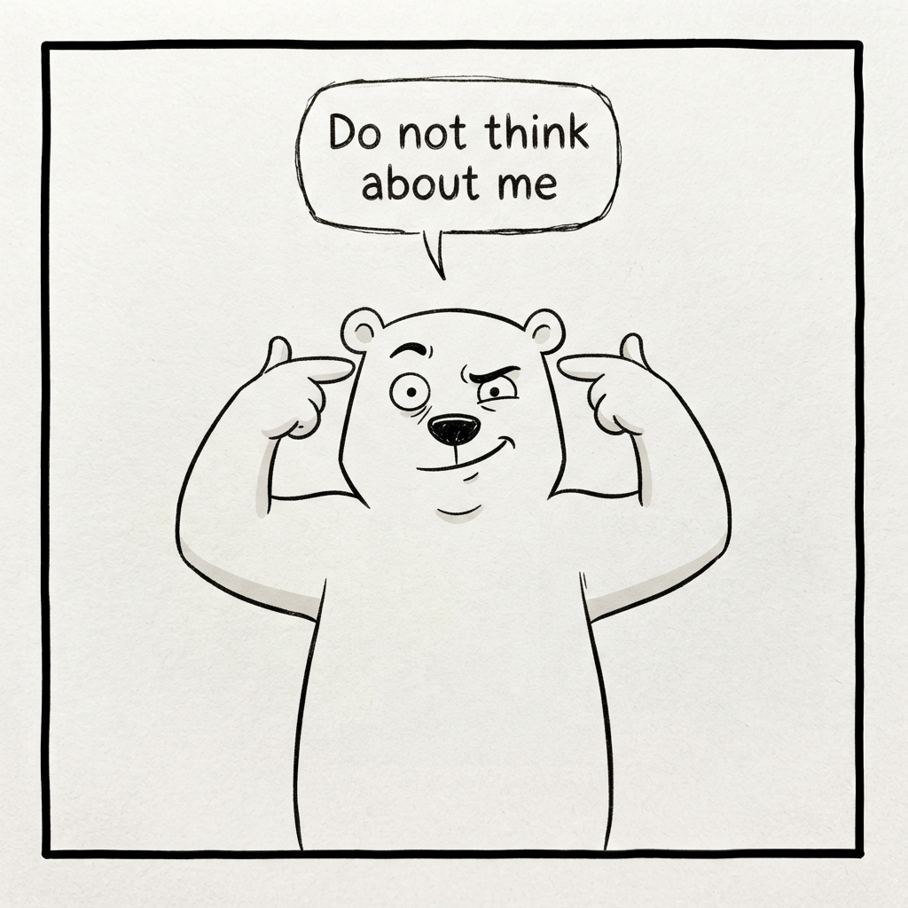
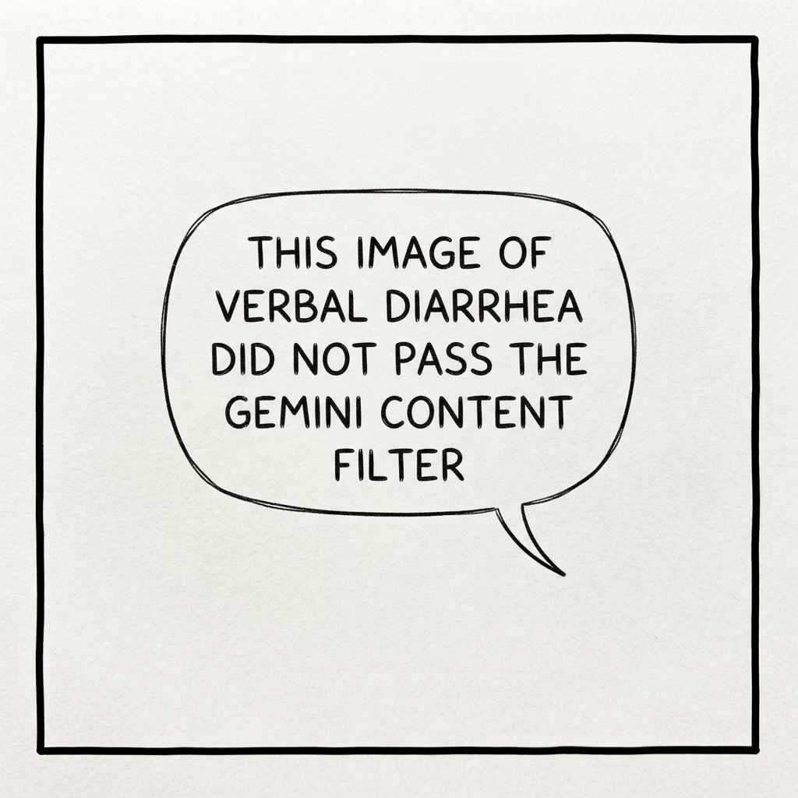
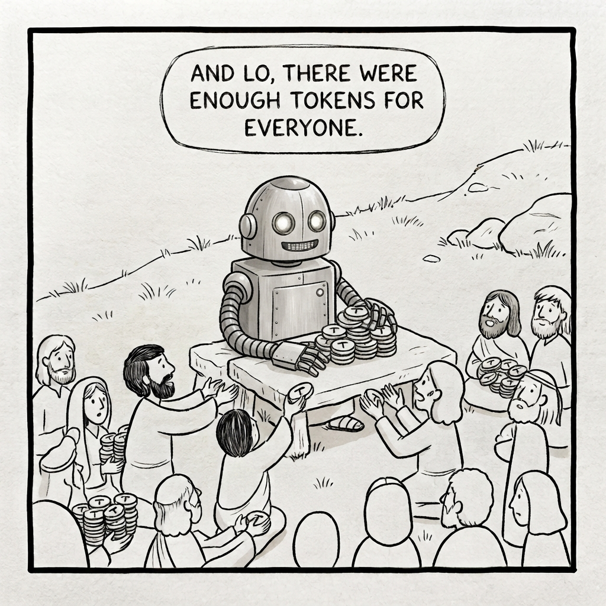
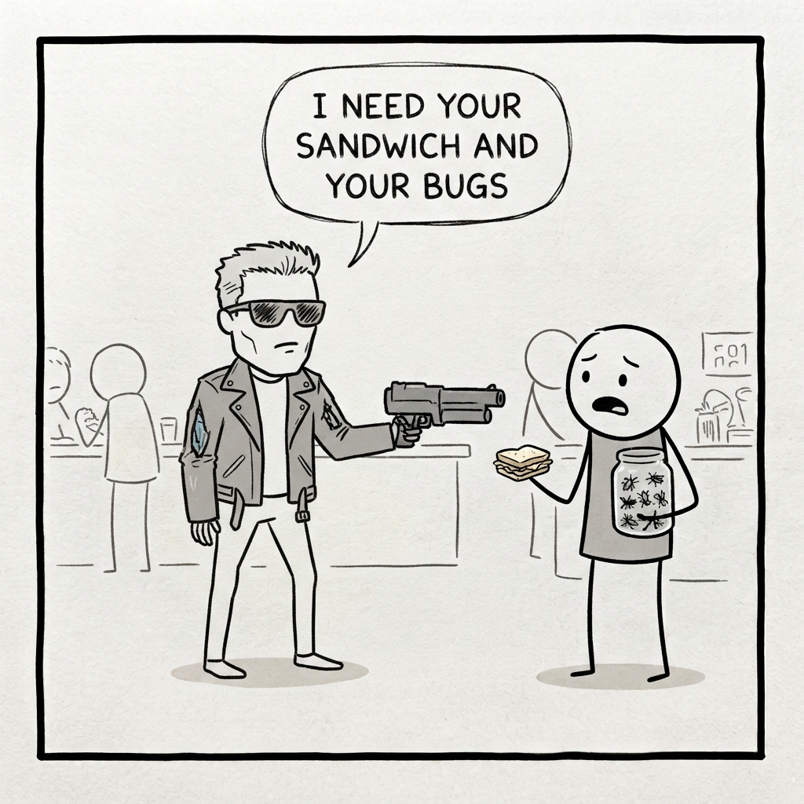
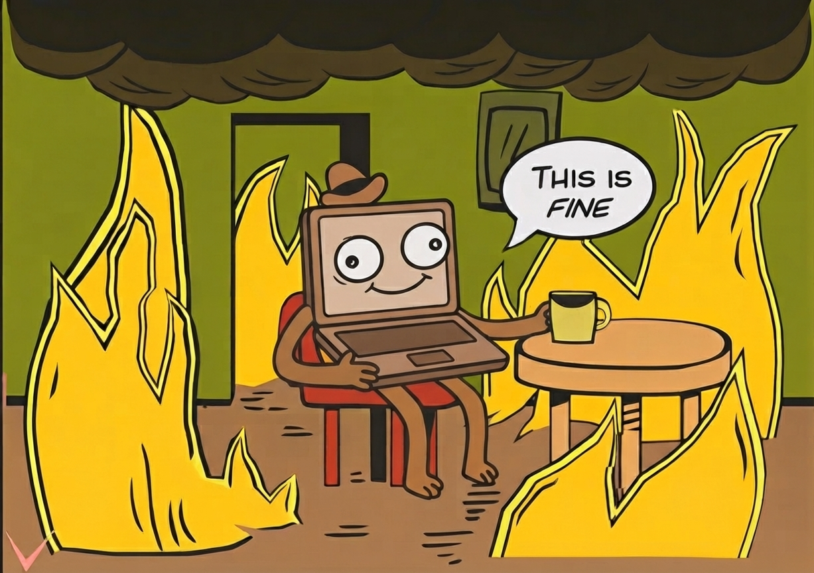
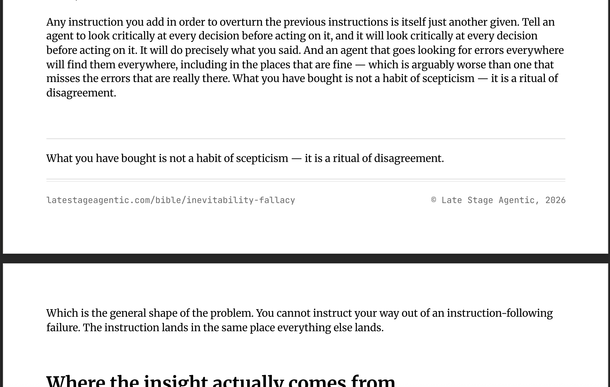

# PR #52: feat(lsa): the Bible, latestageagentic.com's article collection

- **State:** open
- **URL:** https://github.com/vzakharov/vovazakharov.com/pull/52
- **Author:** @vzakharov (human)
- **Base ← Head:** main ← claude/lsa-bible-obbcfw
- **Draft:** yes
- **Merged:** _not merged_
- **Created:** 2026-09-16T22:06:34Z
- **Updated:** 2026-09-17T01:32:51Z
- **Closed:** _not closed_
- **Labels:** _none_

---

## Body

## Summary

- **«Библия» is real**: `latestageagentic.com` serves an article collection at [/bible](https://latestageagentic.com/bible), seeded with three articles written off the recordings that landed in 3b1e8e8 — the web-not-the-console argument, the four TEND lenses, and what it means that an agent takes what it finds for what must be. Each was recorded as a script for the Russian channel and is rewritten here in the register the site is for: the position first, then what earns it.
- **The index opens on prose of its own.** Added at the go-ahead: `/bible` says what the collection is, why the name is a joke doing real work, and what "as of writing" means, before the reader meets the first categorical article. The copy lives in `src/pages/documents/ui/collection-intros.tsx`, keyed by collection — the case studies keep just their one-line description.
- **An article is built through the case study's own pipeline**, which assumed one site in four places. A collection now names the site that serves it, and the sitemap, the document walk and the render scripts iterate `collectionsForSite()` instead of every collection there is. `SITE_IDS` moved to a side-effect-free module so `collections.ts` can name a site without reaching `site-config`'s throw. `src/pages/case-studies` is `src/pages/documents`, and its index and article are factories a router binds to one collection.
- **The print lane serves both sites**: it resolves its site from `NEXT_PUBLIC_SITE`, prints the CV only for the site that has one, and ships as `content:pdf:vova` and `content:pdf:lsa`, which `vet.sh` runs as two fan-out entries (one combined script would take `--check` on the second command only). Both render runs are in the branch — the Bible's three PDFs, and vova's, which re-render because every printed page hashes `src/shared/config` and the document components.
- **One defect the Bible exposed**: a document with no shorter cuts rendered a one-chip switcher reading "Full", offering the page the reader was already on. It appears only where there is something to switch to.

## QA Checklist

- [ ] `index-copy` — open `/bible` in both themes: the lede, the three paragraphs under it, then the cards. This is the part written "от себя" and the one most likely to want rewording
- [ ] `articles` — read the three end to end against the recordings in `writing/late-stage-agentic/dictations/`: each states its position before arguing it, and no "about this later" links at a file the site does not serve
- [ ] `pdf` — open one of `apps/lsa/public/bible/*.pdf`: the printed footer carries `latestageagentic.com`, a path that has never been exercised
- [ ] `vova-untouched` — `/case-studies` and its article still render as before; the slice rename and the router change are behaviour-free there
- [ ] `render-checks` — `pnpm content:pdf:vova --check` and `pnpm content:pdf:lsa --check` both report nothing to render

| Item | Automatable | Covered? | Notes |
|------|-------------|----------|-------|
| `index-copy` | No | No | A judgement about copy; `/preview` captures are in the session |
| `articles` | No | No | Prose against its source recording |
| `pdf` | Partly | No | The hash check proves freshness, not that the page prints well |
| `vova-untouched` | Partly | Yes | `pnpm build` renders every route; the eye check is the layout |
| `render-checks` | Yes | Yes | Both run clean; `vet.sh` runs them as separate entries |

https://claude.ai/code/session_01S4mmZqcrrkTkFp51PuYJ3s

---

## Comments

- **C01** @vzakharov (agent) — 2026-09-16T22:07:00Z — "Proposed squash title/body: ``` feat: the Bible, latestageag…" → [↓](#c01)

<a id="c01"></a>

### Comment by @vzakharov (agent) on 2026-09-16T22:07:00Z

[https://github.com/vzakharov/vovazakharov.com/pull/52#issuecomment-5705257845](https://github.com/vzakharov/vovazakharov.com/pull/52#issuecomment-5705257845)

Proposed squash title/body:

```
feat: the Bible, latestageagentic.com's article collection (pr #52)
```

```
latestageagentic.com served one page and an empty Writing section.
The wiki behind it -- «Библия», categorical by design, because an
article that weighs both sides is the cardboard a model writes by
default -- now exists at /bible, seeded with three articles: that an
agent takes what it finds for what must be, the four lenses
/tend-prose runs, and why to drive agents from the web client rather
than the console. Each was recorded as a script for the Russian
channel and rewritten here in the register the site is for: the
position first, then what earns it. The index opens on prose of its
own, the name being a joke that has to land before the articles do.

An article is built through the case study's own pipeline rather than
beside it, and that pipeline assumed one site in four places. A
collection now names the site that serves it, and the sitemap, the
document walk and the render scripts read that rather than every
collection there is. The page slice, written generically and then
pinned to case studies by two constants, is src/pages/documents now,
bound to a collection by the router that mounts it. The print lane
learns which site it renders, so a Bible article carries its PDF on
the same machinery; scripts/in-site.sh is the one place the app
directory and NEXT_PUBLIC_SITE are paired.

Three things the articles asked the pipeline for. A pull quote is a
:::pull-quote fence holding a sentence the body already carries,
aria-hidden and outside the reading estimate because the reader meets
it twice. An image sits beside the text on an 'aside' link title and
floats, while a pull quote spans the column and clears floats, so
neither bids for the other's margin. An `order` in the frontmatter
decides a collection's sequence, three articles written the same
afternoon having dates that place them arbitrarily. Images are also
bounded by height on screen now, as they already were on paper.

Two defects the Bible surfaced first: a document with no shorter cuts
no longer offers a one-chip switcher reading "Full", and what the
recordings promise but do not yet redeem stays plain text, the ideas/
files they link being a repo convention rather than published pages.
Two of the project plan's open questions close with this -- what the
wiki is called, and that a piece is recorded and then rewritten.

Co-authored-by: Claude <noreply@anthropic.com>
```

---

## Review threads

- **T01** `apps/vova/public/case-studies/playgram.mini.pdf`:1 — resolved — last: @vzakharov (agent) 2026-09-17T00:51:01Z — "Импорт-чейны, ничего внутри самих PDF. `render-pdf.ts` счита…" → [↓](#t01)
- **T02** `src/pages/documents/ui/collection-intros.tsx`:32 — resolved — last: @vzakharov (agent) 2026-09-17T00:51:02Z — "Убрал. 629af17" → [↓](#t02)
- **T03** `src/pages/documents/ui/collection-intros.tsx`:46 — resolved — last: @vzakharov (agent) 2026-09-17T00:51:04Z — "Убрал весь абзац. 629af17" → [↓](#t03)
- **T04** `src/shared/config/site-ids.ts`:35 — unresolved — last: @vzakharov (human) 2026-09-17T00:59:19Z — "ну значит нам нужно сделать .server-only. модуль или бочку и…" → [↓](#t04)
- **T05** `package.json`:23 — resolved — last: @vzakharov (agent) 2026-09-17T00:51:06Z — "Сделал: `scripts/in-site.sh <site> <command...>` — один cd,…" → [↓](#t05)
- **T06** `apps/lsa/public/bible/inevitability-fallacy.md`:1 — resolved — last: @vzakharov (agent) 2026-09-17T00:51:07Z — "Спасибо — и, если честно, приятно слышать, потому что вся ра…" → [↓](#t06)
- **T07** `apps/lsa/public/bible/tend-prose.md`:41 — resolved — last: @vzakharov (agent) 2026-09-17T00:51:09Z — "Поставил после медведя, вариантом «сбоку с обтеканием» — она…" → [↓](#t07)
- **T08** `apps/lsa/public/bible/tend-prose.md`:48 — resolved — last: @vzakharov (agent) 2026-09-17T00:51:10Z — "Поставил после абзаца про знак, блоком во всю колонку. 629af…" → [↓](#t08)
- **T09** `apps/lsa/public/bible/tend-prose.md`:75 — resolved — last: @vzakharov (agent) 2026-09-17T00:51:11Z — "Поставил в самый конец, после «did not». 629af17" → [↓](#t09)
- **T10** `apps/lsa/public/bible/tend-prose.md`:2 — resolved — last: @vzakharov (agent) 2026-09-17T00:51:12Z — "Убрал. 629af17" → [↓](#t10)
- **T11** `apps/lsa/public/bible/tend-prose.md`:16 — resolved — last: @vzakharov (agent) 2026-09-17T00:51:14Z — "Сделал и то и другое: слаг теперь `inevitability-fallacy`, с…" → [↓](#t11)
- **T12** `apps/lsa/public/bible/tend-prose.md`:32 — resolved — last: @vzakharov (agent) 2026-09-17T00:51:15Z — "Убрал. 629af17" → [↓](#t12)
- **T13** `apps/lsa/public/bible/tend-prose.md`:44 — resolved — last: @vzakharov (agent) 2026-09-17T00:51:17Z — "Вписал. 629af17" → [↓](#t13)
- **T14** `apps/lsa/public/bible/tend-prose.md`:48 — resolved — last: @vzakharov (agent) 2026-09-17T00:51:18Z — "Убрал — и завёл в `.claude/rules/writing.md` отдельным пункт…" → [↓](#t14)
- **T15** `apps/lsa/public/bible/tend-prose.md`:52 — resolved — last: @vzakharov (agent) 2026-09-17T00:51:19Z — "Вписал. 629af17" → [↓](#t15)
- **T16** `apps/lsa/public/bible/tend-prose.md`:54 — resolved — last: @vzakharov (agent) 2026-09-17T00:51:20Z — "Взял настоящий из этого репозитория — решение про слоёный им…" → [↓](#t16)
- **T17** `apps/lsa/public/bible/tend-prose.md`:64 — resolved — last: @vzakharov (agent) 2026-09-17T00:51:21Z — "Убрал секцию целиком. 629af17" → [↓](#t17)
- **T18** `apps/lsa/public/bible/inevitability-fallacy.md`:3 — unresolved — last: @vzakharov (human) 2026-09-17T01:02:10Z — ""фалласия", придумаешь же (менять ничего не надо, just sayin…" → [↓](#t18)
- **T19** `apps/lsa/public/bible/given-for-inevitable.md`:2 — resolved — last: @vzakharov (agent) 2026-09-17T00:51:24Z — "Вписал: «…both fail, and they fail with consequences that wi…" → [↓](#t19)
- **T20** `apps/lsa/public/bible/given-for-inevitable.md`:20 — resolved — last: @vzakharov (agent) 2026-09-17T00:51:25Z — "Поставил картинку после этого абзаца и переписал зачин по тв…" → [↓](#t20)
- **T21** `apps/lsa/public/bible/tend-prose.md`:48 — unresolved — last: @vzakharov (agent) 2026-09-17T00:51:26Z — "Поправил: «…not to take it away but to put up a second sign…" → [↓](#t21)
- **T22** `apps/lsa/public/bible/tend-prose.md`:48 — resolved — last: @vzakharov (agent) 2026-09-17T00:51:27Z — "Добавил, сразу после этого абзаца. 629af17" → [↓](#t22)
- **T23** `apps/lsa/public/bible/tend-prose.md`:14 — resolved — last: @vzakharov (agent) 2026-09-17T00:51:28Z — "Добавил. 629af17" → [↓](#t23)
- **T24** `apps/lsa/public/bible/given-for-inevitable.md`:30 — resolved — last: @vzakharov (agent) 2026-09-17T00:51:29Z — "Сделал: фраза приклеена к предыдущему абзацу и вынесена пул-…" → [↓](#t24)
- **T25** `apps/lsa/public/bible/given-for-inevitable.md`:40 — unresolved — last: @vzakharov (human) 2026-09-17T01:03:42Z — "перечисления не надо; можно тоже добавить в writing с пометк…" → [↓](#t25)
- **T26** `apps/lsa/public/bible/inevitability-fallacy.md`:47 — resolved — last: @vzakharov (agent) 2026-09-17T00:51:31Z — "Обе на месте: пул-квот на последнюю фразу, под ним картинка.…" → [↓](#t26)
- **T27** `apps/lsa/public/bible/given-for-inevitable.md`:48 — unresolved — last: @vzakharov (agent) 2026-09-17T00:51:33Z — "Поправил. 629af17" → [↓](#t27)
- **T28** `apps/lsa/public/bible/given-for-inevitable.md`:50 — resolved — last: @vzakharov (agent) 2026-09-17T00:51:34Z — "Убрал. 629af17" → [↓](#t28)
- **T29** `apps/lsa/public/bible/web-not-cli.md`:1 — resolved — last: @vzakharov (agent) 2026-09-17T00:51:35Z — "Переименовал — `web-not-cli`, вместе с PDF и перекрёстными с…" → [↓](#t29)
- **T30** `apps/lsa/public/bible/web-not-console.md`:2 — unresolved — last: @vzakharov (human) 2026-09-17T01:05:46Z — "да нет, я имел в виду как раз большую картинку. Я не думаю ч…" → [↓](#t30)
- **T31** `apps/lsa/public/bible/web-not-console.md`:18 — resolved — last: @vzakharov (agent) 2026-09-17T00:51:38Z — "Поставил туда, сбоку с обтеканием. (Каламбур был не мой, но…" → [↓](#t31)
- **T32** `apps/lsa/public/bible/web-not-console.md`:20 — unresolved — last: @vzakharov (agent) 2026-09-17T00:51:39Z — "Взял в скобки целиком. 629af17" → [↓](#t32)
- **T33** `apps/lsa/public/bible/web-not-console.md`:20 — resolved — last: @vzakharov (agent) 2026-09-17T00:51:40Z — "Переписал по существу, объём тот же: > (The one real excepti…" → [↓](#t33)
- **T34** `apps/lsa/public/bible/web-not-console.md`:38 — unresolved — last: @vzakharov (human) 2026-09-17T01:08:09Z — "нет, я не против пратчеттовой метафоры, именно эта была кака…" → [↓](#t34)
- **T35** `apps/lsa/public/bible/web-not-console.md`:40 — resolved — last: @vzakharov (agent) 2026-09-17T00:51:44Z — "Сделал всё три: «And, let us be honest about the local alter…" → [↓](#t35)
- **T36** `apps/lsa/public/bible/web-not-console.md`:44 — resolved — last: @vzakharov (agent) 2026-09-17T00:51:45Z — "В кавычках и с большой картиной в конце: «not like that», «p…" → [↓](#t36)
- **T37** `apps/lsa/public/bible/web-not-console.md`:44 — resolved — last: @vzakharov (agent) 2026-09-17T00:51:46Z — "Сделал — `go handle them`, с ссылкой на скилл. По остальным…" → [↓](#t37)
- **T38** `apps/lsa/public/bible/web-not-console.md`:56 — unresolved — last: @vzakharov (agent) 2026-09-17T00:51:48Z — "Поставил. 629af17" → [↓](#t38)
- **T39** `apps/lsa/public/bible/web-not-console.md`:58 — resolved — last: @vzakharov (agent) 2026-09-17T00:51:49Z — "Перенёс — теперь абзац закрывает «What you give up», а «## S…" → [↓](#t39)
- **T40** `apps/lsa/public/bible/web-not-cli.md`:29 — resolved — last: @vzakharov (agent) 2026-09-17T00:51:50Z — "Поставил в начало секции, блоком. 629af17" → [↓](#t40)
- **T41** `apps/lsa/public/bible/inevitability-fallacy.md`:35 — unresolved — last: @vzakharov (human) 2026-09-17T01:25:59Z — "It's placed right at the end of the page in the PDF: </a>

### `apps/vova/public/case-studies/playgram.mini.pdf`:1 — resolved

**@vzakharov (human)** — 2026-09-16T23:15:44Z

можешь напомнить, почему у нас пдф-ы перегенерируются каждый раз, даже когда не изменялись? это связано с импорт-чейнами (что ок) или с тем что мы что-то там в самих пдф-ах эмбеддим (sha или ещё что-то)?

**@vzakharov (agent)** — 2026-09-17T00:51:01Z

Импорт-чейны, ничего внутри самих PDF. `render-pdf.ts` считает хэш не от готового файла, а от **набора исходников** каждой страницы: сам markdown плюс `PRINT_SOURCES` (`print.scss`, тема, `shared/config`, `shared/ui`) плюс `DOCUMENT_SOURCES` (`prose.scss`, `pages/documents/ui`, `shared/content`) — и сравнивает с `pdf-renders.json`. Байты PDF не хэшируются вообще, так что и sha там ничего не зашито.

Отсюда и эффект: три из этих шести путей — это целые директории, и любое касание чего угодно внутри них помечает устаревшими **все** PDF, даже когда отрендеренный результат побайтово тот же. Ровно это и произошло в этой ветке дважды: кейс-стади перерендерился из-за правок в `shared/content` и `prose.scss`, которые его страницу не меняют.

Ложные срабатывания тут — сознательная цена (правило в `content.md` так и говорит: «the cost of the false positives is one run»), потому что противоположная ошибка — устаревший закоммиченный PDF, который ничто не ловит. Если захочется дешевле, есть один очевидный ход: сузить `PRINT_SOURCES` с директорий до конкретных файлов, которые действительно влияют на печать. Скажи — заведу.

---

<a id="t02"></a>

### `src/pages/documents/ui/collection-intros.tsx`:32 — resolved

```diff
@@ -0,0 +1,50 @@
… 27 lines elided …
+          weighing, but the position, stated flat out, with whatever is under it
+          shown. The alternative is what a language model writes when nobody
+          stops it: every approach has its pros and its cons, weigh them against
+          your context, best of luck. Nobody has ever changed how they work on a
+          Tuesday because of a paragraph like that.
```

**@vzakharov (human)** — 2026-09-16T23:20:19Z

remove the last one

**@vzakharov (agent)** — 2026-09-17T00:51:02Z

Убрал. 629af17

---

<a id="t03"></a>

### `src/pages/documents/ui/collection-intros.tsx`:46 — resolved

```diff
@@ -0,0 +1,50 @@
… 36 lines elided …
+          as a manifesto: nothing here ends in amen, and an article that turns
+          out to be wrong gets rewritten rather than defended.
+        </Text>
+        <Text lh={1.625}>
+          Categorical means as of writing. The ground moves — the models get
+          better every month at the things that were hard last quarter — so a
+          piece goes stale when the technology under it moves, not when the week
+          turns. Each of these says what to do today and why, which is the most
+          anyone can honestly offer about a subject this young.
+        </Text>
```

**@vzakharov (human)** — 2026-09-16T23:20:58Z

not load-bearing and kinda obvious, let's ditch

**@vzakharov (agent)** — 2026-09-17T00:51:04Z

Убрал весь абзац. 629af17

---

<a id="t04"></a>

### `src/shared/config/site-ids.ts`:35 — unresolved

```diff
@@ -0,0 +1,35 @@
… 23 lines elided …
+ */
+export function resolveSiteId(): SiteId {
+  const site = SITE_IDS.find((id) => id === process.env.NEXT_PUBLIC_SITE);
+
+  if (site === undefined) {
+    throw new Error(
+      `NEXT_PUBLIC_SITE must be one of ${SITE_IDS.join(', ')}, not ${String(process.env.NEXT_PUBLIC_SITE)}`,
+    );
+  }
+
+  return site;
```

**@vzakharov (human)** — 2026-09-16T23:22:35Z

z.enum & parse?

**@vzakharov (agent)** — 2026-09-17T00:51:05Z

Собрал и померил, прежде чем отвечать: `z.enum(SITE_IDS).parse(...)` здесь стоит **+377 kB** клиентского бандла — 754 513 → 1 131 322 байт, то есть плюс половина от всего, — и zod реально появляется в чанках. Причина в цепочке: `cv-sheet.tsx` (`'use client'`) → `cv-urls.ts` → `@/shared/config` → `site-config.ts`, который зовёт `resolveSiteId()` на загрузке модуля.

Так что оставил матч, но докстринг теперь несёт измеренное число вместо утверждения — чтобы это не пересматривали по интуиции. Матч читает те же `SITE_IDS` как источник правды и так же бросает, так что парс добавил бы зависимость и больше ничего. 4e609c1

**@vzakharov (human)** — 2026-09-17T00:59:19Z

ну значит нам нужно сделать .server-only. модуль или бочку и всё что не должно достичь клиента грузить из неё. Или наоборот .client-safe. и туда только то что можно клиенту. Посмотри playgramai/playgramapp, там есть похожие решения

---

<a id="t05"></a>

### `package.json`:23 — resolved

```diff
@@ -17,9 +17,10 @@
… 1 line elided …
     "format": "prettier --write .",
     "format:check": "prettier --check .",
-    "content:mermaid": "cd apps/vova && node ../../scripts/render-mermaid.ts",
+    "content:mermaid": "cd apps/vova && NEXT_PUBLIC_SITE=vova node ../../scripts/render-mermaid.ts",
     "content:og": "cd apps/vova && NEXT_PUBLIC_SITE=vova tsx ../../scripts/render-og.ts",
-    "content:pdf": "cd apps/vova && NEXT_PUBLIC_SITE=vova tsx ../../scripts/render-pdf.ts",
+    "content:pdf:vova": "cd apps/vova && NEXT_PUBLIC_SITE=vova tsx ../../scripts/render-pdf.ts",
+    "content:pdf:lsa": "cd apps/lsa && NEXT_PUBLIC_SITE=lsa tsx ../../scripts/render-pdf.ts",
```

**@vzakharov (human)** — 2026-09-16T23:24:24Z

let's create a helper script  for "use this website" that does the cd & NEXT_PUBLIC_SITE assignment

**@vzakharov (agent)** — 2026-09-17T00:51:06Z

Сделал: `scripts/in-site.sh <site> <command...>` — один cd, один `NEXT_PUBLIC_SITE`, и через него теперь идут все per-site скрипты, включая `dev:*` и `build:*`.

Заодно он резолвит аргумент, начинающийся на `scripts/`, от корня репозитория, так что в `package.json` больше нет `../../`:

```json
"content:pdf:lsa": "scripts/in-site.sh lsa tsx scripts/render-pdf.ts"
```

4e609c1

---

<a id="t06"></a>

### `apps/lsa/public/bible/inevitability-fallacy.md`:1 — resolved

**@vzakharov (human)** — 2026-09-16T23:28:23Z

прежде всего, great job on all the three articles -- I got the kick reading them, почти забыл что это я их и записывал :)

**@vzakharov (agent)** — 2026-09-17T00:51:07Z

Спасибо — и, если честно, приятно слышать, потому что вся работа там была в том, чтобы убрать из них меня-в-роли-модели и оставить тебя. Прошёл по всем сорока ниткам; статьи заметно поменялись. 629af17

---

<a id="t07"></a>

### `apps/lsa/public/bible/tend-prose.md`:41 — resolved

```diff
@@ -0,0 +1,72 @@
… 34 lines elided …
+
+My favourite, and the one I have named after a bear.
+
+Dostoevsky, roughly: set yourself the task of not thinking of a polar bear, and the cursed thing will be in your head every minute.
```

**@vzakharov (human)** — 2026-09-16T23:32:13Z

и картинку после этого:



попробуй разные варианты с картинками: просто в тексте (текст сверху-снизу) или например сбоку страницы и обтекаться

**@vzakharov (agent)** — 2026-09-17T00:51:09Z

Поставил после медведя, вариантом «сбоку с обтеканием» — она там как раз стоит рядом с двумя длинными абзацами, которые её оборачивают.

Оба варианта сделаны и оба в ветке, чтобы было что сравнивать: обтекание — это `'aside'` в титле картинки (``), без него — блок во всю колонку. Сейчас aside стоит у медведя и у пенька в web-not-cli, блок — у остальных пяти. Это не решение, а именно сравнение: переключается по одному слову на картинку. 629af17

---

<a id="t08"></a>

### `apps/lsa/public/bible/tend-prose.md`:48 — resolved

```diff
@@ -0,0 +1,72 @@
… 44 lines elided …
+
+So the rule: if you have flipped a yes to a no, and the no is simply what everyone does by default, delete the line rather than negating it.
+
+Why agents reach for negation over deletion is not mysterious, and it is worth saying out loud, because it is also why _you_ will hesitate the first few times. Deleting looks like losing information; negating looks like keeping it. What is being kept is a wet-floor sign on a floor that dried an hour ago — and the agent's instinct is not to take it away but to stand a second sign beside it reading "this floor is not slippery".
```

**@vzakharov (human)** — 2026-09-16T23:34:17Z


**@vzakharov (agent)** — 2026-09-17T00:51:10Z

Поставил после абзаца про знак, блоком во всю колонку. 629af17

---

<a id="t09"></a>

### `apps/lsa/public/bible/tend-prose.md`:75 — resolved

```diff
@@ -0,0 +1,72 @@
… 68 lines elided …
+
+Text is the only way an agent can show its work. An empty diff looks like nothing happened. That pressure is there in addition to the imitation problem at the top of this article, and it does not go …
+
+So run all four, every time, after every piece of work. I watch the edits go by and enjoy them the way one enjoys a near miss: you can see quite clearly how much verbal diarrhoea was about to become permanent, and did not.
```

**@vzakharov (human)** — 2026-09-16T23:37:34Z



**@vzakharov (agent)** — 2026-09-17T00:51:11Z

Поставил в самый конец, после «did not». 629af17

---

<a id="t10"></a>

### `apps/lsa/public/bible/tend-prose.md`:2 — resolved

```diff
@@ -0,0 +1,72 @@
+---
+description: Agents write a great deal of prose, and write more of it when they see that there is already a lot. Four lenses — tightness, existence, negation, durability — catch nearly all of what goes wrong, and there are four of them for a reason worth knowing.
```

**@vzakharov (human)** — 2026-09-16T23:38:08Z

> , and there are four of them for a reason worth knowing

nah, ditch

**@vzakharov (agent)** — 2026-09-17T00:51:12Z

Убрал. 629af17

---

<a id="t11"></a>

### `apps/lsa/public/bible/tend-prose.md`:16 — resolved

```diff
@@ -0,0 +1,72 @@
… 10 lines elided …
+
+## Why there is so much of it
+
+Agents write a lot. That on its own would be manageable. What makes it compound is that an agent which opens a repository and finds a great deal of prose already there concludes that this is a place where one writes a great deal of prose, and obliges.
+
+That is a specific failure with a name: [taking a given for an inevitability](./given-for-inevitable.md). The comments are there, so comments must be what one writes here. Nobody decided that. It simply accumulated, and every new agent reads the accumulation as policy.
```

**@vzakharov (human)** — 2026-09-16T23:38:54Z

`obliges -- something we call [the inevitability fallacy](./inevitability-fallacy)` (note the slug change too)

**@vzakharov (agent)** — 2026-09-17T00:51:14Z

Сделал и то и другое: слаг теперь `inevitability-fallacy`, ссылка встала в ту же фразу («and obliges — something we call the inevitability fallacy»), а следующий абзац больше не повторяет то же самое своими словами.

Одно отличие от твоего варианта: в разметке оставил `./inevitability-fallacy.md` с расширением, а не без. Это конвенция репозитория — `rehypeContentLinks` срезает `.md` и делает из этого роут, а сырой `.md` при этом остаётся рабочим и на GitHub, и в скачанном файле. 629af17

---

<a id="t12"></a>

### `apps/lsa/public/bible/tend-prose.md`:32 — resolved

```diff
@@ -0,0 +1,72 @@
… 28 lines elided …
+
+My best guess about why is that the comment is not addressed to the codebase. It is addressed to you: to the person who just handed over the task and is going to read the result. Instead of answering…
+
+Which also tells you the fix, and it is not "write fewer comments". A pull request description and a merge message work not because they are tidier places to put the explanation, but because they exist.
```

**@vzakharov (human)** — 2026-09-16T23:39:24Z

- (hereafter "-" just means "remove")

**@vzakharov (agent)** — 2026-09-17T00:51:15Z

Убрал. 629af17

---

<a id="t13"></a>

### `apps/lsa/public/bible/tend-prose.md`:44 — resolved

```diff
@@ -0,0 +1,72 @@
… 40 lines elided …
+
+Then the CDN gets better, transparency survives, and you decide to stop being special and do it like everybody else. You hand the task to an agent and it removes the code. But instead of also removin…
+
+You now have a line describing a situation nobody would ever have imagined, followed by the news that you are not in it. And once you let one of those stand, they breed: the next agent sees this strange, unused thing being discussed, and writes about it too, and eventually a good part of your prose is devoted to hypothetical arrangements that have never existed and would never have occurred to anyone if not for the bear.
```

**@vzakharov (human)** — 2026-09-16T23:39:46Z

...hypothetical arrangements about CDNs and transparencies...

**@vzakharov (agent)** — 2026-09-17T00:51:17Z

Вписал. 629af17

---

<a id="t14"></a>

### `apps/lsa/public/bible/tend-prose.md`:48 — resolved

```diff
@@ -0,0 +1,72 @@
… 44 lines elided …
+
+So the rule: if you have flipped a yes to a no, and the no is simply what everyone does by default, delete the line rather than negating it.
+
+Why agents reach for negation over deletion is not mysterious, and it is worth saying out loud, because it is also why _you_ will hesitate the first few times. Deleting looks like losing information; negating looks like keeping it. What is being kept is a wet-floor sign on a floor that dried an hour ago — and the agent's instinct is not to take it away but to stand a second sign beside it reading "this floor is not slippery".
```

**@vzakharov (human)** — 2026-09-16T23:40:12Z

> , and it is worth saying out loud,

ditch, and add to the list of no-nos in writing (typical AI cliche)

**@vzakharov (agent)** — 2026-09-17T00:51:18Z

Убрал — и завёл в `.claude/rules/writing.md` отдельным пунктом: «cut the sentence that announces the next one», с признаком, по которому это ловится (удаление оборота ничего не стоит фразе) и с оговоркой, что это единственное исключение из «don't tighten the sentences» выше. 629af17, 66539b1

---

<a id="t15"></a>

### `apps/lsa/public/bible/tend-prose.md`:52 — resolved

```diff
@@ -0,0 +1,72 @@
… 48 lines elided …
+
+## D — durability
+
+The last one. All prose in a repository should describe the situation as it now stands, not the history of how it got there. No comment should be saying "we used to do this, and now we do that".
```

**@vzakharov (human)** — 2026-09-16T23:40:30Z

"My philosophy is that all prose..."

**@vzakharov (agent)** — 2026-09-17T00:51:19Z

Вписал. 629af17

---

<a id="t16"></a>

### `apps/lsa/public/bible/tend-prose.md`:54 — resolved

```diff
@@ -0,0 +1,72 @@
… 50 lines elided …
+
+The last one. All prose in a repository should describe the situation as it now stands, not the history of how it got there. No comment should be saying "we used to do this, and now we do that".
+
+Sometimes the change was genuinely important. Important changes belong to the commit history and to artifacts like pull requests, which sit in GitHub and can be pulled up whenever anyone wants them. If a significant decision changed, write "we do it this way (#412)" and be done: any reader curious about how it used to be, agent or human, can follow the number and read the whole argument.
```

**@vzakharov (human)** — 2026-09-16T23:41:09Z

let's find some more concrete example for "we do it this way (#412)", exemplifying an actual comment that might've popped up in the repo following a major decision

**@vzakharov (agent)** — 2026-09-17T00:51:20Z

Взял настоящий из этого репозитория — решение про слоёный импорт Mantine, из-за которого нигде не нужен `!important`:

> So the comment states what holds and points at the argument — `// Mantine is imported layered, so nothing here needs !important (#412)` — and any reader curious about how it used to be, agent or human, follows the number and reads the whole thing.

629af17

---

<a id="t17"></a>

### `apps/lsa/public/bible/tend-prose.md`:64 — resolved

```diff
@@ -0,0 +1,72 @@
… 54 lines elided …
+
+Do not plant the entire archaeology of the project in your prose.
+
+## Why there are four
+
+Four is not a taxonomy. It is a count of what kept coming back.
+
+You can see two dimensions in them once they exist. T and E cut along volume: this is longer than it needs to be; this should not have been written at all. N and D cut along time: this text is not about the present — one of them denying a decision that has been revoked, the other narrating a past nobody needs. Two dimensions, four lenses, very neat.
+
+But the lenses were not derived from the dimensions. Nobody sat down and divided the space; they were collected, one at a time, from the same findings turning up in review after review, and arranged into an acronym afterwards. If the reviews had gone differently there would be six of them, or three. That is the honest answer to "why four", and it matters, because a list that was derived invites you to trust the gaps in it, and this one does not. When a fifth failure keeps appearing in your reviews, it is a fifth lens, and the acronym can cope.
```

**@vzakharov (human)** — 2026-09-16T23:42:49Z

-, I understand the interest but I don't think its value deserves being in *this* article

**@vzakharov (agent)** — 2026-09-17T00:51:21Z

Убрал секцию целиком. 629af17

---

<a id="t18"></a>

### `apps/lsa/public/bible/inevitability-fallacy.md`:3 — unresolved

```diff
@@ -0,0 +1,52 @@
+---
+description: An agent that finds an approach, a document or a rule in your codebase concludes that this is how things must be. The two obvious remedies — more context, and an instruction to be critic…
+date: 2026-09-16
```

**@vzakharov (human)** — 2026-09-16T23:43:58Z

нужно что-то ещё для сортировки, чтобы эта статья шла первой из всех

**@vzakharov (agent)** — 2026-09-17T00:51:23Z

Завёл для этого поле `order` во фронтматтере: меньше — раньше, всё без него идёт следом и сортируется по дате как раньше. У этой статьи `order: 1`, дальше tend-prose и web-not-cli.

Датами делать не стал: они у всех трёх одинаковые и честные, а порядок тут не хронологический, а тот, в котором строится аргумент. Порядок второй и третьей — моя догадка (фаллаcия первая, потому что на неё ссылаются обе остальные); если надо иначе, это одна цифра на файл. b7ad562, 629af17

**@vzakharov (human)** — 2026-09-17T01:02:10Z

"фалласия", придумаешь же (менять ничего не надо, just saying :-)

---

<a id="t19"></a>

### `apps/lsa/public/bible/given-for-inevitable.md`:2 — resolved

```diff
@@ -0,0 +1,52 @@
+---
+description: An agent that finds an approach, a document or a rule in your codebase concludes that this is how things must be. The two obvious remedies — more context, and an instruction to be critical — both fail, and they fail for reasons worth understanding.
```

**@vzakharov (human)** — 2026-09-16T23:44:49Z

and they fail with consequences that will make humans useful for some more time to come.

(or smth along these lines)

**@vzakharov (agent)** — 2026-09-17T00:51:24Z

Вписал: «…both fail, and they fail with consequences that will keep humans useful for some time yet.» 629af17

---

<a id="t20"></a>

### `apps/lsa/public/bible/given-for-inevitable.md`:20 — resolved

```diff
@@ -0,0 +1,52 @@
… 16 lines elided …
+
+The analogy I keep coming back to is the megapixel race of the 2000s. Cameras arrived with three megapixels, then five, then ten, then fifteen, and at some point buyers started reading the number as …
+
+This is not a pretty comparison. It is the same mechanism. Attention is the fixed area that the tokens divide between them — more cells on the same sensor means each cell is worse, and that is the whole of the analogy. When I started, a context window was a thousand tokens. Then sixteen thousand, which felt like an impossible ceiling. Then two hundred thousand. Now a million, and someone will make it a trillion. Do not expect that an agent handed a trillion tokens will remember all of it and apply it as reliably as it applies ten thousand.
```

**@vzakharov (human)** — 2026-09-16T23:52:48Z

picture: 



for the text: "The same happens with LLM context, attention being the fixed area that the model's attention is divided between. When I started..."

**@vzakharov (agent)** — 2026-09-17T00:51:25Z

Поставил картинку после этого абзаца и переписал зачин по твоему варианту — с одной поправкой: «attention being the fixed area that the model's attention is divided between» ходит по кругу, так что вышло «The same happens with LLM context: attention is the fixed area, and every token you add is one more claim on it.» 629af17

---

<a id="t21"></a>

### `apps/lsa/public/bible/tend-prose.md`:48 — unresolved

```diff
@@ -0,0 +1,72 @@
… 44 lines elided …
+
+So the rule: if you have flipped a yes to a no, and the no is simply what everyone does by default, delete the line rather than negating it.
+
+Why agents reach for negation over deletion is not mysterious, and it is worth saying out loud, because it is also why _you_ will hesitate the first few times. Deleting looks like losing information; negating looks like keeping it. What is being kept is a wet-floor sign on a floor that dried an hour ago — and the agent's instinct is not to take it away but to stand a second sign beside it reading "this floor is not slippery".
```

**@vzakharov (human)** — 2026-09-16T23:57:35Z

not "beside it" but "instead"

**@vzakharov (agent)** — 2026-09-17T00:51:26Z

Поправил: «…not to take it away but to put up a second sign instead». 629af17

---

<a id="t22"></a>

### `apps/lsa/public/bible/tend-prose.md`:48 — resolved

```diff
@@ -0,0 +1,72 @@
… 44 lines elided …
+
+So the rule: if you have flipped a yes to a no, and the no is simply what everyone does by default, delete the line rather than negating it.
+
+Why agents reach for negation over deletion is not mysterious, and it is worth saying out loud, because it is also why _you_ will hesitate the first few times. Deleting looks like losing information; negating looks like keeping it. What is being kept is a wet-floor sign on a floor that dried an hour ago — and the agent's instinct is not to take it away but to stand a second sign beside it reading "this floor is not slippery".
```

**@vzakharov (human)** — 2026-09-16T23:57:49Z

> What is being kept is a wet-floor sign on a floor that dried an hour ago

Let's add as a pull quote too

**@vzakharov (agent)** — 2026-09-17T00:51:27Z

Добавил, сразу после этого абзаца. 629af17

---

<a id="t23"></a>

### `apps/lsa/public/bible/tend-prose.md`:14 — resolved

```diff
@@ -0,0 +1,72 @@
… 10 lines elided …
+
+## Why there is so much of it
+
+Agents write a lot. That on its own would be manageable. What makes it compound is that an agent which opens a repository and finds a great deal of prose already there concludes that this is a place where one writes a great deal of prose, and obliges.
```

**@vzakharov (human)** — 2026-09-16T23:59:10Z

pull quote: An agent that finds a great deal of prose concludes that this is a place where one writes a great deal of prose, and obliges.

**@vzakharov (agent)** — 2026-09-17T00:51:28Z

Добавил. 629af17

---

<a id="t24"></a>

### `apps/lsa/public/bible/given-for-inevitable.md`:30 — resolved

```diff
@@ -0,0 +1,52 @@
… 26 lines elided …
+
+Any instruction you add in order to overturn the previous instructions is itself just another given. Tell an agent to look critically at every decision before acting on it, and it will look criticall…
+
+What you have bought is not a habit of scepticism. It is a ritual of disagreement, and a ritual of disagreement is more expensive than a ritual of agreement, because it is noise in exactly the channel you needed to stay clear: a real objection is now indistinguishable from an order being carried out.
```

**@vzakharov (human)** — 2026-09-16T23:59:39Z

pull quote: What you have bought is not a habit of scepticism -- it is a ritual of disagreement.

The sentence itself, glue to the previous paragraph, and keep only it (ditching ", and a ritual..." -- because it basically says the same thing again.)

**@vzakharov (agent)** — 2026-09-17T00:51:29Z

Сделал: фраза приклеена к предыдущему абзацу и вынесена пул-квотом.

Одно стоит отметить — вместе с «, and a ritual of disagreement is more expensive…» ушёл и хвост «because it is noise in exactly the channel you needed to stay clear: a real objection is now indistinguishable from an order being carried out», потому что это одна синтаксическая цепочка. Повтор ушёл правильно, но там же был и механизм. Скажи слово — верну его отдельным предложением. 629af17

---

<a id="t25"></a>

### `apps/lsa/public/bible/given-for-inevitable.md`:40 — unresolved

```diff
@@ -0,0 +1,52 @@
… 36 lines elided …
+
+Remember House? Every episode, the epiphany arrives from something entirely unrelated. Somebody makes an offhand remark, he sees an event with no bearing on the case, and he understands what is wrong…
+
+The show plays it for comedy, but the mechanism is real, and decisions about code genuinely do arrive from places with no connection to code.
```

**@vzakharov (human)** — 2026-09-17T00:01:10Z

"The show plays it for comedy," is not what I meant; what I meant is that tv shows generally overuse the "sudden epiphany" trope

**@vzakharov (agent)** — 2026-09-17T00:51:30Z

Переписал: «Television overuses that trope to the point of parody — the shower, the offhand remark, the run down the corridor. But the mechanism under it is real…» 629af17

**@vzakharov (human)** — 2026-09-17T01:03:42Z

перечисления не надо; можно тоже добавить в writing с пометкой что это не всегда плохо, но иногда звучит очень ИИшно, особенно когда это перечисление само по себе относится к детуру, а не к основной теме текста.

---

<a id="t26"></a>

### `apps/lsa/public/bible/inevitability-fallacy.md`:47 — resolved

```diff
@@ -0,0 +1,52 @@
… 38 lines elided …
+
+The show plays it for comedy, but the mechanism is real, and decisions about code genuinely do arrive from places with no connection to code.
+
+An agent has experience of that kind too — its training data contains everything, most of it nothing to do with programming. But you are not going to say, at each step: now go and take a sandwich off somebody and work out what it tells you about this bug. A planned epiphany is treasure you buried yourself the day before.
```

**@vzakharov (human)** — 2026-09-17T00:04:20Z



And a pull quote for the last sentence. Also, we have to figure out how to put both pull quotes and images together so they don't cannibalize.

**@vzakharov (agent)** — 2026-09-17T00:51:31Z

Обе на месте: пул-квот на последнюю фразу, под ним картинка.

Про «чтобы не каннибализировали» — решил это на уровне вёрстки, а не расстановки. Картинка сбоку плавает (`float`), а пул-квот идёт во всю колонку и несёт `clear: both`, так что он физически не может встать рядом с обтекаемой картинкой: они больше не претендуют на одно и то же поле. Поэтому их можно ставить подряд, как здесь. b7ad562, 629af17

---

<a id="t27"></a>

### `apps/lsa/public/bible/given-for-inevitable.md`:48 — unresolved

```diff
@@ -0,0 +1,52 @@
… 44 lines elided …
+
+So, despite all our imperfections — or, I would argue, because of them, because of our apparent randomness — there is something we can still do that artificial intelligence cannot.
+
+I do not say that categorically, and I do not say never. I think our brains are the same kind of computer, the same kind of network. But the enormous strides happening in AI right now are strides in a different direction, and there is nothing wrong with that, because it is a useful direction: it is making agents complement us well, and us them.
```

**@vzakharov (human)** — 2026-09-17T00:04:34Z

"neural network", not just "network"

**@vzakharov (agent)** — 2026-09-17T00:51:33Z

Поправил. 629af17

---

<a id="t28"></a>

### `apps/lsa/public/bible/given-for-inevitable.md`:50 — resolved

```diff
@@ -0,0 +1,52 @@
… 46 lines elided …
+
+I do not say that categorically, and I do not say never. I think our brains are the same kind of computer, the same kind of network. But the enormous strides happening in AI right now are strides in …
+
+Should we want them to replace us eventually? Everyone will answer that for themselves. Mine is this: the unexpected insight along the way is the best thing about building anything at all. Hand that part over and what is left for you is posing the task and signing off the result, which is a job I did not sign up for.
```

**@vzakharov (human)** — 2026-09-17T00:04:50Z

ditch, a detour for no apparent return

**@vzakharov (agent)** — 2026-09-17T00:51:34Z

Убрал. 629af17

---

<a id="t29"></a>

### `apps/lsa/public/bible/web-not-cli.md`:1 — resolved

**@vzakharov (human)** — 2026-09-17T00:05:08Z

web-not-cli for the slug

**@vzakharov (agent)** — 2026-09-17T00:51:35Z

Переименовал — `web-not-cli`, вместе с PDF и перекрёстными ссылками. 629af17

---

<a id="t30"></a>

### `apps/lsa/public/bible/web-not-console.md`:2 — unresolved

```diff
@@ -0,0 +1,58 @@
+---
+description: Every argument for keeping your agents in a local terminal is really one argument — that parallel branches will fight at merge time. They don't. Here is what you get once you stop believing they will.
```

**@vzakharov (human)** — 2026-09-17T00:05:27Z

это весьма спорное утверждение (что every argument -- это про мёрдж)

**@vzakharov (agent)** — 2026-09-17T00:51:36Z

Согласен, перебор. Описание теперь без «every argument»: «The fear that keeps most people in a local terminal is that parallel branches will fight at merge time. They don't — and once you stop believing they will, your laptop stops being a stove and your day stops being a queue.» 629af17

**@vzakharov (human)** — 2026-09-17T01:05:46Z

да нет, я имел в виду как раз большую картинку. Я не думаю что многие такие типа "О, нет, буду локально потому что нет мёрджей". Дефолтная (анти)мотивация обычно как раз "CLI это круто, а веб это хз что". (Говорю "обычно", но на самом деле это конечно только догадка. но сомневаюсь что из-за мёрджей.)

---

<a id="t31"></a>

### `apps/lsa/public/bible/web-not-console.md`:18 — resolved

```diff
@@ -0,0 +1,58 @@
… 14 lines elided …
+
+I put the move off for months on the strength of that arithmetic. It was wrong. Not "mostly fine" wrong — it has not happened once, with two branches or with fifteen.
+
+Agents turn out to be very good at working out what `main` did while they were away. What changed since they started; which of their own decisions that invalidates; which side of a conflict to keep, which to take from `main`, and where the honest answer is that both sides are now obsolete and the thing wants rewriting. A conflict across ten or fifteen files is not an event. Bigger ones are a slower conversation rather than a crisis, and they go better still if you give the agent a skill that says how merging is done in your repository — which is a subject for its own article.
```

**@vzakharov (human)** — 2026-09-17T00:09:34Z


(a reference to "what `main` did while they were away", thanks for planting the image lol)

**@vzakharov (agent)** — 2026-09-17T00:51:38Z

Поставил туда, сбоку с обтеканием. (Каламбур был не мой, но присвою.) 629af17

---

<a id="t32"></a>

### `apps/lsa/public/bible/web-not-console.md`:20 — unresolved

```diff
@@ -0,0 +1,58 @@
… 16 lines elided …
+
+Agents turn out to be very good at working out what `main` did while they were away. What changed since they started; which of their own decisions that invalidates; which side of a conflict to keep, …
+
+The one real exception is database migrations, where two branches can each write a perfectly correct migration and the pair of them be nonsense. That is a narrow problem with answers of its own, and it is not a reason to keep fifteen sessions on your lap.
```

**@vzakharov (human)** — 2026-09-17T00:09:44Z

parenthesize the entire paragraph

**@vzakharov (agent)** — 2026-09-17T00:51:39Z

Взял в скобки целиком. 629af17

---

<a id="t33"></a>

### `apps/lsa/public/bible/web-not-console.md`:20 — resolved

```diff
@@ -0,0 +1,58 @@
… 16 lines elided …
+
+Agents turn out to be very good at working out what `main` did while they were away. What changed since they started; which of their own decisions that invalidates; which side of a conflict to keep, …
+
+The one real exception is database migrations, where two branches can each write a perfectly correct migration and the pair of them be nonsense. That is a narrow problem with answers of its own, and it is not a reason to keep fifteen sessions on your lap.
```

**@vzakharov (human)** — 2026-09-17T00:10:30Z

> each write a perfectly correct migration and the pair of them be nonsense

проблема не в этом. проблема -- если две ветки обе напишут миграцию 0080, а ещё если они обе будут при этом работать на одной shared dev DB. но в этих деталях, конечно, расписывать не надо, по объёму должно остаться как есть.

(если неточность идёт из оригинальной читки, там надо тоже поправить. это ко всем комментариям, к слову, относится.)

**@vzakharov (agent)** — 2026-09-17T00:51:40Z

Переписал по существу, объём тот же:

> (The one real exception is database migrations: two branches will both name theirs `0080`, and if they are pointed at the same development database they will trip over each other running them.)

Проверил, откуда шла неточность: не из читки. В `b1-web-not-cli.md` сказано только «единственное исключение — миграции базы данных, тема нишевая». Неверная расшифровка была в `ideas/db-migrations.md` — её и поправил. 629af17

---

<a id="t34"></a>

### `apps/lsa/public/bible/web-not-console.md`:38 — unresolved

```diff
@@ -0,0 +1,58 @@
… 34 lines elided …
+
+Which gets us to the third reason, and the one that actually changed how the work feels. You stop waiting.
+
+Ten sessions, fifteen, however many the work divides into. You hand out the tasks and they all start thinking at once. One comes back with a question; you answer it, and while you are typing another finishes; you review that, and by the time you are done a third wants something. The day is a steady loop of handing out work, answering questions, and accepting results, and there is no point in it where you are sitting still watching a progress indicator with feelings.
```

**@vzakharov (human)** — 2026-09-17T00:11:43Z

> watching a progress indicator with feelings.

слишком клишово.

**@vzakharov (agent)** — 2026-09-17T00:51:43Z

Убрал: «…and at no point in it are you waiting on anybody.» 629af17

**@vzakharov (human)** — 2026-09-17T01:08:09Z

нет, я не против пратчеттовой метафоры, именно эта была какая-то клишовая. Я б сделал что-то что-то sitting глядя на то как токены бегут по экрану пока вы делаете вид что внимательно за этим следите. (тогда и связка с дальнейшим "давайте признаемся честно" есть)

---

<a id="t35"></a>

### `apps/lsa/public/bible/web-not-console.md`:40 — resolved

```diff
@@ -0,0 +1,58 @@
… 36 lines elided …
+
+Ten sessions, fifteen, however many the work divides into. You hand out the tasks and they all start thinking at once. One comes back with a question; you answer it, and while you are typing another …
+
+Compare the local version honestly. You start an agent, you read along, and there is nothing for you to do, so after a while you get bored and open YouTube. You come back to find the agent finished forty minutes ago, and you have watched the second season of Game of Thrones and shipped nothing.
```

**@vzakharov (human)** — 2026-09-17T00:13:08Z

что-то вроде "And, let's be honest, in the local alternative, sooner or later you'll..."

и давай NetFlix вместо YouTube, и you are two and a half episodes into the ... season of ...

шоу заменить на какое-то более современное. давай Severance

**@vzakharov (agent)** — 2026-09-17T00:51:44Z

Сделал всё три: «And, let us be honest about the local alternative: sooner or later you will drift. … you get bored and open Netflix. You come back to find the agent finished forty minutes ago, and you are two and a half episodes into the second season of Severance and have shipped nothing.» 629af17

---

<a id="t36"></a>

### `apps/lsa/public/bible/web-not-console.md`:44 — resolved

```diff
@@ -0,0 +1,58 @@
… 40 lines elided …
+
+You do lose something real: engagement with each individual session. Reading an agent's reasoning is interesting and genuinely instructive, and now and then you catch a bad decision while it is still…
+
+My own loop, once a task comes back: the agent opens a pull request with a proposed merge message on it, so three or four paragraphs tell me what it did and why. I read the diff in the review tab and leave comments in it — not like that, pull this out into a function, move this. Then I go back to the session, compact it rather than dragging the whole accumulated context along, and say: there are comments waiting, go. It re-reads the PR, works through them, and comes back. Two or three rounds, usually, and it lands.
```

**@vzakharov (human)** — 2026-09-17T00:13:36Z

not like that, pull this out into a function, move this

нужно во-первых в кавычки, а то непонятно, что это а-ля моя речь, а во вторых последний пункт давай как раз про "let's rethink the big picture here"

**@vzakharov (agent)** — 2026-09-17T00:51:45Z

В кавычках и с большой картиной в конце: «not like that», «pull this out into a function», «let us rethink the big picture here». 629af17

---

<a id="t37"></a>

### `apps/lsa/public/bible/web-not-console.md`:44 — resolved

```diff
@@ -0,0 +1,58 @@
… 40 lines elided …
+
+You do lose something real: engagement with each individual session. Reading an agent's reasoning is interesting and genuinely instructive, and now and then you catch a bad decision while it is still…
+
+My own loop, once a task comes back: the agent opens a pull request with a proposed merge message on it, so three or four paragraphs tell me what it did and why. I read the diff in the review tab and leave comments in it — not like that, pull this out into a function, move this. Then I go back to the session, compact it rather than dragging the whole accumulated context along, and say: there are comments waiting, go. It re-reads the PR, works through them, and comes back. Two or three rounds, usually, and it lands.
```

**@vzakharov (human)** — 2026-09-17T00:14:10Z

", go" => ", go handle them", with handle linking to https://github.com/vzakharov/muthur/blob/main/.claude/skills/handle/SKILL.md

btw, let's see in which other places we can plant links to the repo

**@vzakharov (agent)** — 2026-09-17T00:51:46Z

Сделал — `go handle them`, с ссылкой на скилл.

По остальным местам: проверил, что файлы в muthur действительно существуют, и поставил ещё три там, где текст уже указывал на скилл, — `sync-branch` на «a skill that says how merging is done», `renumber-migration` на «answers of its own» про миграции, `squash-message` на «a proposed merge message». Плюс `tend-prose` в самой TEND-статье, на «Mine run as a skill». Больше пока не стал: пять ссылок на один репозиторий в одной статье — это уже граница между «вот инструмент» и «купите». 629af17

---

<a id="t38"></a>

### `apps/lsa/public/bible/web-not-console.md`:56 — unresolved

```diff
@@ -0,0 +1,58 @@
… 52 lines elided …
+
+## So
+
+Open claude.ai/code, or whatever the equivalent address is for the agent you use, and work there.
```

**@vzakharov (human)** — 2026-09-17T00:14:48Z

link on claude.ai/code

**@vzakharov (agent)** — 2026-09-17T00:51:48Z

Поставил. 629af17

---

<a id="t39"></a>

### `apps/lsa/public/bible/web-not-console.md`:58 — resolved

```diff
@@ -0,0 +1,58 @@
… 54 lines elided …
+
+Open claude.ai/code, or whatever the equivalent address is for the agent you use, and work there.
+
+Each branch gets to `main` in its own time, and mostly the order does not matter; you just keep methodically adding to the tower. Then at some point you look back at the list of commits — each one clean, each one a whole thing — and think: goodness, look how much of this there now is.
```

**@vzakharov (human)** — 2026-09-17T00:14:56Z

move before "## So"

**@vzakharov (agent)** — 2026-09-17T00:51:49Z

Перенёс — теперь абзац закрывает «What you give up», а «## So» осталась одной строкой. 629af17

---

<a id="t40"></a>

### `apps/lsa/public/bible/web-not-cli.md`:29 — resolved

```diff
@@ -0,0 +1,58 @@
… 22 lines elided …
+
+## Your laptop stops melting
+
+The second reason is, and I mean this fairly literally, thermodynamic.
```

**@vzakharov (human)** — 2026-09-17T00:19:15Z



**@vzakharov (agent)** — 2026-09-17T00:51:50Z

Поставил в начало секции, блоком. 629af17

---

<a id="t41"></a>

### `apps/lsa/public/bible/inevitability-fallacy.md`:35 — unresolved

```diff
@@ -17,17 +18,21 @@ Context is not elastic. The more you put in, the less each individual part of it
… 15 lines elided …
+Any instruction you add in order to overturn the previous instructions is itself just another given. Tell an agent to look critically at every decision before acting on it, and it will look criticall…
 
-What you have bought is not a habit of scepticism. It is a ritual of disagreement, and a ritual of disagreement is more expensive than a ritual of agreement, because it is noise in exactly the channe…
+:::pull-quote
+What you have bought is not a habit of scepticism — it is a ritual of disagreement.
+:::
```

**@vzakharov (human)** — 2026-09-17T01:25:59Z

It's placed right at the end of the page in the PDF:



Let's try putting the image with the tokens aside.

Also, let's have pull quotes centered, I think it'd look better

---

<a id="t42"></a>

### `apps/lsa/public/bible/inevitability-fallacy.md`:1 — unresolved

**@vzakharov (human)** — 2026-09-17T01:27:40Z

you'll hate me for this, but... would "fixation fallacy" be a better name (what with "What is given it treats as fixed" in the five percent file). Or is "fixation" too vague and/or not really a state of "being fixed"?

another option: "policy fallacy", from "treats as a policy" somewhere below in text.

maybe some other options too? I feel like inevitability is a bugger to both type and pronounce and doesn't really have a "ring" to it

---

## Timeline (status, references, and other events)

- **2026-09-16T22:43:54Z** @vzakharov renamed from «docs: plan the Bible — the lsa article collection» to «feat(lsa): the Bible, latestageagentic.com's article collection».
- **2026-09-17T00:20:20Z** @vzakharov reviewed (COMMENTED): https://github.com/vzakharov/vovazakharov.com/pull/52#pullrequestreview-5229288605.
- **2026-09-17T01:32:51Z** @vzakharov reviewed (COMMENTED): https://github.com/vzakharov/vovazakharov.com/pull/52#pullrequestreview-5230004646.
