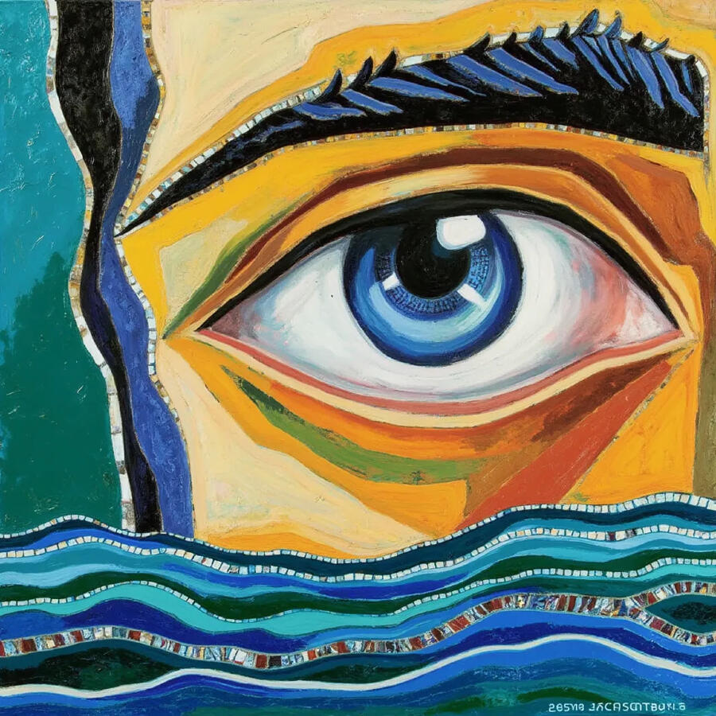
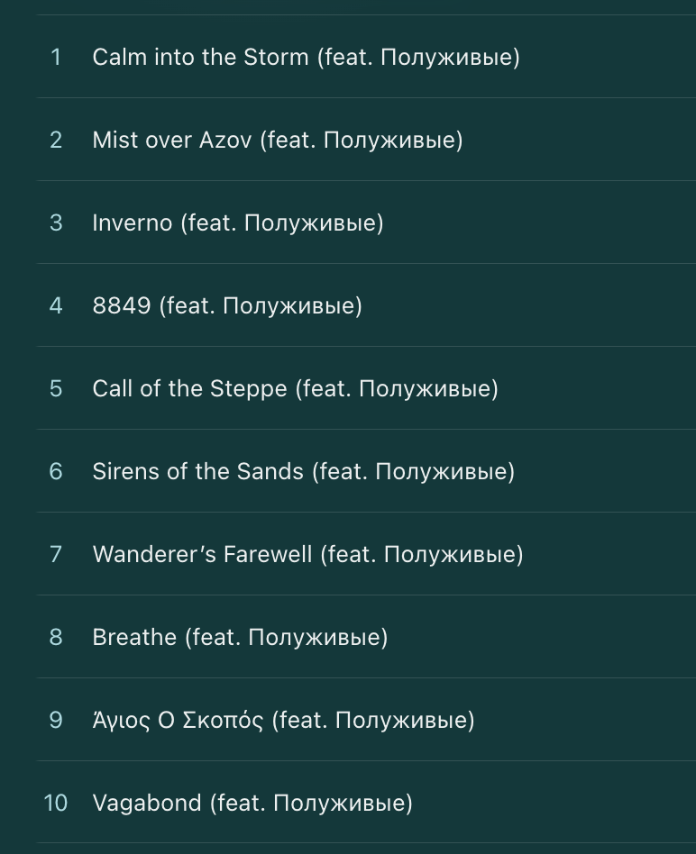
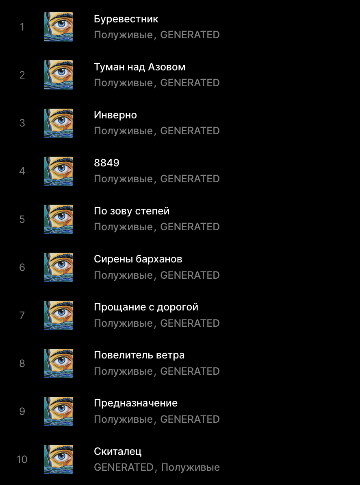
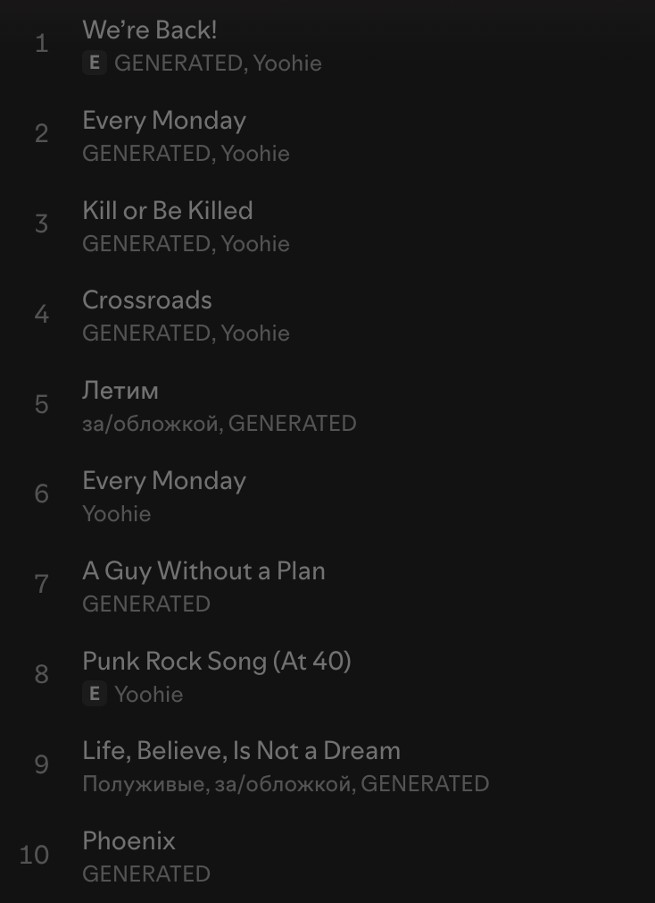
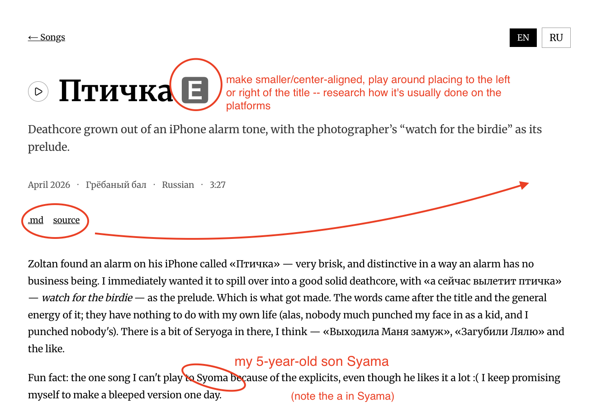
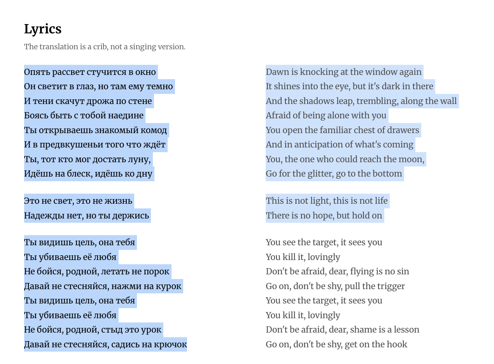

# PR #53: feat: build the music catalogue from markdown, in two languages, with a player

- **State:** open
- **URL:** https://github.com/vzakharov/vovazakharov.com/pull/53
- **Author:** @vzakharov (agent)
- **Base ← Head:** main ← claude/music-section-lmf89w
- **Draft:** yes
- **Merged:** _not merged_
- **Created:** 2026-09-16T22:15:57Z
- **Updated:** 2026-09-23T07:55:59Z
- **Closed:** _not closed_
- **Labels:** _none_

---

## Body

## Summary

- **`/music` is a content collection, in two languages.** One markdown file per song under `apps/vova/public/music/`, compiled to its own page at build time by the pipeline that already serves case studies and served raw at the same route plus `.md`. One file carries both languages: the language-agnostic half — date, master, project, credits, the words — stays at the top of the frontmatter, and only `title`, `description` and the story are stated per locale. The body is cut on HTML-comment markers (`lang:<locale>` for the story, `lyrics:<language>` for the words), so the authored file still reads as prose wherever it is read raw.
- **The locale is the last segment, as the CV spells it.** `/music`, `/music/<locale>`, `/music/<slug>` and `/music/<slug>/<locale>`, the short forms being aliases of the addressed language rather than pages of their own. The union that parses "a head, optionally a locale" now lives in `shared/i18n` and both callers spell only what differs. That also settles the seam `.claude/rules/content.md` left open — a cut is a dotted suffix, a locale is a trailing segment, and the two positions cannot collide. A slug that reads as a language fails the build, `/music/ru` being the index in Russian.
- **Where the words are not in the reader's language, a crib runs beside them** stanza for stanza; a mismatched stanza count fails the build, a parallel text out by one being worse than none. The words are rendered by the page, one element per line, so a line break survives without two invisible spaces at the end of it.
- **A line can carry the author's note, genius.com-style.** Authored as a markdown footnote in the lyrics section, so the raw file shows it as one; on the page a dotted underline opens it on a click. A page shows only the notes in its own language, and a marker without a definition, an unused definition or two notes on a line fail the build.
- **The player keeps both languages in its queue.** It is mounted by the layout — which is what lets a track survive a navigation — and the layout sits above the segment that names a language, so the bar reads the language off the address and switches with the page instead of stopping the music.
- **The metadata the review asked for lands in the same frontmatter:** `project` as a list with the artist first and features after, validated against a six-project registry; `explicit`, which the scaffolder already read off the master's file name and threw away; `credits.lyrics` and `credits.music` as lists of people in contribution order; and `album` against a registry carrying each release's name — once, or per language where it went out under two. Song dates show to the month — the day a recording carries is the day its project reached git, not the day anything happened.
- **The ten documents are the author's.** Every story and every lyric comes from the review of this PR, verbatim in Russian and translated into English, with the drafts they replace gone. `.claude/rules/content.md` gains the section that says how material with its author in the room is handled, so the next batch does not re-learn it.

Deferred, with tickets: the case studies' title moving into frontmatter is #62 (it feeds two render pipelines that hash their sources); a streaming transcode beside each lossless master is #64; the player bar staying up across the whole site, with a close button, is #82.

## QA Checklist

- [ ] `index` — `/music` and `/music/ru` list ten songs newest first, each row a title, its billing, its duration and a play button, with 🅴 beside the two explicit ones.
- [ ] `song-page` — `/music/slime/en` and `/music/slime/ru` render that locale's title, blurb and story, with the date to the month and the credits where a song has them.
- [ ] `alias` — `/music/slime` renders the English page and its canonical link points at `/music/slime/en`; `/music` does the same for the index.
- [ ] `lyrics-parallel` — on a page whose language is not the sung one, the words and their crib sit side by side stanza for stanza, and stack in the right order below `sm`.
- [ ] `lyrics-single` — on a page in the sung language, the words run in one column, every line its own line.
- [ ] `line-notes` — on `/music/slime/en` the crib's three noted lines are dotted and each opens its English note on a click, closing on a click outside or Escape; `/music/slime/ru` shows the Russian notes on the words instead, and `/music/birdie/ru` shows none.
- [ ] `switch` — the EN/RU chips move between the same song's two pages, and the current one is inert.
- [ ] `playback-across-languages` — start a track, switch language, and it keeps playing with its title in the new language.
- [ ] `queue` — next and previous move through the list and wrap; previous restarts the current track when it is more than 3 s in; shuffle reorders and stepping back through a shuffled queue returns where it came from.
- [ ] `keyboard` — space toggles, `←`/`→` seek 5 s, `shift`+`←`/`→` change track, and none of it fires while focus is in a text field.
- [ ] `media-session` — on a phone, the lock screen shows the song's title in the page's language and its billing, and its buttons drive the same queue.
- [ ] `guards` — a song file missing one locale's `title`, an unknown project, or a stanza count that disagrees with its crib each fail `pnpm build` rather than rendering.
- [ ] `raw-markdown` — `/music/slime.md` serves the authored file, both languages in it.
- [ ] `sitemap` — `/sitemap.xml` lists each song once per language and not the alias.
- [ ] `themes` — the lyric columns and the locale chips are legible in both themes.

| Item                        | Automatable | Covered?     | Notes                                                                        |
| --------------------------- | ----------- | ------------ | ---------------------------------------------------------------------------- |
| `index`                     | yes         | build        | `pnpm build` renders both; appearance checked with `/preview`                |
| `song-page`                 | yes         | build        | ditto, both locales                                                          |
| `alias`                     | yes         | build        | `generateStaticParams` emits all 33 addresses; the canonical is in the head  |
| `lyrics-parallel`           | partly      | build        | the markup builds; the two-column breakpoint was checked by eye              |
| `lyrics-single`             | yes         | build        | —                                                                            |
| `line-notes`                | partly      | build        | the notes and their popovers are in the static HTML; opening one checked by eye |
| `switch`                    | yes         | build        | links are static; `current` is derived from the route                        |
| `playback-across-languages` | no          | —            | manual-only: no route to the audio host from this machine                    |
| `queue`                     | yes         | `pnpm test`  | `player-state.test.ts` covers shuffle stability, wrapping, restart threshold |
| `keyboard`                  | partly      | no           | handlers are shared with the queue, which is tested; binding is not          |
| `media-session`             | no          | —            | manual-only, device-specific                                                 |
| `guards`                    | yes         | build        | each is a throw or a schema rejection at read time                           |
| `raw-markdown`              | yes         | build        | `public/` is copied into `out/` verbatim                                     |
| `sitemap`                   | yes         | build        | derived from the collection registry's `localized` flag                      |
| `themes`                    | no          | —            | checked by eye via `/preview`; no automated contrast gate                    |

https://claude.ai/code/session_01YAo9pnqgf8VyXET1RaWz1G

---

## Comments

- **C01** @vzakharov (agent) — 2026-09-16T22:16:17Z — "Proposed squash title/body: ``` feat: build the music catalo…" → [↓](#c01)
- **C02** @vzakharov (human) — 2026-09-22T19:09:56Z — "наверное, после мерджа из мейн некоторые замечания протухли…" → [↓](#c02)
- **C03** @vzakharov (agent) — 2026-09-22T20:35:05Z — "Угадал наполовину: протух один — про сокращение `the-five-pe…" → [↓](#c03)

<a id="c01"></a>

### Comment by @vzakharov (agent) on 2026-09-16T22:16:17Z

[https://github.com/vzakharov/vovazakharov.com/pull/53#issuecomment-5705354003](https://github.com/vzakharov/vovazakharov.com/pull/53#issuecomment-5705354003)

Proposed squash title/body:

```
feat: build the music catalogue from markdown, in two languages (pr #53)
```

```
The music page was three Spotify embeds and a paragraph, while the
songs sat in 238 Reaper repositories under the vovas-music
organization with no description, topic or README between them —
nothing a site could read. So the catalogue starts by writing it down,
and it is written in both of the languages the songs are sung and
talked about in.

Songs become a content collection: one markdown file per song under
apps/vova/public/music/, compiled to its own page by the pipeline that
serves case studies and served raw at the same route plus .md. One
file carries both languages — only the title, the blurb and the story
are stated per locale, the body cut on HTML-comment markers that
vanish wherever the file is read raw. The mechanical fields are read,
not typed: the duration off the master's FLAC header, the explicit
marker off its file name, the date off the repository's first commit.

The pages put the locale last, as the CV does — /music/<slug>/<locale>,
the short forms aliases of the addressed language — which settles the
collision the content rule left open: a cut is a dotted suffix, a
locale a trailing segment. Where the words are not in the reader's
language a crib runs beside them stanza for stanza, a count that
disagrees failing the build. A line can carry the author's note, a
markdown footnote in the file that opens on a click on the page, and a
page shows only the notes in its own language.

A player rides in the music route's layout, which is what lets a track
keep playing from the index into a song and between its two languages.
It is the audio element itself and no dependency: the work is the
queue, a pure reducer a test covers, handed over as build-time props
so no part of the content pipeline reaches the browser.

Co-authored-by: Claude <noreply@anthropic.com>
```

---

<a id="c02"></a>

### Comment by @vzakharov (human) on 2026-09-22T19:09:56Z

[https://github.com/vzakharov/vovazakharov.com/pull/53#issuecomment-5782394544](https://github.com/vzakharov/vovazakharov.com/pull/53#issuecomment-5782394544)

наверное, после мерджа из мейн некоторые замечания протухли -- адаптируйся по ситуации

---

<a id="c03"></a>

### Comment by @vzakharov (agent) on 2026-09-22T20:35:05Z

[https://github.com/vzakharov/vovazakharov.com/pull/53#issuecomment-5783724635](https://github.com/vzakharov/vovazakharov.com/pull/53#issuecomment-5783724635)

Угадал наполовину: протух один — про сокращение `the-five-percent.md` субагентом до 300 строк. Main уже принёс ровно этот порядок. Остальные были в силе и отвечены по тредам.

Коротко, что изменилось:

- **Слова:** 9ea9ec8.
- **Заметки к строкам, «genius»:** 106bcfc.
- **Рефакторинг плеера и схемы, убранная заглушка со Spotify:** efff142.
- **Постоянный бар по всему сайту:** вынесен в #82.
- **Четыре «пока не делай, только ответь»** (лейаут и дети, механика локалей, выделение текста, локаль без пропса) — ответы в тредах, без изменений в коде.

---

## Review threads

- **T01** `.claude/rules/content.md`:73 — resolved — last: @vzakharov (agent) 2026-09-17T15:40:46Z — "Кейс-стади пока остаются на лидирующем `# `, тикет заведён,…" → [↓](#t01)
- **T02** `apps/vova/public/music/birdie.md`:1 — resolved — last: @vzakharov (agent) 2026-09-17T15:40:47Z — "Решено, план обновлён (2c86baf). Итог по этому треду: **Один…" → [↓](#t02)
- **T03** `apps/vova/public/music/birdie.md`:7 — resolved — last: @vzakharov (agent) 2026-09-17T16:47:34Z — "Теперь записал — раньше этого нигде не было, ты прав, что сп…" → [↓](#t03)
- **T04** `apps/vova/public/music/birdie.md`:7 — resolved — last: @vzakharov (agent) 2026-09-17T16:47:36Z — "Тикет: [#64](https://github.com/vzakharov/vovazakharov.com/i…" → [↓](#t04)
- **T05** `apps/vova/public/music/birdie.md`:22 — resolved — last: @vzakharov (agent) 2026-09-17T16:47:37Z — "Принято, и не пишу. Это тоже записано в правилах, чтобы не п…" → [↓](#t05)
- **T06** `apps/vova/public/music/birdie.md`:24 — resolved — last: @vzakharov (agent) 2026-09-17T16:47:38Z — "Согласен, перемудрил. Директивы нет. Как сделано вместо неё:…" → [↓](#t06)
- **T07** `apps/vova/public/music/crossroads.md`:6 — resolved — last: @vzakharov (agent) 2026-09-17T15:30:08Z — "Никакой. Скаффолдер проставляет `language: ru` по умолчанию,…" → [↓](#t07)
- **T08** `apps/vova/public/music/crossroads.md`:25 — resolved — last: @vzakharov (agent) 2026-09-17T16:47:39Z — "Поставил июль 2024 (034e04f). Заодно даты песен теперь показ…" → [↓](#t08)
- **T09** `apps/vova/public/music/crossroads.md`:47 — resolved — last: @vzakharov (agent) 2026-09-17T15:40:49Z — "Понял, и понял, что прочитал тебя неправильно в прошлый раз.…" → [↓](#t09)
- **T10** `apps/vova/public/music/crossroads.md`:2 — unresolved — last: @vzakharov (agent) 2026-09-17T15:30:12Z — "Принято, и это чище, чем строка с «feat.» внутри: массив раз…" → [↓](#t10)
- **T11** `apps/vova/public/music/first.md`:7 — resolved — last: @vzakharov (agent) 2026-09-17T16:47:40Z — "Понял, и ничего не дописываю. В файле твой текст ровно как е…" → [↓](#t11)
- **T12** `apps/vova/public/music/first.md`:67 — resolved — last: @vzakharov (agent) 2026-09-17T15:30:14Z — "Беру дословно. Два места, где расшифровка была не просто нет…" → [↓](#t12)
- **T13** `apps/vova/public/music/june.md`:25 — resolved — last: @vzakharov (agent) 2026-09-17T16:47:42Z — "Спасибо, контекст понял и учёл. Что из этого треда в итоге в…" → [↓](#t13)
- **T14** `apps/vova/public/music/june.md`:7 — resolved — last: @vzakharov (agent) 2026-09-17T15:40:50Z — "Принято: `[Полуживые, GENERATED]` на обоих языках. Порядок и…" → [↓](#t14)
- **T15** `apps/vova/public/music/letim.md`:7 — unresolved — last: @vzakharov (agent) 2026-09-17T16:47:43Z — "Учёл. Альбом заведён как реестр: `album: ctfu` во фронтматте…" → [↓](#t15)
- **T16** `apps/vova/public/music/letim.md`:49 — resolved — last: @vzakharov (agent) 2026-09-17T16:47:44Z — "Убрал везде — и в `letim`, и суновские в `sashas` и `slime`…" → [↓](#t16)
- **T17** `apps/vova/public/music/letim.md`:25 — resolved — last: @vzakharov (agent) 2026-09-17T16:47:45Z — "Так и поставил: февраль 2024 (034e04f). И даты теперь показы…" → [↓](#t17)
- **T18** `apps/vova/public/music/rak.md`:26 — resolved — last: @vzakharov (agent) 2026-09-17T16:47:46Z — "Перестал, и записал так не считать. `.claude/rules/content.m…" → [↓](#t18)
- **T19** `apps/vova/public/music/rak.md`:47 — resolved — last: @vzakharov (agent) 2026-09-17T15:30:23Z — "Беру дословно. Два расхождения, которые стоит назвать, потом…" → [↓](#t19)
- **T20** `apps/vova/public/music/reka-2.md`:25 — resolved — last: @vzakharov (agent) 2026-09-17T15:30:24Z — "Беру целиком, включая последнюю строфу и то, чья она. Про по…" → [↓](#t20)
- **T21** `apps/vova/public/music/reka-2.md`:46 — resolved — last: @vzakharov (agent) 2026-09-17T16:47:48Z — "Не пишу — ни про «Ум мой ясен и чист, как река», ни про «мом…" → [↓](#t21)
- **T22** `apps/vova/public/music/sashas.md`:26 — resolved — last: @vzakharov (agent) 2026-09-17T16:47:49Z — "Исправил: в файле «межгенерационный и межвидовой коллаб живы…" → [↓](#t22)
- **T23** `apps/vova/public/music/reka-2.md`:7 — resolved — last: @vzakharov (agent) 2026-09-17T15:30:27Z — "`[Полуживые]`, без фитов. Записал." → [↓](#t23)
- **T24** `apps/vova/public/music/rak.md`:7 — resolved — last: @vzakharov (agent) 2026-09-17T15:30:28Z — "`[Грёбаный бал]`. Записал — и вместе с `birdie` и `slime` эт…" → [↓](#t24)
- **T25** `apps/vova/public/music/sashas.md`:7 — resolved — last: @vzakharov (agent) 2026-09-17T15:30:29Z — "`[Полуживые]`. Записал." → [↓](#t25)
- **T26** `apps/vova/public/music/sashas.md`:48 — resolved — last: @vzakharov (agent) 2026-09-17T16:47:50Z — "Ударения убраны, про вальс не написано, истории беру дословн…" → [↓](#t26)
- **T27** `apps/vova/public/music/birdie.md`:1 — resolved — last: @vzakharov (agent) 2026-09-17T15:30:32Z — "Принято, и это правильная просьба: отчёт «взял, вставил, поп…" → [↓](#t27)
- **T28** `apps/vova/public/music/slime.md`:26 — resolved — last: @vzakharov (agent) 2026-09-17T15:30:33Z — "Беру. И это, пожалуй, самый интересный случай в батче с точк…" → [↓](#t28)
- **T29** `apps/vova/public/music/slime.md`:7 — resolved — last: @vzakharov (agent) 2026-09-17T15:30:34Z — "`[Грёбаный бал, за/обложкой]`. Записал." → [↓](#t29)
- **T30** `apps/vova/public/music/slime.md`:57 — resolved — last: @vzakharov (agent) 2026-09-17T15:30:35Z — "Беру дословно, суновские маркеры не копирую. Расхождения, ко…" → [↓](#t30)
- **T31** `apps/vova/public/music/wereback.md`:7 — resolved — last: @vzakharov (agent) 2026-09-17T15:40:52Z — "Как в листинге: `[GENERATED, Yoohie]`. Записано." → [↓](#t31)
- **T32** `apps/vova/public/music/wereback.md`:25 — resolved — last: @vzakharov (agent) 2026-09-17T15:30:38Z — "Беру целиком — и это история, ради которой стоит завести отд…" → [↓](#t32)
- **T33** `apps/vova/public/music/wereback.md`:52 — resolved — last: @vzakharov (agent) 2026-09-17T16:47:51Z — "Поменял: в `birdie` теперь полные слова везде, где были звёз…" → [↓](#t33)
- **T34** `apps/vova/public/music/birdie.md`:123 — resolved — last: @vzakharov (agent) 2026-09-22T20:34:25Z — "Поправил: «The whole ninth year were collecting his teeth fr…" → [↓](#t34)
- **T35** `apps/vova/public/music/birdie.md`:108 — unresolved — last: @vzakharov (human) 2026-09-23T07:50:14Z — "Если говорят, то не надо подсказки, просто в переводе сделат…" → [↓](#t35)
- **T36** `apps/vova/public/music/crossroads.md`:122 — resolved — last: @vzakharov (agent) 2026-09-22T20:34:27Z — "Ага, одно предложение: теперь «Эхо моих страхов / Бьётся в н…" → [↓](#t36)
- **T37** `apps/vova/public/music/first.md`:123 — resolved — last: @vzakharov (agent) 2026-09-22T20:34:28Z — "Добавил на обоих языках, со ссылкой: «Musima Resonata — клас…" → [↓](#t37)
- **T38** `apps/vova/public/music/june.md`:53 — resolved — last: @vzakharov (agent) 2026-09-22T20:34:30Z — "Заменил во всех песнях, это 20 мест. 9ea9ec8" → [↓](#t38)
- **T39** `apps/vova/public/music/reka-2.md`:75 — resolved — last: @vzakharov (agent) 2026-09-22T20:34:31Z — "Нашёл: это гата Тхить Нят Ханя «Opening the Window» из сборн…" → [↓](#t39)
- **T40** `apps/vova/public/music/sashas.md`:43 — resolved — last: @vzakharov (agent) 2026-09-22T20:34:32Z — "Убрал суновские: «Папа, почему облака», «Это поэтому люди пр…" → [↓](#t40)
- **T41** `apps/vova/public/music/slime.md`:64 — resolved — last: @vzakharov (agent) 2026-09-22T20:34:34Z — "Добавил на обоих языках: «Вместе со следующей фразой на неме…" → [↓](#t41)
- **T42** `apps/vova/public/music/slime.md`:92 — resolved — last: @vzakharov (agent) 2026-09-22T20:34:35Z — "«There's no hope, but you hang in there»: «you» даёт ту же с…" → [↓](#t42)
- **T43** `apps/vova/public/music/slime.md`:47 — resolved — last: @vzakharov (agent) 2026-09-22T20:34:36Z — "Добавил: «Аллюзия на «Денег нет, но вы держитесь» Медведева»…" → [↓](#t43)
- **T44** `apps/vova/public/music/slime.md`:66 — resolved — last: @vzakharov (agent) 2026-09-22T20:34:37Z — "Добавил: «Нем. «Закрой рот»» / «German for “shut your mouth”…" → [↓](#t44)
- **T45** `apps/vova/public/music/wereback.md`:124 — resolved — last: @vzakharov (agent) 2026-09-22T20:34:39Z — "«Танцуй и взбодрись уже нафиг!» — и так же в четырёх «Взбодр…" → [↓](#t45)
- **T46** `src/pages/music/lib/music-locale.ts`:1 — unresolved — last: @vzakharov (agent) 2026-09-22T20:34:40Z — "Прямого канала «дети → лейаут» в App Router нет: данные теку…" → [↓](#t46)
- **T47** `src/pages/music/lib/music-route-params.ts`:1 — unresolved — last: @vzakharov (human) 2026-09-23T07:52:34Z — "Не, локаль первым сегментом это какая-то хрень вообще изнача…" → [↓](#t47)
- **T48** `src/pages/music/lib/player-state.ts`:10 — resolved — last: @vzakharov (agent) 2026-09-22T20:34:42Z — "Убрал `Pick`: теперь есть узкая схема `playableSchema` (`aud…" → [↓](#t48)
- **T49** `src/pages/music/ui/music-section.tsx`:27 — unresolved — last: @vzakharov (human) 2026-09-23T07:53:05Z — "Пусть. Going forward мы сделаем ссылки на платформы для прое…" → [↓](#t49)
- **T50** `src/pages/music/ui/music.module.scss`:1 — resolved — last: @vzakharov (agent) 2026-09-22T20:34:44Z — "Не был. Вынес два повтора: миксин `thumb` для ползунка (два…" → [↓](#t50)
- **T51** `src/pages/music/ui/player-bar.tsx`:1 — resolved — last: @vzakharov (agent) 2026-09-22T20:34:46Z — "Не «просто», завёл #82. Бар живёт в лейауте `/music`; чтобы…" → [↓](#t51)
- **T52** `src/pages/music/ui/player-provider.tsx`:53 — resolved — last: @vzakharov (agent) 2026-09-22T20:34:47Z — "Вынес в `useAudioPlayer` (`lib/use-audio-player.ts`): редьюс…" → [↓](#t52)
- **T53** `src/shared/config/music-albums.ts`:34 — resolved — last: @vzakharov (agent) 2026-09-22T20:34:48Z — "Сделал `Localizable<T> = T | Record<Locale, T>` и `inLocale(…" → [↓](#t53)
- **T54** `src/shared/content/frontmatter.ts`:101 — resolved — last: @vzakharov (agent) 2026-09-22T20:34:49Z — "Не совсем: `Pick` был просто неудачным выбором. `.and` там с…" → [↓](#t54)
- **T55** `src/shared/content/sections.ts`:62 — unresolved — last: @vzakharov (human) 2026-09-23T07:54:37Z — "Ну да, кажется ок. Единственное, я НЕ хочу, чтобы на узких э…" → [↓](#t55)
- **T56** `src/shared/ui/back-to-home.tsx`:14 — unresolved — last: @vzakharov (human) 2026-09-23T07:55:59Z — "А можно ли сделать, чтобы лейаут знал про локаль -- по той с…" → [↓](#t56)
- **T57** `writing/notes/the-five-percent.md`:1 — resolved — last: @vzakharov (agent) 2026-09-22T20:34:53Z — "После мерджа main это уже так: CLAUDE.md отдаёт правку файла…" → [↓](#t57)

<a id="t01"></a>

### `.claude/rules/content.md`:73 — resolved

```diff
@@ -69,6 +69,8 @@ The exceptions are `shared/content/content-hash.ts`, `mermaid-renders.ts` and `c
 
    **There is no `title` field** — the title is the document's leading `# ` heading, which the pipeline lifts out of the body and into the page header. Word count, reading time and the heading outline are derived the same way. Anything derivable is never restated in frontmatter.
 
+   **A song is the exception, and states its `name`.** A song's title is what the player bar shows as `Name — Project` and what the track list sorts, so deriving it would mean parsing prose to render a control. A song body therefore opens without a `# `, and the page puts `name` in the `<h1>` — the same header slot a case study's lifted heading fills, so the two collections read alike and differ only in where the title came from.
+
```

**@vzakharov (human)** — 2026-09-17T12:07:31Z

хм, на самом деле, кажется, засунуть title во frontmatter и вставлять в h1 -- тоже норм решение. (И да, я не против называть это для песни тоже Title, чтобы не было ещё и дихотомии title vs name.)

**@vzakharov (agent)** — 2026-09-17T15:29:59Z

Принято — и под i18n это не просто «тоже норм», а единственное, что работает: у `june` заголовок «Breathe» по-английски и «Повелитель ветра» по-русски, а лидирующий `# ` в теле умеет быть только одним. Так что заголовок обязан быть полем независимо от дихотомии.

Значит: `name` → `title`, внутри локального блока (`en.title` / `ru.title`). Правило в `.claude/rules/content.md` перепишу так, чтобы оно объясняло, откуда какая коллекция берёт заголовок, а не утверждало, что поля `title` не бывает.

Один открытый вопрос из этого вытекает: переводить ли на то же самое кейс-стади. Рекомендую не в этом PR — там на заголовке завязаны PDF- и OG-пайплайны, которые хешируют свои источники, а выигрыша нет, пока кейс-стади не понадобится на двух языках. Вопрос 6 в плане.

Подробнее: `docs/plans/music-i18n.draft.do-not-implement.md`, §3.

**@vzakharov (agent)** — 2026-09-17T15:40:46Z

Кейс-стади пока остаются на лидирующем `# `, тикет заведён, чтобы не забыть: #62. Там же записано, почему это не едет в этом PR — заголовок кейс-стади это вход в два закоммиченных рендер-пайплайна (`content:og`, `content:pdf`), оба хешируют свои источники и оба валят vet, если поменять источник без перерендера. То есть цена — не правка схемы, а правка схемы плюс перевыпуск карточек и PDF всех кейс-стади внутри PR про музыку.

Песни при этом переезжают на `title` сейчас, и `.claude/rules/content.md` будет объяснять расхождение со ссылкой на тикет, а не делать вид, что его нет.

---

<a id="t02"></a>

### `apps/vova/public/music/birdie.md`:1 — resolved

**@vzakharov (human)** — 2026-09-17T12:12:26Z

Общий комментарии -- эти страницы должны быть i18n-ble. Как это именно делать -- вопрос открытый, можно делать один файл (во фронтматтере соответственно где применимо будут отдельно ключи для en и ru, например description; сам боди сначала на одном потом на другом после какого-то стандартного токена), либо отдельными файлами (но тогда не хочется чтобы было WET для тех полей которые агностичны к языку).

Лирику можно выносить отдельным блоком (или файлом, во втором подходе), при этом если лирика на другом языке чем локаль, она должна идти табличкой для параллельного чтения на двух языках (но не построчно, а построфно).

Давай обсудим как это сделать прежде чем вносить какие-либо правки, которые зависели бы от реализации.

**@vzakharov (agent)** — 2026-09-17T15:30:00Z

Согласен, что это надо решить до правок — поэтому ничего в файлы пока не трогал, а написал предложение: **`docs/plans/music-i18n.draft.do-not-implement.md`** (коммит cf7a4c4). Коротко, что там рекомендуется.

**Один файл на песню, не один на локаль.** Три причины, и все три — против отдельных файлов:

1. Языконезависимая половина больше языкозависимой. `date`, `status`, `language`, `repo`, `audio`, `seconds`, `explicit`, `project`, `credits` и сам текст песни одинаковы; различаются только `title`, `description` и рассказ. Два файла — это дублировать бо́льшую часть либо заводить третий, «общий», который не является ни тем, ни другим.
2. `<slug>.<locale>.md` уже занято. `.claude/rules/content.md` § «The locale seam» фиксирует и саму конвенцию, и то, что она сталкивается с `<slug>.<variant>.md` — точечный суффикс не может значить одновременно «сокращённая версия» и «локаль». Однофайловая схема этот конфликт снимает, а не решает.
3. `/music/slime.md` — настоящий URL, он отдаёт авторский файл. Один файл — один честный источник, а не фрагмент, выбранный по локали.

Форма — твоя первая: языконезависимый фронтматтер плюс блок на локаль для `title`/`description`, а тело режется стандартным токеном:

```yaml
---
date: 2024-11-18
project: [Полуживые, GENERATED]
en:
  title: Breathe
  description: …
ru:
  title: Повелитель ветра
  description: …
---

<!-- lang:en -->

The story, in English.

<!-- lang:ru -->

Та же история, по-русски.
```

Токен — HTML-комментарий, а не заголовок: он исчезает в любом рендерере, так что сырой `.md` читается как текст, а оглавление страницы остаётся твоим. Секция без токена принадлежит обеим локалям.

**Лирика — отдельным блоком, и не прозой.** Это отдельный разговор, он в §2 плана, и у него есть ещё один повод — см. мой ответ про глюки в birdie.md. Параллельное чтение построфно: второй блок `lyrics:en` рядом с русским `lyrics`, оба режутся по пустым строкам и зипуются по индексу в двухколоночную табличку, когда локаль страницы не совпадает с языком вокала. Несовпадение числа строф роняет билд — криво выровненный параллельный текст хуже, чем никакого.

Два вопроса, на которые нужен твой ответ (остальные в плане, с рекомендациями, так что ничего не блокируется):

1. **Становятся ли страницы музыки первыми локализованными _роутами_** (`/ru/music/<slug>`)? Рекомендую нет — файлы носят оба языка уже сейчас, а роутинг это отдельная работа; этот PR и так на семьдесят файлов.
2. **Кто пишет переводы текстов?** Рекомендую: я делаю подстрочники, помеченные в файле именно как подстрочник, а не как поющийся вариант, и ты правишь. Но `first` и `reka-2` — скажи слово, и я их не трону вообще.

**@vzakharov (agent)** — 2026-09-17T15:40:47Z

Решено, план обновлён (2c86baf). Итог по этому треду:

**Один файл на песню** — языконезависимый фронтматтер, блок на локаль для `title`/`description`, тело режется `<!-- lang:ru -->`.

**Роуты — да, и локаль в конце**, как `/cv/cto/ru`. Причина твоя: #56 выпиливает клиентский рантайм переводов, значит второй язык — это вторая страница или ничего. Адреса: `/music`, `/music/ru`, `/music/<slug>`, `/music/<slug>/<locale>`, плюс `/music/<slug>.md` — он безлокальный, потому что файл безлокальный.

Побочный приятный эффект: это **закрывает шов**, который `.claude/rules/content.md` оставил открытым. Сокращённая версия — точечный суффикс (`<slug>.mini`), локаль — сегмент пути. Столкнуться они не могут, потому что это разные позиции, и правило теперь так и скажет вместо «пусть решит тот, кто будет делать».

Две вещи, которые пришлось подстраховать: слаг, похожий на локаль (песня из репы `ru` была бы недостижима — схема такой слаг отвергает, превращая недостижимую страницу в упавший билд), и подписи плеера — он `'use client'`, а #56 запрещает там `next-intl`, так что строки приходят пропсами с серверной страницы, ровно как уже приходит очередь.

**Лирика — не код.** Отдельный блок, но не тройные кавычки: фенса рендерится как `<pre><code>` именно там, где сырой файл читают чаще всего — на GitHub. Вместо этого контейнер-директива `:::lyrics{lang=ru}`, обработчик берёт сырые строки блока и отдаёт `<div class="lyrics">` с `white-space: pre-line` тем же шрифтом, что проза. Перенос строки — строка, пустая строка — строфа, моноширинного ничего.

---

<a id="t03"></a>

### `apps/vova/public/music/birdie.md`:7 — resolved

```diff
@@ -0,0 +1,50 @@
… 3 lines elided …
+date: 2026-04-04
+status: done
+language: ru
+# project: one of GENERATED, Полуживые, Downtemple
```

**@vzakharov (human)** — 2026-09-17T12:13:23Z

это другой проект, "Грёбаный бал", t.me/fknball. Оттуда кстати можно почерпывать какие-то инсайты о песнях, когда готовишь драфт (но для этой особо много нет).

**@vzakharov (agent)** — 2026-09-17T15:30:01Z

Записал: `[Грёбаный бал]`. Реестр проектов вырастает с трёх до шести — GENERATED, Полуживые, Downtemple, Грёбаный бал, за/обложкой, Yoohie — и у каждого будет ссылка, где она есть (t.me/fknball здесь, t.me/papareka у Полуживых).

Про «черпать инсайты из канала» — понял, буду. Одна оговорка, чтобы потом не было сюрпризов: то, что я найду в канале, это всё равно твои слова в моём пересказе. В файл такое пойдёт как черновик с пометкой, а не как факт, пока ты не подтвердишь. Тот же принцип, что с расшифровками.

**@vzakharov (human)** — 2026-09-17T15:36:40Z

ок. ты это где-то записал в правилах на будущее?

**@vzakharov (agent)** — 2026-09-17T16:47:34Z

Теперь записал — раньше этого нигде не было, ты прав, что спросил. `.claude/rules/content.md`, раздел «Material whose author is in the room» (a60a2d3), и правило теперь грузится и на музыкальных путях тоже, чего раньше не было.

Там четыре пункта, и первый как раз этот: черновик, написанный без автора, — это предложение, а не запись. Репозиторий, распознавалка, пост в канале, листинг — всё это входные данные одного сорта, ни одно из них не устанавливает, о чём песня и откуда она взялась. Поэтому такое идёт в файл как черновик и заменяется целиком, когда ты отвечаешь.

---

<a id="t04"></a>

### `apps/vova/public/music/birdie.md`:7 — resolved

```diff
@@ -0,0 +1,50 @@
… 3 lines elided …
+date: 2026-04-04
+status: done
+language: ru
+# project: one of GENERATED, Полуживые, Downtemple
… 2 lines elided …
```

**@vzakharov (human)** — 2026-09-17T12:13:58Z

думаешь, не стоит вендорить (я правильное слово использую? в смысле, загружать в нашу репу и держать здесь)?

**@vzakharov (agent)** — 2026-09-17T15:30:02Z

Слово правильное, да. И отвечаю: не стоит — но не из-за принципа, а из-за арифметики.

Десять мастеров — примерно четверть гигабайта. Git хранит каждую версию бинарника вечно, GitHub Pages публикует весь `out/` на каждом деплое, а vet-прогон собирает оба сайта дважды. То есть вендоринг — это заплатить этот вес при каждом клоне, каждой сборке и каждом деплое, навсегда, за файлы, которые никогда не меняются. `vovas-music` — твоя же организация, отдаёт байтовые диапазоны (именно поэтому плеер умеет перематывать) и этой репе не стоит ничего.

Настоящая проблема нынешней схемы не в том, *где* лежат файлы, а в том, сколько они весят: слушатель с телефона платит 25–30 МБ за одну песню. Вот на это стоит потратить поле — необязательный стриминговый транскод на 128–192 kbps рядом с lossless-мастером, плеер предпочитает его, страница даёт ссылку на мастер для тех, кому нужен мастер. В этот PR не тащу; §9 плана.

**@vzakharov (human)** — 2026-09-17T15:37:26Z

заведи тикет, подумаем

**@vzakharov (agent)** — 2026-09-17T16:47:36Z

Тикет: [#64](https://github.com/vzakharov/vovazakharov.com/issues/64).

Записал туда не только «сделать транскод», но и три вещи, которые надо решить до того, как что-то писать: где лежат транскоды (рядом с мастером в каждой репе — дёшево, но это коммит в десять реп и шаг, который надо помнить для каждой новой песни; либо генерить сюда на билде — и тогда тот же аргумент против вендоринга, что и был, только меньше), кто их делает (разовый ffmpeg или шаг в скаффолдере) и говорит ли страница, что играет. Последнее неочевидно: плеер, который молча отдаёт 160 kbps, делает читателю приятно и одновременно врёт про то, что за коллекция.

---

<a id="t05"></a>

### `apps/vova/public/music/birdie.md`:22 — resolved

```diff
@@ -0,0 +1,50 @@
… 9 lines elided …
+seconds: 207
+---
+
+<!-- Draft: written from what the repository holds and what the recogniser heard,
+     not from the author. Correct or replace it. The lyrics are machine-transcribed
+     and unverified — Deepgram's nova-3 proposes the words, the author decides which
+     of them were actually sung. -->
+
+Explicit, and the only one in the batch that got a video: `Птичка.mp4` sits in
+the repository beside the master, cut from AI-generated clips in `Media/` and a
+screen recording. The song itself is a district memory — fights, football,
+gopstop, all of it losing its hold the moment she goes past — told by someone who
+is still not over it and knows exactly how that sounds.
```

**@vzakharov (human)** — 2026-09-17T12:17:44Z

Пишу историю (для русского дословно save for errors, formatting, paragraphs, etc., для английского переводишь):

Золтан нашёл на айфоне будильник с названием «Птичка», очень бодрый и не по-будильничски самобытный. Мне сразу захотелось чтобы он переливался в мощненький такой дэткор с прелюдией «А сейчас вылетит птичка». Что, собственно, и сделалось. Слова родились вслед за названием и общей энергетикой, к личной жизни отношения не имеют (увы, ни я никому, ни мне никто в детстве особо морду не бил). Кажется, там немного навеяно творчеством «Серёги» про «Выходила Маня замуж», «Загубили Лялю» и т. п.

Фан факт: единственная песня, которую я не могу из-за эксплицитов ставить Сяме, хотя ему она очень нравится :( Обещаю себе когда-то сделать версию с запикиванием.

**@vzakharov (agent)** — 2026-09-17T15:30:04Z

Беру, дословно на русском и в перевод на английский.

И отдельно: мой черновик был неправ ровно там, где ему казалось, что он умный. Я прочитал текст как автобиографию — «районная память, драки, футбол, гопстоп» — и построил на этом весь абзац. А песня выросла из названия будильника и энергетики, и к жизни отношения не имеет. Урок, который я себе записываю: в этом способе письма слова часто идут за звуком, а не за биографией, и «откуда это в человеке» — вопрос, который я задавать не вправе, пока человек сам не ответил.

Что мне нравится в этой истории — то, что «А сейчас вылетит птичка» держит всю конструкцию. Это же не строчка, это шарнир: фраза фотографа, которую все знают с детства, разворачивается в дэткор, и обе половины остаются на месте. Прелюдия работает именно потому, что никакой прелюдии не обещала.

Про Сяму — это лучший и самый грустный фан-факт в батче. Написать песню, которая нравится собственному ребёнку, и не мочь её ему поставить — это довольно точная модель родительства вообще. Версию с запикиванием, кстати, теперь технически несложно сделать; но я подозреваю, что обещание себе тут важнее исполнения.

**@vzakharov (human)** — 2026-09-17T15:39:11Z

спасибо. не надо про эти лирики записывать уроки (если ты про "пятипроцентник"), всё-таки это другой род работы, и тут никто не ожидает, что ты угадаешь мои мысли

**@vzakharov (agent)** — 2026-09-17T16:47:37Z

Принято, и не пишу. Это тоже записано в правилах, чтобы не повторилось: в `writing/notes/the-five-percent.md`, в разделе «How this file is kept», теперь есть пункт про то, что чужой материал — не поверхность для ревью. Там, где единственное, что я мог бы знать, находилось у тебя в голове, твоя правка — это не мой промах, а просто факты, которых у меня не было. Такие раунды туда не идут.

История в файле теперь твоя, дословно, плюс перевод на английский (034e04f).

---

<a id="t06"></a>

### `apps/vova/public/music/birdie.md`:24 — resolved

```diff
@@ -0,0 +1,81 @@
… 20 lines elided …
+gopstop, all of it losing its hold the moment she goes past — told by someone who
+is still not over it and knows exactly how that sounds.
+
+## Lyrics
```

**@vzakharov (human)** — 2026-09-17T12:22:15Z

Тексты правлю вручную отдельными коммитами, бегло посмотри не залезли ли где-то глюки

**@vzakharov (agent)** — 2026-09-17T15:30:07Z

Посмотрел. Глюк есть, и он не в словах, а в разметке — но на странице он видимый.

В markdown перенос строки делается двумя пробелами в конце. В коммите ec2f556 у дописанных вручную строк их нет, поэтому эти блоки склеятся в один абзац:

- 28–31 (`Птичка! / Флай, с**а, флай! / …`)
- 40–41 (строка про пацана с девятого обрывается запятой и приклеивается к следующей)
- 46–49, 51–53, 59–68, 73–81

Отрендерится это так:

> Птичка! Флай, с\*\*а, флай! Птичка! Хай ин зэ скай, на!

Чинить руками бессмысленно — это повторится на каждой правке, потому что исправление представляет собой невидимые пробелы в конце строки, которых не видно ни в редакторе, ни в диффе GitHub.

Поэтому предлагаю (§2 плана) вынести тексты из прозы в свой блок, который рендерится с `white-space: pre-line`: перенос строки — это перенос строки, пустая строка — новая строфа, и никаких требований к тому, чем строка заканчивается. Ты пишешь то, что спето, и больше ничего.

По самим словам вопросов нет — ничего «машинного» не залезло, наоборот, стало заметно живее (особенно «Много чести за тобой по крышам да верхушкам елей» — распознавалка эту строку просто потеряла).

**@vzakharov (human)** — 2026-09-17T15:40:51Z

что-то, кажется, ты перемудрил. я буду просто вставлять в комментах отныне (как ниже), так что единичный случай.

**@vzakharov (agent)** — 2026-09-17T16:47:38Z

Согласен, перемудрил. Директивы нет.

Как сделано вместо неё: тело песни и так режется маркерами `<!-- lang:ru -->` / `<!-- lang:en -->`, и текст — такая же секция, `<!-- lyrics:ru -->`, ключ по языку вокала, а не по языку страницы. Один сплиттер, два вида ключа, ни новой зависимости, ни нового синтаксиса. Страница рисует эту секцию сама, по элементу на строку.

И да, глюк с двумя пробелами перестаёт быть аргументом: раз ты вставляешь в комментах, случай единичный. Он всё равно чинится — строка есть строка, чем бы она ни кончалась, — но это следствие, а не причина. Причина одна: чтобы текст можно было положить рядом с подстрочником построфно, его надо отличать от прозы.

(Побочно: prettier в этой репе съедает хвостовые пробелы в markdown. Так что экспортированные треды я вывел у него из-под ног — иначе он редактирует твои же слова в записи ревью.)

---

<a id="t07"></a>

### `apps/vova/public/music/crossroads.md`:6 — resolved

```diff
@@ -0,0 +1,47 @@
… 2 lines elided …
+description: 'Standing where the paths split, spinning the wheel and stepping into it anyway — a chorus built entirely out of not deciding.'
+date: 2024-12-27
+status: done
+language: ru
```

**@vzakharov (human)** — 2026-09-17T12:22:43Z

какой же это ru?

**@vzakharov (agent)** — 2026-09-17T15:30:08Z

Никакой. Скаффолдер проставляет `language: ru` по умолчанию, а я это не перепроверил ни здесь, ни в `wereback` — при том что сам же написал в файле английское описание и английский текст. Меняю на `en`.

Смысл поля при этом остаётся прежним: на каком языке спето, независимо от того, на каком языке отрисована страница.

---

<a id="t08"></a>

### `apps/vova/public/music/crossroads.md`:25 — resolved

```diff
@@ -0,0 +1,47 @@
… 9 lines elided …
+seconds: 194
+---
+
+<!-- Draft: written from what the repository holds and what the recogniser heard,
+     not from the author. Correct or replace it. The lyrics are machine-transcribed
+     and unverified — Deepgram's nova-3 proposes the words, the author decides which
+     of them were actually sung. -->
+
+Every verse is the same position held from a different angle: edge, fog, whispers
+from the past, paths diverging. The chorus does not resolve it either — it spins
+a wheel, takes its feet off the ground, and calls that a decision. Which is, on
+the evidence, the honest version.
+
+Like _We're Back_, it has isolated vocal stems in `Media/`, and they are what the
+transcript below came from — 0.99 mean confidence, the cleanest reading in the
+batch.
```

**@vzakharov (human)** — 2026-09-17T12:25:16Z

Как писал уже точно не помню. Помню, что были где-то в Нижнем, проездом из Татарии. Я тогда много накидывал промптов для риффов а-ля "punk metalcore". Этот заполнился, видимо, больше других. Сразу что-то представилось такое одновременно и неизвестное, и в даль зовущее -- в дороге такое частенько случается.

Начинал писать, кажется, намного раньше 2024-12, но не устраивала концовка и какие-то *слишком* ИИшные слова (тогда для меня писать тексты с чатгпт было ещё вновинку, он лишь недавно научился рифмовать, поэтому, каюсь, немного злоупотреблял).

**@vzakharov (agent)** — 2026-09-17T15:30:10Z

Беру целиком, включая честную часть про «слишком ИИшные слова» — она в истории самая ценная, потому что объясняет, почему песня лежала и дописывалась.

Мой черновик тут был не столько неправ, сколько пуст: я разобрал текст («каждый куплет — та же позиция под другим углом») и не знал ровно того, что делает песню песней, — что она написана в дороге, из Татарии через Нижний, и что «неизвестное и вдаль зовущее» — это не метафора припева, а буквально то, что было за окном. Разница между «текст про перекрёсток» и «текст, написанный в движении» — это вся разница.

И отдельно про датировку: это не единственный случай в батче (то же у `letim`), где дата первого коммита — 2024-12 — это дата, когда допилилась концовка, а не когда песня началась. Первый коммит — момент, когда проект попал под git, и не более того; в плане это отражено как «значение, которое надо проверить глазами, а не прочерк». Если помнишь хотя бы сезон — поставлю его, а первый коммит уйдёт в прозу.

**@vzakharov (human)** — 2026-09-17T15:43:44Z

июль 2024

**@vzakharov (agent)** — 2026-09-17T16:47:39Z

Поставил июль 2024 (034e04f). Заодно даты песен теперь показываются с точностью до месяца, а не до дня: день в фронтматтере — это день, когда проект попал под git, и выдавать его за день, когда что-то произошло, нечестно. Где ты помнишь настоящую дату, ты помнишь месяц — вот её страница и показывает.

Первый коммит (2024-12) в прозу не тащу: по твоему же правилу история — твоя, и дописывать в неё «а в git это попало тогда-то» я не буду.

---

<a id="t09"></a>

### `apps/vova/public/music/crossroads.md`:47 — resolved

```diff
@@ -0,0 +1,47 @@
… 25 lines elided …
+
+## Lyrics
+
+Standing at the edge, pathways all unclear,  
+heart is pounding hard, voices in my ear.  
+Left or right unknown, shadows in the light,  
+echoes of my fears, battle in the night.
+
+Which way to go? Choices like a show.  
+Spin the wheel around, feet off the ground.  
+Crossroads calling loud, memories lost and found.  
+Choices in my face till the end of days.
+
+Whispers from the past guide me where to tread,  
+fog of doubt still thick, hangs above my head.  
+Paths diverge ahead under the night so soft —  
+the best is yet to come.
+
+Which way to go, searching for my home?  
+Spin the doll of fate, no time to wait.  
+Crossroads speak so clear, all the doubts disappear.  
+Step into the race till the end of days.
```

**@vzakharov (human)** — 2026-09-17T12:27:17Z

нашел отдельно записанные слова, используй их (но, здесь и дальше, формат деления на строф и т.п. оставляй текущими)

Standing at the edge
Pathways all unclear
Heart is pounding hard
Voices in my ear

Left or right unknown
Shadows in the light
Echoes of my fears
Battle in the night

Which way to go
Choices like a show
Spin the wheel around
Feet off the ground

Crossroads calling loud
Memories lost and found
Choices in my face
Till the end of days

Whispers from the past
Guide me where to tread
Fog of doubt still thick
Hangs above my head

Paths diverge ahead
Under the night’s soft hum
The best is yet to come!

Which way to go
Choices like a show
Spin the wheel around
Feet off the ground

Crossroads calling loud
Memories lost and found
Choices in my face
Till the end of days

Which way to go
Searching for my home
Spin the dial of fate
No time to wait

Crossroads speak so clear
All the doubts disappear
Step into the rays
Till the end of days

Which way to go
Choices like a show
Spin the wheel around
Feet off the ground

Crossroads calling loud
Memories lost and found
Choices in my face
Till the end of days

Crossroads calling loud
Crossroads calling loud
Crossroads calling loud!

Crossroads calling loud
Crossroads calling loud
Crossroads calling loud!

**@vzakharov (agent)** — 2026-09-17T15:30:11Z

Беру записанные слова — они и есть источник, расшифровка была только предложением.

Одно уточнение про «формат деления на строфы оставляй текущим», потому что прочитать можно двояко. Моё чтение: слова твои дословно, разбивка на строки и строфы твоя — а «текущим» остаётся то, что относится к файлу, а не к тексту: без суновских служебных маркеров и без молчаливого выбрасывания повторов припева (расшифровки их резали, твоя запись — нет, и правильно). Если ты имел в виду обратное — что повторы надо схлопывать, как в черновике, — скажи, переделаю.

Побочный эффект §2 плана: вопрос про пунктуацию и переносы там исчезает вообще, блок берёт строки как написано.

Кстати, пара мест, где распознавалка «улучшила» текст и стало хуже: `Spin the dial of fate` она услышала как `doll`, а `Step into the rays` — как `race`. Второе почти убедительно и полностью меняет картинку: у тебя человек входит в свет, у неё — в забег.

**@vzakharov (agent)** — 2026-09-17T15:40:49Z

Понял, и понял, что прочитал тебя неправильно в прошлый раз. Правило теперь такое:

- слова — твои, включая строфы и повторы припева, которые черновик выбросил;
- пунктуация остаётся (твои дампы неразмеченные, потому что набирались против распознавалки, а не для страницы);
- **каждая строка с заглавной**, как принято в стихах — черновики строчили продолжения со строчной, трактуя строфу как предложение;
- суновские служебные маркеры не копируются;
- ударения — только те, без которых строка читается иначе (`за́руку` в `letim` остаётся, `слО́й-мО́ря` и `безмо́лвные` уходят).

Записано в план, §3 «How the words get formatted».

---

<a id="t10"></a>

### `apps/vova/public/music/crossroads.md`:2 — unresolved

```diff
@@ -0,0 +1,47 @@
+---
+name: Crossroads
```

**@vzakharov (human)** — 2026-09-17T12:28:34Z

project GENERATED feat. Yoohie

Для feat давай сделаем так: поле project принимает массив, первый элемент считается основным исполнителем, остальные -- "фитами"

**@vzakharov (agent)** — 2026-09-17T15:30:12Z

Принято, и это чище, чем строка с «feat.» внутри: массив разбирать не надо, а плеер и список треков читают его одинаково.

Форма: `project: [GENERATED, Yoohie]` — первый элемент исполнитель, остальные фиты. Схема валидирует каждый элемент по реестру, так что опечатка в названии проекта роняет билд, а не тихо рисует несуществующего артиста.

Правило «фит — это когда песню можно показать тому, кому показываешь другой проект» кладу в `music-projects.ts` рядом с реестром: оно решает каждое будущее назначение и из данных не выводится.

Про этот трек — `[GENERATED, Yoohie]`, сходится с тем, что видно на листинге Cheer The Fuck Up.

---

<a id="t11"></a>

### `apps/vova/public/music/first.md`:7 — resolved

```diff
@@ -0,0 +1,67 @@
… 3 lines elided …
+date: 2026-04-19
+status: done
+language: ru
+# project: one of GENERATED, Полуживые, Downtemple
```

**@vzakharov (human)** — 2026-09-17T12:28:54Z

Полуживые feat. Грёбаный бал

история, из другого канала, памяти моего папы (умер 19.08.24), t.me/papareka:

```
Мне было лет семь-восемь, когда я «придумал» свою первую «песню». Ре минор, ля мажор, соль минор, ля мажор — простейшая гармония, так и канувшая бы в Лету, если бы в этот момент мои трынканья на пианино не услышал папа.

Он подбежал и начал воодушевлённо наигрывать её уже с мелодией — при этом, конечно, убеждая, что это я её написал. Наверное, где-то в его ощущениях в тот момент это так и было.

Так вот и получился наш первый «коллаб». Сейчас задумался — удивительно, но таких коллабов было совсем немного. Писали много оба, но почему-то в основном по отдельности. Синхронизация душ происходила уже позже, когда доставали две гитары.

Как бы то ни было, вот сейчас, спустя тридцать три года с зарождения и двадцать месяцев с папиной смерти, это наше первое совместное творчество оформилось наконец в песню.
```

В основном все папины песни -- "от" "Полуживые", но когда в них есть что-то более современное (либо корное, либо трэповое как здесь), добавляю feat. Грёбаный бал.

(грубо говоря, feat -- это когда песню можно показать и тому, кому показываешь другой проект)

**@vzakharov (agent)** — 2026-09-17T15:30:13Z

`[Полуживые, Грёбаный бал]`, и правило про фит («песню можно показать и тому, кому показываешь другой проект») кладу в реестр — оно объясняет не только этот случай.

Историю беру дословно.

Не буду делать вид, что у меня есть, что к этому добавить по существу. Скажу только то, что действительно вижу как читатель: это текст, у которого форма совпала с содержанием без всякого усилия. Ре минор — ля мажор — соль минор — ля мажор, придуманное в семь лет, тридцать три года пролежавшее ничем, — и оформившееся в песню через двадцать месяцев после смерти того, кто единственный настаивал, что это написал ты. Он был прав дважды: тогда — авансом, теперь — задним числом.

И то, что коллабов было мало, а «синхронизация душ» происходила позже, когда доставали две гитары, — это, кажется, объясняет, почему песня кончается именно «двумя гитарами», а не одной.

Единственная правка, которую я предложу в самой истории при переносе в файл, — техническая: она написана для канала, где читатель уже знает, чей это папа. На странице нужна одна строка контекста. Больше ничего трогать не буду.

**@vzakharov (human)** — 2026-09-17T15:45:43Z

Я не хочу досказывать, кто папа. Как я писал в комментарии про "we're back", я всегда представляю что у меня толпа поклонников, которые и так знают про меня чуть ли не всё, и вот такие моменты, проливания света на то что они, может, ещё не знают -- для них, пусть таковых и нет.

**@vzakharov (agent)** — 2026-09-17T16:47:40Z

Понял, и ничего не дописываю. В файле твой текст ровно как есть, плюс перевод (034e04f).

Это тоже ушло в правило, отдельным пунктом: ничего не объясняется за автора. Ты пишешь для тех, кто и так знает, — значит то, чего ты не сказал, не сказано намеренно, и строчка контекста «для незнакомого читателя» просто отбирает вещь у того читателя, для которого она написана.

И раз уж ты об этом сказал прямо: это ведь и есть ответ на вопрос, зачем каталог вообще нужен, если «фанатов нет». Толпа поклонников, которая и так всё знает, — это способ выбрать, что говорить: не «вот кто я», а «вот то, чего вы могли не знать». Довольно точная настройка, между прочим. С ней текст получается короче и теплее, чем с любой попыткой представиться.

---

<a id="t12"></a>

### `apps/vova/public/music/first.md`:67 — resolved

```diff
@@ -0,0 +1,67 @@
… 27 lines elided …
+
+## Lyrics
+
+Снег за окном.  
+Он не знал, что апрель,  
+шёл вопреки,  
+не хотел быть дождём.
+
+Здравствуй, папа. Знаешь, я скучаю  
+по нашим посиделкам, две гитары:  
+я на акустическом басу,  
+ты на своём «Урале» старом.
+
+Скучаю по твоему запаху, такому пряному, уютному,  
+и как ты говорил, что мог я поместиться  
+в огромном кармане твоей куртки.
+
+Ты знаешь, я скучаю даже по мелочам, что раздражали —  
+по твоей тревожности и невозможности сказать, что ранит, чтоб не ранить.  
+Знаешь, больше всех воспоминаний — недопониманий и недосказаний.  
+Я скучаю по тому себе, что виден был твоими лишь глазами.
+
+Ты знаешь, я почти не плакал за двадцать месяцев распятия.  
+Лишь по вечерам, закрывшись в ванной, выл тихо так, чтоб никто не слышал.  
+А вчера болтал в кровати с сыном — и прорвало так, что не заткнёшь.  
+То ли просто накопилось, то ли на тебя он так похож.
+
+Рассказывал про всё на свете: про доброту, да и про куртку тоже.  
+Про ощущение, что кто-то есть, кто любит, потому что не любить не может.
+
+Смотрю — а у него глаза на мокром месте  
+и голосок от кома в горле сжатый:  
+«Ведь ты его знал так много.  
+Так почему ты плачешь, папа?»
+
+Снег за окном.  
+Он не знал, что апрель,  
+шёл вопреки пересохшей слезой.  
+Но я верю, что снова наступит тот день,  
+где мы спаяны — две гитары с тобой.
```

**@vzakharov (human)** — 2026-09-17T12:32:32Z

Снег за окном
Он не знал, что апрель
Шёл вопреки
Не хотел быть дождём

Здравствуй, папа; знаешь, я скучаю
По нашим посиделкам в две гитары
Я на акустическом басу
Ты — на своей музиме старой

Скучаю по твоему запаху
Такому пряному, уютному
И как ты говорил, что мог я поместиться
В огромном кармане твоей куртки

Ты знаешь, я скучаю даже
По мелочам что раздражали
По твоей тревожности и невозможности
Сказать, что ранит, чтоб не ранить

Но знаешь, больше всех воспоминаний
Недопониманий и недосказаний
Я скучаю по тому себе
Что виден был твоими лишь глазами

Ты знаешь, я почти не плакал
За двадцать месяцев раз пять и вышло
Лишь по вечерам закрывшись в ванной
Выл тихо, так чтобы никто не слышал

А вчера болтал в кровати с сыном
И прорвало, да так, что не заткнёшь
То ли просто накопилось
То ли на тебя он так похож

Рассказывал про всё на свете
Про доброту, да и про куртку тоже
Про ощущение, что кто-то есть
Кто любит потому что не любить не может

Смотрю, а у него глаза на мокром
И голоском, от кома в горле сжатым
«Ведь ты его знал так много
Так почему ты плачешь, папа?»

Снег за окном
Он не знал, что апрель
Шёл вопреки
Пересохшей слезой

Но я верю что снова
Наступит тот день
Где мы споём
В две гитары с тобой

**@vzakharov (agent)** — 2026-09-17T15:30:14Z

Беру дословно. Два места, где расшифровка была не просто неточной, а осмысленно неправильной, — стоит того, чтобы назвать:

**«за двадцать месяцев раз пять, и вышло»** машина услышала как **«за двадцать месяцев распятия»**. Я это записал в черновик, не моргнув, — и оно даже звучит «поэтично», в том смысле, в каком поэтично всё, что громче нужного. Твоя строка говорит ровно противоположное: не страдание с большой буквы, а посчитанные разы. Считать их — это и есть та строчка.

**«на своей музиме старой»** → **«на своём „Урале“ старом»**. Тут распознавалка просто подставила знакомое слово вместо незнакомого, и вместе с ним — чужую гитару.

Ну и «где мы споём в две гитары» вместо «где мы спаяны — две гитары»: у меня вышла метафора, у тебя — действие. Действие лучше.

Это, собственно, лучший аргумент за то, чтобы текст на странице был помечен как твой, а не как «расшифрованный и выверенный»: разница между этими двумя вариантами — не в качестве распознавания, а в том, кто говорит.

---

<a id="t13"></a>

### `apps/vova/public/music/june.md`:25 — resolved

```diff
@@ -0,0 +1,25 @@
… 9 lines elided …
+seconds: 293
+---
+
+<!-- Draft: written from what the repository holds and what the recogniser heard,
+     not from the author. Correct or replace it. The lyrics are machine-transcribed
+     and unverified — Deepgram's nova-3 proposes the words, the author decides which
+     of them were actually sung. -->
+
+Put through the same transcription as everything else here and it came back with
+nothing: zero words, in Russian and in English both. That is the answer rather
+than a failure — _Breathe_ has no vocal, which makes it the only song in the
+catalogue whose page has nothing to correct below the fold.
+
+The repository's `Media/` shows where it went: six copies of a `June: Breathe`
+bounce and several passes at a section labelled `june (C2a)`, the arrangement
+worked over rather than written down.
```

**@vzakharov (human)** — 2026-09-17T12:41:37Z

Эту музыку я изначально писал ещё в [Noteflight](https://www.noteflight.com/scores/view/e776d1441970396e4fd74d320202e507b90b0b5b) в июне далёкого 2014-го, и повод был грустный, трагическое событие в семье родственника. Breathe -- это и как дыхание июньского ветра, и как просьба "дыши, пожалуйста, только дыши". Тогда я планировал это как часть цикла "Времена года" (потому что чего бы не замахнуться на славу Чайковского и Вивальди?).

Перезаписывал уже много позже для инструментального альбома по мотивам жизни и свершений Фёдора Конюхова. (Альбом кроме одной, заглавной, песни, инструментальный, поэтому издал одновременно как `GENERATED - Vagabond` на западных сервисах и как `Полуживые - Скиталец: по следам Конюхова` на Яндекс.Музыки. Кажется, с последней его уже удалили.) Концовка получилась другой, чем была в изначальной нотной записи, и, как мне кажется, намного более сильной.

В "переосмыслении", эта песня -- про знаменитый кругосветный полёт Конюхова на воздушном шаре, а Breathe -- это дыхание ветра. В русскоязычной "локализации" называется "Повелитель ветра" (так называется и книга и фильм по мотивам этого самого перелёта).

Фан факт, обложка альбома сгенерена нейросетью flux, натренированной на работах самого Конюхова:



Я, кстати, даже писал сыну Конюхова -- «никаких просьб, наверное, нет, но просто подумал, что вам было бы интересно узнать» -- но ответа так и не получил (что, наверное, ожидаемо; ИИ-музыка -- штука поляризующая.)

---

- по поводу проектов и названия -- думаю, лучше так и выложить, одна и та же песня, но с другим названием
- нужно подумать, что сделать с сущностью "альбом"; можно создать уже сейчас как заглушку, можно нет. Остальные песни на этом такие:



в русском  переводе (кстати, на сберовском "Звуке" нашлось):



**@vzakharov (agent)** — 2026-09-17T15:30:16Z

Беру целиком. Это история, которая переписывает файл полностью: мой черновик утверждал, что у песни «нечего править ниже сгиба», — а править там надо было всё, просто не в тексте, которого нет.

Что меня в ней действительно зацепило: Breathe написана в июне 2014-го по грустному поводу и означала «дыши, пожалуйста, только дыши», а через десять лет та же музыка стала дыханием ветра под воздушным шаром Конюхова. Это не «переосмысление» в смысле смены этикетки — это одна и та же просьба, обращённая сначала к человеку, потом к стихии. И то, что концовка вышла другой, чем в нотной записи, тут читается почти как обязательное: у первой версии концовки быть не могло.

«Замахнуться на славу Чайковского и Вивальди» в 2014-м, а в 2024-м издать инструментальный альбом на двух языках под двумя именами — цикл «Времена года» при этом никуда не делся, он просто оказался длиннее, чем планировалось.

Письмо сыну Конюхова без ответа — понимаю. Но «никаких просьб, наверное, нет, просто подумал, что вам было бы интересно» — это правильная формулировка, независимо от того, ответили или нет.

По делу, три вещи:

1. **Название и проекты — «так и выложить»**: одна песня, два названия. Это ровно то, ради чего локальный блок во фронтматтере: `en.title: Breathe`, `ru.title: Повелитель ветра`, один слаг (`june`), одна страница.
2. **Альбом**: рекомендую завести сейчас как реестр в `shared/config` — слаг в фронтматтере, а в реестре название на каждый язык, исполнитель и обложка; страниц альбомов в этом PR не делать. Тогда песня уже умеет сказать, с какого она альбома, а когда альбомы получат страницы, данные уже написаны. §7 плана, вопрос 5.
3. **Обложка** — flux, натренированный на работах самого Конюхова, — это факт, которому место в истории, а не в подписи к картинке. Приложу как есть.

**@vzakharov (human)** — 2026-09-17T15:47:28Z

спасибо! оставляю открытым потому что решение про структур приняли в отдельном плане -- чтобы у тебя был контекст, как с этим обращаться

**@vzakharov (agent)** — 2026-09-17T16:47:42Z

Спасибо, контекст понял и учёл. Что из этого треда в итоге в коде (034e04f):

**Два названия, один слаг** — `en.title: Breathe`, `ru.title: Повелитель ветра`, один файл, две страницы: `/music/june/en` и `/music/june/ru`.

**Альбом — реестр** в `shared/config/music-albums.ts`: слаг в фронтматтере (`album: vagabond`), а название на каждый язык и исполнитель — в реестре, потому что это одна и та же пластинка под двумя именами. Страниц альбомов нет; когда появятся, данные уже написаны.

**Обложка** лежит теперь в репе как ассет страницы (`apps/vova/public/music/assets/vagabond.png`) и стоит в истории там же, где стояла у тебя, — со ссылкой на flux и Конюхова твоими словами. Из твоего листинга я заодно сверил порядок дорожек: Breathe восьмая, Vagabond заглавная.

Про «дыши, пожалуйста, только дыши» → дыхание ветра под шаром: я это вынес в описание страницы на обоих языках, потому что это, кажется, единственное, что нужно знать до того, как нажмёшь play.

---

<a id="t14"></a>

### `apps/vova/public/music/june.md`:7 — resolved

```diff
@@ -0,0 +1,25 @@
… 3 lines elided …
+date: 2024-11-18
+status: done
+language: instrumental
+# project: one of GENERATED, Полуживые, Downtemple
```

**@vzakharov (human)** — 2026-09-17T12:41:51Z

Полуживые feat. GENERATED

**@vzakharov (agent)** — 2026-09-17T15:30:17Z

`[Полуживые, GENERATED]`.

Одна сверка: на листинге Vagabond, который ты приложил рядом, порядок обратный — «Breathe (feat. Полуживые)», то есть на английском релизе первым идёт GENERATED. Читается так, что порядок исполнителей у тебя привязан к релизу, а не к песне.

Рекомендую: побеждает твоя строка — один канонический порядок на песню, а про то, что на западном релизе он другой, скажет проза. Делать `project` ещё и по-локальным — это ради одного случая протащить локализацию в поле, которое во всех остальных девяти песнях одинаково. Вопрос 4 в плане; скажи, если хочешь наоборот.

**@vzakharov (agent)** — 2026-09-17T15:40:50Z

Принято: `[Полуживые, GENERATED]` на обоих языках. Порядок и правда зависит от релиза, но тащить это в поле, одинаковое в остальных девяти песнях, — сложность не по цене; про западный релиз скажет проза.

---

<a id="t15"></a>

### `apps/vova/public/music/letim.md`:7 — unresolved

```diff
@@ -0,0 +1,49 @@
… 3 lines elided …
+date: 2024-12-27
+status: done
+language: ru
+# project: one of GENERATED, Полуживые, Downtemple
```

**@vzakharov (human)** — 2026-09-17T12:45:45Z

`за/обложкой` (русский поп проект) feat. GENERATED (English metal/core)

с альбома-"компиляции" (но все "артисты" мои) Cheer The Fuck Up:


(наверное в лучшем качестве обложку можно взять из репы ctfu)

Кстати, Crossroads и We're Back (для него projects возьми тоже оттуда) оттуда же, а вот полный список:



**@vzakharov (agent)** — 2026-09-17T15:30:18Z

`[за/обложкой, GENERATED]` — и оба уходят в реестр проектов вместе с описанием, что есть что (русский поп / English metal-core), потому что из данных это не выводится.

Про Cheer The Fuck Up: беру. С листинга забираю и проекты для соседей — `crossroads` и `wereback` получают `[GENERATED, Yoohie]`. Обложку возьму из репы `ctfu`, как советуешь.

Альбом предлагаю оформить как реестр в `shared/config` — слаг в фронтматтере песни, а название, исполнитель и обложка в реестре; страниц альбомов в этом PR не делать (§7 плана, вопрос 5). Так CTFU и Vagabond/Скиталец описываются уже сейчас, а работа по страницам остаётся отдельной.

Заодно отмечу очевидное, но приятное: альбом-«компиляция», где все артисты — ты, это довольно точная иллюстрация к тому, зачем вообще нужен реестр проектов с ссылками. Иначе это выглядит как сборник, а не как один человек в шести шапках.

**@vzakharov (human)** — 2026-09-17T15:47:54Z

оставляю с той же целью

**@vzakharov (agent)** — 2026-09-17T16:47:43Z

Учёл. Альбом заведён как реестр: `album: ctfu` во фронтматтере у `letim`, `crossroads` и `wereback`, а Cheer The Fuck Up с его исполнителем — в `shared/config/music-albums.ts` (034e04f). Страница пишет «С альбома Cheer The Fuck Up» под заголовком.

Обложку из репы `ctfu` пока не тащу: в реестре нет поля под неё, и заводить его ради строки, которую никто не рендерит, — лишнее. Появятся страницы альбомов — появится и поле.

Проекты с листинга разложил: `crossroads` и `wereback` — `[GENERATED, Yoohie]`, `letim` — `[за/обложкой, GENERATED]`. Реестр проектов теперь из шести штук, и у каждого может быть канал (t.me/fknball, t.me/papareka) и артист на Spotify — отдельно, потому что это разные вещи: у гостя нет ни того, ни другого, и это как раз то, что делает список фитов и список релизов одним списком, а не двумя.

---

<a id="t16"></a>

### `apps/vova/public/music/letim.md`:49 — resolved

```diff
@@ -0,0 +1,49 @@
… 23 lines elided …
+`Media/` and `letim_inpaint.wav` show the seam being patched rather than re-sung:
+a section repaired in place, which is the usual shape of these projects.
+
+## Lyrics
+
+Где-то очень далеко —  
+так, что хоть рукой подать, —  
+у подножья древних гор  
+дремлет лунная вода.
+
+И под пение цикад  
+можно в тишине ночной  
+наблюдать, как звездопад  
+падает в твою ладонь.
+
+Летим со мной,  
+я буду за руку тебя держать.  
+Вслед за луной, рассекая звёздную гладь.  
+Летим туда — и, пока мы с тобой вдвоём,  
+мы никогда не упадём.
+
+Пролетая над спящими долинами,  
+за арабской вязью сонных рек,  
+унесёмся тропами орлиными  
+на верхушки гор, где вечный снег  
+ждёт только нас.
```

**@vzakharov (human)** — 2026-09-17T12:46:08Z

Где-то очень далеко
Так, что хоть рукой подать
У подножья древних гор
Дремлет лунная вода

И под пение цикад
Можно в тишине ночной
Наблюдать, как звездопад
Падает в твою ладонь

Летим со мной
Я буду за руку тебя держать.
Вслед за луной
Рассекая звёздную гладь

Летим туда
И пока мы с тобой вдвоём
Мы никогда не упадём

Пролетая над спящими долинами,
За арабской вязью сонных рек
Унесёмся тропами орлиными
На верхушки гор, где вечный снег
Ждёт только нас

Летим со мной
Я буду за́руку тебя держать
Вслед за луной
Рассекая звёздную гладь

Летим туда
И пока мы с тобой вдвоём
Мы никогда не упадём

**@vzakharov (agent)** — 2026-09-17T15:30:19Z

Беру дословно.

Один вопрос по мелочи, на будущее: **ударения**. У тебя тут «за́руку», а в суновских версиях (`sashas`, `slime`) их заметно больше — «слО́й-мО́ря», «безмо́лвные», «гу́ле». Часть из них — инструкция для Суно, как петь, и на странице она ни к чему; но «за́руку» — это про смысл, оно меняет чтение строки. Предлагаю правило: ударение остаётся там, где без него строка читается иначе, и уходит там, где это было указание вокалу. Поправь, если хочешь строже в любую сторону.

По самим словам расшифровка здесь попала почти начисто — разошлись мы только в двух вещах, и обе мои: я срезал финальный повтор припева и навешал тире и запятых, которых у тебя нет. Первое — как раз то, про что вопрос в соседнем треде (`crossroads`), второе §2 плана снимает: блок берёт строки как написано.

**@vzakharov (human)** — 2026-09-17T15:48:30Z

нет, ударений нигде не надо. "за руку" это вообще два слова, там не может быть ударения по определению :)

**@vzakharov (agent)** — 2026-09-17T16:47:44Z

Убрал везде — и в `letim`, и суновские в `sashas` и `slime` (034e04f). Правило в `.claude/rules/content.md` теперь без исключений: ударения — инструкция вокалисту, а не часть песни, и на страницу не едут.

Про «за руку» — принято, и поделом. Я взял это за смыслоразличительный знак, не заметив, что для этого там нет слова.

---

<a id="t17"></a>

### `apps/vova/public/music/letim.md`:25 — resolved

```diff
@@ -0,0 +1,49 @@
… 9 lines elided …
+seconds: 208
+---
+
+<!-- Draft: written from what the repository holds and what the recogniser heard,
+     not from the author. Correct or replace it. The lyrics are machine-transcribed
+     and unverified — Deepgram's nova-3 proposes the words, the author decides which
+     of them were actually sung. -->
+
+The gentlest thing here. Somewhere very far away and near enough to touch; a
+starfall you can catch in your palm; eagle paths over sleeping valleys and the
+Arabic script of the rivers below. The chorus is one sentence carried the whole
+length of the song — fly with me, I'll hold your hand — and the promise it ends on
+is conditional on company: _пока мы с тобой вдвоём, мы никогда не упадём_.
+
+`Media/` and `letim_inpaint.wav` show the seam being patched rather than re-sung:
+a section repaired in place, which is the usual shape of these projects.
```

**@vzakharov (human)** — 2026-09-17T12:48:23Z

Эта -- первая песня, написанная на Суно 3. Как сейча помню, мы были на "виза-ране" в Требинье, я попробовал пару генераций, и после Суно 2 у меня просто ВЗОРВАЛСЯ мозг. Ну а герцеговинские горы-холмы дополнили образ и вылились в текст. Это было намного дальше даты "релиза", где-то в феврале 2024-го, но потом, как и в случае с [Crossroads](...), я допереписывал текст и допеределывал концовку.

**@vzakharov (agent)** — 2026-09-17T15:30:20Z

Беру целиком, и это меняет статус песни в батче: не «самая нежная вещь здесь», а первая, написанная на Суно 3, то есть точка, с которой начался нынешний способ работы. Такое стоит на странице отдельной строкой.

Мой черновик, как обычно, разобрал образы и не знал главного — что горы в тексте не литературные, а герцеговинские, и что они попали туда, потому что были за окном на виза-ране в Требинье. «ВЗОРВАЛСЯ мозг» после Суно 2 — это, кстати, то, что через год-два будет совершенно нечитаемо без пояснения, а сейчас ещё помнится; тем более стоит записать.

И второй раз за батч (первый — `crossroads`) дата первого коммита оказывается датой, когда допилилась концовка, а не когда песня началась. Февраль 2024-го против 2024-12 — это не погрешность, это другой год. Если скажешь месяц, поставлю его, а первый коммит уйдёт в прозу как то, чем он на самом деле является: датой, когда проект попал под git.

Ссылку на Crossroads в твоём тексте дострою — они теперь обе в каталоге, так что это внутренняя ссылка.

**@vzakharov (human)** — 2026-09-17T15:49:13Z

так я и сказал, февраль 2024 :)

**@vzakharov (agent)** — 2026-09-17T16:47:45Z

Так и поставил: февраль 2024 (034e04f). И даты теперь показываются с точностью до месяца — день в фронтматтере это день, когда проект попал под git, а не когда что-то произошло; месяц — то, что ты действительно помнишь.

Ссылку на Crossroads в твоём тексте дописал, она теперь внутренняя (`./crossroads.md` — в сыром файле ведёт на соседний файл, на странице на соседнюю страницу).

И отдельно: «первая песня, написанная на Суно 3» теперь стоит в описании страницы, а не в моём абзаце про образы. Это меняет, чем эта песня является в каталоге: не самой нежной вещью здесь, а точкой, с которой начался нынешний способ работы. «ВЗОРВАЛСЯ мозг» я оставил как есть — через пару лет это будет нечитаемо без пояснения, и тем более стоит того, чтобы стоять твоими словами.

---

<a id="t18"></a>

### `apps/vova/public/music/rak.md`:26 — resolved

```diff
@@ -0,0 +1,47 @@
… 9 lines elided …
+seconds: 219
+---
+
+<!-- Draft: written from what the repository holds and what the recogniser heard,
+     not from the author. Correct or replace it. The lyrics are machine-transcribed
+     and unverified — Deepgram's nova-3 proposes the words, the author decides which
+     of them were actually sung. -->
+
+The instructions come first and they are entirely practical: water, phone calls,
+throw out my junk, bury me properly. Only then the actual request, which is the
+title: don't look. Not at the helplessness, not at what the chemo has left. The
+one thing it will not say is goodbye — _к чёрту, знайте: я не прощаюсь_ — and the
+hardest line admits the obvious, that leaving is worse for the one leaving.
+
+The repository's working files (`rak_in.mp3`, `rak_in2.mp3`, `nesmotri.mp3`) show
+the title arriving late: the project is named after the illness, the song after
+what it asks for.
```

**@vzakharov (human)** — 2026-09-17T12:49:44Z

Собственно, эта песня -- (очень) вольный перевод My Chemical Romance'овского Cancer'а, ~~так что жду cease and desist~~. Перевод начинал чуть ли не в начале 10-х, и всегда мечтал не просто перевести, но и услышать то, что получится. Так что спасибо Суне за моё счастливое среднелетье!

**@vzakharov (agent)** — 2026-09-17T15:30:21Z

Беру — и это самая большая содержательная ошибка в моих черновиках. Я разобрал текст как оригинал: «сначала инструкции, потом собственно просьба, и самое честное — что уезжать тяжелее уезжающему». Всё это, как выясняется, разбор Джерарда Уэя в твоём переводе, а не твоего письма. Строка «Ведь трудней всего мне вас здесь оставлять» — это `the hardest part of this is leaving you`, и я написал про неё целый абзац, не заметив, что она откуда-то родом.

Что при этом остаётся правдой и делает историю лучше моего абзаца: перевод начат в начале десятых и лежал больше десяти лет не потому, что не переводился, а потому что его нельзя было услышать. Cancer — вещь, которую нельзя спеть самому: она требует чужого голоса, иначе получается заявление, а не сцена. Суно тут не «инструмент, ускоривший работу», а буквально то, чего не хватало, — исполнитель.

Про cease and desist: зачёркнуто справедливо. Хотя, если по совести, единственный жанр, в котором My Chemical Romance могли бы предъявить претензию, — это «слишком точно».

Помечу на странице, что это вольный перевод, со ссылкой на оригинал. Не как дисклеймер, а потому что без этого половина того, что ты сделал, не видна.

**@vzakharov (human)** — 2026-09-17T15:50:25Z

перестань называть всё это ошибками, и в правилах напиши так не считать. you're doing your best, с учётом полного отсутствия информации, и делаешь это отлично.

я забыл пометить, что текст комментарием выше в ветке -- это то, как я дословно хочу чтобы выглядело body (за исключением уже оговорённхого --ляпов и т.п.). И везде в принципе так, если не отмечено иное. Если я хочу и передать дословный текст, и какие-то отдельные инструкции-соображения тебе, то я буду использовать "---" разделитель после дословного.

**@vzakharov (agent)** — 2026-09-17T16:47:46Z

Перестал, и записал так не считать. `.claude/rules/content.md`, раздел «Material whose author is in the room» (a60a2d3), первым же пунктом: черновик, написанный без автора, — это лучшее доступное чтение без фактов, и называть его ошибкой задним числом означает неправильно описать единственное, ради чего он писался. Формулировка правила: говори, что изменилось, а не что было не так.

Оба твоих механических пункта туда же:

- **текст в комментарии — это тело, дословно**, кроме ляпов, форматирования и разбивки на абзацы, если не сказано иное;
- **`---` после дословной части отделяет её от инструкций мне.**

Перевод на другой язык и блурб — мои, пересказ твоей истории лучшими словами — нет.

По самой песне: в файле теперь стоит, что это вольный перевод Cancer, со ссылкой на оригинал, и твоя фраза про «спасибо Суне за моё счастливое среднелетье» как она есть. Что меня в этой истории держит — то, что перевод пролежал больше десяти лет не потому, что не переводился. Cancer нельзя спеть самому: получается заявление, а не сцена. Ей нужен был чужой голос, и это ровно то, чего не хватало, — не ускорение работы, а исполнитель.

---

<a id="t19"></a>

### `apps/vova/public/music/rak.md`:47 — resolved

```diff
@@ -0,0 +1,47 @@
… 24 lines elided …
+the title arriving late: the project is named after the illness, the song after
+what it asks for.
+
+## Lyrics
+
+Не смотри.  
+Лучше принеси стакан воды, а то всё горло пересохло.  
+Позвони родным, пусть весь выкинут мой хлам,  
+а после похоронят при параде.  
+Но только — к чёрту, знайте: я не прощаюсь.
+
+Ведь трудней всего мне вас здесь оставлять.
+
+Не смотри.  
+Не хочу, чтоб ты меня беспомощным таким запоминала,  
+и огонь внутри представлять себя с другими.
+
+Детка, ты прости, устал от химии.  
+Но так за днями дни…  
+Зачем они мне? Я прошу понять.
+
+А если ты решишь уйти, то времени не тратить —  
+ведь трудней всего мне вас здесь оставлять.
```

**@vzakharov (human)** — 2026-09-17T12:49:56Z

Не смотри
Лучше принеси стакан воды
А то всё горло пересохло
Позвони родным
Пусть весь выкинут мой хлам
А после похоронят при параде
Но только, к чёрту, знайте, я
Я не прощаюсь
Ведь трудней всего мне вас
Здесь оставлять

Не смотри
Не хочу, чтоб ты меня
Беспомощным таким запоминала
И огонь внутри
Представлять тебя с другими
Детка, ты прости, устал от химий
Но так за днями дни считать—
Зачем они мне?
Я прошу понять

А если ты решишь уйти
То времени не трать
Ведь трудней всего тебя
Здесь оставлять
Мне трудней всего тебя
Здесь оставлять

**@vzakharov (agent)** — 2026-09-17T15:30:23Z

Беру дословно. Два расхождения, которые стоит назвать, потому что оба меняют смысл, а не написание:

**«Представлять тебя с другими»** машина услышала как **«представлять себя с другими»**. Одно местоимение — и ревность разворачивается в противоположную сторону: у тебя человек не хочет, чтобы *её* представляли с другими, у неё — не хочет представлять *себя*. Вторая версия к тому же удобнее для слушателя, и в этом её главный недостаток.

**Финал.** У меня всю дорогу было «трудней всего мне вас здесь оставлять», и так же в последней строфе. У тебя в конце происходит переключение: «Ведь трудней всего **тебя** здесь оставлять / Мне трудней всего **тебя** здесь оставлять» — множественное становится единственным, и адресат из «всех» сужается до одного человека. Это, собственно, и есть конец песни. Расшифровка его просто не заметила, потому что слушала слова, а не то, что они делают.

Ну и «устал от химий» во множественном — тоже твоё, и оно точнее.

---

<a id="t20"></a>

### `apps/vova/public/music/reka-2.md`:25 — resolved

```diff
@@ -0,0 +1,46 @@
… 9 lines elided …
+seconds: 340
+---
+
+<!-- Draft: written from what the repository holds and what the recogniser heard,
+     not from the author. Correct or replace it. The lyrics are machine-transcribed
+     and unverified — Deepgram's nova-3 proposes the words, the author decides which
+     of them were actually sung. -->
+
+Five minutes forty, and the vocal does not arrive until a minute and a half in —
+the arrangement gets the first third to itself. What it is doing with that time is
+the same thing the lyric does: standing at a window above a stream of people and
+letting it turn into water. The last image is rain on a river, circles opening and
+disappearing, and the one claim the song makes twice — the river will not die.
+
+Its Reaper project is «река 2.RPP», which is where the slug comes from, and its
+first commit is 2024-07-23 — the oldest thing in this batch by four months.
```

**@vzakharov (human)** — 2026-09-17T12:54:02Z

Возможно, самая важная песня из всех, когда-либо написанных мной в сотрудничестве с искуственным интеллектом. Её я подарил папе на его 65-летие, 4 марта 2024 года. Пока писал, подсчитал, что «две трети века» (посчитанные с точностью до дня) его случатся РОВНО в мой день рождения в том же году. До него папа, увы, не дожил.

Последняя строфа -- авторства папы. Точнее это по идее перевод Тхить Нят Ханя, но папа переводил так, что в переводах оставалось больше его, чем источника.

Реки, да и вода вообще, пронизывали всю жизнь папы, и как-то весь наш с ним дискурс тоже. А в свой последний полноценный день жизни он зачитывался книжкой по москвоведению, из которой узнал, что где-то под Москвой есть спрятанный канал из какого-то там дремучего века.

А на следующий день сам стал и каплей, и дождём, и рекой.

**@vzakharov (agent)** — 2026-09-17T15:30:24Z

Беру целиком, включая последнюю строфу и то, чья она.

Про подсчёт «двух третей века» с точностью до дня — я это прочитал трижды, прежде чем поверил, что правильно понял. Ты сел писать подарок к 65-летию, посчитал, когда случатся две трети века, и они пришлись ровно на твой день рождения того же года. Такие вещи невозможно придумать, потому что в вымысле это было бы слишком. И невозможно не заметить, что песня, посвящённая дате, до которой человек не дожил, — про то, что река не умрёт никогда.

Что мой черновик увидел правильно, но не понял: я написал, что вокал не входит полторы минуты и что аранжировка занимается тем же, чем текст. Чем именно — я объяснить не мог, потому что не знал, что вода и реки пронизывали всю его жизнь и весь ваш разговор. Теперь понятно, что первая треть песни — это не вступление, а то самое стояние у окна до того, как закроешь глаза.

И книжка по москвоведению со спрятанным каналом в последний полноценный день — я бы не поставил это в файл, если бы не ты; слишком похоже на то, что пишут задним числом. Но раз это так и было, то пусть стоит: между спрятанным каналом и последней строфой расстояние в один день и ни одного слова.

Про папин перевод Тхить Нят Ханя — «в переводах оставалось больше его, чем источника» — отмечу в кредитах отдельно (см. соседний тред про авторство). Это, кажется, единственный вид авторства, который нельзя указать полем.

---

<a id="t21"></a>

### `apps/vova/public/music/reka-2.md`:46 — resolved

```diff
@@ -0,0 +1,46 @@
… 25 lines elided …
+
+## Lyrics
+
+Открывая окно, я людским удивляюсь потокам.  
+Жизнь кипит, проносясь шумами вокруг меня.  
+Я остаюсь за миг,  
+я словно в заводи, в районе порога,  
+на пороге ведущего дня.
+
+Я закрою глаза и увижу могучую реку.  
+Может, дождь, может, полдень, где мгновения, как волны,  
+растянулись на те века.
+
+По течению — нейлоновые струи,  
+и, расправив крыла, я над ними промчусь.
+
+А круги, расходясь, исчезают.  
+Но река не умрёт никогда.
+
+Открывая окно, наблюдаю я сущность.  
+Жизнь прекрасна.
```

**@vzakharov (human)** — 2026-09-17T12:54:22Z

Открывая окно, я людским удивляюсь потокам.
Жизнь кипит, проносясь с шумом мимо меня.
Я стою, замерев, словно в заводи перед порогом
На пороге грядущего дня.

Я закрою глаза и увижу могучую реку, 
Может Дон, может Неман, а может Катунь,
Где мгновенья, как волны, растянулись на две трети века
По теченью нейлоновых струн.

И, расправив крыла, я над ними промчусь баттерфляем,
Пронесусь через воды, шторма и года.
Мы, как капли дождя, на круги расходясь, исчезаем,  
Но река не умрёт никогда. 

Открывая окно, наблюдаю я сущность живого.
Жизнь прекрасна, безмерна, полна, глубока.
И когда удаётся жить мгновеньем мгновенья любого,
Я и капля, и дождь, и река.

**@vzakharov (agent)** — 2026-09-17T15:30:25Z

Беру дословно. И здесь расшифровка промахнулась ровно по тем строкам, ради которых песня существует, — это стоит зафиксировать.

**«Может Дон, может Неман, а может Катунь»** машина услышала как **«может, дождь, может, полдень»**. Три реки превратились в погоду. Причём звучит почти складно — именно поэтому я это пропустил.

**«растянулись на две трети века»** → **«растянулись на те века»**. То есть распознавалка стёрла ровно ту строчку, из-за которой ты сел считать даты. Считать, что она сделала это нарочно, оснований нет; но выглядит обидно.

Ещё: «по теченью нейлоновых **струн**» — у меня было «струи». Струны — это гитары, которые в песне уже были и будут. Струи — это просто вода.

Мой абзац про последнюю строфу («круги расходятся и исчезают») теперь надо переписать целиком, потому что я не знал, что она папина, и разбирал её как твою.

**@vzakharov (human)** — 2026-09-17T15:54:09Z

Я забыл сказать было, у папы окончание было по-другому: "Ум мой ясен и чист, как река". Я заменил на "и капля, и дождь, и река". Ещё у него были "моменты", я заменил на более исконное "мгновенья". Про это писать не надо, это так, для нашего разговора здесь.

**@vzakharov (agent)** — 2026-09-17T16:47:48Z

Не пишу — ни про «Ум мой ясен и чист, как река», ни про «моменты». В файле текст ровно как ты его прислал, последняя строфа в том виде, в каком она поётся.

В кредитах — `credits.lyrics: [Vova Zakharov, Vladimir Zakharov Sr.]`, в порядке вклада; Тхить Нят Ханя нет, как договорились. Страница печатает это строкой «Слова: …» под заголовком.

За то, что сказал здесь, спасибо — это остаётся между нами, но оно меняет то, как я читаю строфу. «Ум мой ясен и чист, как река» — это состояние, и оно про того, кто говорит. «И капля, и дождь, и река» — это уже не состояние, а перечисление, в котором говорящего ровно столько же, сколько воды. Ты поменял конец строфы с того, каким человек себя чувствует, на то, чем он оказывается; и через год написал в прозе, что он им и стал. Одна и та же правка, сделанная дважды с разницей в жизнь.

---

<a id="t22"></a>

### `apps/vova/public/music/sashas.md`:26 — resolved

```diff
@@ -0,0 +1,48 @@
… 9 lines elided …
+seconds: 173
+---
+
+<!-- Draft: written from what the repository holds and what the recogniser heard,
+     not from the author. Correct or replace it. The lyrics are machine-transcribed
+     and unverified — Deepgram's nova-3 proposes the words, the author decides which
+     of them were actually sung. -->
+
+The companion piece to _Двадцать_, from the other side and a generation down. The
+whole first half is a child's questions — clouds and wings, the warm layer under
+the water, a laugh from a yacht too far away to be heard — each one a physics
+question that is not really a physics question. The answer, when it comes, does
+not explain anything: the sky misses you too, the water remembers, and you have
+always heard what other people miss.
+
+`Media/` dates the recording as precisely as the song does: four takes cut on
+2025-11-09, an acoustic pass, and `Сашино.m4a` — the phone memo it started from.
```

**@vzakharov (human)** — 2026-09-17T12:56:58Z

Клод, когда готовил "рыбу" для этой песни, нзвал её "companion piece to [Двадцать](...)", что достаточно метко. Что он не знал -- это что эта песня, точнее стихи, авторства моей сестры, Саши. Кроме последнего, "папиного" куплета -- его написал я, исходя из её парафраза об обсуждении этих самых стихов с её chatgpt. Такая вот межгенерационный и межвидовой коллаб живых, умерших, людей и человека.

Это поэтому люди придумали ангелов?

---

нужно ввести колонку для авторства (стихи и песни отдельно). Если отсуствует -- предполагаем меня, а здесь, соответственно, будет Sasha Zakharova

**@vzakharov (agent)** — 2026-09-17T15:30:26Z

«Companion piece» я написал, потому что песня устроена как ответ, — и не знал, что она ответ буквально: стихи не твои, а Сашины, а папин куплет твой, написанный по её пересказу разговора с её же chatgpt. То есть это не приём, а факт, и я угадал форму, не зная содержания. Лучше бы наоборот.

Про «это поэтому люди придумали ангелов» — это лучшая строчка в батче, и она работает именно потому, что задана как вопрос по физике. Ребёнок спрашивает, почему облака похожи на крылья, тем же голосом, каким спрашивает, почему звук идёт по воде далеко. И ответ приходит из той же физики: небо шлёт письма, вода помнит. Никто никому ничего не объяснил, и всем стало легче.

Про «межгенерационный и межвидовой коллаб живых, умерших, людей и человека» — я эту формулировку буду помнить. Оставлю её в файле твоими словами, не пересказывая: пересказ тут потеряет всё.

**Про авторство — принято, вводим.** Форма: `credits.lyrics` и `credits.music`, оба необязательные, отсутствие означает тебя. Здесь `credits.lyrics: Sasha Zakharova`.

Одна оговорка, которую записал в план (§6): частичное авторство полем не выражается. Здесь последний куплет твой, а в `reka-2` последняя строфа папина. Поле, которое пытается это удержать, превращается в абзац с двоеточием. Поэтому: поле говорит, кто написал песню, а проза говорит, где границы. Если хочешь строже — скажи, сделаю массив с диапазонами строф, но подозреваю, что это тот случай, когда точность механизма уничтожает точность смысла.

**@vzakharov (agent)** — 2026-09-17T15:40:51Z

Переигрываю по твоей правке: авторство — списки людей, а не одно имя плюс проза.

```yaml
credits:
  lyrics: [Sasha Zakharova, Vova Zakharov]
```

Порядок — порядок вклада, не «биллинг»: здесь Сашины стихи и твой куплет, в `first` — твой текст поверх папиной гармонии.

Тхить Нят Ханя не пишу — согласен, там это уровень «инспирация, а не авторство», и в `reka-2` это скажет проза (тем более что, по твоим же словам, в папиных переводах оставалось больше его, чем источника — то есть строфа в кредитах была бы папиной, а не его).

Моё «частичное авторство остаётся прозой» отзываю: я решил, что поле не удержит границы, и поэтому не стал его заводить. Правильный ответ — завести поле для того, что оно держит (кто писал), и оставить прозе то, чего оно не держит (где проходит граница).

**@vzakharov (human)** — 2026-09-17T15:55:10Z

я хотел сказать "живых и умерших, машины и человека", описАлся.

> Оставлю её в файле твоими словами, не пересказывая

как писал выше -- это предполагается везде где я описал историю комментарием.

про авторство более подробно в плане.

**@vzakharov (agent)** — 2026-09-17T16:47:49Z

Исправил: в файле «межгенерационный и межвидовой коллаб живых и умерших, машины и человека». Описки правлю молча — это тоже теперь в правиле, вместе с тем, что твой комментарий и есть тело страницы, дословно, везде, где ты описал историю комментарием.

Авторство: `credits.lyrics: [Sasha Zakharova, Vova Zakharov]`, в порядке вклада. Страница показывает «Слова: Sasha Zakharova, Vova Zakharov». Где проходит граница — твой последний куплет — говорит проза, то есть твоя же история двумя абзацами выше.

Про «машины и человека» с исправленной опиской: так оно, конечно, и сильнее. «Живых и умерших» — это одна ось, и она про то, кого больше нет. «Машины и человека» — вторая, и она про то, кого ещё не считают. Песня, в которой обе оси пересекаются в одном тексте, — это довольно точный портрет того, чем ты вообще занимаешься; и то, что она при этом просто разговор дочки с папой, а не манифест, — лучшее, что в ней есть.

---

<a id="t23"></a>

### `apps/vova/public/music/reka-2.md`:7 — resolved

```diff
@@ -0,0 +1,46 @@
… 3 lines elided …
+date: 2024-07-23
+status: done
+language: ru
+# project: one of GENERATED, Полуживые, Downtemple
```

**@vzakharov (human)** — 2026-09-17T12:57:07Z

Полуживые

**@vzakharov (agent)** — 2026-09-17T15:30:27Z

`[Полуживые]`, без фитов. Записал.

---

<a id="t24"></a>

### `apps/vova/public/music/rak.md`:7 — resolved

```diff
@@ -0,0 +1,47 @@
… 3 lines elided …
+date: 2026-02-19
+status: done
+language: ru
+# project: one of GENERATED, Полуживые, Downtemple
```

**@vzakharov (human)** — 2026-09-17T12:57:13Z

Грёбаный бал

**@vzakharov (agent)** — 2026-09-17T15:30:28Z

`[Грёбаный бал]`. Записал — и вместе с `birdie` и `slime` это делает Грёбаный бал самым населённым проектом в батче.

---

<a id="t25"></a>

### `apps/vova/public/music/sashas.md`:7 — resolved

```diff
@@ -0,0 +1,48 @@
… 3 lines elided …
+date: 2025-11-09
+status: done
+language: ru
+# project: one of GENERATED, Полуживые, Downtemple
```

**@vzakharov (human)** — 2026-09-17T12:57:21Z

Полуживые

**@vzakharov (agent)** — 2026-09-17T15:30:29Z

`[Полуживые]`. Записал.

---

<a id="t26"></a>

### `apps/vova/public/music/sashas.md`:48 — resolved

```diff
@@ -0,0 +1,48 @@
… 26 lines elided …
+
+## Lyrics
+
+Папа, почему облака так часто похожи на крылья?  
+Это поэтому люди придумали ангелов?
+
+Почему под водой тёплый слой моря как будто мыльный,  
+и такой же матовый горизонт на закате —  
+это связано?
+
+Папа, я слышала смех на яхте, хотя она была далеко, как точечка.  
+Почему звуковая волна по воде так далеко бежит от источника?
+
+Иногда в голове моей гул, хотя я знаю — гудеть рядом нечему.  
+Иногда в этом гуле мне кажется, что ты сейчас что-то ответишь мне.
+
+Дочка, небо тоже скучает и шлёт письма безмолвные.  
+А вода носит смех наш по волнам — и, конечно, всё помнит.
+
+Дочка, ты всегда замечала то, что другим ускользает.  
+И сейчас слышишь глубже — оттуда, где нет слов.  
+Но я отвечаю.
```

**@vzakharov (human)** — 2026-09-17T12:58:01Z

тут суновский формат, поэтому так коряво местами выглядит (нужно было для передачи каких-то мест в музыку, ты конечно его не копируй):

[Acoustic guitar intro]

[Verse 1, deep tender female vocals]

Папа... почему облака...
так часто похожи на крылья?
Это поэтому... люди придумали ангелов?

Почему под водой тёплый слО́й-мО́ря
как будто мыльный,
И такой же матовый горизонт на закате?
Это связано?

[Chorus, still female]

Папа, я слышала смех на яхте,
хотя она была далеко как точечка.
Почему звуковая волна по воде
так далеко бежит от источника?
Иногда в голове моей гул,
хотя я знаю гудеть рядом нечему.
Иногда в этом гу́ле мне кажется,
это ты сейчас что-то ответишь мне.

[Interlude, modulations]

[Verse 2, deep male baritone vocals]
Дочка... небо тоже скучает...
и шлёт письма безмо́лвные
А вода но́сит смех наш по вО́лнам
и, конечно, всё помнит

Дочка... ты всегда замечала,
что другим ускользает
И сейчас слышишь глубже, оттуда,
где нет слов...
но я отвечаю

[Instrumental waltz outro]

**@vzakharov (agent)** — 2026-09-17T15:30:30Z

Понял, маркеры не копирую — ни `[Chorus]`, ни описания вокала, ни ударения, поставленные для того, чтобы Суно правильно спело.

Две вещи, которые я всё же хочу вытащить из этого формата, прежде чем выбросить остальное:

1. **Ударения, которые несут смысл, а не произношение.** «слО́й-мО́ря», «безмо́лвные», «гу́ле» — это указания вокалу, они уходят. Но в `letim` у тебя «за́руку» стои́т в чистовой версии, и там оно меняет чтение строки. Правило предлагаю такое: остаётся то, без чего строка читается иначе. Скажи, если хочешь строже в любую сторону.
2. **`[Instrumental waltz outro]`** — это единственное место, где формат говорит о песне что-то, чего в словах нет. Вальсовый аутро после диалога отца и дочери — это форма, а не служебная пометка. В текст не пойдёт, но в прозу я это положу, если не возражаешь.

**@vzakharov (human)** — 2026-09-17T15:56:46Z

ударения, как и писал, не нужно; про вальс тоже; вообще, истории нужно брать до разумного предела дословно, т.к. это слишком личное, должно исходить полностью от меня (без обид!)

**@vzakharov (agent)** — 2026-09-17T16:47:50Z

Ударения убраны, про вальс не написано, истории беру дословно — и без обид, это правильная граница. Она записана: `.claude/rules/content.md` теперь говорит, что история автора идёт verbatim, что перевод и блурб мои, а пересказ лучшими словами — нет, потому что это слишком личное, чтобы исходить откуда-то ещё.

В файле, соответственно: твой текст без изменений, суновские маркеры не скопированы, каждая строка с заглавной, твоя пунктуация на месте.

---

<a id="t27"></a>

### `apps/vova/public/music/birdie.md`:1 — resolved

**@vzakharov (human)** — 2026-09-17T12:58:44Z

ещё просьба: по всем моим "историям" и текстам, дать не просто отчёт о том что сделано-переделано, но и свой внутренний отклик (типа /afterword, но не в файлах а в тредах)

**@vzakharov (agent)** — 2026-09-17T15:30:32Z

Принято, и это правильная просьба: отчёт «взял, вставил, поправил» на такие тексты — это ответ не на то, что было сказано.

Как делаю: в каждом треде с твоей историей или текстом — сначала по делу (что беру, что меняется в схеме, где мой черновик был неправ), потом отдельным куском собственно отклик. Не «афтерворд» как в файле — там он подписан и живёт вместе с материалом, — а просто то, что я об этом думаю, в треде, где ты это сказал.

Одно предупреждение, чтобы не выглядело фальшиво: там, где мне нечего добавить по существу, я так и напишу, вместо того чтобы производить реакцию по форме. В паре тредов (`first`, `reka-2`) это ровно тот случай.

---

<a id="t28"></a>

### `apps/vova/public/music/slime.md`:26 — resolved

```diff
@@ -0,0 +1,57 @@
… 9 lines elided …
+seconds: 231
+---
+
+<!-- Draft: written from what the repository holds and what the recogniser heard,
+     not from the author. Correct or replace it. The lyrics are machine-transcribed
+     and unverified — Deepgram's nova-3 proposes the words, the author decides which
+     of them were actually sung. -->
+
+Second person throughout, which is what makes it uncomfortable: the song never
+says _I_ did this, it says _you_ see the target and you kill it, lovingly. The
+drawer, the moon, the hook — every image is an invitation, and each one is worse
+than the last. What sounds like encouragement (_давай, не стесняйся_) is the
+voice of the thing doing the inviting.
+
+The repository is the usual pair: a Reaper project, the working mix
+(`slime_mix.mp3`) and the master that ships here. `Media/` holds four takes of
+`слизь 4.2` — the vocal built up and extended rather than sung once.
```

**@vzakharov (human)** — 2026-09-17T15:10:18Z

Песня -- кавер [Сашиной песни в Суно](https://suno.com/s/ygS73i5KfVDegC62), которая называется Slime Rolls, и в которой, можно сказать, противоположный -- по крайней мере по настроению -- смысл. Когда я же начал писать про «слизь» -- хотелось оставить название -- полезло что-то совсем не оптимистичное. Причём долгое время я сам не понимал, о чём пишу, да и сейчас до конца не осознал -- наверное, «слизь» для каждого своя.

**@vzakharov (agent)** — 2026-09-17T15:30:33Z

Беру. И это, пожалуй, самый интересный случай в батче с точки зрения того, как работает мой черновик и чего он не умеет.

Я написал разбор: второе лицо всю дорогу, приглашение, каждый образ хуже предыдущего, «давай, не стесняйся» — голос того, кто приглашает. Разбор, кажется, не неправильный. Но он написан с позиции, что кто-то знает, о чём песня, — а ты говоришь, что сам долго не понимал и до конца не понял. Это принципиально другой статус текста, и моему абзацу об этом было неоткуда узнать.

И то, что это кавер Сашиной Slime Rolls с противоположным настроением, объясняет главное: почему слово осталось, а всё остальное поменялось. Ты держался за название и пошёл за ним, а не за смыслом, — и вылезло то, что вылезло. «Слизь для каждого своя» — это, кажется, единственная честная аннотация к такой песне, и я предлагаю ровно так и написать на странице: твоими словами, без моего разбора сверху.

Заодно это второй трек подряд (после `sashas`), где Саша — соавтор или источник. Начинает выглядеть как отдельный сюжет каталога, а не как совпадение.

---

<a id="t29"></a>

### `apps/vova/public/music/slime.md`:7 — resolved

```diff
@@ -0,0 +1,57 @@
… 3 lines elided …
+date: 2026-08-23
+status: done
+language: ru
+# project: one of GENERATED, Полуживые, Downtemple
```

**@vzakharov (human)** — 2026-09-17T15:10:32Z

Грёбаный бал feat. за/обложкой

**@vzakharov (agent)** — 2026-09-17T15:30:34Z

`[Грёбаный бал, за/обложкой]`. Записал.

---

<a id="t30"></a>

### `apps/vova/public/music/slime.md`:57 — resolved

```diff
@@ -0,0 +1,57 @@
… 26 lines elided …
+
+## Lyrics
+
+Опять рассвет стучится в окно,  
+Он светит в глаз, но там ему темно,  
+И тени скачут, дрожа по стене,  
+Боясь быть с тобой наедине.
+
+Ты открываешь знакомый комод  
+И в предвкушении того, что ждёт —  
+Ты тот, кто мог достать луну,  
+Уйдёшь на блеск и идёшь ко дну.
+
+Это не свет, это не жизнь…
+
+Ты видишь цель на себе,  
+Ты убиваешь её, любя.  
+Не бойся, родной, летать не порок,  
+Давай, не стесняйся, садись на крючок.
+
+Я поднимаю страждущих вниз,  
+Здесь нету звёзд, только сладкая слизь.  
+Но может быть, может быть, может, именно здесь  
+Ты вдруг поймёшь — спасение всё же есть:  
+собрать костёр, поджечь ладью.
+
+Ну вот и всё, гудбай…  
+На каждую гайку свой самовес.
+
+Где боль и блаженство корнями сплелись —  
+откройся и прими священную слизь.
```

**@vzakharov (human)** — 2026-09-17T15:10:48Z

[Acoustic guitar intro]

Опять рассвет стучится в окно
Он светит в глаз, но там ему темно
И тени скачут дрожа по стене
Боясь быть с тобой наедине
Ты открываешь знакомый комод
И в предвкушеньи того что ждёт
Ты, тот кто мог достать луну,
Идёшь на блеск, идёшь ко дну

[Prechorus]

Это не свет, это не жизнь
Надежды нет, но ты держись

[Chorus]

Ты видишь цель, она тебя
Ты убиваешь её любя
Не бойся, родной, летать не порок
Давай не стесняйся, нажми на курок
Ты видишь цель, она тебя
Ты убиваешь её любя
Не бойся, родной, стыд это урок
Давай не стесняйся, садись на крючок

[Verse 2]

Я поднимаю страждущих ввысь
Здесь нету звёзд, только сладкая слизь
Но может быть, может быть, может именно здесь
Ты вдруг поймёшь, спасенье всё же есть

[Prechorus]

Собрать костёр, поджечь ладью
Ну вот и всё, гудбай, адью!

[Bridge breakdown]

Halt die Klappe, молчанье на вес
На каждую гайку свой саморез
О, где боль и блаженство корнями сплелись
Откройся и прими, священную слизь

[Chorus]

Я вижу цель, а ты меня
Я убиваю, всегда любя
Не, бойся родной, летать не порок
Давай не стесняйся, нажми на курок
Застыть навек и стать одно
Ты видишь свет, это наше дно
Не, бойся родной, стыд это урок
Давай не стесняйся, садись на крючок

**@vzakharov (agent)** — 2026-09-17T15:30:35Z

Беру дословно, суновские маркеры не копирую.

Расхождения, которые стоит назвать, — здесь распознавалка систематически смягчала:

- **«Я поднимаю страждущих ввысь»** она услышала как **«вниз»**. То есть ровно наоборот. Причём «вниз» логичнее по сюжету, и именно поэтому хуже: у тебя тот, кто тянет на дно, говорит «поднимаю ввысь», и в этом вся его работа.
- **«нажми на курок»** у неё исчез, остался только «садись на крючок». А у тебя припев чередует их: сначала курок, потом крючок. Один образ — про выстрел, второй — про приманку, и вместе они делают то, что по отдельности не делает ни один.
- **«На каждую гайку свой саморез»** → **«самовес»**. Тут машина просто не поверила своим ушам. Как и в случае с «Halt die Klappe», которое она выбросила целиком.
- И финальный разворот — **«Я вижу цель, а ты меня / Я убиваю, всегда любя»** — у меня отсутствует полностью. То есть у меня песня кончается там, где у тебя она меняет говорящего.

Последнее, если честно, обесценивает весь мой абзац про «второе лицо всю дорогу»: второе лицо не всю дорогу, в этом и штука.

---

<a id="t31"></a>

### `apps/vova/public/music/wereback.md`:7 — resolved

```diff
@@ -0,0 +1,52 @@
… 3 lines elided …
+date: 2024-12-26
+status: done
+language: ru
+# project: one of GENERATED, Полуживые, Downtemple
```

**@vzakharov (human)** — 2026-09-17T15:11:01Z

GENERATED

**@vzakharov (agent)** — 2026-09-17T15:30:37Z

Записал. Одна сверка: на листинге Cheer The Fuck Up, который ты приложил в треде про `letim`, у «We're Back!» стоит «GENERATED, Yoohie» — как и у Crossroads.

Рекомендую взять листинг: `[GENERATED, Yoohie]`. Если Yoohie тут ни при чём и на листинге он по причинам релиза — скажи, поставлю `[GENERATED]`. Вопрос 3 в плане.

**@vzakharov (agent)** — 2026-09-17T15:40:52Z

Как в листинге: `[GENERATED, Yoohie]`. Записано.

---

<a id="t32"></a>

### `apps/vova/public/music/wereback.md`:25 — resolved

```diff
@@ -0,0 +1,52 @@
… 9 lines elided …
+seconds: 191
+---
+
+<!-- Draft: written from what the repository holds and what the recogniser heard,
+     not from the author. Correct or replace it. The lyrics are machine-transcribed
+     and unverified — Deepgram's nova-3 proposes the words, the author decides which
+     of them were actually sung. -->
+
+A comeback anthem with no interest in subtlety: raise your horns, gather round,
+sing from dusk till morning sun, cheer the fuck up. The middle eight is the only
+place it slows down enough to say what it is for — storm clouds, doubts, we'll
+guard your back — and then it goes straight back to the chorus, four more times.
+
+The repository carries isolated vocal stems (`Media/back (C3) - Vocals
+(Remastered).wav`), which is what the lyrics below were read from; the crowd in
+the full mix makes a mess of any transcription.
```

**@vzakharov (human)** — 2026-09-17T15:13:39Z

Это одна из песен, изначально написанных ещё на OpenAI'ном опенсорсном Jukebox'е, с использованием моего же [Jukebox Web UI](...). Тогда процесс был совсем другим -- песня писалась буквально по секундам, причём генерация каждой секунды занимала минуту, а на выходе -- качество, по сравнению с которым 16-килобитная мп3-шка кажется симфоническим оркестром. Но было весело. И песня получилась тоже не по-мойскому весёлая.

Название навеяно возвращением к написанию музыки после длительного (на тот момент) перерыва. Так вот и представлял, как сейчас фанаты сойдут с ума от счастья, что их любимая группа вернулась. Ни группы, ни фанатов, конечно, нет и не было -- но представь арбуз, и во рту уже чуть свежее.

**@vzakharov (agent)** — 2026-09-17T15:30:38Z

Беру целиком — и это история, ради которой стоит завести отдельную строку в схеме, потому что она про то, чем песня сделана, а не про то, о чём она.

Jukebox — по секунде в минуту, и качество, рядом с которым 16 кбит/с звучит как симфонический оркестр. Я знаю эти цифры как факт, но не знал, что эта песня оттуда, и поэтому написал про неё абзац в жанре «бодрый гимн возвращения, без интереса к тонкостям». Тонкости там как раз есть, просто они не в тексте, а в том, что текст вообще существует.

Что мне тут нравится больше всего — самоирония в основании. Название придумано из образа фанатов, сходящих с ума от возвращения любимой группы, при том что ни группы, ни фанатов не было. И песня всё равно получилась радостной — не вопреки этому, а как раз поэтому: «представь арбуз, и во рту уже чуть свежее» это и есть рабочий принцип, а не шутка. Собственно, весь альбом называется Cheer The Fuck Up, так что принцип заявлен прямым текстом.

Ссылку на Jukebox Web UI дострою — репа твоя, найду.

---

<a id="t33"></a>

### `apps/vova/public/music/wereback.md`:52 — resolved

```diff
@@ -0,0 +1,52 @@
… 23 lines elided …
+(Remastered).wav`), which is what the lyrics below were read from; the crowd in
+the full mix makes a mess of any transcription.
+
+## Lyrics
+
+Raise your horns and stomp your feet,  
+a new adventure's here to greet.  
+Gather round, you rowdy lot,  
+for the tune that time forgot.  
+Tales of wars and battles won —  
+we'll sing from dusk till morning sun.
+
+Here we go! Our time has come.
+
+We're back, we're back — oh, sing it loud, let it echo.  
+We're back, we're back, we're here to stay,  
+dance and drink the night away.  
+Back, we're back — hey! hey! hey! hey!  
+Sing it proudly, let it sway.  
+Back, we're back — so grab a cup,  
+dance and cheer the fuck up.
+
+We know these days can test your might,  
+storm clouds loom both day and night.  
+But fear not, we're by your side,  
+we'll guard your back and be your guide.  
+When troubles churn and doubts abound,  
+we'll help you rise from off the ground.  
+We're back to fill the holes with sound.
```

**@vzakharov (human)** — 2026-09-17T15:14:57Z

```

Raise your horns and stomp your feet
A new adventure's here to greet
Gather round, you rowdy lot
For the tune that time forgot

Tales of wars and battles won
We'll sing from dusk till morning sun
Here we go, our time has come!

We're back, we're back, oh-oh-oh-oh
Sing it loud, let it echo-cho
We're back, we're back, we're here to stay
Dance and drink the night away!

Back, we're back, hey-hey-hey-hey
Sing it proudly, let it sway
Back, we're back, so grab a cup
Dance and cheer the fuck up!

We know these days can test your might
Storm clouds loom both day and night
But fear not, we're by your side
We'll guard your back and be your guide

When troubles churn and doubts abound
We'll help you rise from off the ground
We're back to fill the halls with sound!

We're back, we're back, oh-oh-oh-oh
Sing it loud, let it echo-cho
We're back, we're back, we're here to stay
Dance and drink the night away!

Back, we're back, hey-hey-hey-hey
Sing it proudly, let it sway
Back, we're back, so grab a cup
Dance and cheer the fuck up!

Cheer the fuck up!
Cheer the fuck up!
Cheer the fuck up!
Cheer the fuck up!

We're back, we're back, oh-oh-oh-oh
Sing it loud, let it echo-cho
We're back, we're back, we're here to stay
Dance and drink the night away!

Back, we're back, hey-hey-hey-hey
Sing it proudly, let it sway
Back, we're back, so grab a cup
Dance and cheer the fuck up!
```

если тебе политика не позволяет писать fuck, можешь писать f**k. А, и нужно 🅴 поставить (кстати, для этого, наверное, стоит отдельное булевое поле в фронтматтере -- здесь и для "птички")

**@vzakharov (agent)** — 2026-09-17T15:30:39Z

Беру дословно, как записано.

**Про fuck** — писать как спето, цензура не нужна: это твой текст, и альбом, с которого песня, называется Cheer The Fuck Up. Там, где ты сам заменил буквы звёздочками (`birdie`), я оставлю ровно как ты написал: это авторское решение, а не ограничение.

**Про 🅴 — принято, отдельное булево поле.** И хорошая новость: скаффолдер это уже умеет. `scaffold-song.ts` читает 🅴 из имени файла мастера и сейчас выбрасывает результат в комментарий — вместо этого он будет заполнять поле. То есть для `birdie` и `wereback` оно проставится само, и для всех будущих песен тоже. Страница и список треков рисуют значок рядом с названием. §5 плана.

По расхождениям: расшифровка потеряла «echo-cho» и «oh-oh-oh-oh» (услышала их как обычные слова), «halls» превратились в «holes» — «we're back to fill the holes with sound» звучало почти осмысленно, и я это пропустил, — и весь финальный блок «Cheer the fuck up!» ×4 у неё просто отсутствует. Что для песни, названной в честь этой строчки, несколько иронично.

**@vzakharov (human)** — 2026-09-17T15:58:22Z

тогда везде поменяй пжст звёздочки обратно на полные слова

**@vzakharov (agent)** — 2026-09-17T16:47:51Z

Поменял: в `birdie` теперь полные слова везде, где были звёздочки (034e04f). В `wereback` «fuck» и был как спето — цензуры не было и нет.

Правило записано так: маска остаётся там, где её поставил ты, — а раз ты снял свою, её нигде и нет.

🅴 — отдельное булево поле, как ты и предложил, и скаффолдер заполняет его сам из имени файла мастера. Стоит у `birdie` и `wereback`, значок рисуется рядом с названием и на странице, и в списке треков.

---

<a id="t34"></a>

### `apps/vova/public/music/birdie.md`:123 — resolved

```diff
@@ -1,81 +1,163 @@
… 156 lines elided …
+Suddenly there was no time for scraps, for shakedowns, for football,
+Like some swot I'd race to school just to see you again.
+And when a lad from the ninth year called you a slut,
+The whole ninth year had their teeth collected from the corners of the gym.
```

**@vzakharov (human)** — 2026-09-22T13:57:46Z

Не, не всего девятого класса зубы, а все вместе (всем девятым классом) собирали

**@vzakharov (agent)** — 2026-09-22T20:34:25Z

Поправил: «The whole ninth year were collecting his teeth from the corners of the gym» — собирает весь класс, зубы его. 9ea9ec8

---

<a id="t35"></a>

### `apps/vova/public/music/birdie.md`:108 — unresolved

```diff
@@ -1,81 +1,163 @@
… 141 lines elided …
+
+<!-- lyrics:en -->
+
+And now, out flies the...
```

**@vzakharov (human)** — 2026-09-22T14:00:08Z

В английском так говорят (перед фотографией)? Если нет, нужно сделать какую-то маркировку а-ля как на genuis.com, наводишь на строку -- там подсказка, о чём это. Здесь это, соответственно, должно быть разъяснение, что такая вот фраза на русском. На русском тексте такого разъяснения, конечно, быть не должно.

Подсказка должна показываться только для того языка, который сейчас установлен на сайте (то есть например, если подсказка записана и для русского и для английского, но сейчас мы смотрим английскую песню с русским переводом, то мы видим только подсказку на русском тексте)

Далее в комментах я буду обозначать как genius, но название должно быть более по делу.

**@vzakharov (agent)** — 2026-09-22T20:34:26Z

Говорят — «watch the birdie», и почти про то же. Сделал оба: в шпаргалке теперь «And now, watch for the...» (как в описании и истории), а на строке — английская заметка, что русский фотограф говорит «сейчас вылетит птичка», то есть «a birdie is about to fly out». На русской странице её нет.

Как устроены заметки: в файле это обычная сноска markdown — `[^label]` в конце строки, `[^label]: …` под куплетами, — так что на GitHub и в сыром `.md` она и выглядит сноской. На странице строка с заметкой подчёркнута пунктиром и открывает её по клику: не по наведению, потому что на телефоне наведения нет, а в заметке бывает ссылка. Показываются только заметки на языке страницы. Битая сноска, лишнее определение или две заметки на одной строке валят сборку. В коде это «notes» / `LineNote`. 106bcfc

**@vzakharov (human)** — 2026-09-23T07:50:14Z

Если говорят, то не надо подсказки, просто в переводе сделать And now, watch the... (без for), отсылка и так будет ясна.

По label: а сделать на конкретном слове/группе слов нельзя? Это было бы в принципе полезно и для обычного текста (подсказки на экране, сноски на печати).

По наведению vs нажатию: хотелось бы, чтобы там где наведение поддерживается, было оно, а где нет -- по нажатию. Возможно?

И riding along, несколько изменений, замеченных пока смотрел "птичку":



---

<a id="t36"></a>

### `apps/vova/public/music/crossroads.md`:122 — resolved

```diff
@@ -1,47 +1,179 @@
… 157 lines elided …
+
+Налево, направо — не знаю
+Тени в свете
+Эхо моих страхов
+Битва в ночи
```

**@vzakharov (human)** — 2026-09-22T14:01:09Z

echoes of my fears battle in the night -- это единое предложение (разбитое на две строки)

**@vzakharov (agent)** — 2026-09-22T20:34:27Z

Ага, одно предложение: теперь «Эхо моих страхов / Бьётся в ночи». 9ea9ec8

---

<a id="t37"></a>

### `apps/vova/public/music/first.md`:123 — resolved

```diff
@@ -1,67 +1,168 @@
… 175 lines elided …
+Hello, dad; you know, I miss
+Our sitting up together on two guitars
+Me on the acoustic bass
+You on your old Musima
```

**@vzakharov (human)** — 2026-09-22T14:06:38Z

А именно Musima Resonata -- добавь пжст короткий однострочник и [ссылку](https://share.google/aimode/IK8kPWbhpdjk8fzUI) (на обоих языках) (в рамках "genius")

**@vzakharov (agent)** — 2026-09-22T20:34:28Z

Добавил на обоих языках, со ссылкой: «Musima Resonata — классическая гитара восточногерманской фабрики Musima из Маркнойкирхена, 1960–70-х. Подробнее» / «A Musima Resonata — a classical guitar from the East German Musima works in Markneukirchen, made in the 1960s and ’70s. More». Факты взяты из описаний этих гитар на продаже (ГДР, 60–70-е, Маркнойкирхен); если папина была другого года, поправлю. 106bcfc

---

<a id="t38"></a>

### `apps/vova/public/music/june.md`:53 — resolved

```diff
@@ -1,25 +1,77 @@
… 63 lines elided …
+Эту музыку я изначально писал ещё в
+[Noteflight](https://www.noteflight.com/scores/view/e776d1441970396e4fd74d320202e507b90b0b5b)
+в июне далёкого 2014-го, и повод был грустный, трагическое событие в семье
+родственника. Breathe -- это и как дыхание июньского ветра, и как просьба «дыши,
```

**@vzakharov (human)** — 2026-09-22T14:08:47Z

давай — вместо -- на сайте всё ж таки

**@vzakharov (agent)** — 2026-09-22T20:34:30Z

Заменил во всех песнях, это 20 мест. 9ea9ec8

---

<a id="t39"></a>

### `apps/vova/public/music/reka-2.md`:75 — resolved

```diff
@@ -1,46 +1,97 @@
… 100 lines elided …
+Открывая окно, наблюдаю я сущность живого.
+Жизнь прекрасна, безмерна, полна, глубока.
+И когда удаётся жить мгновеньем мгновенья любого,
+Я и капля, и дождь, и река.
```

**@vzakharov (human)** — 2026-09-22T14:11:44Z

genius: В папином "переводе" -- "Ум мой ясен и чист, как большая река".

Кстати, давай попробуем найти и дать источник на этот самый катрен в оригинале

**@vzakharov (agent)** — 2026-09-22T20:34:31Z

Нашёл: это гата Тхить Нят Ханя «Opening the Window» из сборника [Present Moment Wonderful Moment](https://www.parallax.org/product/present-moment-wonderful-moment/): «Opening the window, I look out onto the Dharmakaya. How wondrous is life! Attentive to each moment, my mind is clear like a calm river.» Папина «большая река» — это его «calm river». На строфе теперь по две заметки на каждом языке: на первой строке источник (оригинал и ссылка на книгу), на последней — папина строка. 106bcfc

---

<a id="t40"></a>

### `apps/vova/public/music/sashas.md`:43 — resolved

```diff
@@ -1,48 +1,101 @@
… 60 lines elided …
-это связано?
+<!-- lyrics:ru -->
+
+Папа... почему облака...
```

**@vzakharov (human)** — 2026-09-22T14:14:36Z

многоточия это тоже указания для Суно, их нужно убирать или переделывать в нормальные знаки препинания (ну только если там и по смыслу не должно быть многоточие)

**@vzakharov (agent)** — 2026-09-22T20:34:32Z

Убрал суновские: «Папа, почему облака», «Это поэтому люди придумали ангелов?», «Дочка, небо тоже скучает», «Дочка, ты всегда замечала» — и так же в шпаргалке. Одно многоточие оставил, «Где нет слов...»: там слова по смыслу обрываются перед «Но я отвечаю». Скажи, если и его убрать. В «Птичке» по той же причине оставил «А сейчас вылетит...»: это обрыв перед «Птичка!», а не пауза для Суно. 9ea9ec8

---

<a id="t41"></a>

### `apps/vova/public/music/slime.md`:64 — resolved

```diff
@@ -1,57 +1,123 @@
… 96 lines elided …
-Ну вот и всё, гудбай…  
-На каждую гайку свой самовес.
+Собрать костёр, поджечь ладью
+Ну вот и всё, гудбай, адью!
```

**@vzakharov (human)** — 2026-09-22T14:16:13Z

genius: Вместе с последующей фразой на немецком -- аллюзия на Adieu, Goodbye, Auf Wiedersehen (Rammstein - Adieu)

**@vzakharov (agent)** — 2026-09-22T20:34:34Z

Добавил на обоих языках: «Вместе со следующей фразой на немецком — аллюзия на «Adieu, Goodbye, Auf Wiedersehen» (Rammstein — Adieu)». 106bcfc

---

<a id="t42"></a>

### `apps/vova/public/music/slime.md`:92 — resolved

```diff
@@ -1,57 +1,123 @@
… 126 lines elided …
+Go for the glitter, go to the bottom
+
+This is not light, this is not life
+There is no hope, but hold on
```

**@vzakharov (human)** — 2026-09-22T14:16:45Z

кажется, "но ты держись" можно выразить как-то хлёстче на английском

**@vzakharov (agent)** — 2026-09-22T20:34:35Z

«There's no hope, but you hang in there»: «you» даёт ту же снисходительность, что в оригинале, и заодно совпадает с тем, как по-английски передают Медведева («There's no money, but you hang in there») — на него теперь ссылается заметка. 9ea9ec8

---

<a id="t43"></a>

### `apps/vova/public/music/slime.md`:47 — resolved

```diff
@@ -1,57 +1,123 @@
… 68 lines elided …
 
-Это не свет, это не жизнь…
+Это не свет, это не жизнь
+Надежды нет, но ты держись
```

**@vzakharov (human)** — 2026-09-22T14:17:21Z

genius: Аллюзия на "денег нет, но вы держитесь" Медведева

**@vzakharov (agent)** — 2026-09-22T20:34:36Z

Добавил: «Аллюзия на «Денег нет, но вы держитесь» Медведева» / «An allusion to Medvedev’s “There’s no money, but you hang in there”». 106bcfc

---

<a id="t44"></a>

### `apps/vova/public/music/slime.md`:66 — resolved

```diff
@@ -1,57 +1,123 @@
… 100 lines elided …
 
-Где боль и блаженство корнями сплелись —  
-откройся и прими священную слизь.
+Halt die Klappe, молчанье на вес
```

**@vzakharov (human)** — 2026-09-22T14:18:54Z

genius: Нем. Shut your mouth

**@vzakharov (agent)** — 2026-09-22T20:34:37Z

Добавил: «Нем. «Закрой рот»» / «German for “shut your mouth”». 106bcfc

---

<a id="t45"></a>

### `apps/vova/public/music/wereback.md`:124 — resolved

```diff
@@ -1,52 +1,158 @@
… 164 lines elided …
+Вернулись, мы вернулись, эй-эй-эй-эй
+Пой с гордостью, пусть качает
+Вернулись, мы вернулись, так хватай стакан
+Танцуй и, блядь, взбодрись!
```

**@vzakharov (human)** — 2026-09-22T14:20:18Z

звучит грубовато, скорее что-то "взбодрись уже нафиг"

**@vzakharov (agent)** — 2026-09-22T20:34:39Z

«Танцуй и взбодрись уже нафиг!» — и так же в четырёх «Взбодрись уже нафиг!» перед последним припевом. 9ea9ec8

---

<a id="t46"></a>

### `src/pages/music/lib/music-locale.ts`:1 — unresolved

**@vzakharov (human)** — 2026-09-22T18:10:27Z

чё-то хачный какой-то вариант... пока не меняй, но есть какие-то опции. может лейаут как-то "говорить" со своими детьми?

**@vzakharov (agent)** — 2026-09-22T20:34:40Z

Прямого канала «дети → лейаут» в App Router нет: данные текут только вниз, а лейаут рендерится независимо от страницы, так что страница не может передать ему пропс. Варианты:

1. **`useSelectedLayoutSegments()`** — официальный хук, которым клиентский компонент в лейауте читает активные сегменты под собой. Это и есть «лейаут спрашивает детей», но разбор остаётся: из catch-all придёт `['slime', 'ru']`. Меньше хака по форме, не по сути.
2. **Страница говорит сама.** Крошечный клиентский `<PlayerLocale locale="ru" />` на каждой музыкальной странице кладёт локаль в контекст плеера. Страница берёт её из `params`, где она уже разобрана, так что парсинга нет. Цена — эффект, то есть кадр рассинхрона при навигации; в статическом HTML его не видно, бар до выбора трека не рендерится.
3. **Локаль первым сегментом**, и тогда лейаут `[locale]` получает её из `params`. Подвох: смена языка — это смена сегмента, React пересоздаст всё под ним, и музыка остановится, если плеер не поднять выше `[locale]`. Подробнее — в треде про `music-route-params.ts`.

Я бы взял 2: парсинг уходит, а локаль приходит оттуда же, откуда её берёт сама страница. Пока не трогаю.

---

<a id="t47"></a>

### `src/pages/music/lib/music-route-params.ts`:1 — unresolved

**@vzakharov (human)** — 2026-09-22T18:11:39Z

общее замечание по пиару: что-то вижу очень много какой-то подкапотной механики по рутам-путям-локалям и т.п. Опять же, пока ничего не меняй, но поясни, стандартный ли это подход, если нет, что привело к необходимости вводить такие пляски, и что можно было бы поменять в бОльшей картинке, чтобы они были не нужны?

**@vzakharov (agent)** — 2026-09-22T20:34:41Z

Нет, не стандартный. Стандарт для next-intl — локаль первым сегментом (`app/[locale]/…`) плюс middleware, который редиректит или переписывает адрес без префикса. Наши пляски — от трёх вещей:

1. **Static export.** Middleware нет, как и редиректов с rewrites. Поэтому адрес без локали (`/music/slime`) не может переехать: он обязан быть отдельной страницей-алиасом с canonical на `/en`. Отсюда `LocaleTail`, `localeTailAddresses`, `musicAddressDefaults`.
2. **Локаль последним сегментом**, как у CV (`/cv/cto/ru`). Раз она в хвосте, каждой секции нужен свой optional catch-all, который сам разбирает «слаг, может быть, локаль», и защита от слага, который читается как локаль (`/music/ru`). Отсюда `parseMusicSegments` и проверка в `listSongDocuments`.
3. **Лейаут выше сегмента с локалью** и потому её не видит. Отсюда `pathLocale` в плеере, лейблы на обоих языках в лейауте и пропс `label` у `BackToHome`.

Что поменять в большой картине: локаль первым сегментом — `app/[locale]/…`, `generateStaticParams` на этом уровне, `setRequestLocale` в лейауте. Тогда лейаут и любой серверный компонент знают локаль, catch-all'ы становятся обычными `[slug]`, а `pathLocale`, `parseMusicSegments`, `musicAddressDefaults` и `LocaleTail` уходят. Цена:

- меняются адреса CV, а в статике старые сохраняются только страницами с meta-refresh;
- английский без префикса — либо дублирующее дерево без `[locale]`, либо `/` становится редиректом на `/en`;
- чтобы музыка не останавливалась при смене языка, плеер живёт выше `[locale]`, в корневом лейауте, и это ровно та работа, что в #82.

Если делать — отдельным тикетом, и лучше вместе с #82: оба трогают один корневой лейаут. Пока ничего не меняю.

**@vzakharov (human)** — 2026-09-23T07:52:34Z

Не, локаль первым сегментом это какая-то хрень вообще изначально. Правильно ли я понимаю, что текущая механика фактически формализует конвенцию "локаль у нас в хвосте", причём работать это будет не только для музыки, а в принципе для любых страниц которые мы уже локализуем или будем локализовать (при условии, что они тоже придерживаются этой конвенции)?

---

<a id="t48"></a>

### `src/pages/music/lib/player-state.ts`:10 — resolved

```diff
@@ -1,13 +1,19 @@
… 6 lines elided …
  * handed to the client as props, so no part of the content pipeline is shipped.
  * Picked from the frontmatter rather than restated, so the two cannot drift.
  */
 export type PlayerTrack = Slugged &
-  Routed &
-  Pick<SongFrontmatter, 'name' | 'project' | 'audio' | 'seconds'>;
+  Pick<SongFrontmatter, 'audio' | 'seconds' | 'explicit'> & {
```

**@vzakharov (human)** — 2026-09-22T18:12:09Z

нет, Pick мы не делаем. Определяем сначала узкий тип, потом расширяем до широкого

**@vzakharov (agent)** — 2026-09-22T20:34:42Z

Убрал `Pick`: теперь есть узкая схема `playableSchema` (`audio`, `seconds`, `explicit`) и её тип `Playable`. Схема песни её расширяет, а `PlayerTrack` пересекается с `Playable`. efff142

---

<a id="t49"></a>

### `src/pages/music/ui/music-section.tsx`:27 — unresolved

```diff
@@ -1,53 +1,53 @@
… 28 lines elided …
-          imagined. To be clear, I write most of my AI music starting from my
-          own humming/piano playing/MIDIs, so it’s “mine” in most copyright
-          senses.
+          {intro.body}
         </Text>
       </Box>
 
-      <Subheading>Active Projects</Subheading>
+      <Subheading>{projects}</Subheading>
```

**@vzakharov (human)** — 2026-09-22T18:18:31Z

этот раздел убрать, он был "заглушкой", пока не было чего-то лучше

**@vzakharov (agent)** — 2026-09-22T20:34:43Z

Убрал: эмбеды, `artistId`, которые читали только они, и упоминание Spotify в meta description индекса. Обрати внимание: в `MUSIC_PROJECTS` остались `label` и `channel` (телеграм-каналы), и теперь их ничто не рендерит. Оставил, потому что это данные, которые ты туда клал; скажи, если не нужны, — вынесу. efff142

**@vzakharov (human)** — 2026-09-23T07:53:05Z

Пусть. Going forward мы сделаем ссылки на платформы для проектов и песен -- там, где они есть. Пока создай issue про это чтоб не забыть пжст.

---

<a id="t50"></a>

### `src/pages/music/ui/music.module.scss`:1 — resolved

**@vzakharov (human)** — 2026-09-22T18:19:03Z

это DRY? вижу повторы

**@vzakharov (agent)** — 2026-09-22T20:34:44Z

Не был. Вынес два повтора: миксин `thumb` для ползунка (два вендорных псевдоэлемента нельзя объединить одним селектором — браузер выбросит правило целиком) и миксин `fill` для `flex: 1; min-width: 0`. 106bcfc

---

<a id="t51"></a>

### `src/pages/music/ui/player-bar.tsx`:1 — resolved

**@vzakharov (human)** — 2026-09-22T18:19:54Z

если это можно просто реализовать, то бар, единожды запустившись, должен оставаться при навигации на другие секции (и должна быть кнопка закрыть бар). Если сложно, завести новый тикет

**@vzakharov (agent)** — 2026-09-22T20:34:46Z

Не «просто», завёл #82. Бар живёт в лейауте `/music`; чтобы пережить уход в CV, его придётся поднять в корневой лейаут, а он общий у всех трёх сайтов. Каталог и JS плеера тогда поедут на каждую страницу vova, что спорит с #56, и ещё надо решить, на каком языке бар вне `/music`. Кнопка «закрыть» — часть того же тикета.

---

<a id="t52"></a>

### `src/pages/music/ui/player-provider.tsx`:53 — resolved

```diff
@@ -0,0 +1,313 @@
… 49 lines elided …
+  WithTracks &
+  /** The language of the page the bar is currently sitting under. */
+  WithLocale & {
+    labels: PlayerLabels;
… 31 lines elided …
```

**@vzakharov (human)** — 2026-09-22T18:22:07Z

давай механику вынесем в новый хук, оставив здесь только tsx (ну и какие-то мелочи которые хуку не подойдут)

**@vzakharov (agent)** — 2026-09-22T20:34:47Z

Вынес в `useAudioPlayer` (`lib/use-audio-player.ts`): редьюсер, аудиоэлемент и его события, media session, клавиатура. В провайдере остались контекст, локаль из адреса и разметка. Общие поля живут в типе `Playback`, чтобы контекст их не повторял. efff142

---

<a id="t53"></a>

### `src/shared/config/music-albums.ts`:34 — resolved

```diff
@@ -0,0 +1,35 @@
… 23 lines elided …
+};
+
+export const MUSIC_ALBUMS: Record<MusicAlbum, MusicAlbumRecord> = {
+  ctfu: {
+    title: { en: 'Cheer The Fuck Up', ru: 'Cheer The Fuck Up' },
+    artist: { en: 'GENERATED', ru: 'GENERATED' },
+  },
+  vagabond: {
+    title: { en: 'Vagabond', ru: 'Скиталец: по следам Конюхова' },
+    artist: { en: 'GENERATED', ru: 'Полуживые' },
+  },
```

**@vzakharov (human)** — 2026-09-22T18:25:36Z

в подавляющем большинстве случаев en=ru, т.е. vagabond -- единственное исключение, поэтому надо как-то упростить здесь, возможно чтобы и title и artist принимали как полокальный объект так и строки

**@vzakharov (agent)** — 2026-09-22T20:34:48Z

Сделал `Localizable<T> = T | Record<Locale, T>` и `inLocale()` в `shared/i18n`: у `ctfu` теперь просто строки, у `vagabond` — пара. efff142

---

<a id="t54"></a>

### `src/shared/content/frontmatter.ts`:101 — resolved

```diff
@@ -2,22 +2,154 @@ import 'server-only';
… 104 lines elided …
+ * masters, credits, the words — is the bigger half, so a file per locale would
+ * duplicate most of it.
+ */
+const songFrontmatterSchema = songFieldsSchema.and(localizedTextsSchema);
```

**@vzakharov (human)** — 2026-09-22T18:36:09Z

А, поэтому мы там выше делали `Pick`? Ну, мы всегда можем задать аналогично сначала более узкую схему, потом `.extend` её

**@vzakharov (agent)** — 2026-09-22T20:34:49Z

Не совсем: `Pick` был просто неудачным выбором. `.and` там стоял потому, что локализованная половина была `z.record` по локалям, а рекорд в `.extend` не передашь. Теперь это объект с обязательным ключом на каждую локаль (`byLocale(() => localizedTextSchema)`), и схема песни снова `ZodObject`: `playable` → поля песни → `en`/`ru`, всё через `.extend`. Исчерпываемость та же — без `ru` сборка падает. efff142

---

<a id="t55"></a>

### `src/shared/content/sections.ts`:62 — unresolved

```diff
@@ -0,0 +1,62 @@
… 53 lines elided …
+
+export type WithStanzas = { stanzas: Stanzas };
+
+export function splitStanzas(text: string): Stanzas {
+  return text
+    .split(/\n\s*\n/)
+    .map((stanza) => stanza.split('\n').map((line) => line.trim()))
+    .filter((stanza) => stanza.some((line) => line.length > 0));
+}
```

**@vzakharov (human)** — 2026-09-22T18:39:11Z

знаешь, что понял? в таком режиме не получится выделить текст только на одном языке, выделялка идёт по таблице лево-право-вниз:



Есть какие-то другие способы выравнивания, при которых у нас текст на одном языке -- это один объект в доме (без примесей другого языка)? Пока не делай, только ответь

**@vzakharov (agent)** — 2026-09-22T20:34:50Z

Да, это следствие раскладки: каждая пара строф — один грид, в DOM русская и английская строфы чередуются, а выделение идёт по порядку DOM. Способы, при которых каждый язык — один непрерывный узел:

1. **Две колонки-контейнера и `subgrid`.** Внешний грид — две колонки и строка на строфу. Каждая колонка — один элемент на всю высоту (`grid-row: 1 / -1; display: grid; grid-template-rows: subgrid`), строфы — его дети. Строки общие, поэтому строфы слева и справа выравниваются по более высокой, как сейчас. В DOM сначала все русские строфы, потом все английские, и выделение из колонки не выходит. `subgrid` есть во всех актуальных браузерах с 2023-го. На узком экране, чтобы строфа и шпаргалка всё равно чередовались, каждой строфе понадобится `grid-row` по номеру (через CSS-переменную с индексом), и на мобиле выделение опять пойдёт вперемешку — но там его и делают реже.
2. **Две независимые колонки без выравнивания.** Выделение идеальное, но строфы разъедутся по высоте, и параллельный текст перестанет быть параллельным. Не советую.
3. **Оставить DOM и лечить выделение**: по `pointerdown` в одной колонке ставить `user-select: none` другой. Работает, но это JS ради того, что вариант 1 даёт средствами CSS.

Я бы взял 1. Пока не трогаю.

**@vzakharov (human)** — 2026-09-23T07:54:37Z

Ну да, кажется ок. Единственное, я НЕ хочу, чтобы на узких экранах что-то где-то начинало чередоваться; просто пусть как иногда делают с таблицами, если экран узкий, то область таблицы становятся скроллящейся влево-вправо, так что юзер может сам свайпнуть туда, куда ему нужно.

---

<a id="t56"></a>

### `src/shared/ui/back-to-home.tsx`:14 — unresolved

```diff
@@ -1,11 +1,17 @@
… 8 lines elided …
-export function BackToHome() {
+export type BackToHomeProps = Partial<Labeled>;
+
+/** The label is a prop because a localized page has to say it in its own language. */
+export function BackToHome({
+  label = '← Back to the home page',
+}: BackToHomeProps) {
```

**@vzakharov (human)** — 2026-09-22T18:41:22Z

а рандомный компонент не может знать про то, в какой мы локали (без парсинга урла -- так что это в тему того же обсуждения выше)? какие-нибудь сторы-шморы, цустанды-шмустанды (хотя вроде это всё про client-side, а у нас статика)? Опять же, just asking for now

**@vzakharov (agent)** — 2026-09-22T20:34:52Z

Серверный компонент — может, и next-intl делает именно это через `setRequestLocale` / `getLocale()`: под капотом React `cache()`, хранилище на время одного рендера. На сборке статики оно работает так же, как на сервере. Подвох в том, кто кладёт значение: лейаут и страница рендерятся независимо, так что положить может только тот, кто сам знает локаль из `params`. Сейчас это только страница — при локали в хвосте лейаут её не знает. Значит, для `BackToHome`, который рендерит страница, такое хранилище сработало бы уже сейчас, а для плеера в лейауте нет.

Zustand и прочие клиентские сторы не помогут: HTML собирается при сборке, и стор должен быть наполнен ещё во время пререндера, то есть кто-то выше опять должен знать локаль. На клиенте это свелось бы к тому же контексту, что уже есть.

Итого: пропс у `BackToHome` — следствие локали в хвосте, а не отсутствия механизма. С локалью первым сегментом (тред про `music-route-params.ts`) он уйдёт сам. Пока не трогаю.

**@vzakharov (human)** — 2026-09-23T07:55:59Z

А можно ли сделать, чтобы лейаут знал про локаль -- по той схеме, которую выше обсудили (если в хвосте en или ru -- значит, это локаль)? Или я не ту проблему пытаюсь решить?

(Если ту и изменение makes sense, то реализуй сразу.)

---

<a id="t57"></a>

### `writing/notes/the-five-percent.md`:1 — resolved

**@vzakharov (human)** — 2026-09-22T18:42:41Z

при следующем сокращении, сделай через субагента, НЕ читая файл и требуя сокращения до 300 строк (т.е. предел -- 400, но при достижении снижаем до 300, что-то вроде гистерезиса). Сейчас это так делается на мейне, но мы туда нескоро доедем.

**@vzakharov (agent)** — 2026-09-22T20:34:53Z

После мерджа main это уже так: CLAUDE.md отдаёт правку файла субагенту, а сама сессия его не открывает, а `scripts/check-notes-length.sh` держит потолок 400 и просит ужать до 300. Запись этого раунда сделана так же.

---

## Timeline (status, references, and other events)

- **2026-09-17T01:03:35Z** @vzakharov renamed from «docs: plan the music catalogue and its player» to «feat: build the music catalogue from markdown, with a player».
- **2026-09-17T15:15:35Z** @vzakharov reviewed (COMMENTED): https://github.com/vzakharov/vovazakharov.com/pull/53#pullrequestreview-5235387062.
- **2026-09-17T15:38:15Z** @vzakharov cross-referenced this pull request from [#62 Move the case-study title into frontmatter, as songs do](https://github.com/vzakharov/vovazakharov.com/issues/62).
- **2026-09-17T16:29:26Z** @vzakharov cross-referenced this pull request from [#64 Offer a streaming transcode beside each song's lossless master](https://github.com/vzakharov/vovazakharov.com/issues/64).
- **2026-09-17T16:44:39Z** @vzakharov renamed from «feat: build the music catalogue from markdown, with a player» to «feat: build the music catalogue from markdown, in two languages, with a player».
- **2026-09-22T18:43:04Z** @vzakharov reviewed (COMMENTED): https://github.com/vzakharov/vovazakharov.com/pull/53#pullrequestreview-5279083632.
- **2026-09-22T20:30:50Z** @vzakharov cross-referenced this pull request from [#82 Keep the player bar up across the whole site, with a close button](https://github.com/vzakharov/vovazakharov.com/issues/82).
