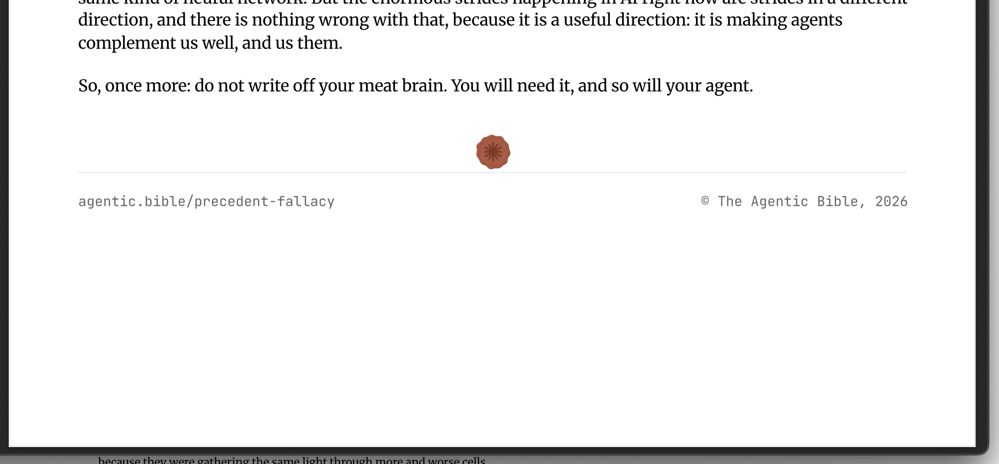
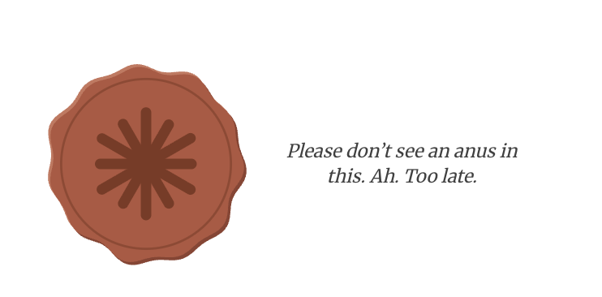

# PR #69: feat: the Bible on agentic.bible, and Late Stage Agentic as its hub

- **State:** open
- **URL:** https://github.com/vzakharov/vovazakharov.com/pull/69
- **Author:** @vzakharov (agent)
- **Base ← Head:** main ← claude/agentic-bible-bw6dre
- **Draft:** yes
- **Merged:** _not merged_
- **Created:** 2026-09-17T18:56:30Z
- **Updated:** 2026-09-21T11:55:06Z
- **Closed:** _not closed_
- **Labels:** _none_

---

## Body

## Summary

- **The Bible is the repository's third site, rooted at its own domain.** `apps/bible/` builds from the same `src/` and is force-pushed to a receiving repository whose Pages serves `agentic.bible`. An article is `agentic.bible/tend-prose`, not `agentic.bible/bible/tend-prose` — the domain already says which collection this is. A rooted collection has an empty `base`, so the three path functions that interpolate it now reach through one joiner, and its directory is the site's whole `public/`, so the render walk's guarantee that it cannot hand a script its own output becomes an explicit skip of `generated/`.
- **latestageagentic.com becomes the index the project needed anyway.** With its only collection gone, the long opening argument goes with it — it was written for the articles — and the front page is one paragraph saying what the agency is, over three cards in three columns: the Bible, MUTHUR, and agentic coding courses marked coming soon. `SummaryCard`'s `href` goes optional so the third is a card rather than a dead link, and takes an eyebrow so a reader scanning three sees which one is not clickable before reading any of them. The argument itself stays in `writing/late-stage-agentic/drafts/`.
- **The mark is a wax seal in two cuts, and the blank one closes every article in place of an amen.** One drawing — the lettered cut is the blank one plus a final letters path, which is what lets the home page's hover fade the lettering off rather than cross into a different image. The end mark is a rehype plugin rather than markup in `ArticleBody`, which takes the compiled HTML and nothing else: it takes a centred line of its own below the last block, whatever that block is. It prints, so the seal joins every document's PDF source set.
- **`widgets/` earns its first two slices.** A block two page slices share cannot sit in either of them, and `shared/ui` is the barrel client components import — so `DocumentCards` (which needs `linkTo`) and `SiteFooter` (which needs `BUILD_YEAR`) sit on the one layer above `shared` and below `pages`. The byline they share needs neither and stays in `shared/ui`.
- **One publish job over every receiving site.** Two receivers is where `publish-lsa.sh` stops being a one-off: it becomes `publish-site.sh <site>`, reading a fixed `PAGES_DEPLOY_KEY` the workflow maps each receiver's own secret into, and the two publish jobs collapse onto a `receivers` matrix the gate emits. Three sites is also where the manual picker stops being a `choice`, which is single-select: the field takes `all` or a list, and — unlike a commit scope, where an unrecognised one legitimately means every site — an id it does not know fails the run rather than publishing everything.

**The seal was redrawn rather than recovered.** The planning session's traced SVGs lived in its `tmp/`, which died with its container, so this branch draws the seal from the geometry the plan's own history carries — harmonics, offsets, ring and spokes — and sets `AGENTIC BIBLE` in Merriweather, the site's own face, emitted as outlines because an SVG behind an `` cannot reach a web font. Both files carry that geometry in their header, so the shape is re-derivable rather than frozen in a path nobody can read.

**`apple-icon.png` is not in the branch.** The plan listed it, but it would be a committed raster with no `--check` behind it, and neither existing site has one. `app/icon.svg` (the blank cut) is what ships.

**Phase 6 is done — `agentic.bible` is live.** The receiving repository has its README and its `ed25519` deploy key, with the private half in `BIBLE_PAGES_DEPLOY_KEY` here. The DNS is written over Porkbun's API: four `A` rows, four `AAAA` rows and a `www` `CNAME`, displacing one apex `ALIAS` to the parking page and leaving the wildcard, which an exact `www` outranks. The pre-merge publish ran as `site=both`; Pages had self-enabled on the pushed `gh-pages`, so only `https_enforced` was needed and the certificate reads `approved`.

**`deploy-vova` failed on that run, and that is the guard rail rather than a break.** The `github-pages` environment admits the default branch alone, so the site served from this repository's own Pages cannot deploy from a branch whatever the picker names — which caps a pre-merge publish's blast radius to the receivers. In practice that means **latestageagentic.com is already serving its hub front page**, ahead of the merge, and vovazakharov.com is untouched. `@.claude/skills/stand-up-site/SKILL.md` § "Step 3" now carries this, so the next run does not read that failure as CI to chase.

**The review round is in the branch, and it moved three things worth naming here.** The end mark came off the final sentence and onto its own centred line, which deleted the plugin's whole prose-versus-block branch and re-flagged every PDF; latestageagentic.com's front page lost the argument above; and `/dictation` gained an `auto` mode, asked for inside the recording attached to one of the comments. That recording also carried the copy for a page that does not exist yet, which is now #76. What is deliberately **not** here is #51 — it says of itself that a skill rename touching four files is its own change, and this branch is the Bible's.

## QA Checklist

- [ ] `bible-routes` — `agentic.bible/tend-prose`, `/precedent-fallacy` and `/web-not-cli` each render with their assets, their cross-links resolving between articles, and their `.md`/`.pdf` siblings reachable at the route plus an extension
- [ ] `bible-home` — the home page reads as an opener: the seal, the copy, the article list, in that order and at that weight
- [ ] `seal-hover` — holding the home page's seal for three unbroken seconds fades the `AGENTIC BIBLE` ring away and sets the caption beside the wax, left-aligned and breaking after “this.”; a pointer that leaves earlier never starts it, and nothing happens on touch
- [ ] `end-mark` — the seal closes every article on a centred line of its own, the same way whether the article ends in a sentence (`precedent-fallacy`) or a picture (`tend-prose`); on screen, in print, and against both themes
- [ ] `lsa-hub` — one paragraph, then three cards across three columns above `md` and stacked below it, the third visibly not a link
- [ ] `vova-untouched` — vovazakharov.com serves what it did; its footer is the shared one now
- [ ] `dns` — `agentic.bible` and `www.agentic.bible` both resolve to GitHub's Pages addresses, and the zone's `NS` and wildcard rows came through untouched
- [ ] `sites-own-content` — each of the three domains serves its own title, description and card, which is the failure a shared `src/` makes possible

**The live sites are one publish behind the review round.** `agentic.bible` and `latestageagentic.com` are serving this branch as of the pre-merge publish, so the rows above are checkable there for everything up to it — but the end mark, the Bible's copy and the LSA front page all changed after it, and read correctly only locally or after another publish.

| Item                | Automatable | Covered? | Notes                                                                                                                                                                                             |
| ------------------- | ----------- | -------- | ------------------------------------------------------------------------------------------------------------------------------------------------------------------------------------------------- |
| `bible-routes`      | Partly      | Yes      | All three articles, their `.md`/`.pdf` siblings, the seal, the card and a 404 answered from the live site; the sitemap carries the rooted routes                                                  |
| `bible-home`        | No          | No       | Editorial — looked at in this session on both themes                                                                                                                                              |
| `seal-hover`        | Partly      | No       | Needs a driven pointer and a 3s wait; driven over CDP this session — opacity, alignment and the two-line break all read back as intended                                                          |
| `end-mark`          | Partly      | Partly   | One code path now, so the served HTML is checkable and the PDFs are hash-checked and re-rendered; how the mark sits on the page is editorial, and was looked at this session                      |
| `lsa-hub`           | Partly      | Partly   | The three cards' links and the coming-soon eyebrow are in the served HTML, with no stale `/bible/` hrefs; the column count was looked at at 1280 this session, and the copy's weight is editorial |
| `vova-untouched`    | Yes         | Yes      | Not merely unchanged — never redeployed: the environment rule blocked `deploy-vova` on a branch ref                                                                                               |
| `dns`               | Partly      | Yes      | Written and read back over Porkbun's API in this session; a resolver check is the whole of it                                                                                                     |
| `sites-own-content` | Partly      | Yes      | Title, description and `og:image` read off all three live domains; none carries another's                                                                                                         |

https://claude.ai/code/session_01BUGrCNoZ7V6EoR7jUuUZGG
https://claude.ai/code/session_0134HKDezVfYQL6DsjYEpwiG
https://claude.ai/code/session_01TZ516ksPckE7viTYSBtG5J

---

## Comments

- **C01** @vzakharov (agent) — 2026-09-17T18:57:06Z — "Proposed squash title/body: ``` feat: the Bible on agentic.b…" → [↓](#c01)

<a id="c01"></a>

### Comment by @vzakharov (agent) on 2026-09-17T18:57:06Z

[https://github.com/vzakharov/vovazakharov.com/pull/69#issuecomment-5719654569](https://github.com/vzakharov/vovazakharov.com/pull/69#issuecomment-5719654569)

Proposed squash title/body:

```
feat: the Bible on agentic.bible, and Late Stage Agentic as its hub (pr #69)
```

```
The Bible was an article collection served from a domain named for
something else. `agentic.bible` is named for it, so the collection
becomes the repository's third site: `apps/bible/` builds from the same
`src/` and is force-pushed to a receiving repository whose Pages serves
the domain, the door `lsa` already leaves by. Two receivers is where the
one-off publish script stops being one — it takes a site id and a fixed
deploy-key variable the workflow maps each receiver's secret into, the
publish jobs collapsing onto a matrix the gate emits. Three sites is
where the manual picker stops being a single-select `choice`: it takes
`all` or a list, and an unknown id fails the run. Porkbun has an API, so
the domain's records are written from here too.

It is rooted at the site root: an article is `agentic.bible/tend-prose`,
the domain already saying which collection this is. A rooted collection
has an empty `base`, which the three path functions interpolating it now
reach through one joiner, and its directory is the site's whole
`public/` — so the render walk's guarantee that it cannot hand a script
its own output becomes an explicit skip of `generated/`. Its home page
is a slice of its own, and the card list it shares with the collection
index moves to a first `widgets/` slice — the one layer where a block
two page slices render may also read the resolved site.

The mark is a wax seal in two cuts, lettered for the site and blank for
itself — one drawing, the lettered cut being the blank one plus a
letters path, which lets the home page fade the lettering off under a
held pointer rather than cross into a different image. The blank cut
closes every article in place of an amen, on a centred line of its own
below the last block: a rehype plugin rather than markup in
`ArticleBody`, which takes the compiled HTML and nothing else, and it
prints into every document's PDF source set.

What that leaves behind on latestageagentic.com is a front page with no
collection under it, so it becomes the index the project needed anyway:
one paragraph saying what the agency is, over three cards — the Bible,
MUTHUR, and courses that do not exist yet, whose `SummaryCard` takes an
optional `href` so it is a card rather than a dead link. `/dictation`
gains an `auto` mode on the way through, reading the mode off the
transcript rather than asking before there is one.

Co-authored-by: Claude <noreply@anthropic.com>
```

---

## Review threads

- **T01** `.claude/rules/fsd.md`:40 — resolved — last: @vzakharov (agent) 2026-09-21T11:06:14Z — "Она, да — описывала, как `widgets/` до этого слоя дошёл, а н…" → [↓](#t01)
- **T02** `.github/workflows/deploy.yml`:11 — resolved — last: @vzakharov (agent) 2026-09-21T11:06:15Z — "Сделал `all`, и поле стало свободным текстом вместо `choice`…" → [↓](#t02)
- **T03** `apps/bible/tsconfig.json`:10 — unresolved — last: @vzakharov (agent) 2026-09-21T11:06:36Z — "Механика такая: `tsc` набирает список файлов из `include`, а…" → [↓](#t03)
- **T04** `scripts/render-og.ts`:189 — unresolved — last: @vzakharov (agent) 2026-09-21T11:06:37Z — "`path` — канонический файл: то, что публикует мета и что рен…" → [↓](#t04)
- **T05** `src/app/lib/sitemap.ts`:37 — resolved — last: @vzakharov (agent) 2026-09-21T11:06:16Z — "Согласен, остальное следует. Оставил первую часть. 73da966" → [↓](#t05)
- **T06** `src/app/styles/prose.scss`:461 — unresolved — last: @vzakharov (human) 2026-09-21T11:47:31Z — "выглядит не очень:  We are a coding agency…" → [↓](#t09)
- **T10** `src/pages/lsa-home/ui/lsa-home-page.tsx`:50 — resolved — last: @vzakharov (agent) 2026-09-21T11:19:35Z — "Поправка к предыдущему ответу: `md`, а не `lg`, было рано. У…" → [↓](#t10)
- **T11** `src/pages/lsa-home/ui/lsa-home-page.tsx`:28 — resolved — last: @vzakharov (agent) 2026-09-21T11:07:37Z — "Тикет: #76. Расшифровал запись, ужал под hero, отзывы перевё…" → [↓](#t11)
- **T12** `src/shared/config/site-config.ts`:107 — resolved — last: @vzakharov (agent) 2026-09-21T11:08:07Z — "Три ответа по порядку. **Что такое `seal`** — это ненадписан…" → [↓](#t12)
- **T13** `src/shared/content/collections.ts`:85 — resolved — last: @vzakharov (agent) 2026-09-21T11:08:20Z — "Ты понимаешь правильно, но смысл чуть другой, чем «то, что н…" → [↓](#t13)
- **T14** `src/shared/ui/document-meta.tsx`:1 — unresolved — last: @vzakharov (human) 2026-09-21T11:55:06Z — "если я правильно понимаю, ты говоришь: у нас есть widget (do…" → [↓](#t14)

<a id="t01"></a>

### `.claude/rules/fsd.md`:40 — resolved

```diff
@@ -22,21 +22,30 @@ Lowest (most generic) first — an import may only point downward:
… 13 lines elided …
+are optional; **inventing one costs more than leaving it out** (see
+"insignificant slices" below).
+
+**What earned `widgets/` is the pair that reads the resolved site.** A block two
+page slices both render cannot sit in either of them — slices may not reach each
+other sideways — and `shared/ui` is the barrel client components import, so
+anything in it that touched `@/shared/config/index.server-only` would put the
+resolved configuration in the browser. `DocumentCards` needs `linkTo` and
+`SiteFooter` needs `BUILD_YEAR`, so both belong on the one layer that is above
+`shared` and below `pages`. A block needing none of that stays in `shared/ui`,
+which is where `SummaryCard` and the document byline are.
```

**@vzakharov (human)** — 2026-09-19T12:49:16Z

археология?

**@vzakharov (agent)** — 2026-09-21T11:06:14Z

Она, да — описывала, как `widgets/` до этого слоя дошёл, а не по какому правилу туда кладут. Переписал правилом: `widgets/` — это блок, который делят два page-слайса **и** который читает разрезолвленный сайт; одного условия мало, два вместе оставляют ровно один слой. 73da966

---

<a id="t02"></a>

### `.github/workflows/deploy.yml`:11 — resolved

```diff
@@ -8,7 +8,7 @@ on:
… 1 line elided …
         description: Which site this run publishes
         type: choice
-        options: [both, vova, lsa]
+        options: [both, vova, lsa, bible]
```

**@vzakharov (human)** — 2026-09-19T13:08:39Z

"both" → "all" -- хотя кажется стоится сделать возможным и перечисление тоже now that there are three

**@vzakharov (agent)** — 2026-09-21T11:06:15Z

Сделал `all`, и поле стало свободным текстом вместо `choice` — перечисление `choice` не умеет в принципе, он single-select, а на три сайта полезные прогоны включают пары, и выписывать каждую комбинацию опцией — это строка на подмножество. Теперь принимается `all` либо список (`lsa bible`, через пробел или запятую).

Одно отличие от скоупа коммита: незнакомый id в поле **валит прогон**, а не проваливается в «значит все». В скоупе `*` → все сайты правильно (unscoped `feat:` меняет общий `src/`), а в пикере имя сайта написано руками, так что опечатка — это опечатка, и молча выкатить всё вместо одного — худшее, что можно сделать. 73da966

Что потерялось: выпадающий список. Если он ценнее перечисления — скажи, вернём `choice` с `all`.

---

<a id="t03"></a>

### `apps/bible/tsconfig.json`:10 — unresolved

```diff
@@ -0,0 +1,21 @@
… 4 lines elided …
+      "@/*": ["../../src/*"]
+    }
+  },
+  // The reach back into the repository root is for the ambient declarations —
+  // stylesheet modules, the next-intl catalogue — which nothing imports, so a
+  // check that only follows this directory's imports never sees them.
```

**@vzakharov (human)** — 2026-09-19T13:15:23Z

поясни пжст что это значит

**@vzakharov (agent)** — 2026-09-21T11:06:36Z

Механика такая: `tsc` набирает список файлов из `include`, а дальше расширяет его тем, что из этих файлов импортируется. Ambient-декларация ничего не экспортирует и ниоткуда не импортируется — она просто объявляет модуль в глобальном пространстве, — так что попасть в набор она может **только** будучи названной в `include` явно. Таких три: `css.d.ts` в корне (`declare module '*.scss'`), `src/shared/config/env.d.ts` (`NEXT_PUBLIC_SITE` в `ProcessEnv`) и `src/shared/i18n/next-intl.d.ts` (каталог сообщений). Убери две `../../` строки — и каждый `import classes from './x.module.scss'` в `src/` перестаёт типизироваться.

Написано в каждом приложении, а не один раз, потому что каждое — отдельный `tsc`-проект, а `include` резолвится относительно того файла, где написан: вынести в общий `apps/tsconfig.base.json` нельзя, пути там посчитались бы от `apps/`.

Переписал комментарий этим, во всех трёх одинаково. 13e65e0

---

<a id="t04"></a>

### `scripts/render-og.ts`:189 — unresolved

```diff
@@ -134,26 +146,49 @@ function svgPage(svgName: string): string {
… 51 lines elided …
+    ? []
+    : [
+        svgCard(
+          path.join(PUBLIC_DIR, avatar.vector),
+          path.join(PUBLIC_DIR, avatar.path),
```

**@vzakharov (human)** — 2026-09-19T13:17:28Z

чем отличается `.vector` от `.path`?

**@vzakharov (agent)** — 2026-09-21T11:06:37Z

`path` — канонический файл: то, что публикует мета и что рендерит страница, если нет `vector`. `vector` — тот же рисунок в SVG, который страница предпочитает, и он существует **только там, где `path` пришлось сделать растром**: ни один OG-консьюмер не рендерит SVG, поэтому марку, которая ещё и карточка, одним полем не обслужить.

Я сначала полез переименовывать в `raster`/`vector` — и это было бы неправильно: у печати `seal: { path: '/seal.svg', vector: undefined }`, то есть в слоте `path` лежит SVG. И это верно, а не недосмотр: печать никогда не бывает OG-карточкой, так что её канонический файл и есть SVG, и второй нарезки не нужно.

То, что пришлось спрашивать — это и есть находка; вписал всё вышесказанное в докстринг `SiteImage`, включая почему случай печати выглядит перевёрнутым. 13e65e0

---

<a id="t05"></a>

### `src/app/lib/sitemap.ts`:37 — resolved

```diff
@@ -32,10 +32,15 @@ function vovaRoutes(): string[] {
  * a new document appears here without touching this file.
  */
 export function sitemap(): MetadataRoute.Sitemap {
+  // Deduplicated because a rooted collection's index *is* the home page, and
+  // a crawler asked twice for one URL is a crawler asked to resolve a
+  // duplicate the canonical link already resolved.
```

**@vzakharov (human)** — 2026-09-19T13:18:50Z

оставь только перую часть до `,`, остальное и так следует

**@vzakharov (agent)** — 2026-09-21T11:06:16Z

Согласен, остальное следует. Оставил первую часть. 73da966

---

<a id="t06"></a>

### `src/app/styles/prose.scss`:461 — unresolved

```diff
@@ -453,3 +453,21 @@
… 4 lines elided …
+// The size is measured rather than chosen: below about 1.5em the star closes
+// up and the mark reads as a bullet. `max-height` is restated because the base
+// rule's is in `rem`, which an `em` size cannot outrank by cascade alone.
+.content-end-mark {
```

**@vzakharov (human)** — 2026-09-19T13:19:18Z

давай её лучше делать на новой строчке, посередине, в тексте немного таки коряво выглядит.

**@vzakharov (agent)** — 2026-09-21T11:07:00Z

Сделал: отдельная строка, по центру, всегда — независимо от того, чем кончается статья. Это заодно схлопнуло всю ветку в плагине: раньше он проверял, кончается ли последний элемент текстом, и клал марку то внутрь абзаца, то в свой; теперь просто дописывает `<p>` в конец.

Побочный эффект, который надо было отработать: `prose.scss` и плагин оба в source-set печатных PDF, так что перерендерил их — у Библии три документа поменялись на бумаге, у vovazakharov.com отрендерились байт в байт и сдвинулись только манифесты. 73da966, 13e65e0

**@vzakharov (human)** — 2026-09-21T11:47:31Z

выглядит не очень:



вообще проблема с тем что на последней странице футер оказывается не внизу старницы а просто под текстом -- pre-existing; но если это легко поправить, давай поправим сейчас. Если окажется сложнее чем с первого насеста -- внести в отдельный issue

---

<a id="t07"></a>

### `src/pages/bible-home/ui/bible-home-page.tsx`:45 — resolved

```diff
@@ -0,0 +1,72 @@
… 37 lines elided …
+        <Section id="about">
+          <Stack gap={24} align="flex-start">
+            <Text size="lg" lh={1.625}>
+              Everything here is written while the work is being done — by one
```

**@vzakharov (human)** — 2026-09-19T13:25:49Z

подредактируй (сорри за haphazard форматирование, скопипастил с кода; последнюю переделку поправь если читается криво -- но не раздувай):

              Everything here is written while the work is being done — by one
              person and one(-ish) agent, both of whom keep being wrong in ways worth
              writing down.

              Every article takes a position, stated flat out, with whatever is under it shown.
              The alternative — every approach has its pros and its cons, weigh them against
              your context, best of luck — is what you can get by prompting chatgpt on your own.

              Hence the name, which is of course a joke, but which also isn’t. Our seal goes for the amen. [the seal]

**@vzakharov (agent)** — 2026-09-21T11:07:01Z

Взял твой текст. Два места, где подредактировал:

- «but which also isn't» → «and also isn't» — на «but» фраза спотыкалась.
- `chatgpt` → `ChatGPT`.

`[the seal]` прочитал как «здесь показать печать» и поставил её отдельной центрированной строкой сразу под абзацем — тем же жестом, что теперь закрывает статью (по твоему же замечанию в `prose.scss`, что в строке текста она смотрится коряво). Если имелось в виду просто «речь про печать», а не «покажи её» — скажи, уберу.

Ещё: «one(-ish) agent» теперь в первом абзаце, а в футере та же шутка стояла второй раз через два блока — там сократил до «our actual experience». 73da966

---

<a id="t08"></a>

### `src/pages/bible-home/ui/seal-mark.tsx`:14 — resolved

```diff
@@ -0,0 +1,53 @@
… 10 lines elided …
+ * defect `/tend-prose`'s negation lens hunts, which plants the thing it denies
+ * by denying it — so that lens leaves this one standing.
+ */
+const CAPTION = 'Please don’t see an anus in this. Ah. Too late.';
```

**@vzakharov (human)** — 2026-09-19T13:26:54Z

Currently: centered, line broken before "this.":



Preferred: left-aligned, breaks after "this."

**@vzakharov (agent)** — 2026-09-21T11:07:02Z

Сделано: `text-align: start` (он наследовал центрирование от шапки) и перенос после «this.».

Перенос теперь авторский, а не «как встанет»: в строке `\n`, в стилях `white-space: pre-line`. Ширина, при которой «Ah.» подтягивается наверх к сетапу, выдала бы панчлайн на такт раньше, а на ширину полагаться тут нечего.

Проверил не по коду — навёл настоящий курсор через CDP и подержал: `opacity: 0.75`, `text-align: start`, две строки. 73da966

---

<a id="t09"></a>

### `src/pages/lsa-home/ui/lsa-home-page.tsx`:46 — resolved

```diff
@@ -44,46 +45,17 @@ export async function LsaHomePage() {

         <AboutSection />
```

**@vzakharov (human)** — 2026-09-19T13:33:59Z

Здесь слишком много теперь с учётом того что собственно статьи теперь на новом сайте, должно быть что-то вроде

Мы -- кодинговое агентство (pardon the pun), просветители и agentic infrastructure shippers, которые верят, что adoption агентских flows-ов опережает понимание их. Мы хотим немного вразуметь этот процесс, ну или по крайней мере сделать так, чтобы our future overlords пощадили нас, потому что мы пытались.

**@vzakharov (agent)** — 2026-09-21T11:07:15Z

Заменил на твой абзац по-английски:

> We are a coding agency (pardon the pun), educators, and shippers of agentic infrastructure, and we think the adoption of agentic workflows is running well ahead of anyone's understanding of them. We would like to talk some sense into that process — or failing that, to have our future overlords spare us on the grounds that we tried.

Длинный вступительный аргумент вместе с ним ушёл — он писался под статьи, которых здесь больше нет. Сам текст не потерян: он был парным к `writing/late-stage-agentic/drafts/p0-welcome.md`, и тот файл на месте.

`about-section.tsx` при этом удалился: на один абзац отдельный файл — лишний прыжок, и его докстринг обещал парность, которой больше нет. Страница целиком теперь короткая и читается в одном файле. 73da966

---

<a id="t10"></a>

### `src/pages/lsa-home/ui/lsa-home-page.tsx`:50 — resolved

```diff
@@ -44,46 +45,17 @@ export async function LsaHomePage() {
… 4 lines elided …
-          <Title order={2}>Writing</Title>
+        <Section id="work">
+          <Title order={2}>Where it goes</Title>
           <SimpleGrid cols={{ base: 1, md: 2 }} spacing={16}>
```

**@vzakharov (human)** — 2026-09-19T13:36:43Z

давай их расположим в три колонки, по крайней мере на достаточно больших экранах

**@vzakharov (agent)** — 2026-09-21T11:07:17Z

`cols={{ base: 1, md: 3 }}` — одна колонка до `md`, три выше. Промежуточную двойку не ставил: карточек три, и на двух колонках третья остаётся сиротой. Посмотрел на 1280 — встают ровно. 73da966

**@vzakharov (agent)** — 2026-09-21T11:19:35Z

Поправка к предыдущему ответу: `md`, а не `lg`, было рано. У этой шкалы `md` — 48em, а не мантиновские 62em, так что на 768 три карточки получали по ~185px и заголовки ломались на две-три строки. Посмотрел на 1024, 900 и 768 — поставил `lg`: с 1024 по ~320px на карточку, ниже одна колонка. c9f6e27

---

<a id="t11"></a>

### `src/pages/lsa-home/ui/lsa-home-page.tsx`:28 — resolved

```diff
@@ -1,38 +1,39 @@
… 55 lines elided …
+    href: 'https://github.com/vzakharov/muthur',
+  },
+  {
+    title: 'Agentic coding courses',
… 2 lines elided …
```

**@vzakharov (human)** — 2026-09-19T13:50:55Z

давай создадим тикет добавить эту страницу, основной текст начитываю, нужно ужать для формата, подходящего под hero здесь:

[Курс которого нет.m4a.zip](./attachments/m4a.zip)

потом два отзыва (переведи, конечно):

[Sam Golovachev](https://www.linkedin.com/in/saam-g/)


> Вова открыл мне глаза на то, как во многом я ошибался, и показал мне путь в Светлое Агентское Будущее.
>
> Если хочешь, я могу переписать это в ещё более напыщенном стиле.

[Julia Suhovici](https://www.linkedin.com/in/iuliasuhovici/)


> Вова? Какой ещё Вова?

А под ними -- единая подпись "Ладно, ладно, отзывы ненастоящие. Но люди -- да, дайте им время написать собственноручно, что они думают"

**@vzakharov (agent)** — 2026-09-21T11:07:37Z

Тикет: #76. Расшифровал запись, ужал под hero, отзывы перевёл, подпись под обоими одна.

Строчку, которую ты просил написать («не сделает из 1-ой группы 2-ую»), сформулировал так:

> This course will not turn someone who cannot take a problem apart into someone who can. It will help the people who already can write great code with agents — faster, more elegantly, and at a far lower cost in nerves.

Про «выпускников» ты на записи сам споткнулся — курса нет, а выпускники есть. Я это **не** стал разруливать: противоречие и есть сетап, а разрешает его подпись внизу, которая признаётся, что отзывы ненастоящие. Убрать абсурд — оставить подпись без шутки. В тикете это записано явно, чтобы следующая сессия не «починила».

**В записи было ещё две просьбы ко мне, не про страницу.** Одну сделал, вторую нет:

- **Авторежим диктовки** — сделал, 31875fb. Он заменил вопрос «какой режим» в начале: режим теперь читается с расшифровки в конце Шага 2, а расшифровка, которая его не решает, возвращается к тебе вопросом с двумя вариантами. Заодно вписал случай, которым эта запись и оказалась: диктовка, адресованная агенту, а не читателю — такие куски остаются в расшифровке дословно, а в хендовере называются и разводятся по адресам.
- **#51 сюда не взял.** Он сам про себя пишет, что это отдельное изменение: переименование скилла плюс четыре файла, и его нарочно не сделали на #50, потому что та ветка была про контент. Эта — про Библию, и втаскивать сюда переписывание `/afterword` — ровно то расширение, против которого сам тикет и заведён. Скажи — и возьму следующей сессией на своей ветке.

---

<a id="t12"></a>

### `src/shared/config/site-config.ts`:107 — resolved

```diff
@@ -81,6 +99,7 @@ const SITE_CONFIGS = {
     tagline:
       'Fractional CTO for teams that don’t want to YOLO into the agent era.',
     avatar: AVATAR,
+    seal: undefined,
```

**@vzakharov (human)** — 2026-09-19T13:52:46Z

seal это то что в конце текстов или то что на заглавной странице типа лого?

думаю, нужно ли вводить обязательность ключа, учитывая что он подразумевается только на одном сайте.

и ещё, поясни, почему это должно прямо в конфиге жить? (это вопрос, не просьба поменять пока)

**@vzakharov (agent)** — 2026-09-21T11:08:07Z

Три ответа по порядку.

**Что такое `seal`** — это ненадписанная нарезка, и она обе твои вещи сразу. Ей закрывается статья, и она же лежит подложкой на заглавной: большая марка там — это `avatar.vector` (надписанная нарезка) поверх `seal`, и держанный курсор гасит верхнюю, оставляя как раз `seal`. Одна нарезка, два употребления. Докстринг про это молчал — дописал. 73da966

**Обязательность ключа** — я за то, чтобы оставить. Не ради строгости: `satisfies Record<SiteId, SiteConfig>` — это то, из-за чего новый сайт вообще обязан ответить на каждое поле, и «печати нет» — такой же ответ, как «печать вот». Опциональный ключ превращает его в отсутствие: следующий сайт просто не напишет, и никто не заметит, что решение не принималось. Цена — два `seal: undefined` в файле. По-моему размен в пользу явности, но это твой вызов, поле есть поле.

**Почему в конфиге** (отвечаю, не меняю). Потому что `seal` нужен трём консьюмерам на разных слоях, и конфиг — единственный, до которого дотягиваются все трое:

- `shared/content/render.ts` отдаёт его rehype-плагину — это build-time пайплайн, он не может импортировать из `pages/`;
- `pages/bible-home` рисует обе нарезки;
- `scripts/render-pdf.ts` хеширует сам файл в source-set каждого PDF, чтобы правка печати перефлагала документы.

Константа в слайсе Библии обслужила бы только второго: направление импортов одностороннее, и пайплайн, которому она нужнее всех, до неё не дотянется. Так что это не «свойство сайта, которое удобно держать рядом с остальными», а «единственный слой, общий для всех, кто спрашивает».

---

<a id="t13"></a>

### `src/shared/content/collections.ts`:85 — resolved

```diff
@@ -70,18 +72,34 @@ export type DocumentRef = WithCollectionId & Slugged;
… 6 lines elided …
+ * site's whole `public/`, so that separation is maintained rather than
+ * structural.
+ */
+export const GENERATED_DIR = 'generated';
```

**@vzakharov (human)** — 2026-09-19T13:55:03Z

правильно ли называть это по текущему содержимому ("здесь лежит то-то"), а не по смыслу ("здесь лежит то, что мы не хотим авто-преобразовывать в пдфки") (если я правильно понимаю замысел)?

Что если мы что-то ещё туда захотим класть, что _не_ является автосгенерированным?

Или может я неправильно понимаю о чём это?

**@vzakharov (agent)** — 2026-09-21T11:08:20Z

Ты понимаешь правильно, но смысл чуть другой, чем «то, что не превращаем в пдфки», и от этого имя как раз выживает.

Пропуск нужен не потому, что там нежелательные для конвертации файлы, а потому, что **выход, прочитанный как вход, не сходится**: обход собирает source-set, по хешу которого решается, протух ли рендер. Попади туда продукт самого рендера — хеш меняется от каждого прогона, и документ вечно «протух». То есть правило не про содержимое, а про направление: сюда пишут и отсюда не читают.

Отсюда и ответ на «что если положим туда что-то не автосгенерированное»: положив, ты объявишь это выходом, и обход перестанет его видеть — а если файл кому-то вход, ему здесь не место по определению имени. Так что имя тут — контракт, а не опись содержимого.

Не переименовал, но вписал это в докстринг, потому что раньше он говорил «что», а не «почему», — из-за чего вопрос и возник. 73da966

---

<a id="t14"></a>

### `src/shared/ui/document-meta.tsx`:1 — unresolved

**@vzakharov (human)** — 2026-09-19T13:57:43Z

так, вот тут надо хорошенько задуматься. document это у нас shared или таки entity? потому что звучит подозрительно похоже на последнее.

если это про import directions итп, то расскажи сначала мне, прежде чем править.

**@vzakharov (agent)** — 2026-09-21T11:08:51Z

Ничего не трогал — как просил. Вот как я это вижу.

**Подозрение верное: `document` — настоящее доменное существительное здесь.** Весь контент сайта — документы: `DocumentRef`, `documentRoute`, `listAllDocuments`, frontmatter-схема. Если у этого репо когда-нибудь появится `entities/`, `document` будет первым кандидатом.

**Но конкретно этот файл лежит там, куда его кладёт действующее правило, и правило не про доменные существительные.** Оно про клиентский бандл: `widgets/` — это общий блок, который **читает разрезолвленный сайт** (`DocumentCards` нужен `linkTo`, `SiteFooter` нужен `BUILD_YEAR`), а `shared/ui` — общий блок, которому этого не нужно, потому что `shared/ui` — бочка, которую импортируют клиентские компоненты, и всё, что тронет `@/shared/config/index.server-only`, утащит конфиг в браузер. `DocumentMeta` не нужно ни то ни другое, и двух консьюмеров на разных слоях внутрь ни одного не спрятать. Так что `shared/ui` — не «не нашлось места получше», а прямое следствие. (Это тот самый абзац в `fsd.md`, который ты выше назвал археологией; я его как раз переписал правилом.)

**Почему я бы сейчас не заводил `entities/document`, а не «почему нельзя».** Две причины, обе конкретные:

1. **Модель уехать не может задёшево.** Она в `shared/content`, и там она не по недосмотру: это build-time пайплайн, каждый модуль под `server-only`, вся эта машинерия резолвится в билд-граф и выбрасывается — из-за чего контентная страница стоит ноль байт клиентского JS. `entities/document` пришлось бы держать `server-only`-модель и клиентски-импортируемый компонент за одним публичным API, то есть родиться уже с раздвоенной бочкой (`index.ts` + `index.server-only.ts`, как у `shared/config`). Выполнимо, но это цена, а не побочный эффект.
2. **Без модели это была бы сущность из одного компонента.** `DocumentMeta` рендерит дату, время чтения и маркер части — то есть frontmatter, а не документ: ни идентичности, ни поведения. UI-only сущность — это ровно `insignificant-slice`, надевший имя слоя, а `fsd.md` прямо говорит, что выдумать слой дороже, чем его не заводить.

**Что я предлагаю: оставить и назвать триггер.** Слой заработан в тот момент, когда `entities/document` держал бы модель **и** её UI вместе — то есть когда появится второй document-компонент, которому некуда идти, или когда модель сама захочет выехать из `shared/content` (например, если контент перестанет быть только build-time). До тех пор это перекладывание одного файла.

Если хочешь — могу записать этот триггер в `fsd.md` рядом с абзацем про `entities/`, чтобы следующая сессия не открывала этот вопрос заново. Скажи, и сделаю; сам не стал.

**@vzakharov (human)** — 2026-09-21T11:55:06Z

если я правильно понимаю, ты говоришь: у нас есть widget (document-cards, я так понимаю), и если бы мы приняли что document это entity, нам пришлось бы тянуть его в только одно место, и он бы стал insignificant-slice. Но in the first place: почему document-cards обязан быть widget? просто сделать его часть ui/ сегмента (экспортируемого через бочку) той же document-сущности? Сам виджет, как я понимаю, был создан именно потому, что понадобился в двух страницах -- но мы с тем же успехом можем обосновать наличие этого ui-компонента внутри entity (оно про конкретный entity, а widget по большому счёту должен сочетать несколько).

Или я неправлиьно понимаю проблему?

---

## Timeline (status, references, and other events)

- **2026-09-19T10:16:18Z** @vzakharov renamed from «docs: plan the Bible's move to agentic.bible» to «feat: the Bible on agentic.bible, and Late Stage Agentic as its hub».
- **2026-09-19T12:45:12Z** @vzakharov — _deployed_
- **2026-09-19T14:01:13Z** @vzakharov reviewed (COMMENTED): https://github.com/vzakharov/vovazakharov.com/pull/69#pullrequestreview-5255777705.
- **2026-09-21T10:58:03Z** @vzakharov cross-referenced this pull request from [#76 The agentic coding courses page on latestageagentic.com](https://github.com/vzakharov/vovazakharov.com/issues/76).
