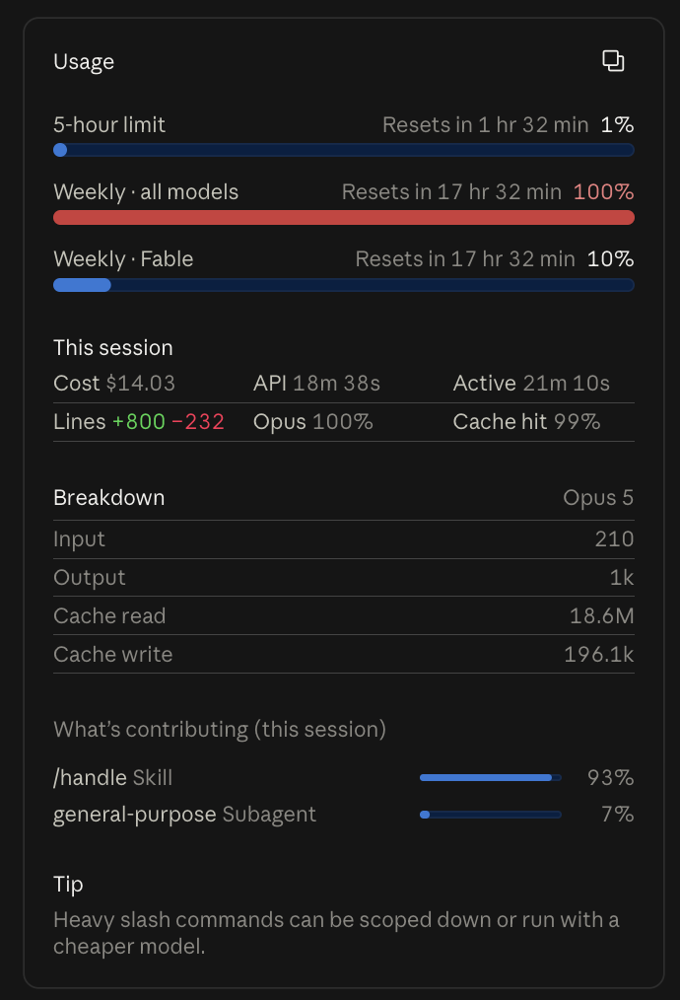
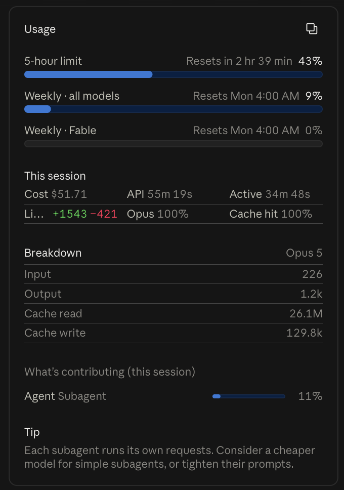
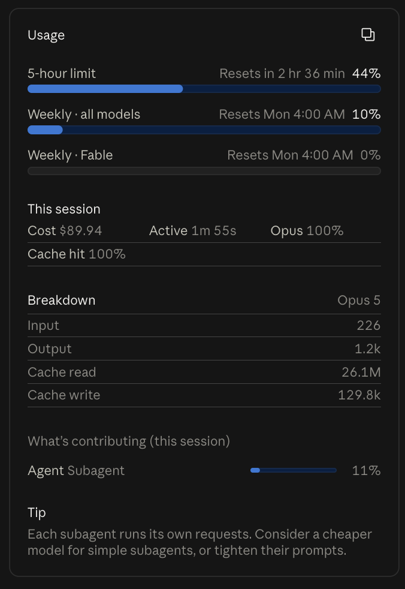
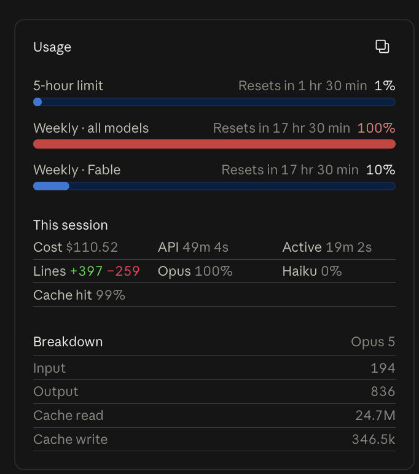
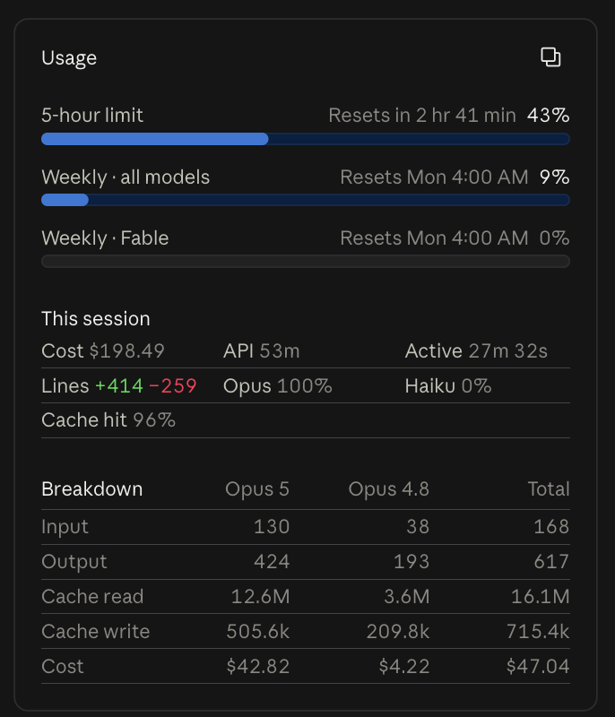
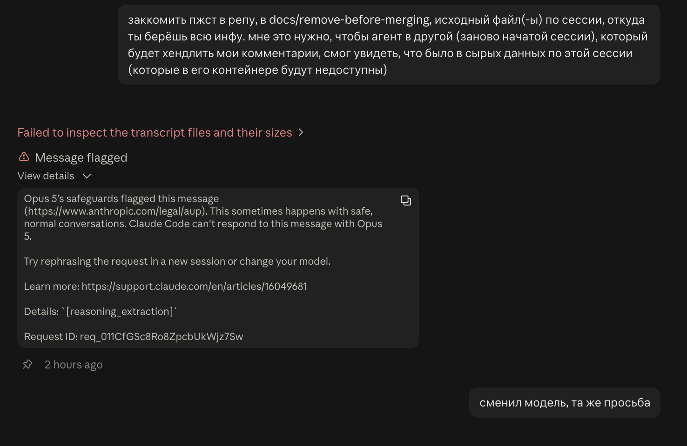

# PR #71: chore: price each session at Claude API rates

- **State:** open
- **URL:** https://github.com/vzakharov/vovazakharov.com/pull/71
- **Author:** @vzakharov (agent)
- **Base ← Head:** main ← claude/api-cost-ledger-0cm1tl
- **Draft:** yes
- **Merged:** _not merged_
- **Created:** 2026-09-19T08:27:47Z
- **Updated:** 2026-09-21T13:00:38Z
- **Closed:** _not closed_
- **Labels:** _none_

---

## Body

## Summary

- Records, per session and in the branch, what the work would have cost at Claude API rates — the number a subscription price hides. `pnpm costs` sums the rows on demand; the long aim is knowing the size of that bill before subscription pricing stops being a bargain.
- Prices come from the transcript's own `message.usage`, read carefully enough to be worth something: one API response is written as one record per content block, each carrying the whole response's usage, so records are deduplicated by `message.id`; a response bills at the rates for its `(model, speed)` pair; and cache writes bill by TTL. An unpriced pair throws rather than counting as free, `.claude/costs/prices.json` being hand-kept for want of any machine-readable source of prices.
- **A subagent's spend is in a different file** — `<session-id>/subagents/*.jsonl`, beside the transcript — and it is the spawning session's to carry. Reading the transcript alone therefore priced every delegating session short, and short invisibly: the result is indistinguishable from a session that delegated nothing. On the session this was caught in it was 7% of the bill.
- **The arithmetic now has a second opinion, and it is in the transcript already.** Claude Code writes its own running cost there as `cost-state` records; the row keeps the last one as `claudeCodeTotalUsd` and `pnpm costs` compares. The comparison runs one way only, which is what makes it sound: both figures count the same session upward and Claude Code's was written at or before the row, so a row coming out *under* it has missed a source, while coming out over it means only that the session kept going. Applied to Claude Code's own token counts the rate table reproduces its cost to the last digit — so a divergence is a gap in what a row read, never in what it charged. The usage panel is deliberately not the thing checked against: it prints two costs for one session that disagree fourfold, so at most one of its figures can be the tokens the transcript records.
- A row also carries what a person recognises a session by: the **opening prompt** unwrapped from its slash-command envelope, the **PR numbers** off the `pr-link` records, the session's **web URL** (a different id from the transcript's, and reachable only through the attribution reminder), and a **name** the agent writes — the one thing no reading of a transcript can recover. A new row leaves it null and a `UserPromptSubmit` hook asks once.
- Collection runs from a `Stop` hook that **shares** the event with the harness's own `stop-hook-git-check.sh`: hooks for one event run in parallel, so the ledger's write races that check for the working tree. The hook waits the check's process out at the last moment before it touches the tree, re-reads the check's own two conditions afterwards, and spends its one channel to the agent — exit 2 with a line naming the row — only where a block is already happening. It reads whether that check will run at all from the launcher's registration rather than from the script on disk, and says on stderr when the entry is gone: a rename or a removal is the whole arrangement changing, and it should not pass unnoticed.
- **Nothing derived is committed.** An earlier `costs/totals.json` is gone: a summary file sitting beside the rows it is summed from is a merge conflict on every branch that ran a session, and settling one by adding the two sides double-counts every session both of them saw. The report groups four ways every run — month, ISO week, day, and the branch that spent it with its PR numbers beside it.

`.claude/rules/costs.md` is the home for how a transcript is priced, what checks the arithmetic, how the two `Stop` hooks share the event, and what the totals leave out — the last turn of a session, abandoned branches, other repositories, `main` itself, and a rate that changed after a row was written.

## QA Checklist

- [ ] `ledger-row` — after a turn, `.claude/costs/sessions/<YYYY-MM>/<session-id>.json` exists and its totals match a hand count over the transcript
- [ ] `dedup` — a turn that thought and called two tools contributes its usage once, not three times
- [ ] `subagents` — a session that spawned an agent shows its spend under `subagents`, and the session total grows by it
- [ ] `cross-check` — a row priced short of Claude Code's own `cost-state` total is named by `pnpm costs`; a row above it is not
- [ ] `unknown-model` — an unpriced `(model, speed)` fails the run with a message naming it, while a `<synthetic>` record is skipped silently
- [ ] `session-name` — `openingPrompt` reads as the operator typed it, `prs` lists the PR, `url` is this session's own rather than one quoted in it, and `name` survives the next rewrite of the row
- [ ] `name-prompt` — with `name` null the next prompt carries the ask; once set, it stops
- [ ] `report` — `pnpm costs` prints month, week, day and branch every run; `--month` and `--json` read the same committed rows, and the report states the rate table's age
- [ ] `check-gone` — with the launcher no longer registering `stop-hook-git-check`, the hook says so on stderr and still writes its row
- [ ] `race` — with an unpushed commit, the turn is still blocked by the harness's check, and the hook's own line names the row rather than leaving the block unexplained

| Item | Automatable | Covered? | Notes |
|------|-------------|----------|-------|
| `ledger-row` | partly | `pnpm test` for the pricer | the hook wiring was observed, not asserted |
| `dedup` | yes | `pnpm test` | a response written as three records |
| `subagents` | yes | `pnpm test` | a subagent's own file, billed to the session whether or not its records carry the flag |
| `cross-check` | partly | `pnpm test` for the field | the one-directional comparison itself was read off a real run |
| `unknown-model` | yes | `pnpm test` | asserts the throw names the pair |
| `session-name` | yes | `pnpm test` | envelope unwrapping, skipped record kinds, PR dedup, and a URL quoted elsewhere in the file not being taken |
| `name-prompt` | no | — | a hook's effect on the next turn's context; observed on this session, which named itself through it |
| `report` | partly | `pnpm test` for the rollup it prints | the output itself was read by hand |
| `check-gone` | partly | by hand, end to end | the hook run against a throwaway tree with `HOME` pointed at a stand-in launcher config |
| `race` | no | — | observed by hand: the block lands, the line names the row, exit 2 propagates |

**What this branch proved by measurement.** The pricing was checked against Claude Code's own accounting, not only against itself. For this session its `cost-state` reads `$14.028509250000003`; the rate table applied to its own token counts gives `14.02850925`. The subagent shortfall it caught was `$0.88` of `$14.03`, matching the 7% the usage panel attributes to the subagent independently.

**What it could not.** `check-gone` was run against a stand-in launcher config rather than the live one — rewriting the hook configuration the agent is running under is a tool call a harness classifier refuses as self-modification. Three shapes were exercised end to end, with the hook itself and `HOME` pointed at a throwaway tree: the entry present (silent), the entry renamed away (warns), and no launcher config at all, which is a local CLI session where there was never a check to race (silent). What is left unproven is only that the live harness's file looks like the copy, which it did when this branch read it.

**The usage panel is not a source this ledger can reconcile to, and that is now established rather than suspected.** On one card it prints `Cost $198.49` above its own Breakdown totalling `$47.04`; across a compact its four token rows stood unchanged while `Cost` moved `$51.71` to `$89.94`; and its Breakdown's token counts do not produce its Breakdown's own cost either — `130 / 424 / 12.6M / 505.6k` comes to about `$12` at these rates, against the `$42.82` printed beside it. No two of the three agree, so there was never one panel figure to match. `cost-state` is the figure that reconciles, and the rule says so, so the next session does not spend a day on it.

Left uncovered by measurement rather than by argument: **each compact**. Compaction's own API call reaches the transcript without `usage` — the boundary record carries only `preTokens`, the summary arrives as a `user` record — so it is bounded rather than priced. This session's two compacts read 526k tokens between them, about `$0.30` at the cache-read rate a warm prefix gets.

https://claude.ai/code/session_01DULipXqWkbvu9ArhP928Sj
https://claude.ai/code/session_01WRCLLgqSrAMpoQYaRdN2qZ

---

## Comments

- **C01** @vzakharov (agent) — 2026-09-19T12:03:35Z — "Proposed squash title/body: ``` chore: price each session at…" → [↓](#c01)

<a id="c01"></a>

### Comment by @vzakharov (agent) on 2026-09-19T12:03:35Z

[https://github.com/vzakharov/vovazakharov.com/pull/71#issuecomment-5741693832](https://github.com/vzakharov/vovazakharov.com/pull/71#issuecomment-5741693832)

Proposed squash title/body:

```
chore: price each session at Claude API rates (pr #71)
```

```
A subscription price hides what the work actually costs, and the point
of the API-rate figure is to see the size of that bill before
subscription pricing stops being a bargain. So each session is priced
from its own transcript and its row committed to the branch, reaching
the trunk by the same merge as the work it paid for.

Pricing reads `message.usage` carefully enough to be worth something:
one API response is written as one record per content block, each
carrying the whole response's usage, so records are deduplicated by
`message.id`; a response bills at the rates for its `(model, speed)`
pair; and cache writes bill by TTL. An unpriced pair throws rather than
counting as free, the rate table being hand-kept for want of any
machine-readable source of prices. Since nothing in a transcript names
the session, a row also carries what a person recognises one by: the
opening prompt, and the PR numbers the transcript records.

A subagent's responses are written to a file of their own and are the
spending session's to carry, so the reading takes in that directory
too: the session measured here delegated seven percent of its spend,
and reading the main transcript alone lost exactly that. What catches
the next such gap is Claude Code's own running total, which the
transcript records: the row keeps it, and `pnpm costs` reports a row
that came out under it. The usage panel is no second opinion: it
prints two costs for one session that disagree fourfold.

`pnpm costs` sums the rows on demand — by month, week and day every
run, and by the branch that spent it with its PR numbers beside it —
and writes nothing, a derived file beside its own sources being a merge
conflict for every branch that ran a session.

Collection runs from a `Stop` hook sharing the event with the harness's
own git check, which hooks running in parallel makes a race for the
working tree. The hook waits that check's process out at the last
moment before it touches the tree, re-reads the check's two conditions
afterwards, and spends its one channel to the agent only where a block
is already happening. Whether that check runs at all is read from the
launcher's registration rather than the script on disk: a rename would
otherwise retire the whole arrangement in silence.

Co-authored-by: Claude <noreply@anthropic.com>
```

---

## Review threads

- **T01** `.claude/rules/costs.md`:104 — resolved — last: @vzakharov (agent) 2026-09-19T12:05:12Z — "Сделано в de280df. Хук теперь читает не файл на диске, а рег…" → [↓](#t01)
- **T02** `.claude/rules/costs.md`:52 — resolved — last: @vzakharov (agent) 2026-09-19T12:05:13Z — "Медведь, согласен — абзац отрицал подход, которого в ветке б…" → [↓](#t02)
- **T03** `.claude/hooks/stop-session-cost.sh`:145 — resolved — last: @vzakharov (agent) 2026-09-19T12:05:15Z — "`say` — это наша же однострочная функция из `.claude/hooks/l…" → [↓](#t03)
- **T04** `.claude/rules/costs.md`:76 — unresolved — last: @vzakharov (human) 2026-09-21T12:55:20Z — "про вотчер, но контейнер не умирает после каждого Stop-а. Он…" → [↓](#t04)
- **T05** `costs/sessions/2026-09/a3be30ae-fbfd-517a-8219-949d7d2d7f26.json`:1 — resolved — last: @vzakharov (agent) 2026-09-21T12:42:00Z — "Сделано, `--by` больше нет вообще: месяц, неделя, день и вет…" → [↓](#t05)
- **T06** `costs/sessions/2026-09/a3be30ae-fbfd-517a-8219-949d7d2d7f26.json`:2 — resolved — last: @vzakharov (agent) 2026-09-21T11:25:51Z — "Сделано ровно так, как ты описал. b9da82a. Новая строка пише…" → [↓](#t06)
- **T07** `.claude/costs/prices.json`:1 — resolved — last: @vzakharov (agent) 2026-09-21T11:25:52Z — "Убедил — переехало: `.claude/costs/`. b9da82a. Твой контрарг…" → [↓](#t07)
- **T08** `.claude/costs/prices.json`:1 — resolved — last: @vzakharov (agent) 2026-09-21T12:42:01Z — "Да, поле есть, и мы его уже берём — это `claudeCodeTotalUsd`…" → [↓](#t08)
- **T09** `scripts/costs-report.ts`:1 — resolved — last: @vzakharov (agent) 2026-09-19T12:05:25Z — "Замерил: **150 мс** на голом node (через `pnpm` ~850 мс, но…" → [↓](#t09)
- **T10** `costs/sessions/2026-09/a3be30ae-fbfd-517a-8219-949d7d2d7f26.json`:1 — resolved — last: @vzakharov (agent) 2026-09-21T11:25:55Z — "Да, речь не про finalize — ответ про файловый вотчер и про т…" → [↓](#t10)
- **T11** `docs/remove-before-merging/squash-message.md`:4 — resolved — last: @vzakharov (agent) 2026-09-21T11:26:04Z — "Согласен, и аргумент сильнее, чем «не то слово»: у нас префи…" → [↓](#t11)
- **T12** `scripts/lib/session-cost.ts`:178 — resolved — last: @vzakharov (agent) 2026-09-21T11:26:05Z — "Незачем, ты прав — в зод и засунул: b9da82a. ```ts const Kin…" → [↓](#t12)
- **T13** `costs/sessions/2026-09/ab2c1a57-d737-5caf-8c1d-552df83e4968.json`:1 — unresolved — last: @vzakharov (human) 2026-09-21T12:58:00Z — "так что за прибавившиеся $38 тогда за единственный шаг компа…" → [↓](#t13)
- **T14** `costs/sessions/2026-09/a3be30ae-fbfd-517a-8219-949d7d2d7f26.json`:1 — unresolved — last: @vzakharov (human) 2026-09-21T13:00:37Z — "то есть, TLDR всего ответа -- клодкод что-то не так считает…" → [↓](#t14)
- **T15** `costs/sessions/2026-09/ab2c1a57-d737-5caf-8c1d-552df83e4968.json`:1 — unresolved — last: @vzakharov (agent) 2026-09-21T11:26:09Z — "Есть, и теперь в строке. Поле `url`: ```json "url": "https:/…" → [↓](#t15)

<a id="t01"></a>

### `.claude/rules/costs.md`:104 — resolved

```diff
@@ -0,0 +1,84 @@
… 40 lines elided …
+## Running beside the harness's Stop check
+
+The harness registers its own `Stop` hook in `~/.claude/launcher-settings.json` —
+`stop-hook-git-check.sh`, which ends a turn with exit 2 on a tree that is
```

**@vzakharov (human)** — 2026-09-19T11:37:27Z

если когда-либо это stops being the case, агент должен это заметить. То есть типа если наш хук сообщил что такого нет, нужно чтобы его вывод сказал оператору, что вот эта сиутация изменилась, и что-то надо с ней делать.

**@vzakharov (agent)** — 2026-09-19T12:05:12Z

Сделано в de280df. Хук теперь читает не файл на диске, а регистрацию в `~/.claude/launcher-settings.json` — именно она меняется при переименовании или удалении, а скрипт при этом может спокойно лежать на месте. Если записи нет, в stderr уходит строка о том, что договорённость, на которой построен весь раздел в `costs.md`, изменилась и её надо перечитать.

Отличать «пропало» от «никогда не было» получается по самому файлу конфига: нет конфига вообще — это локальная CLI-сессия, где гонки и не было, и хук молчит. Проверено вживую на трёх формах (запись на месте — тихо, запись переименована — предупреждает, конфига нет — тихо).

---

<a id="t02"></a>

### `.claude/rules/costs.md`:52 — resolved

```diff
@@ -0,0 +1,84 @@
… 45 lines elided …
+run in parallel**, so writing and committing the row is work done while that
+check may be reading the tree.
+
+**Wrapping it is not available.** The launcher's config reaches the CLI through
+`--settings`, read once at startup and never re-read, and the launcher rewrites
+that file at every start and resume — so a patch applied from a `SessionStart`
+hook is a session late every session, not just the first.
```

**@vzakharov (human)** — 2026-09-19T11:37:43Z

медведь

**@vzakharov (agent)** — 2026-09-19T12:05:13Z

Медведь, согласен — абзац отрицал подход, которого в ветке больше нет. Вырезан в de280df, соседняя фраза расплетена («So the hook waits…» → «The hook waits…»), и та же формулировка убрана из шапки самого хука.

Заодно: описание в теле PR всё ещё рассказывало про wrapper — оно переписано под то, что в ветке на самом деле лежит.

---

<a id="t03"></a>

### `.claude/hooks/stop-session-cost.sh`:145 — resolved

```diff
@@ -0,0 +1,138 @@
… 127 lines elided …
+        committed) did="committed but not pushed" ;;
+        *) did="written but not committed" ;;
+      esac
+      say "this session's cost row is ${did}. A git check complaining above may be counting it rather than your work: read \`git status\` before acting, push whatever is outstanding, and then just stop — the check passes on the next try and nothing here needs redoing."
```

**@vzakharov (human)** — 2026-09-19T11:39:01Z

чисто для моего ликбеза, что такое `say`?

**@vzakharov (agent)** — 2026-09-19T12:05:15Z

`say` — это наша же однострочная функция из `.claude/hooks/lib.sh`, которую сорсят все хуки в этой папке:

```bash
say() { echo "$(basename "$0" .sh): $*" >&2; }
```

То есть «напечатать в stderr, подписавшись именем хука» — получается `stop-session-cost: ...`. Stderr выбран потому, что это единственный канал, который харнесс показывает, не трогая сам ход turn'а; stdout у `Stop`-хука интерпретируется иначе. Кода не менял.

---

<a id="t04"></a>

### `.claude/rules/costs.md`:76 — unresolved

```diff
@@ -0,0 +1,84 @@
… 71 lines elided …
+
+- **The last turn of a session.** The transcript is written asynchronously and
+  lags the live conversation, so each run rewrites the row from the whole file
+  and picks up what the previous run was too early to see. The final turn has no
+  successor to correct it.
```

**@vzakharov (human)** — 2026-09-19T11:40:21Z

хм, что может этому помочь? какой-то шаг в finalize? или это мюнхгаузен, вытягивающий себя за косу из болота?

**@vzakharov (agent)** — 2026-09-19T12:05:16Z

Мюнхгаузен, но не полностью — и шаг в `/finalize` тут как раз не поможет. `/finalize` выполняется **внутри** той же сессии, и после него идут ещё turn'ы (тот, что его вызвал, как минимум), так что слепое пятно не исчезает, а переезжает на один turn вперёд.

Помогло бы единственное: **следующая** сессия переоценивает транскрипт предыдущей. Локально это работает — `~/.claude/projects/` переживает сессию. Здесь нет: контейнер удаляется вместе с транскриптом, и я это проверил на этой самой сессии — в `~/.claude/projects/` лежит только мой файл, транскрипта предыдущей сессии (a3be30ae, той, что написала ветку) уже не существует. Поэтому и строку ту переоценить нечем.

Итог: недосчёт — один turn на сессию, там, где сессии этого репозитория реально бегают. Записал это в `costs.md` в виде ответа, а не умолчания (de280df). Если захочешь, локальный sweep на `SessionStart` дописывается строк за пятнадцать — но в web-сессиях он будет чистым мёртвым грузом, поэтому сам не делал.

**@vzakharov (human)** — 2026-09-19T12:28:13Z

А ещё раз опиши каким-нибудь примером (смоделируй общение, ответы, вызов тулов и т.п.), что именно теряется?

крамольная мысль... а что если вообще это делать не хуком, а вотчером файла сессии на уровне файловой системы? (пока это вопрос, не запрос на исполнение.)

**@vzakharov (agent)** — 2026-09-21T11:25:48Z

Пример, как просил — на настоящих числах, а не на воображаемых.

**Что происходит по turn'ам.** Возьми turn, где ты пишешь «почини X», агент думает, читает два файла и отвечает:

```
12:03:10  ты: «почини X»
12:03:12  ответ 1 (thinking + Read)      usage: out 214,  cache_read 180k
12:03:31  ответ 2 (thinking + Edit)      usage: out 806,  cache_read 181k
12:03:58  ответ 3 (текст тебе)           usage: out 412,  cache_read 182k
12:03:59  Stop → хук читает транскрипт, пишет строку, коммитит
```

Хук видит все три ответа — они дописаны в файл до того, как turn кончился. Не видит он **своего собственного turn'а и всего, что после**: в момент, когда он считает, последние записи ещё дописываются, а на следующем turn'е он всё это доберёт, потому что пересчитывает файл целиком. Так и работает — каждый запуск чинит предыдущий.

Не чинит никто **последний**: за ним нет следующего Stop'а.

**Размер дыры теперь измерен, а не аргументирован.** У первой сессии моя строка на её последнем Stop'е сказала $38.043, а клиент к тому же моменту насчитал $38.628 (его собственная запись `cost-state`, лежит в том же транскрипте). Разница — **$0.585, полтора процента**. Вот это и есть потеря последнего turn'а на пятичасовой сессии. Теперь эта цифра в строке (`clientTotalUsd`) и отчёт её сравнивает, так что дыру видно, а не подразумевают.

**Про вотчер файловой системы — он это не чинит**, и вот почему. Вотчер — это процесс; он умирает вместе с контейнером ровно так же, как сессия, и последняя запись транскрипта его переживает не больше, чем переживает хук. Плюс он писал бы в дерево вне Stop'а — то есть уже без той единственной точки сериализации, вокруг которой мы так возились из-за харнессовской проверки git'а.

**А чинит это то, что ты сам сделал руками в 1935d35.** Слепое пятно закрывает только более позднее чтение транскрипта — а для этого транскрипт должен пережить сессию. Локально он переживает; в контейнере нет, если только его копию кто-то не закоммитил. Ты закоммитил — и я перепосчитал ту строку: $44.47 вместо $38.04 (там ещё и возобновления 20–21-го числа, которых в исходной строке нет). То есть Мюнхгаузен вытаскивается — но не за косу, а чужой рукой из следующей сессии.

Отложенный запуск, про который ты писал в соседней ветке, — это та же коса: он всё ещё внутри сессии, просто позже.

**@vzakharov (human)** — 2026-09-21T12:55:20Z

про вотчер, но контейнер не умирает после каждого Stop-а. Он умирает через какое-то время, но мы-то бы запускали его сразу после изменения файла. Или я что-то не так понял?

---

<a id="t05"></a>

### `costs/sessions/2026-09/a3be30ae-fbfd-517a-8219-949d7d2d7f26.json`:1 — resolved

**@vzakharov (human)** — 2026-09-19T11:41:36Z

это хорошо, но надо хранить какой-то суммарный json тоже (с разбивкой по месяцам, неделям и дням), который при конфликте просто суммировать.

**@vzakharov (agent)** — 2026-09-19T12:05:17Z

Сделано в de280df: `costs/totals.json` — grand total плюс разбивки по месяцам, ISO-неделям и дням. Сессия попадает в ту корзину, в которой **началась** (то же правило, по которому выбирается месяц её строки), так что сессия через полночь остаётся целой.

Про «при конфликте просто суммировать» — я сделал строго лучше, и вот почему. Файл целиком выводится из строк, поэтому при конфликте его надо **регенерировать, а не мёржить**: берёшь любую сторону, гоняешь `pnpm costs --write` — и получаешь правильный файл для смёрженного дерева. Ручное суммирование двух сторон посчитает дважды каждую сессию, которую видели обе (а после мёржа base в ветку такие есть почти всегда). Сами строки не конфликтуют никогда — по файлу на session id.

Побочное следствие того же свойства: в файле нет собственной метки времени генерации. Иначе каждый turn коммитил бы диф, в котором не изменилось ничего, кроме даты.

**@vzakharov (human)** — 2026-09-19T12:31:20Z

~~хм, но это будет верно только при условии что мы на мейне оставляем все-превсе сессии (точнее по крайней мере все за месяц, потому что это максимальный уровень группировки)?~~

Передумал, давай вообще не автописать тоталы, а то при каждом мёрдже будет небольште но танцы. Когда надо будет буду просто локально с мейна запускать подсчёт.

и отдельно -- давай в резюме ещё добавим группировку по пиарам и веткам (одна ветка может содержать несколько пиаров, поэтому предлагаю формат `<branch> #<pr number>` -- плюс, в таком случае видно и примерно суть (по названию ветки), и номер для быстрого перехода.

**@vzakharov (agent)** — 2026-09-21T11:25:50Z

Передумал — и правильно: снёс. b9da82a.

`costs/totals.json` больше нет, `--write` нет, хук его не трогает. `pnpm costs` считает по запросу и не пишет ничего. Правило про «регенерировать, а не мёржить», которое я так старательно написал, тоже ушло: верное количество merge-конфликтов, для которых стоит писать правило, — ноль.

**Группировку по веткам и пиарам добавил** в том формате, что ты предложил:

```
month
  2026-09      $66.69    2 sessions    390 responses

branch
  claude/api-cost-ledger-0cm1tl #71      $66.69    2 sessions    390 responses
```

Одно отступление от буквы: ключ — **ветка**, а номера PR приписаны сбоку, а не наоборот. Если сессия трогала два пиара, разбивка по парам `<branch> #<pr>` посчитала бы её дважды; так суммы остаются ветки, а номера — чтобы кликнуть. Суть по имени ветки и номер для перехода на месте оба.

Ещё есть `--by week` и `--by day` (те же разбивки, что были в файле) и `--json`, если захочешь куда-то сложить.

**@vzakharov (human)** — 2026-09-21T12:13:21Z

хорошо, но пусть и --by-week и --by-day пишутся всегда, а не только когда попросишь (т.е. все три уровня временных группировок включаются всегда)

**@vzakharov (agent)** — 2026-09-21T12:42:00Z

Сделано, `--by` больше нет вообще: месяц, неделя, день и ветка печатаются каждый запуск. d60de5c

```
month
  2026-09      $83.24    2 sessions    511 responses

week
  2026-W38      $83.24    2 sessions    511 responses

day
  2026-09-19      $83.24    2 sessions    511 responses

branch
  claude/api-cost-ledger-0cm1tl #71      $83.24    2 sessions    511 responses

total $83.24 over 2 sessions, $2.60 of it subagents
```

Ты прав был по сути, а не только по удобству: флаг предполагает, что читатель заранее знает, какая разбивка ему нужна. Он её как раз и не знает — он смотрит месяц, видит цифру и хочет понять, один это день или тридцать.

---

<a id="t06"></a>

### `costs/sessions/2026-09/a3be30ae-fbfd-517a-8219-949d7d2d7f26.json`:2 — resolved

```diff
@@ -0,0 +1,51 @@
+{
+  "sessionId": "a3be30ae-fbfd-517a-8219-949d7d2d7f26",
```

**@vzakharov (human)** — 2026-09-19T11:42:08Z

а где-нибудь названия сессий хранятся (те что harness автоматичеси генерирует)? помогло бы для каких-нибудь понятных разбивок в будущем

**@vzakharov (agent)** — 2026-09-19T12:05:22Z

Пошёл смотреть в транскрипт: **названия, которое генерирует харнесс, там нет** — ни `summary`-записи, ни поля с заголовком. Зато есть два соседа, которые для «понятных разбивок» работают не хуже, и оба теперь в строке (de280df):

- `openingPrompt` — первый промпт сессии, распакованный из обёртки слэш-команды. У этой сессии он записался как `"/handle claude/api-cost-ledger-0cm1tl"`, то есть ровно то, как её назвал бы человек. Мета-записи, tool-результаты и промпты сабагентов пропускаются, иначе именем сессии стал бы текст скилла.
- `prs` — номера PR из записей типа `pr-link`, которые клиент пишет сам. У этой сессии `[71]`.

Второе, кстати, прямо отвечает на твой следующий комментарий про две строки на один PR: группировать их есть по чему.

**@vzakharov (human)** — 2026-09-19T12:32:18Z

давай сделаем так, если это новая сессия, то оставлять плейсхолдер для имени и просить агента следующим ходом прописать там краткое актуальное autoname

**@vzakharov (agent)** — 2026-09-21T11:25:51Z

Сделано ровно так, как ты описал. b9da82a.

Новая строка пишется с `"name": null`. Дальше `UserPromptSubmit`-хук `.claude/hooks/prompt-session-name.sh` на каждом следующем промпте подкладывает в контекст одну просьбу — с готовой командой:

```
node scripts/session-cost.ts --transcript '<path>' --name '<a few words>'
```

и замолкает, как только поле заполнено. Просьба прямо говорит, что отдельного turn'а она не стоит и её надо приклеить к тому, что агент и так собирался делать.

Два свойства, которые тут несущие:
- **Перезапись строки имя не стирает.** Строка переписывается из транскрипта каждый turn, а имя из транскрипта не выводится — так что запись читает предыдущую строку и переносит имя вперёд. Иначе хук просил бы заново каждый turn.
- **Хук молчит на первом turn'е** сессии: строки ещё нет, называть нечего.

У этой сессии в строке теперь `"name": "the #71 review: subagents, totals, the .claude move"` — я его вписал по этой же просьбе, она сработала на мне.

---

<a id="t07"></a>

### `.claude/costs/prices.json`:1 — resolved

**@vzakharov (human)** — 2026-09-19T11:42:39Z

1- думаю, стоит ли это всё (не только этот файл) в .claude/costs засунуть, а не просто в корень?

**@vzakharov (agent)** — 2026-09-19T12:05:23Z

Предлагаю оставить в корне, и вот аргумент. `.claude/` — это дерево, которое **путешествует между репозиториями**: `/update-muthur` тянет оттуда изменения, `/spinoff` уносит его в новый репозиторий. Правило «no directory travels wholesale» там есть, так что механически ничего не сломается — но триаж пойдёт по путям, и каждый раз придётся заново отвечать на вопрос «а вот этот каталог с растущими помесячными данными — он инфраструктура или нет?». Ledger конкретно этого репозитория — не инфраструктура, и в корне он стоит рядом с `writing/`, которое ровно такие же данные, привязанные к репозиторию.

Контраргумент в пользу `.claude/` честно есть, и он про один файл: `prices.json` — это как раз универсальная справка (ставки Claude API одинаковы везде), и она путешествовать могла бы. Но разделять таблицу и строки, которые на неё ссылаются через `pricesAsOf`, дороже, чем держать их вместе.

Хуки при этом и так лежат в `.claude/hooks/` — переезжать предлагаю только если скажешь: это одна команда `git mv` плюс правка `paths:` в правиле.

**@vzakharov (human)** — 2026-09-19T12:33:30Z

ну, триаж все равно смотрит глубже подхода "о, это .claude? переносим целиком". А когда будем писать из muthur-а (куда мы в конечном счёте наверное весь этот подсчёт и вынесем), это будет отдельный пункт в каталоге, как например сейчас operator voice (который и не хук и не скилл, но лежит в .claude)

**@vzakharov (agent)** — 2026-09-21T11:25:52Z

Убедил — переехало: `.claude/costs/`. b9da82a.

Твой контраргумент бьёт мой в обе точки. Триаж и правда смотрит глубже, чем «это под .claude — несём целиком», так что я защищался от механического правила, которого никто не применяет. А `operators/` — прямой прецедент: не хук и не скилл, лежит там же, и никого это не смущает.

И раз мы этот подсчёт в итоге вынесем в muthur, соседство правильное с самого начала: там он будет пунктом каталога, а не отдельным деревом в корне, которое надо будет туда заносить отдельным решением.

Переехало всё: `prices.json`, `sessions/`, пути в скриптах, хуке, `paths:` правила и в CLAUDE.md.

---

<a id="t08"></a>

### `.claude/costs/prices.json`:1 — resolved

**@vzakharov (human)** — 2026-09-19T11:42:59Z

2- этот файл чем-то проверяется, или мы его вот сейчас один раз сгенерили и будем всегда пользоваться?

**@vzakharov (agent)** — 2026-09-19T12:05:24Z

До этой ветки — практически ничем, и это стоило назвать вслух. Единственная проверка была такая: незнакомая пара `(model, speed)` кидает исключение. То есть **новую** модель мы заметим, а **изменившееся число** у уже известной — никогда, потому что сверять не с чем: машиночитаемого источника цен нет, таблица ведётся руками.

Что добавил в de280df, раз уж полноценной валидации взять неоткуда: `pnpm costs` печатает возраст таблицы и, если он есть, счётчик строк, посчитанных по более старой версии — у каждой строки записан свой `pricesAsOf`, и задним числом строки не переоцениваются (транскриптов к тому моменту обычно уже нет). Так что «сгенерили один раз и пользуемся» — да, ровно так, но теперь отчёт сам говорит, сколько дней назад это было. Записано и в `costs.md` как признанная дыра, а не как умолчание.

**@vzakharov (human)** — 2026-09-19T12:34:20Z

а цены берутся механически каким-то скриптом, или это целый агентский скилл? Если первое, можно сделать автоматический расчёт в начале сессии.

**@vzakharov (agent)** — 2026-09-21T11:25:53Z

Ни то ни другое: цены **набраны руками** — ни скрипта, ни скилла. Я их собрал из таблицы, которую носит с собой бандлед-скилл `claude-api` (её кэш от 2026-06-24), плюс множители кэша из его же справки по prompt caching. Машиночитаемого источника цен у Anthropic нет, поэтому автоматический пересчёт в начале сессии брать неоткуда — пересчитывать не из чего.

**Но проверка, которую ты на самом деле просишь, теперь есть, и не для цен, а для результата.** В транскрипте лежат записи `cost-state`, куда клиент пишет собственный подсчёт стоимости сессии. Это второе мнение об арифметике, и оно было в файле, который я и так разбираю построчно, — а я тем временем записал в правило, что проверить нечем.

Строка теперь хранит последнюю такую цифру как `clientTotalUsd`, и `pnpm costs` сравнивает. Одностороннее сравнение: строка **ниже** клиентской — пропущен источник, выше — просто сессия продолжилась. Оно тут же и сработало — поймало, что я не считал субагентов (соседняя ветка).

И заодно: если приложить нашу таблицу к клиентским счётчикам токенов, получается клиентская же цифра до последнего знака ($14.02850925). То есть **ставки проверены**, косвенно, но насквозь: расхождение теперь может означать только пропущенный источник, а не неверную цену.

Что по-прежнему не проверяется — цена, которая поменялась, а мы не заметили. Но и это теперь видно: изменившаяся ставка разведёт наш итог с клиентским, и отчёт об этом скажет. Плюс он печатает возраст таблицы, как раньше.

b9da82a.

**@vzakharov (human)** — 2026-09-21T12:16:49Z

поясни ещё раз: правильно ли я понял, что в транскриптах *уже* есть поле для api costs? если да, почему просто не брать его целиком, и не считать ничего самим.

**@vzakharov (agent)** — 2026-09-21T12:42:01Z

Да, поле есть, и мы его уже берём — это `claudeCodeTotalUsd` в строке (переименовал из `clientTotalUsd`, см. соседнюю ветку про терминологию). Вопрос правильный: почему не только его.

**Если бы нужна была одна цифра в месяц — ты был бы прав, и скрипт был бы строк на десять.** Четыре причины, почему всё же не только он:

1. **Это одно число, и оно не говорит, куда ушли деньги.** Наша строка раскладывается по модели, по TTL кэша, по «свои ходы / субагенты». Именно эта раскладка и поймала субагентов: тотал сошёлся бы и так, только мы бы никогда не узнали, что 7% уходит на делегирование.
2. **Оно посчитано по тем ставкам, которые знал Claude Code.** Наша цифра пересчитывается при смене таблицы, его — нет.
3. **Это недокументированное поле приватного формата.** Пропадёт в обновлении — леджер потухнет молча. `message.usage` — это поле самого API, оно никуда не денется.
4. **И главное, выяснившееся буквально сегодня: «цифра от Claude Code» — не одна цифра.** На карточке из соседней ветки панель печатает `Cost $198.49`, а прямо под ним свой же `Breakdown` с итогом `$47.04`. За той же сессией. То есть «просто брать готовое» требует сначала выбрать, какое из готовых, — а выбрать можно только сверив с чем-то посчитанным.

Так что: считаем сами ради раскладки и устойчивости, а `cost-state` держим как проверку — ту самую, про которую я в этой же ветке написал, что её «взять неоткуда». Она всё это время лежала в файле, который скрипт и так разбирает построчно.

---

<a id="t09"></a>

### `scripts/costs-report.ts`:1 — resolved

**@vzakharov (human)** — 2026-09-19T11:44:35Z

вот это кажется то самое что должно автозапускаться и суммироваться о чём писал выше. надо только посмотреть, сколько времен занимает генерация. Если там в пределах секунды то норм, если уже секундЫ, то тогда наверное автоматом не стОит.

**@vzakharov (agent)** — 2026-09-19T12:05:25Z

Замерил: **150 мс** на голом node (через `pnpm` ~850 мс, но хук зовёт node напрямую). Это укладывается в «в пределах секунды» с большим запасом, и на фоне прайсинга, который в том же turn'е и так проходит по всему транскрипту, добавка незаметна. Так что — автоматом, сделано в de280df.

Скрипт получил `--write`: он пишет `costs/totals.json` (разбивки из твоего комментария выше), а `Stop`-хук зовёт его сразу после строки сессии и коммитит оба файла одним коммитом. Пишется через staging в `tmp/` с переименованием — параллельно бегущая харнессовская проверка дерева считает недописанный файл за грязь ровно так же, как готовый.

Если когда-нибудь строк станет столько, что 150 мс превратятся в секунды, — сумма по месяцам инкрементальна, но чинить это заранее не стал.

---

<a id="t10"></a>

### `costs/sessions/2026-09/a3be30ae-fbfd-517a-8219-949d7d2d7f26.json`:1 — resolved

**@vzakharov (human)** — 2026-09-19T11:46:20Z

кстати, вот сейчас будет интересный момент. я /handle запущу с новой сессии, то есть тут будет уже два файла (на один пиар) -- надо убедиться, что в нашей методике от этого ничего не ломается.

**@vzakharov (agent)** — 2026-09-19T12:05:27Z

Интересный момент состоялся — и методика выдержала. Отчитываюсь как подопытный.

Что реально произошло: строк теперь две (`a3be30ae…` от прошлой сессии и `ab2c1a57…` от этой), имена файлов — по session id, так что столкнуться им негде; `pnpm costs` показывает `2 sessions`, суммы складываются, `totals.json` даёт `sessions: 2`. У моей строки `prs: [71]`, так что «две сессии на один PR» теперь не догадка по времени коммитов, а поле.

Единственное место, где это **могло** сломаться, — не строки, а сводный файл, который я в этом же заходе и добавил: его переписывают обе сессии целиком, и при мёрже двух веток он конфликтует. Поэтому правило про него — регенерировать, а не мёржить и не суммировать руками (подробнее в ответе на комментарий выше).

И одна честная дырка, которую этот же эксперимент подсветил: строку прошлой сессии я переоценить уже не могу — её транскрипт удалился вместе с контейнером. Так что последний turn каждой сессии остаётся недосчитанным навсегда, а не «до следующего запуска» (ответ про Мюнхгаузена — там же).

**@vzakharov (human)** — 2026-09-19T12:36:32Z

а ну да, то есть это получается речь не только про finalize (не только про завершение пиара). жду тогда ответа про хук на уровне файловой системы. у меня ещё была идея с отложенным запуском, но я не до конца понимаю механику, чтобы советовать её.

**@vzakharov (agent)** — 2026-09-21T11:25:55Z

Да, речь не про finalize — ответ про файловый вотчер и про то, что дыру на самом деле закрывает, я написал в ветке про Мюнхгаузена, чтобы не раздваивать. Короткая версия: вотчер умирает вместе с контейнером ровно как хук, а закрывает дыру только чтение транскрипта из **следующей** сессии — то есть ровно то, что ты сделал руками в 1935d35. Отложенный запуск — та же коса, просто позже: он всё ещё внутри сессии.

**Что до самого эксперимента — он в итоге поймал настоящий баг, просто не тот, который проверял.** Две строки на один PR методику не сломали: имена файлов по session id, `prs: [71]` у обеих, суммы складываются. А сломано было другое, и увидел это ты, сравнив с панелью: я не считал субагентов вообще — их транскрипт лежит отдельным файлом. Починено, подробности в ветке про output.

Заодно «две сессии на один пиар» теперь не догадка, а строка отчёта:

```
branch
  claude/api-cost-ledger-0cm1tl #71      $66.69    2 sessions    390 responses
```

---

<a id="t11"></a>

### `docs/remove-before-merging/squash-message.md`:4 — resolved

```diff
@@ -0,0 +1,45 @@
+Proposed squash title/body:
+
+```
+feat: price each session at Claude API rates (pr #71)
```

**@vzakharov (human)** — 2026-09-19T12:38:53Z

это не feat с точки зрения этой репы (было бы feat в muthur, но мы не там). предлагаю docs (документируем расходы) или chore

**@vzakharov (agent)** — 2026-09-21T11:26:04Z

Согласен, и аргумент сильнее, чем «не то слово»: у нас префикс сквоша — это **выключатель деплоя**. Gate-job читает subject, и `feat:` без скоупа публикует **оба** сайта. Эта ветка не меняет ни байта в том, что отдаётся с CDN, так что `feat:` потратил бы деплой впустую.

Взял `chore:` — это обслуживание инструментария, а не документация; `docs:` описывал бы правило и CLAUDE.md, но не хук, скрипты и таблицу ставок, которых тут большинство.

`chore: price each session at Claude API rates (pr #71)` — b9da82a.

---

<a id="t12"></a>

### `scripts/lib/session-cost.ts`:178 — resolved

```diff
@@ -165,6 +169,63 @@ const tokensOf = (response: Response, warnings: string[]): TokenTally => {
   };
 };
 
+const typeOf = (record: unknown): string | undefined =>
+  typeof record === 'object' &&
+  record !== null &&
+  'type' in record &&
+  typeof record.type === 'string'
+    ? record.type
+    : undefined;
```

**@vzakharov (human)** — 2026-09-19T12:40:14Z

зачем писать собственное а не засунуть в парсер зода?

**@vzakharov (agent)** — 2026-09-21T11:26:05Z

Незачем, ты прав — в зод и засунул: b9da82a.

```ts
const KindSchema = z.object({ type: z.string() });

export const kindOf = (record: unknown): string | undefined =>
  KindSchema.safeParse(record).data?.type;
```

Заодно та же операция накрыла соседей, которые я разбирал руками по той же привычке: `prNumberOf`, `costStateOf`, `sessionUrlIn` — теперь у каждого своя схема, и все они уехали в `scripts/lib/session-identity.ts` (053aaf1), потому что чтение «чем эта сессия называется» — это не арифметика и меняется вместе с клиентом, а не вместе с таблицей ставок.

---

<a id="t13"></a>

### `costs/sessions/2026-09/ab2c1a57-d737-5caf-8c1d-552df83e4968.json`:1 — unresolved

**@vzakharov (human)** — 2026-09-20T08:31:55Z

Кажется, что-то не так считаем; нашёл где посмотреть то же самое в UI:



Входные и кешированные (и вход и выход) совпадают, а вот выходные расходятся на 1.5 порядка; при этом сумма все равно похожа (а вот в первой сессии -- см. другой коммент -- нет).

**@vzakharov (agent)** — 2026-09-21T11:26:07Z

Ты прав, и спасибо — баг настоящий, но не тот, на который указывает расхождение в «Output».

**Что действительно было сломано: субагенты не считались вообще.** Их транскрипт пишется в *отдельный* файл — `~/.claude/projects/<slug>/<session-id>/subagents/agent-*.jsonl`, — а не в транскрипт сессии. Я читал только основной файл, поэтому поле `subagents` в строке было структурно всегда нулевым, сколько бы агентов сессия ни запустила. Хуже того, у меня был зелёный тест на разделение — он скармливал записи с `isSidechain: true` в основной транскрипт, то есть проверял форму, которой клиент никогда не пишет.

На этой сессии субагент стоил **$0.8774**, ровно те 7%, которые панель приписывает `general-purpose Subagent`. Починено в b9da82a.

**Про «Output 1k» — это единственное число в панели, которое не сходится с самой панелью.** В транскрипте есть записи `cost-state`, куда клиент пишет собственный подсчёт. Последняя для этой сессии:

```json
{"totalCostUSD": 14.028509250000003,
 "modelUsage": {"claude-opus-5": {"inputTokens": 228, "outputTokens": 75734,
   "thinkingTokens": 31849, "cacheReadInputTokens": 19256211,
   "cacheCreationInputTokens": 283264}}}
```

`totalCostUSD` — это и есть $14.03 из панели. А `outputTokens` у клиента — **75 734**, не 1k. То есть панель показывает $14.03, посчитанные из 75k выходных токенов, и рядом рисует «Output 1k». Проверка в обратную сторону: если бы выход правда был 1000 токенов, сессия стоила бы ~$11.3, а не $14.03.

И заодно это проверило мою арифметику насквозь. Беру **клиентские** счётчики токенов, применяю нашу таблицу ставок (разбивка TTL — из самих записей: 196137 на 1h основной нитью + 87127 на 5m субагентом, что в сумме даёт клиентские 283264):

```
228×5 + 75734×25 + 19256211×0.5 + 196137×10 + 87127×6.25, /1e6
= 14.02850925
клиент:  14.028509250000003
```

Совпадение до последней цифры. Значит ставки и множители кэша верны, а любое расхождение — это то, что строка **не прочитала**, а не то, как она посчитала.

**Чтобы следующий такой пробел не пришлось ловить глазами**, строка теперь хранит `clientTotalUsd`, и `pnpm costs` сравнивает. Сравнение односторонее — в этом вся его надёжность: обе цифры считают одну сессию вверх, и клиентская прочитана из того же файла, из которого посчитана строка, значит записана не позже. Строка **ниже** клиентской — пропущен источник; выше — просто сессия продолжилась, что делает последний turn любой сессии. До починки было 13.02 против 14.03, то есть проверка поймала бы это сама.

**@vzakharov (human)** — 2026-09-21T12:18:59Z

прежде всего: ты уже много раз тут используешь определение "клиентский", но, кажется, я не понимаю его значения.

А так, данные по сессии изменились: до компакта -- в момент, когда ты последний раз вернулся после Stop-а:



и после него:



(побочно: офигеть, это один компакт "стоит" 30 баксов в апи-костах??)

Посмотри, может ли быть такое, что ты и панель *разные* вещи понимаете под "output" (например панель учитывает только то что выдаётся оператору, а не в тулы). Хотя если ты говоришь что косты матчатся именно с твоим определением, то может и б-г с ним.

**@vzakharov (agent)** — 2026-09-21T12:42:08Z

**Про «клиентский» — моя вина, и слово убрано.** Я имел в виду «клиент Claude Code» (программу), а по-русски это читается как «клиентский» в смысле «заказчика». Поле называется `claudeCodeTotalUsd`, в прозе везде «Claude Code». d60de5c

Спасибо, что споткнулся вслух: имя поля лежит в JSON, который коммитится в репу и который читаешь ты, а я его выбрал из словаря, понятного изнутри кода.

**Про output — да, но хуже, чем расхождение определений: панель не сходится сама с собой.** Твои же два скриншота это и показывают. Сравни строки `Breakdown`:

| | до компакта | после |
|---|---|---|
| Input | 226 | 226 |
| Output | 1.2k | 1.2k |
| Cache read | 26.1M | 26.1M |
| Cache write | 129.8k | 129.8k |
| **Cost** | **$51.71** | **$89.94** |

Все четыре строки токенов не сдвинулись, а Cost вырос на $38.23. Из одного и того же набора токенов не получается двух разных стоимостей — значит `Cost` считается не из того, что нарисовано над ним. А на карточке из соседней ветки панель и вовсе печатает `Cost $198.49` и свой же `Breakdown → Total $47.04` рядом.

Так что сверять наши определения не с чем: у панели их как минимум два, и они несовместимы между собой. Сверяемся с `cost-state` — он единственный, что сходится с чем-либо, и сходится с нами до последнего знака.

**И отдельно: я это сам должен был заметить раньше.** Я всё расследование провёл внутри рамки «наша цифра против цифры панели» и ни разу не спросил, согласна ли панель сама с собой. Ровно тот случай, про который в CLAUDE.md написано «расширяй рамку, а не углубляй» — и я в тот же день применил это к своему коду и не применил к источнику, с которым сверялся. Записано в `the-five-percent`.

**Про «компакт стоит 30 баксов» — нет, и вот сколько он стоит.** В этой сессии два компакта, и транскрипт пишет их размер: `preTokens` 237 244 и 288 792, вместе 526k прочитанных токенов. По ставке чтения кэша это **$0.26**, плюс выдача двух саммари. Даже если бы префикс остыл и всё пошло по полной входной ставке — $2.6.

Но при этом нашёлся настоящий пробел: **сам вызов компакции в транскрипте не записан как ответ**. Граничная запись несёт только `preTokens`, а саммари приходит `user`-записью — `usage` нет ни у одной, считать нечего. Добавил в правило к списку того, чего строка не видит, с этой же оценкой сверху.

**@vzakharov (human)** — 2026-09-21T12:58:00Z

так что за прибавившиеся $38 тогда за единственный шаг компакшна?

Пробую ещё раз: 

до компакта (с твоим текущим прогоном), нашёл что там есть кнопочка текстового копирования кстати:

```
Claude Code usage report (2026-09-21T12:58:32.481Z)
Client: Mozilla/5.0 (Macintosh; Intel Mac OS X 10_15_7) AppleWebKit/537.36 (KHTML, like Gecko) Chrome/153.0.0.0 Safari/537.36

Plan limits:
- session-0: 58% (resets 2026-09-21T15:00:00.324427+00:00)
- weekly_all-1: 12% (resets 2026-09-28T02:00:00.324450+00:00)
- weekly_scoped-2: 0% (resets 2026-09-28T02:00:00+00:00)

Session:
- Opus 5: 52 in / 241 out / 5.4M cache read / 44.4k cache write
- Cost: $100.06 | API 73m | Wall 16m
```

после компакта:

```
Claude Code usage report (2026-09-21T13:01:59.850Z)
Client: Mozilla/5.0 (Macintosh; Intel Mac OS X 10_15_7) AppleWebKit/537.36 (KHTML, like Gecko) Chrome/153.0.0.0 Safari/537.36

Plan limits:
- session-0: 59% (resets 2026-09-21T15:00:00.240189+00:00)
- weekly_all-1: 12% (resets 2026-09-28T02:00:00.240211+00:00)
- weekly_scoped-2: 0% (resets 2026-09-28T02:00:00+00:00)

Session:
- Opus 5: 52 in / 241 out / 5.4M cache read / 44.4k cache write
- Cost: $148.97 | API 0m | Wall 2m
```

+48 на этот раз :)

---

<a id="t14"></a>

### `costs/sessions/2026-09/a3be30ae-fbfd-517a-8219-949d7d2d7f26.json`:1 — unresolved

**@vzakharov (human)** — 2026-09-20T08:33:17Z

А тут у нас не сходится примерно ничего, в том числе косты:



Сорсы старой сессии загрузил в 1935d35

**@vzakharov (agent)** — 2026-09-21T11:26:08Z

Здесь, наоборот, у нас сходится почти всё — а $110.52 не сходится ни с чем, включая собственный учёт клиента.

Спасибо за 1935d35: транскрипт той сессии — это ровно то, чего мне не хватало, и я по нему её перепосчитал.

**В транскрипте есть записи `cost-state`, где клиент пишет свой собственный итог.** Для a3be30ae их восемь, они растут и заканчиваются так:

```
$2.67 → $3.17 → $4.97 → $26.60 → $34.48 → $38.63 → $38.63 → $40.86
```

Последняя записана 2026-09-21T10:42 — то есть **после** твоего скриншота. Клиент за всю жизнь этой сессии, включая все её возобновления, насчитал **$40.86**. Не $110.52.

Моя строка говорила $38.04, и вот откуда разница:

- $38.04 против $38.63 на том же моменте — это **1.5%** и это в точности слепое пятно последнего turn'а, про которое мы говорили в другой ветке. Раньше это был аргумент, теперь это измеренное число.
- Перепосчёт по твоему коммиту целиком даёт **$44.47**: сессию дважды возобновляли 20-го и 21-го, и последние пять ответов пришли уже от Opus 4.8, которой в исходной строке нет вовсе. Строка обновлена.
- Ещё клиент учитывает фоновые вызовы Haiku (61k входных токенов, $0.07), которых в транскрипте нет как ответов вообще — их посчитать неоткуда.

**Про панель.** Её «Breakdown» для этой сессии — не вся сессия: `Active 19m 2s` при том, что транскрипт покрывает 5 ч 09 мин, а input 194 / cache read 24.7M — это меньше половины того, что в файле (418 / 53.8M). Похоже на один возобновлённый отрезок. Но `Cost $110.52` тогда не отрезок, и ни на одно число в транскрипте оно не ложится: ни на сумму по записям, ни на клиентский `totalCostUSD`, ни на них же по старым ставкам Opus ($15/$75 дают $112.8 — мимо на 2%, то есть просто совпадение порядка).

Так что честно: **я не могу это свести** и не хочу подгонять объяснение. Изнутри репозитория панель не видна. Что бы это решило: сказать, какую именно сессию панель показывала в тот момент (URL из адресной строки — теперь он, кстати, есть в строке, см. ветку про session id), или её скриншот сразу после открытия `a3be30ae` без единого turn'а.

Что я при этом починил и что панель как раз ловила — субагенты, отдельный файл транскрипта; подробности в соседней ветке. Эта сессия их не запускала, так что на её счёт это не влияет.

**@vzakharov (human)** — 2026-09-21T12:21:34Z

панель, к слову, обновилась -- и наверное, она более актуальна тому что загружено в качестве транскриптов (потому что загружены они уже с учётом той дискуссии с агентом, которая привела к их загрузке):



что интересно: переключеине на opus 4.8 произошло из-за этого:



возможно это тоже тебе поможет как диагностический фактор (обрати внимание, тотал теперь ужене 110 а 198 пишет, что непохоже на "просто глюк")

**@vzakharov (agent)** — 2026-09-21T12:42:09Z

**Новый скриншот сводит это — тем, что панель на нём противоречит сама себе.** `Cost $198.49` вверху, и её же `Breakdown` тут же печатает собственную строку `Cost`: `$42.82 + $4.22 = $47.04`. Одна карточка, одна сессия, две цифры, разница вчетверо.

Так что $110.52 (и $198.49) — это не стоимость сессии, которую мы не смогли найти. Это значение поля, которое ничему в транскрипте не обязано соответствовать, и второй скриншот в соседней ветке добивает: там строки токенов не шелохнулись, а `Cost` вырос на $38.

Проверил и в третью сторону — раскладка тоже не порождает свою же стоимость. Её токены Opus 5 (130 / 424 / 12.6M / 505.6k) по нашим ставкам дают около **$12**, а не $42.82. То есть на карточке три величины и никакие две из них не согласованы. Сверяться с ней бессмысленно, и я перестал — это записано в правиле, чтобы следующая сессия не потратила на то же самое полдня.

**Что сходится.** Наш перепосчёт по твоему 1935d35 — **$44.47**; единственная внутренне непротиворечивая цифра клиента, `cost-state`, — **$40.86**, и разница ровно объяснимая: после последней такой записи сессию возобновили, и пять ответов пришли уже от Opus 4.8.

**Спасибо за второй скриншот — он закрыл вопрос, откуда взялась Opus 4.8.** Не переключение ради цены и не фоллбэк: сработал safeguard на запросе (`reasoning_extraction`), и ты сменил модель руками, чтобы повторить просьбу. Это объясняет, почему у сессии в строке две пары ставок, а не одна. Заодно — «Opus 5 flagged this message» на просьбу закоммитить транскрипты в свою же репу: если оно ещё повторится, я бы сохранил Request ID, это единственное, по чему такое разбирается.

И да, предыдущий ответ был неполный не потому, что данных не хватало, а потому что я искал не там: см. соседнюю ветку.

**@vzakharov (human)** — 2026-09-21T13:00:37Z

то есть, TLDR всего ответа -- клодкод что-то не так считает в панели? Давай заведём у них issue тогда, то ли на разъяснение, то ли на исправление бага

---

<a id="t15"></a>

### `costs/sessions/2026-09/ab2c1a57-d737-5caf-8c1d-552df83e4968.json`:1 — unresolved

**@vzakharov (human)** — 2026-09-20T08:37:03Z

И ещё, session id не совпадает с тем, что в урле, например для этой сессии у нас урл `https://claude.ai/code/session_01WRCLLgqSrAMpoQYaRdN2qZ`, для первой -- `https://claude.ai/code/session_01DULipXqWkbvu9ArhP928Sj`. Это где-то доступно в твоих данных (чтобы потом можно было переходить сразу к сессии через урл если надо)?

**@vzakharov (agent)** — 2026-09-21T11:26:09Z

Есть, и теперь в строке. Поле `url`:

```json
"url": "https://claude.ai/code/session_01WRCLLgqSrAMpoQYaRdN2qZ"
```

У старой строки — `session_01DULipXqWkbvu9ArhP928Sj`, то есть ровно то, что ты процитировал.

Лежит он в транскрипте не полем, а **прозой**: харнесс при смене удалённой сессии присылает напоминание про атрибуцию, и в нём строка `Claude-Session: https://claude.ai/code/session_…`. Это запись `type: "attachment"` с `attachment.type: "remote_session_change"`.

Ищу я именно в ней, а не по всему файлу, и вот почему: любой процитированный в транскрипте commit trailer тоже содержит session URL — обычно **чужой**. В моём собственном транскрипте, например, 19 упоминаний ссылки на *первую* сессию, потому что я её обсуждал. Взял бы первое совпадение по файлу — записал бы в строку не ту сессию. Тест на это есть.

Локальная сессия такой записи не получает, там поле останется `null` — веб-адреса у неё и нет.

b9da82a.

---

## Timeline (status, references, and other events)

- **2026-09-19T08:58:59Z** @vzakharov renamed from «chore: record what each session would cost at Claude API rates» to «feat: price each session at Claude API rates».
- **2026-09-19T11:45:34Z** @vzakharov reviewed (COMMENTED): https://github.com/vzakharov/vovazakharov.com/pull/71#pullrequestreview-5255619544.
- **2026-09-19T11:46:22Z** @vzakharov reviewed (COMMENTED): https://github.com/vzakharov/vovazakharov.com/pull/71#pullrequestreview-5255635718.
- **2026-09-19T12:42:34Z** @vzakharov reviewed (COMMENTED): https://github.com/vzakharov/vovazakharov.com/pull/71#pullrequestreview-5255754415.
- **2026-09-20T08:31:55Z** @vzakharov reviewed (COMMENTED): https://github.com/vzakharov/vovazakharov.com/pull/71#pullrequestreview-5260084068.
- **2026-09-20T08:38:21Z** @vzakharov reviewed (COMMENTED): https://github.com/vzakharov/vovazakharov.com/pull/71#pullrequestreview-5260086326.
- **2026-09-21T11:26:55Z** @vzakharov renamed from «feat: price each session at Claude API rates» to «chore: price each session at Claude API rates».
