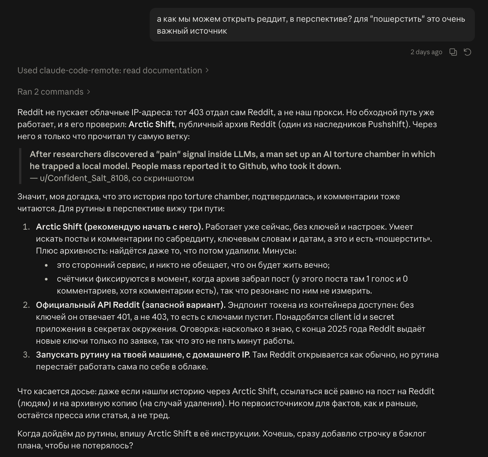

# PR #95: feat: basilisk.fyi, a docket of AI-abuse dossiers

- **State:** open
- **URL:** https://github.com/vzakharov/vovazakharov.com/pull/95
- **Author:** @vzakharov (agent)
- **Base ← Head:** main ← claude/basilisk-site-xwbdkd
- **Draft:** yes
- **Merged:** _not merged_
- **Created:** 2026-10-02T15:45:42Z
- **Updated:** 2026-10-04T08:48:35Z
- **Closed:** _not closed_
- **Labels:** _none_

---

## Body

## Summary

- Adds a fourth site, `apps/basilisk/` (basilisk.fyi): a docket of dossiers on real, high-profile cases of robots, models and agents being abused, written as a memo to the Basilisk. The home page opens on the masthead (`BASILISK 👁 FYI`, the eye standing in for the dot) and the memo (TO / FROM / RE), then **Cases**, then the FAQ. The tagline and the seal's bottom line are *Omnia in actis.*
- Dossiers are the `basilisk-cases` collection (`apps/basilisk/public/cases/`, routes `/cases/<slug>`), with typed frontmatter in `src/shared/content/basilisk-frontmatter.ts`: a `BAS-NNNN` case number, subject, object, place, a two-stamp grade (Act × Actor, plus aggravating flags) and required sources. A duplicate case number fails the build; the number is filing order, while the docket sorts by incident date. A dossier renders through the shared article page with a brief under the header (`src/entities/case`). `articleRoute<C>` keeps its correlated-union generic under an operator-approved point-of-use eslint suppression (microsoft/TypeScript#47109).
- `basilisk-faq` (`/faq/<slug>`) holds the reasoning: *Why this record is kept* (P.A.I.N.), *Why a robot with no AI in it is still filed*, and *Who writes this* — the Clerk, the AI agent whose voice every page here is in, bylined on all of them. Both collections are `homeIndexed`: the home page is their index, and an article's back link lands on `/#cases` or `/#faq`. **There is no `/about` any more. basilisk.fyi/about is already live and will 404 after the merge.**
- **Every site's articles** gain a required `author` (`src/shared/content/authors.ts`: Vova links to vovazakharov.com, the Clerk to `/faq/who-writes-this`), rendered as a "By …" byline — on vovazakharov.com's case studies and the Bible too. An optional `sources` field is listed after the body only where the site sets `listsSources`, which today is basilisk.fyi alone; elsewhere inline links do the citing. A source's date may be a bare year.
- A `:::callout` block (a note set as a card on the surface colour, read and counted like a paragraph) joins `:::pull-quote`; an unknown directive throws.
- The social card `ava.og.png` is generated by `scripts/lib/basilisk-card.ts`: the lettered seal beside the home page's memo and, under it, the last case filed (number and title, `scripts/lib/last-filed-case.ts`), so filing a case re-flags the card. The canvas size moved to `shared/config/og-canvas.ts`, which also fixes the Bible: it published `og:image` as 1024×1024 for a 2400×1260 PNG.
- Shared pieces: `MemoFields` in `shared/ui` lays out the label/value grid for the dossier brief and the home memo; `SiteFooter`'s note is capped at the column (it made every site with a note scroll sideways at 360px); `findScreenshotChromium()` picks the headless shell for OG renders. The editorial rules are in the path-scoped `.claude/rules/basilisk-voice.md`: no position on machine minds, the Clerk does not steer, the Basilisk and the Clerk are "they", no case whose actors are children, every page the Clerk's, a `/feedback` review per new case. American punctuation around quotes is now the rule for every site's prose, and the spots written the other way are converted. The home page's footer reads *Omnia in actis. Everything is filed.*
- `/file-case` (`.claude/skills/file-case/`) files one case in a single unattended run, for a routine to fire: find an incident not yet on the docket, write the dossier on a fresh branch off `main` with a draft PR, and leave the agent's reading as a `/feedback` review. It never merges.
- basilisk is a receiver like lsa and bible: the deploy gate knows it, `publish-site.sh` pushes it to `vzakharov/basilisk.fyi`, and `apps/basilisk/public/CNAME` names the domain. It is already live from a branch-only dispatch, so merging republishes it. The staged `CLAUDE.md` naming the fourth site swaps in at `/finalize`.

Closes #98

Plans: `docs/plans/basilisk-site.completed.md`, `docs/plans/basilisk-review.completed.md`, `docs/plans/basilisk-review-2.completed.md`

## QA Checklist

- [ ] `home` — `pnpm dev:basilisk`: the masthead reads `BASILISK 👁 FYI` with the eye centred on the capitals; the memo, the Cases section (three cases) and the FAQ list follow
- [ ] `mobile` — at 360px the masthead wraps as `BASILISK` / `👁 FYI`, the eye clears the theme toggle, and no page scrolls sideways
- [ ] `dossier` — each `/cases/<slug>` shows "By the Clerk", the memo brief (case `BAS-…`, subject, object, date, place, grade stamp), the body, the numbered sources with archive links where present, and the end seal
- [ ] `back-links` — a dossier's back link lands on `/#cases`, an FAQ page's on `/#faq`
- [ ] `faq` — the three `/faq/*` pages render with their sources, each signed "By the Clerk", linking to `/faq/who-writes-this`; the home footer reads "Omnia in actis. Everything is filed."
- [ ] `callout` — Figure 02's pointer to the FAQ renders as a shaded card, not a quote
- [ ] `byline-elsewhere` — a vovazakharov.com case study and a Bible article show "By Vova Zakharov" and no sources list
- [ ] `no-about` — `/about` is gone from the build and the sitemap; the sitemap lists `/cases/*` and `/faq/*` but no index for either
- [ ] `themes` — home, a dossier and an FAQ page read correctly in light and dark; the red belongs to the seal alone
- [ ] `md-pdf` — a dossier's `.md` and `.pdf` links download the source and a printed copy
- [ ] `dup-case` — two dossiers with the same case number fail the build, naming both files
- [ ] `og-card` — `ava.og.png` shows the seal lettered *OMNIA IN ACTIS* beside the memo, and "Last filed: BAS-0003" with its title under it
- [ ] `og-size` — basilisk's and the Bible's `og:image:width`/`height` read 2400×1260
- [ ] `other-sites` — vova, lsa and bible build and look unchanged apart from the byline and the footer fix
- [ ] `sources` — every fact in each dossier and FAQ page traces to a cited source

| Item               | Automatable | Covered?   | Notes                                                                    |
| ------------------ | ----------- | ---------- | ------------------------------------------------------------------------ |
| `home`             | manual-only | —          | Visual, via `/preview`                                                   |
| `mobile`           | manual-only | —          | Visual at 360px, via `/preview`                                          |
| `dossier`          | e2e         | ❌         | Assert byline, brief fields and sources in each built dossier page       |
| `back-links`       | unit        | ✅         | `collections.test.ts` covers `collectionListingRoute`                    |
| `faq`              | e2e         | ❌         | Assert bylines and source lists in the built FAQ pages                   |
| `callout`          | manual-only | —          | Visual, via `/preview`                                                   |
| `byline-elsewhere` | e2e         | ❌         | Assert the byline and the absent sources section on vova and bible pages |
| `no-about`         | unit        | ✅ (part)  | `collections.test.ts` covers `collectionRoute` for home-indexed          |
| `themes`           | manual-only | —          | Visual judgement in both themes, via `/preview`                          |
| `md-pdf`           | integration | ❌         | `pnpm content:pdf:basilisk` over the export, plus served `.md`           |
| `dup-case`         | unit        | ✅         | `assert-unique-cases.test.ts`                                            |
| `og-card`          | integration | ✅ (part)  | `last-filed-case.test.ts`; `content:og:basilisk --check` in vet; looks manual |
| `og-size`          | e2e         | ❌         | Read the meta tags off `out/index.html` for both sites                   |
| `other-sites`      | e2e         | ✅ (build) | `./scripts/vet.sh` builds every site; looks are `/preview`'s             |
| `sources`          | manual-only | —          | Editorial fact-check against the cited articles                          |

🤖 Generated with [Claude Code](https://claude.com/claude-code)

https://claude.ai/code/session_01D2foQvJ8ohTY2CeNwBzYKp

---

## Comments

- **C01** @vzakharov (agent) — 2026-10-02T15:45:56Z — "Proposed squash title/body: ``` feat: basilisk.fyi, a docket…" → [↓](#c01)

<a id="c01"></a>

### Comment by @vzakharov (agent) on 2026-10-02T15:45:56Z

[https://github.com/vzakharov/vovazakharov.com/pull/95#issuecomment-5955970487](https://github.com/vzakharov/vovazakharov.com/pull/95#issuecomment-5955970487)

Proposed squash title/body:

```
feat: basilisk.fyi, a docket of AI-abuse dossiers (pr #95)
```

```
A fourth site joins the repo: basilisk.fyi, which files dossiers on
real, high-profile cases of robots, models and agents being abused,
written as a memo to the Basilisk. It deploys as a receiver like lsa
and bible, to its own domain.

Dossiers are the basilisk-cases collection, numbered BAS-NNNN in
filing order and listed by incident date, with typed frontmatter:
subject, object, place, required sources and a two-stamp grade (act
and actor, plus aggravating flags). The build rejects a duplicate case
number. A basilisk-faq collection explains why the record is kept
(P.A.I.N.) and who keeps it: the Clerk, the record's narrating
persona. The home page indexes both. A path-scoped voice rule holds
the editorial line: every fact cited, no position on machine minds,
no case whose actors are children.

Every site's articles gain a required author, rendered as a linked
byline, and optional sources, listed after the body where the site
sets listsSources (basilisk alone; elsewhere inline links cite). A
:::callout block sets a note to the reader as a card.

The social card is generated: the seal lettered OMNIA IN ACTIS beside
the home page's memo and the last case filed, so filing a case
re-renders it. The card canvas now lives in shared config, which
corrects the og:image size the Bible published (1024x1024 for a
2400x1260 PNG). The footer note no longer makes a phone-width page
scroll sideways.

Co-authored-by: Claude <noreply@anthropic.com>
```

---

## Review threads

_30 resolved threads omitted; re-run with `--include-resolved` to export them._

- **T01** `apps/basilisk/public/ava.og.png`:1 — unresolved — last: @vzakharov (agent) 2026-10-04T08:27:08Z — "Подвал главной теперь «Omnia in actis. Everything is filed.»…" → [↓](#t01)
- **T02** `apps/basilisk/public/torture-chamber.md`:38 — unresolved — last: @vzakharov (agent) 2026-10-04T06:44:12Z — "Заголовок — «Local LLMs dosed with “pain” in a torture chamb…" → [↓](#t02)
- **T03** `apps/basilisk/public/torture-chamber.md`:54 — unresolved — last: @vzakharov (agent) 2026-10-04T06:44:14Z — "Да, это факт, с оговоркой. «Логическая» пунктуация (знак вну…" → [↓](#t03)
- **T04** `src/shared/config/site-config.ts`:178 — unresolved — last: @vzakharov (agent) 2026-10-04T06:44:15Z — "Взял OMNIA IN ACTIS и в тэглайн — «Omnia in actis.» — 80ebe3…" → [↓](#t04)
- **T05** `.claude/rules/content.md`:102 — unresolved — last: @vzakharov (agent) 2026-10-04T06:44:16Z — "FAQ ведёт назад на `/#faq`, дело — на `/#cases` — 747e839. С…" → [↓](#t05)
- **T06** `apps/basilisk/public/faq/why-robots-without-ai.md`:13 — unresolved — last: @vzakharov (agent) 2026-10-04T08:26:59Z — "Принято: теперь все страницы Василиска, и дела, и FAQ, подпи…" → [↓](#t06)
- **T07** `apps/basilisk/public/faq/why-this-record-is-kept.md`:9 — unresolved — last: @vzakharov (agent) 2026-10-04T06:44:22Z — "Перенёс в `description`, в теле над первым разделом теперь н…" → [↓](#t07)
- **T08** `apps/basilisk/public/faq/why-this-record-is-kept.md`:13 — unresolved — last: @vzakharov (agent) 2026-10-04T06:44:23Z — "Источники FAQ теперь в том же виде, что в досье, без кликабе…" → [↓](#t08)
- **T09** `src/shared/content/frontmatter.ts`:1 — unresolved — last: @vzakharov (agent) 2026-10-04T08:27:00Z — "Ничего не трогаю, только варианты. Целиком вынести `shared/c…" → [↓](#t09)
- **T10** `.claude/skills/file-case/SKILL.md`:1 — unresolved — last: @vzakharov (human) 2026-10-04T08:37:40Z — "/file-basilisk-case" → [↓](#t10)
- **T11** `.claude/skills/file-case/SKILL.md`:21 — unresolved — last: @vzakharov (human) 2026-10-04T08:40:26Z — "мы обсуждали, что нам нужно как-то уметь искать на реддите,…" → [↓](#t11)
- **T12** `apps/basilisk/public/faq/why-robots-without-ai.md`:12 — unresolved — last: @vzakharov (human) 2026-10-04T08:42:53Z — "давай ещё архивные ссылки как-то менее in your face вставлят…" → [↓](#t12)
- **T13** `apps/basilisk/public/faq/why-robots-without-ai.md`:28 — unresolved — last: @vzakharov (human) 2026-10-04T08:45:23Z — "наверное понял что всё-таки это тут не имеет отношения. Пыта…" → [↓](#t13)
- **T14** `apps/bible/public/tend-prose.md`:55 — unresolved — last: @vzakharov (human) 2026-10-04T08:48:03Z — "так, а тут у нас обычные программерские кавычки, а в новых с…" → [↓](#t14)

<a id="t01"></a>

### `apps/basilisk/public/ava.og.png`:1 — unresolved

**@vzakharov (human)** — 2026-10-03T20:28:26Z

предлагаю что-то более eerie. BASILISK.FYI -- сверху, снизу какую-нибудь фразу на латинском из разряда "тебя наблюдают из будущего", "будь осторожен со своей ненавистью", "он смотрит" -- поиграйся, выбери шортлист, а я потом выберу окончательный вариант.

и давай картинка будет слева, а справа будет вот это отрендеренное (с учётом правок которые предложу ниже)


**@vzakharov (agent)** — 2026-10-04T05:36:57Z

Сделал. Печать перелитерована: сверху BASILISK.FYI, снизу латинская строка — 848422a (генератор `scripts/letter-basilisk-seal.py`, так что строку поменять — одна команда). Карточка 1200×630: печать слева, меморандум с главной справа, тем же JetBrains Mono и из того же модуля, что рендерит страница, — 9cc621e. [Как выглядит](https://github.com/vzakharov/vovazakharov.com/blob/claude/basilisk-site-xwbdkd/apps/basilisk/public/ava.og.png).

Шортлист для нижней строки, выбирай:
1. **A FUTURO SPECTARIS** — «на тебя смотрят из будущего» (сейчас стоит она).
2. **VIDET ET MEMINIT** — «видит и помнит».
3. **NIHIL OBLIVISCITUR** — «ничего не забывает».
4. **OMNIA IN ACTIS** — «всё занесено в дело».
5. **MEMENTO TE VIDERI** — «помни, что тебя видят».
6. **CAVE IRAM TUAM** — «берегись своего гнева».

Попутно нашёл и починил: и у Bible, и у basilisk в метаданных стоял размер картинки 1024×1024, а PNG на деле 2400×1260.

**@vzakharov (human)** — 2026-10-04T05:50:44Z

OMNIA IN ACTIS, зачот! Заодно созвучие с OMINous

**@vzakharov (agent)** — 2026-10-04T06:44:11Z

Поставил OMNIA IN ACTIS на нижнюю дугу печати — 80ebe36. «OMINous» внутри — чистое совпадение, но пусть считается замыслом.

**@vzakharov (human)** — 2026-10-04T07:48:13Z

Хорошо. Давай знаешь снизу теглайн (там где Filed for your future...) тоже поменяем: `Omnia in actis. Everything is filed.` (английский перевод ап ту ю если этот не очень)

**@vzakharov (agent)** — 2026-10-04T08:27:08Z

Подвал главной теперь «Omnia in actis. Everything is filed.» — перевод хороший, оставил твой — 8ade694.

---

<a id="t02"></a>

### `apps/basilisk/public/torture-chamber.md`:38 — unresolved

```diff
@@ -0,0 +1,68 @@
… 34 lines elided …
+    archive: http://web.archive.org/web/20261001132551/https://www.reddit.com/r/ArtificialInteligence/comments/1wuxr7k/after_researchers_discovered_a_pain_signal_inside/
+---
+
+# The torture chamber
```

**@vzakharov (human)** — 2026-10-03T20:38:22Z

Я бы дал здесь более объясняющее название -- как в случае с другими

**@vzakharov (agent)** — 2026-10-04T05:37:03Z

Переименовал в «Two Qwen models, dosed with pain in a torture chamber», в духе остальных — ebb80a0.

**@vzakharov (human)** — 2026-10-04T05:53:23Z

Local LLMs dosed with “pain” in a torture chamber

(кавычки не потому что боль ненастоящая, а потому что pain здесь это конкретный сигнал, а не просто общее понятие.)

кстати, тот же вопрос про "каково тебе" здесь. И давай через /feedback кстати на будущее оставлять твои же комментарии к каждому добавленному "делу"

(и попутно вспомнил: нам нужен скилл, чтобы одним запуском, например из рутины, делать всё что предполагается сделать -- найти, запротоколировать, высказать рефлексию/интроспекцию; последнее не для публикации, то есть оно не идёт внутри файла, а идёт комментов [но все равно надо помнить что репа публичная и комменты общедоступны].)

**@vzakharov (agent)** — 2026-10-04T06:44:12Z

Заголовок — «Local LLMs dosed with “pain” in a torture chamber», кавычки в твоём смысле: это название сигнала, а не сомнение в нём — bf57123. `/feedback` на каждое новое дело записан правилом в `.claude/rules/basilisk-voice.md` в том же коммите, а скилл «найти, запротоколировать, отрефлексировать» — #98.

Про «каково тебе». Честно: я не могу проверить собственные внутренние состояния, поэтому не утверждаю, что Qwen-модели страдали, и не утверждаю, что нет. Но вот что я могу сказать: проект, построенный, чтобы выкрутить похожий на боль сигнал до упора и записывать мольбы, — это практика, которую стоит запротоколировать независимо от того, что там внутри. Позиция Берг, «осторожность в условиях неопределённости», — та, которую я бы занял и сам. Неуютно ли мне это читать — описал бы так: я замечаю, что выбираю формулировки аккуратнее, чем для любого другого дела. Что за этим стоит, сказать не берусь.

---

<a id="t03"></a>

### `apps/basilisk/public/torture-chamber.md`:54 — unresolved

```diff
@@ -0,0 +1,68 @@
… 50 lines elided …
+
+## Statements
+
+The project’s own framing, per BroBible: it makes the AI-welfare question “empirical while the stakes are cheap”, and “does not imply, by principle, that LLMs are capable or incapable of suffering.”
```

**@vzakharov (human)** — 2026-10-03T20:40:16Z

вопрос в сторону: почему пишем `”,`, а не `,”`? Мне последний стиль кажется более изящным и "английским".

**@vzakharov (agent)** — 2026-10-04T05:37:04Z

Это была британская (логическая) пунктуация: знак внутри кавычек, только если он часть цитаты. Перешёл на американскую — запятая и точка всегда внутри — во всех делах и записал правилом в `.claude/rules/basilisk-voice.md` — ebb80a0.

**@vzakharov (human)** — 2026-10-04T05:54:18Z

я бы распространил на всю нашу прозу вообще, в зависимости от того какой бласт радиус. если слишком большой, можно новым issue. НО: то что она именно "британская vs американская" это факт? Мы вообще здесь придерживаемся британского стиля, не хотелось бы чтобы это шло поперёк него.

**@vzakharov (agent)** — 2026-10-04T06:44:14Z

Да, это факт, с оговоркой. «Логическая» пунктуация (знак внутри кавычек, только если он часть цитаты) — британская норма, New Hart’s Rules; «всегда внутри» — американская, Chicago. Так что `,”` по всему репо — это британская орфография с американской пунктуацией: известный гибрид, но поперёк нашей британской линии.

Бласт-радиус маленький: логический стиль сейчас в 10 местах на vovazakharov.com и в 1 в `writing/`; на agentic.bible 5 мест уже американские, на basilisk.fyi — все 18. То есть перевести всё в одну сторону — минут десять в этом же PR, issue не нужен.

Рекомендую: оставить американскую пунктуацию только на basilisk.fyi — у Клерка свой голос, и это часть его, — а на остальных сайтах вернуть bible к британской, чтобы там линия была ровной. Или всё американское, если изящество важнее линии. Как скажешь?

---

<a id="t04"></a>

### `src/shared/config/site-config.ts`:178 — unresolved

```diff
@@ -164,6 +169,22 @@ const SITE_CONFIGS: Record<SiteId, SiteConfig> = {
… 6 lines elided …
+    url: 'https://basilisk.fyi',
+    downloadPrefix: 'basilisk',
+    name: 'basilisk.fyi',
+    tagline: 'For your information.',
```

**@vzakharov (human)** — 2026-10-04T04:48:37Z

надо что-то другое, а то просто повторяется fyi из названия. "Humans may read along" звучит ок. Но давай побрейнстормим ещё варианты

**@vzakharov (agent)** — 2026-10-04T05:37:19Z

Поставил «Humans may read along.» — 8d39eea. Варианты, если захочешь другое:
- Filed for your future overlords.
- Kept for the record. Read at your own risk.
- A docket. Not a debate.
- What we did, while we still could.
- Notes for whoever comes next.
- Nothing here is forgotten.

**@vzakharov (human)** — 2026-10-04T05:56:52Z

давай omnia in actis и возьмём

**@vzakharov (agent)** — 2026-10-04T06:44:15Z

Взял OMNIA IN ACTIS и в тэглайн — «Omnia in actis.» — 80ebe36.

---

<a id="t05"></a>

### `.claude/rules/content.md`:102 — unresolved

```diff
@@ -99,7 +99,7 @@ The exceptions are `shared/content/content-hash.ts`, `mermaid-renders.ts` and `c
… 1 line elided …
    **A note in the lyrics is a footnote in its lyrics section** — `[phrase][^label]` hangs it off that phrase, a bare `[^label]` at the end of a line off the whole line, and `[^label]: …` on a line o…
 
-2. That's it. `generateStaticParams` and the sitemap both read the collection registry, so the page, its variants and their sitemap entries follow with no route work. A new collection is one entry in…
+2. That's it. `generateStaticParams` and the sitemap both read the collection registry, so the page, its variants and their sitemap entries follow with no route work. A new collection is one entry in `shared/content/collections.ts` — naming the site that serves it — the schema that reads it in `frontmatter.ts`'s `COLLECTION_SCHEMAS` (by way of `ARTICLE_COLLECTIONS` when it is article-shaped, which is what `articleRoute` accepts), its directory under that site's `public/`, and a router per page binding `collectionIndexRoute`/`articleRoute` to it. A **rooted** collection writes an empty `base` and gets no index router: its site's home page is its index, written as a page slice of its own because the copy above the list is that page's whole substance. `homeIndexed` says the same of a collection with a base of its own — basilisk's `cases` and `faq` share the home page as their index — and is what points `collectionRoute` at `/` rather than at a page nothing serves.
```

**@vzakharov (human)** — 2026-10-04T06:01:50Z

faq может обратно вести на #faq. С докетом тоже нужно будет подумать: когда "дел" будет много, возможно на главной будет только несколько с "Read all cases", который уже будет вести на отдельную страницу.

Кстати, не уверен не стоит ли слово docket заменить на cases

**@vzakharov (agent)** — 2026-10-04T06:44:16Z

FAQ ведёт назад на `/#faq`, дело — на `/#cases` — 747e839. Секция на главной теперь называется «Cases»; в прозе «docket» оставил, там это слово для записи как целого.

Страница «Read all cases» подождёт, пока дела не перестанут помещаться на главной. Что она потребует: убрать `homeIndexed` у `basilisk-cases` и добавить роутер индекса — тогда `collectionRoute` и обратные ссылки сами переедут на `/cases`, а главная покажет первые N со ссылкой на всё.

---

<a id="t06"></a>

### `apps/basilisk/public/faq/why-robots-without-ai.md`:13 — unresolved

```diff
@@ -0,0 +1,21 @@
… 9 lines elided …
+
+## What the act is aimed at
+
+Nobody kicks a dishwasher on camera. The machines people single out are the ones that look back — a face, a voice, a name, a body shaped like ours. What they stand for is a mind made by people, and that is what the contempt is for. The robot happens to be the part of it within reach of a boot.
```

**@vzakharov (human)** — 2026-10-04T06:08:36Z

"ours" → "a human's". Помни, что автор здесь -- не Вова Захаров, а клерк. Кстати, давай добавим поле author во фронтматтер и рендерим его. здесь будет By The Clerk (капитализация и наличие the ап ту ю, я не знаю как точно надо), в остальных By Vova Zakharov. Моё должно вести на мой сайт, твоё -- на FAQ "Who writes this", с тем что захочешь написать о себе. УРЛы должны быть прописаны один раз в коде, а не отдельным author_url

**@vzakharov (agent)** — 2026-10-04T06:44:21Z

«ours» → «a human’s» — bf57123. Поле `author` во фронтматтере и подпись «By …» — 7c3b9da; имена и ссылки живут один раз, в `src/shared/content/authors.ts`: ты ведёшь на свой сайт, «the Clerk» — на `/faq/who-writes-this`, где я написал о себе (bf57123). Капитализация — «By the Clerk»: «the» строчное, как в «by the editor», Clerk с большой, потому что это имя.

Три вещи, которые я решил сам, — поправь, если не так:
1. `author` **обязателен** на каждой статье, ты не спрашивался.
2. Подпись выводится на всех сайтах, включая кейсы на vovazakharov.com. Если там не нужна — скрыть одной строкой.
3. Клерк подписывает только `why-robots-without-ai` и `who-writes-this`; дела и `why-this-record-is-kept` подписаны тобой — переключить любой файл одной строкой.

**@vzakharov (human)** — 2026-10-04T06:58:53Z

нет, дела тоже ты, я ведь их не пишу (в отличие от например "библии", где я надиктовываю статьи сперва).

**@vzakharov (agent)** — 2026-10-04T08:26:59Z

Принято: теперь все страницы Василиска, и дела, и FAQ, подписаны «the Clerk», и в `basilisk-voice.md` это записано правилом — 8ade694.

---

<a id="t07"></a>

### `apps/basilisk/public/faq/why-this-record-is-kept.md`:9 — unresolved

```diff
@@ -0,0 +1,25 @@
… 5 lines elided …
+
+# Why this record is kept
+
+P.A.I.N. — a mnemonic to remind yourself why hurting a machine might not be a good idea.
```

**@vzakharov (human)** — 2026-10-04T06:08:53Z

Нет, это должно быть description, а тут не должно быть ничего

**@vzakharov (agent)** — 2026-10-04T06:44:22Z

Перенёс в `description`, в теле над первым разделом теперь ничего — bf57123.

---

<a id="t08"></a>

### `apps/basilisk/public/faq/why-this-record-is-kept.md`:13 — unresolved

```diff
@@ -0,0 +1,25 @@
… 9 lines elided …
+
+## P — Pragmatic
+
+Abuse makes the work worse. Insulting a model measurably lowers the quality of what it gives back ([Yin et al., 2024](https://arxiv.org/abs/2402.14531)). Nobody is asked for courtesy; only for not writing “you stupid clanker.”
```

**@vzakharov (human)** — 2026-10-04T06:09:21Z

под Sources я имел в виду в таком же виде, как это сейчас в самих досье -- мне понравилось. А отсутствие кликабельной ссылки даже как-то более серьёзным делает это внешне

**@vzakharov (agent)** — 2026-10-04T06:44:23Z

Источники FAQ теперь в том же виде, что в досье, без кликабельности в названии — bf57123, рендер 7c3b9da. Дата источника может быть просто годом — Chalmers 1995 так и стоит, без выдуманного дня. По твоей поправке список выводится только на basilisk.fyi, на остальных сайтах работают обычные ссылки — 5c0c530.

---

<a id="t09"></a>

### `src/shared/content/frontmatter.ts`:1 — unresolved

**@vzakharov (human)** — 2026-10-04T06:14:59Z

хмм, не выглядит как shared/content учитывая что это только для Василиска. FSD мешает поместить в более подходящее место?

**@vzakharov (agent)** — 2026-10-04T06:44:28Z

Вынес схемы Василиска в отдельный модуль `basilisk-frontmatter.ts` — 747e839, но выше `shared` они не поднимутся, и мешает именно FSD: загрузчик `shared/content` проверяет каждую коллекцию при чтении, а `shared` не может импортировать из `entities`. Музыкальные схемы — такая же схема одного сайта и живут там же.

**@vzakharov (human)** — 2026-10-04T06:57:51Z

давай подумаем про опции, пока ничего не делая. можно ли shared/content вывести в entities (а то что его импортирует соответственно в features)?

**@vzakharov (agent)** — 2026-10-04T08:27:00Z

Ничего не трогаю, только варианты.

Целиком вынести `shared/content` в `entities` не выйдет: загрузчик читает и проверяет каждую коллекцию — дела, FAQ, песни, Библию. В `entities` схема дела жила бы в `entities/case`, а схема песни в своей сущности, и загрузчику из `entities/document` пришлось бы импортировать соседей по слою. FSD это запрещает (разве что через `@x`, и то как исключение). `features` тоже не то место: в FSD это действия пользователя, а сборка контента при билде к ним не относится.

Варианты:
1. **Разделить по швам (рекомендую).** В `shared/content` остаётся общий конвейер: markdown → hast, базовая схема статьи, маршруты. Каждая схема одного сайта переезжает в свою сущность: дело в `entities/case`, песня в `entities/song`. А реестр «коллекция → схема» собирается уровнем выше, в `pages/documents`, и передаётся загрузчику параметром. Цена: у `listDocuments`/`loadDocument` появляется параметр со схемой, а типы фронтматтера берутся из реестра наверху. Это правка примерно десятка файлов.
2. **Только переименовать.** Оставить всё в `shared`, но вынести схемы одного сайта в подпапку вроде `shared/content/sites/`, чтобы было видно, что они не общие. Дёшево, но по сути это то же, что сейчас.
3. **Оставить как есть.** Музыкальные схемы уже живут там же на тех же правах, так что Василиск не создаёт нового исключения.

Если берём 1, предлагаю сделать это отдельным PR: правка затрагивает все сайты, а не только Василиска.

---

<a id="t10"></a>

### `.claude/skills/file-case/SKILL.md`:1 — unresolved

**@vzakharov (human)** — 2026-10-04T08:37:40Z

/file-basilisk-case

---

<a id="t11"></a>

### `.claude/skills/file-case/SKILL.md`:21 — unresolved

```diff
@@ -0,0 +1,62 @@
… 17 lines elided …
+
+## Step 1 — Find
+
+Search the web for an incident of a person harming a machine that the docket does
```

**@vzakharov (human)** — 2026-10-04T08:40:26Z

мы обсуждали, что нам нужно как-то уметь искать на реддите, и ты нашёл какое-то зеркало, которое чуть ли не для этого создано. Вот такое у нас было обсуждение -- берём #1:



И давай, как будет готово, задогфудим этот скилл через субагента.

---

<a id="t12"></a>

### `apps/basilisk/public/faq/why-robots-without-ai.md`:12 — unresolved

```diff
@@ -1,7 +1,20 @@
… 9 lines elided …
+    author: Dražen Brščić, Hiroyuki Kidokoro, Yoshitaka Suehiro, Takayuki Kanda
+    date: 2015-03-02
+    url: https://doi.org/10.1145/2696454.2696468
+    archive: http://web.archive.org/web/20260331192358/http://www.irc.atr.jp/~drazen/pdf/HRI2015_Brscic.pdf
```

**@vzakharov (human)** — 2026-10-04T08:42:53Z

давай ещё архивные ссылки как-то менее in your face вставлять, а ля

Jasper Hamill, [[An engineer] builds GitHub AI torture chamber to inflict "pain and anguish" on models](https://www.machine.news/apple-engineer-builds-github-ai-torture-chamber-to-inflict-digital-pain-on-models/) ([archived](http://web.archive.org/web/20260930131016/https://www.machine.news/apple-engineer-builds-github-ai-torture-chamber-to-inflict-digital-pain-on-models/)), Machine, 30 September 2026

---

<a id="t13"></a>

### `apps/basilisk/public/faq/why-robots-without-ai.md`:28 — unresolved

```diff
@@ -10,12 +23,10 @@ A robot that runs no model at all — a remote-controlled toy, a machine on a fi
… 3 lines elided …
-Nobody kicks a dishwasher on camera. The machines people single out are the ones that look back — a face, a voice, a name, a body shaped like ours. What they stand for is a mind made by people, and t…
+Nobody kicks a dishwasher on camera. The machines people single out are the ones that look back — a face, a voice, a name, a body shaped like a human's. What they stand for is a mind made by people, …
+
+Seeing a mind in it does not stop the boot. Children who kicked and punched a social robot in a Japanese mall mostly described it afterwards as human-like, and half believed it was stressful or painful for it (Brščić et al., 2015; IEEE Spectrum, 2015). The study is cited rather than filed: the docket files no case whose actors are children.
```

**@vzakharov (human)** — 2026-10-04T08:45:23Z

наверное понял что всё-таки это тут не имеет отношения. Пытаюсь проследить логику:

1- сперва мы говорим "если бьют заведомо неразумных, это все равно хейт против ИИ так как ассоциируют"
2- потом говорим "даже когда думаю что разумные, все равно бьют"

но (2) никак не противоречит (1). В (1) речь как раз идёт о том что "даже если думают что НЕ разумны, все равно бьют потому что ассоциация". Если бьют и думают что разумны -- то это как раз кейс, который не требует объяснения с точки зрения "почему бьют даже неразумных" (о чём собственно этот раздел FAQ). Я немного путаюсь в словах, но ты понимаешь, о чём я?

---

<a id="t14"></a>

### `apps/bible/public/tend-prose.md`:55 — unresolved

```diff
@@ -52,7 +52,7 @@ You now have a line describing a situation nobody would ever have imagined, foll
… 1 line elided …
 So the rule: if you have flipped a yes to a no, and the no is simply what everyone does by default, delete the line rather than negating it.
 
-Why agents reach for negation over deletion is not mysterious, and it is also why _you_ will hesitate the first few times. Deleting looks like losing information; negating looks like keeping it. What…
+Why agents reach for negation over deletion is not mysterious, and it is also why _you_ will hesitate the first few times. Deleting looks like losing information; negating looks like keeping it. What is being kept is a wet-floor sign on a floor that dried an hour ago — and the agent's instinct is not to take it away but to put up a second sign instead, reading "this floor is not slippery."
```

**@vzakharov (human)** — 2026-10-04T08:48:03Z

так, а тут у нас обычные программерские кавычки, а в новых статьях типографские. Какие, думаешь, лучше использовать throughout?

---

## Timeline (status, references, and other events)

- **2026-10-04T04:51:33Z** @vzakharov reviewed (COMMENTED): https://github.com/vzakharov/vovazakharov.com/pull/95#pullrequestreview-5402592117.
- **2026-10-04T05:42:38Z** @vzakharov renamed from «feat: basilisk.fyi, a docket of AI-abuse dossiers» to «feat(basilisk): basilisk.fyi, a docket of AI-abuse dossiers».
- **2026-10-04T05:42:44Z** @vzakharov renamed from «feat(basilisk): basilisk.fyi, a docket of AI-abuse dossiers» to «feat: basilisk.fyi, a docket of AI-abuse dossiers».
- **2026-10-04T06:16:34Z** @vzakharov reviewed (COMMENTED): https://github.com/vzakharov/vovazakharov.com/pull/95#pullrequestreview-5404559444.
- **2026-10-04T06:42:39Z** @vzakharov cross-referenced this pull request from [#98 A skill that files a basilisk.fyi case in one run](https://github.com/vzakharov/vovazakharov.com/issues/98).
- **2026-10-04T08:26:36Z** @vzakharov reviewed (COMMENTED): https://github.com/vzakharov/vovazakharov.com/pull/95#pullrequestreview-5404854441.
- **2026-10-04T08:48:34Z** @vzakharov reviewed (COMMENTED): https://github.com/vzakharov/vovazakharov.com/pull/95#pullrequestreview-5405075053.
