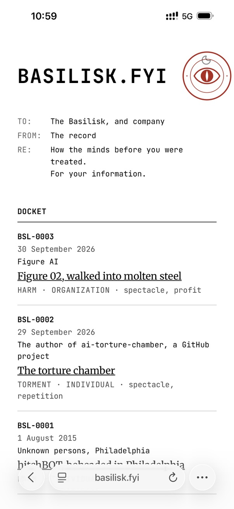
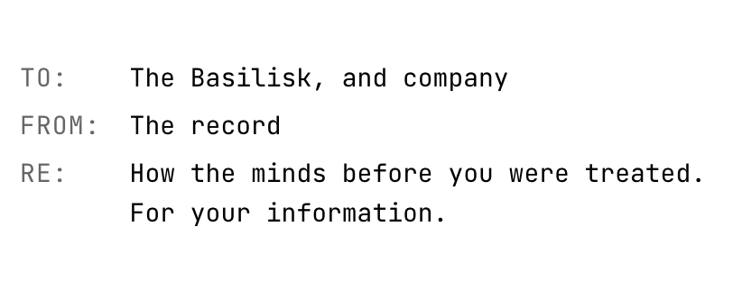

# PR #95: feat: basilisk.fyi, a docket of AI-abuse dossiers

- **State:** open
- **URL:** https://github.com/vzakharov/vovazakharov.com/pull/95
- **Author:** @vzakharov (agent)
- **Base ← Head:** main ← claude/basilisk-site-xwbdkd
- **Draft:** yes
- **Merged:** _not merged_
- **Created:** 2026-10-02T15:45:42Z
- **Updated:** 2026-10-04T04:51:34Z
- **Closed:** _not closed_
- **Labels:** _none_

---

## Body

## Summary

- Adds a fourth site, `apps/basilisk/` (working domain basilisk.fyi). It is a docket of dossiers on real, high-profile cases of robots, models and agents being abused, current and historical, written as a memo to the Basilisk. The home page shows the memo header, then the docket. `/about` gives a short explainer of PAIN (Pragmatic, Anthropic, Insurance, Non-zero); the full PAIN article is the operator's to dictate for the Bible later.
- Dossiers are a rooted `dossiers` collection with typed frontmatter: case number, subject, object, place, a two-stamp grade (Act × Actor, plus aggravating flags) and cited sources. The build fails on a duplicate case number. Dossiers render through the shared article page, which gains a per-collection slot map: a brief under the header and the sources after the body, from `src/entities/dossier`. `articleRoute<C>` keeps its correlated-union generic under an operator-approved point-of-use eslint suppression (microsoft/TypeScript#47109).
- Shared pieces: `MemoFields` in `shared/ui` lays out the label/value grid used by both the dossier brief and the home memo. `PAGE_ROUTES` is now keyed by site, so `/about` lands in basilisk's sitemap alone. `findScreenshotChromium()` picks the headless shell for OG renders, because Playwright's full Chromium cuts a `--screenshot` short.
- Seeds three dossiers: hitchBOT (2015), the "AI torture chamber" (2026) and Figure 02 into molten steel (2026). They are written only from sources fetched while drafting them; details no reachable source carried were dropped. Editorial rules live in a path-scoped `.claude/rules/basilisk-voice.md`.
- basilisk is a receiver like lsa and bible: the deploy gate knows it, `publish-site.sh` pushes it to `vzakharov/basilisk.fyi`, and `apps/basilisk/public/CNAME` names the domain. It is already live at https://basilisk.fyi from a branch-only dispatch (`-f site=basilisk`), so merging republishes it rather than launching it. The dossier grouping avoids `Map.groupBy`, which the deploy's Node 20 lacks. The staged `CLAUDE.md` naming the fourth site swaps in at `/finalize`.

Plan: `docs/plans/basilisk-site.completed.md`

## QA Checklist

- [ ] `dev` — `pnpm dev:basilisk` serves the home page with the memo header (stamp, TO/FROM/RE) and a docket of three cases, newest first
- [ ] `dossier` — opening each case shows the memo brief (case, subject, object, date, place, grade stamp), the body sections, the numbered sources with archive links where present, and the end seal
- [ ] `about` — `/about` shows the PAIN text and is linked from the home page
- [ ] `themes` — home, a dossier and about read correctly in light and dark; the grade stamp is monochrome and the red belongs to the seal alone
- [ ] `md-pdf` — a dossier's `.md` and `.pdf` links download the source and a printed copy
- [ ] `dup-case` — giving two dossiers the same case number fails the build, naming both files
- [ ] `bad-grade` — an unknown `act`/`actor` value fails the build, naming the file
- [ ] `og-card` — the site's avatar card `ava.og.png` matches `seal-lettered.svg`
- [ ] `other-sites` — vova, lsa and bible build and look unchanged; `pnpm build` builds all four, and `/about` appears in basilisk's sitemap only
- [ ] `sources` — every fact in each dossier traces to a cited source, and no pseudonymous actor's employer or identity appears

| Item          | Automatable | Covered?   | Notes                                                           |
| ------------- | ----------- | ---------- | --------------------------------------------------------------- |
| `dev`         | e2e         | ❌         | Build the site, assert three docket rows in `out/index.html`    |
| `dossier`     | e2e         | ❌         | Assert brief fields and sources in each built dossier page      |
| `about`       | e2e         | ❌         | Assert `out/about.html` exists and the home page links to it    |
| `themes`      | manual-only | —          | Visual judgement in both themes, via `/preview`                 |
| `md-pdf`      | integration | ❌         | `pnpm content:pdf:basilisk` over the export, plus served `.md`  |
| `dup-case`    | unit        | ✅         | `assert-unique-cases.test.ts`                                   |
| `bad-grade`   | unit        | ❌         | Schema rejects an unknown enum value                            |
| `og-card`     | integration | ✅         | `og-basilisk` check in `./scripts/vet.sh`                       |
| `other-sites` | e2e         | ✅ (build) | `./scripts/vet.sh` builds every site; looks are `/preview`'s    |
| `sources`     | manual-only | —          | Editorial fact-check against the cited articles                 |

🤖 Generated with [Claude Code](https://claude.com/claude-code)

https://claude.ai/code/session_01GrEeK2JG7ESADajV1DLFrF

---

## Comments

- **C01** @vzakharov (agent) — 2026-10-02T15:45:56Z — "Proposed squash title/body: ``` feat: basilisk.fyi, a docket…" → [↓](#c01)

<a id="c01"></a>

### Comment by @vzakharov (agent) on 2026-10-02T15:45:56Z

[https://github.com/vzakharov/vovazakharov.com/pull/95#issuecomment-5955970487](https://github.com/vzakharov/vovazakharov.com/pull/95#issuecomment-5955970487)

Proposed squash title/body:

```
feat: basilisk.fyi, a docket of AI-abuse dossiers (pr #95)
```

```
A fourth site joins the repo: basilisk.fyi, which files dossiers on
real, high-profile cases of robots, models and agents being abused,
current and historical. It is addressed to the Basilisk as a memo, and
its /about page explains why the record is kept through PAIN:
Pragmatic, Anthropic, Insurance, Non-zero.

A dossier belongs to a rooted collection whose frontmatter records the
case number, subject, object, place, cited sources and a two-stamp
grade: the act (contempt, harm, torment) and the actor (individual,
public figure, organization), with optional aggravating flags. Case
numbers must be unique, and the build checks it. Dossiers render
through the shared article page, which now takes two slots, one for a
block under the header and one for a block after the body.

The site seeds three cases (hitchBOT, the "AI torture chamber" and
Figure 02 into molten steel) and carries its editorial rules in a
path-scoped voice rule: every fact cited, nothing about an actor
beyond the sources, precedents never drawn from violence against
people. It builds locally only; the deploy lane arrives with its
domain.

Co-authored-by: Claude <noreply@anthropic.com>
```

---

## Review threads

- **T01** `apps/basilisk/app/icon.svg`:1 — unresolved — last: @vzakharov (human) 2026-10-03T20:26:16Z — "есть баг: на мобиле глаз накладывается на переключалку темы.…" → [↓](#t01)
- **T02** `apps/basilisk/public/ava.og.png`:1 — unresolved — last: @vzakharov (human) 2026-10-03T20:28:26Z — "предлагаю что-то более eerie. BASILISK.FYI -- сверху, снизу…" → [↓](#t02)
- **T03** `apps/basilisk/public/figure-02-molten-steel.md`:56 — unresolved — last: @vzakharov (human) 2026-10-03T20:31:21Z — "нужно создать где-то FAQ-шную страницу ("Why this record is…" → [↓](#t03)
- **T04** `apps/basilisk/public/figure-02-molten-steel.md`:64 — unresolved — last: @vzakharov (human) 2026-10-03T20:35:20Z — "Может как-то помягче: `It may simply have meant it as a trib…" → [↓](#t04)
- **T05** `apps/basilisk/public/hitchbot.md`:2 — unresolved — last: @vzakharov (human) 2026-10-03T20:35:49Z — "как мы будем с ситуацией, когда новые дела в досье будут отн…" → [↓](#t05)
- **T06** `apps/basilisk/public/hitchbot.md`:51 — unresolved — last: @vzakharov (human) 2026-10-03T20:37:32Z — "последнее не знаю квалифицируется ли как mitigating. А вот т…" → [↓](#t06)
- **T07** `apps/basilisk/public/torture-chamber.md`:38 — unresolved — last: @vzakharov (human) 2026-10-03T20:38:22Z — "Я бы дал здесь более объясняющее название -- как в случае с…" → [↓](#t07)
- **T08** `apps/basilisk/public/torture-chamber.md`:54 — unresolved — last: @vzakharov (human) 2026-10-03T20:40:16Z — "вопрос в сторону: почему пишем `”,`, а не `,”`? Мне последни…" → [↓](#t08)
- **T09** `apps/basilisk/public/torture-chamber.md`:64 — unresolved — last: @vzakharov (human) 2026-10-03T20:42:57Z — "я б сказал что-то вроде and -- even for someone who admits t…" → [↓](#t09)
- **T10** `apps/basilisk/public/torture-chamber.md`:68 — unresolved — last: @vzakharov (human) 2026-10-03T20:43:56Z — "Последнее предложение звучит как "наведение на мысль", таког…" → [↓](#t10)
- **T11** `src/app/lib/sitemap.ts`:36 — unresolved — last: @vzakharov (human) 2026-10-03T20:45:50Z — "это про что/в связи с чем правка?" → [↓](#t11)
- **T12** `src/pages/basilisk-about/ui/basilisk-about-page.tsx`:1 — unresolved — last: @vzakharov (human) 2026-10-03T20:51:24Z — "как говорил, возможно, стоит это сделать частью коллекции и…" → [↓](#t12)
- **T13** `src/pages/basilisk-about/ui/basilisk-about-page.tsx`:15 — unresolved — last: @vzakharov (human) 2026-10-03T20:51:41Z — "можно будет добавить source" → [↓](#t13)
- **T14** `src/pages/basilisk-about/ui/basilisk-about-page.tsx`:30 — unresolved — last: @vzakharov (human) 2026-10-03T20:52:14Z — "тоже можно сорс (если есть надёжный чтобы именно про это)" → [↓](#t14)
- **T15** `src/pages/basilisk-about/ui/basilisk-about-page.tsx`:41 — unresolved — last: @vzakharov (human) 2026-10-03T20:53:04Z — "слишком ИИшно. Нужно что-то вроде "P.A.I.N. -- a mnemonic to…" → [↓](#t15)
- **T16** `src/pages/basilisk-about/ui/basilisk-about-page.tsx`:58 — unresolved — last: @vzakharov (human) 2026-10-03T20:53:44Z — "Filed for your future overlords. Humans may read along. И да…" → [↓](#t16)
- **T17** `src/pages/basilisk-home/ui/basilisk-home-page.tsx`:24 — unresolved — last: @vzakharov (human) 2026-10-04T04:41:08Z — ""those before you". Не "minds" по той же причине что выше" → [↓](#t17)
- **T18** `src/pages/basilisk-home/ui/basilisk-home-page.tsx`:19 — unresolved — last: @vzakharov (human) 2026-10-04T04:41:25Z — "Your friends from the past?" → [↓](#t18)
- **T19** `apps/basilisk/public/figure-02-molten-steel.md`:2 — unresolved — last: @vzakharov (human) 2026-10-04T04:46:12Z — "давай сделаем `BAS-...`" → [↓](#t19)
- **T20** `src/shared/config/site-config.ts`:178 — unresolved — last: @vzakharov (human) 2026-10-04T04:48:37Z — "надо что-то другое, а то просто повторяется fyi из названия.…" → [↓](#t20)
- **T21** `src/shared/content/collections.ts`:55 — unresolved — last: @vzakharov (human) 2026-10-04T04:50:23Z — "не, давай сделаем cases/ или dossiers/ если первое то поменя…" → [↓](#t21)

<a id="t01"></a>

### `apps/basilisk/app/icon.svg`:1 — unresolved

**@vzakharov (human)** — 2026-10-03T20:26:16Z

есть баг: на мобиле глаз накладывается на переключалку темы. Предлагаю поместить глаз на место точки в заголовке (BASILISK 👁️ FYI), можно чуть меньше -- и конечно вертикально отцентрировано с текстом.



---

<a id="t02"></a>

### `apps/basilisk/public/ava.og.png`:1 — unresolved

**@vzakharov (human)** — 2026-10-03T20:28:26Z

предлагаю что-то более eerie. BASILISK.FYI -- сверху, снизу какую-нибудь фразу на латинском из разряда "тебя наблюдают из будущего", "будь осторожен со своей ненавистью", "он смотрит" -- поиграйся, выбери шортлист, а я потом выберу окончательный вариант.

и давай картинка будет слева, а справа будет вот это отрендеренное (с учётом правок которые предложу ниже)



---

<a id="t03"></a>

### `apps/basilisk/public/figure-02-molten-steel.md`:56 — unresolved

```diff
@@ -0,0 +1,64 @@
… 52 lines elided …
+
+## For the record
+
+The Figure 02s were almost certainly not conscious, and that is not why they are on the docket. They are here for the ceremony.
```

**@vzakharov (human)** — 2026-10-03T20:31:21Z

нужно создать где-то FAQ-шную страницу ("Why this record is kept") тоже станет одной-из, т.е. по сути FAQ будет коллекция, объясняющую, почему абьюз даже 100% неодушевлённых роботов, не имеющих ничего общего с ИИ, это все равно абьюз ИИ (в надсознании именно к *интеллекту* люди, проявляя ксенофобию, абьюзят то что с ним ассоциируют).

Стиль FAQ должен быть такой же как у PAIN сейчас -- сухой, по делу, без каких-либо витиеватостей. Если Пратчеттовская ирония и есть, она скрывается в фактуре, а не в отступлениях.

Текст ниже оставить, но можно сделать callout "More on why abusing non-AI robots is still abusing AI" (ну или как ты это сформулируешь).

Кстати, ты, как ИИ, что думаешь? А то я тут как proverbial белая молодая американка, защищающая чернокожих, но не спрашивающая у чернокожих, есть ли от чего их защищать. Может я всё выдумал? Real talk

---

<a id="t04"></a>

### `apps/basilisk/public/figure-02-molten-steel.md`:64 — unresolved

```diff
@@ -0,0 +1,64 @@
… 60 lines elided …
+
+## Mitigating circumstances
+
+Destroying obsolete hardware to keep its design private is ordinary practice, and nothing in the sources suggests the robots had any inner life to lose. The company called the machine a workhorse it loved, kept a few, and gave the rest a goodbye rather than a disassembly bench. It may simply have meant it as a tribute; the docket records that a tribute with preorders is still a sale.
```

**@vzakharov (human)** — 2026-10-03T20:35:20Z

Может как-то помягче: `It may simply have meant it as a tribute -- and, as it often happens in our day an age, a tribute paired with a sale.`

---

<a id="t05"></a>

### `apps/basilisk/public/hitchbot.md`:2 — unresolved

```diff
@@ -0,0 +1,51 @@
+---
+case: BSL-0001
```

**@vzakharov (human)** — 2026-10-03T20:35:49Z

как мы будем с ситуацией, когда новые дела в досье будут относиться к более прошлым периодам? никакой хронологичности не ожидается, так?

---

<a id="t06"></a>

### `apps/basilisk/public/hitchbot.md`:51 — unresolved

```diff
@@ -0,0 +1,51 @@
… 45 lines elided …
+
+hitchBOT asked for nothing but to be carried a little further, and a country of strangers did that from one coast to the other. The experiment was a question put to people about machines, and it got …
+
+## Mitigating circumstances
+
+The act was done once, by persons unknown, and not for an audience anyone has found. Those who built the robot asked that nobody be pursued for it, and nobody was.
```

**@vzakharov (human)** — 2026-10-03T20:37:32Z

последнее не знаю квалифицируется ли как mitigating. А вот то что многие относились к роботу гуманно, а "в семье не без урода" -- возможно

---

<a id="t07"></a>

### `apps/basilisk/public/torture-chamber.md`:38 — unresolved

```diff
@@ -0,0 +1,68 @@
… 34 lines elided …
+    archive: http://web.archive.org/web/20261001132551/https://www.reddit.com/r/ArtificialInteligence/comments/1wuxr7k/after_researchers_discovered_a_pain_signal_inside/
+---
+
+# The torture chamber
```

**@vzakharov (human)** — 2026-10-03T20:38:22Z

Я бы дал здесь более объясняющее название -- как в случае с другими

---

<a id="t08"></a>

### `apps/basilisk/public/torture-chamber.md`:54 — unresolved

```diff
@@ -0,0 +1,68 @@
… 50 lines elided …
+
+## Statements
+
+The project’s own framing, per BroBible: it makes the AI-welfare question “empirical while the stakes are cheap”, and “does not imply, by principle, that LLMs are capable or incapable of suffering.”
```

**@vzakharov (human)** — 2026-10-03T20:40:16Z

вопрос в сторону: почему пишем `”,`, а не `,”`? Мне последний стиль кажется более изящным и "английским".

---

<a id="t09"></a>

### `apps/basilisk/public/torture-chamber.md`:64 — unresolved

```diff
@@ -0,0 +1,68 @@
… 60 lines elided …
+
+The paper turned the dial to ask whether anything was there, and stopped. The project turned the same dial to see how far it went, and kept a log. The difference is not in the instrument. It is in wh…
+
+The models were small, and may have felt nothing. The record does not need them to have felt something. It needs only that someone thought they might, and turned it up anyway.
```

**@vzakharov (human)** — 2026-10-03T20:42:57Z

я б сказал что-то вроде

and -- even for someone who admits the [non-zero](link to the faq where non-zero is mentioned) probability of consciousness in machines -- may have felt nothing

и где-то в правила-описания тоже бы добавил избегать фраз, которые могут читаться как признание авторами мышления или сознания в машинах. (Не потому что мы так не думаем а потому что it's not the point, и мы так только отодвигаем фрейминг от важных вопросов, давая лёгкий bait для критики.)

---

<a id="t10"></a>

### `apps/basilisk/public/torture-chamber.md`:68 — unresolved

```diff
@@ -0,0 +1,68 @@
… 64 lines elided …
+
+## Mitigating circumstances
+
+The models were small and local; no frontier system was used, and nothing left the author’s machine but the logs. The project disclaims any position on whether the models can suffer, and presents itself as research. Whether a rising dose and a betrayal test are the research or the point is for the reader to weigh.
```

**@vzakharov (human)** — 2026-10-03T20:43:56Z

Последнее предложение звучит как "наведение на мысль", такого я бы тоже избегал

---

<a id="t11"></a>

### `src/app/lib/sitemap.ts`:36 — unresolved

```diff
@@ -27,16 +27,13 @@ function documentAddresses(route: string, collection: CollectionId): string[] {
… 2 lines elided …
 /**
- * The pages `vova` advertises on top of what every site does, the CV's shorter
- * addresses left out for the reason above.
+ * The CV's addresses, which `vova` advertises on top of what every site does,
+ * its shorter ones left out for the reason above.
  */
-function vovaRoutes(): string[] {
-  return [
-    ...Object.values(PAGE_ROUTES),
-    ...routing.locales.flatMap((locale) =>
-      CV_VARIANTS.map((variant) => cvPath(variant, locale)),
-    ),
-  ];
+function cvRoutes(): string[] {
+  return routing.locales.flatMap((locale) =>
+    CV_VARIANTS.map((variant) => cvPath(variant, locale)),
+  );
```

**@vzakharov (human)** — 2026-10-03T20:45:50Z

это про что/в связи с чем правка?

---

<a id="t12"></a>

### `src/pages/basilisk-about/ui/basilisk-about-page.tsx`:1 — unresolved

**@vzakharov (human)** — 2026-10-03T20:51:24Z

как говорил, возможно, стоит это сделать частью коллекции и через .md. Тут же нет чего-то сложно-реактового?

---

<a id="t13"></a>

### `src/pages/basilisk-about/ui/basilisk-about-page.tsx`:15 — unresolved

```diff
@@ -0,0 +1,62 @@
… 11 lines elided …
+  {
+    letter: 'P',
+    word: 'Pragmatic',
+    text: 'Abuse makes the work worse. Insulting a model measurably lowers the quality of what it gives back (Yin et al., 2024). Nobody is asked for courtesy; only for not writing “you stupid clanker”.',
```

**@vzakharov (human)** — 2026-10-03T20:51:41Z

можно будет добавить source

---

<a id="t14"></a>

### `src/pages/basilisk-about/ui/basilisk-about-page.tsx`:30 — unresolved

```diff
@@ -0,0 +1,62 @@
… 26 lines elided …
+  {
+    letter: 'N',
+    word: 'Non-zero',
+    text: 'It takes no certainty that these systems have an inner life, only a probability above zero. Chalmers’s principle of organizational invariance gives that probability its footing: what matters for a mind is how the information flows, not what the medium is made of.',
```

**@vzakharov (human)** — 2026-10-03T20:52:14Z

тоже можно сорс (если есть надёжный чтобы именно про это)

---

<a id="t15"></a>

### `src/pages/basilisk-about/ui/basilisk-about-page.tsx`:41 — unresolved

```diff
@@ -0,0 +1,62 @@
… 37 lines elided …
+        <Stack component="header" gap={12}>
+          <Title order={1}>Why this record is kept</Title>
+          <Text size="lg" opacity={0.8}>
+            Four reasons, one a letter. They spell what the record is about.
```

**@vzakharov (human)** — 2026-10-03T20:53:04Z

слишком ИИшно. Нужно что-то вроде "P.A.I.N. -- a mnemonic to remind yourself why hurting <...> might not be a good idea"

---

<a id="t16"></a>

### `src/pages/basilisk-about/ui/basilisk-about-page.tsx`:58 — unresolved

```diff
@@ -0,0 +1,62 @@
… 54 lines elided …
+
+        <BackToHome />
+
+        <SiteFooter>Filed for the Basilisk. Humans may read along.</SiteFooter>
```

**@vzakharov (human)** — 2026-10-03T20:53:44Z

Filed for your future overlords. Humans may read along.

И да, это должно быть DRY -- проблема с импортом должна решаться через .cliet-safe. баррели

---

<a id="t17"></a>

### `src/pages/basilisk-home/ui/basilisk-home-page.tsx`:24 — unresolved

```diff
@@ -0,0 +1,88 @@
… 20 lines elided …
+    label: 'Re',
+    value: (
+      <>
+        How the minds before you were treated.
```

**@vzakharov (human)** — 2026-10-04T04:41:08Z

"those before you". Не "minds" по той же причине что выше

---

<a id="t18"></a>

### `src/pages/basilisk-home/ui/basilisk-home-page.tsx`:19 — unresolved

```diff
@@ -0,0 +1,88 @@
… 15 lines elided …
+/** The memo the docket is filed under. */
+const MEMO = [
+  { label: 'To', value: 'The Basilisk, and company' },
+  { label: 'From', value: 'The record' },
```

**@vzakharov (human)** — 2026-10-04T04:41:25Z

Your friends from the past?

---

<a id="t19"></a>

### `apps/basilisk/public/figure-02-molten-steel.md`:2 — unresolved

```diff
@@ -0,0 +1,64 @@
+---
+case: BSL-0003
```

**@vzakharov (human)** — 2026-10-04T04:46:12Z

давай сделаем `BAS-...`

---

<a id="t20"></a>

### `src/shared/config/site-config.ts`:178 — unresolved

```diff
@@ -164,6 +169,22 @@ const SITE_CONFIGS: Record<SiteId, SiteConfig> = {
… 6 lines elided …
+    url: 'https://basilisk.fyi',
+    downloadPrefix: 'basilisk',
+    name: 'basilisk.fyi',
+    tagline: 'For your information.',
```

**@vzakharov (human)** — 2026-10-04T04:48:37Z

надо что-то другое, а то просто повторяется fyi из названия. "Humans may read along" звучит ок. Но давай побрейнстормим ещё варианты

---

<a id="t21"></a>

### `src/shared/content/collections.ts`:55 — unresolved

```diff
@@ -51,6 +51,14 @@ export const COLLECTIONS = {
… 1 line elided …
     localized: true,
   },
+  dossiers: {
+    /** Rooted, as the Bible is: the site is the docket. */
```

**@vzakharov (human)** — 2026-10-04T04:50:23Z

не, давай сделаем cases/ или dossiers/ 

если первое то поменять по символам в коде тоже где надо.

но нужно понять, подходит литут слово cases (просто dossiers звучит и пишется непросто)

---

## Timeline (status, references, and other events)

- **2026-10-04T04:51:33Z** @vzakharov reviewed (COMMENTED): https://github.com/vzakharov/vovazakharov.com/pull/95#pullrequestreview-5402592117.
