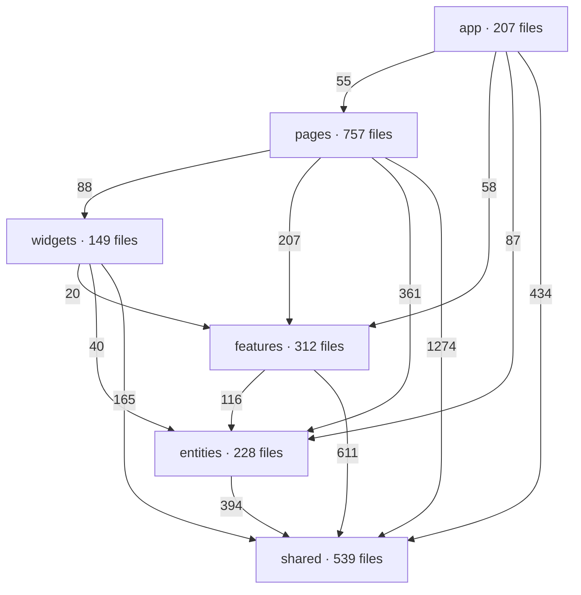

# From Bubble to Next.js in 4 months: the Playgram case study (mini)

_The [full version](./playgram.md) is about six times this long. There's also a [nano version](./playgram.nano.md) if this is still too much. Part I of II._

_Disclaimer: the disclosures in this case study were approved by Playgram management, i.e. no NDA breach._

---

Playgram is a serious AI chat product — multiple providers and models, realtime team and project chats, image and file libraries, memory and knowledge management, voice input — and it was built entirely in Bubble, a no-code app builder. Between March and August 2026 I rebuilt it as a Next.js 16 codebase. 158 days, 1,395 units of work on `main`, 1,029 merged PRs, 250,000 lines of production TypeScript, 48 versioned releases, and cold load times from multi-second to sub-second.

I did almost none of the typing. At the peak I was running twenty-plus Claude Code agents at once, and that shift — from three local agents I babysat line by line to twenty in the cloud I reviewed like a manager — is the actual subject here.

[Playgram in use: a screen recording of the chat interface, the model picker, and the file library](https://github.com/user-attachments/assets/16e67cd5-5727-419b-be2b-ffaa2541a44c 'video')

## Why leave a working no-code app

Three reasons, in the order they mattered.

**Performance has a floor you can't optimise past.** Bubble's own docs explain that the platform ships the code for every element on a page, visible or not, before it draws anything — and that installed plugins load whether you use them or not. Developers measuring a page with a single text heading on it report a Lighthouse Speed Index of 1.5–1.7 seconds. That's the floor, and no amount of app-side tuning reaches under it.

**The platform has edges, and everyone hits them.** The most-downloaded plugin in the entire Bubble marketplace, at 538,000 installs, is one that lets you run raw JavaScript. The most popular thing anyone ever built for the platform is a way out of it. Playgram's makers are Zeroqode, with a ballpark of 800 plugins shipped, and they still felt the walls.

**And the AI tooling wasn't there.** They wanted the thing that having real code makes possible, and they wanted it for themselves — the people who'd live in this codebase were the same people who had drawn the app. Three examples of what that turned into once the code existed. Billing went from a number attached to a price — never shown, never enforced — to a metered balance, every reply priced from the real provider cost, decremented live and enforced server-side at send time: fifteen days, with carry-over at renewal and per-member caps another week and a half on top. Model access control, per-group allow and deny lists with per-member overrides on top, about two. And a per-query CO₂e estimate, asked for by a university customer, went from request to production in eleven days — built by one of the Bubble developers, after I'd handed the codebase over.

## What made it hard

The Bubble export — the "code" in "no code", and the thing you feed an agent — is a single minified JSON of 11.6 MB. VS Code won't open it. Meanwhile the app was live and shipping features the whole time, the rewrite had to be pixel-perfect against a design the team had invested heavily in, and the data lived in Bubble's proprietary format with no easy path out. That last one is Part II's story.

## Setting the table

**The split (10/10).** First thing I did was write a Python script that cuts the export into files an agent can navigate — by _shape_ rather than by size. It works out what a Bubble "workflow" is and how its constituent "actions" look, then recovers human-readable names from the export's own `name` fields, so a click handler lands at `pages/index/workflows/buttonclicked_btnaw0/` with one file per step, in order, as ES module imports. It reads like a function body because it is one, transcribed.

The final split is 3,487 files. The part that took real thought was making the cut _stable_, so that re-exporting the app every week produced a legible diff instead of noise. Names derive from content, never position. Ordering is deterministic. Chunks are named by their key range rather than an index, so inserting one entry doesn't renumber eighteen files. Long strings — mostly LLM prompts — get hoisted into `.txt` siblings so they diff as prose rather than as one giant line of `\n` escapes. Once it was done, every button, input group and workflow was tied to a specific file, so a change in the Bubble app showed up as a diff in the relevant one.

**The decision docs (6.5/10).** The first four days produced 23,000 lines of documentation and zero lines of application code. The process: four models from different providers each researched a question independently, in parallel worktrees where none could see the others, then a fifth synthesised — with the model names stripped off the files first, so the judging couldn't be biased for or against any of them.

It worked, and it was too much. On the database question the lone dissenter — one model against three — won both contested points, and the decision doc says so out loud: _"Supabase was chosen despite a lower weighted score… The matrix simply had no row for the factor that decided it."_ Which is the lesson. "But five agents told it would be fine!" sounds like a good argument until it isn't.

> **Whoever writes the code or a document, it's _you_ who gets kicked if things go wrong, and rightfully so.**

**The strutwork (FSD 8.5/10, linting 10/10).** Agents place code by nearest-neighbour. Misfile one import and the next agent copies you, and the one after that. Over time, the likelihood of your codebase getting properly screwed up converges to 1.

So: Feature-Sliced Design, strictly enforced. Six layers, 8,123 internal imports, and **zero** that point upward or sideways — because two separate tools refuse to let us. A second-order effect worth pointing out: the bottom, reusable layers grew nearly three times over while the app-specific top layer didn't quite double. Rigid boundaries make the shared layer the path of least resistance.

Then 362 explicitly enabled lint rules, 28 of them hand-written, every one an `error` because "LLMs treat warnings as negotiable". They're worth the effort because an agent will cheerfully ignore a paragraph of your CLAUDE.md and will never once ship a lint error.

The most feared guardrail of the lot is a script rather than a lint rule: `type-overlap` fails the build if any two type aliases declare the same member. Turning it on at full strength would have failed the build in hundreds of places, so it took a 26-day climb-down: at first it only complained when two types shared three or more fields, then two, then briefly back out to four when we improved the detector, and finally down to a single shared field — thirteen landings and about 1,300 file changes. Worth it, because of what it was written for: we once had a `tokenCounts: { input, output }` shape sitting beside DB columns named `inputTokens`/`outputTokens`. Both type-checked perfectly. Every usage log we wrote recorded zero. We found it months later, by accident.

**Planning (6/10).** We started with one exhaustive migration plan, file paths and all. It became a liability — every path was a promise the codebase kept breaking for good reasons. Next time: big picture only, details as we go.

## Learning to run twenty agents

I resisted cloud agents. The laptop melting past five parallel sessions is what pushed me, and I expected the web UX to be as clumsy as the first Codex, the merge conflicts to be constant, and the whole thing to feel too hands-off — the agent working _somewhere_ that isn't _right here_.

> **But boy could I be wronger.**

Weeks in I was running 20+ at once, capped only by quota. Merge conflicts turned out to be the most overestimated risk of the lot: after more than a thousand merged PRs, agents resolving them properly — reasoning about what changed on each side, not just producing a file that compiles — has never once burned me. It took one skill to encode the footguns.

And the hands-off part inverted completely. **I turned from a boss who's constantly micromanaging his team into one who reviews the outcome, not the process.** My flow is now almost entirely code review on already-made changes, in GitHub's native interface. _(Cloud VMs: 10/10 — you can't go back to the CLI once you've mastered the zen of the cloud.)_

**Thirty-three skills (8/10).** Every repeatable process became a file in the repo: `/plan`, `/implement`, `/pr`, `/finalize`, `/dry`, `/tighten-docs`, `/sync-branch`, and twenty-six more. They compose by pointing at each other — `/implement` runs `/dry` and `/tighten-docs`, then hands off to `/pr`, which loads three more. About four of the thirty-three are stale. Thirty-three files describing how you work is a real asset and also a second codebase, and nothing lints it.

**Plan and implement (9/10).** `/plan` began as a workaround for a Claude Code bug — the plan-approval dialog doesn't survive a web session going idle, so you get the same prompt stacked four times and answers to the superseded copies vanish. So I wrote a skill that does what plan mode does but writes a tracked file in the repo instead of an ephemeral object. It became the core of a [spinoff boilerplate](https://github.com/vzakharov/agent-project-boilerplate) I now use everywhere. It also let me put things into the flow that plan mode has no opinion about — every plan must carry a "DRY notes" section arguing what's shared vs. duplicated _before_ implementation, rather than discovering it in review.

**Context hygiene (9/10).** This is the one I'd tell you first if we had one minute. The single biggest killer of agent productivity — and of your wallet — is bloated context. The mistake I see constantly is people never ending a conversation: do this, and also that, oh and this unrelated thing. Yes, models take a million tokens now. Past 200k you've strayed, and the agent can no longer _use_ all of it reliably even if it can still recall it.

> _on why a 1M-token context window is not a target_
>
> **More megapixels just meant more noise on the matrix.**

> _the rule_
>
> **One session, one thread.**

Which connects straight back to the plan file. If a plan is any good, it has to be sufficient on its own — no part of the conversation that produced it should matter to the quality of the implementation. That's a litmus test: if it isn't sufficient, the plan is bad. And if it _is_ sufficient, you can implement it in a brand-new session. Which you can't do with built-in plan mode, because there's nothing to start _from_ — but a plan file sitting on the feature branch works perfectly. So `/plan` ends by handing me a copyable `/implement <branch>` command, and the next session picks it up cold.

Four sessions per feature, then: plan it, implement it, address the review, finalize it. Always squash-merged, so `main` reads as one clean commit per unit of work rather than an archaeology of how the agent got there.

## The timeline, honestly

They asked for 1.5–2 months. I agreed and missed it. At the two-month mark there was nothing in production. The first production build was day 77; the first workspace actually running on the rewrite was seven weeks after the original deadline; all workspaces were over by day 128.

| Date       | Day | What happened                                                    |
| ---------- | --- | ---------------------------------------------------------------- |
| **6 Mar**  | 1   | First commit — a splitting script and a pile of research.        |
| **25 Apr** | 51  | Development moves into the cloud, on branches and pull requests. |
| **6 May**  | 62  | **The original deadline.** Nothing in production.                |
| **21 May** | 77  | `4.0.0` — first production build.                                |
| **11 Jul** | 128 | `4.3.0` — all workspaces on the rewrite. Bubble is off.          |
| **10 Aug** | 158 | `4.4.3` — the last release that's mostly mine. Handover.         |

The chart of units of work does show where my method changed, and it's a single day: 25 April, when the work moved into the cloud. What takes a few weeks afterwards is the output catching up, not the switch. The number I like best is the dull one: **the median unit of work stays the same size — 375 changed lines before, 384 after — while units per day go from 6.2 to 8.2.** Same-sized pieces, about a third more of them at a time. That's what parallelism looks like from the outside.

## The handover

I shipped `4.4.3` on 10 August and stopped writing code. In the seventeen days since, 49 of the 52 pull requests merged to `main` were the rest of the team's; my three were release notes, a CI permissions fix and some agent tooling.

The rest of the team is three people, and they are the Bubble developers who built Playgram in the first place. Two of them created their GitHub accounts during this project, one on its first day; none had major coding experience before March, beyond some hand-written JavaScript dropped into a plugin here and there. They are not junior at anything — they built a product on a no-code platform that most of the industry says can't hold one — they just hadn't worked in a repository before.

What they shipped in those seventeen days includes a per-query carbon estimate, from the energy inputs recorded per query up to the figure on the analytics tab and a published methodology page behind it, per-project spend, billing that counts the tools and images a reply used rather than just the reply, and a hardening change that stops pasted content from impersonating the app's own instructions to the model. Every one of those PRs came through the same plan-implement-review pipeline described above. The scaffolding was as much the deliverable as the app.

Part II covers CI/CD and the test-bucket problem, data migration, the things that sound simple and aren't — and why everything seemed ALMOST ready at two months and stayed ALMOST ready for two more. Pareto never fails.
